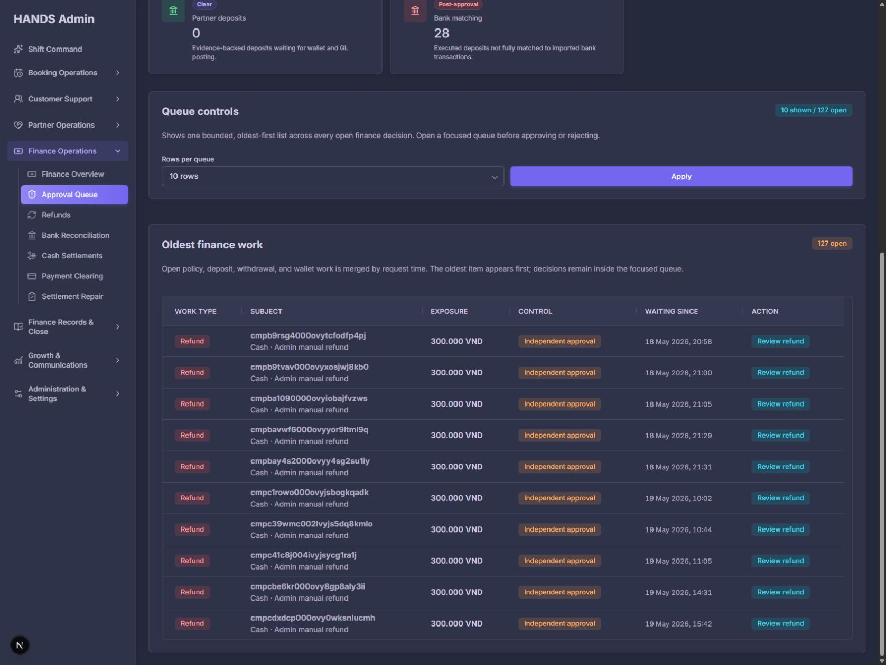
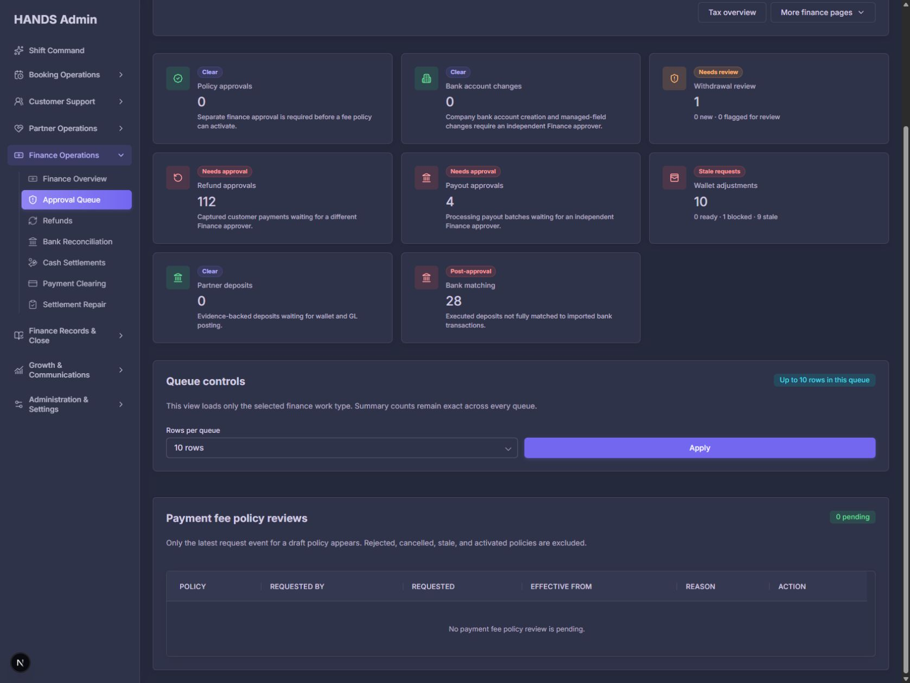
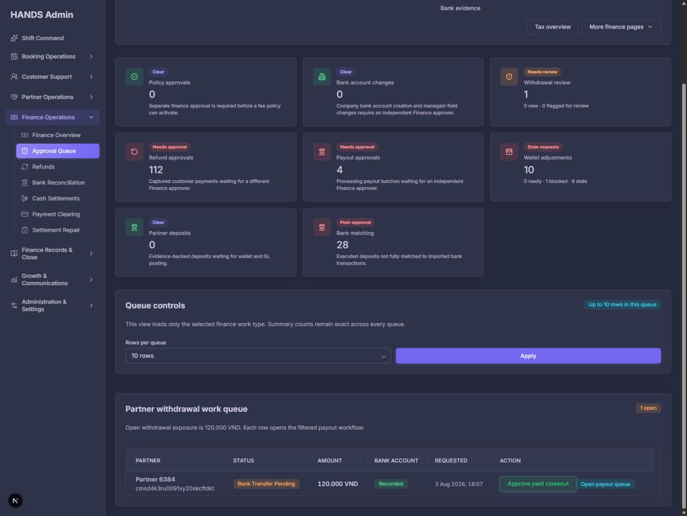
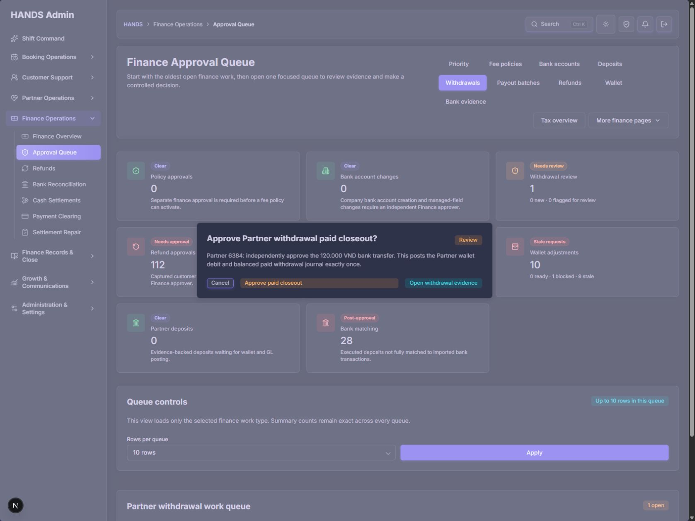
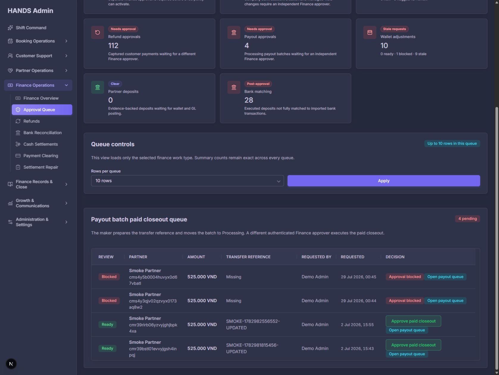
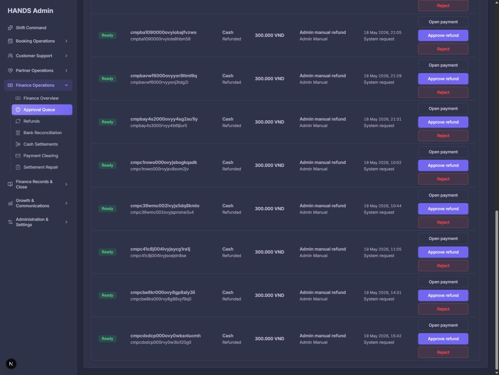
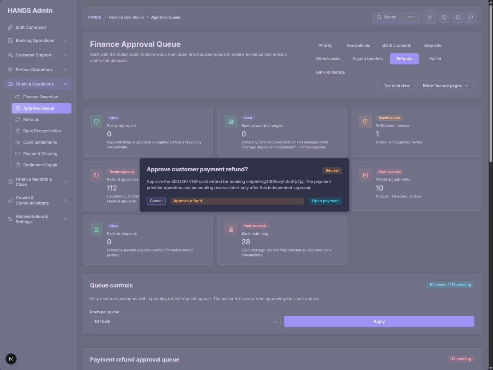
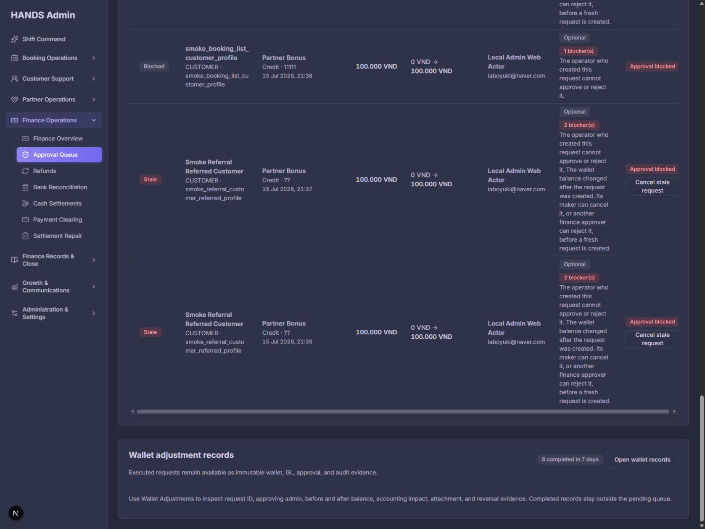
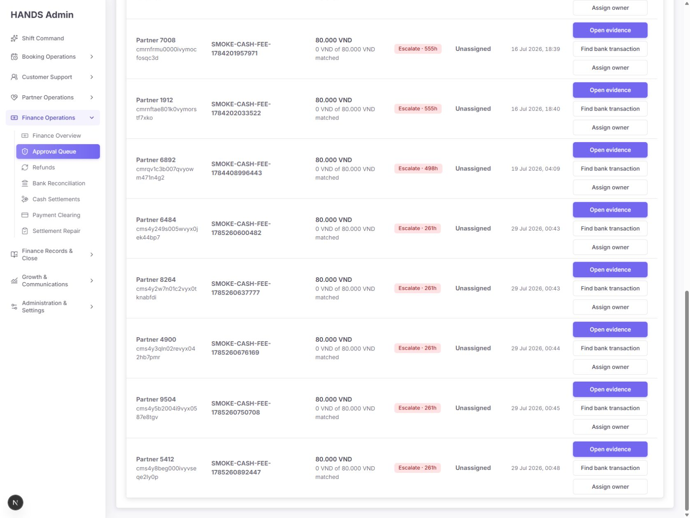
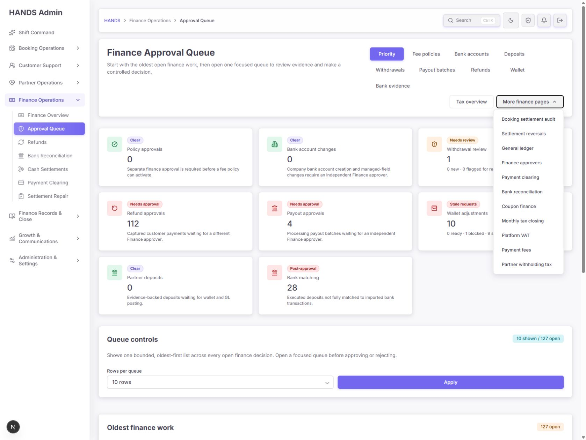

# Finance Approval Queue 심층 감사 보고서

- 감사 일자: 2026-08-08
- 대상: `http://localhost:3101/finance-tax/approval-queue`
- 검수 화면: 1692×1272 데스크톱, 1440px 이상 운영 환경
- 제외 범위: 1024px 이하 반응형·태블릿·모바일 UI는 검사하지 않음
- 검수 범위: Priority, Fee policies, Bank accounts, Deposits, Withdrawals, Payout batches, Refunds, Wallet, Bank evidence, 확인 모달, 필터, 보조 메뉴, 라이트/다크 테마, 소스·API·테스트 계약
- 구현 변경: 없음. 감사 문서와 증거 스크린샷만 생성함

## 1. 최종 판정

**조건부 미통과 — maker/checker와 증빙 중심 설계는 좋아졌지만, 현재 상태로는 승인 화면이 운영자에게 “실제로 실행 가능한 결정”을 정확히 보장하지 못한다.**

가장 심각한 문제는 환불이다. 실제 화면의 112개 요청이 결제 상태 `Refunded`인데도 `Ready`와 `Approve refund`를 노출한다. API는 결제 상태가 `CAPTURED`가 아니면 실행을 차단하므로 중복 환불이 바로 발생하지는 않는다. 그러나 운영자는 실행 불가능한 요청을 정상 승인 업무로 이해하고 확인 모달까지 들어가게 된다. 실패 후에도 구체 원인이 아닌 일반 `failed` 알림만 받는다. 이는 단순 문구 문제가 아니라 **목록 조회, 준비 상태 분류, 화면 행동, 서버 실행 조건이 서로 다른 상태 계약 오류**다.

또한 페이지는 승인 전 업무 127건과 승인 후 은행 증빙 매칭 28건을 같은 9개 탭 안에 섞는다. 집중 큐로 들어가도 8개 대형 Command card가 반복되어 실제 작업표가 첫 화면 아래로 밀리고, Payout `4 needs approval` 중 실제 실행 가능 건은 2건뿐이다. 운영자가 “무엇을 지금 처리할 수 있는지”보다 “어떤 메뉴가 있는지”를 먼저 읽게 되는 구조다.

### 종합 점수

| 항목 | 점수 | 판정 |
|---|---:|---|
| 운영자 정보 구조 | 2/4 | 승인과 사후 조정이 혼재하고 9개 뷰가 3줄로 분절됨 |
| 결정 무결성·데이터 신뢰 | 1/4 | `REFUNDED` 환불을 Ready로 노출하고 큐 총계가 실행 가능 건수와 다름 |
| 데스크톱 레이아웃(1440+) | 2/4 | 기본 화면은 안정적이나 집중 큐가 묻히고 Wallet 표가 지나치게 넓고 높음 |
| 접근성 | 3/4 | 표와 확인 모달의 기본 의미 구조는 양호하나 반복 링크 이름과 작업 맥락이 부족 |
| 테마·시각 완성도 | 4/4 | 다크/라이트 모두 일관되고 금융 운영 화면에 적절한 밀도와 대비를 가짐 |
| 성능·유지보수성 | 2/4 | 선택 뷰와 무관하게 모든 큐를 조회하며 1,945줄 단일 페이지에 책임이 집중됨 |
| **합계** | **14/24** | **Acceptable foundation / 운영 배포 전 P1 수정 필요** |

## 2. 운영자가 이 페이지에서 즉시 답을 얻어야 하는 질문

1. 지금 내가 실제로 승인하거나 거절할 수 있는 건은 몇 개인가?
2. 막혀 있는 건은 무엇 때문에 막혔으며, 누가 다음 행동을 해야 하는가?
3. SLA를 넘긴 가장 오래된·가장 위험한 건은 무엇인가?
4. 이 결정을 내리기 전에 확인해야 할 증빙과 현재 원장 상태는 무엇인가?
5. 실행하면 결제, 파트너 지갑, GL, 세금, 정산에 어떤 변화가 생기는가?
6. 지금 보는 데이터는 언제 생성된 스냅샷이며, 새 결정을 내려도 안전한가?

현재 화면은 4번과 5번을 위한 기본 구조는 갖추었지만 1·2·3·6번은 충분히 답하지 못한다.

## 3. 화면별 감사

### Step 1 — Priority 상단과 Command board

**상태: 시각적 완성도는 양호, 운영 명령판으로는 과밀**

잘된 점:

- 금융 승인 업무를 한 장소에서 시작하도록 만든 방향은 적절하다.
- 위험 건은 warning/danger, 0건은 success로 구분하여 대략적인 상태는 빠르게 파악된다.
- Wallet은 `0 ready · 1 blocked · 9 stale`로 상태를 분리해 총계의 의미를 설명한다.
- 승인과 거절이 실제 변경을 만들기 전에 별도 확인 단계로 이동한다.

개선할 점:

- 9개 작업공간 탭이 1692px에서도 3줄로 줄바꿈된다. 상단 조작부가 “주요 작업공간”이 아니라 링크 모음처럼 보인다.
- 8개 Command card가 모든 집중 뷰에서 그대로 반복된다. 운영자가 Refund/Payout/Withdrawal을 선택한 뒤에도 같은 8개 요약을 다시 통과해야 한다.
- 0건인 Policy, Bank account, Deposits가 활성 큐와 같은 크기·시각 무게를 가진다. Priority에서는 `Clear 3`으로 접거나 하단에 축약하는 편이 낫다.
- Withdrawal은 총 1건인데 상세가 `0 new · 0 flagged for review`라서 그 1건이 무엇인지 설명하지 못한다. 실제 건은 `BANK_TRANSFER_PENDING`이므로 `1 paid closeout pending`이 맞다.
- Payout은 `4 needs approval`이지만 실제로는 `2 ready · 2 blocked`다. 총 4건을 승인 가능 업무처럼 표현하면 안 된다.
- Refund card는 `Captured customer payments`라고 설명하지만 실제 행은 `Refunded`다. 화면 문구와 데이터가 정면으로 충돌한다.
- Priority 127건은 승인 업무만 합산하고 Bank matching 28건은 제외한다. 이는 합리적이지만 화면에서 `127 approval decisions`와 `28 post-approval matches`로 범위를 명확히 분리해야 한다.

권장 구조:

| Ready now | Blocked | Over SLA | Exposure | Post-approval matching |
|---:|---:|---:|---:|---:|
| 실제 실행 가능 합계 | 증빙/권한/상태 문제 | SLA 초과 | 승인 금액 합계 | 별도 Bank Reconciliation 링크 |

Command board는 Priority에서만 전체를 보여주고, 집중 뷰에서는 `Refunds 112 · Ready 0 · State mismatch 112 · Oldest 82d`와 같은 한 줄 요약으로 바꾼다.

### Step 2 — Priority oldest-first 통합 작업표

**상태: 오래된 업무 발견에는 유용하나 실행 맥락이 끊김**

- 서로 다른 승인 유형을 요청 시간으로 합쳐 가장 오래된 건부터 보여주는 원칙은 좋다.
- 현재 첫 행들은 5월 18~19일 환불 요청으로, 감사 시점 기준 약 82일 방치된 건이다.
- 그러나 날짜만 있고 `82d overdue`나 SLA 수준이 없어서 운영자가 직접 날짜를 계산해야 한다.
- Owner/assignee가 없어 누가 처리 중인지, 미배정인지 알 수 없다.
- `Review refund`는 해당 환불을 선택하지 않고 일반 Refund 탭만 연다. 같은 112개 목록 안에서 사용자가 다시 대상을 찾아야 한다.
- 접근성 관점에서도 여러 행이 모두 `Review refund`라는 동일 링크 이름을 사용한다. 링크 목록만 탐색하면 어느 결제·금액·대기일인지 구분할 수 없다.
- Priority 설명은 `policy, deposit, withdrawal, wallet`만 언급하지만 실제 빌더에는 bank account, payout, refund도 포함된다.
- 현재 정렬은 오직 `createdAt asc`다. 오래된 항목이 중요하긴 하지만 실행 불가능한 항목이 Ready 업무를 밀어내지 않도록 `SLA breach → Ready/Blocked → amount/risk → age` 원칙이 필요하다.

권장 행:

| Risk | Type | Subject | Amount | Age/SLA | Control | Owner | Action |
|---|---|---|---:|---|---|---|---|
| P1 | Refund | Booking … | 300k | 82d overdue | Payment already refunded | Unassigned | `Open state repair` |

### Step 3 — 0건 집중 큐

**상태: 기능상 정상, 빈 상태가 지나치게 늦게 보임**

Fee policies, Bank accounts, Deposits는 모두 0건이었다. 그러나 집중 뷰에 들어가도 상단 Command board, Queue controls, 빈 표 header를 모두 지나야 `No … waiting`을 확인할 수 있다.

개선 방법:

- 선택한 큐가 0건이면 상단에서 즉시 `No fee policy approvals pending` 성공 상태를 보여준다.
- 0건인 경우 `Rows per queue` 제어와 빈 표 header를 숨긴다.
- `Back to Priority`와 인접한 활성 큐 두세 개만 보조 링크로 제공한다.
- 0건 큐를 상단의 9개 primary 탭에서 계속 같은 무게로 유지하기보다 `Other approvals` 아래 보조 선택지로 묶는 방안이 적절하다.

### Step 4 — Withdrawal 큐와 paid closeout 확인

**상태: 확인 단계는 안정적, 승인 증빙 요약이 부족**

잘된 점:

- `BANK_TRANSFER_PENDING`, 금액, 파트너, 요청 시각을 한 행에서 확인할 수 있다.
- 확인 화면은 wallet debit과 balanced journal이 한 번만 기록된다는 효과를 설명한다.
- 확인 모달은 `role=alertdialog`, `aria-modal=true`, 배경 `aria-hidden`, body scroll lock을 적용하며 최초 초점이 Cancel로 이동했다. 고위험 행동의 접근성 기본은 양호하다.

부족한 증빙:

- 목적지 은행명과 마스킹 계좌, transfer reference, 실제 송금 증빙 상태가 행과 확인 모달에 없다.
- `Bank account: Recorded`만으로는 돈이 어느 계좌로 갔는지 검증할 수 없다.
- maker/요청자와 현재 approver가 다른 사람인지 확인 화면에서 재확인되지 않는다.
- 승인 후 잔액 변화, 관련 withdrawal/payout ID, 증빙 생성 시각이 없다.
- `Open withdrawal evidence`는 별도 화면으로 보내지만, 운영자가 돌아왔을 때 같은 승인 대상을 유지한다는 보장이 약하다.

확인 모달에는 최소 `Partner / amount / bank last4 / transfer ref / evidence / requested by / requested at / wallet before→after / journal effect`를 읽기 전용 요약으로 포함한다. 정책상 필요하다면 `Evidence reviewed` 체크 또는 승인 근거를 요구한다.

### Step 5 — Payout batches

**상태: 차단 사유는 보이지만 대표 수치와 정렬이 잘못됨**

- 4건 중 2건은 transfer reference가 없어 Blocked, 2건은 Ready다. 차단 사유를 행에서 보여주는 점은 좋다.
- 그러나 card와 결과 label은 4건 모두 `Needs approval`로 취급한다. 운영자의 실제 처리량은 2건이다.
- Blocked인 7월 29일 건이 Ready인 7월 2일 건보다 위에 표시되는데 정렬 기준 안내가 없다.
- 초록색 `Approve paid closeout` 버튼은 실행 전인데도 이미 성공한 행동처럼 보인다. warning/primary review 톤이 더 적절하다.
- 확인 화면은 transfer ref, linked earnings 수, withholding, wallet/GL 효과를 요약해야 한다.

권장 제목: `Payout closeout · 2 ready · 2 blocked · 4 total`

기본 정렬: `Ready and oldest first`, 차단 건은 별도 `Blocked` 섹션에 모으고 unblock owner를 보여준다.

### Step 6 — Refund approvals

**상태: P1 상태 계약 오류 — 현재 큐를 승인 업무로 사용하면 안 됨**

화면 증거:

- 112개 요청이 `REQUESTED` 상태로 남아 있다.
- 결제 상태 열은 샘플 행 모두 `Refunded`다.
- 그럼에도 review state는 `Ready`, 행동은 `Approve refund`와 `Reject`다.
- 확인 모달은 `provider operation and accounting reversal start only after approval`이라고 말하지만 현재 결제가 이미 Refunded라는 사실을 표시하지 않는다.

코드 증거:

- 큐 조회는 refund의 `status: 'REQUESTED'`만 필터링하고 payment status를 승인 조건에 넣지 않는다 (`admin.service.ts:21690-21712`).
- review state는 승인자 역할과 maker 분리만 보고 결정한다 (`admin.service.ts:21907-21925`).
- UI는 review state가 READY이면 승인 버튼을 렌더링한다 (`page.tsx:966-1031`).
- 실제 refund 서비스는 payment가 `CAPTURED`가 아니면 conflict로 차단한다 (`payments.service.ts:659-681`).
- server action은 해당 오류를 모두 일반 `failed`로 축약한다 (`actions.ts:134-147`).

따라서 이것은 **중복 환불 실행 취약점으로 확인된 것은 아니지만, 운영자가 실행 불가능한 결정을 정상 업무로 보게 되는 심각한 신뢰 문제**다.

필수 수정:

1. Refund READY 조건을 `refund.status=REQUESTED && payment.status=CAPTURED && independent approver`로 서버 모델에서 단일 계산한다.
2. `REFUNDED`, `RELEASED`, `FAILED` 등 불일치 건은 Approval queue에서 제거하지 말고 `State mismatch / repair` 큐로 분리해 원인과 복구 행동을 제공한다.
3. 대표 수치를 `0 ready · 112 state mismatch`처럼 분리한다. 현재처럼 112를 Needs approval로 표시하지 않는다.
4. 확인 모달에 current payment status, refund request status, provider operation state, settlement/reversal 상태를 표시한다.
5. 실행 직전에 payment/refund 상태와 version/updatedAt을 다시 검사하고 stale이면 결정을 중단한다.
6. 실패 알림에 안전한 운영자 메시지와 recovery link를 제공한다. 예: `Payment is already refunded. Open payment timeline.`
7. `paymentStatus=REFUNDED + refundStatus=REQUESTED` fixture가 READY가 되지 않는 API·page 회귀 테스트를 추가한다.

표 밀도도 개선이 필요하다. 행마다 Open payment, Approve, Reject가 세로로 쌓여 10개 행만으로 한 화면을 가득 채운다. Booking/payment 셀 자체를 상세 링크로 만들고 Approve/Reject는 나란히 배치하거나 detail drawer 안으로 옮긴다.

### Step 7 — Wallet adjustments

**상태: 사전검증 정보는 우수, 1440+ 환경에서도 표가 과도하게 넓고 높음**

잘된 점:

- before→after balance, maker, evidence, blocker, canCancel/canReject 정책을 보여준다.
- Ready/Blocked/Stale 필터와 개별 preflight 결과가 있다.
- 현재 0 ready · 1 blocked · 9 stale라는 사실을 명확히 설명한다.

문제:

- 표는 CSS `min-width:1320px`의 8개 열을 강제하고 내부 가로 스크롤을 만든다 (`globals.css:1478-1527`).
- Evidence와 blocker 문장이 좁은 열에서 여러 줄로 깨져 한 행이 매우 높아진다.
- 긴 ID와 원인이 셀마다 반복되어 핵심 금액·잔액·상태의 수평 비교가 어렵다.
- `Optional` evidence badge와 `2 blockers`가 함께 보여 증빙 선택 사항과 승인 차단 조건의 관계가 혼란스럽다.
- 목록 정렬은 newest-first인데 9/10이 stale인 상황에서는 오래된 것부터 정리하는 흐름이 더 적합하다.

권장 간결 행:

| State | Owner/request | Amount | Balance delta | Age | Primary blocker | Action |
|---|---|---:|---:|---|---|---|

증빙 전문, 전체 blocker, 원장 영향은 행 확장 또는 detail drawer에서 보여준다. 기본 화면은 1692px에서 내부 가로 스크롤 없이 읽혀야 한다.

### Step 8 — Bank evidence

**상태: 개별 화면은 유용하나 Approval Queue의 정보 구조와 중복**

- 28개 open, 미배정 상태, remaining amount, SLA 261~601h, 실행 시각을 제공하는 것은 운영 가치가 높다.
- 그러나 화면 설명 자체가 `already executed`, `not another approval`이라고 명시한다. 이 업무는 승인 큐가 아니라 사후 Bank Reconciliation이다.
- 사이드바와 More finance pages에 이미 Bank reconciliation 진입점이 있다. 동일 책임을 Approval Queue 안에 별도 9번째 작업공간으로 두면 owner와 SLA의 진실이 어디인지 모호해진다.
- 현재 기본 필터가 All owners / All SLA라서 600시간 이상·미배정 건도 다른 건과 섞인다.
- 행 행동은 Open evidence가 먼저이고 Assign이 뒤다. 미배정 큐에서는 `Take ownership`이 첫 행동이어야 한다.

권장:

- Bank evidence의 canonical workspace를 `/finance-tax/bank-reconciliation`로 통일한다.
- Approval Queue에는 `28 post-approval bank matches · 28 unassigned · oldest 601h` 경고 스트립과 링크만 남긴다.
- 현 구조를 유지한다면 페이지 명칭을 `Finance Control Queue`로 넓히고 `Approvals / Post-approval controls`를 명확히 분리한다. 하지만 이미 Bank Reconciliation 페이지가 있으므로 이동·통합이 더 효율적이다.

### Step 9 — More finance pages와 전체 IA

**상태: 링크는 풍부하나 분류와 중복 제거 필요**

메뉴는 Booking settlement audit, Settlement reversals, General ledger, Finance approvers, Payment clearing, Bank reconciliation, Coupon finance, Monthly tax closing, Platform VAT, Payment fees, Partner withholding tax를 한 평면 목록으로 보여준다.

문제:

- Payment clearing과 Bank reconciliation은 이미 좌측 내비게이션에도 있어 중복된다.
- 감사 기록, 실시간 처리, 월 마감, 정책 설정이 같은 레벨에 섞인다.
- 승인 업무에 직접 필요한 Finance approvers가 오히려 More 메뉴 안에 숨겨져 있다.

권장 그룹:

- `Records & audit`: Booking settlement audit, Settlement reversals, General ledger
- `Reconciliation`: Payment clearing, Bank reconciliation
- `Tax close`: Monthly tax closing, Platform VAT, Partner withholding tax
- `Configuration`: Payment fees, Coupon finance, Finance approvers

현재 좌측 내비게이션에 노출된 항목은 More 메뉴에서 제거하거나, 메뉴를 `Related finance tools`로 바꾸고 현재 업무와 직접 관련된 4~5개만 보여준다. Approval Queue 헤더에는 `Approver coverage`를 직접 노출하는 편이 좋다.

## 4. 전역 문제와 우선순위

### P1 — 운영 배포 전 필수

#### P1-1. Refund 상태 계약 통일

`CAPTURED`가 아닌 payment는 절대 READY나 Approve로 노출하지 않는다. 상태 불일치는 repair queue로 분리하고 구체 실패·복구 경로를 제공한다.

#### P1-2. `Ready / Blocked / Stale / State mismatch`를 모든 총계의 기본 단위로 사용

- Payout: `2 ready · 2 blocked`, 대표 위험 수치는 2 ready
- Refund: 현재 데이터 기준 `0 ready · 112 state mismatch`
- Withdrawal: `1 paid closeout pending`
- Wallet: 기존 0/1/9 분류 유지
- Priority 총계도 단순 pending 합이 아니라 실행 가능/차단/불일치로 분해한다.

#### P1-3. 집중 뷰에서 Command board 반복 제거

전체 8개 card는 Priority 전용으로 제한한다. 집중 뷰에서는 선택 큐의 제목·상태·필터·표가 첫 화면에 나타나야 한다.

#### P1-4. 데이터 신선도와 Refresh 제공

API는 `generatedAt`을 반환하지만 화면에는 노출하지 않는다 (`admin.service.ts:21758-21760`).

- 자동 갱신이 없다면 `Snapshot updated HH:mm:ss`와 명시적 Refresh를 제공한다.
- 승인 직전 서버 preflight를 다시 실행하고 상태가 달라졌으면 모달을 닫고 새 상태를 설명한다.
- 만료 기준을 정해 2~5분 지난 화면에는 `Stale snapshot`을 표시한다.

#### P1-5. 고위험 승인 확인에 증빙 스냅샷 포함

Withdrawal, Payout, Refund 확인 모달에 식별자·현재 상태·maker·증빙·금액·목적지·원장 효과를 포함한다. 별도 링크를 열어야만 핵심 증빙을 알 수 있는 구조는 승인 실수를 유발한다.

#### P1-6. Wallet 표를 1440+ 기준으로 다시 설계

1692px에서 내부 가로 스크롤과 과도한 행 높이를 제거한다. blocker/evidence 전문은 확장 영역으로 옮기고 기본 7열 이하로 축소한다.

#### P1-7. Priority 행동을 대상별 deep link로 변경

모든 행 action은 특정 request ID를 보존해야 한다. `Review refund`는 일반 refunds 탭이 아니라 해당 환불 drawer/anchor/confirm entry로 이동한다. 접근 가능한 이름에도 유형·대상·금액·age를 포함한다.

#### P1-8. Bank evidence를 Bank Reconciliation로 통합

사후 matching은 승인 전 의사결정과 분리한다. 동일 데이터를 두 페이지가 각각 소유하지 않도록 canonical owner, 필터, SLA, assignment를 하나로 통일한다.

### P2 — 다음 개선 주기

1. **선택 뷰별 조회 최적화:** 페이지는 `reconciliation`을 제외한 모든 뷰에서 동일 approval API를 호출하고, API는 선택 유형과 무관하게 14개 주요 조회를 병렬 실행한다 (`page.tsx:160-183`, `admin.service.ts:21343-21720`). `view`를 API 계약에 전달해 필요한 큐, 정확한 summary, 관련 preflight만 조회한다.
2. **페이지 책임 분리:** `page.tsx`가 1,945줄/85,472 bytes로 view parsing, fetch, priority model, 9개 렌더러, 확인 모델을 모두 가진다. route는 유지하되 `queue model`, `priority table`, `focused queue`, `confirmation model`로 파일 책임을 분리한다.
3. **9개 탭 축약:** `Priority | Refunds | Payouts | Withdrawals | Wallet | Other approvals` 정도로 1행을 유지하고 Policy/Bank account/Deposits는 Other approvals 안에서 선택한다.
4. **빈 상태 압축:** 0건이면 controls/table header를 숨기고 한 줄 성공 상태를 먼저 보여준다.
5. **행 정렬 기준 표시:** 각 큐에 `Ready first · oldest within state` 또는 `Oldest first`를 표시하고 구현과 테스트를 통일한다.
6. **필터 적용 단순화:** `Rows per queue`는 Priority에서는 `Rows shown`으로 바꾼다. 한 개 select를 위한 큰 Apply 버튼 대신 자동 적용 또는 작은 inline Apply를 사용한다.
7. **canonical URL:** Priority 기본 링크는 `view`를 생략하지만 form은 `view=priority`를 만들어 두 URL이 공존한다 (`page.tsx:1209-1227`). 기본 상태를 하나로 canonicalize한다.
8. **필터 보존:** Bank matching card는 `take`와 필터를 보존하지 않는 hard-coded href다 (`page.tsx:423-432`). 공통 URL builder를 사용한다.
9. **행 행동 밀도 축소:** Open detail은 subject link로, approve/reject는 나란히 또는 drawer에서 제공한다. 세로 3버튼 반복을 피한다.
10. **문구 수정:** Priority 설명에 bank account/payout/refund를 포함하고, `Captured customer payments`는 실제 eligibility 계약과 연결한다.

### P3 — 시각·마이크로카피 다듬기

- 3열 Command card의 마지막 2개만 남는 불균형을 줄인다.
- 승인 전 버튼에 success green을 사용하지 않고 review/warning tone을 사용한다.
- Raw ID는 short ID + copy affordance로 표시하고 전체 값은 상세에서 제공한다.
- `System request`, `Admin Manual`, `Recorded`, `Missing` 같은 모호한 용어를 `Requested by automated closeout`, `No transfer reference`처럼 운영 행동 중심으로 바꾼다.
- 0건 큐에는 `All clear`와 마지막 확인 시각을 보여준다.

## 5. 권장 최종 정보 구조

### 공통 헤더

1. `Finance Approval Queue`
2. `Snapshot updated HH:mm` + `Refresh`
3. `Approver coverage` 링크
4. 작업공간 1행: `Priority | Refunds | Payouts | Withdrawals | Wallet | Other approvals`

### Priority

1. 요약: Ready now / Blocked / State mismatch / Over SLA / Exposure
2. 정렬 설명과 최소 필터: `Risk | Oldest`
3. 통합 작업표: Risk, Type, Subject, Amount, Age/SLA, Control, Owner, Action
4. 0건 큐는 `All clear` 접힘 영역
5. Post-approval bank matching은 별도 경고 스트립으로 Bank Reconciliation에 연결

### Focused queue

1. 선택 큐 제목과 `ready/blocked/stale/mismatch` 분해
2. 해당 큐에 필요한 필터만 표시
3. 실제 작업표가 첫 화면 안에 시작
4. 행 클릭 시 detail drawer: 증빙, 타임라인, maker/checker, 원장 영향, 결정
5. 승인 확인 시 최신 preflight 재검사

## 6. 구현 수용 기준

### 데이터 계약

- [ ] `payment.status !== CAPTURED`인 refund request는 READY가 아니다.
- [ ] `REFUNDED + REQUESTED`는 `STATE_MISMATCH`로 분류되고 Approve가 없다.
- [ ] Payout 총계는 ready와 blocked를 분리하며 카드 대표 문구가 정확하다.
- [ ] Priority 합계와 각 큐 상태 합계가 일치한다.
- [ ] approval과 post-approval matching 합계가 화면에서 별도로 선언된다.

### 운영 흐름

- [ ] 집중 큐의 제목·필터·첫 행이 1692×1272 첫 화면에 보인다.
- [ ] Priority 행에서 특정 request로 한 번에 이동한다.
- [ ] 고위험 확인 모달에서 현재 상태와 핵심 증빙을 모두 확인할 수 있다.
- [ ] stale snapshot에서 승인 시도 시 최신 상태를 설명하고 안전하게 중단한다.
- [ ] 실패 알림이 원인과 다음 행동을 알려준다.

### 데스크톱 UI

- [ ] 1440px 이상에서 primary workspace가 한 줄이다.
- [ ] Wallet 표에 내부 가로 스크롤이 없고 한 행의 기본 높이가 과도하지 않다.
- [ ] 0건 큐가 대형 Command board와 빈 표를 반복하지 않는다.
- [ ] 모든 action link의 접근 가능한 이름이 행 대상을 구분한다.

### 성능·코드

- [ ] 선택 뷰는 필요한 queue query/preflight만 실행한다.
- [ ] Priority summary와 focused queue payload가 분리·캐시 가능하다.
- [ ] page route는 유지하되 view/model/confirmation 책임을 별도 모듈로 분리한다.
- [ ] `REFUNDED + REQUESTED`, payout blocked/ready, stale snapshot 회귀 테스트가 추가된다.

## 7. 검증 결과와 한계

검증 결과:

- Admin Web 집중 테스트: 2 files, 27 tests 모두 통과.
- API의 기존 finance approval queue 집중 테스트: 1 test 통과(동일 파일의 비대상 572 tests는 필터로 제외).
- 기존 테스트는 confirmation, wallet blocker, 필터, server action의 기본 동작을 확인한다.
- 현재 테스트 fixture의 refund payment는 `CAPTURED`만 사용하므로 실제 화면의 `REFUNDED + REQUESTED` 모순을 잡지 못한다 (`admin.service.spec.ts:26308-26327`).
- 로컬 warm navigation은 약 787ms였고, Priority 25행 화면은 약 1,022 DOM elements, 92 links, 2,940px 문서 높이였다. 이는 로컬 참고값이며 production 성능 판정값은 아니다.
- 브라우저 개발 로그에서 application warning/error는 관찰되지 않았고 React 개발 안내와 HMR 연결 로그만 확인됐다.
- 페이지 단일 파일은 1,945줄/85,472 bytes다.

한계:

- 금전 변경을 만들 수 있는 Approve/Reject 최종 제출은 실행하지 않았다.
- 실제 payment gateway·bank statement·GL 원장 데이터와의 외부 대사는 수행하지 않았다.
- production DB 실행 계획, p95 latency, 서버 로그, APM은 측정하지 않았다.
- 전용 스크린리더와 자동 대비 측정은 수행하지 않았으며 DOM 의미·초점·육안 대비를 확인했다.
- 1024px 이하 화면은 사용자 요청에 따라 완전히 제외했다.

## 8. 권장 실행 순서

1. Refund 상태 계약과 회귀 테스트를 먼저 수정한다.
2. 모든 큐의 ready/blocked/stale/mismatch 총계를 통일한다.
3. 집중 뷰에서 반복 Command board를 제거하고 실제 작업표를 위로 올린다.
4. 확인 모달에 증빙 스냅샷과 실행 직전 preflight를 추가한다.
5. Bank evidence를 Bank Reconciliation로 통합한다.
6. Wallet 표와 Priority deep link를 정리한다.
7. 마지막으로 선택 뷰별 API 조회 최적화와 1,945줄 페이지 책임 분리를 진행한다.

이 순서를 지키면 “예쁘게 보이는 승인 페이지”가 아니라 **지금 실행 가능한 결정, 막힌 이유, 최신 증빙을 운영자가 신뢰할 수 있는 재무 통제 화면**으로 완성할 수 있다.
