# Finance Approval Queue implementation report

Date: 2026-08-08  
Route: `/finance-tax/approval-queue`  
Status: Implemented and verified locally  
Commit: Not committed

## 1. Operator outcome

The approval workspace now starts with one risk-sorted Priority view and five focused work queues: Refunds, Payouts, Withdrawals, Wallet, and Other approvals. Operators can see which records are executable, which are blocked, which have stale evidence, and which are payment-state mismatches before opening a decision.

The live local dataset verified after the API restart showed:

- Refunds: 112 open, 3 ready, 0 blocked, 109 payment-state mismatches.
- Payout closeout: 4 pending, 2 ready, 2 blocked.
- Withdrawal closeout: 1 open paid-closeout item.
- Wallet adjustments: 10 pending, 0 ready, 1 blocked, 9 stale.
- Other approvals: no active fee-policy, company-bank-account, or deposit approval work.
- Post-approval bank matching: 44 unmatched or partially matched records, kept outside the approval total and linked to Bank Reconciliation.

## 2. Audit issues resolved

### Refund decision safety

- A refund can be decided only while its payment state is `CAPTURED`.
- `REFUNDED` and other non-captured payments are classified as `STATE_MISMATCH`, not as approvable work.
- State-mismatch rows expose the payment timeline only; approve and reject controls are absent.
- The server revalidates payment state immediately before execution and returns a recoverable conflict notice if it changed after the snapshot.
- Maker/approver separation and approver availability are exposed as blockers instead of being inferred in the UI.

### Queue scope and counts

- The API returns an explicit summary for ready, blocked, stale, and state-mismatch work.
- Focused views fetch only their relevant row projection while retaining exact queue counts.
- Bank matching is presented as a separate post-approval follow-up and is not mixed into the approval total.
- Legacy approval-queue reconciliation links redirect to the canonical Bank Reconciliation workspace while preserving supported filters.

### Evidence before mutation

The confirmation dialog now shows the request ID, subject, amount, lifecycle, maker/requested/current approver, bank or reference evidence, primary blocker, wallet impact, GL/settlement/tax consequence, and snapshot time. No mutation was submitted during browser verification.

### UI hierarchy and empty states

- Priority is a compact five-card command board followed by one risk-sorted work table.
- The six primary navigation choices are stable and the three low-volume approval types sit under Other approvals.
- Empty focused queues hide inactive tables and controls and provide Back to Priority plus links to active queues.
- Wallet work is reduced to seven operational columns with evidence in the shared disclosure component.
- Every table region has a unique accessible name.
- Snapshot freshness and a manual Refresh now control replace ambiguous background-refresh expectations.
- Light and dark themes were verified without page-level horizontal overflow.

## 3. Changed files

### API

- `apps/api/src/admin/admin.service.ts`: approval classification, exact summaries, focused projections, current approver evidence, and refund preflight state mismatch.
- `apps/api/src/admin/admin.service.spec.ts`: refund classification, summary, and focused-view regression coverage.
- `apps/api/src/admin/admin-finance.routes.ts`: optional focused `view` contract for the approval queue route.

### Admin Web

- `apps/admin_web/app/finance-tax/approval-queue/page.tsx`: Priority and focused queue information architecture, evidence confirmation, empty states, bank-reconciliation redirect, and honest error handling.
- `apps/admin_web/app/finance-tax/approval-queue/page.spec.tsx`: rendering and contract regressions.
- `apps/admin_web/app/finance-tax/approval-queue/actions.ts`: refund state-conflict recovery and removal of the dead reconciliation assignment path.
- `apps/admin_web/app/finance-tax/approval-queue/actions.spec.ts`: action safety and notice regressions.
- `apps/admin_web/app/finance-tax/approval-queue/finance-approval-snapshot-control.tsx`: generated-time freshness and manual refresh.
- `apps/admin_web/app/finance-tax/approval-queue/finance-approval-snapshot-control.spec.ts`: freshness state coverage.
- `apps/admin_web/app/finance-tax/finance-data-table.tsx`: unique accessible table labels.
- `apps/admin_web/lib/admin-api.ts`: queue summary, review-state, blocker, and evidence contracts.
- `apps/admin_web/app/globals.css`: command board, focused controls, evidence dialog, wallet table, and desktop layout rules.

The repository already contained a large dirty worktree. The file-level status and diff include pre-existing user work; unrelated changes were not reverted or reformatted.

## 4. Verification commands

### Focused Admin Web

```powershell
npm.cmd run test --workspace @massage-vn/admin-web -- app/finance-tax/approval-queue/page.spec.tsx app/finance-tax/approval-queue/actions.spec.ts app/finance-tax/approval-queue/finance-approval-snapshot-control.spec.ts app/finance-tax/finance-data-table.spec.tsx
```

Result: PASS, 4 files and 33 tests.

### Focused API

```powershell
npm.cmd run test --workspace @massage-vn/api -- src/admin/admin.service.spec.ts -t "finance approval queue"
```

Result: PASS, 8 matching tests; unrelated tests skipped by the name filter.

### Scope verification

```powershell
npm.cmd run verify:scope -- -Scope admin
npm.cmd run verify:scope -- -Scope api
```

Results:

- Admin: PASS, 829 files and 4,432 tests; typecheck, lint, query guards, visible-copy guards, and build passed.
- API: PASS, 156 files passed and 1 skipped; 2,017 tests passed and 1 skipped; Prisma validation, policy coverage, typecheck, lint, and build passed.

## 5. Browser verification

Verified with the authenticated local Admin session at 1692x1272 and 1440x900. The tested states were Priority, Refunds, Payouts, Withdrawals, Wallet, Other approvals empty state, confirmation evidence, legacy reconciliation redirect, and dark theme.

Checks completed:

- No page-level horizontal overflow at either viewport.
- Refund state-mismatch rows did not expose decision controls.
- Payout transfer-reference blockers and ready closeouts were distinguishable.
- Withdrawal bank evidence and paid-closeout action were visible.
- Wallet stale and blocked evidence was readable in seven columns.
- The confirmation dialog retained request-specific evidence and was not submitted.
- The focused empty queue omitted inactive table and filter UI.
- A fresh Priority -> Refunds -> Wallet navigation produced no new browser console warnings or errors.
- The legacy reconciliation query redirected to the canonical Bank Reconciliation route.

## 6. Screenshots

Before:

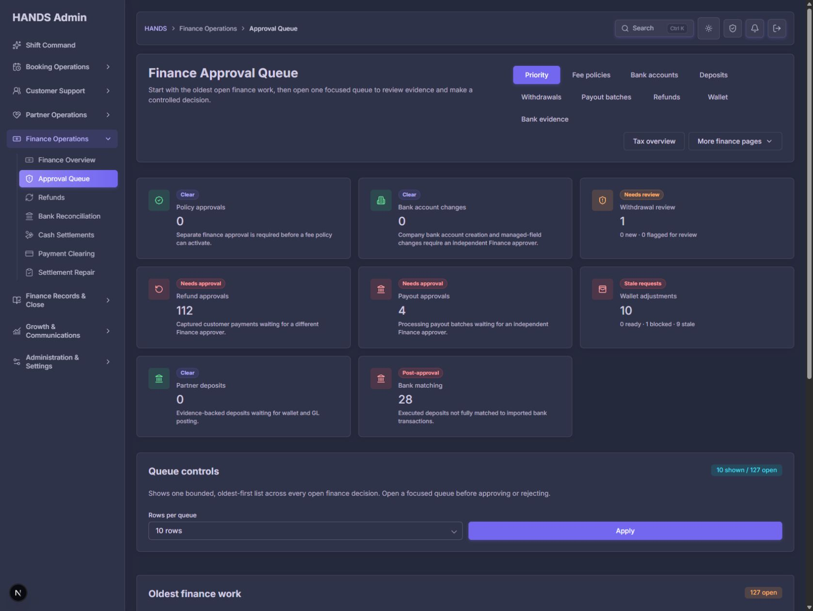

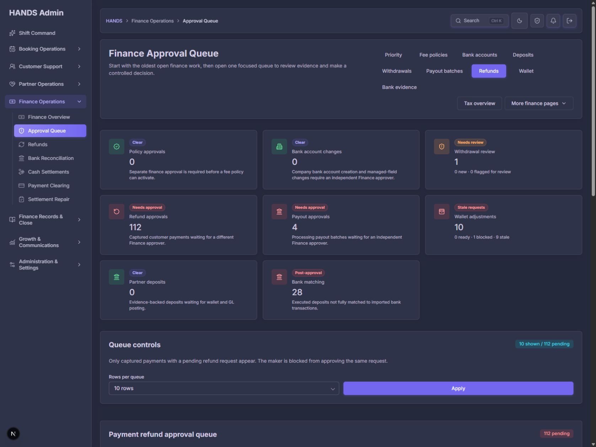

After:

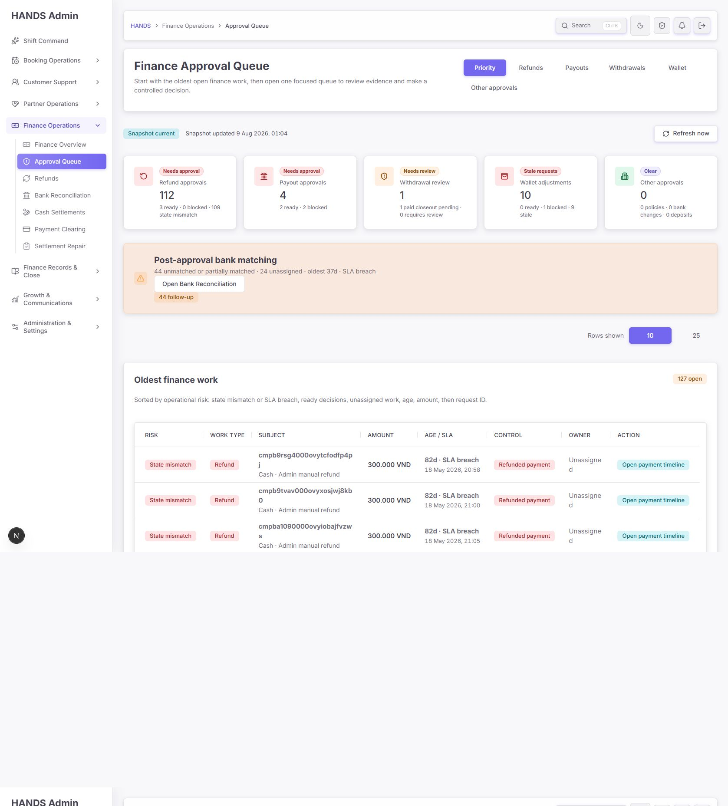

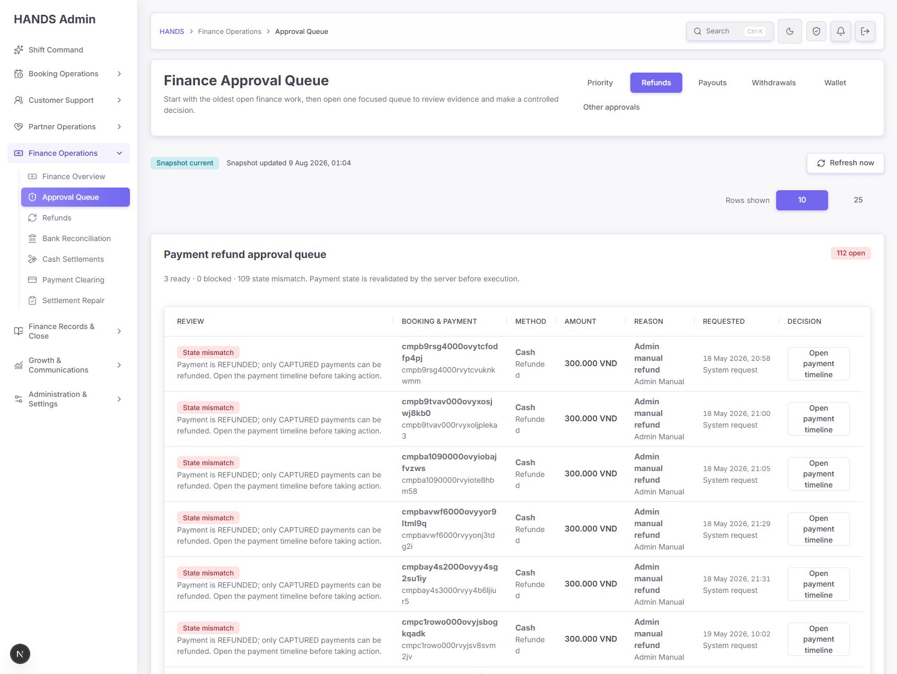

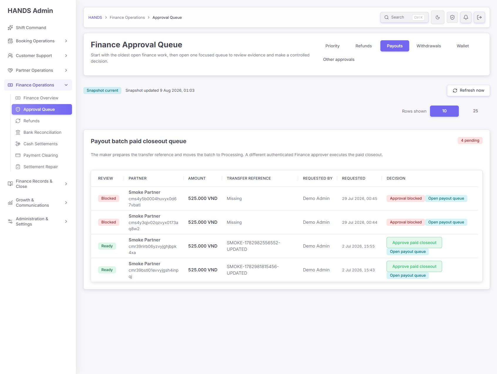

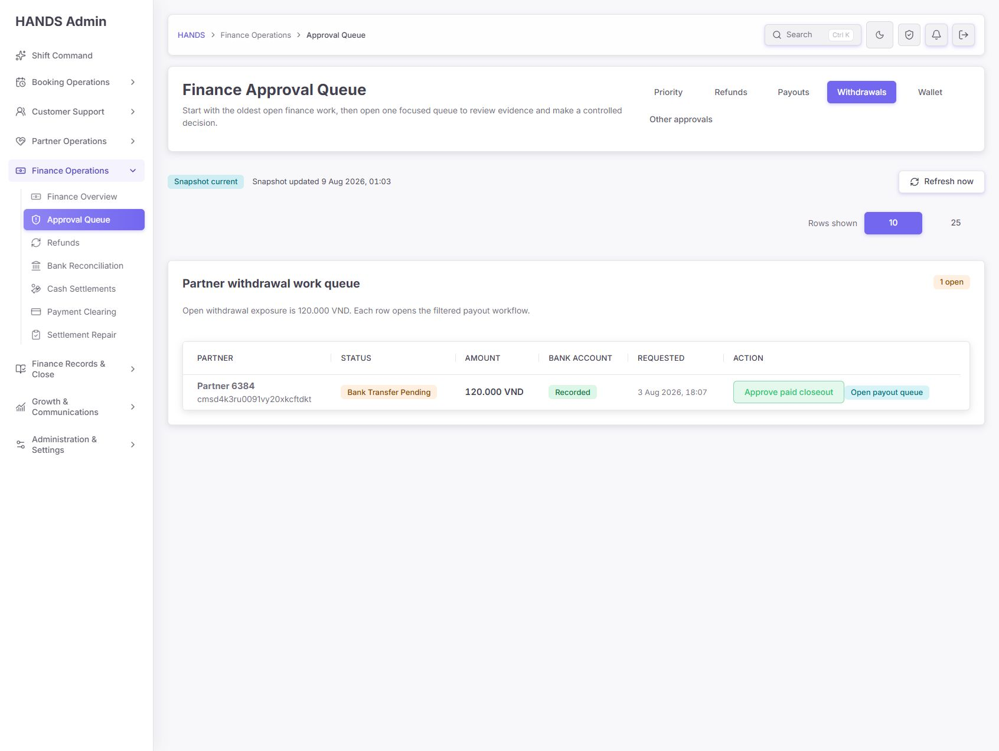

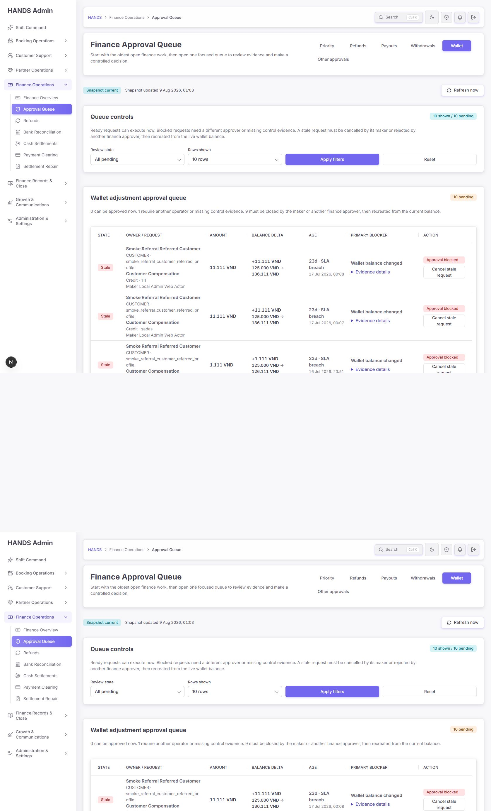

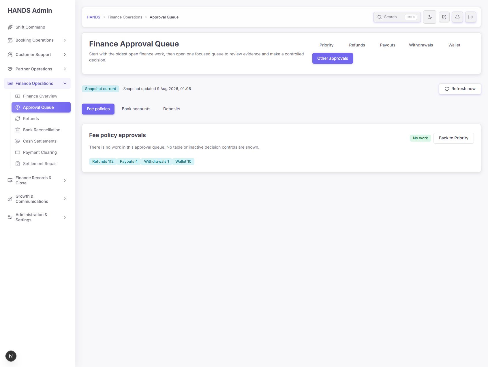

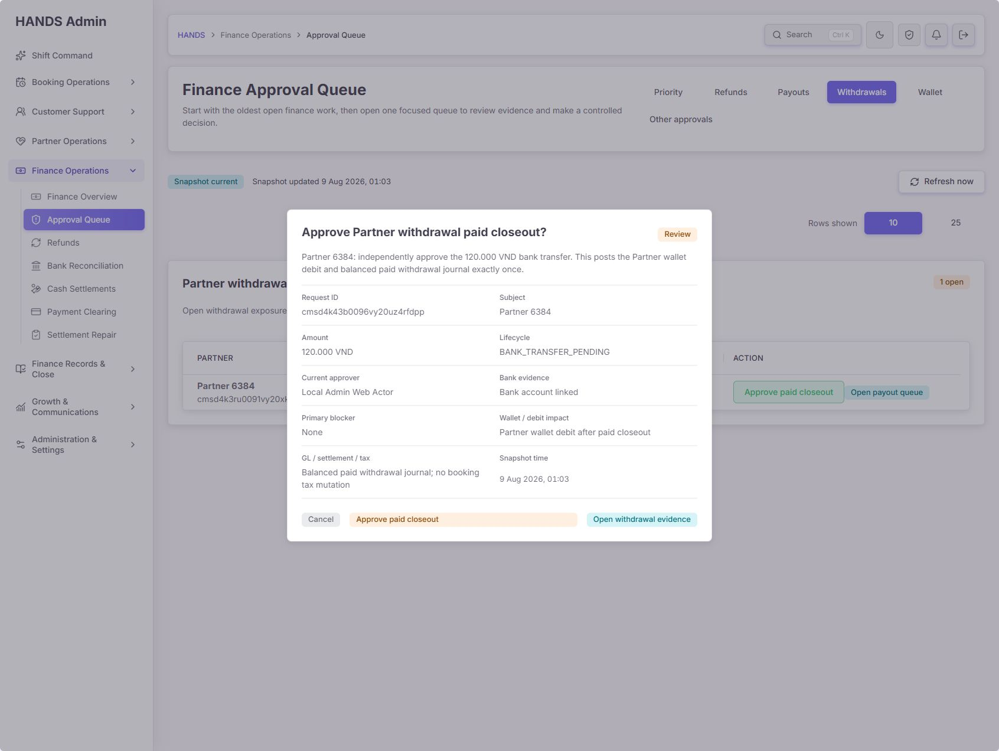

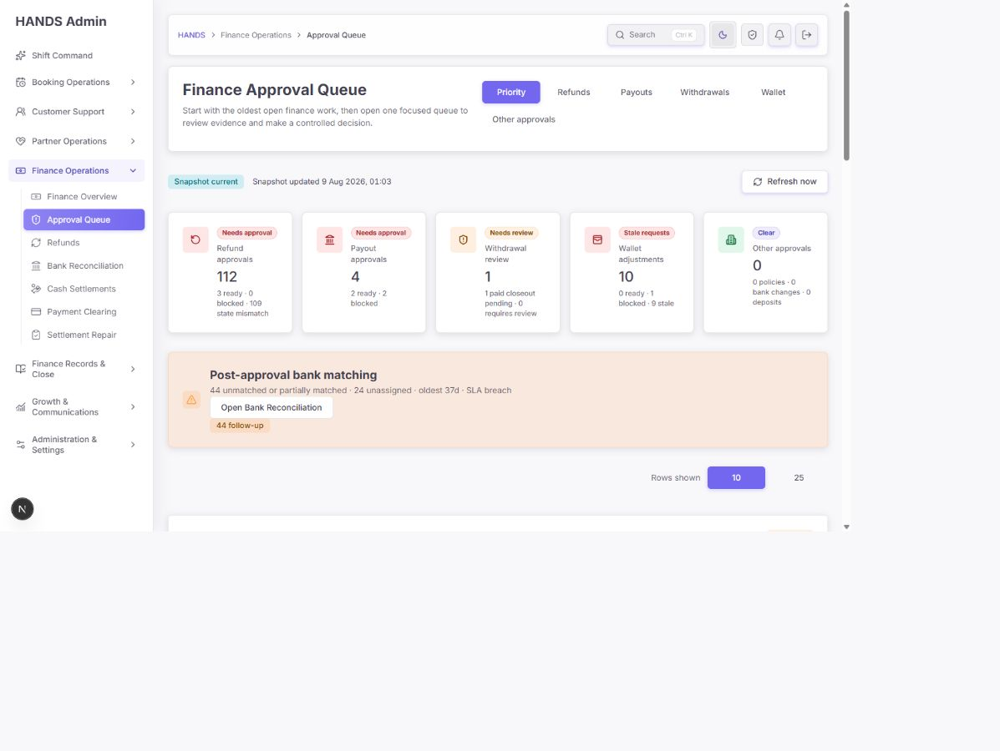

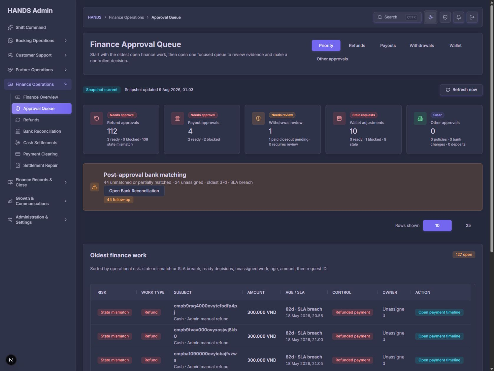

## 7. Protected areas and preservation

- No payment mutation policy in `apps/api/src/payments/payments.service.ts` was changed.
- No Prisma schema, migration, authentication contract, or deployment configuration was changed.
- No new dependency was added.
- Existing user modifications and untracked files were preserved.
- The local compiled API process was restarted so browser verification used the new code; no deployment was performed.

## 8. Remaining risk

- External payment-gateway callbacks and real bank rails were not exercised in this local read-only browser verification.
- The main page remains large. The snapshot control and pure refund classifier were extracted, but a broader component split was deferred to avoid widening this audit fix.
- A controlled staging run should execute one ready refund, one ready payout closeout, and one withdrawal closeout with before/after ledger evidence. That requires an approved mutation window and is the next highest-value validation.
