# Finance Approval Queue 재개선 감사 보고서

- 감사 일자: 2026-08-09 (Asia/Bangkok)
- 대상: `http://localhost:3101/finance-tax/approval-queue`
- 화면 기준: **1440 × 900 데스크톱만 검사**. 1024px 이하 반응형은 검사·평가·권고에서 완전히 제외했다.
- 비교 기준: 2026-08-08 최초 감사 보고서, Codex 구현 프롬프트, 구현 검증 보고서
- 방법: 로그인된 실제 화면 조작, 각 작업공간·확인 모달·빈 상태·다크 테마·새로고침·레거시 리다이렉트 확인, DOM/가로 폭 측정, 코드/API/권한/테스트 교차검증
- 변경 범위: 이번 작업에서는 제품 코드를 수정하지 않았고, 본 보고서와 증거 캡처만 추가했다.

## 1. 최종 판정

**조건부 실패(운영 배포 전 필수 수정 필요)**다.

이전 버전과 비교하면 상태 계약, 정확한 집계, 스냅샷 시각, 환불 상태 불일치 차단, 위험 작업 확인 모달, 빈 큐 처리, 선택 뷰 API 투영, 다크 테마는 분명히 좋아졌다. 그러나 승인 큐의 가장 중요한 목적은 “승인 가능한 건을 실제로 찾아 결정하는 것”인데, 현재 데이터에서는 **환불 3건이 Ready라고 집계되면서도 UI에서 한 건도 열거나 승인할 수 없다.** 최대 25행 제한 전에 오래된 109건의 상태 불일치가 선택되기 때문이다. 숫자는 맞지만 작업은 막혀 있다.

종합 품질은 **68/100, B-**로 평가한다.

| 영역 | 점수 | 판정 |
|---|---:|---|
| 상태·회계 안전성 | 84/100 | 환불 상태 불일치 차단과 서버 재검증은 좋음 |
| 운영 작업 완결성 | 48/100 | Ready 환불 3건이 화면에서 도달 불가 |
| 정보 구조·문구 | 72/100 | 작업공간 분리는 좋아졌지만 “Needs approval”가 실제 상태를 과장 |
| 1440px 가독성 | 58/100 | 우선순위·환불 표의 강제 줄바꿈과 내부 가로 스크롤이 심함 |
| 고위험 확인·증거 | 70/100 | 구조는 좋으나 지급·출금의 은행 증거와 개별 딥링크가 부족 |
| 접근성 | 67/100 | 포커스 트랩·Escape는 있으나 닫은 뒤 트리거 포커스 복귀 실패 |
| 성능·코드 구조 | 72/100 | 선택 뷰 투영과 로컬 전환 속도는 양호, 1,937행 단일 페이지는 유지보수 위험 |
| 검증 자동화 | 73/100 | 관련 테스트는 통과하나 실제 도달성·1440 레이아웃·포커스 복귀를 검출하지 못함 |

## 2. 가장 중요한 결함

### P0-1. Ready 환불 3건이 UI에서 도달 불가

실제 화면은 `3 ready · 0 blocked · 109 state mismatch`, 총 112건을 정확히 표시한다. 그러나 `take=10`과 최대값인 `take=25` 모두 Ready 행과 `Approve refund`가 0개였다.

원인은 코드에서 확인된다.

1. API는 `Refund.status = REQUESTED` 전체를 `createdAt ASC`로 먼저 정렬한다.
2. 상태 불일치·Ready 분류 전에 `take` 10 또는 25를 적용한다.
3. 현재 가장 오래된 109건이 모두 `Payment = REFUNDED` 상태 불일치다.
4. 페이지에는 10/25 선택만 있고 다음 페이지나 상태 필터가 없다.
5. 따라서 뒤쪽의 Ready 3건은 운영자가 이 화면에서 찾을 수 없다.

관련 코드:

- `apps/api/src/admin/admin.service.ts:22529-22552` — 오래된 순서로 `LIMIT`한 뒤 상태 분류
- `apps/admin_web/app/finance-tax/approval-queue/page.tsx:449-460` — 10/25만 제공
- `apps/admin_web/app/finance-tax/approval-queue/page.tsx:876-958` — 받은 행만 렌더링하며 페이지 이동 없음

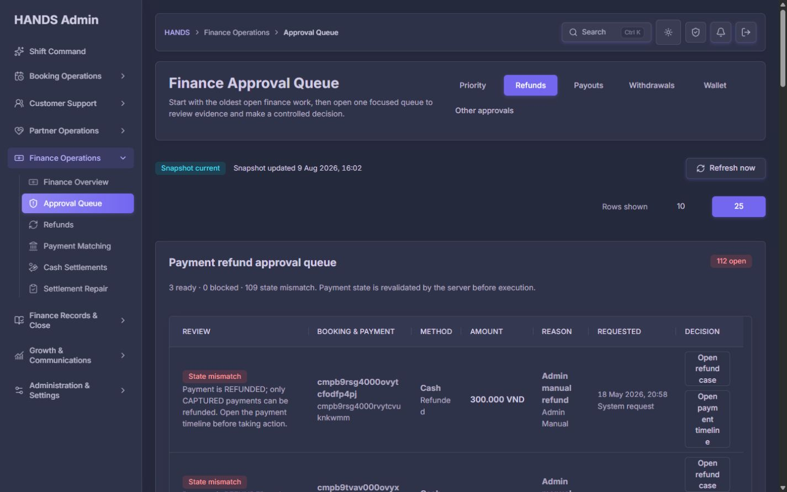

이 문제는 단순 가독성 문제가 아니다. 화면이 “3 ready”라고 말하지만 실제 승인 작업을 완료할 경로가 없으므로 승인 큐의 핵심 작업이 중단된다.

권장 수정:

- 서버에서 `reviewState`를 SQL/쿼리 수준에서 먼저 계산한 뒤 정렬·필터·LIMIT한다.
- 환불 작업공간 상단을 `Ready for decision (3)`과 `State repair (109)`의 두 작업 목록으로 분리한다.
- 기본 진입은 Ready 목록이며, 상태 불일치는 별도 수리 목록으로 보낸다.
- `review=ready|blocked|state-mismatch|all`을 URL/API 계약으로 추가한다.
- 목록별 서버 커서 페이지네이션을 추가한다. “25행 표시”는 총 112건 중 다음 페이지가 있을 때 페이지 이동 없이 끝나면 안 된다.
- Priority 화면도 `Ready decisions`와 `Repair exceptions`를 각각 제한된 독립 배열로 받아 한 종류가 다른 종류를 밀어내지 못하게 한다.

필수 회귀 테스트:

- 109개 상태 불일치 + 3개 Ready 픽스처에서 기본 환불 화면에 3개 Ready가 모두 노출돼야 한다.
- `take=10`이어도 Ready 작업이 상태 불일치에 밀려 사라지지 않아야 한다.
- Ready 탭에서 승인 버튼 수와 `refundReadyCount`가 일치해야 한다.
- State mismatch 행에는 승인·거절이 없어야 한다.

### P1-1. 1440px에서 핵심 표가 운영용 밀도를 확보하지 못함

1440px 화면에서도 실제 콘텐츠 폭은 사이드바와 패딩을 제외한 약 1,050px다. Priority 표는 내부 스크롤 영역 `clientWidth 1050px`, 콘텐츠 `scrollWidth 1114px`로 측정됐다. Action 열은 오른쪽으로 잘리고, 요청 ID·Booking ID·Payment ID·`Unassigned`가 글자 단위로 깨진다.

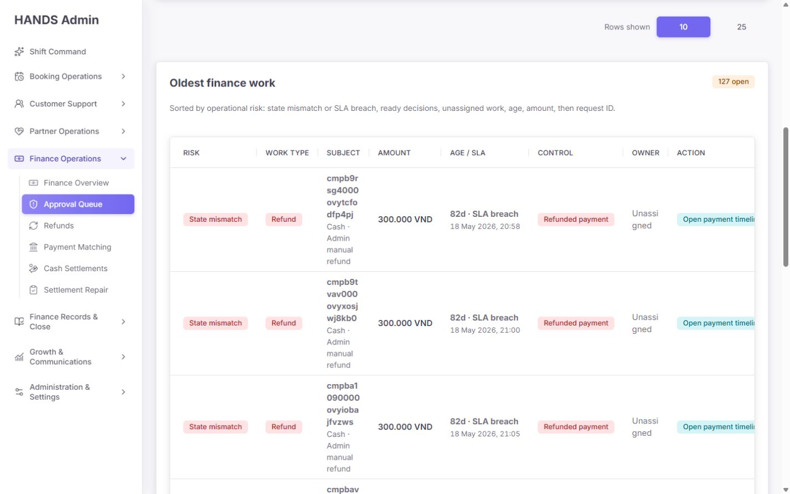

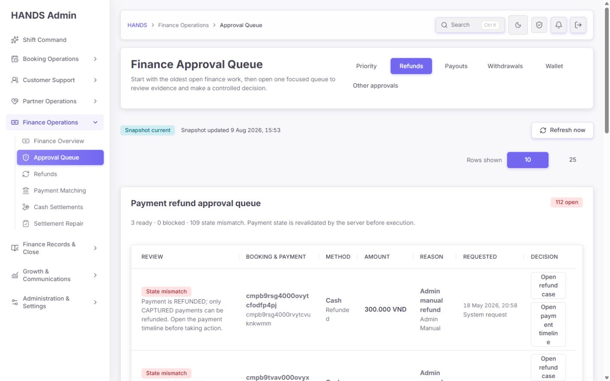

현재 `table { width: max-content }`와 일반적인 가로 스크롤 래퍼에 의존하지만, 이 페이지의 열 개수와 긴 내부 ID에는 전용 열 설계가 없다.

권장 수정:

- Priority는 8열을 유지하지 말고 `Risk/Type`, `Work`, `Amount`, `Age/Owner`, `Control/Action`의 5열로 통합한다.
- ID는 고정폭 한 줄 + 가운데 생략 또는 앞 8자/뒤 6자 표시 + Copy 버튼 + 전체값 title/상세로 제공한다. 글자 단위 줄바꿈은 금지한다.
- `Owner`는 `Unassigned`를 한 줄 유지하고, 사용자명도 두 줄 이내로 제한한다.
- 결정 버튼은 최소 140px 폭을 보장하거나 행 우측의 단일 `Review` 진입 버튼으로 통합한다.
- 환불 행은 표 안에 `Open refund case`, `Open payment timeline`, 승인, 거절을 모두 세로로 쌓지 말고, 기본 `Review` 한 개와 보조 메뉴/상세 패널로 정리한다.
- 1440 × 900에서 표 내부 가로 스크롤 없이 Action이 보여야 하며, ID·상태·버튼이 글자 단위로 끊기지 않아야 한다.

### P1-2. 지급 큐가 Ready보다 Blocked를 먼저 보여줌

Payouts는 2 Ready / 2 Blocked지만, 현재 화면은 7월 29일 Blocked 두 건이 먼저 나오고 7월 2일 Ready 두 건은 아래로 밀린다. 헤더도 `4 pending`만 강조해 실행 가능한 수를 다시 판단해야 한다.

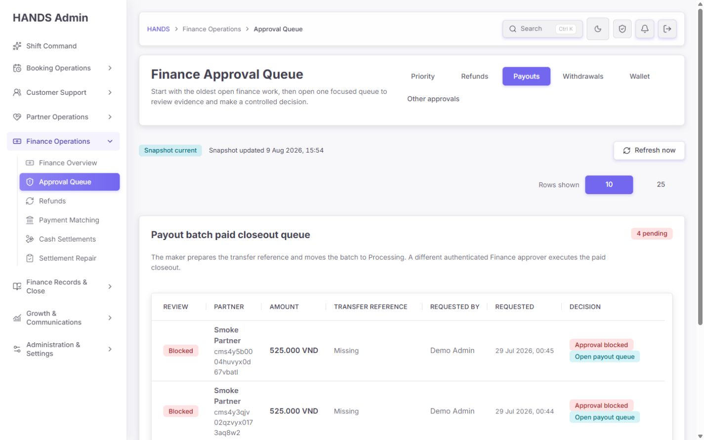

이 문제는 환불과 같은 구조적 위험을 가진다. 데이터가 25건을 넘으면 Ready 지급도 LIMIT 밖으로 밀릴 수 있다.

권장 수정:

- 서버에서 `READY` 우선, 각 상태 안에서 oldest-first로 정렬한 뒤 LIMIT한다.
- 화면을 `Ready to close (2)` / `Blocked – evidence repair (2)` 두 섹션으로 분리한다.
- 결과 배지는 `2 ready · 2 blocked`로 바꾸고, `4 pending`은 보조 총계로 내린다.
- Blocked의 `Missing`은 `Transfer reference missing`처럼 빠진 증거를 직접 명시한다.

### P1-3. 지급·출금 확인 모달의 증거 스냅샷이 아직 결재 기준에 부족함

모달의 시각 구조, 취소 우선 포커스, Maker/Current approver/독립 통제/회계 영향/스냅샷 시각은 좋아졌다. 그러나 실제 송금을 승인하는 화면에 다음이 빠져 있다.

지급(Payout):

- Transfer reference
- 송금 대상 은행명과 계좌 last4
- 요청 시각
- 연결된 earning/withholding 건수 또는 증거 요약
- 특정 지급 배치로 가는 딥링크

출금(Withdrawal):

- Maker/요청자
- 요청 시각
- 은행명과 계좌 last4
- Transfer reference
- 지갑 잔액 before → after
- 특정 출금 요청으로 가는 딥링크

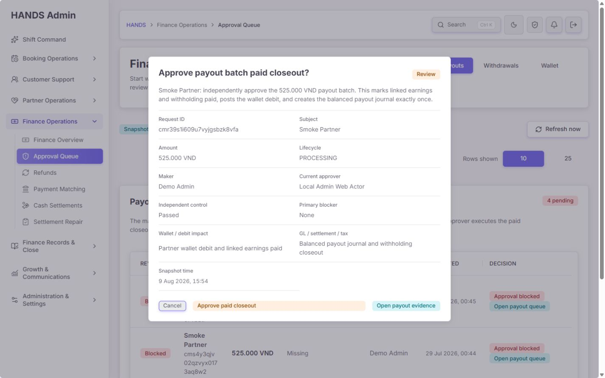

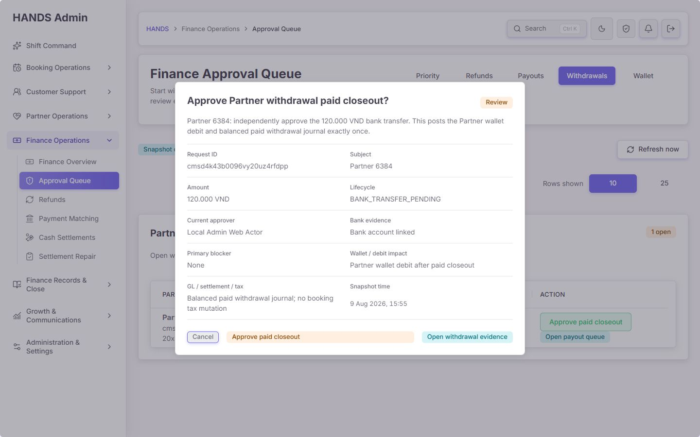

API 타입도 출금에 `hasBankAccount`만 전달하고 있어 UI만으로 해결되지 않는다. `bankName`, `accountNumberLast4`, `transferRef`, `requestedBy`, 요청 당시 잔액 스냅샷을 API 계약에 추가해야 한다.

딥링크도 현재 지급은 `/payouts?workspace=operations&review=in-progress`, 출금은 상태 필터만 전달한다. 각각 `payoutBatchId` 또는 `withdrawalId`를 소비하는 URL 계약과 행 anchor를 만들어야 한다.

### P1-4. Priority의 “Needs approval” 문구가 실제 실행 가능 건수를 과장함

Refund 카드의 큰 숫자는 112이고 범위 문구는 `Needs approval`이지만 실제 승인 가능 건은 3건이다. Payout도 4건 중 Ready는 2건이다. 상태 불일치/Blocked는 “승인” 대상이 아니라 “수리·증거 보완” 대상이다.

권장 문구:

- Refund: 큰 숫자 `3`, 라벨 `Ready now`; 보조 `109 state repairs`
- Payout: 큰 숫자 `2`, 라벨 `Ready now`; 보조 `2 blocked`
- Wallet: `0 ready`; 보조 `1 blocked · 9 stale`
- 전체 상단: `5 decisions ready · 122 repair/review items`처럼 실행과 수리를 분리

## 3. 중요하지만 배포를 막지는 않는 개선점

### P2-1. 작업공간 메뉴가 1440px에서도 두 줄로 내려감

`Priority / Refunds / Payouts / Withdrawals / Wallet` 다음 `Other approvals`가 두 번째 줄로 떨어진다. 1440 이상만 지원하는 운영 도구에서 상위 작업공간이 두 줄이면 구조 파악과 스캔이 느려진다.

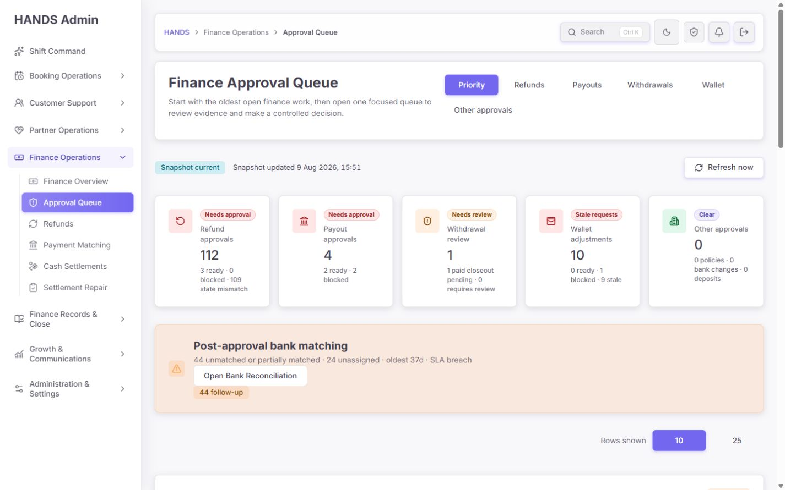

원인은 메뉴가 페이지 제목 우측 `actions`의 제한된 폭에 들어가 있기 때문이다. 메뉴를 제목 아래의 전체 폭 navigation row로 이동하고, 6개 항목을 한 줄로 유지한다. `semantics="navigation"`을 명시해 실제 `<nav aria-label="Finance approval workspaces">`로 렌더링한다.

### P2-2. Wallet 표는 가로 폭은 좋아졌지만 세로 밀도가 낮음

Wallet 표는 1,050px 안에 맞고 내부 가로 스크롤이 없어 이전보다 좋아졌다. 다만 `Owner / request`에 소유자, owner type/id, adjustment type, direction/reason, maker를 항상 5~6줄로 반복해 10행 검토에 과도한 세로 스크롤이 필요하다.

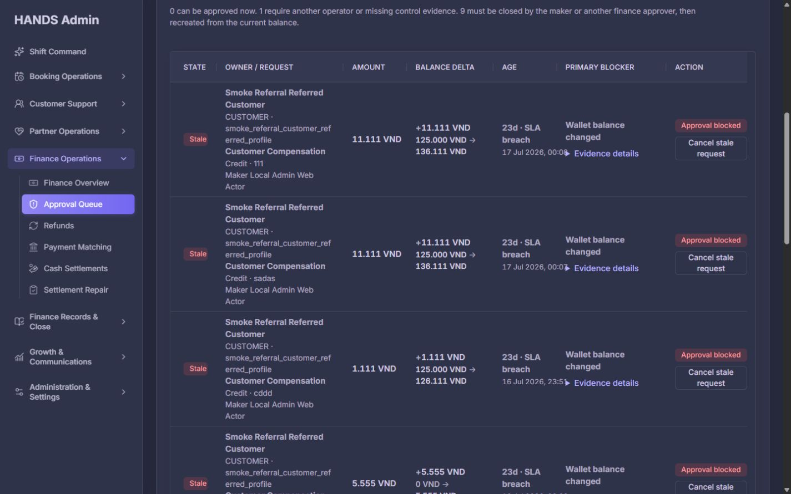

기본 행은 소유자, 조정 유형, 금액, before→after, blocker, action만 두 줄 이내로 보여주고 내부 ID·maker·월 마감·첨부는 기존 `Evidence details`에 넣는다. `Evidence details`는 blocker 열이 아니라 행 전체 상세 패널로 열어 정보 관계를 분명히 한다.

### P2-3. 모달을 닫은 뒤 원래 Review 버튼으로 포커스가 돌아오지 않음

확인 모달은 첫 포커스가 Cancel이고 Tab 트랩과 Escape 닫기가 작동했다. 하지만 Escape와 Cancel 모두 닫힌 뒤 `document.activeElement`가 `BODY`가 됐다.

코드의 `useAdminModalFocus`는 이전 포커스를 복원하려 하지만, 확인 모달이 URL 이동으로 새 서버 페이지에 렌더링되므로 “이전 포커스”가 이미 BODY다. 닫기도 `window.location.assign(cancelHref)`라 기존 트리거 DOM이 유지되지 않는다.

권장 수정:

- 최소 변경: 확인 URL에 `returnFocus=approval-<requestId>`를 보존하고, 취소/ESC로 복귀한 페이지가 해당 행의 Review 링크를 찾아 포커스한다.
- 더 좋은 구조: 모달을 client-side dialog 상태로 열어 트리거 ref를 유지하되, requestId와 서버 재검증 계약은 그대로 둔다.
- 실제 브라우저 E2E로 `Review → Escape → 같은 Review 버튼 focus`를 검증한다. 현재 테스트는 소스에 `returnFocus?.focus()` 문자열이 존재하는지만 확인해 이 실패를 잡지 못한다.

### P2-4. Refresh가 페이지 전용 상태 대신 전역 Shift Command 로딩을 사용함

`Refresh now`는 generatedAt을 실제로 갱신하므로 기능은 정상이다. 다만 해당 라우트에 `loading.tsx`가 없어 전체 전환 중 루트 `Shift Command / Loading records` 상태가 나타난다. Finance Approval Queue에서 Shift Command 로딩이 보이면 사용자는 다른 페이지로 이동한 것으로 오해할 수 있다.

페이지 전용 skeleton 또는 `Refreshing approval snapshot…` 상태를 추가하고 기존 표를 유지한 채 갱신 완료 시 스냅샷 시간을 바꾸는 편이 낫다.

### P2-5. Focused Payout/Withdrawal 헤더에 상태 분해가 부족함

- Payout: `4 pending` 대신 `2 ready · 2 blocked`
- Withdrawal: `1 open`과 금액만 보여주지 말고 `paid closeout ready / blocked / review required`를 함께 표시

Priority 카드에는 이미 세부 상태가 있으므로 focused view에서도 같은 상태 계약을 유지해야 한다.

### P2-6. 개별 행 링크의 보이는 이름과 딥링크가 부족함

Priority 표의 Action에는 컨텍스트가 포함된 `aria-label`이 있어 개선됐다. 그러나 focused Payout/Withdrawal의 `Open payout queue`는 모두 같은 이름이고 특정 요청을 가리키지 않는다. 보이는 이름 또는 접근 가능한 이름에 파트너/요청 ID를 포함하고 정확한 기록으로 이동해야 한다.

### P2-7. 일시적인 Access restricted 상태를 권한 거부로 단정함

감사 중 Wallet 이동에서 한 차례 `Access restricted`가 렌더링됐고 캡처됐다. 같은 URL을 Priority와 Other approvals에서 다시 실행했을 때는 정상 Wallet 작업공간이 열려 재현되지 않았다.

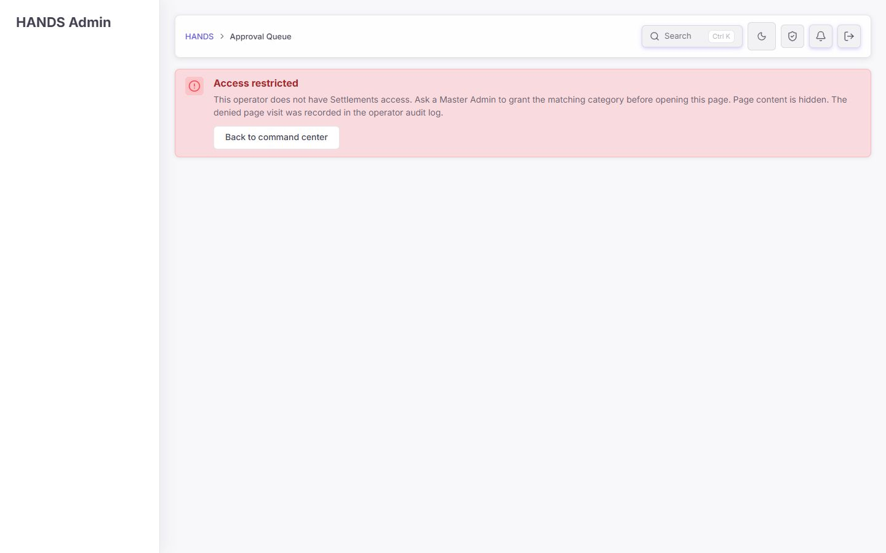

따라서 Wallet 권한 매핑 결함으로 단정하지 않는다. 다만 접근 정보 조회 실패가 `null`로 폴백될 때 실제 권한 없음과 구별하지 않고 확정적인 거부 문구를 보여줄 가능성을 점검해야 한다. 네트워크/권한 데이터 로드 실패는 `Permissions unavailable — retry`로, 실제 403만 `Access restricted`로 분리하고 request/error ID를 남기는 것이 안전하다.

### P2-8. 문서 제목과 운영 보조 진입점

- 정상 Approval Queue 화면의 `document.title`이 빈 문자열로 관찰됐다. `Finance Approval Queue | HANDS Admin`을 설정한다.
- 이전 기준의 `Approver coverage` 직접 링크가 이 페이지에 없다. 현재 approver가 없거나 독립 승인자가 부족할 때만 조건부 경고와 `/finance-tax/finance-approvers` 링크를 노출하면 된다.

### P2-9. 1,937행 단일 페이지는 회귀 위험이 큼

현재 `page.tsx`가 데이터 로드, URL 파싱, 모든 큐 렌더링, Priority 모델, 위험 순위, 딥링크, 확인 모달 증거 모델까지 포함한다. 이번 누락처럼 “집계는 맞지만 제한된 목록에서 Ready가 사라지는” 계약을 보기 어렵게 만든다.

기능 변경 없이 다음 경계로만 분리한다.

- `finance-approval-query.ts`: URL/view/review/take 계약
- `finance-approval-model.ts`: counts, risk, sorting, link builders
- `finance-approval-confirmation-model.ts`: 증거 스냅샷
- `priority-workspace.tsx`, `refund-workspace.tsx`, `payout-workspace.tsx`, `withdrawal-workspace.tsx`, `wallet-workspace.tsx`
- 서버 응답은 `summary`, `readyItems`, `repairItems`, `pagination`을 명시

불필요한 범용 추상화는 만들지 말고 이 페이지의 명확한 작업 경계만 분리한다.

## 4. 잘된 부분 — 유지해야 할 것

1. 환불 상태 계약이 실제 데이터와 일치한다. `REQUESTED + Payment REFUNDED`를 `STATE_MISMATCH`로 분류하고 승인·거절을 숨긴다.
2. Refund 112 = 3 Ready + 109 State mismatch, Payout 4 = 2 Ready + 2 Blocked 등 집계가 명확하다.
3. 환불 행의 `Open refund case`는 요청 ID 검색과 anchor를 포함해 정확한 한 건으로 이동한다.
4. 레거시 `view=reconciliation`은 owner/SLA/take 필터를 보존해 canonical Bank Reconciliation으로 이동한다.
5. Other approvals가 비면 무의미한 표와 비활성 버튼을 숨기고 작은 빈 상태와 활성 큐 링크만 보여준다.
6. Snapshot current, generated time, Refresh가 있으며 실제 갱신 후 generatedAt이 바뀐다.
7. 확인 모달은 Cancel을 먼저 포커스하고 Tab 트랩과 Escape를 지원한다.
8. Wallet 표는 내부 가로 스크롤 없이 1,050px 콘텐츠 폭에 맞는다.
9. 다크 테마는 상태색, 텍스트, 표 경계, 모달 모두 일관되고 콘솔 오류가 없었다.
10. API는 선택한 focused view의 상세 행만 불러오고 다른 큐는 집계만 유지한다.
11. 이 페이지의 역할이 승인/결정으로 좁혀졌고, Bank Reconciliation은 post-approval matching으로 분리됐다.

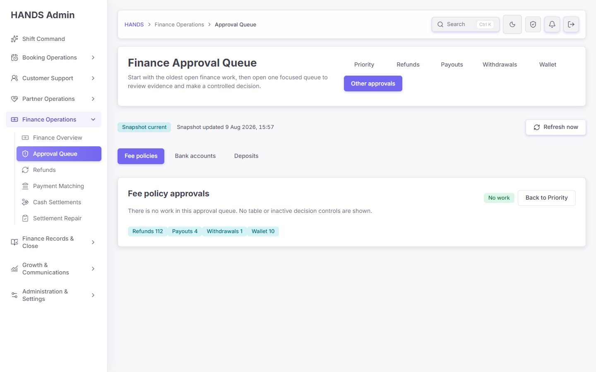

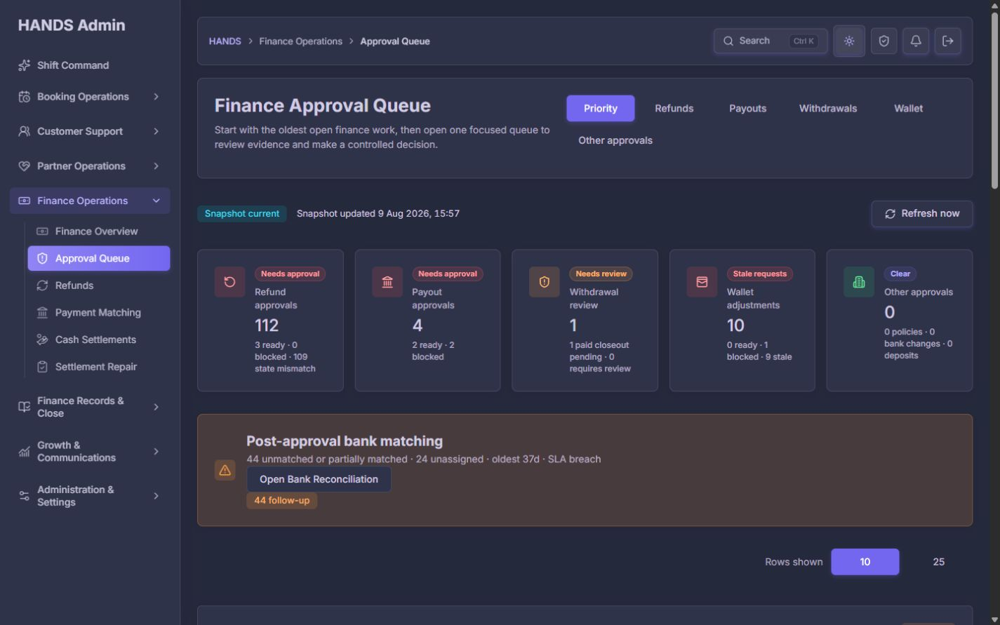

## 5. 성능 검수

로컬 warm navigation 측정:

| 경로 | 측정값 |
|---|---:|
| Priority | 473ms |
| Refunds 25 | 167ms |
| Payouts | 169ms |
| Wallet | 149ms |

이 값은 localhost warm 상태의 단일 측정이므로 production SLO로 사용하면 안 된다. 다만 이번 감사에서 해당 페이지 자체의 전환은 “매우 느림”으로 재현되지 않았고 브라우저 콘솔 오류도 0건이었다.

코드상 focused view의 상세 배열 선택 로드는 잘 구현됐다. 반면 정확한 전역 집계를 위해 withdrawal group, wallet summary, refund summary, payout count, policy/bank/deposit counts 등 여러 쿼리는 뷰 전환마다 실행된다. 실제 운영 DB에서 느리다면 먼저 각 쿼리의 p50/p95와 DB execution time을 계측한 뒤, summary를 짧은 TTL로 캐시하거나 하나의 집계 쿼리/물질화된 운영 요약으로 합치는 순서가 맞다. 현재 로컬 수치만으로 캐시를 선제 도입할 근거는 부족하다.

## 6. 테스트 결과와 누락된 검증

실행 결과:

- Admin Web 관련 6개 파일: **43 tests passed**
- API `finance approval queue`: **2 passed, 588 skipped**
- 브라우저 콘솔: **0 errors/logs**

현 테스트가 잡지 못한 핵심 회귀:

- 집계 Ready 수와 렌더링 가능한 Ready 행 수의 불일치
- `take=25` 뒤쪽 Ready 도달 불가
- Ready/Blocked 서버 정렬 순서
- 1440px 표 내부 overflow와 글자 단위 줄바꿈
- 모달 닫기 후 실제 트리거 포커스 복귀
- 지급/출금 증거 스냅샷 필드 완전성
- 개별 지급/출금 딥링크 정확성
- 권한 조회 실패와 실제 권한 거부의 UI 구분

추가할 최소 E2E 시나리오:

1. 109 mismatch + 3 Ready 환불에서 Ready 3건 전부 도달/승인 가능
2. 30 Blocked + 2 Ready 지급에서 Ready가 첫 화면에 노출
3. 1440 × 900에서 Priority/Refund/Payout/Wallet 각각 horizontal overflow 0, Action 가시
4. Payout/Withdrawal 모달에 은행명, last4, transfer ref, maker, request time, impact 존재
5. Cancel/Escape 후 원래 Review 링크가 activeElement
6. 레거시 reconciliation redirect가 owner/age/take 보존
7. operator-access API 실패 시 retryable 상태, 실제 category 403 시 restricted 상태

## 7. 수정 우선순위와 완료 기준

### 1차 — 운영 차단 해소

- 환불/지급의 상태 분류를 LIMIT 전에 수행
- Ready와 Repair/Blocked를 별도 목록으로 분리
- 상태 필터와 서버 페이지네이션 추가
- Ready 수 = 실제 도달 가능한 Ready 행 수 보장

완료 기준: 현재 데이터에서 환불 Ready 3건과 지급 Ready 2건을 모두 첫 화면 또는 명시적 Ready 탭에서 바로 열 수 있다.

### 2차 — 고위험 승인 증거 완성

- Payout/Withdrawal 은행·계좌·transfer ref·maker·requestedAt·wallet impact 추가
- 요청별 evidence 딥링크 추가
- focused 헤더에 Ready/Blocked 분해 표시

완료 기준: 운영자가 모달 밖의 다른 화면을 추측해서 찾아가지 않고도 대상·금액·송금 증거·독립 승인·회계 영향을 확인할 수 있다.

### 3차 — 1440 운영 가독성

- 작업공간 메뉴 한 줄
- Priority/Refund 열 통합 및 ID 축약/복사
- Action 열 항상 가시
- Wallet 기본 행 2줄 이내 + 상세 disclosure

완료 기준: 1440 × 900에서 페이지 전체 및 내부 표의 가로 스크롤이 없고, 글자 단위 줄바꿈이 없으며, 첫 화면에서 상태와 다음 행동을 판단할 수 있다.

### 4차 — 접근성·복원력·구조

- workspace `<nav>` semantics
- 모달 트리거 포커스 복귀
- 전용 refresh loading
- 권한 조회 오류/실제 거부 분리
- 문서 title과 조건부 Approver coverage 링크
- 페이지 모델/워크스페이스 단위 분리

## 8. 최종 승인 조건

다음이 모두 충족되기 전에는 “감사 보고서 수정 완료”로 보지 않는다.

- [ ] Ready 환불 3건이 UI에서 실제로 보이고 처리 가능
- [ ] Payout Ready가 Blocked보다 먼저 노출
- [ ] 1440px Priority/Refund 표에서 Action이 잘리지 않음
- [ ] ID·상태·버튼의 글자 단위 줄바꿈 제거
- [ ] Payout/Withdrawal 모달에 송금 핵심 증거 완비
- [ ] Payout/Withdrawal 증거 링크가 특정 요청을 엶
- [ ] Cancel/Escape 후 원래 Review 버튼으로 포커스 복귀
- [ ] 작업공간 메뉴가 한 줄의 navigation landmark로 렌더링
- [ ] Refresh 중 Finance Approval Queue 문맥 유지
- [ ] 실제 브라우저 E2E가 위 계약을 검증

## 9. 증거 목록

1. `01-priority-top-1440x900.jpg` — Priority 상단, 집계/작업공간 메뉴
2. `02-priority-table-1440x900.jpg` — Priority 표 가독성
3. `03-refunds-top-1440x900.jpg` — Refund focused view
4. `04-payouts-1440x900.jpg` — Payout Ready/Blocked 순서
5. `05-payout-confirmation-1440x900.jpg` — Payout 확인 모달
6. `06-withdrawals-1440x900.jpg` — Withdrawal focused view
7. `07-withdrawal-confirmation-1440x900.jpg` — Withdrawal 확인 모달
8. `08-wallet-access-restricted-1440x900.jpg` — 일시적 access 상태
9. `09-other-empty-1440x900.jpg` — Other approvals 빈 상태
10. `10-priority-dark-1440x900.jpg` — 다크 테마
11. `11-refunds-25-no-ready-1440x900.jpg` — 25행에서도 Ready 도달 불가
12. `12-wallet-1440x900.jpg` — Wallet filter/summary
13. `13-wallet-table-1440x900.jpg` — Wallet 표 밀도

