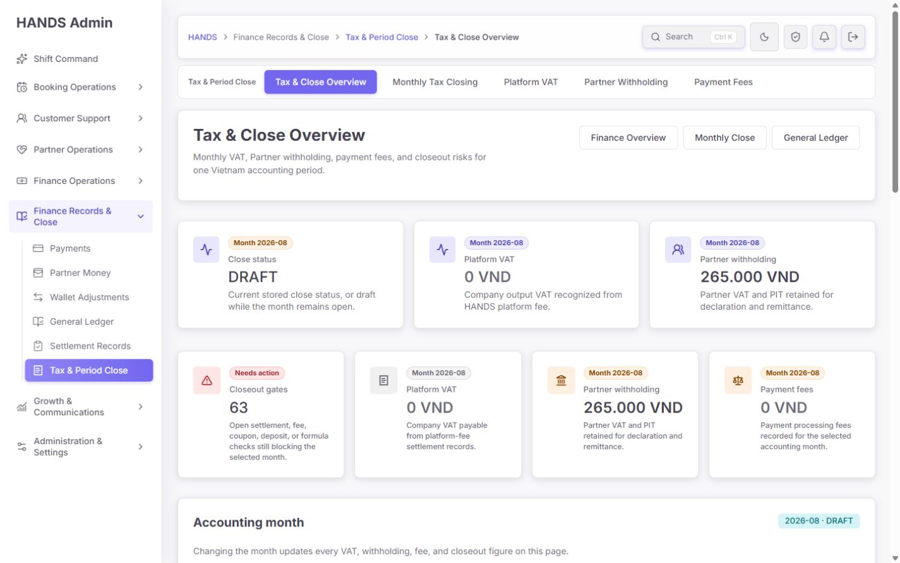
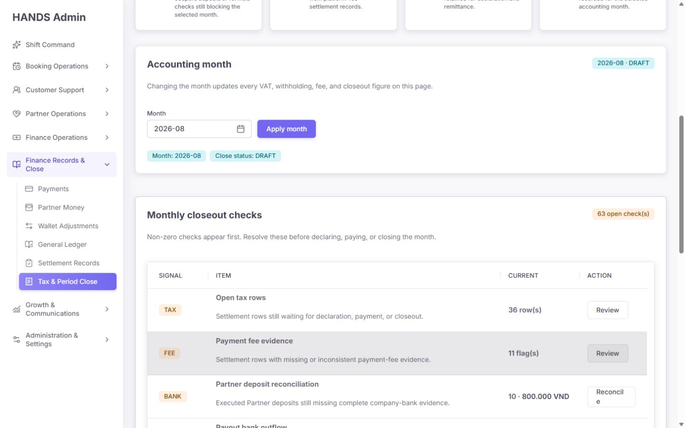
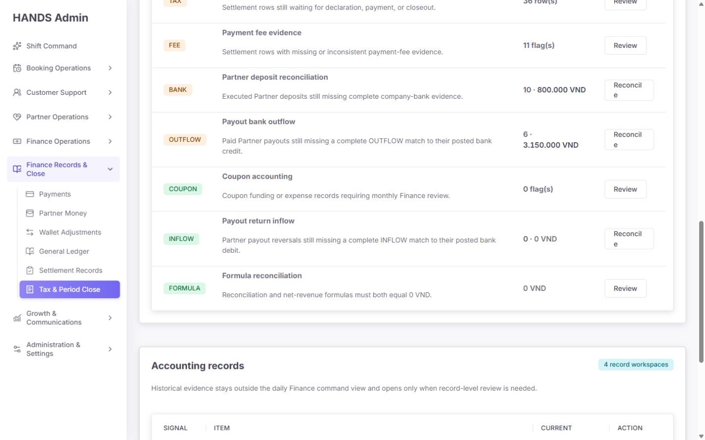
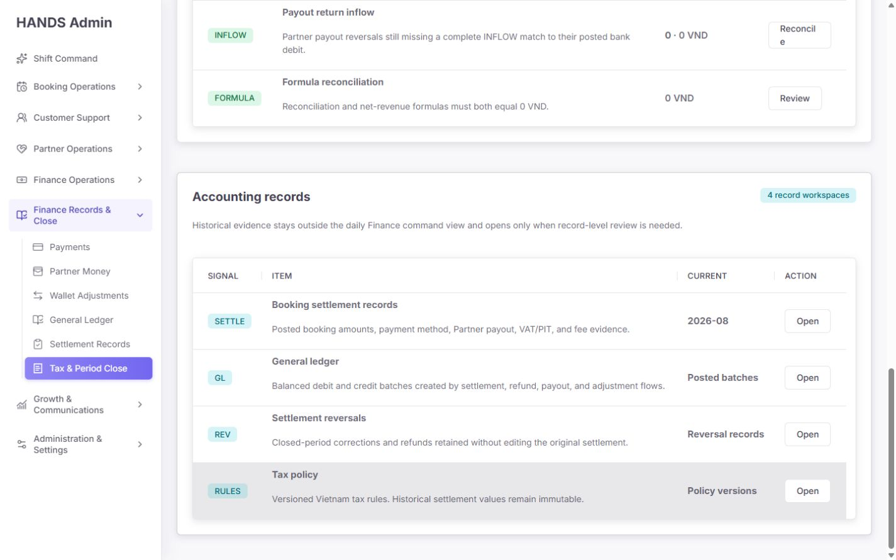

# HANDS Admin — Tax & Close Overview 심층 감사 보고서

- 감사 대상: `http://localhost:3101/finance-tax`
- 감사일: 2026-08-09 (Asia/Bangkok)
- 기준 화면: **1440×900 이상만 검사**
- 제외 범위: 1024px 이하 반응형·모바일 레이아웃
- 관점: 베트남 월 결산을 실제로 수행하는 Finance 운영자
- 방법: 로그인된 실제 화면 캡처, DOM/상호작용 구조 확인, Next.js 화면 코드, 링크 생성기, API summary SQL, closeout preflight, 기존 테스트 대조
- 소스 변경: 없음

---

## 1. 최종 판정

### 종합 점수: **48 / 100**

현재 화면은 카드, 표, 월 선택기, 오류 상태 같은 기본 UI 품질은 비교적 안정적이다. 그러나 Finance 운영 화면의 핵심인 **“현재 무엇이 실제 결산 차단 조건인지”와 “숫자를 눌렀을 때 같은 문제 집합으로 이동하는지”가 정확하지 않다.**

가장 중요한 결론은 다음과 같다.

1. 화면의 `Closeout gates 63`은 서버가 실제로 차단하는 blocker 수가 아니다.
2. `openTaxCount`, fee flag, coupon flag, bank 건수를 단순 합산하면서 서로 중복될 수 있는 레코드를 한 숫자로 표시한다.
3. 서버의 단계별 `preflight.blockers`는 사용하지 않고, 실제 blocker인 journal reconciliation과 후기 단계 remittance blocker는 상단 숫자에서 빠진다.
4. `Open tax rows 36`을 눌러도 tax-open 36건 전용 목록이 열리지 않는다.
5. coupon, Partner deposit, payout outflow/inflow 작업 링크가 선택 월 또는 source/direction 범위를 잃는다.
6. 회사 부담 coupon이 있는 결산의 reconciliation formula가 잘못 계산될 수 있다.
7. 시각적으로는 깔끔하지만 같은 VAT/withholding 수치가 두 번 반복되어 실제 작업 표가 첫 화면 아래로 밀린다.

따라서 이 페이지는 현재 **“보기 좋은 요약”으로는 사용할 수 있지만 “결산 진행 여부를 판단하는 통제 화면”으로 사용하기에는 위험하다.**

---

## 2. 평가표

| 평가 영역 | 점수 | 판정 |
|---|---:|---|
| 회계 수치·판정 신뢰성 | 28/100 | 즉시 수정 필요 |
| 결산 단계·blocker 계약 | 25/100 | 즉시 수정 필요 |
| 작업 링크·범위 보존 | 32/100 | 즉시 수정 필요 |
| 운영 흐름·다음 행동 | 45/100 | 큰 개선 필요 |
| 정보 구조·중복 제거 | 54/100 | 개선 필요 |
| 1440px 시각 위계·밀도 | 61/100 | 기본은 양호하나 비효율 존재 |
| 문구·상태 의미 | 48/100 | 재정의 필요 |
| 접근성 기본 구조 | 66/100 | 기본 시맨틱은 양호, 링크 문맥 개선 필요 |
| 오류·빈 상태 안전성 | 82/100 | 강점 |
| 페이지 자체 성능 | 84/100 | 페이지 fetch 구조는 양호 |

---

## 3. 화면 증거

### Step 1 — 첫 화면: 주의 필요



관찰:

- breadcrumb, workspace tab, 제목, 월별 KPI 카드 구조는 한눈에 식별된다.
- 상단 3개 metric과 다음 4개 command card에서 VAT와 withholding이 다시 반복된다.
- `Closeout gates 63`은 강한 위험 신호이지만 무엇이 실제 hard blocker이고 무엇이 review workload인지 구분하지 않는다.
- 첫 1440×900 화면에 실제 작업 표의 header/첫 row가 보이지 않는다.
- `Accounting month`는 화면 맨 아래에 일부만 보인다. 운영자는 문제를 보기 전에 월 범위를 다시 확인하거나 스크롤해야 한다.

건강 상태: **주의 필요 — 시각적 완성도는 양호하지만 핵심 작업 진입이 아래로 밀림**

### Step 2 — 월 선택과 closeout checks 진입: 개선 필요



관찰:

- 월 입력에는 명시적 `Month` label이 있고 submit button도 분명하다.
- 같은 월/상태가 우측 badge, input, filter summary에 세 번 반복된다.
- `63 open check(s)`는 실제로 63개의 control이 아니라 여러 범주의 affected record 수 합계다.
- 첫 세 행 중 TAX, FEE, BANK가 보이지만 priority, oldest age, owner가 없다.
- `Reconcile` 버튼이 1440px에서도 줄바꿈된다.

건강 상태: **개선 필요 — 범위 선택은 명확하나 작업 의미와 밀도가 좋지 않음**

### Step 3 — closeout checks 하단: 주의 필요



관찰:

- non-zero row가 위에 오고 zero row가 아래에 오는 기본 정렬은 적절하다.
- `BANK`, `OUTFLOW`, `INFLOW`의 실제 대상 queue가 서로 다르지만 action label은 모두 `Reconcile`이다.
- 0건인 `COUPON`, `INFLOW`, `FORMULA`도 동일한 무게로 계속 노출된다.
- `Reconcile`이 `Reconcil / e`로 끊겨 전문적인 Finance 화면의 완성도를 낮춘다.
- amount와 count가 한 셀에 혼합되지만 `Current`라는 column heading만으로 의미가 충분하지 않다.

건강 상태: **주의 필요 — cleared control과 actionable control이 충분히 분리되지 않음**

### Step 4 — Accounting records: 개선 필요



관찰:

- Settlement, GL, Reversal, Tax policy를 한 곳에서 찾을 수 있다는 점은 좋다.
- 그러나 Settlement와 GL은 좌측 sidebar에도 있고 General Ledger는 page header action에도 있다.
- `Booking settlement records`는 “records”라고 표현하지만 실제 링크는 기본 `review=open` 상태로 생성되어 전체 기록이 아니라 action queue를 연다.
- 각 행의 `Current` 값은 실제 count/status가 아니라 `2026-08`, `Posted batches`, `Reversal records`, `Policy versions`처럼 서로 다른 종류의 placeholder다.
- 4개의 navigation link를 표로 표현해 공간을 과도하게 사용한다.

건강 상태: **개선 필요 — 연결성은 좋지만 중복과 목적 불일치가 있음**

---

## 4. 실제 운영자 작업 목표

Finance 운영자가 이 페이지에 들어왔을 때 10초 안에 답을 얻어야 하는 질문은 다음과 같다.

1. 지금 선택 월은 무엇인가?
2. 실제 저장된 결산 상태인가, 아직 close record가 없는가?
3. 다음 결산 단계는 무엇인가?
4. 지금 그 단계로 진행할 수 있는가?
5. 진행을 막는 **서버 권위 hard blocker**는 정확히 무엇인가?
6. blocker는 아니지만 최종 결산 전 확인해야 하는 review flag는 무엇인가?
7. 각 문제의 affected record 수, 금액, oldest age, owner는 무엇인가?
8. 문제 숫자를 누르면 정확히 같은 월·같은 source·같은 상태의 queue가 열리는가?
9. VAT, Partner withholding, fee 금액은 확정인가 provisional인가?
10. 데이터는 언제 계산되었고 마지막 변경자는 누구인가?

현재 화면은 1번과 일부 금액에는 답하지만 2~10번은 충분히 답하지 못한다.

---

## 5. P0 — 즉시 수정해야 하는 정산 통제 문제

### P0-1. `Closeout gates 63`이 서버의 실제 close blocker가 아니다

#### 증거

화면은 다음 값을 단순 합산한다.

```ts
openTaxCount
+ paymentFeeReviewFlagCount
+ couponReviewFlagCount
+ partnerDepositReconciliationOpenCount
+ payoutBankOutflowReconciliationOpenCount
+ payoutReturnInflowReconciliationOpenCount
+ formulaIssueCount
```

위치:

- `apps/admin_web/app/finance-tax/page.tsx:63-72`

그러나 API는 이미 다음을 제공한다.

```ts
summary.preflight = {
  nextStatus,
  ready,
  blockers: [{ code, message }]
}
```

위치:

- `apps/admin_web/lib/admin-api.ts:4851-4871`
- `apps/api/src/admin/admin.service.ts:42772-42839`

#### 왜 위험한가

- `openTaxCount`는 DRAFT 단계에서 처리해야 할 workload이지 반드시 status transition을 차단하는 blocker가 아니다.
- `couponReviewFlagCount`도 현재 서버 preflight blocker 목록에 포함되지 않는다.
- 같은 settlement가 tax-open과 fee/coupon 문제를 동시에 가질 수 있으므로 단순 합계는 unique work item 수가 아니다.
- 반대로 실제 blocker인 `journalReconciliationIssueCount`가 overview gate 합계에서 누락된다.
- `PAID → CLOSED` 단계의 `REMITTANCE_EVIDENCE`, `REMITTANCE_JOURNAL`, `REMITTANCE_AMOUNT_MISMATCH` 같은 stage-specific blocker도 이 숫자에 반영되지 않는다.

#### 현재 발생 가능한 잘못된 판단

- 화면: `63 blockers`처럼 보임
- 서버: 현재 단계는 formula/journal만 맞으면 `REVIEWED`로 진행 가능할 수 있음

또는 반대로:

- 화면: 합계 0이라 `Clear`로 보임
- 서버: posted journal delta 또는 remittance evidence 문제로 실제 transition 차단

#### 수정 요구사항

1. `Closeout gates`의 값은 affected row 합계가 아니라 `summary.preflight.blockers`에서 산출한다.
2. 동일 blocker code는 하나의 control로 deduplicate한다.
3. 카드 label을 다음처럼 분리한다.
   - `Hard blockers: 2 controls`
   - `Affected records: 17`
   - `Review flags: 3 controls`
4. `summary.preflight.nextStatus`를 함께 표시한다.
5. `buildMonthlyTaxClosingPreflightLinks()`와 `resolveMonthlyTaxClosingPreflight()`를 overview에서도 재사용한다.
6. Overview와 Monthly Tax Closing이 별도 blocker 정의를 갖지 않게 한다.

#### 우선순위

**P0 / Finance correctness**

---

### P0-2. Open tax 숫자와 실제 이동 대상이 다르다

#### 증거

화면 row:

- label: `Open tax rows`
- count: `summary.openTaxCount`
- href: `review=open`

위치:

- `apps/admin_web/app/finance-tax/page.tsx:273-284`

모델에는 이미 정확한 전용 filter가 존재한다.

- `review=tax-open`
- `apps/admin_web/app/finance-tax/tax-settlement-page-model.ts:1555-1563`

#### 문제

`review=open`은 `Needs action` queue이며 tax-open보다 넓은 집합이다. 운영자는 36건을 눌렀는데 다른 문제 유형과 다른 count를 보게 될 수 있다.

#### 수정

```text
/finance-tax/booking-settlement-audit
  ?range=all
  &review=tax-open
  &period=2026-08
  &sort=oldest
  &returnTo=<safe encoded overview URL>
```

목록 상단에는 `Source: Tax & Close Overview · 36 tax-open rows`를 표시해 숫자 continuity를 확인하게 한다.

#### 우선순위

**P0 / Drill-down integrity**

---

### P0-3. Coupon review link가 선택 월을 잃는다

#### 증거

Overview는 `settlementFilters.period`를 구성하지만 `couponFinanceHref()`와 coupon API href builder가 period를 URL/API에 넣지 않는다.

- `apps/admin_web/app/finance-tax/page.tsx:298-305`
- `apps/admin_web/app/finance-tax/tax-settlement-page-model.ts:548-565`
- `apps/admin_web/app/finance-tax/tax-settlement-page-model.ts:902-909`
- API route도 `range`, `review`만 받음
- `apps/api/src/admin/admin-settlement.routes.ts:143-145`

#### 문제

Overview의 coupon count는 `2026-08` 월 summary이지만 클릭 후 Coupon Finance는 all-time date range 기준이 된다. 선택 월 숫자와 상세 목록의 데이터 계약이 끊긴다.

#### 수정

1. Coupon Finance API와 UI에 `period` filter를 정식 지원한다.
2. `period`가 존재하면 `monthlyPeriod = period`를 권위 조건으로 사용한다.
3. Overview link는 `review=coupon-review&period=2026-08`로 이동한다.
4. Coupon page의 command card, export, pagination, return link 모두 period를 보존한다.
5. `range`와 `period`가 함께 오면 period를 우선하거나 validation error를 명확히 반환한다.

#### 우선순위

**P0 / Period scope integrity**

---

### P0-4. Bank-related row 3개가 정확한 queue를 열지 않는다

#### 현재 링크

| Overview row | 현재 이동 | 손실되는 조건 |
|---|---|---|
| Partner deposit reconciliation | `/finance-tax/approval-queue?view=reconciliation` | period, source |
| Payout bank outflow | generic unmatched bank queue | period, `type=OUTFLOW`, `source=PAYOUT` |
| Payout return inflow | 같은 generic unmatched bank queue | period, `type=INFLOW`, `source=PAYOUT` |

위치:

- `apps/admin_web/app/finance-tax/page.tsx:309-346`
- legacy redirect는 항상 `range=all&review=unmatched`
- `apps/admin_web/app/finance-tax/approval-queue/page.tsx:1399-1409`

#### 문제

- 월 summary 숫자 10 또는 6을 눌렀지만 all-time bank transaction이 열린다.
- outflow와 inflow가 같은 화면으로 이동한다.
- Partner deposit 문제를 눌러도 Partner deposit 전용 evidence queue가 아니다.

#### 수정

권장 target:

```text
Partner deposit:
/finance-tax/partner-bank-deposits
  ?period=2026-08
  &review=needs-reconciliation
  &sort=oldest

Payout outflow:
/finance-tax/bank-reconciliation
  ?workspace=operations
  &period=2026-08
  &review=unmatched
  &type=OUTFLOW
  &source=PAYOUT
  &sort=oldest

Payout return inflow:
/finance-tax/bank-reconciliation
  ?workspace=operations
  &period=2026-08
  &review=unmatched
  &type=INFLOW
  &source=PAYOUT
  &sort=oldest
```

Bank API에도 accounting `monthlyPeriod` 또는 Vietnam posted month filter가 필요하다. URL에 period만 추가하고 API에서 무시하게 만들면 안 된다.

#### 우선순위

**P0 / Queue correctness**

---

### P0-5. Coupon이 있는 월의 reconciliation formula가 잘못될 수 있다

#### 현재 API 계산

```ts
customerPaymentAmountTotal
- partnerPayoutTotal
- partnerWithholdingTotal
- platformFeeGrossTotal
```

위치:

- `apps/api/src/admin/admin.service.ts:21482-21501`

#### 올바른 allocation identity

```ts
customerPaymentAmountTotal
+ companyCouponExpenseTotal
- partnerPayoutTotal
- partnerWithholdingTotal
- platformFeeGrossTotal
=== 0
```

Payment processing fee는 allocation identity 밖의 별도 회사 비용이므로 이 식에서 빼지 않는다.

#### 추가 모순

화면 모델 helper는 payment fee까지 뺀다고 설명하지만 실제 API 계산은 payment fee를 빼지 않는다.

- `apps/admin_web/app/finance-tax/tax-settlement-page-model.ts:1518-1521`

즉 현재는:

- API 식
- UI 설명
- coupon accounting 원칙

세 가지가 서로 일치하지 않는다.

#### 수정

1. 서버에 하나의 canonical allocation function을 둔다.
2. Overview, Monthly Closing, Settlement Audit, CSV가 같은 계산 결과와 breakdown을 사용한다.
3. summary에 equation operand를 명시한다.
4. coupon fixture를 테스트한다.

예:

```text
Customer paid          540,000
+ Company coupon        60,000
- Partner payout       430,000
- Withholding           42,000
- Platform fee gross   128,000
= Difference                 0
```

#### 우선순위

**P0 / Accounting correctness**

---

## 6. P1 — 운영 효율과 상태 이해 개선

### P1-1. `DRAFT`가 실제 저장 상태인지 synthetic fallback인지 알 수 없다

API는 close row가 없으면 `id: null`, `status: DRAFT`를 반환한다.

- `apps/api/src/admin/admin.service.ts:21545-21552`

화면은 둘 다 `DRAFT`로 표시한다.

운영 의미는 다르다.

- `NOT_STARTED`: 아직 closing record 없음
- `DRAFT`: closing process가 생성되어 담당자가 작업 중

#### 권장

- `summary.id === null`이면 `Not started`로 표시
- `Start monthly close`를 다음 행동으로 제공
- 저장된 draft는 owner, createdAt, updatedAt, last actor를 표시
- helper에서 구현 상세인 “stored or draft” 대신 실제 운영 상태를 명시

---

### P1-2. 금액 크기로 warning tone을 결정한다

현재 Platform VAT와 Partner withholding card는 금액이 0보다 크면 warning tone이다.

- `apps/admin_web/app/finance-tax/page.tsx:158-169`

하지만 세금 납부액이 양수인 것은 정상 업무 결과이지 오류가 아니다. 반대로 0 VND라도 36 tax-open, 11 fee flag가 있으면 확정된 0이 아닐 수 있다.

#### 권장 tone 기준

- 금액 크기: neutral/info
- 데이터 불완전·미검토: warning
- formula mismatch·hard blocker·overdue: danger
- close complete + evidence confirmed: success

예:

```text
Platform VAT
0 VND
Provisional · 36 tax rows still open
```

---

### P1-3. VAT, withholding, fee의 completeness가 보이지 않는다

상단 금액은 다음 근거 없이 노출된다.

- included settlement count
- reversal count
- open tax count
- flagged fee evidence count
- last calculated at
- provisional/final state

#### 권장

각 금액 카드에 작은 coverage line을 추가한다.

```text
265,000 VND
36 posted settlements · 0 reversals
Provisional until tax rows are reviewed
```

---

### P1-4. 다음 단계가 없다

Overview에서는 `DRAFT`만 보이고 다음 단계인 `REVIEWED`, 진행 가능 여부, 첫 blocker가 보이지 않는다. Monthly Tax Closing page에는 이미 `Next closeout step`, `Close blockers`, `Review flags`가 구현되어 있다.

#### 권장

Overview decision strip의 첫 항목을 다음처럼 만든다.

```text
Stage
DRAFT → REVIEWED
Ready / Blocked
```

버튼:

- `Open close step`
- blocker가 있으면 `Resolve first blocker`

---

### P1-5. owner, SLA, oldest age가 없다

현재 표는 count와 amount만 제공한다. 운영자는 어떤 row부터 처리해야 하는지 판단할 수 없다.

#### 추가 필드

- `oldestOpenAt`
- `oldestAgeLabel`
- `assignedCount`
- `unassignedCount`
- `owner/queue owner`
- `dueAt`
- `overdueCount`

#### 권장 정렬

1. 현재 단계 hard blocker
2. overdue/unassigned
3. oldest
4. amount exposure
5. review-only flag

---

### P1-6. 같은 VAT/withholding 수치가 두 번 반복된다

첫 화면에는:

- template metric 3개
- command board 4개

가 연속으로 나오며 VAT와 Partner withholding이 중복된다.

이 중복 때문에 실제 `Monthly closeout checks`가 첫 viewport에 보이지 않는다.

#### 권장

상단 metric 3개와 command card 4개를 하나의 compact decision strip으로 통합한다.

```text
[Stage] [Hard blockers] [Review flags] [Tax payable]
```

VAT, withholding, fees는 `Tax payable` 또는 하단 register links에 넣는다.

---

### P1-7. Month selector의 상태 정보가 세 번 반복된다

현재 `2026-08 · DRAFT`가:

- panel badge
- input
- filter summary chips

로 반복된다.

#### 권장

- header 우측에 month picker 1개
- `Previous month`, `Current month` quick action
- status는 decision strip에서 1회 표시
- Apply 후 focus를 h1 또는 updated result summary로 이동

---

### P1-8. 미래 월과 무활동 월을 정상 DRAFT처럼 보여줄 수 있다

서버 period validator는 `YYYY-MM` 형식만 검증하며 미래 월 제한이 없다.

- `apps/api/src/admin/admin.service.ts:42528-42535`

미래 월이나 데이터가 없는 오래된 월도 0 VND와 DRAFT로 보일 수 있다.

#### 권장

- 기본 운영 모드에서는 Vietnam current month 이후 선택 금지
- 미래 기간을 허용해야 한다면 `Future planning`으로 명시
- `settlementCount=0 && id=null`이면 `No activity / close not started` empty state
- 0 VND를 “확정 0”으로 표현하지 않음

---

### P1-9. 0건 control이 기본 표를 차지한다

COUPON 0, INFLOW 0, FORMULA 0도 action row로 노출된다.

#### 권장

- 기본 표: active blocker/review만 표시
- 하단 disclosure: `Cleared controls 3`
- cleared row action: `View evidence`, primary action style 사용 금지
- 모든 control이 clear면 성공 empty state와 next close action을 표시

---

### P1-10. Accounting records 표는 navigation 역할에 비해 과도하다

표의 `Current` column 값이 서로 다른 의미이고 대부분 sidebar/header와 중복된다.

#### 권장

`Related registers` compact link row로 변경한다.

```text
Settlements · VAT register · Withholding register · Fees · GL · Reversals · Tax policy
```

각 링크에는 selected period와 record count를 보존한다.

---

### P1-11. Booking settlement records 링크가 전체 기록을 열지 않는다

`buildRecordRows()`는 기본 `settlementFilters`를 그대로 사용한다. `/finance-tax`에는 review parameter가 없으므로 parser 기본값 `open`이 적용된다.

- `apps/admin_web/app/finance-tax/page.tsx:43-49`
- `apps/admin_web/app/finance-tax/page.tsx:364-375`
- `apps/admin_web/app/finance-tax/tax-settlement-page-model.ts:2674-2677`

#### 수정

Accounting records 링크는 반드시:

```text
review=all&period=<selected period>&range=all
```

을 사용한다.

---

### P1-12. 상단 navigation이 중복된다

동일 화면에 다음이 동시에 존재한다.

- 좌측 sidebar
- breadcrumb
- Tax & Period Close horizontal subnav
- header actions: Finance Overview / Monthly Close / General Ledger
- Accounting records links

Monthly Close는 horizontal subnav에 이미 있고 General Ledger는 sidebar에 이미 있다.

#### 권장

- workspace subnav를 primary local navigation으로 유지
- header action은 현재 페이지의 고유 action만 유지
- `Finance Overview`는 breadcrumb/back link로 충분
- `Monthly Close`, `General Ledger` header button 제거
- Accounting records는 compact related links로 축소

---

## 7. P2 — 시각·문구·접근성 개선

### P2-1. `Reconcile` 버튼이 1440px에서도 줄바꿈된다

증거: Step 2, Step 3 screenshot.

`finance-overview-table-action` class는 부여되어 있지만 전용 CSS가 없다.

- `apps/admin_web/app/finance-tax/finance-overview-table-panel.tsx:56-58`

#### 수정

```css
.finance-overview-table {
  table-layout: fixed;
  width: 100%;
}

.finance-overview-table th:nth-child(1) { width: 104px; }
.finance-overview-table th:nth-child(3) { width: 210px; }
.finance-overview-table th:nth-child(4) { width: 132px; }

.finance-overview-table-action {
  min-width: 100px;
  white-space: nowrap;
}
```

1440px screenshot에서 `Reconcile`이 한 줄인지 확인한다.

---

### P2-2. 반복 action label이 문맥을 잃는다

현재 링크 이름:

- Review
- Review
- Reconcile
- Reconcile
- Open
- Open

스크린리더의 link list나 키보드 탐색에서 어느 작업인지 구분하기 어렵다.

#### 권장 visible copy

- `Review tax rows`
- `Review fee evidence`
- `Match deposits`
- `Match payout outflows`
- `Match return inflows`
- `Open settlement records`

또는 최소한 contextual `aria-label`을 추가한다.

---

### P2-3. `Current` column 의미가 모호하다

같은 column에 count, amount, period, 문자열 상태가 섞인다.

#### 권장

Closeout table:

- `Open work`
- `Exposure`
- `Oldest`
- `Owner`

Related registers:

- table을 제거하거나 `Scope`, `Records`, `Last posted`로 재구성

---

### P2-4. 기계적인 복수형 문구

현재:

- `63 open check(s)`
- `36 row(s)`
- `11 flag(s)`

#### 권장

- `63 affected records`
- `36 tax rows`
- `11 fee evidence issues`
- 1건이면 단수 처리

---

### P2-5. `DRAFT`, `TAX`, `FEE`, `BANK`, `OUTFLOW` 코드가 설명보다 먼저 보인다

Finance 전문가는 이해할 수 있지만 신규 운영자에게는 진입 장벽이다.

#### 권장

- 주요 label을 먼저 표시
- code chip은 보조 정보로 사용
- tooltip 또는 visually hidden explanation 제공

---

### P2-6. 첫 viewport의 우선순위가 잘못됐다

현재 첫 viewport 우선순위:

1. navigation
2. title/actions
3. 3 metrics
4. 4 cards
5. month panel 일부

운영자에게 필요한 우선순위:

1. selected month + freshness
2. current stage → next stage
3. hard blockers
4. oldest/owner/action
5. payable totals
6. cleared evidence / related registers

---

## 8. 권장 1440×900 화면 구성

```text
┌─────────────────────────────────────────────────────────────────────┐
│ Tax & Period Close        [2026-08] [Current month]  Updated 14:10  │
│ Vietnam monthly close command cockpit                               │
├────────────────┬────────────────┬────────────────┬──────────────────┤
│ Stage          │ Hard blockers  │ Review flags   │ Tax payable      │
│ DRAFT→REVIEWED │ 2 controls     │ 4 controls     │ 265,000 VND      │
│ Ready/Blocked  │ 7 records      │ 56 records     │ Provisional      │
├─────────────────────────────────────────────────────────────────────┤
│ Work requiring attention                                            │
│ Priority | Control | Open/amount | Oldest | Owner | Action          │
│ P0       | Journal | 1 batch     | 3d     | —     | Review journal  │
│ P1       | Fee     | 11 rows     | 2d     | Lan   | Review evidence │
│ P1       | Deposit | 10 / 800k   | 4d     | —     | Match deposits  │
├─────────────────────────────────────────────────────────────────────┤
│ Cleared controls (3) ▸                                               │
├─────────────────────────────────────────────────────────────────────┤
│ Related registers: VAT · Withholding · Fees · Settlements · GL · REV │
└─────────────────────────────────────────────────────────────────────┘
```

목표:

- 1440×900 첫 화면 안에 첫 actionable row까지 노출
- 월, 단계, blocker, 다음 행동이 한 화면에 존재
- amount와 completeness를 분리
- cleared evidence는 숨기되 접근 가능

---

## 9. 페이지 분리 여부

### 현재 판단

`/finance-tax`와 `/finance-tax/monthly-tax-closing`을 무조건 합칠 필요는 없다. 역할을 명확히 나누면 두 페이지가 유효하다.

권장 역할:

| Route | 역할 |
|---|---|
| `/finance-tax` | 읽기 중심의 compact 월 결산 command cockpit |
| `/finance-tax/monthly-tax-closing` | status transition, evidence, export, history가 있는 통제 작업 페이지 |

단, 다음 조건이 반드시 필요하다.

1. 두 페이지가 같은 `summary.preflight`와 shared view model을 사용한다.
2. Overview가 Monthly Close의 카드를 복제하지 않는다.
3. Overview는 한 viewport에 핵심 decision만 보여 준다.
4. 상세 status mutation과 history는 Monthly Close에만 둔다.

### 대안

페이지 수를 줄이는 것이 더 중요하다면 `/finance-tax/monthly-tax-closing`을 `/finance-tax?period=...#closeout`로 합치고 기존 route를 redirect할 수 있다. 현재처럼 별도 구현을 유지하면서 같은 개념을 각자 계산하는 방식이 가장 위험하다.

---

## 10. 코드 구조 개선안

### 10.1 하나의 overview contract

권장 서버 응답:

```ts
type TaxCloseOverview = {
  generatedAt: string;
  period: string;
  periodState: 'NOT_STARTED' | 'DRAFT' | 'REVIEWED' | 'DECLARED' | 'PAID' | 'CLOSED' | 'REVERSED';
  nextStatus: string | null;
  readyForNextStatus: boolean;
  blockers: Array<{
    code: string;
    affectedCount: number | null;
    amount: number | null;
    oldestOpenAt: string | null;
    ownerSummary: string | null;
    targetHref: string;
  }>;
  reviewFlags: Array<...>;
  coverage: {
    settlementCount: number;
    reversalCount: number;
    taxOpenCount: number;
    feeEvidenceIssueCount: number;
  };
  totals: {
    companyOutputVat: number;
    partnerWithholding: number;
    paymentFees: number;
    companyCouponExpense: number;
    taxPayable: number;
    reconciliationDelta: number;
    netRevenueDelta: number;
  };
};
```

### 10.2 href를 서버 또는 shared model에서 생성

각 overview row에 `targetHref` 또는 filter contract를 함께 내려 주거나, 최소한 shared builder 하나에서 생성한다. Page component 안에 raw URL을 직접 쓰지 않는다.

### 10.3 stage-aware 구분

- `blockers`: 현재 next transition을 실제로 막는 조건
- `reviewFlags`: 이번 달 안에 검토해야 하지만 현재 transition은 막지 않는 조건
- `workload`: open tax row처럼 처리해야 할 레코드 수
- `evidence`: clear 상태의 확인 자료

이 네 개를 한 `Closeout gates` 숫자로 합치지 않는다.

---

## 11. 테스트 감사 결과

실행 결과:

```text
apps/admin_web/app/finance-tax/page.spec.tsx
8 passed

apps/admin_web/app/finance-tax/tax-settlement-page-model.spec.ts
42 passed
```

현재 테스트가 보장하는 것:

- page title과 주요 section 존재
- summary API를 한 번 호출
- API 실패 시 fallback zero를 숨김
- non-zero row를 zero row보다 먼저 표시
- shared money component 사용

현재 테스트가 보장하지 않는 것:

1. Overview gate count가 server preflight와 일치하는가
2. journal blocker가 overview에 나타나는가
3. stage별 blocker가 정확히 달라지는가
4. Open tax link가 `review=tax-open`인가
5. coupon link가 selected period를 보존하는가
6. bank link가 source/direction/period를 보존하는가
7. Settlement Records가 `review=all`로 열리는가
8. coupon-aware formula가 0이 되는가
9. 1440px에서 Reconcile이 줄바꿈되지 않는가
10. first actionable row가 initial viewport에 보이는가

즉 **테스트는 통과하지만 운영상 가장 중요한 계약은 테스트되지 않는다.**

---

## 12. 필수 acceptance criteria

### Accounting / server

- [ ] coupon-aware allocation formula를 사용한다.
- [ ] payment processing fee를 allocation identity에서 제외한다.
- [ ] journal reconciliation issue가 overview hard blocker에 나타난다.
- [ ] overview hard blocker와 API status transition validation이 동일한 source를 사용한다.
- [ ] stage별 preflight test matrix가 존재한다.
- [ ] synthetic DRAFT와 stored DRAFT를 구분한다.

### Drill-down

- [ ] Open tax 36 클릭 시 같은 period의 `review=tax-open` 36건 집합을 연다.
- [ ] coupon flag 클릭 시 같은 period의 coupon-review queue를 연다.
- [ ] Partner deposit 클릭 시 같은 period의 Partner deposit reconciliation만 연다.
- [ ] Payout outflow 클릭 시 `type=OUTFLOW&source=PAYOUT`을 보존한다.
- [ ] Payout return 클릭 시 `type=INFLOW&source=PAYOUT`을 보존한다.
- [ ] 모든 detail/list 이동은 safe `returnTo`로 overview context를 복원한다.
- [ ] Accounting records의 settlement 링크는 `review=all`을 사용한다.

### UI / 1440px

- [ ] initial 1440×900 viewport에 첫 actionable row가 보인다.
- [ ] `Reconcile`과 contextual action label이 한 줄로 보인다.
- [ ] cleared controls는 기본 compact disclosure로 이동한다.
- [ ] VAT/withholding/fee가 중복 카드로 반복되지 않는다.
- [ ] 금액 tone은 amount 크기가 아니라 completeness/risk로 결정한다.
- [ ] month/status/freshness가 한 곳에 표시된다.

### Accessibility

- [ ] 반복되는 `Review`, `Open`, `Reconcile` 링크에 문맥 있는 accessible name이 있다.
- [ ] keyboard focus order가 시각적 우선순위와 일치한다.
- [ ] month submit 후 변경된 결과가 screen reader에 전달된다.
- [ ] 상태를 색상만으로 전달하지 않는다.

### Error / empty

- [ ] summary API 실패 시 금액과 count를 0으로 표시하지 않는다.
- [ ] no activity month는 DRAFT가 아니라 별도 empty state를 사용한다.
- [ ] future period는 차단하거나 Future state로 명시한다.

---

## 13. 권장 구현 순서

### Release 1 — Finance correctness

1. coupon-aware formula 수정
2. overview가 `summary.preflight` 사용
3. journal/remittance blocker 포함
4. open tax/coupon workload와 hard blocker 분리
5. stage-aware 테스트 추가

### Release 2 — Drill-down integrity

1. tax-open link 수정
2. coupon period API/UI 지원
3. deposit/payout source/direction/period filter 지원
4. Settlement Records `review=all`
5. returnTo 보존

### Release 3 — Operator-first UI

1. 중복 metric/card 통합
2. compact decision strip
3. owner/SLA/oldest 추가
4. cleared controls disclosure
5. related registers compact links
6. 1440px action column 수정

### Release 4 — Trust and accessibility

1. generatedAt/last updated
2. provisional/final coverage label
3. contextual action copy
4. keyboard/screen reader regression test

---

## 14. 잘된 부분

이번 감사에서 유지해야 할 강점도 분명하다.

1. summary API 실패 시 0 VND나 0건으로 위장하지 않고 unavailable state를 표시한다.
2. page-level data fetch가 summary API 1회로 제한되어 있다.
3. API 내부 집계는 주요 쿼리를 `Promise.all`로 병렬 실행한다.
4. month input label, h1/h2, named navigation, table header가 DOM에 존재한다.
5. non-zero control을 zero control보다 먼저 배치한다.
6. 금액 표현은 shared `MoneyText`를 사용한다.
7. closed-period correction은 원 settlement 수정이 아니라 reversal record로 안내한다.
8. 실제 로컬 production build 기준 warm HTML 응답은 약 20~35ms, 첫 요청은 약 278ms로 이 페이지 자체는 느린 편이 아니었다.

이 강점은 유지하면서 blocker 계약과 drill-down scope를 수정해야 한다.

---

## 15. 감사 한계

- 실제 브라우저에서 기본 `2026-08` 화면은 1440×900으로 캡처하고 검증했다.
- 이전 월로 이동하는 과정에서 기존 local admin process가 종료되어 연결 거부가 발생했다. 서버를 production mode로 다시 시작한 뒤 shell HTTP 응답은 정상화됐으나, 브라우저 오류 tab이 보안 정책상 재사용 불가 상태가 되어 이전 월의 추가 visual capture는 수행하지 못했다.
- 월 parameter와 drill-down 문제는 화면 코드, href builder, API route/query contract를 통해 확인했다.
- 스크린리더, 고대비 모드, 실제 keyboard-only 전체 흐름은 실행하지 않았으므로 WCAG 전체 준수 여부를 주장하지 않는다.
- 1024px 이하 화면은 사용자 요청에 따라 검사하지 않았다.
- 실제 회계 데이터와 status는 변경하지 않았다.

---

## 16. 최종 권고

이 페이지의 첫 번째 개선 목표는 디자인이 아니라 **“서버가 실제로 막는 것과 화면이 막힌다고 말하는 것이 같게 만드는 것”**이어야 한다.

가장 먼저 다음 세 가지를 완료한다.

1. `Closeout gates`를 server preflight 기반 hard blocker로 교체한다.
2. 모든 row의 count와 drill-down 대상이 같은 period/source/state를 가리키게 한다.
3. coupon-aware reconciliation formula를 하나의 서버 권위 계산으로 통합한다.

그 다음 상단 중복을 제거해 1440×900 첫 화면에서 `Stage → Blocker → Owner → Action`이 바로 보이도록 재구성한다.

이 조건이 충족되어야 `/finance-tax`는 단순 요약 페이지가 아니라 운영자가 실제 결산 판단에 신뢰하고 사용할 수 있는 **Tax Close Command Cockpit**이 된다.
