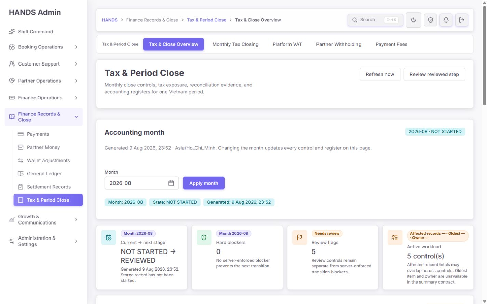
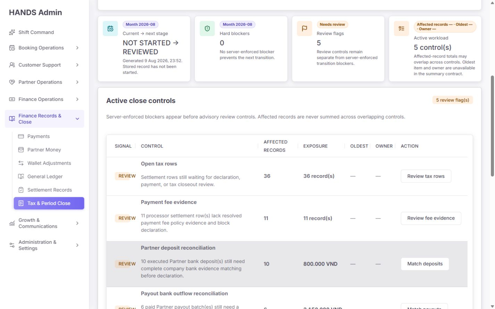
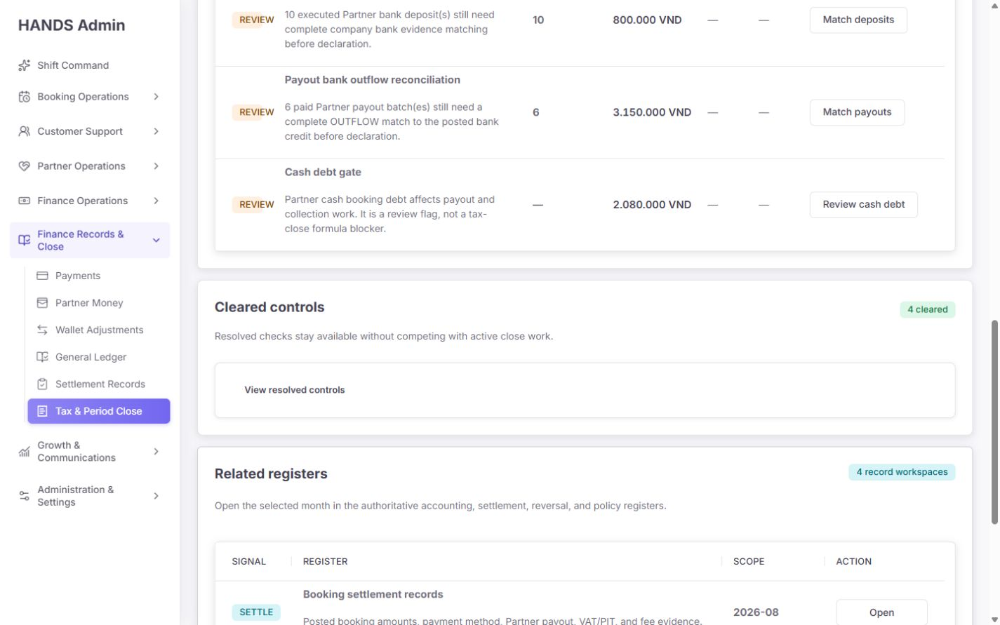
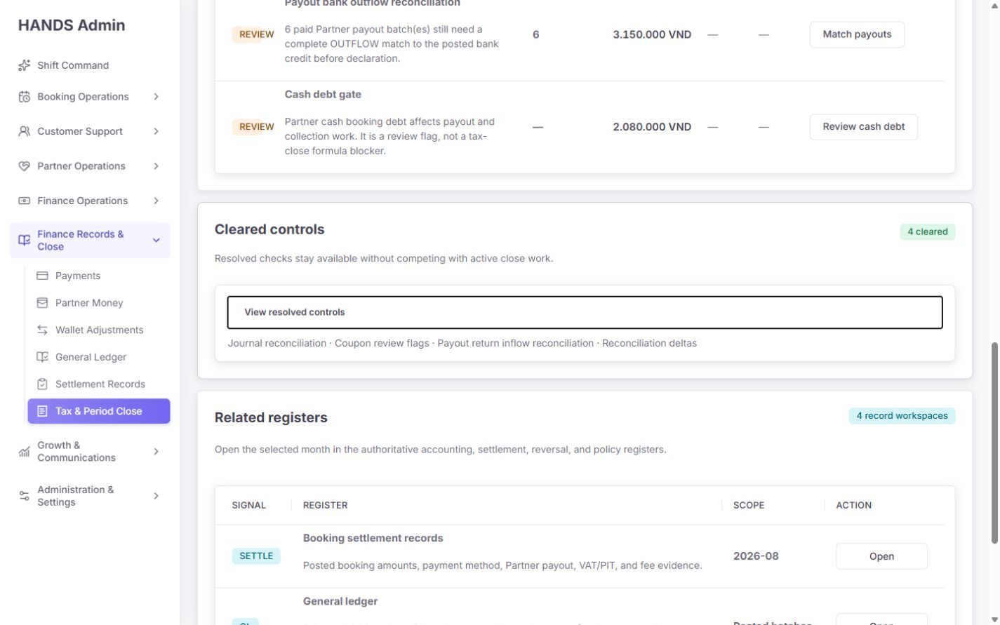
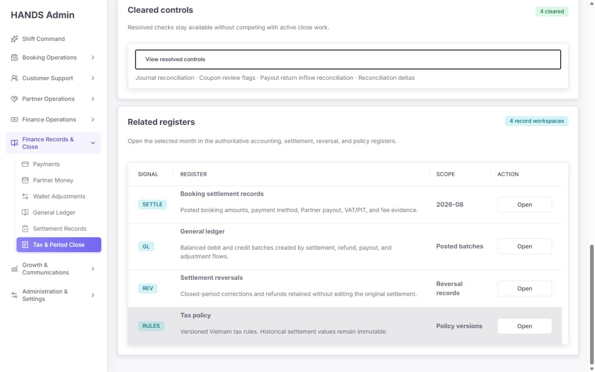
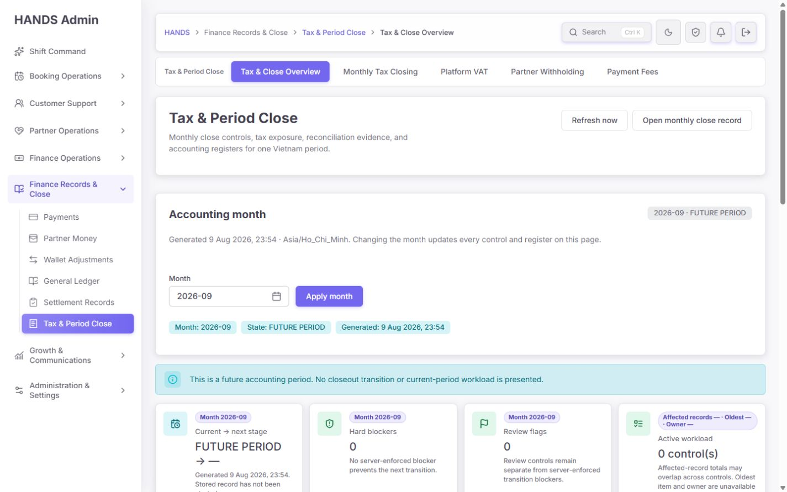
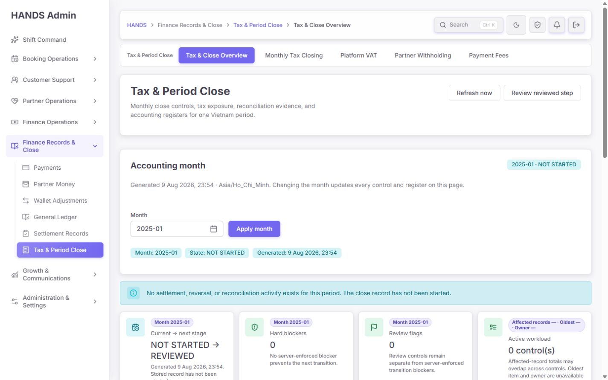
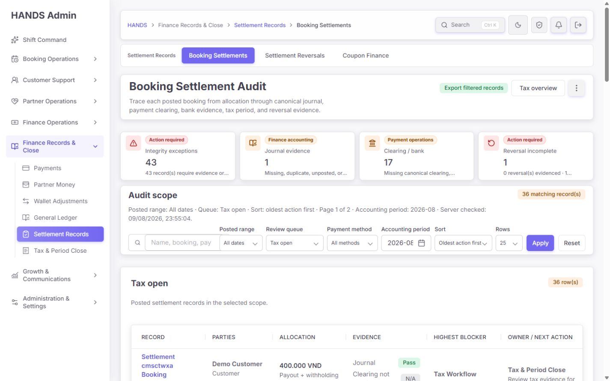
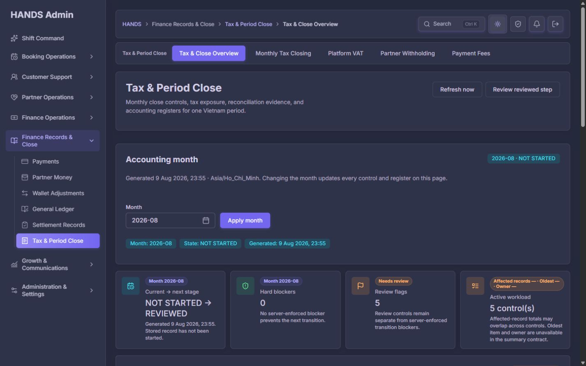
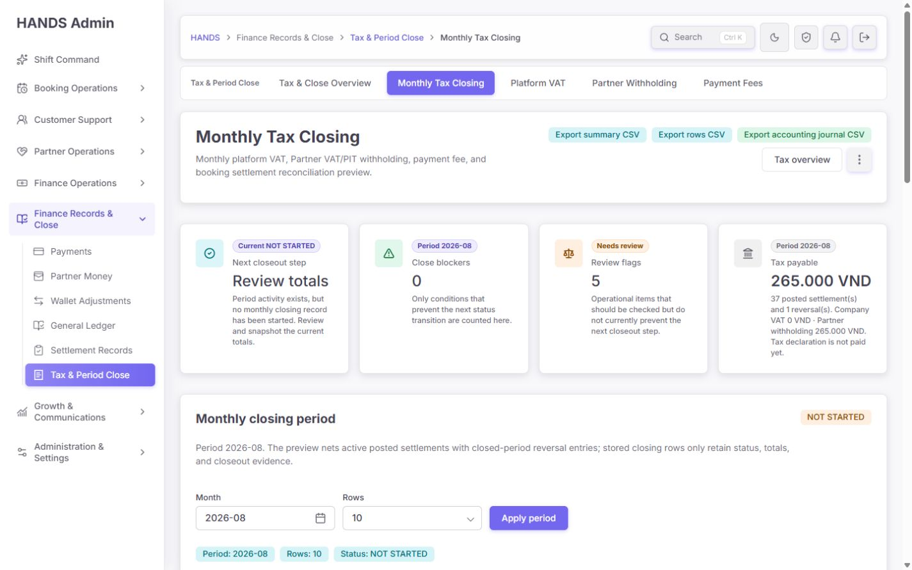

# Finance & Tax (`/finance-tax`) 개선 후 심층 재감사 보고서

- 감사일: 2026-08-09 (Asia/Bangkok)
- 대상: `http://localhost:3101/finance-tax`
- 비교 기준: `output/finance-tax-audit-2026-08-09/finance-tax-deep-audit-report.md`
- 검수 해상도: **1440 × 900 데스크톱만**
- 제외 범위: 1024px 이하, 모바일, 태블릿, 반응형 축소 화면
- 검수 관점: 회계·재무 운영자, 월 마감 담당자, 승인자, 감사 추적 담당자
- 작업 성격: 화면·코드·문구·데이터 계약·드릴다운·상태·성능·접근성 재감사
- 소스 수정 여부: 없음. 이 문서와 검수 스크린샷만 추가함.

---

## 1. 최종 판정

### 종합 점수: **74 / 100 — 큰 방향은 성공했지만 아직 ‘신뢰 가능한 월 마감 관제 화면’은 아님**

이전 48점에서 확실히 개선됐다. 특히 서버의 월 마감 preflight를 기준으로 blocker를 표시하고, 회사 부담 쿠폰을 포함한 정산식으로 계산을 통일했으며, 주요 세금·수수료·은행 대사 링크에 선택 월을 보존한 점은 실질적인 개선이다. 화면도 과거의 장황한 대시보드에서 한 회계월을 기준으로 한 명령 화면에 가까워졌다.

그러나 운영자가 이 화면을 믿고 월 마감을 진행하기에는 다음 두 가지 P0 문제가 남아 있다.

1. **월별 `Cash debt` 신호가 모든 기간의 현금 정산 목록으로 이동한다.** 2026-08의 금액을 눌렀는데 `/cash-settlements?range=all`로 열리므로, 출발 숫자와 도착 목록의 범위가 다르다.
2. **이 화면은 `Open tax rows`를 참고용 review flag로 설명하지만, 도착 화면은 동일 행을 `Integrity exceptions`와 `Action required`로 분류한다.** 같은 레코드가 화면에 따라 위험 성격이 달라져 운영 판단 기준이 흔들린다.

이외에도 첫 화면에 실제 작업 행이 전혀 보이지 않고, `Oldest`와 `Owner` 열이 전부 `—`이며, 미래월·무활동월을 ‘blocker 없음/cleared’처럼 긍정적으로 표현하는 문제가 남아 있다. 따라서 현재 상태는 **“기능 개선 완료, 운영 의미 체계와 정보 밀도 보완 필요”**로 판정한다.

### 영역별 평가

| 영역 | 점수 | 판정 |
|---|---:|---|
| 월 마감 계산·서버 preflight 정합성 | 86 | 핵심 계산과 blocker 출처가 크게 개선됨 |
| 월 범위·드릴다운 연속성 | 68 | 주요 링크는 개선됐으나 Cash debt와 복귀 동선이 깨짐 |
| 상태·다음 행동의 명확성 | 64 | 미래/무활동/NOT STARTED 표현과 CTA가 아직 혼란스러움 |
| 운영 우선순위 판단 | 56 | 담당자·최고 경과시간·SLA가 없어 작업 배분이 불가 |
| 1440px 정보 밀도·시각 계층 | 65 | 보기 좋아졌지만 첫 작업 행이 접힘 아래에 있음 |
| 문구·용어 일관성 | 66 | 중복·기계적 문구·상태 의미 충돌이 남음 |
| 접근성 기본 구조 | 80 | 제목·표·라벨·포커스는 양호, 링크 이름은 과도하게 장황 |
| 오류·빈 상태 | 74 | 오류 안전성은 좋으나 ‘0건’과 ‘검증 완료’를 혼동 |
| 성능·구현 단순성 | 88 | 요약 API 1회, 로컬 warm navigation 양호 |

---

## 2. 이번 재감사에서 확인한 화면

### 현재 회계월 상단



### 활성 통제 목록



### 통제 하단과 관련 원장



### Cleared controls 펼침 상태와 키보드 포커스



### 관련 원장 목록



### 미래 회계월 상태



### 과거 무활동 회계월 상태



### Open tax rows 실제 드릴다운



### 다크 테마



### Monthly close 다음 단계 화면



---

## 3. 이전 감사 항목 대비 반영 결과

| 이전 핵심 지적 | 현재 결과 | 판정 |
|---|---|---|
| `Closeout gates`가 단순 합산으로 과장됨 | 서버 `preflight.blockers`를 authoritative source로 사용 | **완료** |
| Open tax가 `review=open`으로 이동 | `review=tax-open&period=...&sort=oldest`로 이동 | **완료** |
| 쿠폰 검토 링크가 월을 잃음 | 쿠폰 링크에 `period`와 `returnTo` 보존 | **완료** |
| Partner deposit/payout 은행 링크가 범위를 잃음 | 월, 방향, source, review, sort, returnTo 보존 | **완료** |
| 쿠폰 정산식에서 company coupon 누락 | 서버와 UI가 canonical allocation identity를 사용 | **완료** |
| 미래월·무활동월을 일반 DRAFT처럼 표시 | 별도 안내문과 `FUTURE PERIOD` 상태 추가 | **부분 완료** — 카드/CTA 의미는 아직 잘못됨 |
| 0건 통제를 모두 펼쳐 표시 | 활성 통제와 `Cleared controls` disclosure로 분리 | **부분 완료** — ‘cleared’ 정의가 부정확 |
| 모호한 `Reconcile` 버튼과 줄바꿈 | `Review tax`, `Review fee`, `Match deposits` 등 구체화 | **완료** |
| 정산 감사 링크가 `review=open`만 표시 | 관련 원장은 `review=all` 사용 | **완료** |
| 담당자·SLA·최고 경과시간 없음 | 표 열은 추가됐으나 값이 모두 `—` | **미완료** |
| 첫 화면에서 바로 작업 시작 불가 | Active controls는 여전히 y=874, 첫 행은 y=1078 | **미완료** |
| 현재→다음 단계가 불명확 | 카드 추가, 서버 nextStatus 연결 | **부분 완료** — 헤더 CTA 문구 부자연스러움 |
| 관련 레코드가 큰 표를 차지 | 4행 표로 단순화됐으나 여전히 탐색용 목록에 과함 | **부분 완료** |

### 반영 수준 요약

- 완전 반영: 7개
- 부분 반영: 4개
- 미반영: 2개
- 새로 발견된 주요 문제: 5개

---

## 4. P0 — 운영 신뢰를 깨는 필수 수정

### P0-1. 월별 Cash debt 금액과 도착 목록의 기간이 다르다

**현재 동작**

- 요약 화면은 선택 회계월의 `cashDebtTotal`을 보여준다.
- 현재 2026-08 화면에는 `2,080,000 VND`가 표시된다.
- 클릭 링크는 `/cash-settlements?range=all`이다.
- 선택 월과 원래 화면으로 돌아갈 `returnTo`가 없다.

**운영자 영향**

운영자는 2026-08 마감 위험 2,080,000 VND를 처리하러 들어가지만, 도착 목록에서는 전체 기간의 현금 정산 건을 보게 된다. 출발 금액을 목록에서 재현할 수 없고, 다른 월의 건을 실수로 처리할 가능성이 있다. 월 마감 관제 화면에서 가장 중요한 **숫자→근거 레코드 일치 계약**을 위반한다.

**코드 근거**

- `apps/admin_web/app/finance-tax/tax-settlement-page-model.ts:1775-1784`
- 현재 Cash debt href에는 `period`와 `returnTo`가 없음.

**수정 방법**

1. Cash settlement 목록/API에 `period=YYYY-MM` 필터를 공식 지원한다.
2. 링크를 다음 계약으로 통일한다.

```text
/cash-settlements?period=2026-08&review=debt&sort=oldest&returnTo=%2Ffinance-tax%3Fperiod%3D2026-08
```

3. `range=all`과 `range=today`로 월별 마감 데이터를 흉내 내지 않는다.
4. 목록의 총액과 건수가 overview의 `cashDebtTotal` 및 신규 `cashDebtCount`와 동일해야 한다.
5. 목록 → 상세 → 뒤로가기까지 period와 returnTo를 유지한다.

**합격 기준**

- 2026-08 Cash debt 클릭 후 URL에 `period=2026-08`이 존재한다.
- 도착 목록의 합계가 2,080,000 VND와 정확히 일치한다.
- 2026-07과 2026-08을 각각 열었을 때 서로의 레코드가 섞이지 않는다.
- `Back to tax close`가 원래 선택 월로 돌아간다.

---

### P0-2. Open tax의 위험 분류가 출발 화면과 도착 화면에서 충돌한다

**현재 동작**

- `/finance-tax`는 Open tax 36건을 **hard blocker와 별개인 review flag**로 설명한다.
- 드릴다운 URL 자체는 올바르게 `review=tax-open&period=2026-08`을 보존한다.
- 그러나 도착한 Booking Settlement Audit 화면은 동일 대상을 `Action required`, `Integrity exceptions`, `Tax Workflow Open`으로 표현한다.

**운영자 영향**

재무 운영자는 ‘참고 검토’인지 ‘데이터 무결성 오류’인지 구분할 수 없다. 같은 레코드가 화면에 따라 다른 위험 등급을 갖기 때문에, blocker 0이라는 상단 판정도 신뢰하기 어려워진다. 단순 문구 문제가 아니라 **운영 상태 모델의 계약 충돌**이다.

**수정 원칙**

- `TAX_WORKFLOW_OPEN`은 기본적으로 workflow queue다.
- 세금 상태가 열려 있다는 사실만으로 integrity exception이 되면 안 된다.
- 다음과 같은 별도 조건이 있을 때만 exception/blocker로 승격한다.

```text
Tax workflow open
  ├─ 정상 처리기한 이내 → Review queue / In progress
  ├─ SLA 초과 → Overdue review
  ├─ 필요한 세금 근거 누락 → Evidence exception
  └─ 신고 단계 전환을 막는 서버 preflight blocker → Hard blocker
```

**수정 방법**

1. overview, Booking Settlement Audit 목록, 상세, export에서 같은 taxonomy를 사용한다.
2. `Integrity exceptions`에는 실제 금액 불일치, 원장 불일치, 근거 누락 등만 포함한다.
3. Tax open은 `Tax workflow queue` 또는 `Tax review pending`으로 별도 집계한다.
4. hard blocker 수는 오직 서버 preflight blocker code에서 파생한다.
5. SLA와 due date를 추가해 정상 진행과 지연을 구분한다.

**합격 기준**

- 동일 settlement ID가 overview와 audit 목록에서 같은 위험 등급을 갖는다.
- tax-open 36건이 자동으로 `Integrity exceptions 36`이 되지 않는다.
- `Hard blockers 0`일 때 도착 화면도 hard error처럼 보이지 않는다.
- SLA 초과 또는 evidence 누락 fixture에서만 경고/오류로 승격된다.

---

## 5. P1 — 다음 개선 라운드에서 반드시 처리할 항목

### P1-1. `Oldest`와 `Owner`가 전부 `—`라서 표가 작업 배분 도구가 되지 못한다

**관찰**

- Active controls 표에는 `Oldest`, `Owner` 열이 있다.
- 다섯 행 모두 `—`로 렌더링된다.
- 코드에서 두 값이 하드코딩된 `—`다.
- 상단 Active workload 카드도 `Affected records — · Oldest — · Owner —`를 노출한다.

**문제**

표가 ‘무슨 일이 있는가’만 알려주고 ‘무엇부터, 누가 할 것인가’는 알려주지 않는다. 빈 메타데이터를 여러 번 보여 주는 것은 미구현 상태를 시각 장식으로 반복하는 것과 같다.

**코드 근거**

- `apps/admin_web/app/finance-tax/page.tsx:277-289`
- summary API 타입에는 per-control owner/oldest/SLA가 없음.

**수정 방법**

각 control summary에 다음을 추가한다.

```ts
type FinanceCloseControlSummary = {
  key: string;
  affectedRecordCount: number | null;
  exposureAmount: number | null;
  oldestOpenAt: string | null;
  ownerId: string | null;
  ownerName: string | null;
  unassignedCount: number;
  overdueCount: number;
  slaMinutes: number | null;
};
```

- 데이터가 없으면 열 자체를 제거한다. `—` 5개를 유지하지 않는다.
- owner가 여러 명이면 `3 owners · 2 unassigned`처럼 표현한다.
- Oldest는 `4d 3h`와 정확한 timestamp tooltip을 함께 제공한다.
- 기본 정렬은 `hard blocker → overdue → oldest → exposure`다.

**합격 기준**

- 활성 행마다 Owner 또는 `Unassigned`가 표시된다.
- 활성 행마다 Oldest 또는 명시적 `Not tracked`가 표시된다.
- `—`만 있는 열이 없다.
- 운영자가 10초 이내에 첫 처리 대상을 고를 수 있다.

---

### P1-2. 1440×900 첫 화면에 실제 작업 행이 하나도 보이지 않는다

**실측**

| 요소 | top | bottom | height |
|---|---:|---:|---:|
| 페이지 헤더 | 24 | 94 | 70 |
| Accounting month panel | 353 | 650 | 297 |
| Decision strip | 666 | 858 | 192 |
| Active controls section | 874 | 1747 | 872 |
| Active table | 1013 | - | - |
| 첫 활성 행 | 1078 | 1190 | 112 |
| viewport | 0 | 900 | 900 |

첫 화면에서 보이는 것은 제목, 큰 여백, 월 필터, 카드뿐이다. 운영자가 실제로 일하기 위해 반드시 스크롤해야 한다.

**수정 방법**

- 상단 제목 블록과 Accounting month를 하나의 compact command bar로 합친다.
- month, state, generated time 반복을 제거한다.
- Decision strip 높이를 120px 이내로 줄인다.
- Active controls 제목과 첫 행을 y=760 이전에 배치한다.
- 1440 폭에서 4개 카드의 긴 scope chip을 한 줄 요약으로 바꾼다.

**권장 1440px 구조**

```text
┌ Tax & Period Close ─ 2026-08 ─ NOT STARTED ─ Generated 00:01 ─ Refresh ┐
│ No hard blockers · 5 review controls · Next: Review totals             │
├ Active close controls ───────── Sort: priority / oldest ────────────────┤
│ Tax review       36     4d 3h   Unassigned   Review tax                │
│ Payment evidence 11     2d 1h   Finance Ops Review fee                │
│ Deposit match    10     8h      Lan         Match deposits             │
└──────────────────────────────────────────────────────────────────────────┘
  No-open-signal controls (4)        Related registers
```

**합격 기준**

- 1440×900, 100% zoom에서 Active controls header와 첫 번째 전체 행이 스크롤 없이 보인다.
- 첫 행 bottom ≤ 900, 권장 bottom ≤ 820.
- month/state/generated 정보가 각각 한 번만 보인다.

---

### P1-3. 미래월과 무활동월에서 ‘blocker 없음’이 성공 신호처럼 보인다

**미래월 2026-09**

- `FUTURE PERIOD` 안내문은 적절하다.
- 그러나 `Hard blockers 0`과 초록색 성공 표현이 남는다.
- 상세 문구는 `No server-enforced blocker prevents the next transition`인데 next transition 자체가 없다.
- 헤더에는 `Open monthly close record`가 남는다.

**무활동 과거월 2025-01**

- 활동 없음 안내문은 적절하다.
- 그러나 `NOT STARTED → REVIEWED`, `Hard blockers 0`, `Cleared controls 9`가 함께 보인다.
- 아무 신호가 없다는 사실이 ‘9개 통제가 검증 완료됨’처럼 보인다.

**수정 방법**

- 미래월: decision cards와 transition CTA를 숨기고 `Future period — monitoring not started` 한 상태만 표시한다.
- 무활동월: `No activity — no close record`를 주 상태로 표시한다.
- 0건을 `cleared`로 부르지 않는다. `No open signal` 또는 `Not evaluated`로 분리한다.
- 서버 evidence가 확인된 경우에만 `Cleared`를 사용한다.
- 무활동월의 CTA는 `Create zero-activity close record`처럼 실제 정책이 있을 때만 제공한다.

**합격 기준**

- 미래월에 green success blocker 카드와 transition CTA가 없다.
- 무활동월에 `9 cleared`가 없다.
- `Cleared`는 검증 근거·검증 시각·검증 주체가 있을 때만 표시된다.

---

### P1-4. `Affected records`와 `Exposure`가 같은 건수를 반복한다

Open tax와 Payment fee 행에서 다음처럼 보인다.

```text
Affected records: 36
Exposure: 36 record(s)
```

금액이 없는 경우 코드가 count를 exposure로 다시 넣기 때문이다. Exposure는 금액/재무 영향이어야 하며, 건수의 동의어가 아니다.

**수정 방법**

- amount가 없으면 Exposure는 `—` 또는 `Not calculated`로 표시한다.
- 가능하면 실제 exposure amount를 API가 계산한다.
- 금액이 의미 없는 workflow queue라면 열 이름을 `Financial exposure`로 명확히 하고 빈 값을 허용한다.
- `record(s)` 기계적 표기를 제거하고 `36 records` 또는 locale-aware pluralization을 사용한다.

**합격 기준**

- 한 행에서 Affected records와 Exposure가 동일 count를 중복 표시하지 않는다.
- Exposure는 금액 또는 명시적 unavailable state만 허용한다.

---

### P1-5. `Cleared controls`는 검증 완료가 아니라 단순히 현재 값이 0인 목록이다

현재 구현은 `hasPriorityWork === false`인 risk link를 모두 cleared로 분류한다. 이 정의는 다음을 구분하지 못한다.

- 실제 근거 대사가 완료됨
- 해당 월에 데이터가 없음
- 아직 평가하지 않음
- API가 집계할 대상이 없음

또한 disclosure를 펼치면 이름만 나열되고 건수, 검증 시각, 근거 링크, 담당자가 없다.

**수정 방법**

상태를 최소 3개로 분리한다.

| 상태 | 의미 | UI |
|---|---|---|
| Open | 실제 검토/처리 필요 | Active controls |
| Verified clear | 근거 확인 완료 | Cleared controls + evidence |
| No signal / Not evaluated | 0건 또는 평가 대상 없음 | 보조 disclosure |

- 펼침 버튼은 `Show verified controls` / `Hide verified controls`로 상태를 바꾼다.
- 각 항목에 `verifiedAt`, `verifiedBy`, evidence link를 표시한다.
- 아직 서버 데이터가 없다면 우선 섹션명을 `Controls with no open signal`로 바꾼다.

---

### P1-6. 헤더 CTA `Review reviewed step`가 문법과 행동 의미 모두 부자연스럽다

현재 문구는 `Review ${nextStatus.toLowerCase()} step`로 조합된다. 그래서 상태별로 다음과 같은 기계적 문구가 생긴다.

- `Review reviewed step`
- `Review declared step`

운영자는 버튼을 눌렀을 때 단순히 상세를 보는지, 실제 상태 전환을 시작하는지 알기 어렵다.

**권장 문구**

| 상태 | 현재 | 권장 |
|---|---|---|
| NOT STARTED | Review reviewed step | `Review monthly totals` |
| REVIEWED | Review declared step | `Prepare tax declaration` |
| DECLARED | Review paid step | `Record tax payment` |
| PAID | Review closed step | `Run final close checks` |
| FUTURE | Open monthly close record | CTA 제거 또는 `View future period` |
| NO ACTIVITY | Review reviewed step | 정책에 따라 `Create zero-activity close` 또는 CTA 제거 |

버튼 라벨은 상태 enum을 소문자로 붙여 만들지 말고 명시적 매핑 테이블을 사용해야 한다.

---

### P1-7. 월 선택 정보가 세 번 반복되고 상단 공간을 과도하게 사용한다

현재 `2026-08`, `NOT STARTED`, 생성 시각이 Accounting month 패널, filter chip, decision card에 반복된다. 반복 자체보다 문제가 되는 것은 상단 650px가 실제 queue 진입 전에 소모된다는 점이다.

**수정 방법**

- month input + state badge + generated time을 한 행에 둔다.
- 설명문은 한 줄 이하로 줄인다.
- generated time은 `Updated 1 min ago`를 기본으로 하고 정확 시각은 tooltip/보조 텍스트로 둔다.
- `Selected month`, `Period state`, `Generated` chip은 제거하거나 command bar로 흡수한다.

---

### P1-8. 드릴다운에서 원래 월로 돌아오는 계약이 일관되지 않다

overview에서 tax-open으로 갈 때 `returnTo`는 포함된다. 그러나 도착 화면의 상단 `Tax overview` 동선은 고정 `/finance-tax`를 사용해 기간을 잃을 수 있다. 다른 finance subpage도 같은 위험이 있다.

**수정 방법**

- 모든 finance list/detail은 안전하게 검증된 local `returnTo`를 우선 사용한다.
- `Tax overview` 고정 링크와 `Back to tax close` 문맥 링크를 구분한다.
- period가 있는 화면에서 overview로 돌아갈 때 항상 `?period=YYYY-MM`을 보존한다.

**합격 기준**

```text
Finance tax 2026-07
→ Tax open queue 2026-07
→ Settlement detail
→ Back to queue 2026-07
→ Back to tax close 2026-07
```

위 왕복 전체에서 월이 바뀌지 않는다.

---

## 6. P2 — 품질·가독성 보완

### P2-1. KPI 카드의 보조 scope 문구가 너무 길고 줄바꿈된다

`Affected records — · Oldest — · Owner —`처럼 정보가 없는 긴 문구가 카드 안에서 여러 줄로 감긴다. 값이 없을 때는 문구 자체를 숨겨야 한다. 카드에는 핵심 숫자와 의미 한 줄만 남긴다.

### P2-2. Active workload의 `5 controls`는 우선순위 판단에 도움이 적다

control 종류 개수와 실제 영향을 받는 레코드 수가 분리되어야 한다. 중복 queue가 있어 단순 합계를 못 낸다면 `5 active controls`만 표시하되, scope 줄에는 `Unique affected records unavailable`처럼 구현 제약을 노출하지 말고 API 계약을 해결한 뒤 보여 준다.

### P2-3. Related registers는 탐색 링크 4개에 비해 표가 크다

`Scope` 열의 값도 서로 비교 가능한 개념이 아니다.

- Settlement: `2026-08`
- General ledger: `Posted batches`
- Reversals: `Reversal records`
- Tax policy: `Policy versions`

권장 방식은 compact link group 또는 2×2 카드다. Scope는 모두 같은 차원으로 맞춘다.

```text
Settlement audit · 2026-08
General ledger · 2026-08
Reversals · 2026-08
Tax policy · Global
```

### P2-4. raw signal code가 operator label보다 먼저 보인다

`REVIEW`, `FEE`, `BANK`, `CASH`, `SETTLE`, `GL`, `REV`, `RULES`는 개발자에게는 짧지만 운영자에게는 즉시 이해되지 않는다. 테이블의 주 label을 `Tax review`, `Fee evidence`, `Bank match`, `Cash debt`로 하고 raw code는 tooltip이나 보조 metadata로 이동한다.

### P2-5. `(s)` 형태의 기계적 복수형을 제거해야 한다

`5 review flag(s)`, `36 record(s)`, `5 control(s)`는 완성도와 읽기 속도를 떨어뜨린다. 영어 UI라면 locale-aware plural helper를 쓰고, 문구 자체를 더 자연스럽게 바꾼다.

### P2-6. Cleared disclosure의 열림 상태가 약하다

포커스 링은 확인됐고 양호하다. 다만 펼친 후에도 label이 `View resolved controls`로 남아 있다. chevron 회전과 `Hide ...` label을 적용하고 `aria-expanded`를 유지한다.

### P2-7. 카드 전체가 매우 긴 접근성 이름을 갖는다

KPI 카드 링크의 accessible name에 label, 값, detail, scope가 모두 반복된다. screen reader 사용자는 카드 4개를 지날 때 과도한 정보를 듣는다.

- 링크 이름은 `Open hard blockers`, `Open active controls`처럼 행동 중심으로 짧게 지정한다.
- 장문 설명은 `aria-describedby`로 연결한다.
- 미래/무활동 상태에서 비행동 카드에는 링크 역할을 제거한다.

---

## 7. 현재 잘된 부분 — 유지해야 할 기준

### 7.1 서버 preflight가 blocker의 단일 출처가 됐다

이전처럼 여러 숫자를 단순 합산하지 않고 `summary.preflight.blockers`를 사용한다. 다음 단계도 서버 `nextStatus`에서 가져온다. 이는 이번 개선에서 가장 중요한 성공이다.

### 7.2 정산 계산식이 회사 부담 쿠폰을 포함한다

서버가 `settlementAllocationIdentity`를 사용하고 `companyCouponExpense`를 포함한다. UI 설명과 서버 계산이 같은 기준을 사용해 과거의 formula contradiction을 제거했다.

### 7.3 주요 월별 드릴다운의 URL 계약이 개선됐다

다음 링크는 선택 월과 필요한 queue 필터를 보존했다.

- Open tax rows
- Payment fee evidence
- Partner deposit reconciliation
- Payout bank outflow reconciliation
- Payout return inflow reconciliation
- Coupon review flags

특히 tax-open 실제 클릭 결과가 다음과 같이 확인됐다.

```text
/finance-tax/booking-settlement-audit
?range=all
&review=tax-open
&period=2026-08
&sort=oldest
&returnTo=%2Ffinance-tax%3Fperiod%3D2026-08
```

### 7.4 오류 상태가 숫자를 0으로 위장하지 않는다

API 실패 시 `Tax and close data unavailable`, API status, retry 동선을 보여 주고 가짜 0건 KPI를 렌더링하지 않는다. 운영 화면에서 매우 중요한 안전장치다.

### 7.5 활성 통제와 0건 통제를 분리했다

기존의 0건 행 소음을 줄인 방향은 옳다. 다만 이름을 `Cleared`가 아닌 `No open signal`로 조정하고, 진짜 검증 완료 상태가 생기면 별도 분리해야 한다.

### 7.6 액션 라벨이 구체적으로 바뀌었다

`Review tax`, `Review fee`, `Match deposits`, `Match payout`, `Clear cash debt`는 모두 모호한 `Reconcile`보다 낫다. 1440px에서 action 줄바꿈도 발견되지 않았다.

### 7.7 다크 테마와 기본 시맨틱이 안정적이다

다크 테마에서 텍스트, 표, 카드, 상태 badge의 대비가 읽을 수 있는 수준이다. H1/H2, month label, table header, status notice, keyboard focus도 기본 구조가 갖춰져 있다.

---

## 8. 상태별 상세 감사

### 8.1 현재 활동 월 — 2026-08

**잘된 점**

- 선택 월과 상태가 명시됨.
- hard blocker와 review flag를 분리함.
- 활성 control만 표에 표시함.
- 서버 생성 시각을 보여 줌.

**남은 문제**

- 실제 작업 행이 접힘 아래에 있음.
- 5개의 review control이 있어도 담당자와 최고 경과시간이 없음.
- Open tax/Payment fee에서 건수가 exposure로 반복됨.
- `Review reviewed step`가 다음 행동을 설명하지 못함.
- `Hard blockers 0` 카드는 클릭 가능한데 열어야 할 blocker가 없음.

### 8.2 미래 월 — 2026-09

**잘된 점**

- 미래월 안내문이 명확함.
- period state를 `FUTURE PERIOD`로 분리함.
- 서버 preflight가 nextStatus null을 반환함.

**남은 문제**

- `Hard blockers 0` 성공 카드가 표시됨.
- 다음 단계가 없는데 blocker 설명은 ‘next transition을 막지 않는다’고 말함.
- `Open monthly close record` CTA가 미래월에서 행동 가능해 보임.
- 9개의 zero controls가 cleared로 계산될 수 있음.

### 8.3 과거 무활동 월 — 2025-01

**잘된 점**

- settlement/reversal/reconciliation activity가 없음을 안내함.
- close record가 아직 시작되지 않았음을 구분함.

**남은 문제**

- `NOT STARTED → REVIEWED`가 정상 진행 경로처럼 보임.
- `Hard blockers 0`, `Review flags 0`, `Active workload 0` 카드가 불필요하게 공간을 차지함.
- 9개 control을 cleared로 표현함.
- empty table이 `No finance rows`라는 일반 문구만 제공함.

**권장 빈 상태 문구**

```text
No finance activity for 2025-01
No settlements, reversals, bank-reconciliation signals, or close record were found.
[Create zero-activity close]  ← 정책상 필요한 경우에만
```

### 8.4 월 마감 상세 화면 연결

Overview에서 다음 단계 화면으로 이동은 가능하다. 그러나 CTA가 실제 operator task를 설명하지 못하고, 상세 화면의 overview 복귀 링크가 period/returnTo를 우선하지 않는 부분은 함께 보완해야 한다.

---

## 9. 정보 구조 재구성 제안

### 현재 구조의 문제

```text
Page title
큰 설명/여백
Accounting month 대형 패널
월/상태/generated chips
4개 KPI 카드
Active controls
Cleared controls
Related registers 표
```

중요한 작업 목록보다 맥락 설명이 앞에서 너무 많은 높이를 차지한다.

### 권장 구조

1. **Compact period command bar**
   - month picker
   - current state
   - generated age
   - refresh
   - 실제 next action
2. **Decision summary 한 줄**
   - `0 hard blockers · 5 review controls · 2 overdue · 3 unassigned`
3. **Active controls table**
   - priority, control, records, exposure, oldest, owner, SLA, action
4. **Evidence-confirmed clear / no signal disclosure**
5. **Related registers compact links**

### 카드 사용 원칙

- 숫자를 클릭해 실제 subset을 열 수 있을 때만 card-link를 사용한다.
- 0건이고 열 대상이 없으면 일반 status tile 또는 inline text를 사용한다.
- 값이 없는 scope metadata는 숨긴다.
- 한 카드에 핵심 숫자 1개, 의미 1줄, 행동 1개만 둔다.

---

## 10. 데이터 계약 개선안

현재 summary는 월 합계와 preflight에는 강하지만 queue 운영 metadata가 없다. overview가 실제 관제 화면이 되려면 다음 계약이 필요하다.

```ts
type AdminMonthlyTaxClosingOverview = {
  period: string;
  periodState: MonthlyTaxClosingPeriodState;
  generatedAt: string;
  hasActivity: boolean;
  preflight: {
    nextStatus: MonthlyTaxClosingStatus | null;
    ready: boolean;
    blockers: Array<{
      code: string;
      message: string;
      affectedRecordCount: number | null;
      exposureAmount: number | null;
      oldestOpenAt: string | null;
      ownerSummary: OwnerSummary | null;
      evidenceHref: string;
    }>;
  };
  controls: Array<{
    key: string;
    classification: 'BLOCKER' | 'REVIEW' | 'VERIFIED_CLEAR' | 'NO_SIGNAL';
    affectedRecordCount: number | null;
    uniqueAffectedRecordCount: number | null;
    exposureAmount: number | null;
    oldestOpenAt: string | null;
    overdueCount: number;
    unassignedCount: number;
    ownerSummary: OwnerSummary | null;
    href: string;
  }>;
};
```

### 계약 원칙

- `affectedRecordCount`와 `exposureAmount`는 다른 의미다.
- overview 숫자와 queue 목록은 같은 서버 filter predicate를 공유한다.
- `classification`은 클라이언트에서 count==0으로 추론하지 않는다.
- `VERIFIED_CLEAR`에는 evidence metadata가 필요하다.
- 겹치는 control의 단순 합계를 총 affected records로 표시하지 않는다.
- 필요하면 `uniqueAffectedRecordCount`를 서버에서 distinct settlement/transaction ID로 계산한다.

---

## 11. 문구 교정 목록

| 현재 문구 | 문제 | 권장 문구 |
|---|---|---|
| Review reviewed step | 문법 오류·행동 불명확 | Review monthly totals |
| Review declared step | enum 조합형 문구 | Prepare tax declaration |
| Open monthly close record (future) | 미래월에서 행동 가능해 보임 | CTA 제거 또는 View future period |
| No server-enforced blocker prevents the next transition | 미래월에는 next transition 없음 | No transition is available for a future period |
| Cleared controls | 0건을 검증 완료로 오인 | Controls with no open signal |
| View resolved controls | 펼침 상태와 표현 불일치 | Show/Hide no-open-signal controls |
| Exposure: 36 record(s) | 건수를 금액 영향처럼 중복 | Not calculated 또는 실제 금액 |
| 5 review flag(s) | 기계적 복수형 | 5 review controls |
| 5 control(s) | 기계적 복수형 | 5 active controls |
| No finance rows | 해당 월의 의미를 설명하지 못함 | No active close controls for 2025-01 |
| Current → next stage | 미래/무활동에는 부적합 | 상태별 label 또는 command summary |
| Related registers / Scope | scope 차원이 제각각 | Related evidence / Period or scope |

---

## 12. 접근성 감사

### 확인된 양호 항목

- 페이지 H1과 섹션 H2 구조 존재
- Month 입력의 label 존재
- 미래/무활동 안내에 status 역할 존재
- 표 header에 `scope=col`
- keyboard로 disclosure 접근 가능
- focus ring이 시각적으로 확인됨
- 다크 테마에서 주요 텍스트 판독 가능

### 보완 항목

- 전체 KPI card link의 accessible name을 짧게 지정한다.
- 설명은 `aria-describedby`로 분리한다.
- 값이 0이고 실제 도착 subset이 없으면 링크를 제거한다.
- disclosure label과 `aria-expanded` 상태가 일치하게 한다.
- 정확한 timestamp는 screen reader가 이해 가능한 형식으로 제공한다.
- 상태를 색상만으로 구분하지 않고 badge text를 유지한다.

### 감사 제한

이번 검수는 DOM 구조, 키보드 포커스, 시각 대비를 확인한 것이며, NVDA/JAWS/VoiceOver 전체 시나리오 검증이나 WCAG 적합성 인증은 아니다.

---

## 13. 성능·구현 감사

### 확인 결과

- page render는 월 summary API를 한 번 호출한다.
- 클라이언트가 여러 대형 list를 불러와 대시보드를 조립하지 않는다.
- 로컬 warm navigation 실측:
  - navigation: 약 116ms
  - operator H1 ready: 약 155ms
- 관련 집계는 서버에서 병렬 aggregate/raw SQL로 수행한다.
- 현재 로컬 환경에서는 ‘느린 화면’으로 재현되지 않았다.

### 남은 위험

- 이 수치는 로컬 warm navigation이며 production latency를 대표하지 않는다.
- 월 summary query의 production DB cardinality, index hit, cold cache는 별도 측정이 필요하다.
- 새 owner/oldest/SLA 집계를 추가할 때 N+1 query를 만들면 안 된다.
- queue별 summary를 하나의 bounded aggregate contract로 유지한다.

### 권장 성능 합격 기준

- 서버 summary p95 ≤ 800ms, p99 ≤ 1.5s
- admin route warm TTI ≤ 1.5s
- overview API 요청 수 1회 유지
- owner/oldest 추가 후 query count 증가가 상수 수준
- period/source/type filter column index 확인

---

## 14. 자동화 검증 결과

### 통과

```text
npm.cmd test --workspace @massage-vn/admin-web -- \
  app/finance-tax/page.spec.tsx \
  app/finance-tax/tax-settlement-page-model.spec.ts

2 files passed, 52 tests passed
```

```text
npm.cmd test --workspace @massage-vn/api -- \
  src/admin/admin.service.spec.ts \
  -t "summarizes monthly tax closing preview"

1 test passed, 591 skipped
```

```text
npm.cmd run typecheck --workspace @massage-vn/admin-web
PASS
```

```text
npm.cmd run typecheck --workspace @massage-vn/api
PASS
```

### 정적 UI anti-pattern detector

Impeccable detector를 대상 TSX와 globals CSS에 1회 실행했다. 전역 CSS의 다른 화면에 있는 side-tab 스타일 6개가 경고되었으나, 이번 `/finance-tax` 화면에 직접 적용된 target-specific 경고는 확인되지 않았다. 따라서 이번 페이지 finding으로 계산하지 않았다.

### 테스트가 아직 보장하지 않는 항목

- Cash debt 링크의 period/returnTo 보존
- overview count와 도착 queue count/amount의 동일성
- tax-open의 workflow vs integrity classification 일치
- 미래월에서 green blocker card와 transition CTA가 사라지는지
- 무활동월에서 `cleared`를 표시하지 않는지
- active first row가 1440×900 fold 안에 들어오는지
- Owner/Oldest/SLA 실제 값
- overview → list → detail → overview round-trip

---

## 15. 반드시 추가할 회귀 테스트

### P0 링크 계약

```ts
it('keeps cash debt scoped to the selected accounting month', () => {
  expect(cashDebtHref({ period: '2026-08' })).toBe(
    '/cash-settlements?period=2026-08&review=debt&sort=oldest&returnTo=%2Ffinance-tax%3Fperiod%3D2026-08',
  );
});
```

### P0 분류 계약

```ts
it('does not count in-SLA tax workflow rows as integrity exceptions', async () => {
  const result = await summary({ period: '2026-08' });
  expect(result.taxWorkflowOpenCount).toBe(36);
  expect(result.integrityExceptionCount).toBe(0);
  expect(result.preflight.blockers).not.toContainEqual(
    expect.objectContaining({ code: 'TAX_WORKFLOW_OPEN' }),
  );
});
```

### 상태 테스트

```ts
it.each([
  ['FUTURE_PERIOD', false, false],
  ['NOT_STARTED_NO_ACTIVITY', false, false],
])('does not render actionable blocker success for %s', async (state) => {
  // no green blocker link, no transition CTA, no cleared-by-zero wording
});
```

### 1440 visual contract

```ts
expect(firstActiveRow.boundingBox().bottom).toBeLessThanOrEqual(900);
```

### round-trip contract

```text
2026-07 overview → tax-open list → settlement detail → list → 2026-07 overview
```

---

## 16. Codex 구현 우선순위

### Batch 1 — P0 데이터 범위와 상태 계약

1. Cash settlement period filter를 API/URL/UI에 추가한다.
2. Cash debt overview/list 합계 계약을 맞춘다.
3. tax-open을 workflow queue와 integrity exception으로 분리한다.
4. overview/audit/detail/export taxonomy를 통일한다.
5. 모든 finance drilldown에 safe returnTo와 period round-trip을 적용한다.

**완료 조건:** 선택 월의 숫자와 도착 목록이 모든 queue에서 재현되고, 동일 레코드의 위험 등급이 화면마다 바뀌지 않는다.

### Batch 2 — 실제 운영 메타데이터

1. per-control oldest, owner, unassigned, overdue, SLA를 summary에 추가한다.
2. `—` 열을 제거한다.
3. affected count와 exposure를 분리한다.
4. default sort를 blocker/overdue/oldest 기준으로 만든다.

**완료 조건:** 운영자가 화면만 보고 첫 처리 대상과 담당자를 선택할 수 있다.

### Batch 3 — 상태 표현과 빈 상태

1. FUTURE, NO_ACTIVITY, ACTIVE, CLOSED를 별도 presentation model로 만든다.
2. 미래/무활동에서 transition과 green success를 제거한다.
3. `Cleared`와 `No signal`을 분리한다.
4. 상태별 명시적 CTA label map을 사용한다.

**완료 조건:** 데이터 없음, 검증 완료, 처리 필요가 색상과 문구 모두에서 명확히 구분된다.

### Batch 4 — 1440 밀도와 문구 polish

1. 상단을 compact command bar로 줄인다.
2. 첫 active row를 fold 안으로 올린다.
3. scope chip 반복과 `(s)` 문구를 제거한다.
4. Related registers를 compact link group으로 바꾼다.
5. 링크 accessible name을 간결하게 조정한다.

**완료 조건:** 1440×900 첫 화면에서 월, 상태, blocker, 첫 작업 행, 행동을 한 번에 볼 수 있다.

---

## 17. 최종 인수 체크리스트

### P0 — 모두 필수

- [ ] Cash debt link가 선택 `period`와 `returnTo`를 보존한다.
- [ ] Cash debt 도착 합계가 overview 금액과 같다.
- [ ] Tax workflow open과 integrity exception이 분리된다.
- [ ] 동일 레코드의 위험 분류가 overview/list/detail/export에서 같다.
- [ ] 모든 monthly drilldown의 왕복에서 선택 월이 유지된다.

### P1 — 운영 준비 완료 조건

- [ ] Owner, oldest, overdue/SLA 중 운영에 필요한 값이 실제 데이터로 표시된다.
- [ ] 전부 `—`인 열이 없다.
- [ ] Affected records와 Exposure가 같은 count를 반복하지 않는다.
- [ ] 미래월에 transition CTA와 green blocker card가 없다.
- [ ] 무활동월을 cleared로 표시하지 않는다.
- [ ] `Cleared`는 evidence-confirmed 상태에만 사용한다.
- [ ] CTA가 enum 조합형 문구가 아니라 실제 업무 행동을 말한다.
- [ ] 첫 active row가 1440×900 fold 안에 보인다.

### P2 — 마감 품질

- [ ] month/state/generated가 중복되지 않는다.
- [ ] scope chip이 빈 `—` metadata를 표시하지 않는다.
- [ ] Related registers scope가 period/global처럼 같은 차원으로 표현된다.
- [ ] `(s)` 복수형이 없다.
- [ ] disclosure label과 펼침 상태가 일치한다.
- [ ] 0건 KPI 카드가 불필요한 링크가 아니다.

---

## 18. 검수한 주요 코드

- `apps/admin_web/app/finance-tax/page.tsx`
- `apps/admin_web/app/finance-tax/page.spec.tsx`
- `apps/admin_web/app/finance-tax/tax-settlement-page-model.ts`
- `apps/admin_web/app/finance-tax/tax-settlement-page-model.spec.ts`
- `apps/admin_web/app/finance-tax/finance-overview-table-panel.tsx`
- `apps/admin_web/app/finance-tax/finance-list-command-card.tsx`
- `apps/admin_web/app/finance-tax/monthly-tax-closing/page.tsx`
- `apps/admin_web/app/finance-tax/booking-settlement-audit/page.tsx`
- `apps/admin_web/app/globals.css`
- `apps/admin_web/lib/admin-api.ts`
- `apps/api/src/admin/admin.service.ts`
- `apps/api/src/admin/admin.service.spec.ts`

---

## 19. 변경 파일·보호 영역·위험·다음 작업

### 이번 감사에서 추가한 파일

- 이 보고서 1개
- 1440×900 검수 스크린샷 10개

### 소스 변경

- 없음

### 보호한 영역

- 사용자가 수정 중인 광범위한 dirty worktree를 건드리지 않았다.
- API, admin web, DB schema, 테스트 코드는 읽기와 실행만 했다.
- 1024px 이하 responsive 코드는 감사 범위와 평가에서 제외했다.

### 남은 위험

- production DB에서 summary query의 실제 p95/p99는 측정하지 않았다.
- NVDA/JAWS/VoiceOver 전체 시나리오는 실행하지 않았다.
- Cash debt 월 필터가 현재 API 계약에 없어 실제 도착 합계 검증이 불가능하다.
- tax-open 분류 충돌은 연결된 Booking Settlement Audit 수정이 함께 필요하다.

### 다음 작업

가장 먼저 **Batch 1 — Cash debt period 계약과 tax-open 분류 계약**을 구현하고, 이 보고서의 P0 인수 테스트를 통과시킨다.

---

## 20. 한 문장 결론

이번 개선은 계산·preflight·주요 링크·오류 안전성에서 성공했지만, **월별 숫자와 근거 목록의 완전한 일치, workflow와 integrity의 일관된 분류, 담당자·경과시간, 첫 화면의 실제 작업 노출**이 해결돼야 Finance & Tax 페이지를 운영자가 믿고 쓰는 월 마감 관제 화면으로 승인할 수 있다.
