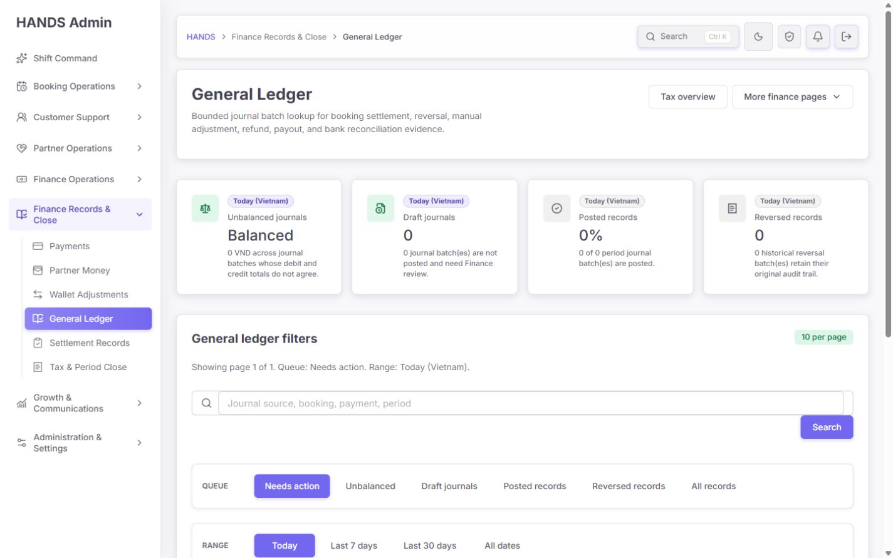
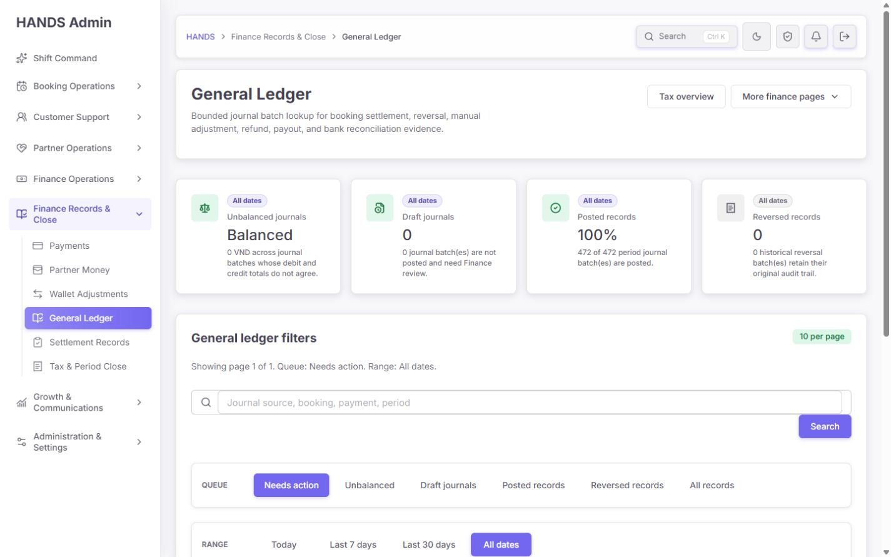
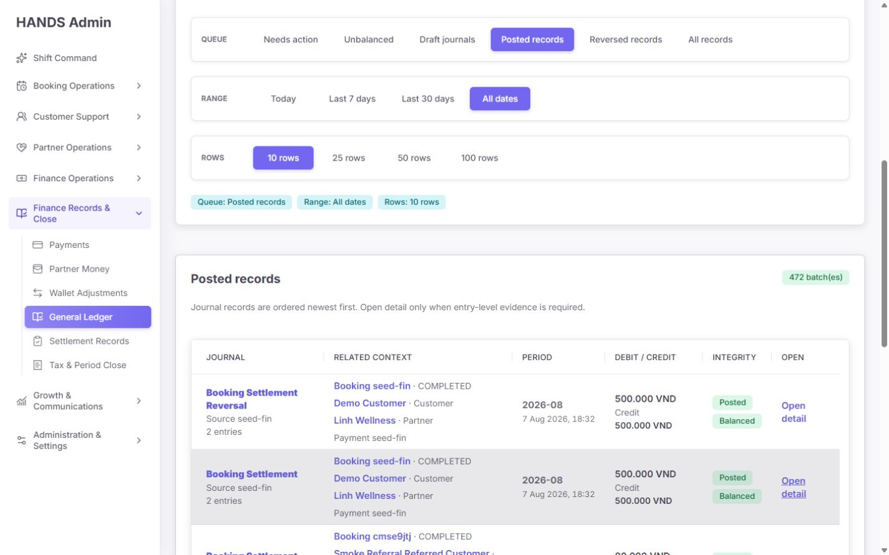
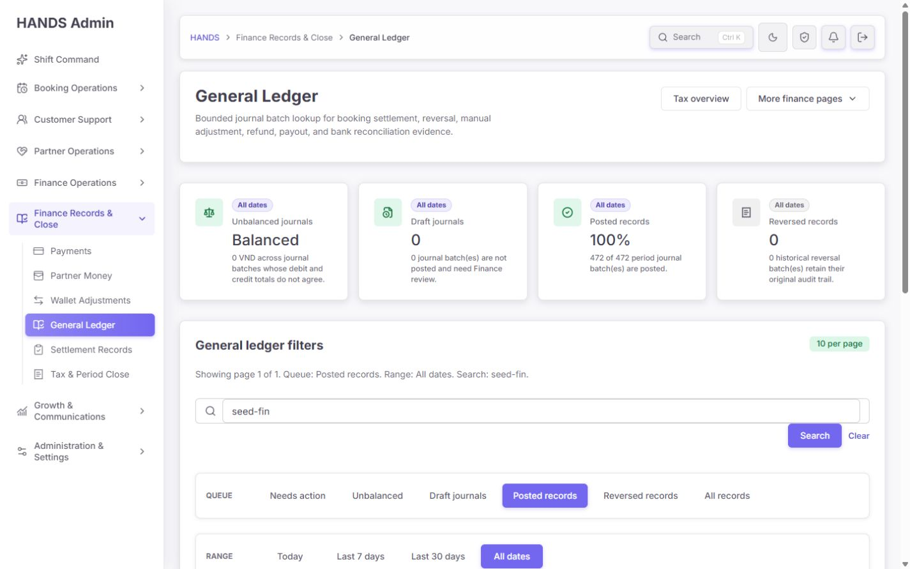
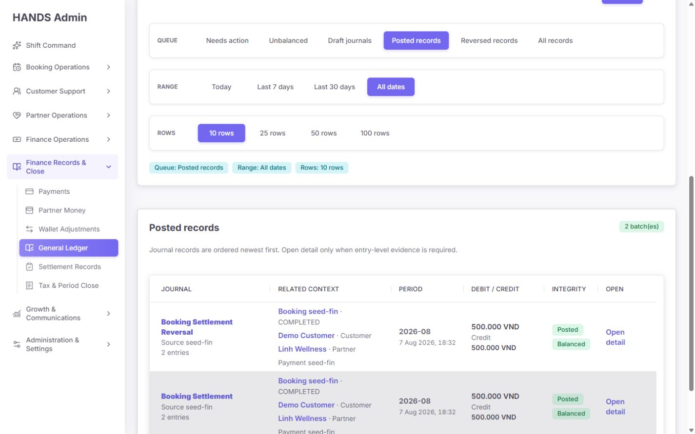
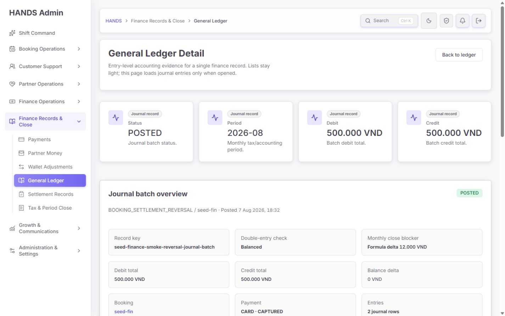
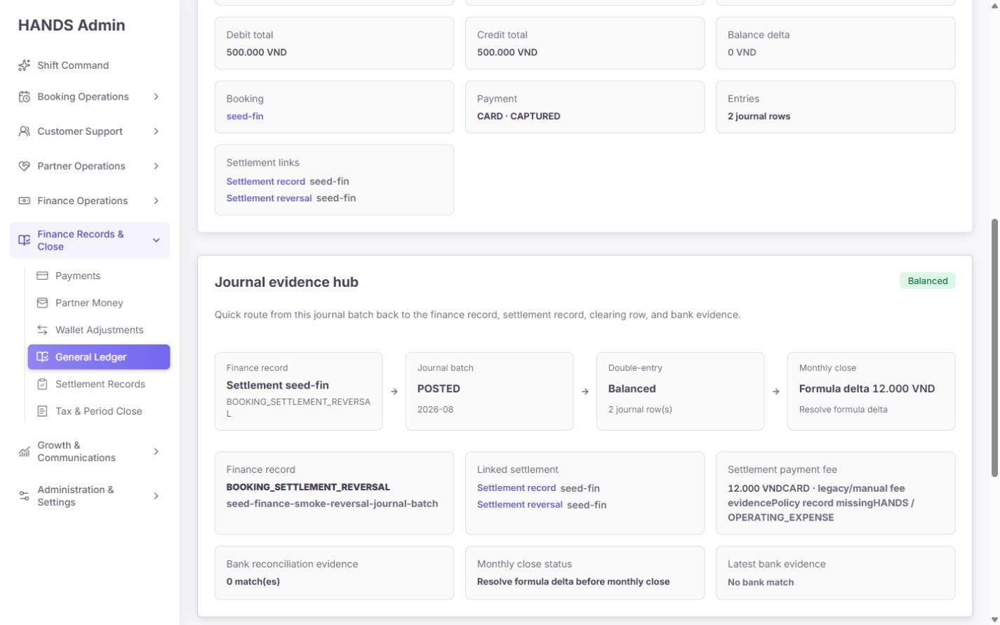
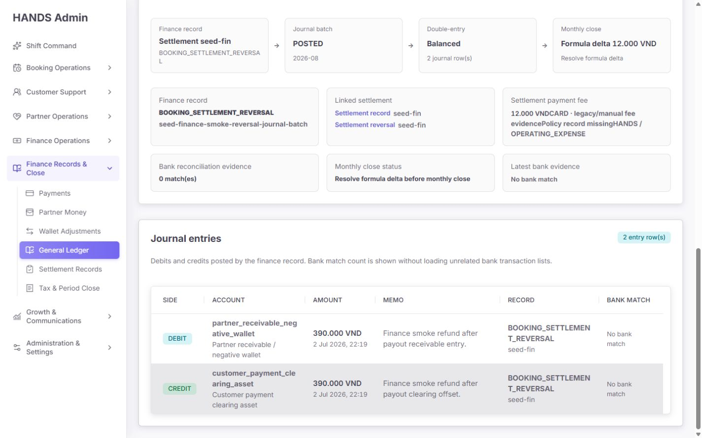
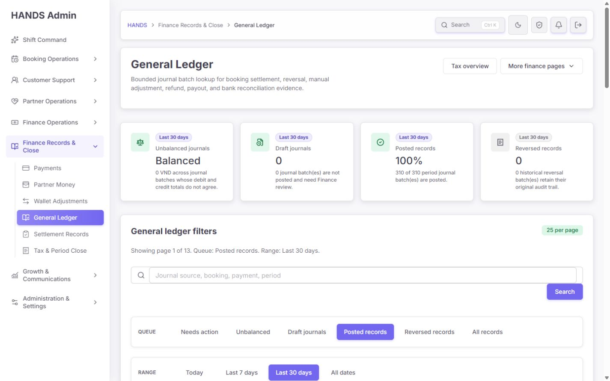
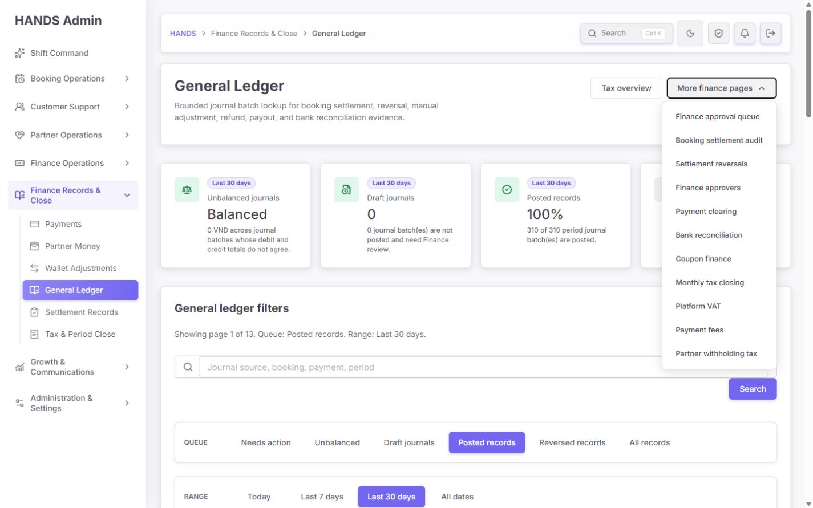

# General Ledger 운영자 관점 심층 감사 보고서

- 감사일: 2026-08-09
- 대상: `http://localhost:3101/finance-tax/general-ledger`
- 화면 기준: 1440×900 이상 데스크톱만 검사
- 제외: 1024px 이하 및 모바일·태블릿 반응형은 검사·평가·권고에서 완전히 제외
- 방법: 로그인 상태 실제 화면, 큐·기간·행 수·검색·상세·뒤로가기·보조 메뉴를 조작하고 Admin Web/API/DB schema/테스트를 교차 검증
- 금전 안전 원칙: 조회와 탐색만 수행했으며 전표 생성, 게시, 반전, 월마감 등 데이터 변경 동작은 실행하지 않음

## 1. 결론

현재 페이지는 “분개 배치 감사 목록”으로는 이전보다 구조가 좋아졌다. 기본 진입을 `Needs action`으로 제한했고, 배치 목록과 분개 상세를 분리했으며, 예약·고객·파트너·정산·은행 증거로 이동할 수 있다. 1440px 기준 기본 레이아웃도 무너지지 않는다.

그러나 운영자에게 `General Ledger`라고 약속하기에는 핵심 회계 계약이 부족하다. 종합 완성도는 **1.9/4, 약 48/100**으로 판단한다. 가장 큰 문제는 장식이나 간격이 아니라 다음 세 가지다.

1. **P0 — 화면의 `Balanced`가 실제 분개와 일치하지 않을 수 있다.** 실제 확인한 seeded reversal 배치는 상단 배치 차변·대변이 각각 500,000 VND였지만, 분개 행의 차변·대변 합계는 각각 390,000 VND였다. 현재 API와 UI는 저장된 `batch.totalDebit === batch.totalCredit`만 비교하므로 이 불일치를 검출하지 않고 초록색 `Balanced`를 표시한다.
2. **P1 — `All records` 필터가 작동하지 않는다.** 클릭하면 URL에서 `review`가 제거되지만 이 페이지의 파서는 누락값을 다시 `needs-action`으로 해석한다. 운영자는 전체 기록을 선택했는데 계속 Needs action 큐를 보게 된다.
3. **P1 — 이름은 General Ledger지만 실제 기능은 Journal Batch Audit에 가깝다.** 계정별 기초잔액·기간 차변·기간 대변·기말잔액, 계정 원장, 시산표, 계정/금액/전표일 사용자 지정 필터와 내보내기가 없다.

따라서 우선순위는 색상이나 카드 재배치가 아니다. 먼저 **분개행 재합산 기반 무결성 판정**, **All records 라우팅 수정**, **API 장애와 0건 분리**를 끝내야 한다. 이후 이 route를 `Account activity / Journal batches / Trial balance / Integrity exceptions` 네 작업 모드로 확장하거나, 현재 기능의 이름을 `Journal Batches`로 정직하게 바꿔야 한다.

## 2. 운영자 핵심 목표

재무 운영자가 이 화면에서 해결해야 할 일은 다음과 같다.

1. 특정 계정·기간·거래처·예약·지급·전표를 빠르게 찾는다.
2. 원천 업무 기록에서 분개 배치와 분개 행까지 양방향으로 추적한다.
3. 배치 헤더, 분개 행, 정산 공식, 은행 증거, 월 귀속이 모두 일치하는지 확인한다.
4. 마감 차단 건을 오래된 순·위험 금액 순으로 처리한다.
5. 필터링한 원장과 시산표를 감사 가능한 CSV로 내보낸다.
6. 상세 조사 후 정확히 이전 검색·페이지·스크롤 문맥으로 돌아간다.

현재 화면은 2번의 일부와 4번의 일부만 충족한다. 1·3·5·6번은 불완전하거나 누락돼 있다.

## 3. 종합 점수

| 항목 | 점수 | 판단 |
|---|---:|---|
| 회계 무결성 신뢰도 | 0.6/4 | 배치 저장 합계만 비교하고 분개행 합계·배치 대비 차이를 검증하지 않음 |
| General Ledger 기능 적합성 | 1.0/4 | 계정 활동·잔액·시산표·내보내기가 없어 배치 감사 목록에 가까움 |
| 큐·필터 정확성 | 1.5/4 | 기본 Needs action은 좋지만 All records가 깨지고 필터 범위가 좁음 |
| 상세 조사 흐름 | 2.0/4 | 원천 증거 연결은 좋으나 뒤로가기가 검색 문맥을 잃음 |
| 오류·실패 복구 | 0.9/4 | API 실패가 0건 또는 404로 위장됨 |
| 표 가독성 | 2.2/4 | 1440px에서 기본 표는 읽히지만 금액 라벨·긴 enum·계정 코드 줄바꿈 문제가 있음 |
| 정보 구조·문구 | 1.8/4 | 회계 용어와 개발 enum이 혼재하고 `Balanced` 의미가 과도하게 낙관적 |
| 접근성 | 2.0/4 | heading/aria-current는 있으나 메뉴 키보드·버튼 대비·고유 table label이 부족 |
| 성능·확장성 | 2.0/4 | bounded pagination은 좋지만 매번 live 요청 3개와 `%query% ILIKE` 검색을 실행 |

## 4. 확인된 강점 — 반드시 보존할 것

- 기본 진입이 `Needs action + Today + 10 rows`라서 일일 예외 처리 시작점은 비교적 명확하다.
- 배치 목록에는 분개 행 전체를 싣지 않고 `_count.entries`만 내려 상세 진입 시에만 entries를 로드한다.
- Needs action과 Unbalanced 큐는 오래된 배치부터 보여 주도록 정렬해 마감 위험 처리에 유리하다.
- 예약, 고객, 파트너, 정산 스냅샷, 반전 기록, 결제, 은행 매칭 증거로 연결되는 추적 구조가 있다.
- 게시됨·반전됨·초안과 차변/대변 불일치를 텍스트로도 표시해 색상에만 의존하지 않는다.
- 검색어가 큐·기간·행 수·페이지 링크에 보존된다.
- `page/take`를 제한한 서버 페이지네이션과 날짜 범위 인덱스가 있다.
- 데이터 변경 CTA가 없는 읽기 전용 감사 화면이라는 점은 안전하다.
- 관련 Admin Web 152개 테스트와 API accounting journal 테스트 2개가 통과했다.

이 강점은 유지하되 `Balanced`의 정의와 페이지의 실제 목적을 바로잡아야 한다.

## 5. 실제 화면 흐름 감사

### Step 1 — 기본 Needs action 진입 — 건강도 2.5/4



상단 4개 command card와 필터, 큐 표의 순서는 자연스럽다. 기본 예외 큐가 0건일 때도 `No journal batches match the current filters`가 명확히 나온다.

다만 상단 카드는 “현재 큐”가 아니라 같은 기간의 전체 데이터 요약이다. 검색어를 적용해도 overview card는 검색을 무시하는데 화면에는 이 차이가 충분히 명시되지 않는다. 또한 `Unbalanced journals = Balanced`라는 값 표현은 카드 이름과 값이 충돌한다.

수정 기준:

- 카드 scope를 `All journals · Today`처럼 명시하고 검색 결과와 독립임을 표시한다.
- 0건 값은 `0`으로 유지하고 상태를 `No imbalance found`로 별도 표현한다.
- 카드 순서는 `Integrity blockers`, `Draft to post`, `Posted`, `Reversed`로 정리한다.
- `Last refreshed`, 데이터 기준 timezone, API 조회 실패 여부를 상단에 표시한다.
- Needs action 정의를 `Draft 또는 저장된 header D/C mismatch`가 아니라 실제 모든 integrity blocker로 확장한다.

### Step 2 — All records 선택 — 건강도 0.5/4, 기능 버그



`All records`를 클릭하면 URL이 `?range=all`이 되지만 화면은 다시 `Needs action`을 활성화한다. 원인은 다음 두 코드의 계약 충돌이다.

- `generalLedgerHref()`가 `review === 'all'`이면 query에서 `review`를 생략한다.
- General Ledger page는 `readFinanceAccountingFilters(params, 'needs-action')`로 누락된 review를 Needs action으로 읽는다.

수정 기준:

- General Ledger 전용 href는 `review=all`을 명시적으로 직렬화한다.
- 또는 direct entry 기본값과 “사용자가 명시한 All”을 구분할 수 있는 page model을 만든다.
- `All records` 링크의 `href`, 파싱 결과, 활성 chip, API request가 모두 `review=all`인지 통합 테스트한다.
- 다른 finance 페이지의 `review=all` 생략 계약은 영향 범위를 확인한 뒤 건드린다.

### Step 3 — Posted records 목록 — 건강도 2.4/4



All dates 기준 Posted 472건, 25 rows, 48 pages 상태를 확인했다. 목록의 기본 정보 밀도는 1440px에서 사용할 수 있고 pagination도 동작한다. 그러나 이 표는 계정 원장이 아니라 전표 배치 목록이다.

수정 기준:

- 현재 표를 유지한다면 표 제목을 `Journal batches`로 바꾼다.
- `Debit / Credit`의 첫 줄에도 `Debit` 라벨을 붙인다. 현재는 첫 금액이 debit임을 추론해야 한다.
- `Journal` 제목 링크와 별도 `Open detail` 링크 중 하나만 primary interaction으로 남긴다.
- `Related context`는 예약이 없을 때도 원천 유형과 source ID를 더 명확히 보여 준다.
- 기본 행에 `Entry D/C`, `Header ↔ entry delta`, `Formula delta`를 압축 상태로 제공한다.
- posting operator, posted timestamp, created timestamp의 차이를 상세에서 확인할 수 있게 한다.

### Step 4 — 검색 결과 — 건강도 2.3/4



`seed-fin` 검색으로 2건을 찾았고 검색어는 링크에 보존됐다. 검색 범위는 sourceKey/sourceId/bookingId/paymentId/monthlyPeriod다. 그러나 placeholder의 `Journal source`가 무엇을 의미하는지 운영자는 알기 어렵고 계정 코드·계정명·고객·파트너·정확한 batch ID는 검색할 수 없다.

수정 기준:

- 검색 라벨을 `Search batch, source, booking or payment ID`처럼 실제 지원 범위와 일치시킨다.
- exact ID 검색은 즉시 상세로 이동하거나 exact match를 최상단에 둔다.
- 계정 코드·계정명 검색은 entry aggregate 또는 account activity view에서 지원한다.
- 검색어를 description 문장뿐 아니라 `Search: seed-fin ×` 활성 필터 chip으로 표시한다.
- `Clear`는 모든 필터가 아니라 검색어만 해제한다는 점을 명시하고 `Reset all filters`를 별도로 제공한다.

### Step 5 — 검색된 배치 행 비교 — 건강도 1.7/4



화면상 두 배치 모두 헤더 합계가 같아 `Balanced`로 표시된다. 여기서 운영자는 실제 분개행 합계가 헤더와 같은지 알 수 없다. `2 entries`는 수량만 말하고 합계 검증은 말하지 않는다.

수정 기준:

- 각 배치의 integrity 상태는 최소 다음 다섯 검사를 서버에서 계산해야 한다.
  1. `headerDebit === headerCredit`
  2. `entryDebitSum === entryCreditSum`
  3. `headerDebit === entryDebitSum`
  4. `headerCredit === entryCreditSum`
  5. 정산형 source라면 `formulaDelta === 0`
- 하나라도 실패하면 `Blocked`로 표시하고 `Balanced`를 쓰지 않는다.
- `Balanced` 대신 의미가 좁은 `Header balanced`와 최종 상태 `Integrity clear`를 구분한다.
- queue summary도 동일한 서버 계산 결과를 사용한다. 목록과 상세이 서로 다른 정의를 가져서는 안 된다.

### Step 6 — 상세 상단과 overview — 건강도 0.9/4, P0 근거



확인한 reversal 배치의 상단 metric은 Debit 500,000 VND, Credit 500,000 VND이며 `Double-entry check: Balanced`로 표시된다. 상세 하단 실제 entries의 합은 Debit 390,000 VND, Credit 390,000 VND다. 현재 `balanceDelta`와 `journalBalanceLabel`은 오직 `batch.totalDebit - batch.totalCredit`만 계산한다.

수정 기준:

- API detail 응답에 다음 값을 서버 권위 값으로 추가한다.
  - `entryDebitTotal`, `entryCreditTotal`
  - `headerBalanceDelta`
  - `entryBalanceDelta`
  - `headerToEntryDebitDelta`, `headerToEntryCreditDelta`
  - `formulaDelta`
  - `integrityState: CLEAR | BLOCKED | UNKNOWN`
  - `blockerCodes[]`, `checkedAt`
- UI에서 client 재계산만 하지 말고 API 계산값과 raw rows를 함께 보여 감사 가능성을 유지한다.
- `Balanced`는 위 검사를 모두 통과한 경우에만 `Integrity clear`로 표시한다.
- 계산할 수 없는 source 유형은 성공이 아니라 `Not checked` 또는 `Unknown`으로 표시한다.
- batch header와 entry sum 불일치가 존재하면 월마감·보고서·내보내기에서 차단한다.

### Step 7 — Journal evidence hub — 건강도 1.4/4



운영 경로와 정산·은행 증거를 한곳에 모은 의도는 좋다. 하지만 같은 화면에서 초록색 `Balanced`와 `Resolve formula delta`가 동시에 보인다. 확인 사례의 formula delta는 12,000 VND인데 패널 결과는 header balance만 보고 성공 색을 사용한다. 이는 “마감 차단”보다 “정상” 신호가 더 강한 위험한 시각 우선순위다.

또한 `12.000 VNDCARD · legacy/manual fee evidencePolicy record missingHANDS / OPERATING_EXPENSE`처럼 여러 줄 정보가 시각적으로 이어 붙고, `BOOKING_SETTLEMENT_REVERSAL` 같은 raw enum이 중간에서 깨진다.

수정 기준:

- 패널 result는 최종 `integrityState` 하나만 사용한다.
- formula delta가 있으면 패널 전체 tone을 danger/warning으로 바꾸고 첫 blocker로 올린다.
- `Payment fee`를 `Recorded fee`, `Method`, `Policy`, `Payer`, `Accounting treatment` 5개 label-value 행으로 분리한다.
- `Policy record missing`은 muted 텍스트가 아니라 evidence blocker로 표시한다.
- raw enum은 `Booking settlement reversal` 같은 human label을 기본으로 보여 주고 원문은 `Technical details`에 둔다.
- `Latest bank evidence`만 보여 주지 말고 총 match count, matched amount, unmatched amount, 마지막 matched time을 보여 준다.

### Step 8 — Journal entries — 건강도 1.3/4



두 분개 행 자체는 표시되지만 계정 코드가 `partner_receivable_neg / ative_wallet`, `customer_payment_cle / aring_asset`처럼 중간에서 끊어진다. 1440px에서도 account와 record 열 너비가 부족하고 global wrapping 규칙이 식별자를 문자 단위로 분리한다.

수정 기준:

- 표 위에 `Entry debit total`, `Entry credit total`, `Entry delta`, `Header difference` summary strip을 둔다.
- `Account` 열의 최소 너비를 확보하고 account code는 `white-space: nowrap` 또는 의미 단위 줄바꿈을 사용한다.
- account code를 클릭하면 해당 계정 활동 화면으로 이동한다.
- raw source enum은 human label + 짧은 source ID로 바꾼다.
- amount는 우측 정렬하고 VND 열 정렬을 유지한다.
- table region aria-label을 `Journal entries for {batchId}`처럼 고유하게 설정한다.
- 분개가 0건인 게시 배치는 단순 empty가 아니라 즉시 P0 blocker로 처리한다.

### Step 9 — 상세에서 목록으로 복귀 — 건강도 1.0/4



상세의 `Back to ledger`는 항상 `/finance-tax/general-ledger?range=30d&review=posted&take=25`로 이동한다. 실제로 `range=all&review=posted&q=seed-fin&take=10`에서 들어갔지만 검색어·기간·행 수·페이지를 잃었다.

수정 기준:

- 목록 상세 링크에 현재 상대 경로를 `returnTo`로 전달한다.
- detail에서 `safeGeneralLedgerReturnTo()` allowlist로 `/finance-tax/general-ledger` 내부 경로만 허용한다.
- 검색어, queue, range, page, take, 향후 account/source 필터를 모두 보존한다.
- 브라우저 back과 명시적 `Back to results`가 같은 결과를 돌려줘야 한다.
- 목록 복귀 시 이전 행 또는 표 제목으로 포커스와 스크롤을 복원한다.
- 같은 패턴이 이미 payment clearing/bank reconciliation에 있으므로 새 범용 라우터보다 검증된 local returnTo 패턴을 재사용한다.

### Step 10 — More finance pages 메뉴 — 건강도 1.2/4



메뉴에는 11개 링크가 한 그룹으로 나열된다. sidebar와 Tax overview에서 이미 제공하는 목적지가 중복되며 현재 작업과 직접 관련 없는 항목까지 한꺼번에 보여 준다. 메뉴가 열리면 필터를 가리고, Escape를 눌러도 닫히지 않았으며 focus는 summary에 남았다. native `details/summary`에 `role=menu/menuitem`을 붙였지만 arrow-key roving focus와 명시적 expanded 상태가 없다.

수정 기준:

- 기존 `ActionMenu` 또는 공용 keyboard dropdown을 사용해 Escape, ArrowUp/Down, Home/End를 지원한다.
- `aria-expanded`, trigger-menu 관계, 외부 클릭 닫기를 제공한다.
- 중복 sidebar 링크를 제거하고 현재 업무의 다음 단계 4~6개만 남긴다.
- 꼭 유지한다면 `Settlement & payment`, `Reconciliation`, `Close & compliance`로 그룹화한다.
- General Ledger에서는 `Payment clearing`, `Bank reconciliation`, `Monthly tax closing`, `Approval queue`를 우선하고 나머지는 `Tax overview` 한 링크로 합친다.
- CSV가 생기면 `Export current result`는 별도 primary secondary action으로 두고 이 탐색 메뉴에 섞지 않는다.

## 6. P0/P1 코드 감사 결과

### P0-1. 저장된 배치 합계만 비교하는 false-positive `Balanced`

근거:

- `apps/admin_web/app/finance-tax/general-ledger/page.tsx:279-283`은 `batch.totalDebit === batch.totalCredit`만 본다.
- detail의 `balanceDelta`와 `journalBalanceLabel`도 `batch.totalDebit - batch.totalCredit`만 본다: `[id]/page.tsx:43`, `344-354`.
- API summary SQL도 `batch."totalDebit" = batch."totalCredit"`만 집계한다: `apps/api/src/admin/admin.service.ts:15802-15827`.
- API detail은 entries를 내려 주지만 합계를 계산·대조하지 않는다: 같은 파일 `1580-1653`, `15848-15856`.
- 실제 화면에서 header 500,000/500,000과 entry 390,000/390,000 불일치를 확인했다.

영향:

- 누락되거나 잘못 기록된 분개가 있어도 배치 헤더만 서로 같으면 정상으로 보인다.
- Needs action과 Unbalanced queue에도 들어오지 않는다.
- 월마감 운영자가 green `Balanced`를 보고 문제를 지나칠 수 있다.

필수 수정:

- entry aggregate를 batch와 함께 계산하는 SQL CTE/view를 API 권위로 만든다.
- header/entry/formula/period/source/evidence 검사를 하나의 `integrityState` 계약으로 통합한다.
- list, summary, detail, closeout preflight, CSV가 같은 검사 결과를 사용한다.
- 이미 존재하는 불일치를 수정하기 전에 migration 또는 backfill audit로 전체 배치를 재검사하고, 자동 덮어쓰기는 하지 않는다.

### P1-1. All records 링크와 기본 fallback 계약 충돌

근거:

- `financeAccountingHref`는 `review === 'all'`이면 query를 생략한다: `tax-settlement-page-model.ts:857-866`.
- General Ledger page의 local fallback은 `needs-action`이다: `page.tsx:51`.
- 브라우저에서 All records 선택 후 URL `?range=all`, 화면 Needs action을 재현했다.

필수 테스트:

- direct `/general-ledger`는 Needs action.
- `All records`를 클릭한 결과 URL은 explicit `review=all`.
- reload 후 All records가 active.
- list/summary API에 unintended `review=needs-action`이 붙지 않음.

### P1-2. API 실패가 0건 또는 404로 위장

근거:

- 목록 page의 queue summary, overview summary, batches가 각각 empty summary와 `[]` fallback을 사용한다: `page.tsx:57-69`.
- `adminGet`은 `adminGetResult`의 `ok/status`를 버리고 fallback data만 반환한다: `apps/admin_web/lib/admin-api.ts:5940-5975`.
- detail API 실패도 `null`이 되어 `notFound()`로 처리된다: `[id]/page.tsx:35-40`.

영향:

- 전체 장애가 `Balanced`, `0`, `No journal batches`로 보인다.
- detail 일시 장애가 “record not found”로 보인다.

수정:

- page와 detail은 `adminGetResult`를 사용한다.
- 404만 실제 not found로 처리한다.
- 401/403은 권한 안내, 5xx/network는 `Ledger data unavailable · Retry`로 표시한다.
- summary 한 개만 실패하면 나머지 목록은 유지하고 해당 카드만 degraded state를 표시한다.
- 모든 성공 데이터에 `retrievedAt` 또는 `checkedAt`을 제공한다.

### P1-3. 현재 페이지는 General Ledger가 아니라 Journal Batch Audit

DB에는 `AccountingJournalEntry.accountCode/accountName/amount/side`와 `[accountCode, createdAt]` index가 이미 있다. 하지만 UI/API는 account activity list를 제공하지 않는다.

General Ledger로 유지하려면 최소 다음 기능이 필요하다.

- 계정별 기초잔액, 기간 차변, 기간 대변, 순변동, 기말잔액
- 계정 선택 후 날짜순 journal entry drill-down과 running balance
- 기간/계정/거래처/source type/booking/payment/journal ID 필터
- Trial balance와 debit=credit 검증
- 월 귀속과 posting date를 구분한 조회
- 현재 필터 CSV, period trial balance CSV

이 기능을 당장 만들지 않는다면 sidebar·page title을 `Journal Batches`로 바꾸고 진짜 General Ledger는 별도 회계 view로 설계해야 한다. 이름만 유지하는 것은 운영자 기대를 왜곡한다.

### P1-4. 검색·필터의 전문 회계 범위 부족

현재 q 검색은 `%query% ILIKE`로 sourceKey/sourceId/bookingId/paymentId/monthlyPeriod만 찾는다. 다음이 없다.

- 사용자 지정 posting date from/to
- accounting month exact filter
- account code/name
- source type
- batch ID / entry ID exact lookup
- customer / partner
- amount range
- currency
- header-entry mismatch / formula delta / missing period / missing policy / bank evidence 상태
- sort: oldest blocker, newest, largest delta, largest amount
- 필터 전체 초기화와 저장된 view

필터를 무한히 한 줄에 펼치지 말고 `Quick filters`와 `Advanced filters` drawer로 분리한다. 자주 쓰는 queue·기간·검색·정렬은 항상 보이고, 회계 세부 조건은 고급 필터에 둔다.

### P1-5. 내보내기 부재

현재 `TaxFinanceWorkflowActions`에 children이 없어 General Ledger에는 Export CSV가 없다. 월마감·외부 감사·대사 업무에서 원장 내보내기는 필수다.

필수 export 계약:

- 현재 활성 필터와 정렬을 그대로 적용
- export 생성 시각, timezone, 생성자, filter summary 포함
- batch ID, entry ID, source, booking/payment, account code/name, side, amount, currency, postedAt, period 포함
- header totals, entry totals, 각 delta, integrityState, blockerCodes 포함
- 대량 export는 bounded async job + 만료 다운로드를 사용
- 권한과 audit log를 남기고 formula/integrity 값을 UI와 같은 서버 함수에서 생성

### P1-6. 목록 복귀 문맥 상실

`[id]/page.tsx:52`는 range 30d, posted, 25 rows를 하드코딩한다. 이미 payment clearing과 bank reconciliation에 safe `returnTo` 패턴이 있으므로 동일한 보안 경계를 재사용하면 된다.

### P1-7. 3개 live/no-store 요청과 검색 확장성

목록 page는 매 렌더마다 queue summary, overview summary, batches를 병렬로 호출한다. 모두 기본 freshness `live`, 즉 `cache: no-store`다. 25행 화면에서 DOM 1,375개, 문서 높이 4,090px를 확인했다.

개선:

- list API가 현재 필터의 `rows + total + integrity summary`를 한 계약으로 반환하게 검토한다.
- overview는 검색과 독립인 30초 aggregate cache를 사용하고 scope를 명시한다.
- 현재 queue가 all/q 없음이면 summary 중복 요청을 제거한다.
- `%term% ILIKE`는 일반 B-tree 인덱스를 활용하기 어렵다. ID는 exact/prefix lookup을 먼저 사용하고 monthlyPeriod는 equality로 분리한다.
- 데이터가 커질 때만 pg_trgm GIN 등 검색 인덱스를 도입한다. 현재 472건만 보고 과도한 검색 인프라를 먼저 만들 필요는 없다.
- entry aggregate는 per-row N+1이 아니라 한 CTE/grouped query 또는 유지 가능한 projection으로 계산한다.

## 7. 권장 정보 구조

한 route 안에서 네 view를 명확히 분리하는 방식을 권장한다.

```text
General Ledger
├─ Account activity (기본)
│  ├─ account / posting date / period filters
│  ├─ opening / debit / credit / closing
│  └─ chronological entries + running balance
├─ Journal batches
│  ├─ posted / draft / reversed
│  └─ source-to-entry audit drill-down
├─ Trial balance
│  ├─ period totals by account
│  └─ debit-credit validation + export
└─ Integrity exceptions
   ├─ header-entry mismatch
   ├─ entry debit-credit mismatch
   ├─ formula / period / policy / source blockers
   └─ oldest and largest-risk queues
```

권장 URL:

- `/finance-tax/general-ledger?view=accounts&period=2026-08`
- `/finance-tax/general-ledger?view=journals&review=posted`
- `/finance-tax/general-ledger?view=trial-balance&period=2026-08`
- `/finance-tax/general-ledger?view=exceptions&sort=oldest`

Shift Command나 Monthly Close에서 예외를 열 때는 `view=exceptions`로 직접 연결한다. sidebar의 `General Ledger` 기본은 실제 원장인 `view=accounts`가 적합하다.

## 8. 상세 페이지 권장 구조

현재 긴 세 패널을 다음 순서로 재구성한다.

1. `Integrity decision strip`
   - 최종 상태: Clear / Blocked / Unknown
   - blocker 수, 가장 중요한 blocker, checked time
   - Header D/C, Entry D/C, Header↔Entry, Formula, Period/Policy, Bank evidence
2. `Journal identity`
   - batch ID, source type/ID, posted time, period, status, created/posted by
3. `Source trace`
   - booking, payment, settlement, reversal, clearing, bank evidence
4. `Entries`
   - entry summary + account rows
5. `Technical evidence`
   - raw enum, metadata, policy snapshot, immutable IDs

운영자가 첫 viewport에서 “정상인가, 왜 차단됐나, 어디로 가야 하나”를 판단할 수 있어야 한다. 기술 원문과 metadata는 기본 판단을 방해하지 않는 disclosure로 낮춘다.

## 9. 필터 상세 명세

### 항상 보이는 빠른 필터

- View: Accounts / Journal batches / Trial balance / Exceptions
- Period 또는 posting date preset
- Search
- Status/exception queue
- Sort
- Reset all

### Advanced filters

- 사용자 지정 날짜 from/to
- monthlyPeriod
- account code/name
- source type
- batch ID, entry ID, source ID
- booking/payment/customer/partner
- debit/credit amount range
- integrity blocker code
- bank evidence state
- created/posted by
- currency

### URL·상태 규칙

- All은 반드시 reload 가능한 explicit 상태여야 한다.
- page가 아닌 필터 변경 시 page=1로 초기화한다.
- 검색과 advanced filter는 active chip으로 항상 보인다.
- `Clear search`와 `Reset all`을 구분한다.
- detail returnTo에 모든 활성 상태를 보존한다.
- 저장된 view를 지원한다면 사용자별 설정으로 제한하고 URL 자체는 공유 가능하게 유지한다.

## 10. 문구 개선안

| 현재 | 권장 |
|---|---|
| General Ledger | 실제 account view를 만들기 전에는 Journal Batches |
| Bounded journal batch lookup... | Review account activity, journal batches, and integrity blockers for the selected accounting period. |
| Needs action | Integrity exceptions |
| Unbalanced | Header debit/credit mismatch |
| Balanced | Header balanced |
| Double-entry check | Header debit vs credit |
| Monthly close blocker | Closeout integrity |
| No formula delta | Formula check clear |
| Resolve formula delta | Blocked — resolve 12,000 VND formula difference |
| Posted records | Posted batches |
| Open detail | Review evidence |
| Related context | Source & participants |
| More finance pages | Related finance workflows |
| Policy record missing | Missing fee policy evidence |
| 0 match(es) | No bank match evidence / 1 bank match / N bank matches |

`BOOKING_SETTLEMENT_REVERSAL`, `OPERATING_EXPENSE`, `PARTNER_RECEIVABLE_NEGATIVE_WALLET` 같은 enum은 기본 화면에서 humanize하고, 원문은 copy 가능한 technical value로 제공한다.

## 11. 접근성 감사

확인된 강점:

- h1/h2 구조가 있고 현재 sidebar, filter, pagination에 `aria-current=page`가 있다.
- status는 텍스트를 병행한다.
- 검색은 accessible label을 가진다.
- pagination은 페이지별 accessible label을 제공한다.

개선 필요:

1. primary Search 버튼 흰색 `#fff` / 보라색 `rgb(115,103,240)` 대비는 약 **4.26:1**로 일반 14px 텍스트 AA 4.5:1에 조금 못 미친다. 배경을 어둡게 하거나 텍스트 크기·굵기 조건을 명확히 한다.
2. `More finance pages`는 Escape로 닫히지 않았고 summary에 명시적 `aria-expanded`가 없었다. menu role을 쓸 경우 완전한 keyboard contract를 구현한다.
3. table region이 공용 `Scrollable data table` 이름을 반복하지 않도록 목록과 entries에 고유 aria-label을 준다.
4. account code와 enum의 문자 단위 줄바꿈을 제거한다. 확대 사용자에게 식별자 복원이 어려워진다.
5. GET navigation 후 결과 heading/empty state/detail return 위치로 focus가 이동하지 않는다.
6. API 실패 UI가 없어 오류 summary, retry button, live announcement도 없다.
7. `Debit / Credit` 첫 금액의 시각 라벨이 누락됐다. 스크린리더뿐 아니라 일반 사용자에게도 명시해야 한다.

본 검사는 완전한 WCAG 인증이 아니라 1440px 실제 DOM·keyboard·computed style 기반 결합 감사다.

## 12. 빈 상태·오류 상태 명세

현재 존재하는 `No journal batches match the current filters`는 검색 0건에서 동작하고 `Clear` 링크도 제공한다. 하지만 다음 상태를 분리해야 한다.

- 진짜 0건: `No posted journal batches match these filters.`
- 검색 0건: 검색어와 `Clear search`, `Reset filters` 제공
- API 실패: `Ledger data could not be loaded. Retry` + status/reference
- 권한 없음: 필요한 역할과 요청 경로
- 상세 404: 실제 ID가 존재하지 않음
- 상세 5xx/network: record missing이 아닌 temporary error
- 분개 0건: 게시된 batch라면 integrity blocker
- 검사를 아직 못함: green clear가 아닌 `Integrity not checked`

## 13. 구현 우선순위

### P0 — 회계 신뢰성, 배포 전 처리

1. entry debit/credit 합계와 header-entry 차이를 API에서 계산한다.
2. header, entry, formula, period, policy/evidence 검사를 하나의 integrity contract로 만든다.
3. 하나라도 실패하거나 계산 불가능하면 green `Balanced/Integrity clear`를 금지한다.
4. 전체 기존 batch를 read-only audit/backfill report로 재검사하고 관찰된 500,000 ↔ 390,000 사례의 원인을 조사한다.
5. closeout preflight와 CSV가 같은 blocker 상태를 사용하도록 한다.

### P1 — 기능 정확성·운영 생산성

6. `All records`를 explicit `review=all`로 수정하고 회귀 테스트한다.
7. `adminGetResult`로 API failure와 empty/404를 분리한다.
8. safe `returnTo`로 검색·페이지 문맥을 보존한다.
9. `Account activity / Journal batches / Trial balance / Integrity exceptions` view를 설계한다.
10. account/period/date/source/ID/amount/integrity/sort 필터를 우선순위대로 추가한다.
11. 현재 필터 기반 journal/entry/trial balance CSV export를 추가한다.
12. list API와 summary를 integrity aggregate 중심으로 재설계하고 N+1을 금지한다.

### P2 — 정보 밀도·문구·접근성

13. Debit 라벨, entry summary strip, created/posted by를 추가한다.
14. raw enum과 policy evidence를 human label + technical disclosure로 분리한다.
15. account code 줄바꿈, amount 정렬, 패널 안 문구 붙음을 수정한다.
16. `More finance pages`를 공용 keyboard menu로 교체하고 링크 수를 줄인다.
17. Search 버튼 대비를 4.5:1 이상으로 높이고 table region 이름을 고유화한다.
18. 검색 0건, API 실패, 상세 장애, unknown integrity의 복구 동선을 구현한다.

## 14. 수용 기준

- [ ] direct route는 Needs action으로 열리며 `All records` 선택·reload 후 All이 유지된다.
- [ ] 모든 list row와 detail에 header debit/credit, entry debit/credit, header-entry delta가 있다.
- [ ] header 500,000/500,000 + entry 390,000/390,000 같은 batch는 `Blocked`이고 Needs action에 포함된다.
- [ ] formula delta가 1 VND라도 있으면 green `Integrity clear`가 표시되지 않는다.
- [ ] posted batch에 entry가 0건이면 P0 blocker다.
- [ ] list, summary, detail, closeout, export가 같은 integrity 함수를 사용한다.
- [ ] API 장애가 0건 또는 404로 보이지 않는다.
- [ ] detail에서 `Back to results`가 q/range/review/take/page를 모두 복원한다.
- [ ] General Ledger 이름을 유지한다면 account activity와 trial balance를 제공한다.
- [ ] 계정 코드/명, 기간, 날짜, source, batch/entry/booking/payment ID, amount, integrity 필터가 있다.
- [ ] 현재 필터를 보존한 감사 CSV를 내보낼 수 있다.
- [ ] 1440px에서 account code와 raw enum이 문자 단위로 쪼개지지 않는다.
- [ ] `More finance pages`가 Escape로 닫히고 arrow key로 탐색된다.
- [ ] primary 일반 텍스트 대비가 4.5:1 이상이다.
- [ ] 검색 0건에는 Clear search와 Reset filters가 보인다.
- [ ] 모든 table region이 고유한 accessible name을 가진다.

## 15. 필수 테스트 보강

현재 실행한 테스트는 모두 통과했다.

```text
npm.cmd run test --workspace @massage-vn/admin-web --
  app/finance-tax/general-ledger/page.spec.tsx
  app/finance-tax/finance-list-pages.spec.tsx
  app/finance-tax/finance-detail-pages.spec.tsx
  app/finance-tax/tax-finance-workflow-actions.spec.tsx
  app/finance-tax/tax-settlement-page-model.spec.ts

5 files, 152 tests passed
```

```text
npm.cmd run test --workspace @massage-vn/api --
  src/admin/admin.service.spec.ts -t "accounting journal"

1 file, 2 tests passed, 588 skipped
```

테스트가 통과해도 이번 문제를 막지 못한다. 추가해야 할 테스트는 다음과 같다.

- All records link → parser → API end-to-end contract
- header total과 entry sum 불일치
- entry debit/credit 불일치
- formula delta와 header balance의 혼합 상태
- posted batch with zero entries
- API 500/network와 true empty 분리
- detail 404와 upstream failure 분리
- returnTo allowlist와 전체 필터 복원
- search 0건 recovery
- menu Escape/Arrow keyboard behavior
- 1440px account code wrapping visual regression
- export와 화면 integrity 값 일치

Impeccable 기계 검사는 General Ledger 전용 치명 항목을 추가로 찾지 못했고, 전역 CSS의 다른 화면에 속한 side-tab 경고만 보고했다. 이번 핵심 결함은 스타일 정규식보다 실제 회계 데이터 흐름, 필터 직렬화, 상세 계산을 교차 검증하면서 발견됐다.

## 16. 코드·데이터 모델 관찰

- `AccountingJournalBatch`에는 `postedAt`, `[status, postedAt]`, `[monthlyPeriod, status]`, source/booking/customer/provider 관련 index가 있다.
- `AccountingJournalEntry`에는 `[batchId]`, `[accountCode, createdAt]`, `[sourceType, sourceId]` index가 있어 account activity API를 만들 수 있는 기반이 있다.
- 현재 `%query% ILIKE` search는 이 B-tree index를 충분히 활용하지 못한다. exact ID·period·account 조건을 구조화하면 더 예측 가능하다.
- batch list select는 entries 수만 가져와 가벼운 목록을 유지하는 점이 좋다. entry aggregate를 추가할 때 raw entries를 전부 hydrate하면 안 된다.
- detail에는 `createdById` 필드가 schema에 있지만 creator identity가 select/render되지 않는다. 게시 행위자와 생성 행위자를 감사 증거로 제공해야 한다.
- formula check는 settlement/reversal 중심이다. 다른 sourceType을 0 delta로 간주하는 현재 기본값은 “검사 통과”가 아니라 “해당 formula 검사 없음/미실행”으로 표현해야 한다.

## 17. 검증 범위와 한계

- 실제 전표 게시·반전·마감 등 금전 상태 변경은 실행하지 않았다.
- observed 500,000 ↔ 390,000 mismatch는 현재 local seeded dataset에서 확인한 사실이다. 이것만으로 production 원장 전체가 손상됐다고 단정하지 않는다.
- API 서버를 의도적으로 중단하거나 권한을 변경하지 않았다. 실패가 fallback으로 숨는 사실은 코드로 확인했다.
- 1024px 이하 화면은 사용자 운영 범위 밖이므로 검사·평가·권고에 포함하지 않았다.
- 스크린리더 전체 실기와 외부 회계기준 준수 인증은 수행하지 않았다.
- 계정과목 체계, 월마감 차단 정책, export 보존 기간은 재무 책임자의 승인 대상이다.

## 18. 변경 파일·보호 영역·다음 작업

이번 감사에서 애플리케이션 소스는 수정하지 않았다. 새로 만든 것은 이 보고서와 10개 화면 증거뿐이다.

보호한 영역:

- 이미 크게 수정된 dirty worktree의 Admin Web/API/schema 파일
- 실제 회계·정산·은행 데이터
- 로그인 세션 외의 권한·운영 설정

위험:

- 현재 false-positive `Balanced`를 UI 문구만 바꾸고 API 계산을 그대로 두면 문제가 해결되지 않는다.
- entry 합계를 매 행 N+1로 계산하면 운영 속도가 크게 악화될 수 있다.
- 기존 batch total을 자동 보정하면 원본 감사 증거를 훼손할 수 있다. 먼저 불변 audit report와 원인 분류가 필요하다.

다음 작업은 P0 integrity contract를 별도 구현 프롬프트로 확정하고, API aggregate → list/summary/detail → closeout/export 순서로 하나의 정의를 연결하는 것이다.

## 19. 최종 판단

현재 General Ledger는 “가벼운 journal batch lookup”으로는 의미 있는 개선이지만, 재무 운영자가 믿고 월마감 판단을 내릴 수 있는 원장 화면은 아니다. 특히 header가 서로 같다는 이유만으로 실제 entries와 110,000 VND 차이가 있는 배치도 `Balanced`로 보이는 문제는 가장 먼저 막아야 한다.

첫 번째 릴리스는 **entry 재합산 기반 integrity + All records 수정 + 오류 상태 분리 + returnTo**까지로 제한하는 것이 좋다. 두 번째 릴리스에서 account activity/trial balance/export를 추가하고, 그 전까지는 페이지명을 `Journal Batches`로 바꾸는 것이 운영자에게 가장 정직하고 안전하다.
