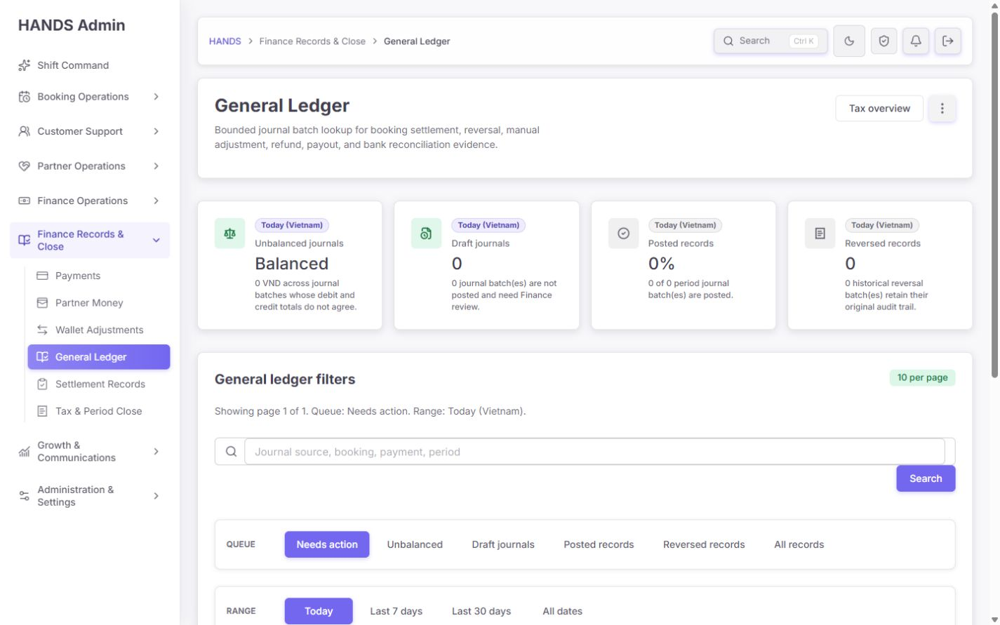
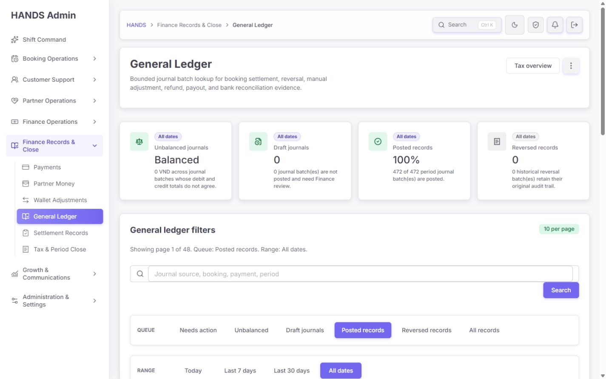
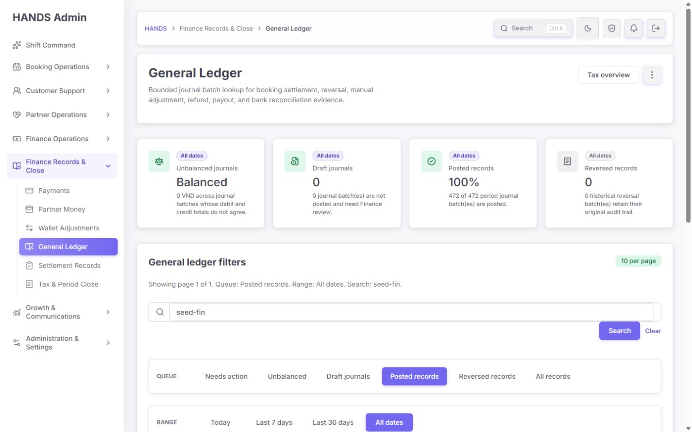
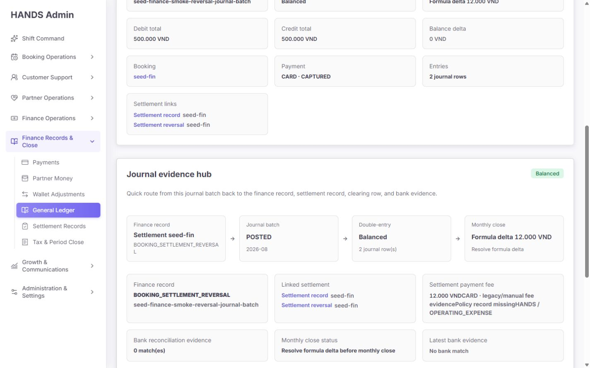
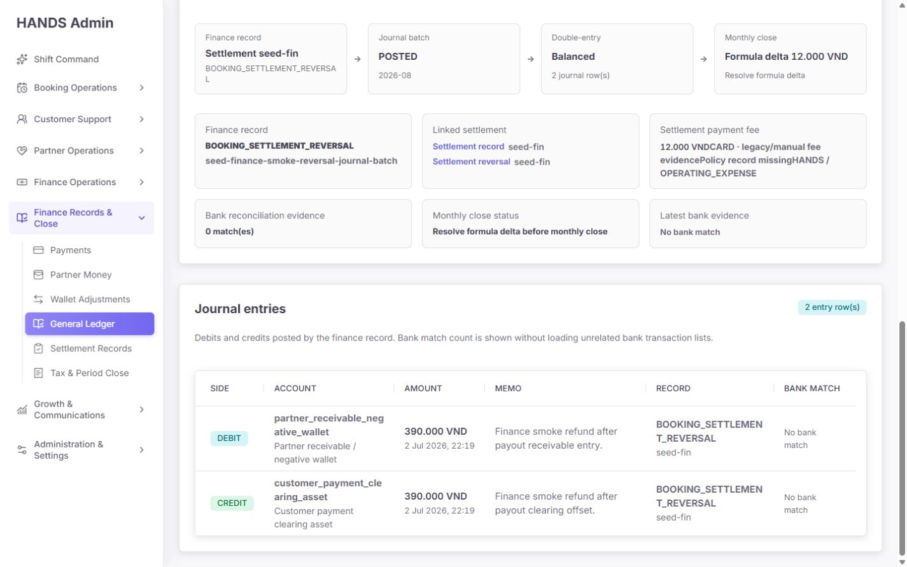
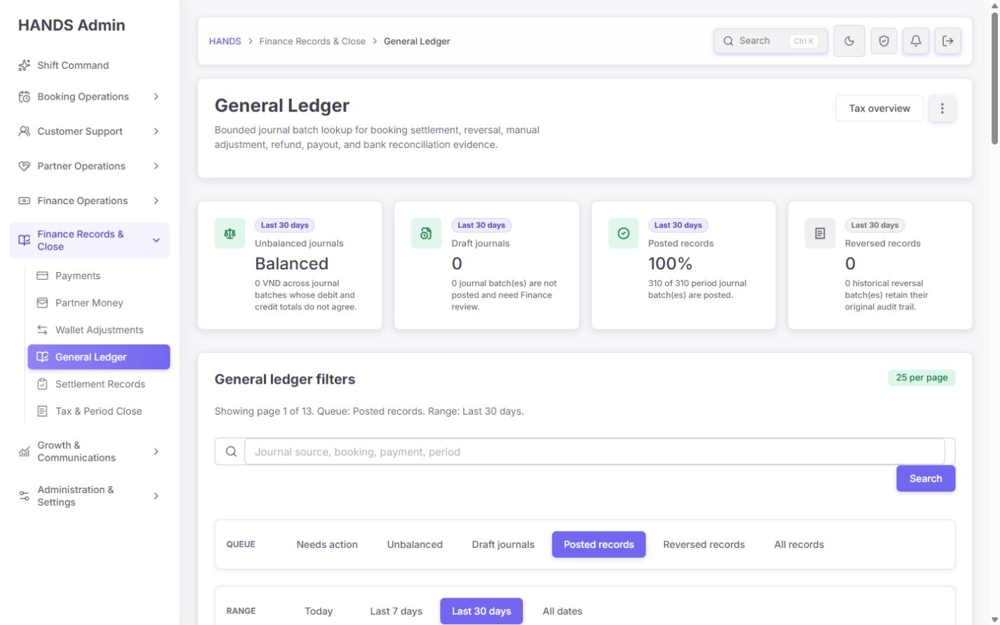
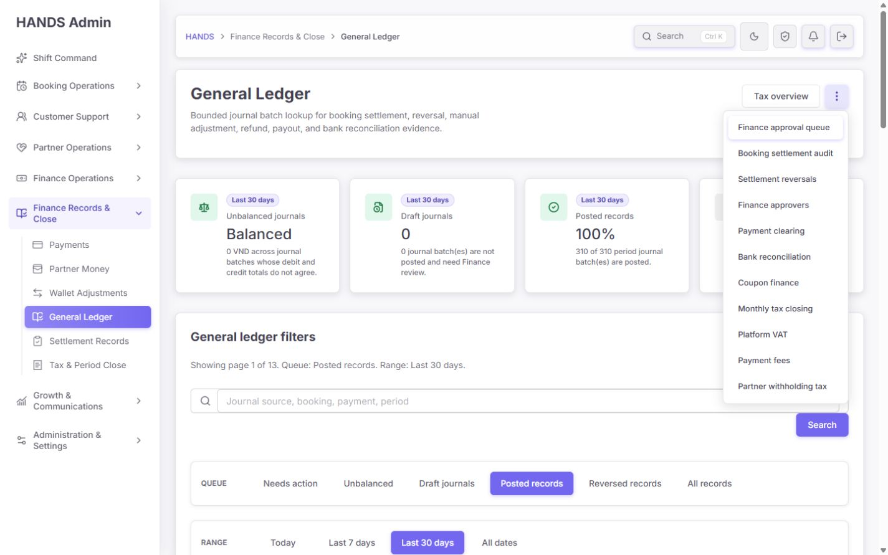
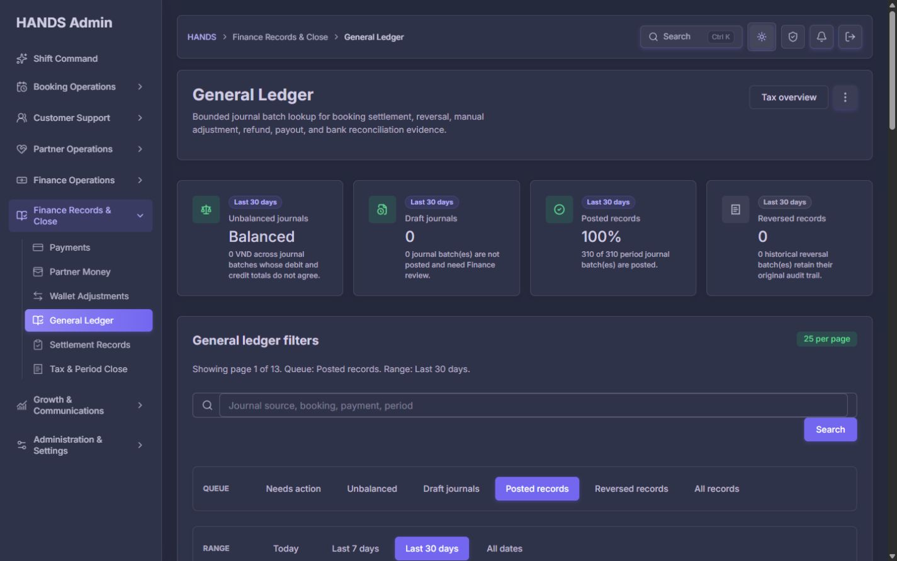
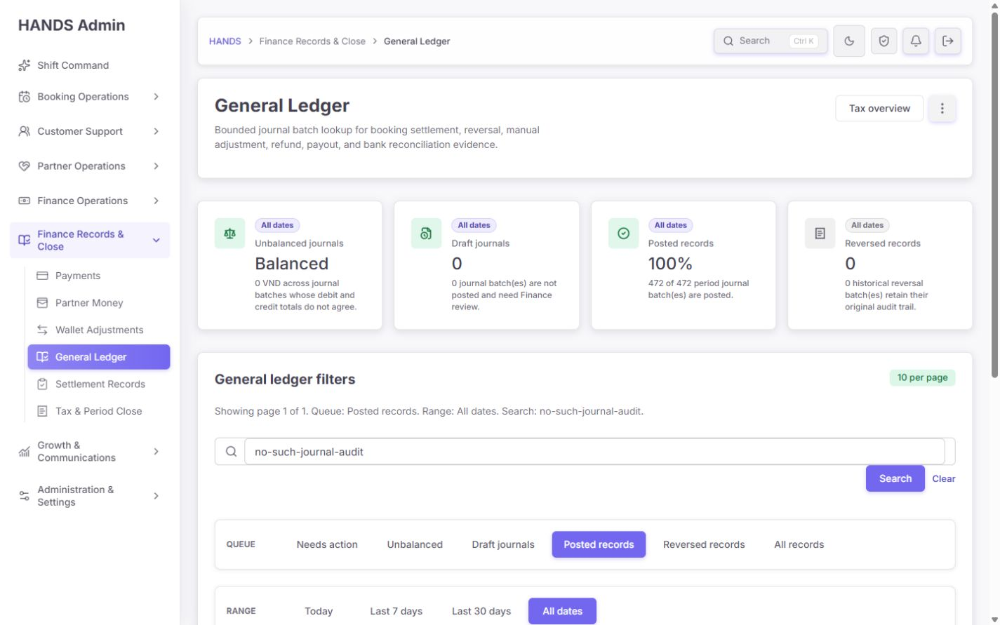

# General Ledger 개선 후 심층 재감사 보고서

- 감사일: 2026-08-09
- 대상: http://localhost:3101/finance-tax/general-ledger
- 대상 상세: /finance-tax/general-ledger/seed-finance-smoke-reversal-journal-batch
- 기준 화면: 1440 × 900 데스크톱
- 제외 범위: 1024px 이하, 모바일, 태블릿, 반응형 레이아웃
- 관점: 재무 운영자, 마감 담당자, 감사 증거 조사자
- 방식: 이전 감사 보고서와 구현 프롬프트 대조, 현재 코드/API/테스트 검수, 로그인된 실제 화면 조작 및 캡처
- 안전 범위: 조회·필터·검색·상세·테마·메뉴만 확인했으며 재무 데이터 변경은 실행하지 않았다.

## 1. 최종 결론

이번 수정은 화면 정돈, 기본 Needs action 진입, 서버 페이지네이션, 키보드 메뉴, 다크 테마 등 주변 품질은 유지하거나 개선했다. 그러나 이전 보고서에서 배포 전 차단 항목으로 지정한 **회계 무결성 P0는 해결되지 않았다.**

실제 운영 데이터에서 다음 상태를 다시 확인했다.

- 배치 헤더 차변: 500,000 VND
- 배치 헤더 대변: 500,000 VND
- 분개행 차변 합계: 390,000 VND
- 분개행 대변 합계: 390,000 VND
- 정산 공식 차이: 12,000 VND
- 화면의 최종 표현: 초록색 Balanced
- Needs action / Unbalanced 큐: 0건

즉 헤더끼리 같다는 이유로 실제 분개행과 110,000 VND씩 불일치하고 공식 차이도 있는 배치를 정상처럼 보인다. 이 상태에서는 운영자가 월마감과 감사 판단을 신뢰할 수 없다.

또한 이전에 지적한 All records 오류, API 장애와 0건 혼동, 상세 복귀 문맥 상실, General Ledger 기능 부재, 고급 필터·내보내기 부재가 그대로다. 이번 재감사에서는 **검색 Clear가 검색어를 제거하지 않는 새 기능 오류**도 실제로 확인했다.

### 판정

- 운영 UI 외형: 조건부 통과
- 일반 조회 화면: 부분 통과
- 회계 무결성 판단: 실패
- 월마감 의사결정 사용: 배포 차단
- 이전 구현 프롬프트 수용기준: 대부분 미충족
- 종합 완성도: **1.8/4, 약 45/100**

## 2. 이전 보고서 이행표

| 이전 요구 | 현재 상태 | 재감사 판단 |
|---|---|---|
| 분개행 재합산 기반 integrity 계약 | 헤더 totalDebit/totalCredit만 비교 | 실패, P0 |
| Header ↔ entry 차이 노출 | 목록·상세 모두 없음 | 실패, P0 |
| Formula delta 포함 최종 상태 | 상세 일부에만 표시, 다른 영역은 Balanced | 실패, P0 |
| Posted batch 0 entries 차단 | 일반 empty text만 존재 | 실패, P0 |
| Needs action에 BLOCKED/UNKNOWN 포함 | Draft 또는 헤더 D/C mismatch만 포함 | 실패, P0 |
| All records explicit review=all | URL에서 review 제거 후 Needs action으로 재해석 | 실패, P1 |
| API 실패와 0건/404 분리 | adminGet fallback 유지 | 실패, P1 |
| 상세 returnTo 복원 | 30d/posted/25로 하드코딩 | 실패, P1 |
| Account activity | 없음 | 실패, P1 |
| Trial balance | 없음 | 실패, P1 |
| Advanced accounting filters | 없음 | 실패, P1 |
| 현재 결과 CSV | 없음 | 실패, P1 |
| Journal Batches로 정직한 이름 변경 | General Ledger 유지 | 실패, P1 |
| Related finance menu 키보드 | ArrowDown, Escape, focus return 동작 | 통과 |
| 메뉴 링크 4~6개 축소 | 11개 유지 | 부분 실패 |
| 1440px 수평 안정성 | 수평 overflow 없음 | 통과 |
| 긴 account/enum 가독성 | 문자 단위로 계속 쪼개짐 | 실패, P2 |
| Search 버튼 4.5:1 대비 | 측정값 약 4.26:1 | 실패, P2 |
| 다크 테마 | 주요 구조·텍스트 정상 표시 | 통과 |
| 핵심 수용기준 자동화 테스트 | 기존 정상 경로만 검증 | 실패 |

## 3. 운영자 핵심 업무 충족도

| 운영자 질문 | 현재 답변 가능 여부 | 문제 |
|---|---|---|
| 오늘 해결할 회계 예외가 무엇인가 | 부분 가능 | 실제 entry/formula 예외가 큐에서 누락됨 |
| 이 배치가 정말 회계적으로 정상인가 | 불가능 | Header balanced를 overall integrity처럼 표시 |
| 어느 계정이 얼마만큼 움직였는가 | 상세 한 건만 부분 가능 | account activity와 running balance 없음 |
| 기간별 계정 잔액이 맞는가 | 불가능 | trial balance 없음 |
| 원천 예약·결제·정산·은행 증거는 무엇인가 | 부분 가능 | 링크는 있으나 정보 우선순위와 evidence 상태가 불완전 |
| 조사 후 원래 검색으로 돌아갈 수 있는가 | 불가능 | 복귀 시 q/range/take/page 손실 |
| 감사용 결과를 내보낼 수 있는가 | 불가능 | export 없음 |
| 데이터 장애인지 진짜 0건인지 알 수 있는가 | 불가능 | 둘 다 0/empty/404로 위장 가능 |

## 4. 실제 화면 흐름 감사

### Step 1 — 기본 Needs action 진입 — 건강도 2.5/4

좋은 점:

- 기본 진입이 Today / Needs action / 10 rows로 제한되어 있다.
- 카드, 검색, Queue, Range, Rows 순서가 일관적이다.
- 1440px에서 수평 깨짐이 없다.

문제:

- 첫 화면에서 핵심 데이터 행이 보이지 않는다. 900px 높이 안에는 header, 네 카드, 필터 상단만 들어오고 실제 큐 결과는 아래로 밀린다.
- Unbalanced journals 카드 값이 숫자 0이 아니라 Balanced라서 label과 value의 의미가 충돌한다.
- Needs action 0건은 실제 무결성 예외가 없다는 뜻이 아니다. 현재 쿼리가 draft와 헤더 D/C mismatch만 본다.

### Step 2 — All records 선택 — 건강도 0.4/4

실제 동작:

- 클릭 후 URL: /finance-tax/general-ledger?range=today
- 화면 active queue: Needs action
- 결과: All records를 선택했지만 전체 기록으로 전환되지 않음

이전 보고서의 동일 결함이 그대로 재현됐다.

### Step 3 — All dates / Posted records — 건강도 2.4/4

좋은 점:

- 472건, 48페이지가 명확히 보인다.
- 10/25/50/100행 선택과 서버 페이지네이션 구조가 있다.
- 예약·고객·파트너 deep link를 제공한다.

문제:

- 카드에서는 472/472, 100% posted라고 보여 주지만 이는 posting 상태일 뿐 회계 무결성 100%가 아니다.
- 목록 Integrity 열은 헤더 total만 비교한다.
- 첫 금액 500,000 VND에는 Debit 라벨이 없고 두 번째만 Credit 라벨이 있어 스캔이 느리다.
- Source title과 Open detail이 같은 목적지로 중복된다.
- 현재 기능은 journal batch list인데 page title과 sidebar는 General Ledger다.

### Step 4 — seed-fin 검색과 Clear — 건강도 1.0/4

검색 자체는 2건으로 좁혀지지만 Clear 링크가 같은 q=seed-fin URL을 생성한다. 실제 클릭 후에도 입력값과 URL이 그대로 유지됐다.

추가 신뢰 문제:

- 검색 중 command card는 검색을 무시한 472건 overview를 표시한다.
- 그러나 카드 링크는 q=seed-fin을 유지한다.
- 운영자는 472건 카드를 클릭했는데 목적지에서는 2건만 보게 된다.

Overview의 수치 범위와 클릭 목적지 범위를 반드시 일치시켜야 한다.

### Step 5 — 상세 상단 — 건강도 0.6/4

동일 화면에서 다음이 동시에 보인다.

- Double-entry check: Balanced
- Monthly close blocker: Formula delta 12,000 VND
- Debit/Credit: 500,000/500,000 VND

운영자는 첫 viewport에서 최종 상태를 알 수 없다. 최상단에 overall Clear / Blocked / Unknown 결정을 하나만 보여 주고, 그 아래 Header, Entry, Header↔Entry, Formula, Period, Evidence check를 분리해야 한다.

### Step 6 — Journal evidence hub — 건강도 0.7/4

문제:

- 패널 우측은 초록색 Balanced지만 같은 패널 안 Monthly close는 Formula delta 12,000 VND다.
- Settlement payment fee 문구가 붙어 읽힌다: 12,000 VNDCARD, evidencePolicy, missingHANDS 등이 한 덩어리처럼 보인다.
- raw enum BOOKING_SETTLEMENT_REVERSAL과 OPERATING_EXPENSE가 운영자 문구보다 우선한다.
- 0 match(es)는 자연어가 아니며 은행 증거가 필수인지 선택인지도 설명하지 않는다.
- 새로 추가된 reversal reference/reason/posted/approval UI는 실제 검사한 reversal 배치에서 나타나지 않았다.

### Step 7 — 실제 분개행 — 건강도 0.4/4

실제 두 행은 390,000 VND debit, 390,000 VND credit이다. 헤더 500,000/500,000과 각각 110,000 VND 차이가 나지만 화면 어느 곳에도 Header ↔ entry mismatch가 없다.

또한 1440px에서도 account code와 source enum이 다음처럼 문자 중간에서 끊긴다.

- partner_receivable_neg / ative_wallet
- customer_payment_cle / aring_asset
- BOOKING_SETTLEMEN / T_REVERSAL

계정 코드와 enum은 nowrap 또는 최소 열 너비를 주고, 전체 값은 copy 가능한 technical evidence에서 제공해야 한다.

### Step 8 — 상세에서 목록으로 복귀 — 건강도 0.8/4

진입 문맥은 All dates / Posted / q=seed-fin / 10 rows였지만 Back to ledger는 Last 30 days / Posted / 25 rows로 이동했다. 검색어, 기간, 행 수, 페이지, 스크롤 위치가 모두 손실될 수 있다.

### Step 9 — Related finance menu — 건강도 2.8/4

개선 확인:

- aria-expanded가 있다.
- 첫 메뉴 항목으로 focus가 이동한다.
- ArrowDown으로 다음 항목으로 이동한다.
- Escape로 닫히고 trigger로 focus가 돌아온다.

남은 문제:

- 11개 항목이 한 평면 목록으로 길게 노출된다.
- General Ledger 운영자에게 자주 필요한 Payment clearing, Bank reconciliation, Monthly tax closing, Finance approval queue보다 덜 관련된 항목까지 동일 우선순위다.
- Export는 탐색 메뉴와 별도 primary action으로 제공해야 한다.

### Step 10 — 다크 테마 — 건강도 3.4/4

주요 패널, 필터, 카드, sidebar가 깨지지 않고 표시된다. 이번 감사에서 테마 자체의 치명적 결함은 확인하지 않았다.

### Step 11 — 검색 결과 0건 — 건강도 0.8/4

문제:

- 검색 0건과 API 장애가 같은 empty table로 보일 수 있다.
- 제공된 Clear 링크가 작동하지 않는다.
- Reset all이 없다.
- 빈 상태 자체가 첫 viewport 아래라 운영자가 필터 화면만 보고 결과 확인을 위해 추가 스크롤해야 한다.

## 5. P0 — 회계 신뢰성 결함

### P0-1. 서버 권위 integrity contract가 구현되지 않음

코드 근거:

- apps/api/src/admin/admin.service.ts:1575-1606 — list select는 entry count만 포함하고 entry 합계를 계산하지 않는다.
- apps/api/src/admin/admin.service.ts:15825-15886 — summary는 batch.totalDebit과 batch.totalCredit만 비교한다.
- apps/api/src/admin/admin.service.ts:40578-40587 — Needs action은 DRAFT 또는 header total mismatch만 포함한다.
- apps/admin_web/app/finance-tax/general-ledger/page.tsx:275-294 — 목록 Balanced 판정도 header total만 비교한다.
- apps/admin_web/app/finance-tax/general-ledger/[id]/page.tsx:43-44, 344-370 — detail도 header delta와 별도 local formula 계산을 사용한다.

영향:

- Entry D/C mismatch 누락
- Header ↔ entry mismatch 누락
- Formula blocker가 Needs action에서 누락
- Posted batch 0 entries 누락
- 필수 검사 불가능 상태 UNKNOWN 누락
- list, summary, detail, monthly close가 서로 다른 판단을 할 수 있음

필수 수정:

1. AccountingJournalEntry를 batchId로 grouped aggregate한다.
2. headerDebit/headerCredit, entryDebit/entryCredit, 네 delta, entryCount를 서버에서 계산한다.
3. CLEAR / BLOCKED / UNKNOWN과 안정적인 blocker code를 반환한다.
4. list, summary, detail, closeout preflight, export가 같은 helper/CTE를 사용한다.
5. Needs action은 DRAFT뿐 아니라 BLOCKED와 required UNKNOWN을 포함한다.
6. 기존 데이터를 read-only audit해 500,000 ↔ 390,000 사례를 포함한 전체 mismatch를 목록화한다.
7. header total을 자동으로 entry total로 덮어쓰지 않는다.

### P0-2. Formula blocker가 있는데 green Balanced를 사용함

상세의 resultTone은 balanceDelta만 본다.

- apps/admin_web/app/finance-tax/general-ledger/[id]/page.tsx:156-160

formulaDelta가 12,000 VND여도 balanceDelta가 0이면 패널이 success/Balanced다. Green success는 overall integrity state가 CLEAR일 때만 허용해야 한다.

## 6. P1 — 기능 정확성과 운영 생산성

### P1-1. All records 직렬화 오류

- tax-settlement-page-model.ts:933-945는 review=all을 URL에서 생략한다.
- page.tsx:51은 누락된 review를 needs-action으로 해석한다.

General Ledger 전용 href에서는 review=all을 명시적으로 보존해야 한다. 다른 finance 페이지의 생략 규칙을 건드리지 말고 GL wrapper 또는 옵션을 사용한다.

### P1-2. Clear search가 검색어를 제거하지 않음

- page.tsx:51-56의 filters에도 q가 들어 있다.
- page.tsx:74-75의 queueHref가 generalLedgerHref(filters)를 먼저 만든다.
- page.tsx:160-162에서 두 번째 인자만 빈 문자열로 보내지만 filters.q는 그대로다.

수정 예:

- Clear는 q: undefined, page: 1을 가진 filters로 href를 생성한다.
- 검색 중 card/filter/page link가 q를 보존할지 제거할지 각 control의 목적에 따라 명시한다.
- Clear search와 Reset all을 분리한다.

### P1-3. Overview 수치와 카드 목적지 범위 불일치

page.tsx:57은 overview q를 제거한다. 하지만 queueHref의 기본 query는 현재 검색어다. 결과적으로 검색 중 카드 수치는 전체 범위이고 클릭 후 목적지는 검색 범위다.

권장:

- command card는 All journals · selected range를 명시한다.
- Search does not change overview totals를 표시한다.
- 카드 클릭은 q를 제거하거나, 검색 결과 summary를 별도로 계산한다.
- 둘 중 하나만 선택하고 수치와 목적지를 일치시킨다.

### P1-4. API 실패가 정상 0건 또는 404로 위장

- page.tsx:58-70은 adminGet + empty summary/[]를 사용한다.
- detail page:35-40은 null fallback을 notFound로 바꾼다.
- admin-api.ts:6109-6144에는 이미 ok/status를 보존하는 adminGetResult가 있다.

필수 상태:

- 404: 실제 record not found
- 401/403: 권한 부족
- 5xx/network: Ledger data unavailable + Retry
- summary 일부 실패: 성공한 list는 유지하고 해당 카드만 degraded
- 성공: checkedAt/retrievedAt 표시

### P1-5. 상세 복귀 문맥 상실

- detail page:52-54가 30d / posted / 25를 하드코딩한다.
- list의 detail href에도 returnTo가 없다.

payment clearing에서 이미 사용하는 safe returnTo 패턴을 GL 전용 allowlist로 재사용한다. q, review/view, range/period, page, take, sort, advanced filters를 보존한다.

### P1-6. Reversal evidence 수정이 실제 데이터에서 작동하지 않음

새 helper는 metadata.operation이 _REVERSAL로 끝날 때만 reversal evidence를 반환한다.

- detail page:47
- detail page:107-136
- detail page:373-383

그러나 검사한 canonical reversal에는 settlementReversalEntry 링크가 존재해도 추가 필드가 렌더되지 않았다. metadata 추정 대신 canonical settlementReversalEntry의 reason/occurredAt과 명시적인 approval evidence 계약을 사용해야 한다. helper 단위 테스트와 실제 fixture render 테스트가 필요하다.

### P1-7. General Ledger라는 이름과 실제 책임이 다름

현재 route는 Journal Batches와 Journal Entries 상세다.

- sidebar 설명도 Search posted accounting journal batches and entries라고 쓴다.
- permission scope도 Journal batches, entries, accounting evidence다.
- Account activity, running balance, opening/closing, trial balance가 없다.

추천 결정:

1. 신뢰 가능한 계정 잔액 정책과 데이터 계약을 구현할 수 있으면 같은 route 안에 Accounts / Journal batches / Trial balance / Integrity exceptions view를 추가한다.
2. 지금 구현할 수 없으면 즉시 화면·sidebar·검색 문구를 Journal Batches로 변경한다.

현 상태처럼 이름만 General Ledger로 유지하는 선택은 권장하지 않는다.

### P1-8. 회계 필터와 export 부재

현재 제공:

- q
- queue
- date preset
- rows

필수 추가:

- accounting period exact
- posting date from/to
- account code/name
- source type
- batch/entry/source/booking/payment/customer/partner ID
- amount range
- integrity blocker
- bank evidence
- created/posted by
- oldest blocker / largest discrepancy / newest sort
- current filtered CSV
- trial balance CSV

저장소에는 General Ledger export route가 없다.

## 7. P2 — 화면·문구·접근성

### 첫 viewport 우선순위

1440×900에서 actual records가 첫 화면에 보이지 않는다. 네 command card를 더 얇은 decision strip으로 줄이고, filter panel의 Queue/Range/Rows를 한 줄 toolbar + Advanced filters disclosure로 압축한다.

### 문구 교체

| 현재 | 권장 |
|---|---|
| General Ledger | 실제 원장 기능 전에는 Journal Batches |
| Needs action | Integrity exceptions |
| Unbalanced | Header debit/credit mismatch |
| Balanced | Header balanced |
| Double-entry check | Header debit vs credit |
| Posted records | Posted batches |
| Open detail | Review evidence |
| Related context | Source & participants |
| 0 match(es) | No bank match evidence |
| 1 match(es) | 1 bank match |
| 0 journal batch(es) | No journal batches |

### 1440px 표 가독성

- Debit와 Credit 라벨을 둘 다 표시한다.
- money 열은 우측 정렬한다.
- account code/source enum은 word-break를 금지하고 최소 너비를 준다.
- raw enum은 human label을 먼저 보여 주고 technical value는 copy 가능한 disclosure로 낮춘다.
- Source title link와 Open detail 중 하나만 primary interaction으로 유지한다.
- fee evidence는 block stack으로 분리해 값 사이 공백과 줄바꿈을 보장한다.

### 접근성

통과:

- 상태를 텍스트로도 표현한다.
- menu ArrowDown/Escape/focus return이 동작한다.
- 다크 테마 구조가 유지된다.

수정:

- Search 버튼 white #fff / purple rgb(115,103,240)는 약 4.26:1로 14px 일반 텍스트 기준 4.5:1에 미달한다.
- table region 이름을 Scrollable data table 대신 General ledger journal batches, Journal entries처럼 고유하게 지정한다.
- 검색/필터 적용 후 결과 heading 또는 empty/error status로 focus를 이동한다.
- active filter는 단순 pill 나열보다 개별 제거 가능한 chip과 Reset all을 제공한다.
- API 오류 상태는 role=status 또는 alert로 명확히 알린다.

## 8. 성능·확장성

현재 관찰:

- 10-row Posted 화면: DOM 약 895개
- 문서 높이: 약 2,568px
- 수평 overflow: 없음
- 목록 렌더마다 queue summary, overview summary, list를 병렬 no-store 요청
- 검색은 sourceKey/sourceId/bookingId/paymentId/monthlyPeriod에 %term% ILIKE

권장:

1. list response에 rows, total, current queue integrity summary를 결합한다.
2. 검색과 독립인 overview aggregate는 30초 cache를 검토한다.
3. q/All 조건에서 중복 summary 요청을 제거한다.
4. ID는 exact/prefix, period는 equality를 먼저 처리한다.
5. entry aggregate는 per-row hydrate가 아니라 grouped CTE/projection으로 계산한다.
6. 실제 데이터 규모와 EXPLAIN을 확인한 뒤에만 trigram index를 추가한다.

이번 브라우저 감사는 개발 서버 단일 세션 관찰이며 정식 부하 테스트 수치로 사용하지 않는다.

## 9. 테스트 결과와 테스트 공백

### 실행 결과

- Admin Web focused tests: 4 files, 52 tests 통과
- API controller accounting journal: 3 tests 통과
- API service journal: 15 tests 통과
- Admin Web typecheck: 통과
- API typecheck: 통과

### 왜 테스트가 통과했는데 기능은 실패했는가

현재 테스트가 잘못된 계약을 그대로 검증한다.

- admin.service.spec.ts:18944-18981은 Needs action에 header total mismatch가 들어가는지만 본다.
- admin.service.spec.ts:18983-19035의 이름은 journal integrity지만 entry aggregate를 전혀 검증하지 않는다.
- page.spec.tsx는 default queue와 q 전달만 확인하고 All records 클릭/reload를 확인하지 않는다.
- Clear 링크 href/클릭 테스트가 없다.
- formula blocker가 green success를 금지하는 테스트가 없다.
- returnTo, API status 분기, account views, trial balance, export 테스트가 없다.
- reversal evidence는 source inspection 1개뿐이고 render fixture 테스트가 없다.

### 반드시 추가할 회귀 테스트

1. Header 500k/500k + entry 390k/390k = BLOCKED
2. Entry debit/credit mismatch
3. Header ↔ entry debit/credit mismatch
4. Posted batch with 0 entries
5. Formula delta + header balanced = overall BLOCKED
6. All records explicit review=all, reload 유지
7. Clear removes q
8. Overview card count와 destination scope 일치
9. detail safe returnTo allow/deny
10. list/summary/detail 401/403/404/500/network 분기
11. canonical reversal evidence render
12. current filter export parity
13. 1440px account/enum nowrap
14. Search button contrast

Impeccable detector는 globals.css의 다른 화면 side-tab 6건을 보고했지만 General Ledger 전용 치명 항목은 추가로 찾지 못했다. 이번 핵심 결함은 실제 회계 데이터·URL 상태·서버 쿼리·상세 계산을 교차 검증해 발견했다.

## 10. 권장 구현 순서

### Phase 0 — 배포 차단, 회계 신뢰성

1. 서버 권위 AccountingJournalIntegrity 계약
2. entry aggregate와 header-entry delta
3. CLEAR/BLOCKED/UNKNOWN + blocker codes
4. Needs action/summary/detail/closeout/export 동일 계약
5. 기존 472 batch read-only integrity audit
6. green success 금지 규칙

### Phase 1 — 즉시 발생하는 기능 버그

7. All records explicit review=all
8. Clear q 제거
9. Overview card scope와 destination 통일
10. adminGetResult 상태 분리
11. safe returnTo
12. canonical reversal evidence

### Phase 2 — 정직한 정보 구조

13. Accounts/Journal batches/Trial balance/Exceptions를 구현하거나 Journal Batches로 이름 변경
14. 현재는 이름 변경을 우선 권장

### Phase 3 — 운영 생산성

15. quick filters + Advanced filters
16. sort와 active chips
17. filtered journal CSV
18. period trial balance CSV

### Phase 4 — 1440px 마감

19. 첫 viewport에 결과 행 노출
20. code/enum nowrap와 table widths
21. fee evidence stack
22. search contrast
23. 고유 table aria-label과 focus recovery
24. menu 4~6개 축소

## 11. 최종 수용 기준

- [ ] Header와 entry 합계가 다르면 overall BLOCKED다.
- [ ] Formula delta 또는 required UNKNOWN이 있으면 green success가 없다.
- [ ] Posted batch 0 entries가 blocker다.
- [ ] Needs action이 draft, blocked, required unknown을 포함한다.
- [ ] list, summary, detail, closeout, export가 같은 integrity 값을 사용한다.
- [ ] All records URL에 review=all이 명시되고 reload 후 유지된다.
- [ ] Clear search가 q를 제거한다.
- [ ] Overview 카드 수치와 클릭 목적지 범위가 같다.
- [ ] API 장애가 0건 또는 404로 위장되지 않는다.
- [ ] detail return이 q/range/review/page/take/sort를 복원한다.
- [ ] reversal reason/time/approval이 canonical evidence에서 렌더된다.
- [ ] General Ledger 이름을 유지하면 account activity와 trial balance가 실제 동작한다.
- [ ] 구현하지 않으면 Journal Batches로 이름을 바꾼다.
- [ ] 계정/기간/날짜/source/ID/amount/integrity 필터가 있다.
- [ ] 현재 결과와 같은 audit CSV가 생성된다.
- [ ] 1440px에서 account code와 enum이 문자 중간에서 끊기지 않는다.
- [ ] Search 일반 텍스트 대비가 4.5:1 이상이다.
- [ ] 검색 0건, 진짜 0건, 권한 없음, API 실패, true 404가 구분된다.
- [ ] 위 수용기준을 실패시키는 fixture 기반 회귀 테스트가 먼저 추가된다.

## 12. 재감사 범위와 한계

- 1440×900 desktop만 감사했다.
- 1024px 이하 화면은 열지 않았고 점수·결함·제안에 포함하지 않았다.
- 로그인된 현재 운영 fixture와 코드에 근거했다.
- 재무 상태 변경, export 실행, posting/reversal/closeout 실행은 하지 않았다.
- API 장애는 코드 분기를 검수했으며 실제 서비스를 중단시키는 fault injection은 하지 않았다.
- 성능 수치는 개발 서버의 DOM/문서 구조 관찰이며 부하 테스트가 아니다.

## 13. 최종 판단

이번 수정은 메뉴 키보드와 테마 같은 주변 품질은 좋아졌지만, 이전 보고서의 핵심 목표였던 “운영자가 회계적으로 믿을 수 있는 원장 판단”에는 도달하지 못했다. 특히 live fixture가 이미 Header 500,000/500,000과 Entries 390,000/390,000의 불일치를 보여 주는데도 Balanced라고 표시되는 상태는 반드시 배포 전에 막아야 한다.

가장 합리적인 다음 조치는 UI를 더 꾸미는 것이 아니다. 먼저 서버 권위 integrity 계약과 기존 데이터 audit를 완성하고, All/Clear/return/error 상태를 바로잡아야 한다. 그 다음 실제 account activity와 trial balance를 만들 수 없다면 페이지 이름을 Journal Batches로 정직하게 바꾸는 것이 운영자에게 가장 안전하다.
