# Marketing Analytics 개선 후 심층 재감사 보고서

- 감사 일자: 2026-08-10
- 대상: `http://localhost:3101/marketing-analytics`
- 검수 기준 화면: 1440 × 900 데스크톱
- 범위: 실제 로그인 화면, 필터·지연 로더·지출 입력 검토 흐름, 문구, 정보 구조, 데이터 의미, API·프론트 코드, 테스트
- 변경 여부: 이번 감사에서는 제품 소스를 수정하지 않았고, 지출 저장도 실행하지 않았다.

## 1. 최종 결론

**판정: 시각·구조 개선은 확인되었지만, 운영 의사결정 화면으로는 조건부 실패다.**

이전 보고서의 핵심 요구였던 `Range / Source / Region` 우선 노출, `Platform / Campaign`의 `More filters` 이동, active filter 요약, `Marketing needs action`의 상단 유지, 하단 표의 지연 로딩은 대부분 구현되었다. 기본 화면의 웜 로드는 빠르고, 접근성 뼈대와 지출 저장 전 검토·실패 차단도 좋다.

그러나 다음 세 항목은 배포 전에 반드시 막아야 한다.

1. **Region이 headline cohort 전체를 필터링한다고 설명하지만 실제로는 지출·지역 표 일부만 필터링한다.** 지역을 선택해도 entrants, signup, booking은 그대로인 반면 지출만 달라질 수 있어 CPA·ROAS가 서로 다른 범위를 나눈 값이 된다.
2. **Today의 `Yesterday by now` 비교 기간이 어제 같은 시간대가 아니라 어제 정오부터 자정까지로 계산된다.** 비교 문구와 실제 시간창이 다르다.
3. **핵심 요약 API 실패를 실제 0건처럼 렌더링한다.** 데이터 장애가 `No marketing evidence`와 0 KPI로 위장될 수 있다.

즉, 화면은 전보다 정돈되었지만 현재 가장 큰 위험은 “보기 어려움”보다 **정확해 보이는 잘못된 수치**다.

## 2. 종합 점수

| 항목 | 점수 | 판단 |
|---|---:|---|
| 운영 의사결정 신뢰성 | 38 / 100 | Region, Today 비교, API 실패 처리 때문에 배포 차단 |
| 정보 구조·업무 우선순위 | 76 / 100 | Needs action 우선과 필터 계층은 개선됨 |
| 1440px 시각 완성도 | 63 / 100 | 기본 화면은 양호하나 operations grid와 상세 표가 크게 깨짐 |
| 문구·운영자 친화성 | 66 / 100 | 전반적으로 좋아졌으나 `FCM-ready`, `ref-smoke`, 범위 설명 오류가 남음 |
| 접근성 기반 | 78 / 100 | 의미 구조·레이블·차트 대체 데이터는 좋음; 완전한 WCAG 검증은 아님 |
| 성능 구조 | 73 / 100 | 지연 로딩과 캐시는 개선; 페이지·서비스 모놀리스와 긴 DOM은 남음 |
| **종합** | **64 / 100** | **조건부 실패 — 데이터 신뢰성 P0 해결 후 재검수 필요** |

기술 감사 점수는 12 / 20이다: 접근성 3, 성능 3, 1440 데스크톱 레이아웃 2, 테마 3, 구현 무결성 1.

## 3. 이전 보고서 요구사항 이행표

| 이전 요구 | 결과 | 재감사 판단 |
|---|---|---|
| 첫 화면은 Range, Source, Region 중심 | UI 통과 / 의미 실패 | Region이 headline cohort를 실제로 제한하지 않음 |
| Platform·Campaign은 More filters | 통과 | 선택 시 자동으로 열리고 상태도 유지됨 |
| active filter 한 줄 요약·개별 clear·Clear all | 부분 통과 | clear는 좋지만 기본값 `Platform: All platforms`까지 active처럼 반복 |
| Needs action을 첫 분석 결과보다 위에 유지 | 통과 | 최우선 문제를 먼저 보게 함 |
| 긴 표·차트는 첫 판단을 막지 않게 지연 | 부분 통과 | 표는 지연 로드됨; Recharts 자체는 초기 클라이언트 번들에 남음 |
| Marketing Analytics와 Customer Usage는 같은 workspace의 별도 페이지 | 통과 | 현재 분리 방식이 적절함 |
| 내부 구현 용어를 주요 문구에서 제거 | 실패 | `FCM-ready delivery layer`, `ref-smoke`가 남음 |
| 1440px 실제 화면에서 잘림·중복·빈 상태 검사 | 실패 | attribution/campaign 영역과 breakdown 표가 1440에서 심하게 잘림 |

## 4. 실제 운영 흐름별 검수

### 4.1 기본 진입 — 상태: 보통

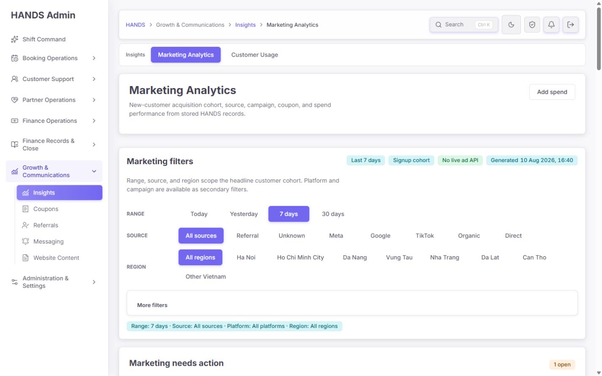

- `Marketing Analytics`와 `Customer Usage`를 같은 Insights workspace에서 구분한 것은 맞다.
- 헤더, 목적 설명, 필터, Needs action의 순서도 이전보다 자연스럽다.
- 다만 900px 첫 화면의 대부분을 헤더와 필터가 차지해 실제 조치 카드는 화면 맨 아래에서 겨우 시작한다.
- Region 옵션이 한 줄에 들어가지 못해 `Other Vietnam`만 다음 줄로 떨어지고, `More filters`가 높이 58px의 전체 폭 박스로 남아 밀도가 낮다.
- `No live ad API`는 통합 부재를 성공색으로 보여준다. 이는 정상 상태가 아니라 중립적인 데이터 소스 상태여야 한다.

### 4.2 필터 선택 — UI 상태: 양호 / 데이터 의미: 실패

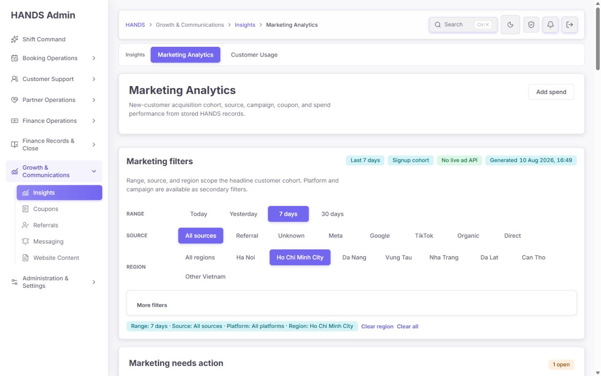

- Source, Region, Platform 링크는 빠르고 URL이 안정적이다.
- More filters는 선택값이 있을 때 자동으로 열려 현재 상태를 숨기지 않는다.
- 실제로 `regionCode=hcm`을 선택해도 기본 수치 `3 / 2 / 1 / 1 / 0`이 그대로였다.
- 화면 상단은 “Range, source, and region scope the headline customer cohort”라고 말하지만 API 서비스의 정확한 설명은 “Region currently scopes spend and location breakdown tables only”다.
- Region을 유지하려면 신규 고객의 획득 시점 지역 귀속 규칙이 필요하다. 지금처럼 주소·예약 주소를 뒤늦게 표본 조회하는 방식은 signup/first-open cohort의 지역 필터가 아니다.

### 4.3 Needs action과 attribution — 상태: 우선순위는 양호, 배치는 실패

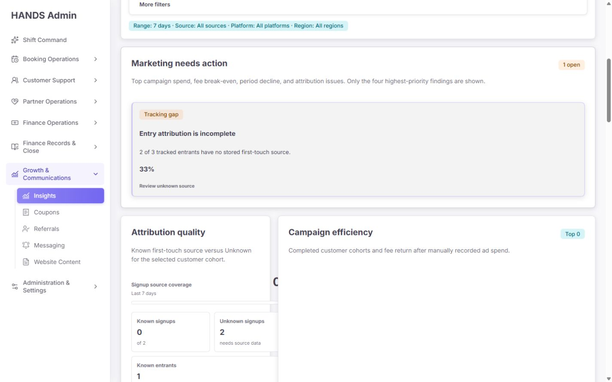

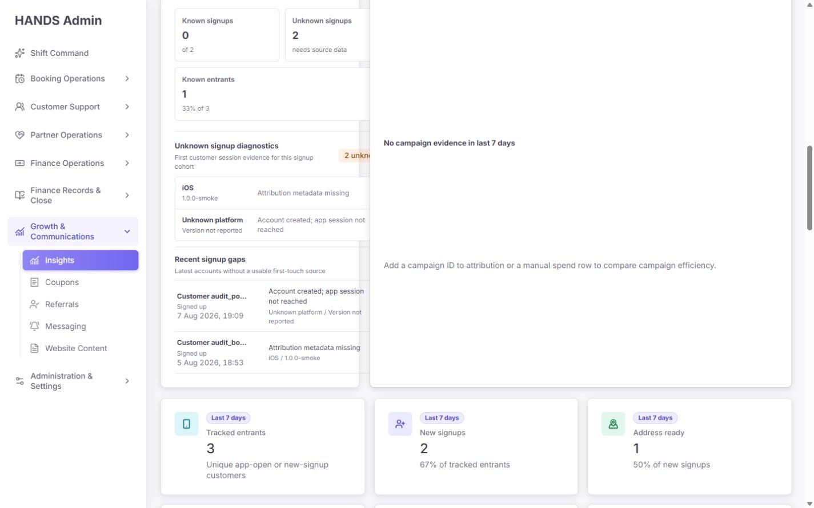

- Needs action을 상단에 둔 판단은 맞고, 현재 1건일 때 전체 폭 카드로 보이는 것도 좋다.
- 다만 CSS는 최대 4열을 고정하고 있어 이슈가 3~4건으로 늘면 세부 설명이 다시 좁아진다. 1440에서는 최대 2열 또는 우선순위 리스트가 안전하다.
- 아래 operations grid는 왼쪽 `0.8fr`, 오른쪽 `1.7fr`이다. attribution 카드가 약 320px로 눌리면서 diagnostics가 잘리고, 빈 Campaign efficiency는 왼쪽 카드의 높이를 따라가 큰 공백이 생긴다.
- `min-height: 100%`를 없애고 `align-items: start`, 최소 1:1 또는 1:1.2 배치를 사용해야 한다.

### 4.4 KPI·비교·차트 — 상태: 대체로 양호, 의미 정리 필요

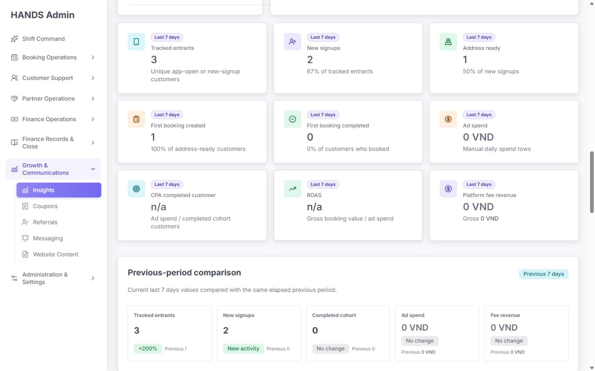

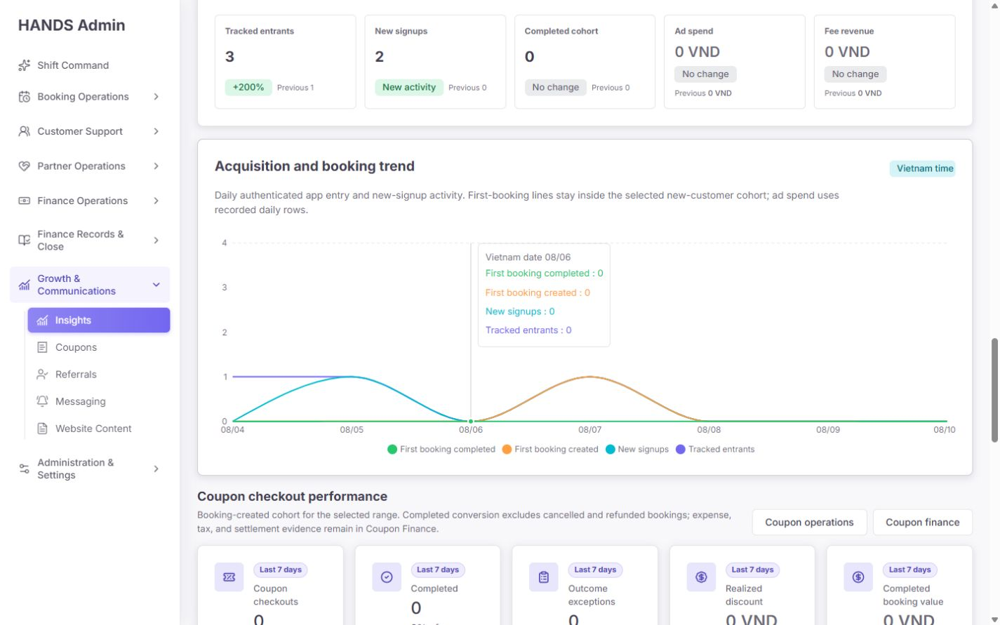

- 3열 KPI, 5개 비교 카드, 추이 차트의 기본 가독성은 좋다.
- 각 KPI에 `Last 7 days`가 9회 반복된다. 섹션 헤더에 한 번만 표시해도 된다.
- 상단 ROAS는 gross booking value / ad spend이고 campaign action은 platform fee revenue / spend다. 둘 다 ROAS라고 부르지 말고 `Gross ROAS`와 `Fee ROAS (break-even 1.00x)`로 구분해야 한다.
- ROAS 카드는 값이 `n/a`이거나 손익분기 미달이어도 항상 success tone이다.
- Today 비교는 코드상 이전 기간 계산이 잘못되어, UI 품질과 별개로 지표 신뢰성이 없다.
- 차트는 `aria-label`과 screen-reader용 표를 제공해 접근성 기반이 좋다. 다만 네 개 색이 CSS token이 아닌 hex로 고정돼 있다.

### 4.5 쿠폰 성과 — 상태: 데이터 범위와 0-state 개선 필요

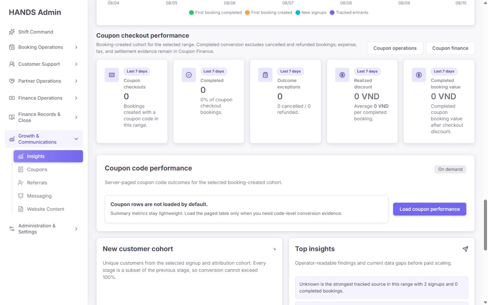

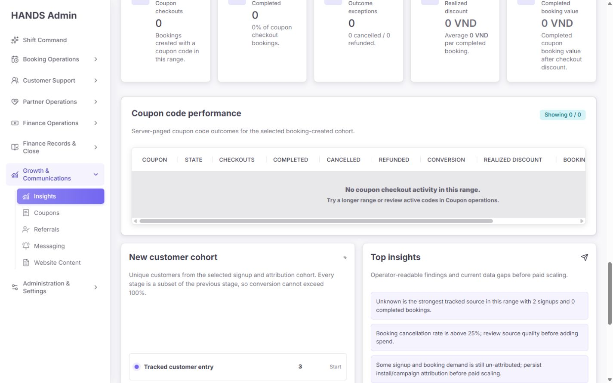

- Coupon operations와 Coupon finance를 분리한 것은 업무 경계상 맞다.
- 쿠폰 API는 `range`만 받지만 화면의 global Source / Platform / Region / Campaign 상태는 URL에 계속 남는다. 운영자는 쿠폰도 해당 필터의 영향을 받는다고 오해한다.
- 데이터가 모두 0인데도 다섯 개 큰 카드가 노출되어 텍스트가 좁게 줄바꿈된다. 이때는 `No coupon checkout activity` 한 개 상태와 `Load details`만 보여주고, 값이 생길 때 3+2 KPI로 확장하는 편이 낫다.
- 상세 표를 요청했을 때 on-demand 로딩 자체는 정상이고 빈 상태 문구도 비교적 명확하다.

### 4.6 상세 breakdown — 상태: 1440 사용 불가

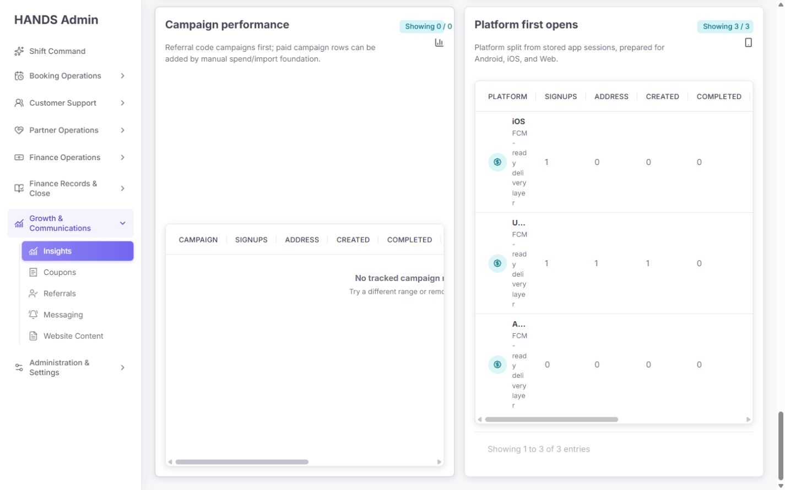

- 지연 로드는 좋은 방향이다.
- 그러나 두 개의 표를 2열 카드 안에 넣고 내부 표는 넓게 유지해 수평 스크롤을 강제한다.
- Platform 첫 열은 `FCM-ready delivery layer`가 한 글자씩 줄바꿈될 정도로 눌리고, campaign 빈 상태도 오른쪽이 잘린다.
- 상세 표는 각각 전체 폭 섹션으로 쌓거나, 열 수를 줄인 요약 표 + row detail drawer로 바꿔야 한다.
- Region 표는 최신 주소·예약 각 100개에 기반하지만 화면에서는 전체 집계처럼 보인다. `Recent-record sample`을 명시하거나 서버에서 전체 집계를 계산해야 한다.

### 4.7 Add daily spend — 상태: 실패 차단은 우수, 완료 피드백 부족

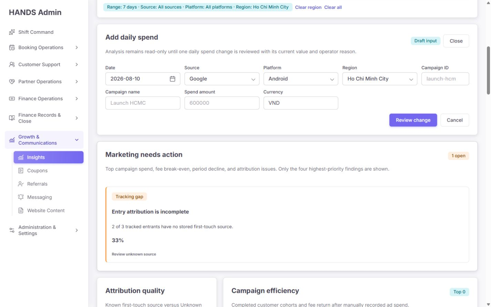

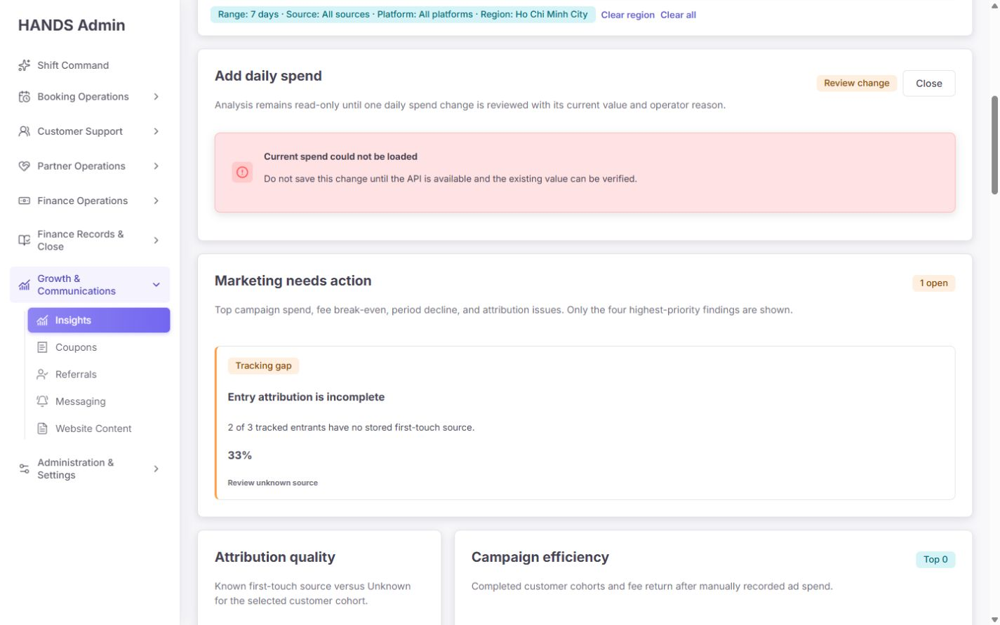

- 입력 → 검토의 2단계 흐름과 기존값 확인 실패 시 저장을 막는 동작은 매우 좋다.
- 감사에서는 안전한 테스트 값만 입력했고 저장은 실행하지 않았다.
- placeholder `launch-hcm`, `Launch HCMC`, `600000`은 예시인지 기존값인지 모호하다. `e.g.`를 붙여야 한다.
- 서버 action은 입력이 잘못되면 그냥 return하고 POST 예외도 폼 내 오류로 변환하지 않는다. 성공 확인, 충돌, 권한, 네트워크 오류를 동일 패널 안에 보여줘야 한다.

### 4.8 다크 테마 — 상태: 양호

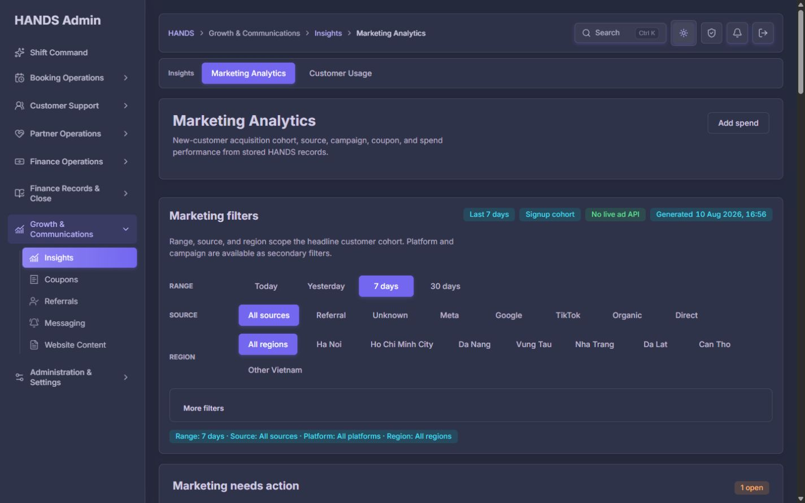

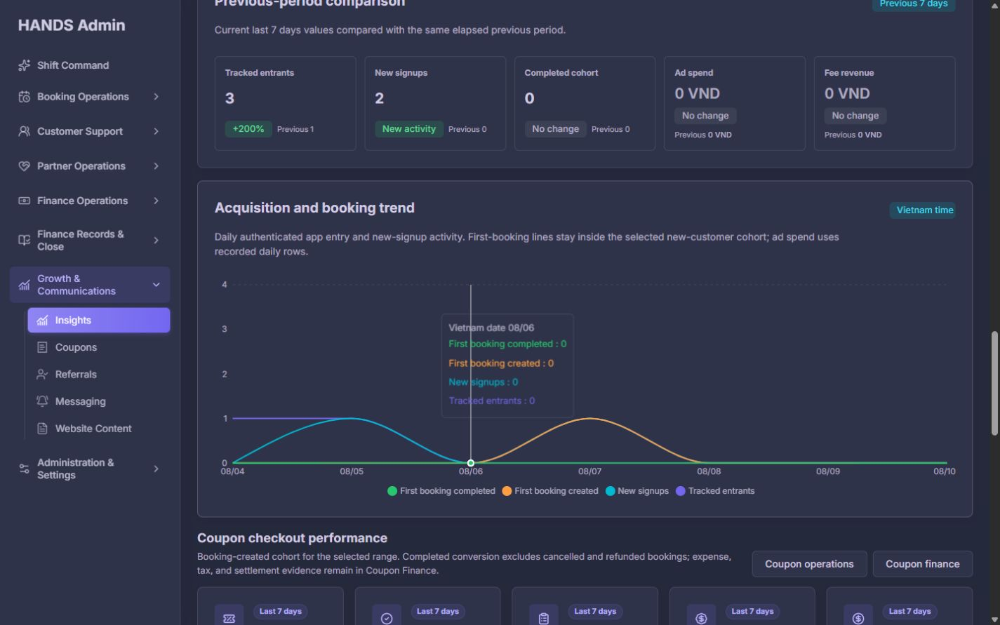

- surface, border, text, badge, focus 계층은 대체로 유지된다.
- 차트 네 색도 현재 배경에서는 보이지만 코드상 theme token이 아니므로 향후 테마 변경에 취약하다.
- muted text 대비는 정식 대비 계측을 별도로 해야 하며, 이번 결과만으로 WCAG 전체 준수를 선언할 수는 없다.

## 5. 우선순위별 상세 문제

### P0-1 — Region 필터의 범위가 거짓으로 표시됨

**증거**

- UI 설명: `apps/admin_web/app/marketing-analytics/page.tsx:461`
- API의 실제 제한 설명: `apps/api/src/admin/admin.service.ts:690`
- attribution 함수의 필터 타입은 source/platform/campaign만 포함: `apps/api/src/admin/admin.service.ts:10059`
- summary는 이 함수를 현재·이전 기간에 그대로 사용: `apps/api/src/admin/admin.service.ts:10928`
- 브라우저에서 HCMC 선택 전후 headline 값이 동일함.

**운영 위험**

지역 광고비만 필터되고 고객·예약·매출은 전국 값이면 CPA와 ROAS의 분자·분모 범위가 다르다. 잘못된 지역 예산 증감 판단으로 바로 이어질 수 있다.

**수정 방향**

1. 단기: Region을 headline 필터에서 제거하고 `Spend & location breakdown scope`로 내려보낸다. Region 선택 시 headline KPI와 action을 비활성화하거나 “Not scoped by region”을 명시한다.
2. 정식: first touch 시점의 region evidence를 고객 획득 레코드에 저장하고, entrants → signup → booking → revenue와 spend 모두 같은 region predicate를 사용한다.

**완료 기준**

- Region 선택 시 모든 headline numerator/denominator가 같은 cohort를 사용한다.
- 그렇지 않으면 Region이 headline KPI·action·comparison에 영향을 주지 않도록 UI와 API 계약을 분리한다.

### P0-2 — Today 이전 기간 계산 오류

**증거**

- `adminMarketingPreviousRangeWindow`: `apps/api/src/admin/admin-marketing-analytics.ts:261`
- 현재 구현은 previous end를 current start로 두고 오늘 경과시간만큼 역산한다.
- 테스트 `same elapsed Vietnam-time window yesterday`가 잘못된 12시간 창을 그대로 승인: `apps/api/src/admin/admin-marketing-analytics.spec.ts:62`

**수정 방향**

Today가 베트남 시간 00:00~12:00이면 previous는 전일 00:00~12:00이어야 한다. current start/end 모두 정확히 1 calendar day 이동한 값을 사용한다. DST가 없는 Vietnam timezone이라도 timezone helper를 통해 의미를 고정한다.

**완료 기준**

- 2026-06-22 12:00 ICT 기준 previous window가 2026-06-21 00:00~12:00 ICT다.
- Today, Yesterday, 7d, 30d의 경계 테스트가 label과 실제 window를 함께 검증한다.

### P0-3 — 요약 API 장애가 실제 0으로 위장됨

**증거**

- summary와 coupon summary가 `adminGet(..., empty fallback)`을 사용: `apps/admin_web/app/marketing-analytics/page.tsx:323`
- spend exact read만 `adminGetResult`로 성공 여부를 보존: `apps/admin_web/app/marketing-analytics/page.tsx:338`

**수정 방향**

summary도 `adminGetResult`를 사용하고 `available / unavailable / empty`를 분리한다. 불가 상태에서는 KPI 숫자, action 없음, 비교율을 렌더링하지 말고 마지막 성공 시각·Retry·System Health 링크를 제공한다.

**완료 기준**

- API 500/503/timeout에서 0 KPI가 보이지 않는다.
- 정상 응답의 실제 0만 `No marketing evidence in this scope`로 표시된다.

### P1-1 — Operations grid와 breakdown 표가 1440에서 잘림

**증거**

- `.marketing-operations-grid` 0.8fr / 1.7fr: `apps/admin_web/app/globals.css:14725`
- 두 카드의 `min-height: 100%`: `apps/admin_web/app/globals.css:14731`
- campaign table 최소 폭 760px: `apps/admin_web/app/globals.css:14898`
- coupon table 최소 폭 1320px: `apps/admin_web/app/globals.css:15121`

**수정 방향**

- operations: `grid-template-columns: minmax(0, 1fr) minmax(0, 1.15fr); align-items:start`.
- 빈 campaign card는 높이 160~220px의 compact state 또는 전체 폭 상태로 렌더.
- breakdown은 2열 grid에서 빼서 표마다 전체 폭으로 쌓는다.
- platform secondary 설명은 제거하고 첫 열 최소폭을 확보한다.

### P1-2 — Coupon filter scope가 global filter처럼 보임

**증거**

- coupon API builder는 range만 전송: `apps/admin_web/app/marketing-analytics/marketing-analytics-model.ts:215`
- coupon page href는 global filter URL을 유지: `apps/admin_web/app/marketing-analytics/marketing-analytics-model.ts:245`
- API route도 range 중심: `apps/api/src/admin/admin-analytics.routes.ts:102`

**수정 방향**

쿠폰 섹션을 `Scope: selected range only`로 명확히 분리하고 global filter summary에서 시각적으로 떼어낸다. 장기적으로 source/campaign별 coupon attribution이 필요하다면 별도 명시적 계약으로 구현한다.

### P1-3 — Below break-even action의 표시 값이 판단 기준과 다름

**증거**

- 판단 문구는 fee ROAS와 1.00x break-even을 사용하지만 action `value`는 CPA completed customer: `apps/admin_web/app/marketing-analytics/marketing-analytics-model.ts:323-347`

**수정 방향**

action 값도 `Fee ROAS 0.xx×`로 표시하고, evidence 링크에서 Spend / Fee revenue / Completed / Gross value를 한 번에 비교한다.

### P1-4 — 지출 저장의 오류·성공 피드백 부족

**증거**

- 잘못된 입력은 무응답 return, POST 예외는 action 밖으로 전달: `apps/admin_web/app/marketing-analytics/actions.ts:6-31`

**수정 방향**

`useActionState` 또는 동등한 서버 action result를 사용한다. field error, stale expectedUpdatedAt 충돌, 권한, 네트워크, 성공+감사 로그 링크를 각각 표시한다.

### P1-5 — 표본 기반 Region 결과가 전체 집계처럼 보임

**증거**

- `ADMIN_MARKETING_REGION_LIMIT = 100`: `apps/api/src/admin/admin.service.ts:683`
- 주소·예약 조회에 여러 번 적용: `apps/api/src/admin/admin.service.ts:9258-9304`

**수정 방향**

정확한 DB aggregate로 바꾸거나 섹션 제목과 설명에 `Recent 100 records per evidence source`를 표시하고 예산 판단용 headline에서 제외한다.

### P2 — 운영 효율과 문구 정리

1. Campaign ID free text를 최근 캠페인 searchable picker로 교체하고 exact ID는 advanced input으로 내린다.
2. `ref-smoke, campaign id...`를 운영 문구에서 제거한다: `page.tsx:516`.
3. `FCM-ready delivery layer`를 `First recorded app platform` 또는 무문구로 바꾼다: `page.tsx:678`.
4. `No live ad API`를 neutral badge `Spend source: manual records`로 바꾼다: `page.tsx:454`.
5. ROAS card tone을 값에 따라 neutral/warning/success로 계산하고 `Gross ROAS`로 이름을 바꾼다: `page.tsx:421`.
6. cancellation rate 25% 초과는 Top insights에만 두지 말고 Needs action으로 승격하거나 직접 evidence 링크를 제공한다.
7. KPI 9개와 Funnel 5단계의 중복을 줄인다. Funnel을 핵심 획득 단계로 유지하고 KPI에는 Spend, CPA, Gross ROAS, Fee revenue 같은 결과값만 남긴다.
8. active filter summary는 `Range + non-default filter`만 보여준다. `All platforms`, `All regions`는 active가 아니다.
9. Data gaps의 긴 문장을 pill처럼 보이는 요소에서 제거하고 `Metric scope & limitations` disclosure의 bullet list로 바꾼다: `globals.css:15049`.
10. all-zero coupon summary는 한 개 compact empty state로 축약한다.

### P3 — 유지보수·성능·테마

1. action threshold가 클라이언트에 하드코딩돼 있다: `marketing-analytics-model.ts:57-63`. 서버 정책/metadata로 제공하고 화면에 기준을 보인다.
2. page 1,844줄, admin service 46,616줄, globals.css 27,426줄이다. filter, actions, KPI, coupon, breakdown을 독립 Server Component와 CSS module/domain file로 분리한다.
3. trend chart 173줄은 네 색을 hex로 고정한다: `marketing-analytics-trend-chart.tsx:100-138`. semantic chart token으로 교체한다.
4. 실제 운영 성능을 계측한 뒤 필요하면 Recharts를 동적 로드한다. 지금은 표 지연 로딩보다 우선순위가 낮다.
5. detector가 지적한 3px left border는 action severity 표현으로 의도적이므로 유지 가능하다. 단, 색만으로 심각도를 전달하지 않도록 현재 badge/문구를 함께 유지한다.

## 6. 권장 최종 화면 구조

1. **Page header** — 목적 한 줄, `Add spend`, generated time, data-source status.
2. **Compact filter bar** — Range / Source, 필요 시 Region은 신뢰 가능한 범위에만 표시. Platform / Campaign은 More filters.
3. **Needs action** — 최대 2열, Priority / Why / Value / Evidence / Next action.
4. **Acquisition funnel** — Entrants → Signups → Address ready → Created → Completed.
5. **Business outcome strip** — Spend / CPA completed / Gross ROAS / Fee ROAS / Fee revenue.
6. **Comparison + trend** — 같은 cohort 계약과 올바른 이전 기간.
7. **Coupon performance** — range-only scope를 독립 표시; 0이면 compact state.
8. **Breakdowns** — Source, Campaign, Platform, Region을 전체 폭 accordion/tab으로 한 번에 하나씩 로드.
9. **Metric scope & limitations** — Region 귀속, manual spend, attribution gaps, sample limit을 명시.

이 구조는 운영자가 `무엇이 문제인가 → 얼마만큼 중요한가 → 어떤 근거인가 → 어디서 조치하는가` 순서로 읽게 한다.

## 7. 구현 순서

### 1단계 — 배포 차단 데이터 신뢰성

1. Region scope 계약 분리 또는 완전 구현.
2. Today previous window 수정과 경계 테스트.
3. summary/coupon fetch의 unavailable state 도입.
4. coupon scope 분리.

### 2단계 — 1440 레이아웃

1. operations grid 비율·높이 수정.
2. breakdown 표 전체 폭 전환.
3. first viewport의 header/filter 높이 축소.
4. coupon 0-state와 KPI/Funnel 중복 축약.

### 3단계 — 행동·문구

1. Fee ROAS action 값 일치.
2. cancellation action 연결.
3. campaign picker.
4. FCM/ref-smoke/No live ad API 문구 제거.
5. Add spend action 결과 피드백.

### 4단계 — 구조·성능

1. 컴포넌트·service query 분리.
2. chart token화 및 필요 시 lazy load.
3. 실제 production navigation, API duration, cache hit 계측.

## 8. 필수 회귀 테스트

### API·모델

- HCMC 선택 시 headline cohort와 spend가 동일 scope인지 검증.
- Today 00:01, 12:00, 23:59 ICT의 previous window 검증.
- summary API 500/503/timeout과 실제 empty response를 구분.
- coupon endpoint에 지원하지 않는 filter가 적용된 것처럼 표시되지 않음.
- Region aggregate가 full aggregate인지 sample인지 계약 검증.

### 화면

- 1440×900에서 attribution diagnostics, campaign empty state, platform/campaign breakdown이 잘리지 않음.
- More filters가 닫힌 상태와 active 상태 모두 현재 필터를 정확히 알림.
- `ref-smoke`, `FCM-ready`, success-tone `No live ad API`가 없음.
- ROAS n/a/under/over 상태의 label과 tone이 일치.
- 모든 0인 coupon summary가 compact empty state로 표시.
- Add spend의 invalid, conflict, permission, network, success 상태가 모두 inline으로 표시.

### 현재 통과한 검증

- Admin Web: 관련 3개 테스트 파일, 28 tests 통과.
- API: `admin-marketing-analytics.spec`와 `admin.service.spec`, 611 tests 통과.
- Admin Web typecheck 통과.
- API typecheck 통과.

현재 테스트가 통과해도 P0가 남는 이유는 Today 테스트가 잘못된 기대값을 승인하고 있고, Region scope와 unavailable state를 검증하는 테스트가 없기 때문이다.

## 9. 성능 관찰

| 측정 | 현재 관찰 | 해석 |
|---|---:|---|
| 기본 화면 warm DOMContentLoaded 벽시계 1회 | 약 133ms | 로컬 개발 서버에서 이미 컴파일된 1회 표본 |
| 기본 DOM 요소 | 1,196 | 이전 1,208과 거의 동일 |
| SVG | 85 | 이전 88과 거의 동일 |
| 문서 높이 | 5,174px | 운영자가 훑기에는 여전히 김 |
| page.tsx | 1,844줄 | 이전 보고서 1,778줄보다 증가 |

하단 표를 on-demand로 바꾼 것은 초기 데이터 요청 수와 기본 화면 부담을 줄인 확실한 개선이다. 반면 DOM/SVG 총량은 거의 줄지 않았고, 차트와 많은 카드가 기본 렌더에 남아 있다. 이번 133ms는 production benchmark가 아니며, 이전에 관찰된 약 52초 cold compile 문제와 직접 비교해서 “해결 완료”로 판단하면 안 된다.

## 10. 감사 한계

- 실제 광고비 저장은 실행하지 않았다.
- API 장애를 강제로 주입하지 않았고, 화면의 기존 exact-read 실패 경로와 코드 계약으로 실패 처리를 확인했다.
- 실데이터가 매우 적어 고밀도 campaign/coupon 행의 실제 작업 속도는 합성 데이터 회귀 테스트가 필요하다.
- 브라우저 화면·DOM·코드 의미를 검수했지만 정식 WCAG 대비/키보드 인증 전체를 수행한 것은 아니다.
- production cold/warm 성능과 서버 query plan은 이번 페이지 재감사의 별도 범위다.

## 11. 최종 승인 조건

다음 여섯 조건이 모두 충족될 때 재승인한다.

1. Region이 같은 cohort의 모든 headline 지표를 필터링하거나 headline filter에서 제거됨.
2. Today comparison이 전일 동일 시각 범위를 사용함.
3. API 장애가 0건으로 보이지 않음.
4. 1440×900에서 operations grid와 모든 on-demand 표가 잘리지 않음.
5. Coupon scope, Gross ROAS, Fee ROAS의 의미가 UI에 명확히 분리됨.
6. Add spend의 성공·실패·충돌 피드백과 감사 근거가 화면에 남음.

