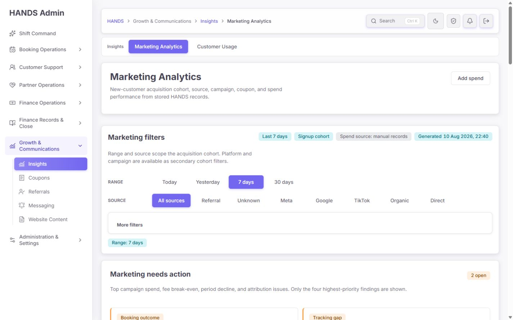
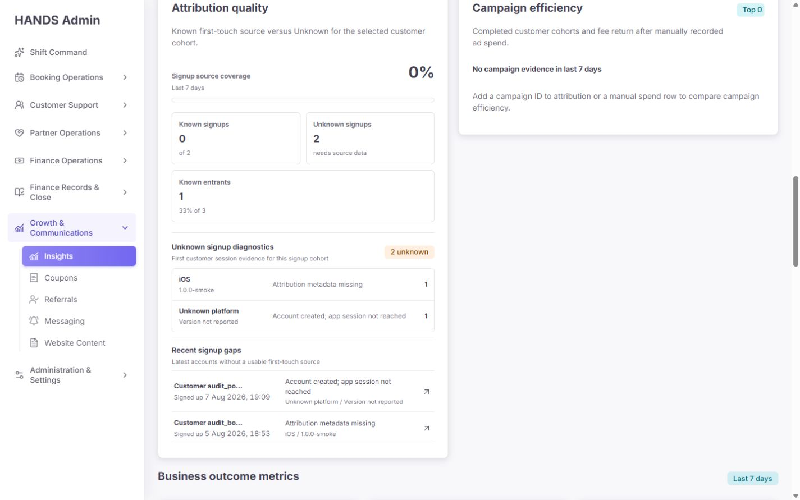
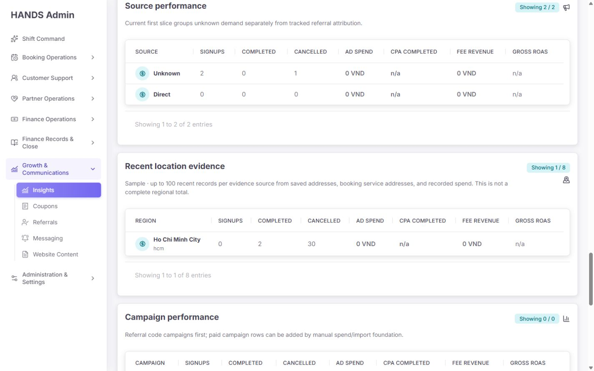
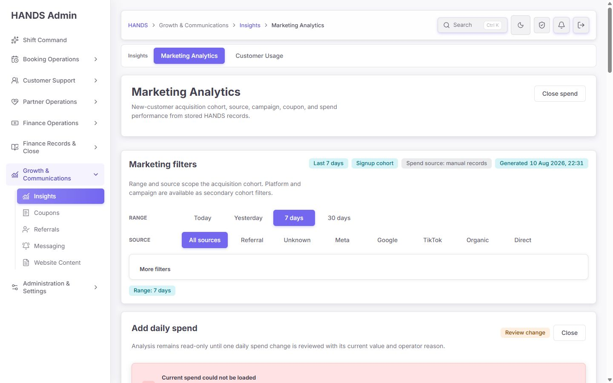
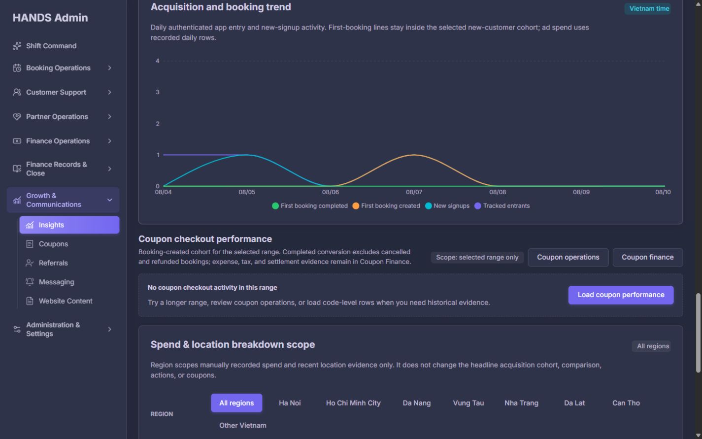

# Marketing Analytics remediation implementation report

Date: 2026-08-10  
Route: `/marketing-analytics`  
Workspace: `C:\dev\massage-on-demand-vn`

## Final assessment

Marketing Analytics now separates evidence that can support acquisition decisions from evidence that cannot. Headline acquisition, comparison, actions, and coupon results no longer imply a Region-scoped customer cohort. Vietnam-time comparison windows, API availability, gross/fee return, manual spend changes, coupon scope, sampled location evidence, and independent breakdown failures are explicit.

At 1440x900 the operator sees compact filters and the start of the action queue in the first viewport. The acquisition funnel, attribution evidence, business outcomes, comparison/trend, coupons, Region-local evidence, and full-width breakdown tables follow in decision order. Browser checks found no page-level horizontal overflow and no console warning or error.

## P0-P3 mapping

| Audit item | Status | Implementation |
| --- | --- | --- |
| P0-1 Region contract | Complete | No deterministic first-touch Region evidence exists. Region was removed from the headline cohort and retained only for manual spend and recent location evidence. Summary/action/comparison/coupon requests ignore it. |
| P0-2 Today previous window | Complete | Today compares Vietnam 00:00-current time with yesterday 00:00-yesterday same time. Yesterday and multi-day ranges use equal, non-overlapping windows. Boundary tests cover 00:01, 12:00, and 23:59 ICT. |
| P0-3 unavailable vs empty | Complete | Summary and coupon use result-bearing reads. Summary, coupon, and each optional dimension fail independently. Unavailable is not rendered as zero. |
| P0-4 Coupon scope | Complete | Coupon UI, loader, and pagination are range-only and show an explicit range-only badge. Unsupported source/platform/region/campaign filters are not forwarded. |
| P1 operations layout | Complete | Attribution and campaign cards use balanced columns with `align-items:start`; empty campaign state keeps natural height. |
| P1 Needs action | Complete | Maximum two columns, evidence-linked actions, cancellation threshold promoted to the queue. Browser states for 0, 1, and 2 actions were checked. |
| P1 breakdown tables | Complete | Dimensions are stacked full-width, use reduced decision columns, sticky identity columns, unique accessible region names, and scoped table scrolling. |
| P1 Region sample honesty | Complete | Region is labelled `Recent location evidence` and explicitly states up to 100 recent records per evidence source and that it is not a complete regional total. |
| P1 ROAS contract | Complete | `Gross ROAS` and `Fee ROAS` are distinct. Fee ROAS 1.00x is the break-even decision basis; n/a is neutral and below break-even is warning. |
| P1 spend feedback | Complete | Draft/review/save remains fail-closed. Invalid, conflict, forbidden, unavailable, error, and success states are distinct; success evidence includes saved value/time/reason and Audit Log. |
| P2 operator copy and density | Complete | Removed internal delivery/smoke wording, repeated default filters, repeated KPI range labels, five-card coupon zero state, and headline Region implication. |
| P2 campaign picker | Partial | Exact Campaign ID remains an advanced field. No safe existing candidate endpoint was available, so a speculative search endpoint was not added. Campaign breakdown remains the evidence lookup path. |
| P3 component boundaries | Partial | Interactive spend result handling is isolated in a small client component and trend/loading remain separate. The server page is still large; a broad file move was deferred to avoid churn in this data-contract remediation. |
| P3 API extraction | Partial | Vietnam range/window logic is isolated and tested in `admin-marketing-analytics.ts`; the existing `AdminService` query composition remains in place to preserve DI and callers. |
| P3 threshold policy | Partial | Thresholds are centralized in one typed Admin model and tested together with actions, but are not yet server-provided metadata. |
| P3 chart/theme and loading | Complete | Semantic chart tokens replace hardcoded colors. Light/dark chart, independent coupon/breakdown boundaries, and on-demand loading were retained. No unmeasured dynamic import was added. |

## Region scope decision

The stored attribution evidence does not provide a deterministic first-touch Region that can constrain entrants, signup, first booking, completed value, fee revenue, and spend with one predicate. Saved/latest addresses and the bounded Region evidence query occur after acquisition and cannot be backfilled into first touch safely.

Chosen contract:

- Headline cohort: range, source, platform, and campaign where supported.
- Region: local scope for manually recorded spend and recent location evidence only.
- Coupon: selected range only.
- Sampled Region rows: never used for headline budget actions or exact regional totals.

## Data and API changes

- Added Vietnam-time previous-window behavior with end-exclusive, non-overlapping comparison ranges.
- Removed Region from headline summary/service predicates while preserving the compatible query parameter for the local evidence workspace.
- Added `breakdownFilters.regionCode` so local scope is machine-readable without contaminating headline filters.
- Preserved response availability for summary, coupon summary, coupon rows, and each dimension independently.
- Added explicit sample returned/total metadata and retained bounded Region evidence semantics.
- Kept route, authorization, cache tags, currency, audit logging, and deep links intact.

## UI and interaction changes

- Reordered the page to filters, Needs action, funnel, attribution/campaign evidence, business outcomes, comparison/trend, coupons, local Region scope, breakdowns, and limitations.
- Replaced duplicated funnel KPI cards with Ad spend, CPA completed customer, Gross ROAS, Fee ROAS, and Platform fee revenue.
- Added compact coupon empty state and a data-present KPI state.
- Added fail-closed daily spend review and typed save results; no mutation was executed during browser QA.
- Added unique table landmark labels: Source performance, Recent location evidence, Campaign performance, Platform first opens, coupon performance, and campaign efficiency.
- Added semantic chart colors for both themes and retained the screen-reader data table.

## Changed files

### Admin Web

- `apps/admin_web/app/marketing-analytics/page.tsx`: scope boundaries, page IA, independent availability, KPI/coupon/breakdown/spend UI.
- `apps/admin_web/app/marketing-analytics/marketing-analytics-model.ts`: filter contract, actions, thresholds, ROAS and links.
- `apps/admin_web/app/marketing-analytics/actions.ts`: typed spend action results and conflict/error handling.
- `apps/admin_web/app/marketing-analytics/marketing-spend-action-form.tsx`: minimal client boundary for pending/result feedback.
- `apps/admin_web/app/marketing-analytics/marketing-analytics-trend-chart.tsx`: semantic chart tokens.
- `apps/admin_web/app/marketing-analytics/loading.tsx`: route loading surface.
- `apps/admin_web/app/globals.css`: 1440 layout, full-width tables, sticky identity, compact coupon/actions, theme tokens.
- `apps/admin_web/lib/admin-api.ts`: updated Marketing Analytics response contracts.
- Closest `*.spec.ts(x)` files: scope, availability, ROAS, action, coupon, href, and previous-period regressions.

### API

- `apps/api/src/admin/admin-marketing-analytics.ts`: Vietnam window helpers and Region/headline query contract.
- `apps/api/src/admin/admin.service.ts`: headline query scope, sampled evidence metadata, overview composition.
- Closest API specs: Vietnam boundary, controller compatibility, Region isolation, and service aggregate behavior.

No dependency, Prisma schema, migration, auth policy, payment policy, or customer/Partner app change was added by this task.

## Verification

| Command | Result |
| --- | --- |
| `npm.cmd run test --workspace @massage-vn/admin-web -- app/marketing-analytics/page.spec.tsx app/marketing-analytics/actions.spec.ts app/marketing-analytics/marketing-analytics-model.spec.ts` | PASS - 38/38 |
| `npm.cmd run test --workspace @massage-vn/api -- src/admin/admin-marketing-analytics.spec.ts src/admin/admin.controller.spec.ts -t "marketing"` | PASS - 25 passed, 153 skipped by filter |
| `npm.cmd run test --workspace @massage-vn/api -- src/admin/admin.service.spec.ts -t "marketing"` | PASS - 6 passed, 594 skipped by filter |
| Targeted Admin/API ESLint | PASS |
| Admin Web/API typecheck | PASS |
| `npm.cmd run verify:scope -- -Scope admin` | PASS - 832 files passed/1 skipped; 4,476 tests passed/1 skipped; lint, guards, copy and production build passed |
| `npm.cmd run verify:scope -- -Scope api` | PASS - 162 files passed/1 skipped; 2,178 tests passed/1 skipped; Prisma validate, contracts, typecheck, lint and build passed |

The first Admin scope run caught one missing `prefetch={false}` on the new Audit Log link. It was corrected and the complete Admin scope was rerun successfully. Both scope scripts report a protected-area review warning because the pre-existing dirty worktree already contains protected-file changes; this task did not add Prisma, auth, payment, settlement, booking, shared-type, or mobile-app changes.

## Browser verification

Environment: signed-in in-app browser, production `next start`, 1440x900, light and dark themes.

Verified:

- Default 7 days and expanded More filters.
- Source + Platform active summary with only non-default filters.
- Region local HCMC scope without a headline Region filter.
- Needs action with 0, 1, and 2 findings.
- Attribution diagnostics with compact empty campaign state.
- Funnel, outcome metrics, comparison, and trend.
- Coupon empty at 7 days and data-present at 30 days.
- On-demand Source/Region/Campaign/Platform tables.
- Spend read-failure fail-closed state; no save was submitted.
- Dark chart colors, zero page-level horizontal overflow, unique table region labels, and zero console warnings/errors.

## Remaining risks and follow-up

1. The local API could not read the seeded daily spend record during browser QA, so the fail-closed read-error UI was verified visually while invalid/conflict/success states remain covered by focused tests. A healthy API-backed seeded record is required for a non-mutating review-state browser capture.
2. Searchable campaign selection needs an authoritative bounded candidate source. Until that exists, exact ID plus Campaign performance evidence is safer than an inferred picker.
3. Threshold metadata is centralized and tested in the Admin model but remains client-owned. Move it to a server-owned policy response only when the API contract can change without duplicating decision logic.
4. The route server component remains large. Further file movement should be a separate no-behavior-change checkpoint after this contract is stable.

Commit: Not committed. No push or deployment performed.
