# Notification Delivery 운영자 UX·데이터·보안 심층 감사 보고서

- 감사일: 2026-08-06 (Asia/Bangkok)
- 대상: `http://localhost:3101/notifications`
- 범위: 로그인된 실제 관리자 화면, 기본/전체 기간/전송 공백/푸시 불가/재시도/시스템 사고/과거 사고/잘못된 페이지 상태, 1024×768·1280×720·1440×900, Admin Web·API·Prisma·권한·재시도·감사 기록
- 방식: 실제 화면과 접근성 DOM을 상태별로 캡처한 뒤, 화면 문구가 API 조건·DB 상태·작업 권한과 같은 뜻인지 코드에서 역추적했다.
- 안전 범위: 실제 알림 발송, 재시도 확정, legacy review 저장, 데이터 수정, 다운로드는 하지 않았다.
- 콘솔: 점검한 상태에서 warning/error 0건

## 1. 결론

이 페이지는 **유지해야 하지만 역할을 크게 줄여야 한다.** 알림 전송 증거와 제한된 재시도는 실제 운영 수요다. 그러나 현재 `/notifications`는 다음 네 종류의 서로 다른 업무를 한 화면에 합쳐 놓았다.

1. 고객·Partner·Admin에게 생성된 모든 알림 기록 검색
2. 모바일 전송 실패와 장치 상태 진단
3. Background Job 시스템 사고 처리
4. Bank Reconciliation의 48시간 SLA 처리

그 결과 운영자는 21개 queue, 기간·age·SLA·owner·incident state 필터, 요약 카드, 원본 레코드, 전송 시도, source incident를 동시에 해석해야 한다. 기능이 많은 것이 아니라 **업무 단위와 숫자 단위가 섞여 있는 상태**다.

운영 투입 전 P0 수정이 필요하다. 가장 중요한 문제는 미관이 아니라 다음의 신뢰·안전 결함이다.

1. `Test data excluded`라고 표시되지만 전체 기간 82,945건의 첫 페이지부터 `Smoke Admin`, `Local Admin Web Actor`, `Demo Admin`, `Audit Cancellation Customer`가 노출된다.
2. `Push unavailable users`는 실제로 “현재 알림을 받을 수 없는 사용자”가 아니다. 사용자가 가진 장치 중 **하나라도 disabled이면** 그 사용자의 과거 delivered 알림까지 포함한다.
3. 같은 화면에서 `15,821 notifications`, `92 affected users`, `111 app routes`가 함께 표시되지만 단위와 모집단의 관계가 설명되지 않는다.
4. `Failed sends`와 `Needs retry`는 API에서 같은 `failed` disposition query를 사용한다. 이름만 다른 중복 queue다.
5. `SENT`를 `Push delivered`라고 표시한다. 현재 DB 증거는 FCM/provider가 send 요청을 받아들였다는 뜻이지 단말 표시나 사용자 수신 확인이 아니다.
6. partial row는 `Partial delivery`라고 경고하면서 옆 Delivery 열에는 최신 성공 한 건을 기준으로 초록색 `Push delivered / 2 attempts`를 보여준다.
7. 재시도 확인 화면은 성공·실패 path가 섞였다고 설명하지만 실제 실패 device/path를 보여주지 않고 `Latest evidence: FCM SENT`만 제시한다.
8. 재시도와 legacy review server action은 실패를 fallback으로 삼키는 `adminPost`를 사용하므로, API 4xx/5xx 또는 권한 거부 후에도 성공처럼 원래 화면으로 돌아갈 수 있다.
9. `page=9999`는 데이터 요청에는 9999의 skip을 사용하면서 UI page만 75로 보정한다. 총 745건인데 0행과 `Showing 0 to 0 of 745`가 표시된다.
10. 1024px에서 1,280px 표가 636px 영역에 들어가 644px 넘친다. 1440px에서도 228px 넘쳐 핵심 `Delivery`와 `Action`이 기본 화면 밖에 있다.
11. 전체 전화번호와 내부 상태값이 대량 목록에 반복 노출된다. `ONLINE_AVAILABLE` 같은 raw enum과 `App offline` avatar signal이 동시에 보여 운영 의미도 충돌한다.
12. 알림 기록 열람과 재시도가 같은 `NOTIFICATIONS_DELIVERY` category로 묶여 있고, API write boundary에는 별도의 retry 권한이나 server-side operator reason이 없다.

권장 방향은 새 대시보드를 더 만드는 것이 아니다.

- 내비게이션과 H1을 `Notification Delivery`로 통일한다.
- 기본 화면은 **아직 해결되지 않은 전송 문제**만 보여준다.
- `Failed sends`와 `Needs retry`를 하나로 합치고, 실패·send 미시도·활성 경로 없음·장치 재활성 필요를 4개 이내의 명확한 상태로 정리한다.
- `System incidents`는 기존 `/background-jobs`, `Finance overdue/history`는 기존 Bank Reconciliation 화면이 source of truth가 되게 하고 여기서는 링크만 제공한다.
- `Sent`, `Mobile push`, `In-app route`, `Partner alerts`, `No-show`, `Payout setup`은 queue가 아니라 `Delivery records`의 channel/type 필터로 내린다.
- “incident” lifecycle을 새로 만들지 않는다면 `Current incidents / Historical cleanup`을 삭제하고 `Open failure groups`로 단순화한다. 24시간이 지났다는 이유만으로 조치 대상에서 제외하지 않는다.

## 2. 실제 화면과 데이터 증거

| 상태 | 실제 확인 결과 |
|---|---:|
| 기본 `/notifications` | `Delivery incidents`, 최근 24시간, open incident 0 |
| `range=all&review=all` | 82,945 notifications |
| Advanced filters | primary 6개 + additional 15개 = 21 queue |
| `review=delivery-gap` | 434 notifications |
| `review=disabled-device` | 15,821 notifications; delivered row 포함 |
| `review=needs-retry` | 745 notifications; partial row에 최신 FCM SENT 표시 |
| `review=delivery-incident-history` | 66 failure groups |
| `review=system-incidents` | 130 source groups |
| `page=9999&review=needs-retry` | URL 9999, UI 75, total 745, visible rows 0 |
| 1024px | table 1,280px / visible 636px / overflow 644px |
| 1280px | table 1,280px / visible 약 892px / overflow 약 388px |
| 1440px | table 1,280px / visible 1,052px / overflow 228px |

위 수치는 로컬 로그인 세션의 감사 시점 스냅샷이다. 실제 production 운영량으로 해석하면 안 된다. 다만 화면의 숫자·라벨·query 의미가 서로 맞는지는 충분히 검증할 수 있다.

## 3. 화면 단계별 평가

### Step 1 — 기본 진입: 방향은 맞지만 작업 단위가 불완전함

**상태: 개선 필요**

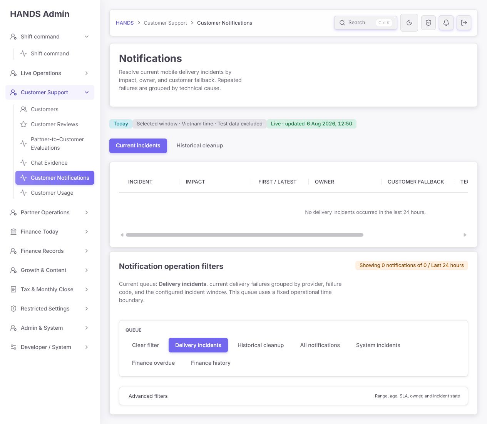

장점:

- 기본값을 전체 82,945건 기록이 아니라 현재 delivery incident로 잡은 결정은 옳다.
- list와 summary는 `adminGetResult`를 사용해 읽기 실패를 빈 queue로 숨기지 않는다.
- “최근 24시간에 사고 없음” empty state는 단순하고 건강 상태를 전달한다.
- current/history control은 현재 위치를 접근성 DOM에서도 구분할 수 있다.

문제:

- H1은 `Notifications`, breadcrumb/nav는 `Customer Notifications`인데 실제 범위는 Customer, Partner, Admin system, Finance다.
- 최근 24시간에 사고가 없으면 운영자는 다음에 무엇을 볼지 알 수 없다. “정상”과 “과거 미해결 failure가 없음”은 같은 뜻이 아니다.
- 사고가 24시간을 넘으면 `Historical cleanup`으로 이동해 현재 SLA에서 제외된다. 시간 경과가 해결을 의미하지 않는다.
- empty table 밑에 다시 큰 filter board가 이어져, healthy state에서도 page 구조가 길다.

권장:

- 이름을 `Notification Delivery`로 통일한다.
- 기본 queue는 `Open delivery issues`로 하고 latest path가 해결되지 않은 모든 age를 포함한다.
- age/SLA는 상태를 나누는 필터로만 사용하고 24시간 이상을 별도 “cleanup” 업무로 격리하지 않는다.
- 0건일 때는 `No open delivery issues`와 `View delivery records` 하나만 제공한다.

### Step 2 — 전체 기록: 운영 자료와 test/audit 자료의 경계 실패

**상태: P0 신뢰 실패**

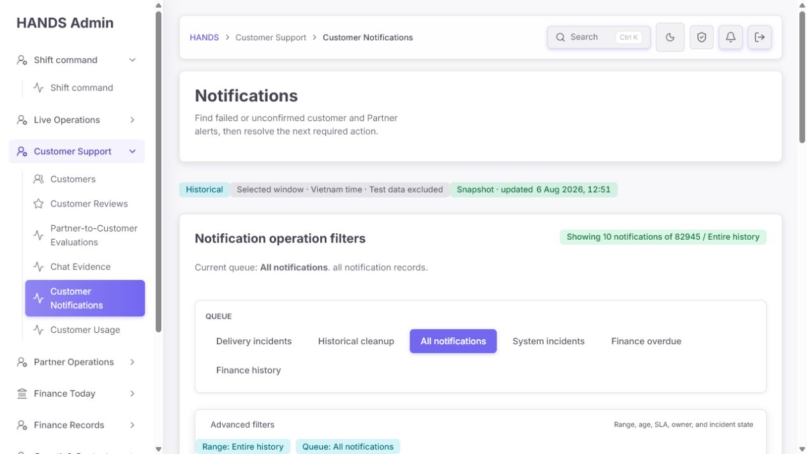

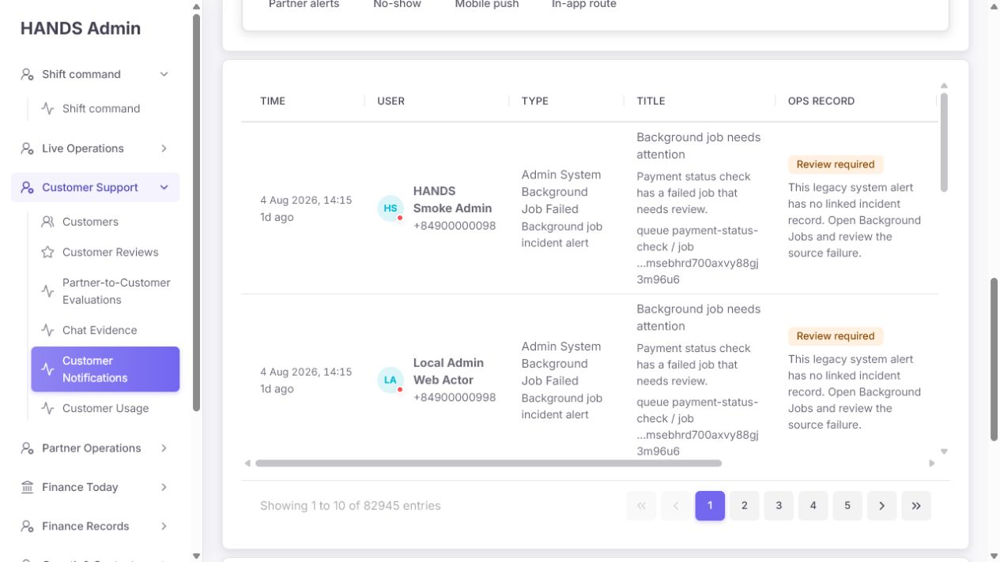

확인 결과:

- 화면은 `Selected window · Vietnam time · Test data excluded`라고 단정한다.
- 바로 아래 결과에는 `HANDS Smoke Admin`, `Local Admin Web Actor`, `Demo Admin`, `Audit Cancellation Customer`가 보인다.
- 동일한 system alert와 audit cancellation 알림이 연속으로 반복된다.
- 전체 전화번호가 기본 목록에 그대로 표시된다.

코드 원인:

- `adminNotificationProductionDataWhere/Sql`은 notification id, userId, bookingId가 `smoke`/`seed-`로 시작하는지와 `data.smokeFixture/smoke`만 검사한다.
- 실제 fixture가 random cuid를 사용하고 명시적 marker를 넣지 않으면 이름이 Smoke/Audit여도 production으로 간주된다.
- summary는 필터 결과와 무관하게 `dataClass: 'live'`를 반환하고 `DashboardDataScopeStatus`는 이를 근거로 `Test data excluded`를 표시한다.

권장:

- 사람 이름 문자열로 `Smoke`, `Demo`, `Audit`를 임의 제외하지 않는다. 실제 고객 이름일 수 있다.
- 모든 seed/smoke/audit 생성 경로가 notification `data`에 명시적 fixture provenance를 기록하게 하고 기존 로컬 fixture를 backfill 또는 정리한다.
- list, summary, failure group, device health, unattempted query가 같은 production predicate를 사용한다는 DB parity test를 유지·확장한다.
- 경계를 보장하기 전에는 `Test data excluded`를 표시하지 말고 `Mixed local data` 또는 `Data boundary unverified`로 낮춘다.

### Step 3 — 필터와 queue: 21개 선택지가 업무·상태·채널·도메인을 혼합함

**상태: 실패**

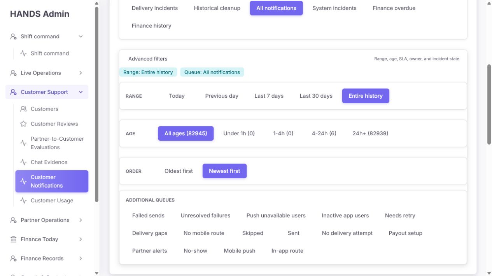

현재 primary queue:

- Delivery incidents
- Historical cleanup
- All notifications
- System incidents
- Finance overdue
- Finance history

현재 additional queue:

- Failed sends, Unresolved failures, Push unavailable users, Inactive app users, Needs retry
- Delivery gaps, No mobile route, Skipped, Sent, No delivery attempt
- Payout setup, Partner alerts, No-show, Mobile push, In-app route

문제:

- `Failed sends`와 `Needs retry`는 API에서 모두 `failed` disposition으로 매핑되어 중복이다.
- `Sent`, `Skipped`는 delivery status, `Mobile push`, `In-app route`는 channel, `Partner alerts`, `No-show`, `Payout setup`은 business type, `Finance overdue`는 다른 부서의 source task다.
- 서로 다른 차원을 segmented button 하나로 펼쳐 놓아 조합 검색이 불가능하다. 예: Partner + Failed + 24h+를 한 번에 선택할 수 없다.
- Advanced disclosure 안에 Range, age, SLA, owner, incident state, runbook, additional queue가 모두 들어가 한 번 열면 compact하지 않다.
- current/historical incident view는 상단 scope control과 하단 queue control이 중복된다.

권장 최소 구조:

1. 상단 mode 두 개만 유지: `Needs action`, `Delivery records`.
2. Needs action 상태는 최대 4개: `Failed`, `Not attempted in 15m`, `No active push route`, `App route needs refresh`.
3. Delivery records 필터: `Recipient`, `Type`, `Channel`, `Send status`, `Date`, `Search`.
4. `System incidents`와 `Finance overdue/history`는 페이지에서 제거하고 source 화면 링크만 둔다.
5. `Failed sends`와 `Needs retry` 중복 alias를 하나로 삭제한다.

### Step 4 — 레코드 표: 원본 데이터는 많지만 판단 순서가 거꾸로임

**상태: 실패**

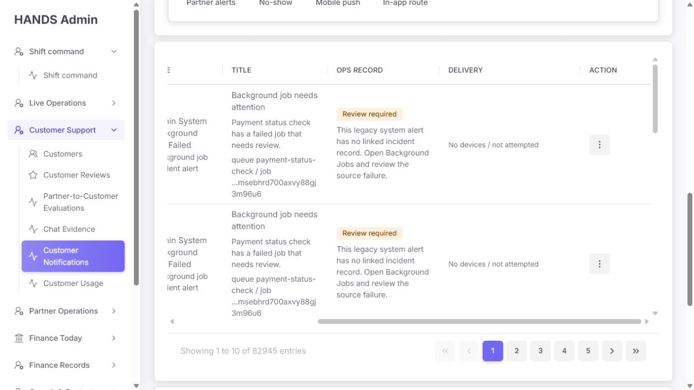

현재 열 순서:

`Time → User → Type → Title → Ops record → Delivery → Action`

문제:

- 운영자가 먼저 알아야 할 `현재 상태`와 `다음 행동`이 가장 오른쪽에 있다.
- Type과 Title/Body가 비슷한 의미를 반복하고, Ops record와 Delivery도 서로 다른 문장으로 같은 전송 상태를 설명한다.
- 한 행에 사용자, 전화, role, type meaning, title, body, booking hint, ops status, ops hint, latest attempt, action이 들어가 scan cost가 높다.
- raw status `ONLINE_AVAILABLE`가 사람 helper에 노출된다.
- avatar의 `App offline`은 delivery outcome이나 실제 session status와 혼동된다.
- 10행 표 내부에 세로 스크롤을 강제하고 페이지에도 세로 스크롤이 있으며, 표에는 가로 스크롤까지 있어 3개의 scroll context가 생긴다.

권장 레코드 열:

1. `Created` — 절대 시각 + 상대 시각
2. `Recipient` — 이름, Customer/Partner/Admin role, 전화번호는 masked
3. `Notification` — title 1줄 + body 2줄 + type은 작은 보조 label
4. `Send status` — path 집계와 정확한 operational label
5. `Next action` — primary action + overflow menu

추가 규칙:

- `Ops record` 열은 삭제하고 send status 안으로 합친다.
- `Delivery` disclosure에는 latest successful path가 아니라 unresolved path를 먼저 보여준다.
- `Action`은 sticky right 또는 첫 화면에 항상 보이는 위치로 옮긴다.
- 일반적인 10행 pagination에서는 table 내부 세로 max-height를 제거한다. sticky header를 위해 nested vertical scroll을 유지할 필요가 없다.
- 1024px 이하에서는 기존 표를 억지로 축소하지 말고 동일 데이터의 stacked row/card를 사용한다. 새 UI library는 필요 없다.

### Step 5 — Delivery gap: “확인 없음”이 아니라 “send 시도 없음”

**상태: 의미 수정 필요**

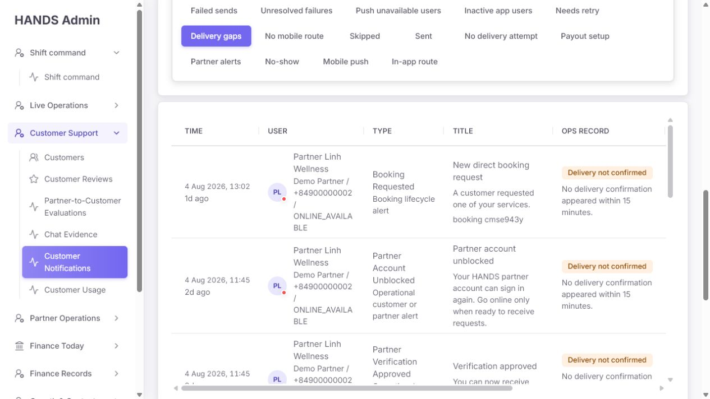

현재 정의:

> older than 15 minutes with enabled target device but no delivery evidence

실제 API/모델 조건:

- notification에 delivery row가 하나도 없음
- target role과 맞는 enabled PushDevice가 하나 이상 있음
- notification createdAt이 15분 이상 지남

문제:

- 이것은 “단말 delivery confirmation이 없음”이 아니라 **worker/send attempt 기록이 없음**이다.
- `Delivery not confirmed`는 FCM delivery receipt를 기다리는 것처럼 읽힌다.
- 사용자는 enabled device가 있으므로 첫 운영 질문은 “worker/queue가 이 notification을 처리했는가?”여야 한다.
- 행의 phone call guidance가 기술 원인 확인보다 먼저 반복되어 대량 상황에서 실제 queue 장애를 놓칠 수 있다.

권장 문구:

- queue: `Send not attempted`
- 상태: `No send attempt after 15m`
- helper: `An enabled target app route exists, but no send attempt was recorded within 15 minutes.`
- primary action: `Check notification worker`
- user contact는 긴급 booking alert일 때만 secondary guidance로 둔다.

### Step 6 — Push unavailable users: 현재 조건과 화면 주장이 다름

**상태: P0 데이터 의미 실패**

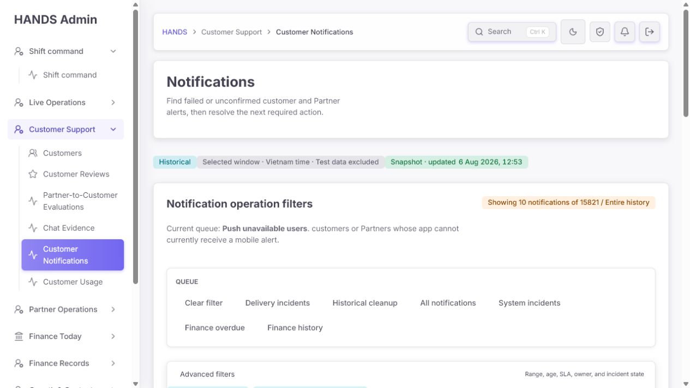

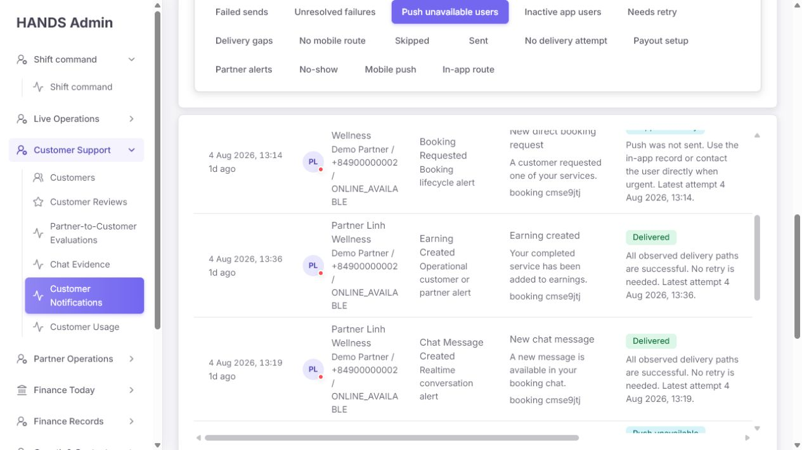

화면 주장:

> users who cannot currently receive a mobile alert

실제 조건:

- API `disabled-device`는 user의 pushDevices 중 하나라도 `enabled=false`이면 notification을 포함한다.
- Web의 `hasDisabledPushDevice`도 user device 또는 과거 delivery device 중 하나라도 disabled이면 true다.
- 같은 user에게 다른 enabled device가 있거나 해당 notification의 latest path가 SENT여도 포함된다.

따라서 이 queue 안에 초록색 Delivered row가 나타난 것은 UI 오류가 아니라 predicate 자체가 화면 이름과 다른 증거다.

숫자 문제:

- header: 15,821 notifications
- Needs action card: 92 affected users
- helper: 111 app routes cannot receive mobile alerts

세 숫자는 각각 notification, distinct user, disabled device로 보이지만 화면에서 이 관계를 설명하지 않는다. 또한 disabled device가 있다는 사실은 “사용자에게 active route가 하나도 없다”는 뜻이 아니다.

권장:

- 실제 조치 queue는 `No active push route`로 정의한다: target role에 맞는 enabled device가 0개인 사용자/notification만 포함한다.
- disabled device inventory가 필요하면 운영 queue가 아니라 diagnostics detail로 둔다.
- 결과의 기본 단위를 사용자로 할지 notification으로 할지 하나를 선택한다. 이 목적에는 `affected users`가 적합하다.
- summary와 row query가 같은 predicate를 사용하고, `affected users / active routes / notifications awaiting contact`의 단위를 명시한다.

### Step 7 — Partial delivery와 Retry: 안전장치는 있지만 운영 증거가 부족함

**상태: P0 작업 안전 개선 필요**

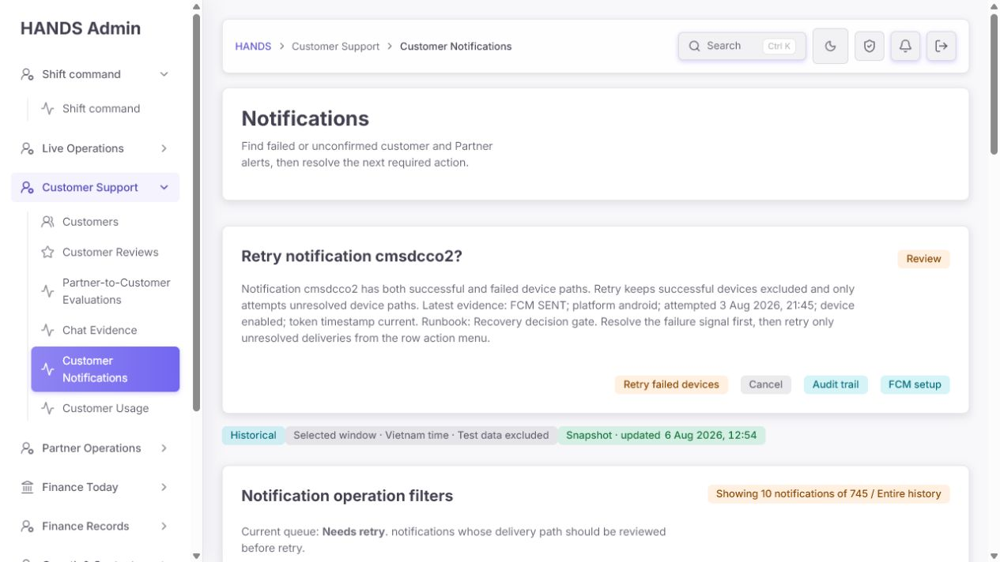

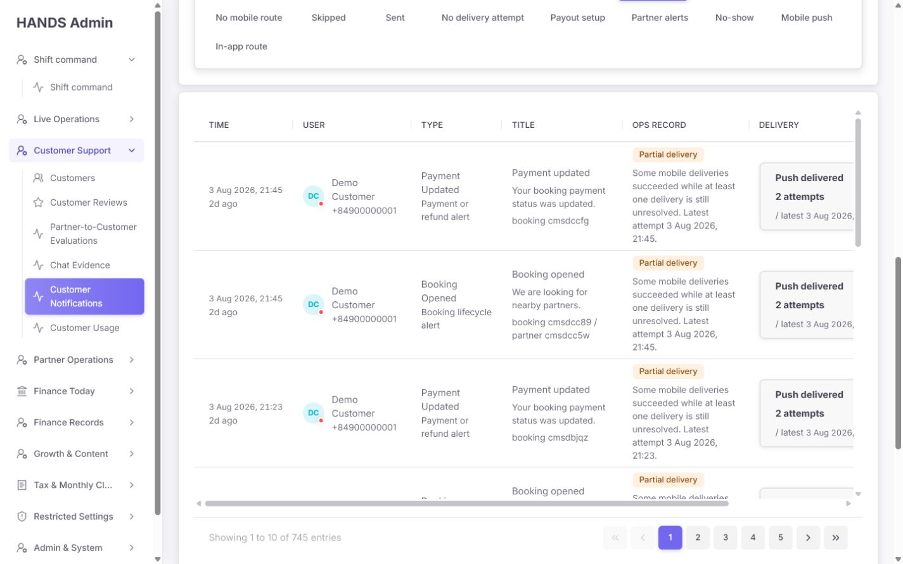

현재 강점:

- confirmation step이 있다.
- partial일 때 `Retry failed devices`라고 표시하고 성공 device는 제외한다고 설명한다.
- BullMQ job은 notificationId로 deduplication한다.
- processor는 이미 `SENT`가 기록된 device를 retry 대상에서 제외한다.
- retry 결과와 latest delivery를 audit metadata에 기록한다.

현재 위험:

- row의 aggregate signal은 `Partial delivery`인데 Delivery disclosure는 가장 최신 한 건이 SENT이면 초록색 `Push delivered`를 표시한다.
- confirmation은 “successful and failed device paths”라고 말하지만 실패한 device 수, platform, failure code, last attempted time을 보여주지 않는다.
- `Latest evidence: FCM SENT`는 재시도 대상이 무엇인지 오히려 모호하게 만든다.
- `NotificationsService.retry()`는 latest delivery 한 건만 audit summary에 넣어 partial path를 보존하지 않는다.
- API endpoint는 현재 notification이 retry eligible한지, unresolved path가 남았는지, operator reason이 있는지 server-side에서 검증하지 않는다.
- `retryNotification` action은 `adminPost(..., null)` fallback을 사용하므로 실패 notice가 없다.
- read와 retry write가 모두 `NOTIFICATIONS_DELIVERY` category 하나에 속한다.

권장:

- confirmation 상단에 notification title, recipient, booking/context, `1 successful / 1 failed`를 표시한다.
- unresolved path만 표로 보여준다: platform, masked device id, failure code, attempted time, recovery hint.
- `SENT` path는 `Accepted by FCM` 또는 `Sent to push provider`로 표시하고 `Delivered`라는 단어를 쓰지 않는다.
- partial/skipped/no-evidence retry에는 12자 이상의 operator reason을 요구하고 audit에 저장한다.
- API write boundary가 retry eligibility와 unresolved path를 다시 확인하고 state change면 409를 반환한다.
- Web action은 기존 `adminPostOrThrow`와 notice 패턴을 재사용해 success/failure를 분명히 표시한다.
- `NOTIFICATIONS_DELIVERY` read와 retry write를 분리할 수 없다면 최소한 developer/system 또는 명시적 retry capability를 가진 operator만 action을 렌더링하고 API도 동일하게 막는다.

### Step 8 — Current incidents / Historical cleanup: lifecycle이 없는 시간 bucket

**상태: 구조 수정 필요**

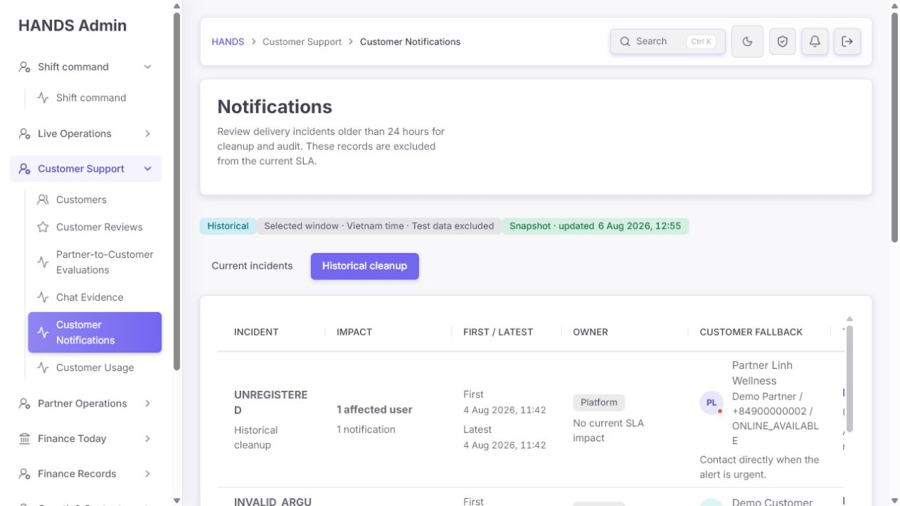

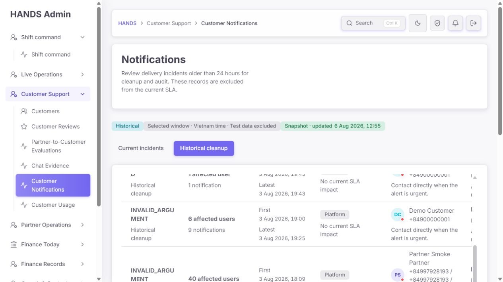

실제 구현:

- latest failed device path를 provider + failureCode + 고정 시간 bucket으로 group한다.
- 최근 24시간이면 current, 그 이전이면 historical이다.
- representative notification 한 건을 group action에 사용한다.
- owner는 기본 `Platform`, historical helper는 `No current SLA impact`다.

문제:

- persistent incident ID, acknowledgement, assignment, resolvedAt이 없다. 따라서 실제 incident lifecycle이 아니라 계산된 failure group이다.
- 시간 bucket 경계에 걸친 하나의 연속 장애가 두 group으로 갈라질 수 있다.
- 과거 group에는 cleanup/resolve/assign action이 없고 representative notification의 audit/retry만 있다.
- 여러 affected user group에 대표 사용자 한 명의 연락 정보를 `Customer fallback`으로 보여주는 것은 group 의미와 맞지 않는다.
- 24시간이 지나면 `No current SLA impact`라고 자동 표시하는 근거가 없다.

권장 최소안:

- 새 incident 테이블을 만들지 않는다.
- 이름을 `Open failure groups`로 바꾸고 latest unresolved paths를 전 기간에서 group한다.
- 열은 `Cause / Affected / First–latest / Age / Technical next step / Open affected records`로 단순화한다.
- owner를 실제 assign할 수 없다면 `Platform` badge를 owner처럼 보이지 않게 하고 `Technical owner: Platform`이라는 설명으로 표시한다.
- representative user 전화번호는 제거하고 affected record drill-down을 제공한다.
- 실제 acknowledge/assign/resolve가 반드시 필요하다고 운영 정책이 확정될 때만 별도 incident lifecycle을 추가한다.

### Step 9 — System incidents와 Finance queue: source 업무를 복제함

**상태: 삭제·이관 권장**

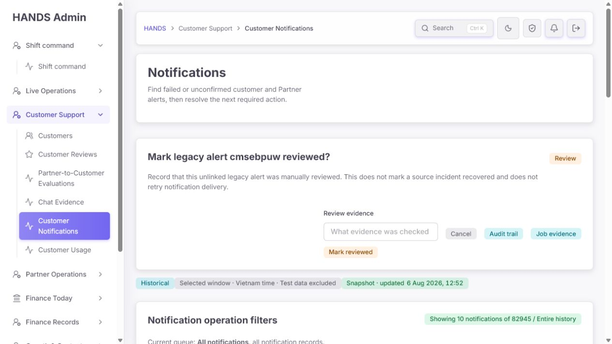

System incident row의 문구 자체가 원인을 설명한다.

> Open Background Jobs and review the source failure.

현재 페이지는 background job source를 다시 notification recipient alert group으로 묶는다. 4 Admin recipient alerts를 하나로 group하는 개선은 있지만, source failure는 이미 `/background-jobs`에 있고 이 페이지 action도 다시 그곳으로 보낸다.

Finance overdue/history도 notification이 원인이 아니라 Bank Reconciliation record의 SLA state가 원인이다. 같은 owner assignment workflow를 이 페이지에서 다시 보여주기 때문에 source 화면과 두 번째 queue가 생긴다.

권장:

- `/notifications`에서 `System incidents`, incident state filter, legacy cleanup을 제거한다.
- `/background-jobs`가 open/recovered/legacy evidence의 단일 source of truth가 되게 한다.
- notification audit에는 system alert 발송 증거만 남긴다.
- Finance overdue/history는 Bank Reconciliation에서만 운영하고 Notification Delivery에는 `Related source` link만 둔다.
- legacy alert review를 당장 제거할 수 없으면 migration/cleanup 기간에만 developer-only link로 유지하고 완료 후 삭제한다.

### Step 10 — 범위 밖 pagination: URL·query·UI가 서로 모순됨

**상태: P0 결과 신뢰 실패**

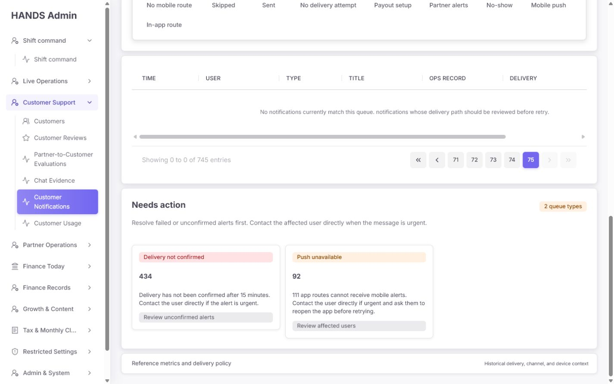

동시에 표시되는 내용:

- URL query: `page=9999`
- total: 745 notifications
- selected pagination: 75
- rows: 0
- footer: `Showing 0 to 0 of 745 entries`
- empty state: 현재 queue가 비었다는 문구

코드 원인:

- `buildNotificationApiHref`가 summary total을 알기 전에 requested page로 `skip=(page-1)*10`을 만든다.
- `paginateServerNotificationRows`는 page 숫자만 last page로 clamp하지만 이미 잘못된 skip으로 받아온 rows를 다시 요청하지 않는다.

권장 최소 수정:

- list와 summary를 받은 뒤 `total > 0 && requestedPage > totalPages`면 모든 filter를 보존한 last-page URL로 redirect한다.
- `page < 1`은 page 1로 canonicalize한다.
- 0건이면 pagination footer를 숨기고 “0 to 0”을 표시하지 않는다.
- 이 패턴은 Chat Evidence에서도 동일하게 발견됐으므로 shared root cause를 한 번 수정할 수 있는지 caller를 먼저 확인한다.

### Step 11 — 반응형과 scroll: 큰 표를 숨긴 것이지 적응시킨 것이 아님

**상태: 실패**

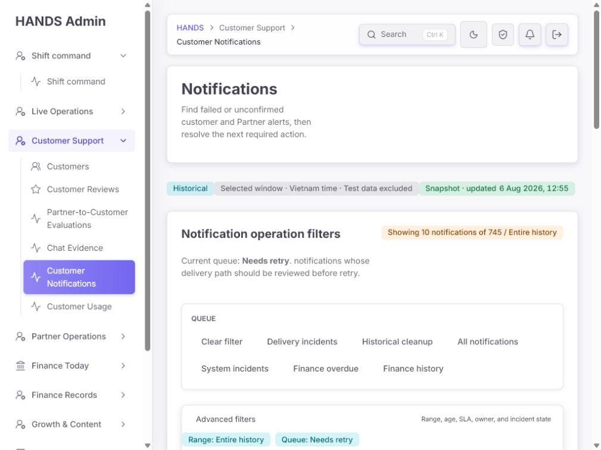

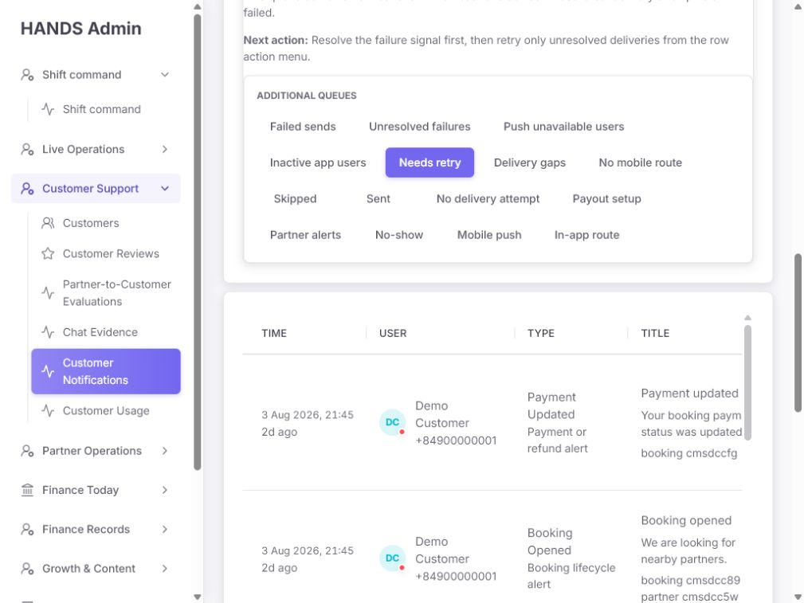

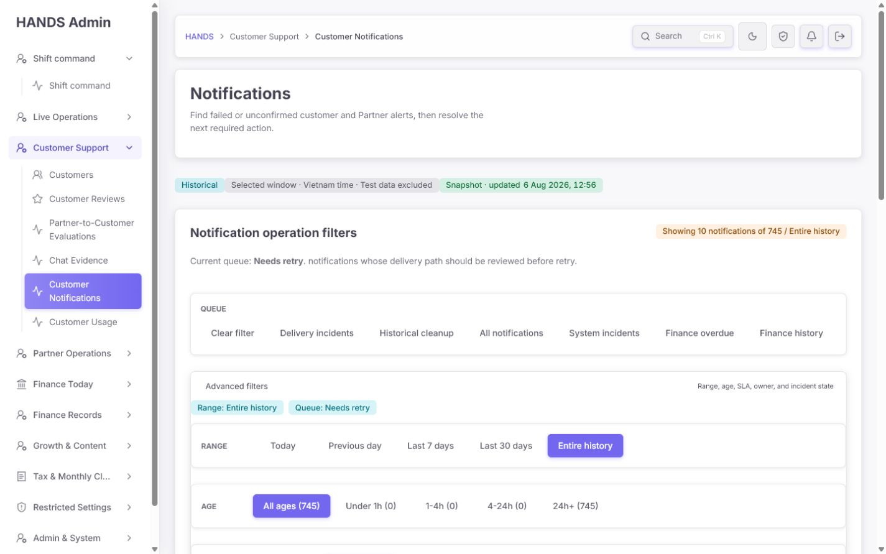

확인 결과:

- CSS가 notification table에 `min-width: 1280px`를 강제한다.
- 7개 열 최소 폭의 합과 긴 설명 때문에 1440px에서도 Action이 가려진다.
- table shell과 inner table scroll 모두 overflow를 가지며, inner table에는 `max-height`와 `overflow:auto`가 있다.
- 1024px에서는 필터가 viewport 대부분을 차지하고 레코드 영역은 Time/User/Type/Title 일부만 보인다.

접근성 강점:

- table header와 semantic table을 사용한다.
- scroll region에 `role=region`, aria-label, `tabIndex=0`이 있어 키보드로 focus할 수 있다.
- status badge만으로 의미를 전달하지 않고 텍스트 label도 있다.

접근성/사용성 문제:

- focus 가능한 scroll region이 있어도 핵심 action이 화면 밖이라는 사실을 사용자가 즉시 알기 어렵다.
- 동일 행의 경고와 초록 성공 표시가 충돌해 색을 제외해도 의미가 모순된다.
- action menu의 generic label은 shortId만 포함해 screen reader가 어느 사용자/알림인지 구분하기 어렵다.
- 200% zoom, keyboard-only 전체 retry flow, screen reader 실제 낭독은 이번 감사에서 실행하지 않았다.

권장:

- desktop table을 5열로 줄이고 Action을 첫 화면에 둔다.
- 1024px 이하 stacked layout에서는 상태와 action을 row header 바로 아래 배치한다.
- action accessible name에 recipient + title + created time을 포함한다.
- 내부 세로 scroll을 제거하고 페이지 scroll 하나만 남긴다.
- 200% zoom에서 horizontal page scroll 없이 모든 action에 도달하는 것을 acceptance test로 둔다.

### Step 12 — 문구와 운영 용어: provider 기술 상태와 운영 결과를 구분해야 함

**상태: 전면 정리 필요**

현재 문구 중 특히 위험한 것:

| 현재 | 문제 | 권장 |
|---|---|---|
| `Customer Notifications` | Partner/Admin/Finance 포함 | `Notification Delivery` |
| `Notifications` | 기록·템플릿·campaign과 구분 안 됨 | `Notification Delivery` |
| `Push delivered` | FCM SENT를 단말 수신으로 오해 | `Accepted by FCM` 또는 `Sent to push provider` |
| `Delivery not confirmed` | 실제 조건은 send attempt 0 | `No send attempt after 15m` |
| `Push unavailable users` | disabled device 하나만 있어도 포함 | `No active push route` — predicate 수정 후 사용 |
| `Inactive app users` | session activity와 혼동 | `App route needs refresh` |
| `Needs retry` | Failed sends와 중복 | `Failed` 하나로 통합 |
| `Historical cleanup` | cleanup action/lifecycle 없음 | 제거; 필요하면 `Older open failures` age filter |
| `No current SLA impact` | 24h 경과만으로 단정 | 제거 |
| `ONLINE_AVAILABLE` | raw enum | `Online and available` |
| `App offline` | system recipient/device signal과 혼동 | 목록에서 제거 또는 `No active app session evidence`처럼 근거 명시 |
| `Test data excluded` | 실제 fixture 노출 | 경계 보장 전 표시 금지 |

## 4. 코드·API root cause 매트릭스

| 문제 | 코드 근거 | root fix |
|---|---|---|
| 21 queue 과부하 | `notification-page-model.ts`의 `notificationFilterLinks`; `notification-filter-board-section.tsx`의 primary/additional split | 상태·channel·type을 분리하고 중복/mixed-domain link 삭제 |
| test data 노출 | `admin-notification-production-data.ts`가 id/userId/bookingId prefix와 explicit JSON flag만 검사 | fixture 생성 시 provenance 의무화, 기존 fixture backfill/정리, 이름 휴리스틱 금지 |
| 거짓 data status | `notificationSummary()`가 `dataClass: 'live'`; page가 이를 `Test data excluded`로 표시 | 실제 predicate 검증 결과를 별도 status로 반환하거나 label 제거 |
| disabled queue에 delivered 포함 | API `disabled-device`가 `pushDevices.some(enabled:false)`; Web `hasDisabledPushDevice`도 any disabled | target role 기준 enabled route 0 predicate로 교체 |
| Failed/Needs retry 중복 | `notificationBoardDeliveryDisposition()`이 둘 다 `failed` 반환 | alias 하나 삭제 |
| SENT를 delivered로 표현 | `notificationDeliveryDisposition()`이 SENT를 successful로 분류; cell copy가 `Push delivered` | internal success grouping은 유지 가능하나 user-facing label은 provider acceptance로 수정 |
| partial evidence 충돌 | row signal은 per-path disposition, cell은 최신 delivery 한 건을 headline으로 사용 | aggregate headline + unresolved paths first |
| retry audit 불완전 | `NotificationsService.retry()`가 latest delivery 1건만 summary | retry 대상 path snapshot과 operator reason을 server audit에 기록 |
| retry 실패 숨김 | `actions.ts`가 `adminPost(..., null)` 후 redirect | 기존 `adminPostOrThrow` + 명시적 notice 재사용 |
| out-of-range page | API href가 requested page skip 계산, footer만 clamp | total 후 canonical redirect |
| 핵심 action 숨김 | `globals.css` notification table `min-width:1280px`, nested `overflow:auto` | 5열/stacked layout, inner vertical scroll 제거 |
| read/write 경계 없음 | Web/API 모두 `NOTIFICATIONS_DELIVERY` category | retry capability를 분리하거나 server-side role gate 명시 |
| 유지보수 위험 | `notification-page-model.ts` 2,647줄에 filter, metrics, table, incident, finance, FCM smoke가 공존 | 먼저 mixed-domain 기능을 삭제; 그 후 남은 코드만 최소 단위로 분리 |

`notification-page-model.ts`를 먼저 기계적으로 여러 파일로 쪼개는 것은 해결책이 아니다. 불필요한 queue와 Finance/System branch를 삭제하면 코드도 자연스럽게 줄어든다. 동작을 정리한 뒤 남은 delivery model만 분리하는 편이 안전하다.

## 5. 권장 목표 화면 구성

### 5.1 내비게이션

- Customer Support의 `Customer Notifications`를 `Notification Delivery`로 변경한다.
- page가 실제로 Customer/Partner 운영 양쪽에서 사용된다면 `Live Operations` 또는 `Admin & System` 내 전송 운영 위치가 더 자연스럽다.
- `/notifications/templates`와 `/notifications/push-send`는 기존 별도 권한·경로를 유지한다. 이 페이지에 template/campaign CTA를 추가하지 않는다.

### 5.2 첫 화면

1. H1 `Notification Delivery`
2. 설명 `Review unresolved mobile send issues and inspect delivery records.`
3. compact status line `Production boundary / Last refreshed / Vietnam time`
4. mode: `Needs action | Delivery records`
5. Needs action status chips 최대 4개
6. compact 5열 결과

현재의 큰 filter card title, 중복 current/history control, 21개 queue button, records 아래 재노출되는 요약 보드는 제거한다.

### 5.3 Needs action 결과

기본 정렬은 `oldest unresolved first`다.

| 열 | 내용 |
|---|---|
| Issue | Failed / No send attempt / No active route / Route refresh needed |
| Recipient | 이름, role, masked phone |
| Notification | title, body excerpt, booking/context |
| Evidence | unresolved path count, provider code, last attempt, age |
| Next action | Fix route / Check worker / Contact / Retry |

### 5.4 Delivery records

- Search: notification ID, booking ID/reference, recipient
- Recipient role: All / Customer / Partner / Admin
- Channel: All / FCM / In-app
- Send status: All / Accepted / Failed / Skipped / Not attempted
- Date: Today / 7d / 30d / All / Custom
- Sort: Newest / Oldest

Type filter가 반드시 필요하면 searchable select 하나를 사용한다. `Partner alerts`, `No-show`, `Payout setup`을 각각 top-level queue로 만들지 않는다.

### 5.5 Action confirmation

확인 화면의 최소 정보:

- notification title + short ID
- recipient + role
- booking/source link
- unresolved path summary
- retry로 제외되는 successful path 수
- operator reason
- Audit trail
- `Retry unresolved paths` / `Cancel`

성공 후 `Retry queued`와 job ID를 status notice로 표시한다. 실패하면 원인에 맞게 `Permission denied`, `State changed`, `No eligible path`, `Queue unavailable`을 구분한다.

## 6. 우선순위별 수정 요건

### P0 — 운영 신뢰와 작업 안전

1. fixture provenance를 모든 notification 생성 경로에서 의무화하고 기존 local fixture를 정리한다.
2. 실제 필터 경계를 보장할 때만 `Test data excluded`를 표시한다.
3. `disabled-device`를 `target role에 맞는 enabled route가 0개`인 상태로 다시 정의하고 list/summary를 같은 predicate로 맞춘다.
4. `Failed sends`와 `Needs retry` 중 하나를 제거한다.
5. `SENT`의 화면 문구를 `Accepted by FCM/Sent to provider`로 바꾼다.
6. partial row와 confirmation에서 unresolved path를 우선 표시한다.
7. retry endpoint가 state/eligibility를 server-side 재검증하고 필요한 operator reason을 audit에 남긴다.
8. retry/review server action을 result-aware write로 바꾸고 성공·실패 notice를 제공한다.
9. read와 retry 권한 경계를 Web/API/navigation에서 일치시킨다.
10. 범위 밖 page를 canonical redirect하고 0-to-0 모순을 제거한다.
11. 목록의 전화번호를 mask하고 full value는 권한이 있는 detail/contact action에서만 연다.

### P1 — 운영자 판단 속도

1. H1/nav/breadcrumb를 `Notification Delivery`로 통일한다.
2. `Needs action | Delivery records` 두 mode로 단순화한다.
3. System/Finance queue를 source 화면으로 이관한다.
4. 7열을 5열로 줄이고 상태와 action을 첫 viewport에 둔다.
5. table 내부 세로 scroll을 제거한다.
6. delivery gap 문구를 `send not attempted`로 정확히 바꾼다.
7. raw enum과 근거 없는 app presence 표현을 operator copy로 변환한다.
8. 각 수치에 단위를 붙이고 card/header/row 모집단을 일치시킨다.
9. empty/error/partial load/state changed 상태를 구분한다.

### P2 — 안정화와 유지보수

1. 동작을 단순화한 뒤 남은 notification page model에서 Finance/System/FCM smoke branch를 제거한다.
2. SQL/Web disposition parity test를 추가한다.
3. 1024, 1280, 1440, 200% zoom visual regression을 추가한다.
4. keyboard-only filter → action menu → confirmation → cancel flow를 테스트한다.
5. retry audit에 queued job, unresolved target paths, reason, outcome을 검증하는 contract test를 둔다.
6. summary query budget을 측정하고 필요한 경우에만 한 번의 grouped aggregate로 합친다. 측정 전 새 cache나 범용 query framework는 추가하지 않는다.

## 7. 검증 기준

### 데이터·필터

- default 결과에 explicit fixture notification이 0건이다.
- `Production only` label을 표시할 때 list/summary/failure/device query가 동일한 predicate를 사용한다.
- `No active push route`의 모든 row는 target role enabled device가 0개다.
- enabled route가 하나라도 있는 delivered notification은 해당 queue에 나타나지 않는다.
- `Failed`와 `Needs retry` 중복 URL/label이 남지 않는다.
- 모든 count는 `notifications`, `users`, `routes`, `failure groups` 중 단위를 명시한다.

### 전송 의미

- DB status `SENT`는 화면에 `Delivered`로 번역되지 않는다.
- partial notification은 headline에서 성공보다 unresolved path를 먼저 보여준다.
- delivery gap row는 `No send attempt after 15m`라고 표시한다.
- system/background job source 상태는 Notification Delivery에서 별도 사고처럼 복제되지 않는다.

### 재시도

- read-only operator는 retry control과 endpoint를 모두 사용할 수 없다.
- 성공 device/path는 재시도에서 제외된다.
- confirmation과 server가 같은 unresolved target 수를 사용한다.
- state가 confirmation 이후 변경되면 409와 `State changed` notice가 나온다.
- API 실패 또는 permission denial은 성공처럼 redirect되지 않는다.
- retry audit에 actor, reason, notification, unresolved paths, queued job ID가 남는다.

### pagination·오류

- `page=9999`는 last valid page URL로 canonicalize되고 실제 last page rows를 보여준다.
- URL page, selected page, rows, total, `Showing x–y`가 일치한다.
- list 실패, summary 실패, no data, no match, no action이 서로 다른 상태로 표시된다.

### 반응형·접근성

- 1024px에서 issue, recipient, status, action을 가로 스크롤 없이 확인한다.
- 1440px에서 모든 기본 열과 action이 첫 화면에 보인다.
- 200% zoom에서 page-level horizontal scroll이 생기지 않는다.
- 모든 action accessible name이 notification shortId만이 아니라 recipient/title context를 포함한다.
- keyboard로 scroll region, filter, action menu, confirmation, cancel에 도달할 수 있고 focus가 보인다.

## 8. 유지할 것과 만들지 말 것

유지:

- list/summary의 `adminGetResult`와 명시적 read error state
- semantic table/headers와 focus 가능한 scroll region
- retry confirmation 단계
- BullMQ notificationId deduplication
- 이미 SENT인 device를 processor가 제외하는 방어
- Audit trail과 device/job evidence link
- legacy review의 required reason과 transaction/audit 기록 — migration 기간 동안만

이번 개선에서 만들지 말 것:

- 새 notification incident management 플랫폼
- 새 dashboard/chart 묶음
- 새 UI/상태관리 library
- 별도 generic filter framework
- 이름 기반 test-data 필터
- source of truth가 이미 있는 Finance/Background Job 복제 queue
- page size selector, bulk retry, bulk contact

대량 bulk retry는 개별 retry의 안전·권한·감사 계약이 검증된 뒤 실제 운영량이 요구할 때만 고려한다.

## 9. 감사 한계

- 로컬 로그인 세션의 2026-08-06 snapshot을 사용했다.
- 실제 notification send/retry, legacy review 저장, Finance assignment는 실행하지 않았다.
- 1024×768, 1280×720, 1440×900에서 확인했다.
- 200% zoom, 실제 screen reader, mobile viewport, 네트워크 강제 실패, 여러 operator의 동시 retry race는 실행하지 않았다.
- FCM `SENT` 이후 단말 receipt/앱 open telemetry는 현재 schema와 화면에서 확인되지 않았다. 따라서 본 보고서는 `SENT`를 단말 수신으로 해석하지 않는다.

## 10. 캡처 목록

1. `01-default-incidents.png` — 기본 current incident
2. `02-all-history-overview.png` — 전체 82,945건
3. `03-advanced-filter-overload.png` — 21 queue와 advanced filter
4. `04-all-history-table-left.png` — test/audit 인물·전화번호·왼쪽 열
5. `05-all-history-table-actions.png` — 가로 스크롤 뒤 Delivery/Action
6. `06-legacy-review-confirmation.png` — legacy review 확인
7. `07-delivery-gap-overview.png` — delivery gap 요약
8. `08-delivery-gap-rows.png` — delivery gap row
9. `09-push-unavailable-overview.png` — push unavailable 요약
10. `10-push-unavailable-mixed-delivery.png` — delivered row 혼입
11. `11-retry-confirmation.png` — partial retry 확인
12. `12-historical-incidents-overview.png` — historical cleanup
13. `13-historical-incident-table.png` — failure group table
14. `14-needs-retry-1024-overview.png` — 1024px 상단
15. `15-needs-retry-1024-table.png` — 1024px 표
16. `16-needs-retry-1440-overview.png` — 1440px 상단
17. `17-needs-retry-1440-table.png` — 1440px partial row
18. `18-out-of-range-page.png` — page 9999 모순
