# Notification Delivery 재개선 심층 감사 보고서

- 감사 일시: 2026-08-07 (Asia/Bangkok)
- 대상: `http://localhost:3101/notifications`
- 검사 화면: 1440×900, 1600×900 데스크톱만 포함
- 제외: 1024px 이하, 모바일/태블릿, 200% 확대
- 방식: 로그인된 실제 화면, 현재 소스, Admin API 쿼리, 권한 가드, 자동화 테스트를 교차 검증
- 데이터 안전: 실제 발송, 재시도 제출, 상태 변경, 감사 로그 생성은 수행하지 않음

## 1. 결론

이전 감사의 구조 개편은 실제 실행 화면에 반영됐다. `Notification Delivery`라는 목적 중심 제목, `Needs action / Delivery records`의 업무 분리, 네 개의 표준 이슈 큐, 서버 페이지네이션, 재시도 확인창, 전화번호 마스킹, 기존 URL 리다이렉트는 잘 구현됐다.

그러나 현재 상태를 “운영 완료”로 판정하기는 어렵다. 가장 큰 이유는 다음 세 가지다.

1. **조치 큐의 단위가 운영자의 해결 단위와 다르다.** `No active push route`가 사용자/기기 문제가 아니라 과거 알림 75,160건으로 누적되어 있고 기본 정렬도 가장 오래된 순서다. 오늘 긴급한 알림을 찾기 어렵다.
2. **실패 그룹이 진단까지만 되고 정확한 해결 동선으로 이어지지 않는다.** 모든 그룹의 `Open affected records`가 동일한 전체 실패 목록으로 이동하고, 자격증명 누락·Firebase 프로젝트 불일치까지 “앱을 다시 열게 하라”는 동일 안내를 노출한다.
3. **지원 대상인 1440px에서 핵심 레이아웃이 깨진다.** 기록 필터의 `Apply filters / Reset`이 글자 단위로 세로 분해되고, 실패 그룹 표의 원인 코드와 우측 CTA가 잘린다.

종합 판정은 **조건부 통과, 73/100**이다. P0 차단 문제는 없지만 P1 운영 위험 6건을 먼저 해결해야 한다.

| 평가 축 | 점수 | 판단 |
|---|---:|---|
| 업무 목적과 용어 | 15/20 | 두 모드와 네 큐는 명확하나 기본 그룹 선택 상태가 불명확하다. |
| 정보 구조와 우선순위 | 12/20 | 75,160건의 과거 알림이 현재 조치 큐를 압도한다. |
| 가독성과 시각적 안정성 | 12/20 | 1600px은 안정적이지만 1440px 필터와 그룹 표가 깨진다. |
| 상호작용과 운영 안전 | 17/20 | 재시도 확인은 우수하나 큐 적재와 감사 기록의 순서가 안전하지 않다. |
| 접근성·복원력·데이터 신뢰 | 17/20 | 의미 구조, 빈 상태, 오류 상태, 권한은 좋지만 이름 없는 사용자의 전화번호 노출 가능성과 데이터 경계 불명확성이 남는다. |

## 2. 현재 화면 증거

### 2.1 기본 Needs action — 1440px

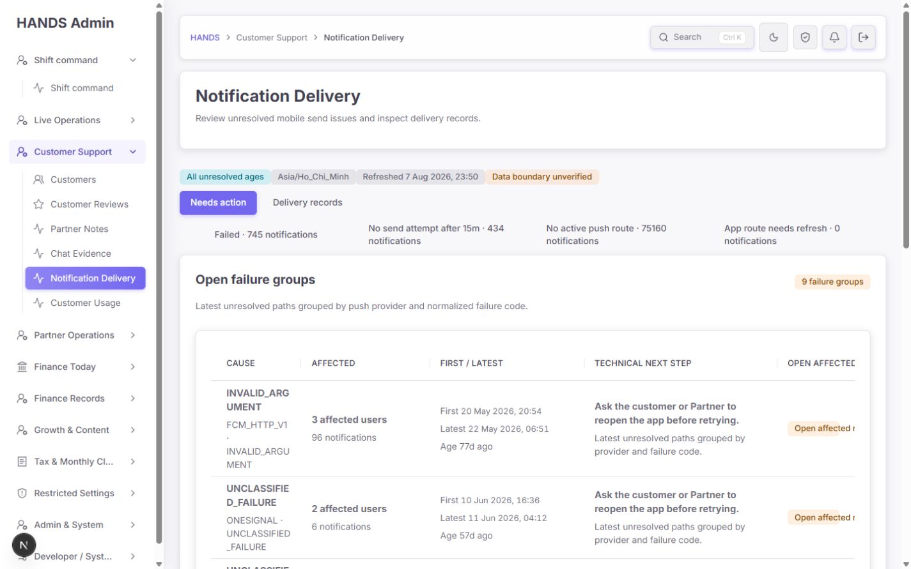

- `Needs action`과 `Delivery records`의 분리는 이전보다 직관적이다.
- `Refreshed`, Vietnam 시간대, 전체 미해결 범위가 한 줄에 표시된다.
- 네 이슈 중 기본 화면은 `Open failure groups`인데 선택기에는 이 항목이 없어 활성 상태가 비어 보인다.
- 우측 열과 긴 실패 코드가 1440px에서 잘리거나 단어 중간에 강제로 개행된다.

### 2.2 실패 큐와 행 메뉴 — 1440px

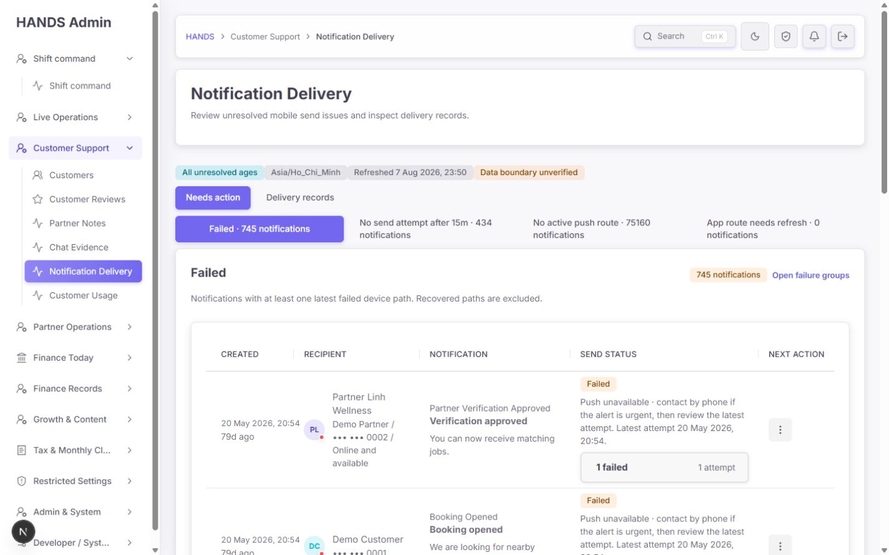

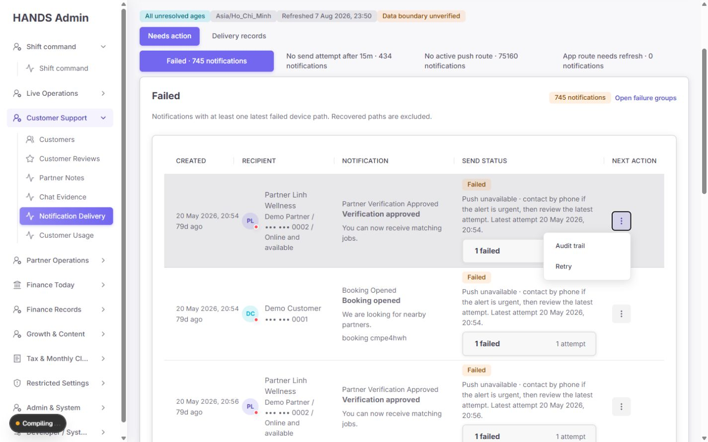

- 각 행에 생성 시각, 수신자, 알림 의미, 전송 상태, 동작이 존재한다.
- 전화번호 본문은 마지막 네 자리만 보인다.
- 주 동작 `Retry`가 모든 행에서 세로 점 메뉴 안에 숨겨져 있어 반복 처리 속도가 느리다.
- 오래된 알림의 수신자 영역에 `App offline`과 현재 파트너 상태 `Online and available`가 함께 표시되지만 기준 시점과 의미가 구분되지 않는다.

### 2.3 재시도 확인창 — 1440px

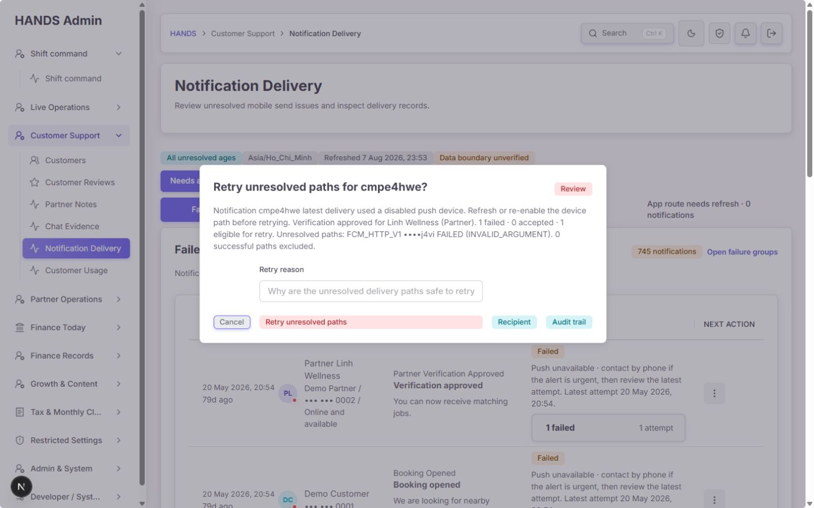

이 부분은 잘 개선됐다.

- 성공 경로는 제외되고 미해결 경로만 재시도한다는 설명이 있다.
- 대상 경로, 실패 코드, 성공/실패/재시도 가능 개수가 보인다.
- 사유 입력은 필수이며 `minLength=12`, `maxLength=500`이 화면과 서버에 모두 적용된다.
- 수신자와 감사 기록을 확인할 수 있다.
- 확인 버튼을 누르지 않고 취소했으며 실제 발송은 없었다.

### 2.4 조치 큐 — 1440px

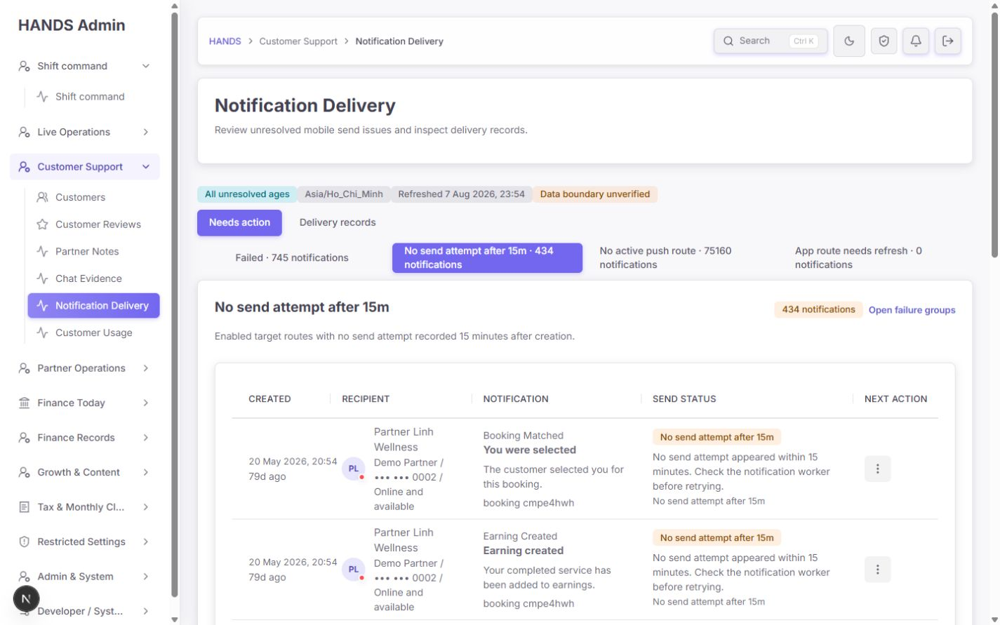

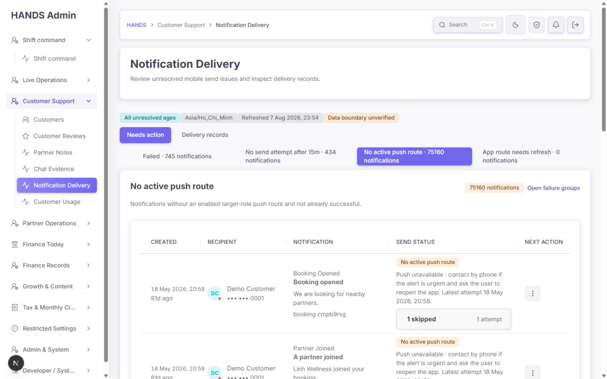

- `No send attempt after 15m`은 원인과 확인 대상이 비교적 명확하다.
- 다만 첫 화면이 79일 전 기록으로 채워져 있어 “15분 초과”라는 실시간 운영 의미가 약해진다.
- `No active push route`는 75,160건이며 첫 화면은 81일 전 기록이다. 현재 사용자별 해결 작업이 아니라 과거 알림별 반복 목록이다.
- 천 단위 구분자가 없어 `75160`을 빠르게 읽기 어렵다.

### 2.5 빈 상태 — 1440px

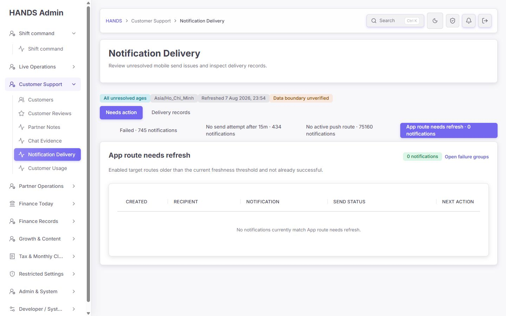

- 0건 상태를 0으로 명확히 표시한다.
- 오류를 빈 큐로 위장하지 않는 별도 오류 상태도 소스에 구현돼 있다.
- 빈 표의 구조와 메시지는 합격이다.

### 2.6 Delivery records 필터 — 1440px / 1600px

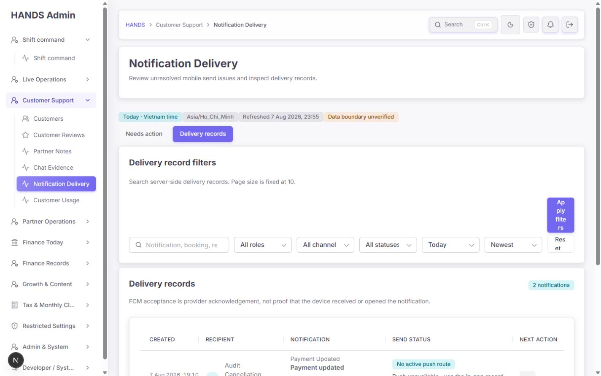

1440px에서는 `Apply filters`와 `Reset` 열이 지나치게 좁아져 글자가 세로로 분해된다. 운영 환경의 최소 지원 폭에서 핵심 조작이 정상적으로 읽히지 않는다.

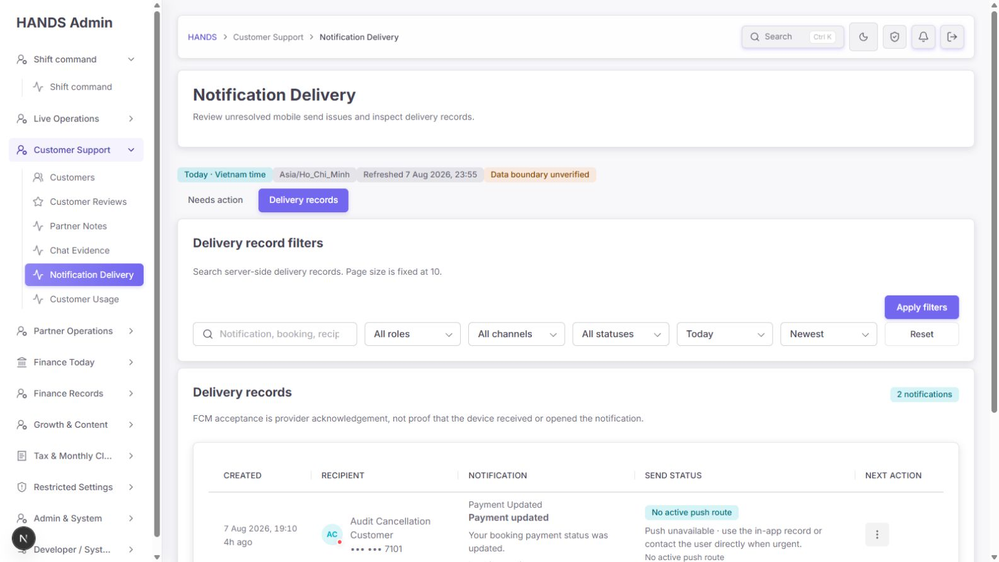

1600px에서는 필터가 한 줄에 정렬되고 버튼도 정상 표시된다. 문제는 반응형 모바일이 아니라 **고정 사이드바를 제외한 실제 콘텐츠 폭을 CSS가 고려하지 않는 것**이다.

### 2.7 실패 그룹 — 1600px

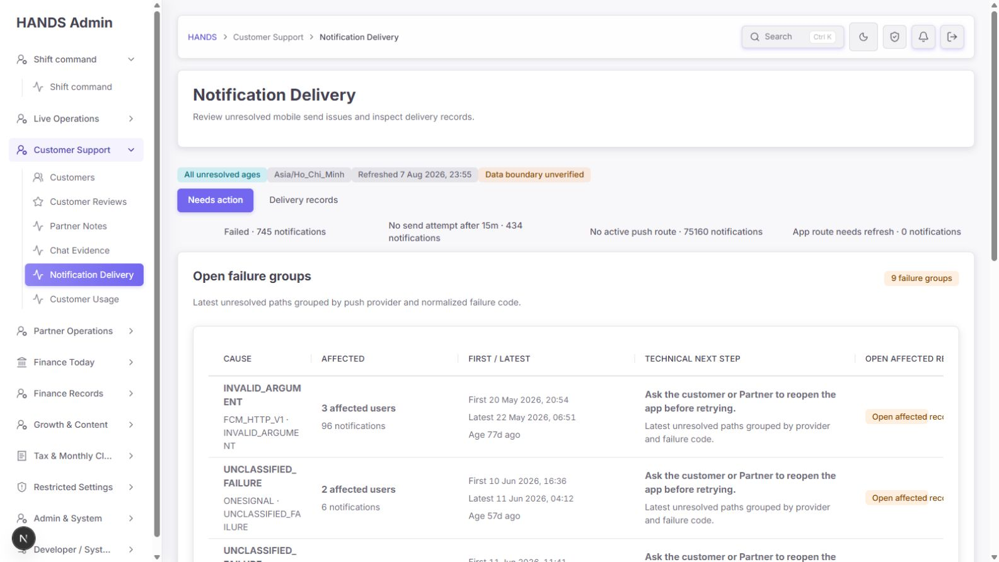

- 1600px에서도 원인 코드가 `INVALID_ARGUM / ENT`처럼 중간 분리된다.
- `Open affected records` 헤더와 버튼 문구가 잘린다.
- 표의 9개 그룹 모두 같은 안내와 같은 링크를 사용한다.

### 2.8 다크 모드 — 1600px

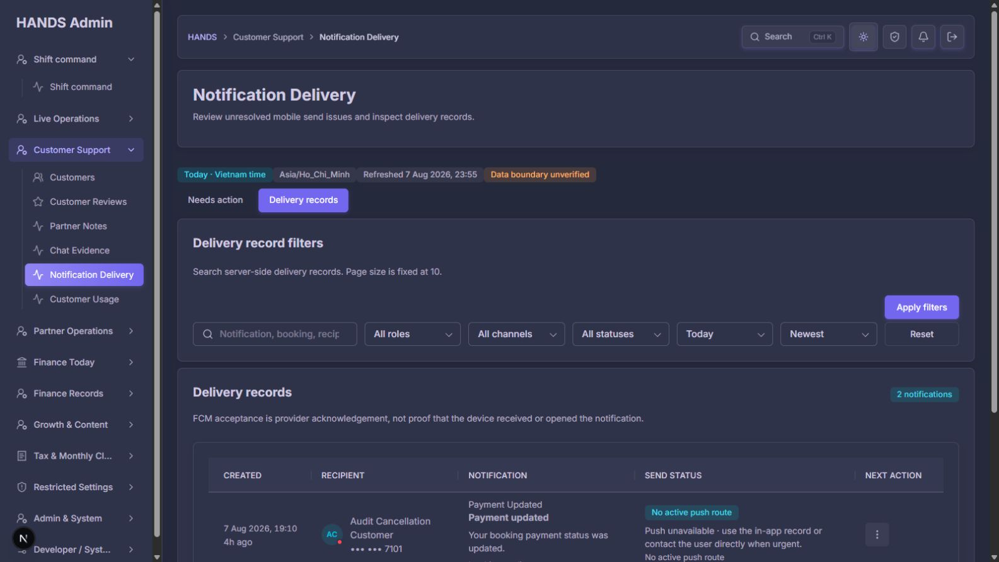

- 표면, 입력, 배지, 본문 대비는 실사용 가능한 수준이다.
- 다크 모드 자체에서 새로 발견된 차단 문제는 없다.

## 3. 이전 보고서 대비 구현 상태

| 이전 요구 | 현재 상태 | 판정 |
|---|---|---|
| 실행 화면을 새 Notification Delivery 구조로 교체 | H1, 두 모드, 네 이슈 큐가 실제 3101 화면에 반영됨 | 완료 |
| 조치 큐와 기록 조회 분리 | `Needs action / Delivery records`로 분리 | 완료 |
| 서버 측 필터·페이지네이션 | 고정 10행, 전체 건수, 이전/다음/마지막 페이지 제공 | 완료 |
| 오류를 0건으로 표시하지 않기 | summary/records 오류 상태가 별도 구현됨 | 완료 |
| 재시도 전 확인·사유·감사 증거 | 확인창, 필수 사유, 수신자/감사 링크, 성공 경로 제외 | 완료 |
| 화면 전화번호 마스킹 | 본문 전화번호는 마지막 네 자리만 표시 | 부분 완료 — 접근성 라벨 fallback은 미완료 |
| 권한 없는 운영자에게 재시도 숨김 | Web `NOTIFICATIONS_RETRY`, API guard가 모두 존재 | 완료 |
| 기존 알림 URL 호환 | System → Background Jobs, Finance → Bank reconciliation, legacy delivery → 새 큐로 이동 | 완료 |
| 실패 그룹의 정확한 상세 링크 | 모든 그룹이 `/notifications?issue=failed`로 이동 | 미완료 |
| 실패 코드별 해결 안내 | 9개 그룹 모두 같은 “앱 다시 열기” 안내 | 미완료 |
| 큐 적재와 감사 기록의 일관성 | 큐 적재 후 감사 기록을 씀 | 미완료 |
| 수동 새로고침과 마지막 갱신 신뢰 | 시각만 있고 현재 필터를 보존하는 Refresh 없음 | 미완료 |
| 데이터 경계의 명확한 보증 | 항상 `Data boundary unverified` 표시 | 미완료 |

## 4. 우선순위별 수정 요건

### P0

없음. 모든 주요 화면과 조회 동선은 열리고, 재시도에는 확인 단계가 있다.

### P1-1. `No active push route`와 `No send attempt`를 “알림 레코드”가 아닌 “운영 해결 단위”로 재설계

**증거**

- 화면: `No active push route · 75160 notifications`, 기본 행 81일 전.
- `notification-page-model.ts:773-789`: action 모드는 기본 `range=all`, `sort=oldest`.
- `admin-notification-unattempted-query.ts:161-165`: 현재 활성 target-role device가 없고 성공 완료가 아니면 no-route로 판정.
- `admin-notification-unattempted-query.ts:221-229`: no-route는 delivery 존재 여부와 무관하게 전체 Notification을 후보로 가져옴.

**운영 문제**

푸시 경로 복구는 보통 사용자/기기 단위 작업이다. 현재는 한 사용자의 과거 알림이 수십·수백 행으로 반복될 수 있다. 동일 사용자에게 전화를 한 번 하거나 앱 재접속을 요청하면 해결되는 문제를 알림마다 검토하게 된다. 또 가장 오래된 기록부터 보여 오늘 예약·결제 관련 실패가 뒤로 밀린다.

**수정 요건**

1. Needs action의 no-route 목록을 **사용자 또는 target-role push route 단위로 그룹화**한다.
2. 한 행에 `영향 사용자`, `현재 활성 경로`, `가장 최근 중요 알림`, `미해결 알림 수`, `최초/최근 발생`을 표시한다.
3. 기본 범위는 `현재/24시간` 또는 운영 SLA 범위로 제한하고 `7일`, `전체 이력`은 보조 필터로 둔다.
4. 기본 정렬은 `긴급도 → 최근 발생 → 오래된 미처리`로 한다. 적어도 oldest 단독 기본값은 사용하지 않는다.
5. 카운트는 `243 users · 367 notifications`처럼 해결 단위와 레코드 수를 함께 보여준다.
6. no-attempt도 `15–60m`, `1–24h`, `24h+ history`로 나눠 실시간 장애와 과거 정리 작업을 분리한다.
7. 과거 이력은 삭제하지 말고 `History` 또는 `All ages`에서만 접근하게 한다.

**완료 기준**

- 첫 화면에서 오늘 조치해야 할 대상이 먼저 보인다.
- 동일 사용자가 같은 문제로 수십 행 반복되지 않는다.
- 75,160건은 사용자 수와 기록 수로 분해된다.
- 전체 이력으로 이동하지 않는 한 79~81일 전 행이 기본 첫 페이지를 차지하지 않는다.

### P1-2. 실패 그룹의 `Open affected records`를 정확한 그룹 필터로 연결

**증거**

- `notification-table-row.tsx:125-126`에서 모든 그룹의 href가 `/notifications?issue=failed`로 하드코딩돼 있다.
- 현재 그룹 모델에는 이미 `provider`, `failureCode`, incident key가 존재한다.

**수정 요건**

- 링크에 `provider`와 `failureCode` 또는 안정적인 `incidentKey`를 포함한다.
- 예: `/notifications?issue=failed&provider=FCM&failureCode=messaging%2Fmismatched-credential`.
- API 목록/summary에도 동일한 exact filter를 적용한다.
- 실패 목록 상단에 `FCM · Firebase project mismatch` 활성 필터 칩과 `Clear group`을 표시한다.
- 페이지네이션·재시도 확인·취소 후에도 그룹 필터를 보존한다.

**완료 기준**

- 9개 그룹 링크가 서로 다른 URL을 가진다.
- 클릭한 그룹의 건수와 상세 목록 총 건수가 일치한다.
- 다른 실패 코드의 행은 섞이지 않는다.

### P1-3. 실패 코드별 기술 안내와 담당자를 분리

**증거**

다음 9개 그룹이 모두 `Ask the customer or Partner to reopen the app before retrying.`을 표시한다.

- `PUSH_PROVIDER_NOT_CONFIGURED` — FCM credentials missing
- `messaging/mismatched-credential` — Firebase project mismatch
- `INVALID_ARGUMENT`, `messaging/invalid-argument`
- `messaging/registration-token-not-registered`, `UNREGISTERED`
- OneSignal/FCM `UNCLASSIFIED_FAILURE`

`notification-page-model.ts:1526-1528`은 대표 delivery의 device recovery hint를 그룹 전체의 기술 해결책으로 재사용한다.

**운영 문제**

자격증명 누락과 프로젝트 불일치는 사용자가 앱을 다시 열어도 해결되지 않는다. 잘못된 안내는 운영자가 고객에게 불필요한 연락을 하고 재시도를 반복하게 만든다.

**수정 요건**

| 실패 유형 | 화면 안내 | 기본 담당 | 재시도 조건 |
|---|---|---|---|
| 자격증명 누락/프로젝트 불일치 | FCM 설정과 Firebase project를 수정하고 worker smoke를 확인 | Developer/System | 설정 검증 전 재시도 금지 |
| invalid argument | payload/template/target token의 최신 provider response 확인 | Developer/System | 원인 필드 수정 후 |
| unregistered/token not registered | 사용자 앱 재실행 또는 토큰 재등록 확인 | Customer Support | 새 enabled token 확인 후 |
| unclassified/provider 오류 | provider 응답·상태·최근 실패 샘플 확인 | Developer/System | 원인 분류 또는 provider 회복 후 |

- 그룹 행에 `Owner`, `Runbook`, `Retry eligibility`를 추가한다.
- 설정 문제는 고객 연락 CTA 대신 `Open Setup Readiness` 또는 `Open Background Jobs`를 노출한다.
- 고객 조치가 필요한 token 문제만 `Open recipient`를 1차 동작으로 둔다.

### P1-4. 1440px 필터와 실패 그룹 표 레이아웃 수정

**증거와 원인**

- `globals.css:23092-23094`는 검색 + 5개 select + auto 열을 한 줄에 강제한다.
- 브레이크포인트는 `max-width:1280`이라 1440px viewport에서는 발동하지 않지만, 256px 사이드바를 제외한 콘텐츠 폭은 약 1,100px이다.
- 1440px에서 Apply/Reset 열이 약 64px로 줄어 `Ap / ply / filte / rs`처럼 보인다.
- `globals.css:22963-22981`은 바깥 shell `overflow:hidden`, 안쪽 scroll `overflow:visible` 조합이다.
- 실패 그룹의 고정 5열 비율과 긴 nowrap CTA가 맞물려 코드와 우측 문구가 잘린다.

**수정 요건**

1. viewport 기준 1280이 아니라 실제 admin content 폭을 기준으로 필터를 2행으로 바꾼다. 최소 수정으로는 1440 환경에서 발동하는 desktop breakpoint를 추가한다.
2. 검색은 첫 행의 넓은 칸, 5개 select는 남은 칸, `Apply / Reset`은 항상 최소 120px을 확보한다.
3. 버튼에는 `white-space: nowrap`을 적용하고 문자 단위 분해를 금지한다.
4. 실패 그룹 표는 원인 22%, 영향 13%, 시각 22%, 조치 28%, CTA 15% 정도로 별도 열 폭을 사용하거나 가로 스크롤을 정상 복구한다.
5. 실패 코드는 `overflow-wrap:anywhere`가 아닌 복사 가능한 code 스타일 또는 provider/label/원문 코드 3단 구조로 표시한다.
6. 우측 CTA는 문구 전체가 보이거나 `Open records`처럼 짧고 명확한 문구로 바꾼다.

**완료 기준**

- 1440×900과 1600×900 모두에서 Apply/Reset이 한 단어 단위로 정상 표시된다.
- 실패 코드, 마지막 헤더, 모든 CTA가 잘리지 않는다.
- 필요한 경우 표 내부 가로 스크롤이 키보드로 접근 가능하다.
- 1024px 이하 변경은 이번 범위에 포함하지 않는다.

### P1-5. 이름 없는 수신자의 원문 전화번호가 라벨과 접근성 이름에 들어가지 않게 수정

**증거**

- `notification-page-model.ts:2472-2474`: `fullName ?? phone ?? '-'`.
- `notification-page-model.ts:1464`: 이 값을 ActionMenu의 `aria-label`에 사용한다.
- 본문 보조 전화번호는 `maskNotificationPhone`을 사용하지만 이름 fallback은 원문 전화번호다.

**수정 요건**

- 화면/aria 공통 identity helper의 전화번호 fallback을 `User abc12345` 또는 마스킹 번호로 바꾼다.
- 파트너 display name, 사용자 fullName, 짧은 user id 순서로 사용하고 원문 phone은 사용하지 않는다.
- 이름 없는 Customer/Partner/Admin fixture로 렌더링 테스트를 추가해 HTML 전체에 원문 전화번호가 없음을 검증한다.

**완료 기준**

- visible text, `aria-label`, title, href, serialized markup 어디에도 전체 번호가 없다.
- 마지막 네 자리 마스킹은 기존대로 유지된다.

### P1-6. 재시도 큐 적재와 감사 기록의 결과가 서로 어긋나지 않게 수정

**증거**

- `notifications.service.ts:151-152`: retry job을 먼저 enqueue하고 성공 결과를 반환한다.
- `admin.service.ts:28093-28099`: enqueue 완료 후 `writeAudit`를 호출한다.
- 감사 기록이 실패하면 Web action은 5xx를 `queue-unavailable`로 분류하고 “Nothing was queued”라고 표시한다. 실제로는 job이 이미 큐에 들어갔을 수 있다.
- 기존 테스트 이름도 `audits notification retry requests after enqueueing the retry job`으로 현재 순서를 고정한다.

**수정 요건**

가장 작은 안전한 변경은 다음 순서다.

1. enqueue 전에 `notification.retry_requested` 감사 이벤트를 기록한다.
2. job enqueue 성공 후 job id를 포함한 `notification.retry_queued`를 기록한다.
3. 두 번째 감사 기록 실패가 이미 큐에 들어간 job을 “미적재”로 표시하지 않도록 응답을 분리한다.
4. queue 성공/audit 실패를 재현하는 테스트에서 UI가 `Nothing was queued`를 보여서는 안 된다.
5. 기존 프로젝트에 transactional outbox가 이미 있다면 재사용하고, 새 추상화는 만들지 않는다.

## 5. P2 개선 요건

### P2-1. 기본 실패 그룹도 선택기에서 활성 상태로 표시

- 현재 `NotificationIssueSelector`는 `failed/no-attempt/no-route/stale-route`만 렌더링한다.
- 기본 URL `/notifications`는 groups이지만 활성 항목이 없다.
- 첫 항목을 `Failure groups · 9`로 추가하거나 `Failed` 안에 `Grouped / Records` 보조 전환을 둔다.

### P2-2. 행의 1차 동작을 메뉴 밖으로 노출

- 실패/부분 성공: `Review & retry`를 행의 보이는 버튼으로 노출.
- no-attempt: 권한에 따라 `Check worker` 또는 `Audit trail`을 1차 동작으로 노출.
- no-route: `Open recipient`를 1차 동작으로 노출하고, 재시도는 새 경로 확인 전 비활성 또는 확인창에서 차단.
- `Audit trail` 같은 2차 동작만 점 메뉴에 둔다.
- 위험한 일괄 재전송은 추가하지 않는다.

### P2-3. 현재 필터를 보존하는 수동 Refresh 추가

- `Refreshed 7 Aug 2026, 23:55` 옆 또는 Page actions에 `Refresh`를 둔다.
- 현재 mode, issue, exact group, filters, page를 보존한다.
- 자동 폴링은 필요하지 않다. 운영자가 의도적으로 갱신할 수 있는 한 번의 명시적 동작이면 충분하다.

### P2-4. 데이터 경계 배지를 동적이고 행동 가능하게 변경

- `page.tsx:137-143`은 실제 데이터 상태와 관계없이 항상 `Data boundary unverified`를 표시한다.
- SQL은 smoke/seed prefix와 일부 fixture flags만 제외하지만 현재 화면에는 `Demo Customer`, `Audit Cancellation Customer`가 존재한다.
- API가 `dataScope: production|mixed|fixture`, `scopeVerified`, `excludedFixtureCount`를 반환하게 하고 UI를 동적으로 표시한다.
- `Mixed data`일 때 무엇이 섞였고 어디서 정리할지 링크를 제공한다.

### P2-5. `App offline`과 파트너 현재 상태의 기준을 명시

- `App offline`은 push/app route 상태, `Online and available`은 현재 파트너 운영 상태다.
- `Push route: inactive`, `Partner now: available`처럼 주체와 기준 시점을 붙인다.
- 과거 알림 행에 현재 상태를 표시할 경우 `Now`를 반드시 표기한다.

### P2-6. 검색 범위와 placeholder를 일치

- placeholder는 `Notification, booking, recipient name or ID`라고 안내한다.
- API 검색은 notification/user/booking ID와 이름만 검색하고 notification title/body/type은 검색하지 않는다.
- `Notification ID, booking ID, recipient name/ID`로 문구를 정확히 바꾸거나, 실제로 title/type까지 검색한다.

### P2-7. 숫자와 오래된 상태를 빠르게 읽게 개선

- 모든 카운트에 locale formatter를 적용해 `75,160`처럼 표시한다.
- `79d ago`만 두지 말고 Needs action에서는 `Overdue 78d` 또는 age bucket을 표시한다.
- zero queue는 유지해도 되지만 0건일 때는 성공 톤과 `Clear` 문구로 시각적 비중을 낮춘다.

## 6. 유지해야 할 좋은 구현

다음은 변경 과정에서 퇴행시키지 말아야 한다.

1. `Needs action / Delivery records`의 2모드 구조.
2. records 기본 날짜가 Today이고 action이 전체 이력을 조회할 수 있는 구조. 단, action 첫 화면의 우선순위만 개선한다.
3. 서버 측 고정 10행 페이지네이션과 total count.
4. summary 오류와 records 오류를 0건으로 위장하지 않는 오류 상태.
5. 재시도 확인창의 성공 경로 제외, 대상 경로 증거, 필수 사유, 수신자/감사 링크.
6. `FCM acceptance is provider acknowledgement, not proof that the device received or opened` 문구.
7. legacy URL redirect와 권한 없는 사용자의 재시도 숨김/API guard.
8. light/dark 두 테마의 기존 토큰과 컴포넌트 사용.

## 7. 권장 구현 순서

1. **데이터 모델 우선:** no-route/no-attempt의 사용자·경로 그룹화, 기본 시간 범위, 우선순위 정렬.
2. **정확한 실패 동선:** provider/failureCode exact filter와 그룹별 runbook/owner/retry eligibility.
3. **안전성:** 전화번호 fallback과 retry audit/enqueue 순서.
4. **1440 레이아웃:** 필터 2행 전환과 실패 그룹 표 overflow/열 폭.
5. **운영 속도:** 보이는 주 동작, Refresh, 숫자 formatter, 상태 기준 시점 문구.
6. **신뢰성:** 동적 data scope와 검색 문구/동작 일치.

## 8. 운영자 기준 완료 시나리오

| 단계 | 운영자 행동 | 기대 결과 | 현재 상태 |
|---:|---|---|---|
| 1 | `/notifications` 진입 | 오늘 우선 처리할 큐와 최신 상태를 즉시 파악 | 주의 — 전체 이력/oldest가 우선 |
| 2 | 실패 그룹 선택 | 원인·담당·해결 방법을 확인 | 주의 — 기술 안내가 모두 동일 |
| 3 | 그룹의 영향 레코드 열기 | 선택한 provider/code만 표시 | 실패 — 전체 failed 목록으로 이동 |
| 4 | no-route 검토 | 사용자 단위로 한 번에 복구 작업 | 실패 — 과거 알림 75,160건 단위 |
| 5 | 기록 필터 적용 | 1440에서도 버튼과 입력이 정상 표시 | 실패 — 버튼 문구 세로 분해 |
| 6 | 행의 조치 실행 | 가장 중요한 동작을 한 번에 찾음 | 주의 — 점 메뉴 안에 숨김 |
| 7 | 재시도 검토 | 대상·중복 위험·사유·감사 증거 확인 | 합격 |
| 8 | 재시도 결과 확인 | 큐 적재와 감사 결과가 정확히 보고됨 | 위험 — audit 실패 시 잘못된 실패 안내 가능 |
| 9 | 빈/오류 상태 확인 | 0건과 데이터 오류를 구분 | 합격 |
| 10 | 다크 모드/기존 링크 사용 | 동일 정보와 안전한 목적지 유지 | 합격 |

## 9. 검증 결과

### 브라우저

- 1440×900: groups, failed, row menu, retry confirmation, no-attempt, no-route, stale-route empty, records filters 검사.
- 1600×900: groups, records filters, dark mode 검사.
- 잘못된 filter 값: 경고와 Reset 제공 확인.
- 검색 무결과: 명시적 empty message 확인.
- 기존 URL:
  - `review=system-incidents` → Background Jobs.
  - `review=finance-overdue` → Bank reconciliation.
  - `review=delivery-gap` → `issue=no-attempt`.
- 브라우저 콘솔: 오류/경고 없음. 개발 모드 HMR 로그만 존재.

### 자동화

| 명령 | 결과 |
|---|---|
| Admin notification 6개 spec | 6 files, 100 tests 통과 |
| API notification query 4개 spec | 4 files, 14 tests 통과 |
| retry audit order 단일 spec | 1 통과, 556 skip |
| Admin operator category guard | 35 tests 통과 |
| Admin Web typecheck | 통과 |
| API typecheck | 통과 |
| notification 관련 scoped ESLint | 통과 |
| `security:admin-sensitive` | 통과, violations 0 |

Impeccable detector는 `globals.css` 전체에서 다른 화면의 side-tab 스타일 7건을 경고했다. 이번 Notification Delivery 화면의 캡처와 관련 선택자에는 해당 스타일이 적용되지 않아 본 감사의 이슈로 채택하지 않았다.

## 10. 테스트 보강 요구

기존 테스트가 모두 통과해도 위 문제가 남아 있으므로 다음 계약 테스트가 필요하다.

1. 9개 실패 그룹의 CTA URL이 provider/failureCode별로 서로 다름.
2. FCM credentials/project mismatch와 token unregister의 기술 안내가 서로 다름.
3. fullName이 없는 사용자의 전체 전화번호가 rendered markup/aria에 없음.
4. no-route query가 사용자/경로 단위로 그룹화되고 기본 시간 범위를 지킴.
5. queue 성공 후 audit 실패를 재현해 UI가 `Nothing was queued`라고 거짓 안내하지 않음.
6. 1440×900 시각 회귀에서 Apply/Reset과 마지막 표 열이 잘리지 않음.
7. 검색 placeholder에 적힌 각 필드가 실제 API 검색 결과를 반환함.

## 11. 변경 범위와 보호 영역

- 이번 작업에서 제품 소스, DB, 알림 상태, 큐, 감사 로그는 변경하지 않았다.
- 추가한 파일은 이 감사 보고서와 현재 실행 화면 스크린샷뿐이다.
- schema/migration/auth/payment/wallet/matching/booking 등 보호 영역은 수정하지 않았다.

