# Notification Delivery 사후 개선 재감사 보고서

- 감사 대상: `http://localhost:3101/notifications`
- 감사 일자: 2026-08-10 (Asia/Bangkok)
- 기준 화면: 데스크톱 `1440 × 900`, 라이트/다크 테마
- 제외 범위: 1024px 이하 반응형·모바일·태블릿 화면은 요청에 따라 검사하지 않음
- 감사 방식: 이전 감사 보고서 및 구현 프롬프트 대조, 로그인된 실제 화면 캡처, 읽기 전용 상호작용, 프런트/API 코드 추적, 집중 테스트 및 타입 검사
- 안전 경계: 재시도 확인창까지만 열었고 실제 재시도는 실행하지 않음

## 1. 최종 판정

**조건부 통과 — 74/100**

이전 보고서의 주요 구조 개선은 실제로 많이 반영됐다. 특히 `No active route`의 수신자 단위 묶음, 실패 코드별 정확한 딥링크, 마스킹된 사용자 식별, 현재/히스토리 분리, 서버 필터, 재시도 감사 로그 순서, 명시적 기본 액션은 확인됐다.

그러나 현재 상태를 “운영자가 신뢰하고 상시 사용하는 완성 화면”으로 승인하기에는 아래 3가지 차단 요건이 남아 있다.

1. **정상 상태 오판 가능성**: 기본 화면의 `All delivery paths healthy`는 전체 전달 건강 상태가 아니라 현재 선택된 실패 그룹 목록이 0개인지로만 판정한다. 히스토리에 9개 실패 그룹, 실패 745건, 미시도 434건, 활성 경로 없음 1,268명/75,160건이 있어도 기본 화면은 전체가 정상이라고 말한다.
2. **재시도 안전 조건 불일치**: `INVALID_ARGUMENT` 안내는 대상/템플릿 수정 후에만 재시도하라고 하지만, 행과 API는 수정 증거 없이 운영자 사유만 입력하면 재시도를 허용한다.
3. **운영 데이터 신뢰 경계 미완성**: 화면이 `Scope unverified`를 표시하고, 실제 히스토리에 `Smoke Partner`, `Demo Customer` 같은 시험성 데이터가 남아 있다. 현재 집계는 운영 KPI 및 장애 규모로 신뢰하기 어렵다.

즉, **기능 구현은 상당 부분 성공했지만 상태 판정·재시도 정책·데이터 범위가 아직 서로 같은 진실을 말하지 않는다.** 이 세 항목을 먼저 맞춘 뒤 레이아웃과 성능을 마무리해야 한다.

## 2. 운영자 관점 핵심 결론

### 잘된 점

- 현재 24시간과 24시간 이상 히스토리를 구분했다.
- 실패 그룹을 provider와 failure code 조합으로 정확히 좁힐 수 있다.
- `No active route`를 알림 건수가 아니라 수신자 단위로 묶어 반복 노이즈를 줄였다.
- 레코드 검색·역할·채널·상태·기간·정렬이 URL에 보존되고 필터 빈 상태 문구도 정확하다.
- 사용자 표시에서 전체 전화번호 대신 이름 또는 마스킹된 번호를 사용한다.
- 재시도 확인창에 대상·실패 코드·가능 경로·사유 필드를 제공하고, 취소 및 `Esc` 종료가 동작한다.
- 라이트/다크 테마에서 핵심 텍스트와 메뉴를 읽을 수 있고 브라우저 콘솔 경고·오류가 없었다.

### 반드시 더 수정할 점

- `전체 정상`이라는 표현을 없애고 **`최근 24시간 신규 조치 항목 없음`**처럼 정확한 범위를 말해야 한다.
- 히스토리 부채를 접힌 메뉴에 숨기지 말고 기본 화면에 영구 노출해야 한다.
- 실패 코드별 재시도 가능 여부를 화면 장식이 아닌 API 강제 정책으로 만들어야 한다.
- 시험 데이터와 운영 데이터를 서버에서 확정적으로 분리하고, 검증 전에는 집계를 운영 KPI로 사용하지 못하게 해야 한다.
- 실제 콘텐츠 폭 약 1,100px 기준으로 표와 필터를 다시 설계해야 한다. 현재 CSS는 viewport 1280px 기준이라 1440 화면에서도 사이드바를 제외한 본문 폭을 제대로 반영하지 못한다.
- 히스토리에 담당자, 인수, 처리 상태, 마지막 확인 시간, 해결 근거가 없어 오래된 항목이 계속 쌓인다.
- 히스토리·전체 레코드 화면의 2.6~3.9초대 로컬 대기 시간을 줄여야 한다.

## 3. 실제 흐름별 감사 결과

| 단계 | 운영자 행동 | 결과 | 건강도 | 핵심 판단 |
|---:|---|---|---|---|
| 1 | 기본 Notification Delivery 진입 | 현재 실패 그룹 0개를 근거로 전체 정상 표시 | **실패** | 정상 판정 범위가 실제 전체 큐 및 히스토리와 다름 |
| 2 | `Review records and 24h+ history` 펼침 | 레코드와 히스토리 링크 노출 | **부분 통과** | 링크가 `Open delivery recordsOpen 24h+ history`처럼 붙어 보이고 중요한 부채가 기본 화면에서 숨겨짐 |
| 3 | Delivery records 진입 및 필터 사용 | 검색·역할·채널·상태·기간·정렬이 URL에 반영 | **통과** | 기능은 정확하나 필터가 두 줄에 비효율적으로 퍼지고 표가 첫 화면 아래로 밀림 |
| 4 | 24h+ history 진입 | 9개 그룹과 전체 부채 집계 확인 | **부분 통과** | 규모는 보이지만 카드 과밀·행동 열 잘림·소유자/처리 상태 부재 |
| 5 | FCM `INVALID_ARGUMENT` 그룹 열기 | 정확한 provider/code 필터와 367건 결과 | **통과** | 딥링크 정확성은 해결됨. 다만 재시도 정책은 안내와 동작이 불일치 |
| 6 | No active route 히스토리 확인 | 1,268명/75,160건을 수신자 단위로 그룹화 | **부분 통과** | 집계 구조는 개선됐지만 마지막 열이 잘리고 기본 액션이 여러 줄로 깨짐 |
| 7 | No attempt 현재/히스토리 전환 | 현재 0건과 히스토리 434건을 구분 | **부분 통과** | 범위 구분은 좋지만 빈 표에도 수평 스크롤이 생기고 오래된 반복 행의 처리 수명주기가 없음 |
| 8 | 행 기본 액션 및 추가 액션 메뉴 사용 | `Open recipient`, `Audit trail` 사용 가능 | **부분 통과** | 기본 액션은 보이지만 3줄까지 줄바꿈. 네이티브 details 메뉴가 `Esc`로 닫히지 않음 |
| 9 | 실패 알림의 `Review & retry` 확인창 진입 | 실패 코드·경로·필수 사유·취소 동작 확인 | **실패** | 영구/설정 오류를 수정 증거 없이 재시도할 수 있음. 확인창 자체의 `Esc` 닫기는 정상 |
| 10 | 다크 테마 전환 | 표·상태·메뉴 확인 | **부분 통과** | 테마는 대체로 안정적이나 폭·줄바꿈 문제는 동일. 보라색 활성 버튼 텍스트 대비가 약 4.26:1로 일반 텍스트 4.5:1 목표에 미달 |

## 4. 화면 증거와 상세 분석

### 4.1 기본 화면: 실제 의미보다 강한 `전체 정상`

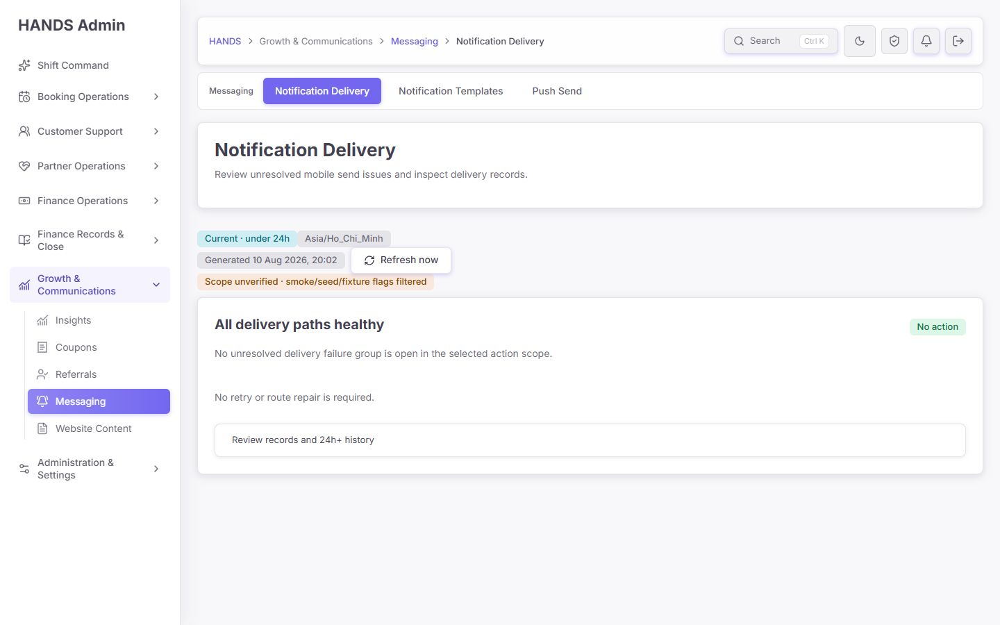

현재 기본 화면은 시각적으로 깔끔해졌지만 운영 의미가 잘못됐다.

- `Current · under 24h`라는 범위를 표시하면서 본문 제목은 `All delivery paths healthy`라고 전체 범위로 확대 해석한다.
- 코드상 정상 판정은 `summaryResult.ok`, action mode, groups issue, 현재 모델 `totalCount === 0`만 본다.
- 같은 시점에 히스토리에는 실패 745건, 미시도 434건, 활성 경로 없음 1,268명이 남아 있다.
- `No retry or route repair is required` 역시 현재 선택 큐만 보고 전체 수리 불필요로 읽힐 수 있다.

**권장 문구**

- 제목: `No new delivery issues in the last 24 hours`
- 보조 문구: `Historical delivery debt still needs review: 9 failure groups · 1,268 recipients without an active route.`
- 상태 배지: `Current clear`와 `Historical backlog`을 동시에 표시

**코드 기준**

- `apps/admin_web/app/notifications/page.tsx:88-89`의 `allDeliveryPathsHealthy`를 제거하거나 `noCurrentFailureGroups`처럼 정확한 이름으로 변경한다.
- 전체 정상 상태를 만들려면 적어도 current 범위의 failed/no-attempt/no-route/stale-route 수를 모두 검증해야 한다.
- 히스토리가 0이 아니면 절대로 `all paths healthy`를 사용하지 않는다.

### 4.2 숨겨진 히스토리 메뉴: 정보 우선순위가 반대

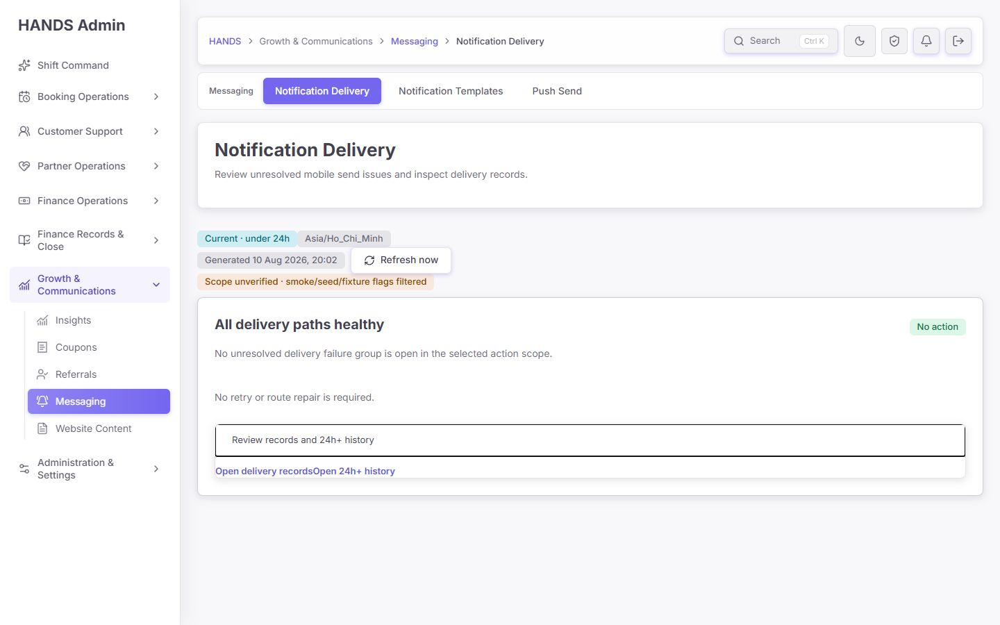

- 히스토리 부채가 있는 상태에서 `Review records and 24h+ history`를 접어 두는 것은 운영자가 문제를 발견하기 위해 한 번 더 행동하게 만든다.
- 두 링크가 시각적으로 붙어 `Open delivery recordsOpen 24h+ history`로 읽힌다.
- 첫 화면의 큰 빈 공간에 비해 실제 운영 정보는 접힌 한 줄에 모여 있다.

**수정 방법**

- disclosure를 제거하고 기본 화면에 `Current`와 `Historical backlog` 두 줄을 항상 노출한다.
- `Delivery records`는 우측 상단 보조 버튼, `Historical backlog`는 수치 카드 또는 경고 스트립으로 둔다.
- 링크 사이 최소 12px 간격, 각 링크 명확한 버튼 스타일, 포커스 상태를 제공한다.

### 4.3 Delivery records: 기능은 맞지만 첫 화면 효율이 낮음

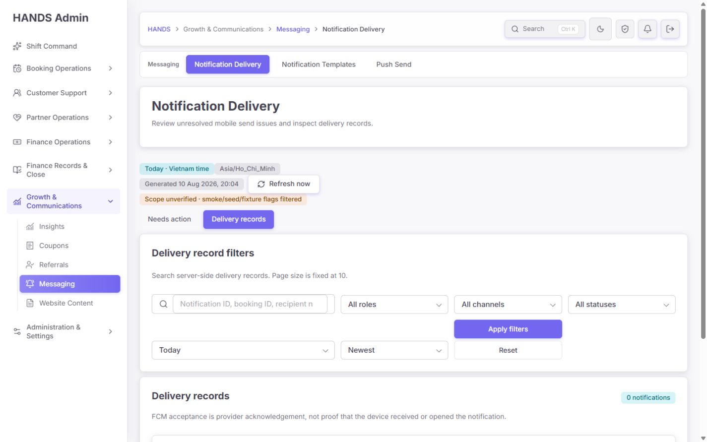

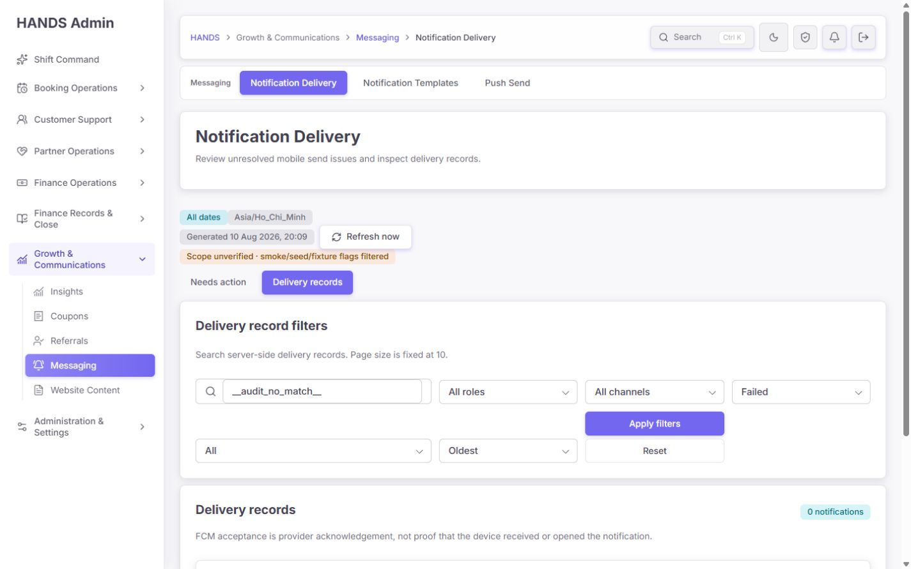

검증한 필터 상태:

```text
q=__audit_no_match__
status=failed
range=all
sort=oldest
```

URL 상태 보존과 `No delivery records match these filters.` 문구는 정확했다. 다만 운영 효율은 더 다듬어야 한다.

- 검색 placeholder가 잘리고, 첫 줄과 둘째 줄의 폭 균형이 좋지 않다.
- 필터 영역 때문에 데이터 표가 900px 높이의 첫 화면 아래로 밀린다.
- `Apply filters`와 `Clear`의 관계가 약하고, 현재 적용 조건을 한눈에 읽기 어렵다.
- 상태 선택과 기간·정렬이 모두 동일한 시각적 무게를 가져 가장 자주 쓰는 조건이 드러나지 않는다.

**권장 1440 레이아웃**

```text
[Search recipient / booking / notification________________] [Status] [Channel] [Apply]
[Role] [Period] [Sort]                         [Active filters · 3] [Clear]
```

- 검색 360~420px, select 136~156px, 버튼 96~112px.
- 적용 필터를 chip으로 보여 주고 각 chip에서 개별 제거 가능하게 한다.
- 필터 높이는 최대 112px 안에 제한하고 결과 수와 표 헤더가 첫 화면에 보이게 한다.

### 4.4 24h+ history: 숫자는 보이지만 운영 수명주기가 없음

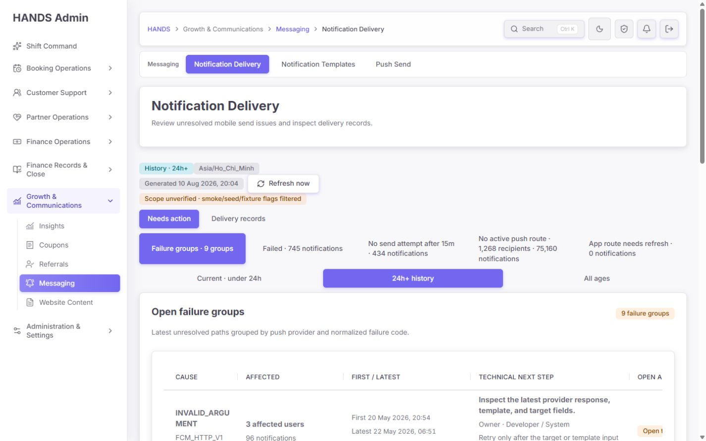

관찰된 실제 규모:

- Failure groups: 9
- Failed: 745 notifications
- No attempt: 434 notifications
- No active route: 1,268 recipients / 75,160 notifications
- Stale route: 0

문제는 이 수치가 **누가, 언제까지, 어떤 조건으로 닫아야 하는지**를 제공하지 않는다는 점이다.

현재 필요한 필드:

- severity: 고객 영향과 반복 빈도를 반영한 우선순위
- owner: 담당 운영자 또는 팀
- status: Open / Investigating / Waiting for fix / Ready to retry / Resolved / Accepted debt
- acknowledgedAt / lastReviewedAt
- recovery evidence: 새 토큰, 수정된 템플릿 버전, 자격 증명 상태, 마지막 성공 시간
- resolution note 및 관련 감사 로그

이 필드가 없으면 히스토리는 운영 큐가 아니라 끝없이 증가하는 조회 목록이 된다.

### 4.5 실패 그룹 딥링크: 정확하지만 해결 조건은 강제되지 않음

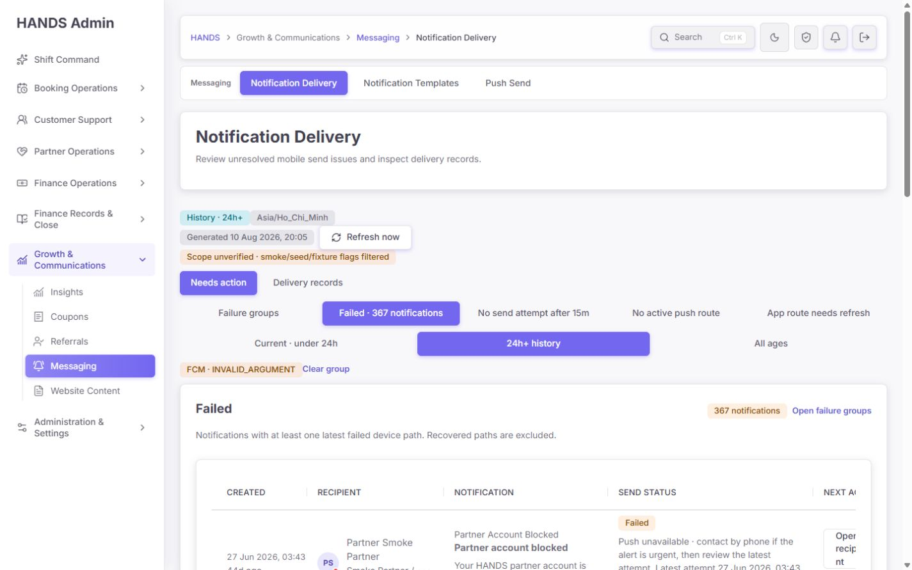

- provider `FCM`과 failure code `INVALID_ARGUMENT`가 정확히 적용되고 367건이 좁혀졌다.
- 코드별 owner, 확인 항목, retry condition 문구는 이전보다 훨씬 낫다.
- 그러나 `notification-failure-copy.ts`의 `Retry only after the target or template input is corrected.`는 표시용 문자열일 뿐 실제 버튼·API 조건과 연결되지 않는다.

**필요한 실패 분류 계약**

| 분류 | 예시 | UI 동작 | API 조건 |
|---|---|---|---|
| transient | 일시적 provider 오류 | 제한적 재시도 가능 | backoff, attempt limit, idempotency 확인 |
| conditional | 새 토큰 또는 외부 복구 필요 | 증거 전까지 `Retry blocked` | 실패 이후 생성된 새 활성 route 등 authoritative evidence |
| permanent/config | INVALID_ARGUMENT, credential mismatch | 기본적으로 재시도 금지 | 템플릿/설정 버전 변경과 readiness check 통과 |

### 4.6 No active route: 핵심 묶음은 성공, 표 폭은 미완성

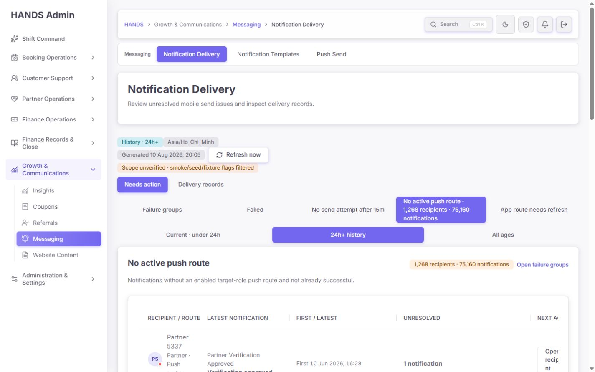

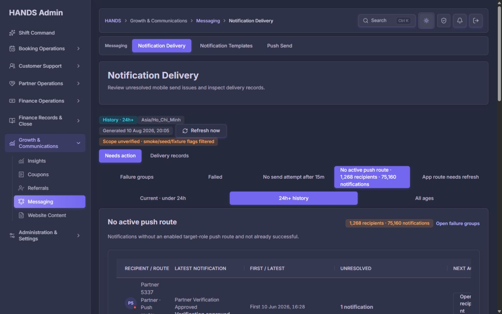

이전 문제였던 알림 단위 75,160행 노이즈를 1,268명으로 묶은 것은 매우 좋은 개선이다. 다만:

- 표 스크롤 컨테이너는 실제 `clientWidth 1002px`, `scrollWidth 1080px`로 약 78px 넘친다.
- 마지막 `Next action`이 잘리고 `Open recipient`가 여러 줄로 깨진다.
- 첫 열의 사용자/역할/알림 수가 좁게 압축돼 비교가 어렵다.
- 현재 CSS의 viewport breakpoint는 사이드바가 차지한 뒤의 콘텐츠 폭을 반영하지 못한다.

**권장 표 구조**

```text
Recipient (min 250) | Role (100) | Alerts (100) | First/Last (210) | Route state (180) | Next action (160)
```

- 1440 화면에서 핵심 6열만 기본 노출한다.
- 기술 식별자와 보조 설명은 확장 행 또는 상세 화면으로 보낸다.
- action 열은 `min-width: 160px; white-space: nowrap;`으로 고정한다.
- viewport media query 대신 본문 컨테이너 폭 기반 container query 또는 해당 테이블 전용 column contract를 사용한다.

### 4.7 행 액션: 발견성은 좋아졌지만 키보드와 폭 문제

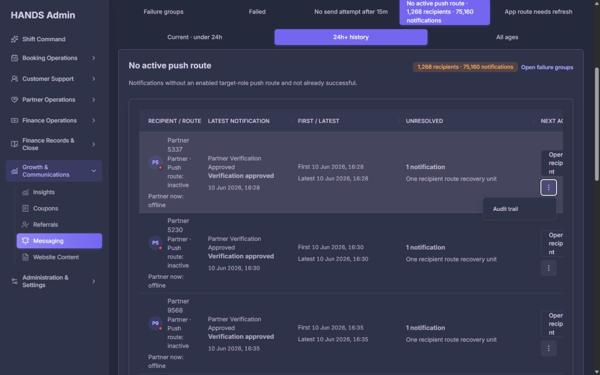

- 기본 행동이 메뉴 밖에 보여 운영 속도는 개선됐다.
- `Audit trail` 같은 보조 행동도 다크 테마에서 읽을 수 있다.
- 그러나 기본 버튼이 최대 3줄로 줄바꿈되며 스캔 속도가 크게 떨어진다.
- 네이티브 `<details>` 기반 메뉴는 포커스가 summary에 있는 상태에서 `Esc`를 눌러도 닫히지 않았다.

**수정 방법**

- 공통 `RowActionMenu`를 사용해 `Esc`, 바깥 클릭, 다른 메뉴 열기 시 닫히게 한다.
- 메뉴가 닫힌 뒤 포커스를 trigger로 복귀시킨다.
- 기본 버튼은 한 줄 고정, 행 높이 56~64px 이내, 보조 메뉴 trigger 최소 40×40px.

### 4.8 No attempt: 범위 구분은 성공, 오래된 부채 정리가 없음

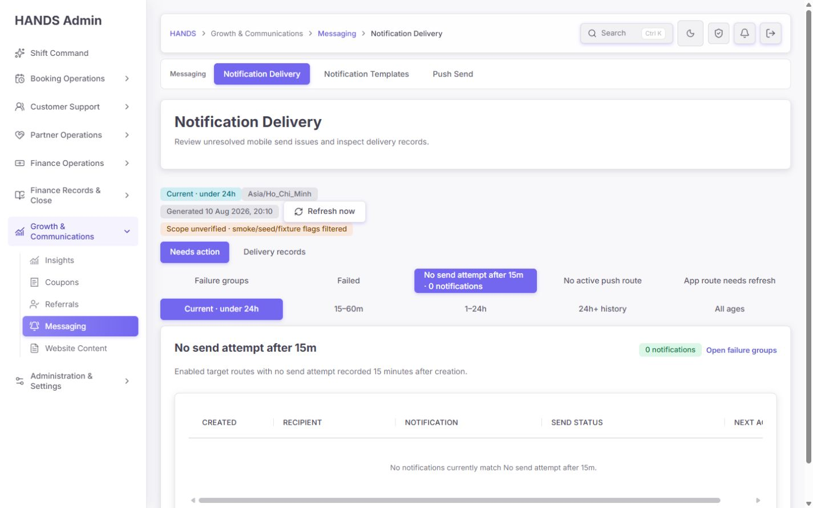

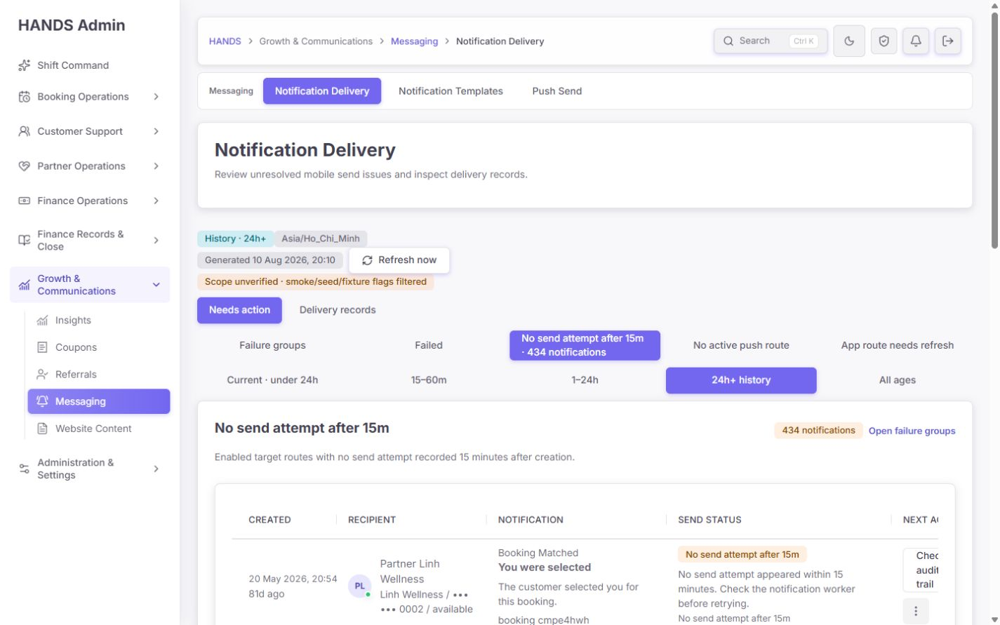

- 현재 0건과 히스토리 434건이 정확히 구분된다.
- 빈 표에서도 수평 스크롤과 잘린 마지막 헤더가 발생한다.
- 히스토리에서는 81일 이상 오래된 유사 행이 반복되지만 `Check audit trail` 외에 처리 완료 경로가 없다.

**필수 추가 기능**

- `Investigate`, `Waiting`, `Resolved`, `Accepted debt` 상태
- 담당자 지정과 bulk assignment
- 연령 구간: 24~72h / 3~7d / 8~30d / 30d+
- 30일 이상 항목에 대한 archive 또는 별도 debt view
- 해결 근거가 확인된 경우에만 terminal 상태로 전환

### 4.9 재시도 확인창: 확인 UX는 양호, 정책은 위험

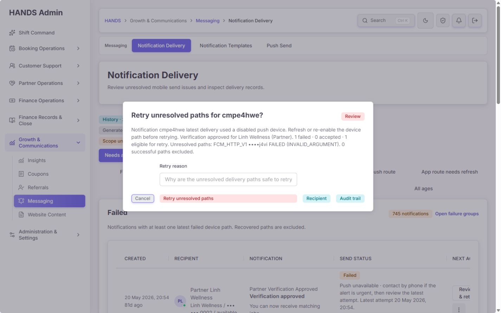

확인창 자체는 다음을 잘 제공한다.

- 대상 notification과 실패 코드 표시
- eligible 1, success 0 요약
- 12~500자 필수 사유
- recipient와 audit trail 링크
- `Esc`로 취소 가능, 초기 포커스가 Cancel에 위치

하지만 이 사례의 failure code는 `INVALID_ARGUMENT`이고 runbook은 대상/템플릿 수정 후에만 재시도하라고 한다. 현재 API의 실질 조건은 “성공하지 않은 device인가”뿐이다. 수정 버전, 새 토큰, 자격 증명 readiness 같은 복구 근거는 확인하지 않는다.

**P0 수정 요구**

1. 화면 모델에 `retryState: allowed | blocked | conditional`과 `retryBlockReason`을 제공한다.
2. 확인창을 열기 전 서버 preflight를 실행한다.
3. API에서 같은 조건을 다시 검증한다. UI 조건만으로 보호하지 않는다.
4. `INVALID_ARGUMENT`은 실패 시점 이후 payload/template/target version 변경 증거가 있어야 한다.
5. unregistered token은 실패 이후 등록된 새 enabled device가 있어야 한다.
6. credential 오류는 project/config readiness check와 배포 버전이 확인돼야 한다.
7. 사유 입력은 감사 근거이지 복구 증거의 대체물이 아니다.
8. 동일 notification/device/fix-version 조합에 idempotency key 또는 active retry dedupe를 적용한다.

## 5. 이전 감사 요건 이행 여부

| 이전 요구 | 상태 | 재감사 판단 |
|---|---|---|
| No active route를 수신자 단위로 묶기 | **완료** | 1,268명 / 75,160건으로 노이즈 축소 확인 |
| provider + failure code 정확한 딥링크 | **완료** | FCM + INVALID_ARGUMENT 367건 필터 확인 |
| 코드별 runbook, owner, retry condition | **부분 완료** | 문구는 구현됐지만 실제 retry gate와 연결되지 않음 |
| 안전한 사용자 식별 fallback | **완료** | 이름 → 마스킹 번호 → 짧은 ID 순서 확인 |
| retry 감사 로그 선기록 및 결과 상태 | **완료** | 요청 감사 후 enqueue, queued/failed/pending 기록 코드 및 테스트 확인 |
| 1440px 레이아웃 안정화 | **미완료** | 본문 폭에서 표 우측 잘림, 액션 줄바꿈, 빈 표 수평 스크롤 발생 |
| 기본 액션 가시성 | **부분 완료** | 메뉴 밖으로 노출됐지만 열 폭과 키보드 닫기 문제 남음 |
| refresh와 current/history 경계 | **부분 완료** | 시간 경계는 명시, 기본 정상 문구는 범위를 초과함 |
| 운영 데이터 범위 신뢰성 | **미완료** | `Scope unverified`, 실제 시험성 표시 데이터가 집계에 남음 |

## 6. 코드·데이터 구조 감사

### 6.1 정상 상태 판정

`apps/admin_web/app/notifications/page.tsx:88-89`

현재 판정은 선택된 action/groups 목록의 `totalCount`만 본다. summary의 다른 issue count와 history debt를 포함한 명시적인 view model을 만들어야 한다.

권장 서버 응답:

```ts
type NotificationHealth = {
  scope: 'production' | 'mixed' | 'unknown';
  current: {
    failureGroups: number;
    failedNotifications: number;
    unattemptedNotifications: number;
    recipientsWithoutRoute: number;
    staleRoutes: number;
  };
  history: {
    failureGroups: number;
    failedNotifications: number;
    unattemptedNotifications: number;
    recipientsWithoutRoute: number;
    notificationsWithoutRoute: number;
  };
};
```

UI는 `current`와 `history`를 독립적으로 판단해야 한다.

### 6.2 시험 데이터 필터

현재 production-data 필터는 ID prefix와 일부 JSON flag에 의존한다. 사람이 읽는 이름만 `Smoke`, `Demo`인 레코드는 남을 수 있다.

**권장 순서**

1. 데이터 모델에 `environment`, `dataClass`, `isSynthetic` 중 하나를 authoritative field로 추가한다.
2. 생성 경로에서 필수로 기록하고 DB constraint 또는 enum으로 제한한다.
3. 운영 요약 쿼리는 production 값만 포함한다.
4. unknown 값은 운영 집계에서 제외하고 별도 data-quality queue로 보낸다.
5. 화면 상단은 `Production verified` 또는 `Mixed/Unknown data excluded`를 서버 응답 근거로 표시한다.

문자열 이름에 `Smoke`나 `Demo`가 포함됐다는 이유만으로 필터링하는 방식은 오탐 위험이 있어 최종 해법이 아니다.

### 6.3 요약 API 비용

`apps/api/src/admin/admin.service.ts:29297`의 summary는 현재 선택 화면에 필요하지 않은 다수 집계도 함께 실행한다. 레코드 목록이나 no-route 화면에서도 광범위한 보조 집계를 수행하면 2~4초대 응답을 만들 수 있다.

**권장 구조**

- 경량 header summary와 선택 issue detail query를 분리한다.
- `mode`, `issue`, `scope`에 필요한 쿼리만 실행한다.
- 큰 history query에는 cursor pagination과 대상 인덱스를 검증한다.
- `EXPLAIN (ANALYZE, BUFFERS)`로 no-route/unattempted/group query를 측정한 뒤 인덱스를 결정한다.
- 짧은 TTL 캐시는 집계에만 사용하고 액션 가능 행의 신선도를 캐시로 가리지 않는다.

### 6.4 재시도 API

`apps/api/src/notifications/notifications.service.ts:144-149`는 성공하지 않은 device를 eligible로 본다. 이 조건은 중복 성공 경로를 피하는 데는 도움이 되지만 permanent/config 오류를 안전하게 재시도할 수 있다는 뜻은 아니다.

재시도 API는 다음 입력 또는 서버 조회 결과를 함께 검증해야 한다.

- failure class와 code
- failedAt
- latest device registeredAt/updatedAt
- template/payload/config version
- provider readiness
- existing retry job/idempotency key
- retry attempt count 및 cooldown

## 7. 권장 최종 화면 구성

```text
Notification Delivery                                      [Refresh] [Delivery records]
Production verified · Generated 10 Aug 2026 20:xx ICT · Auto-refresh state

Current · under 24h
[Failure groups 0] [Failed 0] [No attempt 0] [No route 0] [Stale route 0]
No new delivery issues in the last 24 hours.

Historical backlog
[9 groups] [745 failed] [434 no attempt] [1,268 recipients / 75,160 alerts]
Oldest 81d · Unassigned 100% · [Open historical backlog]

Needs action
[Severity] [Issue / recipient] [Impact] [Age] [Owner / status] [Next action]
```

### 구성 원칙

- 기본 화면에서 current와 history를 동시에 보여 준다.
- `정상`은 현재 범위에만 사용하고, 남은 부채를 같은 화면에 명시한다.
- 상태 카드는 링크이되 active/hover/focus가 명확해야 한다.
- 표는 운영자가 비교해야 하는 5~6개 열만 기본 노출한다.
- 세부 provider response, 전체 기술 ID, 원시 payload는 상세 또는 audit trail에 둔다.
- 기본 행동은 한 줄 버튼, 위험 행동은 서버 preflight 후 확인창으로 제한한다.

## 8. 우선순위별 수정 백로그

### P0 — 운영 신뢰와 안전 차단

1. `All delivery paths healthy` 오판 로직 제거 및 current/history 동시 표시
2. failure class 기반 재시도 preflight와 API 강제 gate
3. production/synthetic 데이터 경계의 authoritative field 도입

### P1 — 매일 쓰는 운영 효율

4. 본문 실제 폭 기준 표 column contract와 action 한 줄 고정
5. 히스토리 owner/status/acknowledgement/resolution lifecycle 추가
6. summary 쿼리 분리, no-route 및 history 쿼리 성능 측정·개선
7. RowActionMenu의 Esc/외부 클릭/포커스 복귀 구현
8. 필터 높이 축소, active filter chip, 결과 표 첫 화면 노출

### P2 — 마감 품질

9. 접힌 링크 간격 및 문구 정리
10. 보라색 active button 색상 토큰을 4.5:1 이상으로 조정
11. 긴 코드·사용자 이름·다국어 문구에 대한 줄바꿈 정책 통일
12. loading/skeleton, API 부분 실패, 데이터 생성 시각 지연 경고를 표준 상태로 정리

## 9. 성능 감사

같은 로그인 세션의 warm local navigation에서 화면이 안정될 때까지 관찰한 값이다. 실험실 벤치마크나 운영 P75는 아니므로 절대값보다 상대적 병목 지표로 사용한다.

| 화면 | 관찰 시간 |
|---|---:|
| 기본 Notification Delivery | 약 0.89초 |
| 24h+ history groups | 약 2.61초 |
| Delivery records · all | 약 2.73초 |
| No active route · history | 약 3.87초 |

**권장 목표**

- warm 내부 전환 first useful content P75 ≤ 1.5초
- 필터 적용 후 표 갱신 P75 ≤ 1.0초
- row action feedback ≤ 300ms
- 1.5초를 넘으면 명확한 skeleton과 `Generated at` 유지

## 10. 검증 결과

### 브라우저

- 1440×900 라이트·다크 화면 캡처 12장 저장
- 실제 URL 필터 상태 보존 확인
- current/history, exact failure group, no-route grouping 확인
- row action menu 키보드 `Esc` 실패 확인
- retry confirmation `Esc` 취소 성공 확인
- 실제 retry 제출하지 않음
- 브라우저 console warning/error: 0건

### 자동화 테스트

```text
Admin notifications focused tests: 6 files, 106 tests passed
API notifications focused tests:   6 files, 38 tests passed
Admin typecheck: passed
API typecheck: passed
```

자동화 테스트가 통과했어도 다음 회귀 테스트는 추가해야 한다.

- 1440 viewport가 아니라 **실제 main content width**에서 표 오른쪽 열이 보이는지 검사
- current 0 + history > 0일 때 `All delivery paths healthy`가 절대 나오지 않는 테스트
- INVALID_ARGUMENT와 credential 오류가 복구 증거 전에는 API에서 차단되는 테스트
- synthetic/unknown 데이터가 production aggregate에 포함되지 않는 테스트
- row action menu의 Escape, outside click, focus return 테스트
- history owner/status/resolution lifecycle 테스트

## 11. 완료 승인 기준

아래를 모두 만족해야 최종 통과로 본다.

- [ ] 현재 큐가 0이어도 히스토리 부채가 기본 화면에 숨지 않는다.
- [ ] `healthy` 문구의 시간·데이터 범위가 서버 집계와 정확히 일치한다.
- [ ] 운영 데이터 범위가 production으로 검증되고 시험 데이터가 집계에서 제외된다.
- [ ] permanent/config failure는 서버 복구 증거 전까지 retry API가 거절한다.
- [ ] 1440×900에서 모든 핵심 열과 기본 액션이 수평 스크롤 없이 한 줄로 보인다.
- [ ] 히스토리 항목에 owner/status/last reviewed/resolution evidence가 있다.
- [ ] row action menu가 Esc·바깥 클릭으로 닫히고 포커스가 복귀한다.
- [ ] history 및 no-route warm P75가 목표 안으로 들어오거나 측정 가능한 성능 예산이 설정된다.
- [ ] 위 신규 회귀 테스트와 기존 집중 테스트가 모두 통과한다.

## 12. 감사 결론

이번 수정은 단순한 화면 장식이 아니라 실제 운영 모델 쪽으로 상당히 전진했다. 특히 수신자 그룹화, 정확한 실패 그룹, 안전한 사용자 표시, URL 기반 필터, 감사 로그 순서는 분명한 성과다.

다만 현재 가장 위험한 부분은 **화면이 말하는 정상 상태와 시스템이 실제로 가진 부채가 다르고, runbook이 말하는 재시도 조건과 API가 허용하는 조건도 다르다**는 점이다. 다음 수정은 새 카드를 더 추가하기보다 이 두 개의 진실을 일치시키는 데 집중해야 한다. 그 다음 데이터 범위를 확정하고 1440 본문 폭·히스토리 수명주기·성능을 마무리하면 운영자 친화성과 신뢰도가 크게 올라갈 것이다.
