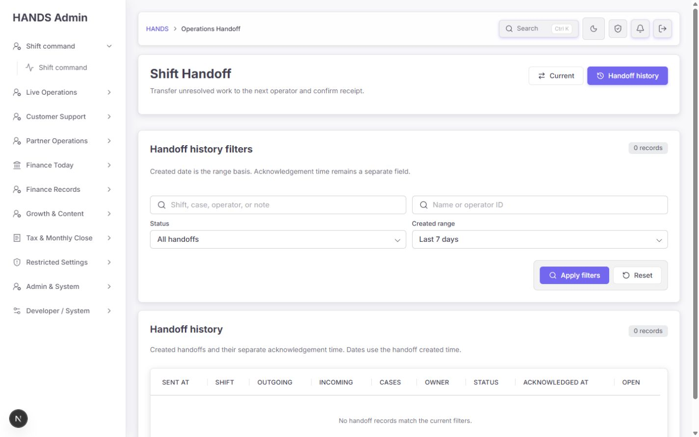
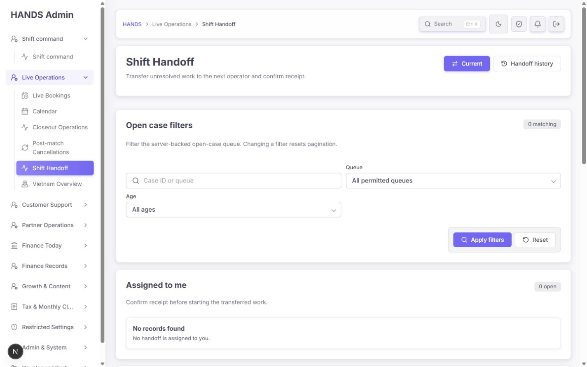
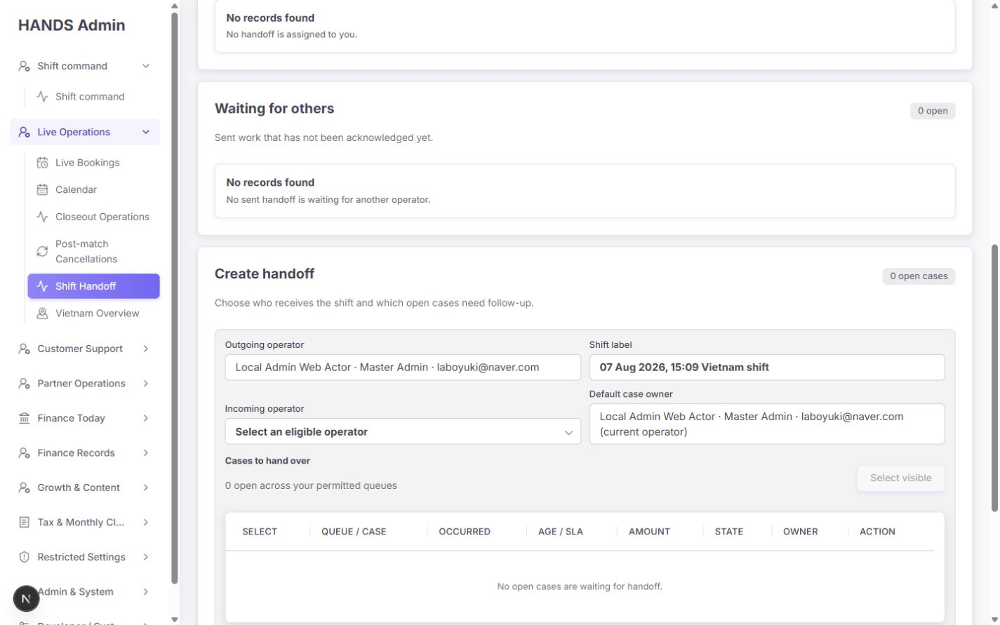
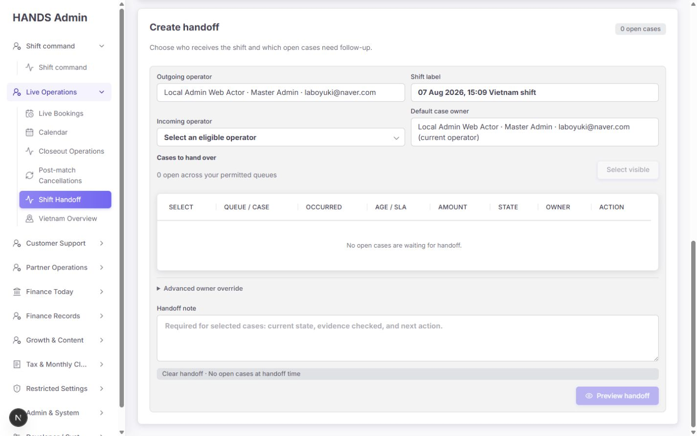
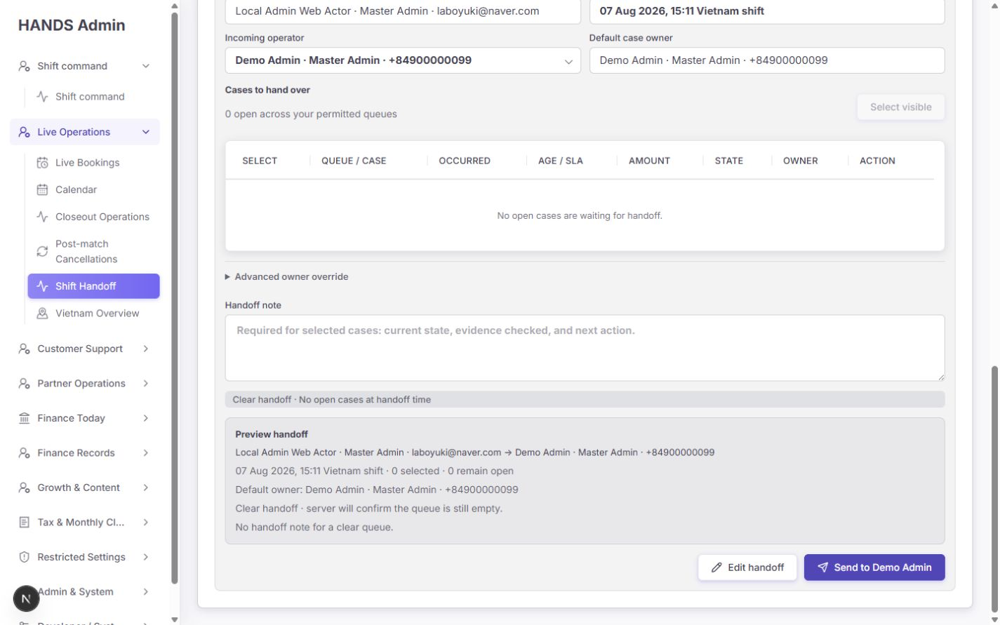
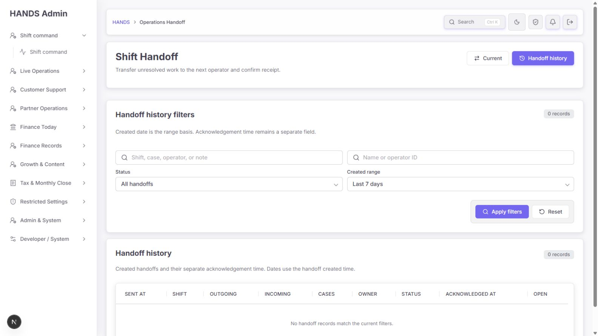
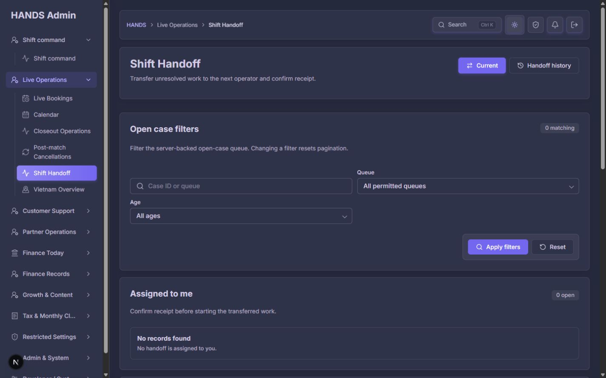
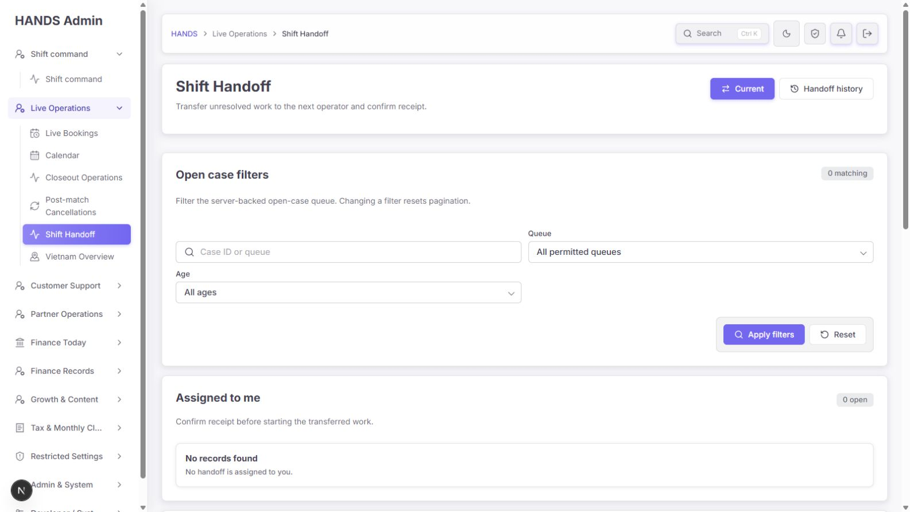

# Shift Handoff 개선 후 심층 재감사 보고서

- 감사일: 2026-08-07
- 대상 저장소: `C:\dev\massage-on-demand-vn`
- 대상 화면:
  - `http://localhost:3101/operations-handoff`
  - `http://localhost:3101/operations-handoff?view=handoff`
- 화면 검증 범위: **1440×900, 1600×900만 검증**
- 제외 범위: 1024px 이하 화면은 요청에 따라 검사·평가·개선 요건에서 완전히 제외
- 감사 방식: 로그인된 실제 관리자 화면 캡처, DOM·상호작용 확인, Next.js 화면 코드와 Admin API 구현 및 테스트 대조
- 안전 범위: 실제 handoff 생성과 acknowledgement는 실행하지 않았고, 0건 clear handoff의 preview까지만 확인
- 소스 수정: 없음

## 1. 최종 결론

이전 감사에서 지적한 거대한 `Operations History` 혼합 화면은 잘 정리되었다. 현재 구현은 일반 booking/customer/Partner/finance 이력을 제거하고, `Current`와 `Handoff history`라는 두 업무 mode로 축소했다. 실제 open-case endpoint, 두 단계 preview, 권한 검사, 충돌 검사, history 필터, 오류 상태도 추가되어 **이전 버전보다 운영 가능성이 크게 향상됐다.**

그러나 아직 운영 완료 판정을 내리기에는 세 가지 핵심 문제가 남아 있다.

1. 기본 URL `/operations-handoff`가 일상 업무인 `Current`가 아니라 `Handoff history`를 연다.
2. 화면의 `Default case owner`는 실제 case ownership을 변경하는 것처럼 보이지만 API는 handoff audit metadata만 기록한다.
3. current queue가 100건을 넘거나 audit log가 커질 때 누락·성능 저하가 발생할 구조이며, 오류 상황에서도 빈 queue가 함께 표시된다.

따라서 최종 판단은 **조건부 통과**다. 시각·정보 구조 개선은 통과했지만, 라우팅과 데이터 계약 문제를 해결하기 전에는 “안전한 교대 인계” 기능으로 확정하면 안 된다.

### 권장 구조 한 줄 결론

**하나의 `Shift Handoff` workspace로 통일하되, Current와 History는 같은 화면 안의 별도 mode로 유지한다. 기본 URL은 Current로 바꾸고 History만 `?view=history`로 구분한다. 두 데이터를 한 페이지에 동시에 길게 펼치지는 않는다.**

권장 URL:

- Current shift: `/operations-handoff`
- History: `/operations-handoff?view=history`
- 기존 `/operations-handoff?view=handoff`: 당분간 `/operations-handoff`로 redirect 또는 canonical 처리

## 2. 개선 반영 판정

| 이전 핵심 문제 | 현재 상태 | 재감사 판정 |
|---|---|---|
| History에 일반 운영 기록과 live queue가 혼재 | handoff 생성·확인 기록만 남김 | 해결 |
| Start Shift 표본 데이터로 open case 선택 | 전용 open-case endpoint와 pagination 사용 | 해결 |
| API 실패와 실제 0건 구분 불가 | source별 error state 추가 | 부분 해결: handoff 오류 때 빈 queue도 같이 보임 |
| 저장 실패가 운영자에게 보이지 않음 | server action 결과와 오류 문구 표시 | 해결, 409 문구 우선순위는 보완 필요 |
| incoming/owner/case 선택이 불명확 | 표 형식, 권한 기반 operator, owner override, preview 추가 | 크게 개선, owner 의미는 아직 위험 |
| Assigned와 Waiting 미분리 | `Assigned to me` / `Waiting for others` 분리 | 해결 |
| History count와 row predicate 불일치 | 전용 handoff ledger 기준으로 통일 | 해결 |
| Current/History가 서로 다른 메뉴처럼 보임 | 상단 mode navigation으로 통합 | 부분 해결: 기본 URL과 sidebar active 상태 불일치 |
| 실제 handoff 확인 이력 부족 | 별도 acknowledgement audit event | 해결, 동시 요청 중복 방지는 보완 필요 |
| 데스크톱 레이아웃 불안정 | 1440/1600에서 가로 overflow 없음 | 해결 |

## 3. 품질 점수

| 평가 영역 | 점수 | 근거 |
|---|---:|---|
| 접근성 | 2/4 | form label과 상태 안내는 양호하나 빈 `document.title`, 중복 H1, 모호한 `Current`, 즉시 실행되는 acknowledgement가 남음 |
| 성능·확장성 | 1/4 | history/current 모두 전체 handoff audit log를 메모리에 적재한 뒤 필터·pagination 처리 |
| 테마 | 4/4 | light/dark 모두 구조와 active 상태가 안정적으로 유지됨 |
| 데스크톱 레이아웃 | 3/4 | 1440/1600에서 가로 overflow는 없으나 0건 화면도 2,018px 높이이며 핵심 생성 영역이 아래로 밀림 |
| 구현 무결성 | 1/4 | URL canonical 불일치, owner 의미 불일치, 오류 시 false-empty, 100건 절단 가능성 |
| **합계** | **11/20** | 시각 개선은 통과, 운영 계약과 데이터 신뢰는 추가 보완 필요 |

## 4. 화면별 단계 감사

### Step 1 — 기본 URL로 진입

상태: **개선 필요**



`/operations-handoff`는 `Handoff history`를 기본으로 연다. 화면 자체는 단순하고 읽기 쉽지만, 이 URL을 여는 주요 링크의 문구는 `Open handoff`다. 운영자는 “인계 업무를 시작하려고” 눌렀는데 과거 기록에 도착한다.

화면에서 확인된 추가 불일치:

- breadcrumb는 `HANDS > Operations Handoff`다.
- sidebar의 `Live Operations > Shift Handoff`는 active가 아니고 상위 메뉴도 펼쳐지지 않는다.
- 동일 기능의 다른 mode와 navigation 위치가 달라 보인다.
- 검색 결과가 0건일 때 filter badge와 table badge가 모두 `0 records`를 반복한다.
- 빈 결과에서도 9열 table header가 남아 있어 실제 정보보다 빈 표가 더 큰 비중을 차지한다.

코드 원인:

- `page.tsx:39`에서 `view=handoff`만 Current로 보고 그 외 값과 bare URL은 모두 History로 처리한다.
- sidebar href는 `/operations-handoff?view=handoff`다.
- query가 있는 navigation item은 pathname뿐 아니라 query string까지 정확히 같아야 active가 된다.
- 홈과 finance closeout의 `Open handoff` 링크 네 곳은 bare `/operations-handoff`를 사용한다.

### Step 2 — Current workspace 상단

상태: **대체로 양호**



좋아진 점:

- `Current` mode에서는 sidebar의 `Live Operations > Shift Handoff`가 정확히 active된다.
- breadcrumb도 `HANDS > Live Operations > Shift Handoff`로 업무 위치를 잘 설명한다.
- 검색, queue, age/SLA 필터가 한 영역에 모였다.
- filter 변경 시 pagination을 초기화한다.
- 1440×900과 1600×900 모두 본문 가로 overflow가 없었다.

남은 문제:

- 탭 이름 `Current`만으로는 “현재 shift”, “현재 open cases”, “현재 operator” 중 무엇인지 즉시 알기 어렵다.
- `Filter the server-backed open-case queue`는 운영자 문구가 아니라 구현 설명이다.
- filter 영역이 0건이어도 큰 카드 높이를 유지하고 다음 업무를 아래로 민다.

권장 문구:

- `Current` → `Current shift` 또는 `Live handoff`
- `Filter the server-backed open-case queue. Changing a filter resets pagination.` → `Find open work by queue, age, or case ID.`

### Step 3 — Assigned / Waiting queue

상태: **구조는 맞지만 0건 표현이 과함**



`Assigned to me`와 `Waiting for others`를 분리한 것은 운영자 관점에서 올바른 변경이다. 받아야 할 일과 보냈지만 아직 확인되지 않은 일을 혼동하지 않게 한다.

하지만 0건일 때 두 개의 큰 section이 각각 header, count, `No records found`, 보조 설명을 반복한다. 그 아래 `Create handoff`까지 별도 대형 section으로 이어져, 아무 일도 없는 화면의 전체 높이가 약 2,018px가 된다.

권장 최소 구조:

- 상단에 `Current shift` 요약 strip: `Assigned 0 · Waiting 0 · Open cases 0`
- Assigned와 Waiting이 모두 0이면 하나의 compact empty state: `No handoffs need your attention.`
- 둘 중 하나라도 1건 이상이면 현재처럼 해당 queue를 펼친다.
- `Create handoff`는 outgoing operator가 즉시 접근할 수 있도록 요약 strip 바로 아래 또는 우측 primary action으로 올린다.

### Step 4 — Create handoff

상태: **큰 폭으로 개선, 의미 계약 확인 필요**



좋아진 점:

- outgoing operator와 shift label이 자동 표시된다.
- incoming operator를 선택하면 기본 owner가 동기화된다.
- case는 queue, occurred time, age/SLA, amount, state, owner, action을 가진 표로 바뀌었다.
- `Select visible`, pagination, advanced owner override가 있어 기본 흐름과 예외 흐름을 분리했다.
- 선택된 case가 있으면 note를 요구하고, open-case count가 바뀌면 서버가 충돌로 거부한다.
- incoming operator와 owner가 선택 queue에 접근 가능한지 서버에서 검사한다.

운영상 중요한 문제:

1. `Default case owner`는 실제 원본 case의 owner를 변경하지 않는다.
2. API open-case row의 `owner`는 현재 항상 `null`이다.
3. handoff 생성 API는 `operations.shift_handoff.create` audit metadata에 `ownerId`와 선택 case를 저장할 뿐 booking/payment/refund/partner/notification 등 원본 record를 갱신하지 않는다.
4. 따라서 운영자가 “담당자가 바뀌었다”고 믿으면 source queue의 실제 배정 상태와 handoff ledger가 갈라질 수 있다.

가장 작은 안전한 수정안:

- 이 기능을 **실제 record assignment가 아닌 shift responsibility ledger**로 명확히 정의한다.
- 상단의 `Default case owner`는 제거하거나 `Follow-up owner`로 바꾼다.
- 설명을 `Responsible for following up after this handoff. Source records are not reassigned.`로 명확히 한다.
- 일반적으로 incoming operator가 follow-up owner라면 같은 값을 두 번 보여주지 않는다.
- 별도 담당자가 필요할 때만 `Advanced` 안에서 `Follow-up owner override`를 노출한다.

실제 원본 queue owner를 바꾸는 것이 제품 요구라면 위 문구 수정으로 끝내면 안 된다. 각 queue별 assignment write와 rollback/부분 실패 정책을 별도 설계해야 한다. 현재 서로 다른 7개 운영 queue를 한 transaction으로 실제 재배정하는 공통 모델은 보이지 않으므로, 이번 화면 보완에서는 ledger 의미를 정확히 표시하는 쪽이 더 안전하고 단순하다.

추가 개선:

- operator 목록은 로컬 데이터 기준 20개 이상의 audit/smoke 계정이 섞인다. 운영 데이터에서도 목록이 길다면 searchable combobox가 필요하다.
- inactive/test operator는 API 단계에서 제외해야 한다. 다만 현재 로컬 fixture만으로 production 데이터 결함이라고 단정하지 않는다.
- operator label은 이름 + role + masked email/phone 중 하나로 일관되게 표시한다.
- note placeholder가 `current state, evidence checked, next action`을 요구하지만 한 칸의 자유 입력이다. 새 라이브러리 없이 기본 template를 넣는 것으로 충분하다.
  - `Current state:`
  - `Evidence checked:`
  - `Next action / due time:`

### Step 5 — Preview와 clear handoff

상태: **동작 구조는 양호, 정책 문구 필요**



preview에서 outgoing → incoming, shift, 선택 수, 남은 open 수, default owner를 다시 보여주는 흐름은 좋다. 최종 send와 edit가 분리되어 오발송을 줄인다.

다만 `Clear handoff`는 두 가지 의미로 해석될 수 있다.

- 필수 교대 확인서라면: 버튼과 이력에서 `Clear-shift confirmation`으로 부르고, 0건이어도 incoming operator가 확인해야 하는 이유를 설명한다.
- 0건 기록이 필수가 아니라면: handoff를 만들지 않고 `No open work to hand over`로 종료해 history noise를 줄인다.

현재 API는 open case가 0건인지 서버에서 다시 확인하므로 데이터 안전성은 좋다. 남은 것은 비즈니스 정책과 문구의 문제다.

### Step 6 — Acknowledge

상태: **권한은 양호, 의미와 동시성 보완 필요**

좋아진 점:

- assigned incoming operator만 acknowledge할 수 있다.
- create와 acknowledge를 별도 audit event로 기록한다.
- 이미 확인된 handoff를 다시 확인하면 conflict로 거부한다.

남은 문제:

- 버튼 `Acknowledge`는 무엇을 책임지는지 설명하지 않는다.
- 클릭 즉시 서버 write가 실행되고 별도 확인 단계가 없다.
- API는 기존 acknowledgement를 조회한 뒤 새 audit log를 작성한다. DB unique constraint나 transaction이 없어 동시 클릭 두 건이 모두 조회를 통과할 가능성이 있다.

권장:

- `Acknowledge & take over`로 바꾼다.
- 보조 문구: `Confirms you reviewed this handoff and accept follow-up responsibility.`
- case가 여러 건이거나 follow-up owner가 바뀌는 경우에만 짧은 confirmation을 사용한다.
- `(action, target)` 또는 handoff-specific acknowledgement key에 DB unique constraint를 두고 duplicate를 idempotent하게 처리한다.

### Step 7 — History

상태: **대체로 양호**



좋아진 점:

- 일반 운영 이력을 제거하고 실제 handoff ledger만 표시한다.
- search, operator, status, created range가 업무 목적에 맞다.
- acknowledgement time을 created time과 별도 열로 유지한다.
- API 실패 시 history table을 렌더링하지 않는 구조가 Current보다 안전하다.
- 1600×900에서도 filter와 table 폭이 안정적이다.

개선할 점:

- `Created date is the range basis. Acknowledgement time remains a separate field.` → `Date range uses sent time. Acknowledged time is shown separately.`
- 0건일 때 table header 대신 하나의 empty state와 `Reset filters`를 보여준다.
- 상단 filter result badge와 table status의 중복 `0 records`는 하나만 남긴다.
- History는 보조 mode이므로 첫 진입 기본값이 되어서는 안 된다.

### Step 8 — Dark theme와 데스크톱 폭

상태: **양호**





- 1440×900 light/dark와 1600×900 light에서 sidebar, filter, table, active navigation의 구조가 유지됐다.
- 확인한 네 상태 모두 body 가로 overflow가 없었다.
- dark theme의 경계와 primary active 색상은 일관적이었다.
- 이번 감사에서는 색 대비 수치를 자동 측정하지 않았으므로 WCAG 비율 통과를 단정하지 않는다.
- 요청에 따라 1024px 이하 레이아웃은 평가하지 않았다.

## 5. 왜 두 URL로 나뉘었는가

현재 두 주소는 실제로 두 개의 Next.js page가 아니다. 하나의 `page.tsx`가 query 값에 따라 두 component path 중 하나를 선택한다.

```text
/operations-handoff                -> History
/operations-handoff?view=handoff   -> Current
```

분리 자체에는 합리적인 이유가 있다.

| Current | History |
|---|---|
| 지금 처리할 open handoff와 case | 이미 생성·확인된 ledger 조회 |
| 생성·확인 write 포함 | read-only 검색·감사 |
| 현재 operator 기준 queue | operator/status/date 기준 기록 |
| open cases/operators/current handoff API 필요 | history handoff API만 필요 |
| 업무 속도와 안전한 action이 우선 | 검색성·추적성이 우선 |

따라서 두 mode를 내부적으로 구분하고 활성 mode의 데이터만 요청하는 것은 맞다. 문제는 **History가 bare URL을 차지하고 Current만 특수 query를 요구한다는 점**이다.

이 때문에:

- sidebar 링크와 bare route의 active 상태가 다르다.
- breadcrumb가 mode마다 다른 정보 구조를 보인다.
- 홈과 finance closeout의 `Open handoff` 링크가 History로 잘못 들어간다.
- 운영자가 bookmark를 어떤 주소로 해야 하는지 불명확하다.

## 6. 하나로 통일할 수 있는가

가능하며, 그렇게 하는 것이 더 효율적이다. 다만 “하나로 통일”은 Current와 History를 한 페이지에 동시에 쌓는다는 뜻이 아니다.

### 권장 정보 구조

```text
Live Operations
└─ Shift Handoff
   ├─ Current shift   /operations-handoff
   └─ History         /operations-handoff?view=history
```

### 권장 동작

1. sidebar에는 `Shift Handoff` 하나만 유지한다.
2. `/operations-handoff`의 canonical view를 `Current shift`로 바꾼다.
3. `History`를 `?view=history`로 이동한다.
4. legacy `?view=handoff`는 bare URL로 redirect한다.
5. 두 mode에서 sidebar와 breadcrumb는 항상 같은 `Live Operations > Shift Handoff`를 표시한다.
6. 상단 mode navigation만 `Current shift / History` active 상태를 바꾼다.
7. 데이터 fetch는 현재처럼 mode별로 분리한다. 보이지 않는 History API를 Current에서 미리 불러오지 않는다.
8. Current 상단에는 History 전체 표 대신 `Waiting acknowledgement N`과 마지막 전송 시각 정도의 작은 링크만 둘 수 있다.

### 권장하지 않는 구조

- Current queue, create form, history filter, history table을 한 긴 페이지에 모두 렌더링
- 하나의 API 응답에 open cases, operators, current handoffs, entire history를 모두 포함
- sidebar에 Current와 History를 각각 독립 메뉴로 재분리
- URL은 그대로 두고 CSS active 상태만 예외 처리

마지막 방법은 증상만 가리고 bare URL의 잘못된 기본 업무와 inbound link 문제를 남긴다.

## 7. 우선순위별 수정 요건

### P0 — 운영 의미를 먼저 확정

#### P0-1. Owner가 실제 assignment인지 ledger 책임자인지 결정

증거:

- UI: `Default case owner`, table의 `OWNER`, preview의 `Default owner`
- API: open case owner를 항상 `null`로 구성
- create API: 원본 case mutation 없이 audit metadata만 write

운영 위험:

- 실제 queue 담당자는 바뀌지 않았는데 화면상 인계 완료로 오해한다.
- acknowledgement가 실제 work assignment 완료처럼 보인다.

권장 기본안:

- ledger 책임자로 정의하고 `Follow-up owner`로 명확히 relabel한다.
- source record가 재배정되지 않는다는 사실을 form과 preview에 한 번 명시한다.
- incoming operator와 동일하면 owner field를 중복 노출하지 않는다.

완료 기준:

- 운영자 5명이 같은 질문에 모두 동일하게 답할 수 있어야 한다: “Send를 누르면 원본 booking/payment/etc.의 owner가 실제로 바뀌는가?”
- 화면 문구, API contract, audit metadata 명칭, 테스트가 같은 의미를 사용해야 한다.

### P1 — 다음 배포 전에 수정

#### P1-1. canonical route와 navigation 통일

- bare `/operations-handoff`는 Current를 렌더링한다.
- History는 `?view=history`로 이동한다.
- 모든 `Open handoff` 링크를 canonical URL로 통일한다.
- 두 mode 모두 sidebar active와 동일 breadcrumb를 유지한다.
- legacy query redirect test를 추가한다.

#### P1-2. Current API 오류 때 false-empty 제거

현재 `handoffResult`가 실패해도 fallback empty data를 `OperationsShiftHandoffSection`에 전달한다. 화면은 error state 아래에 `Assigned 0`, `Waiting 0`을 다시 보여준다. 오류 문구는 “No empty assignment state is shown”이라고 하지만 실제 render는 반대다.

완료 기준:

- current handoff API 실패 시 Assigned/Waiting queue를 렌더링하지 않는다.
- open case API와 operator API는 각각 관련 form 부분만 fail closed한다.
- error, true empty, filtered empty가 시각적으로 서로 다르다.

#### P1-3. 100건 이후 current handoff 누락 제거

Current page는 `pageSize=100`을 요청하고 Assigned/Waiting 영역에는 pagination이 없다. current handoff가 101건 이상이면 나머지가 조용히 사라진다.

권장 최소안:

- API가 current operator의 open assigned/waiting count를 정확히 반환하고, 목록을 server-paginate한다.
- UI는 각 queue의 실제 total과 현재 표시 범위를 보여준다.
- 운영 정책상 open handoff가 100건을 넘으면 안 된다면 pagination을 생략하지 말고 threshold alert를 둔다.

#### P1-4. Handoff ledger DB pagination

`listOperationsShiftHandoffs()`는 모든 create audit log와 관련 acknowledgement를 읽은 다음 application memory에서 scope, date, search, status, page를 처리한다.

완료 기준:

- status, actor scope, date range, search 가능한 structured column/index 또는 dedicated handoff table을 사용한다.
- 최소한 page query는 DB `where/orderBy/skip/take`로 제한된다.
- 10만 건 기준 query plan과 응답 시간을 확인한다.
- Current와 History route를 나누는 것만으로는 이 문제를 해결한 것으로 보지 않는다.

#### P1-5. acknowledgement 중복 write 방지

- 조회 후 write 사이 race를 DB unique constraint 또는 transaction으로 닫는다.
- 동일 요청 재시도는 한 개 acknowledgement만 남긴다.
- 두 동시 요청 test를 추가한다.

#### P1-6. 여러 page의 case를 한 번에 인계할 수 있는지 정책화

선택 state는 현재 client component 안에만 있어 pagination link로 이동하면 사라진다. 25건을 넘는 결과에서 여러 page의 case를 한 handoff에 담을 수 없다.

권장 최소안:

- 일반 인계가 25건 이하라면 page당 개별 handoff를 명시하고 이 제약을 운영 문서에 둔다.
- 실제로 25건 이상 묶음 인계가 필요하면 server-side `Select all matching N` 또는 URL/session 기반 selection을 구현한다.
- 측정 없이 복잡한 selection store부터 추가하지 않는다.

#### P1-7. current operator session 실패 시 queue 숨김

operator session이 `null`이면 Assigned/Waiting filter는 0건을 만들고 create 영역에서만 session 오류를 보여준다.

완료 기준:

- identity가 없으면 Current workspace 전체를 fail closed한다.
- 실제 0건으로 보이는 Assigned/Waiting을 렌더링하지 않는다.

### P2 — 운영 효율 개선

#### P2-1. 0건 화면 압축

- Assigned + Waiting을 한 compact empty state로 합친다.
- `Create handoff`를 첫 viewport에서 접근 가능하게 한다.
- status count는 한 번만 보여준다.

#### P2-2. 문구를 운영 언어로 교체

| 현재 | 권장 |
|---|---|
| Current | Current shift |
| Handoff history | History |
| server-backed open-case queue | open work |
| Default case owner | Follow-up owner |
| Advanced owner override | Follow-up owner override |
| Acknowledge | Acknowledge & take over |
| Clear handoff | Clear-shift confirmation |
| Created date is the range basis… | Date range uses sent time. Acknowledged time is shown separately. |

#### P2-3. History empty state 단순화

- table header를 숨기고 `No handoffs match these filters.`를 표시한다.
- `Reset filters` action을 제공한다.
- 중복 0 count를 제거한다.

#### P2-4. Operator selector 정리

- inactive/test 계정을 API에서 제외한다.
- production operator 수가 긴 경우에만 기존 공통 searchable combobox를 재사용한다.
- 새 selector dependency는 추가하지 않는다.

#### P2-5. Note 작성 지원

- placeholder 대신 3줄 template를 제공한다.
- 선택 case가 있을 때만 required를 유지한다.
- case별 note가 실제 운영에서 필요하다는 근거가 생기기 전에는 복잡한 per-row editor를 만들지 않는다.

#### P2-6. 페이지 의미 접근성

- page metadata/title을 `Shift Handoff · HANDS Admin`처럼 설정한다. 실제 DOM 검사에서 `document.title`은 비어 있었다.
- 데스크톱 화면에서도 DOM에 남아 있는 숨은 `Desktop required` H1을 accessibility tree에서 제외한다.
- 화면당 실제 page H1은 `Shift Handoff` 하나만 남긴다.
- Current/History는 URL navigation이면 link + `aria-current=page`를 유지하고, 억지로 tab role을 붙이지 않는다.

#### P2-7. 연결되지 않은 이전 구현 정리

현재 folder에는 production 이름의 파일 30개가 있고, 현재 route runtime import graph에서 사용되는 것은 `page.tsx`, `actions.ts`, `operations-shift-handoff-section.tsx`, `operations-shift-handoff-form.tsx` 네 개다. 나머지 26개, 약 4,607줄은 이전 혼합 Operations History 구현으로 보이며 현재 route에서 연결되지 않는다. 관련 spec까지 포함하면 테스트 수와 유지보수 비용이 계속 남는다.

권장:

- 별도 PR에서 `rg`로 외부 import가 없는지 다시 확인한다.
- 현재 route와 shared 코드에서 참조되지 않는 production module과 전용 spec을 함께 삭제한다.
- 이번 UX route 수정과 대규모 삭제를 한 commit에 섞지 않는다.

## 8. 파일별 최소 변경 지도

| 파일 | 필요한 변경 |
|---|---|
| `apps/admin_web/app/operations-handoff/page.tsx` | bare URL을 Current로, `?view=history`를 History로 변경; error 시 Current queue 미렌더; copy 수정 |
| `apps/admin_web/lib/admin-navigation.ts` | href를 `/operations-handoff`로 변경 |
| `apps/admin_web/lib/admin-nav-match.ts` | canonical route 기준 test 추가; 이 화면만 위한 query 예외는 추가하지 않음 |
| `apps/admin_web/app/page.tsx` | 기존 bare link가 canonical Current가 되므로 문구와 동작 일치 확인 |
| `apps/admin_web/app/finance-closeout/*section.tsx` | `Open handoff`가 canonical Current를 여는지 regression test |
| `operations-shift-handoff-section.tsx` | error/session fail-closed, compact empty state, acknowledgement copy·confirmation |
| `operations-shift-handoff-form.tsx` | owner 의미 relabel, 중복 기본 owner 축소, note template, clear-shift copy |
| `apps/api/src/admin/admin.service.ts` | DB pagination/filter, acknowledgement uniqueness, owner contract 명확화 |
| `admin-desktop-only-gate.tsx` | 비활성 H1을 accessibility tree에서 제외 |

## 9. 완료 수용 기준

### Routing / IA

- [ ] `/operations-handoff`는 Current shift를 연다.
- [ ] `?view=history`는 History를 연다.
- [ ] legacy `?view=handoff`는 canonical URL로 정리된다.
- [ ] 두 mode 모두 같은 sidebar item과 breadcrumb를 사용한다.
- [ ] 홈과 finance closeout의 `Open handoff`가 Current로 진입한다.

### Data trust

- [ ] Follow-up owner와 실제 source owner의 차이가 문구·contract에 명확하다.
- [ ] 실제 재배정이 요구되면 모든 대상 queue의 write 성공을 검증한다.
- [ ] current API 실패가 0건으로 보이지 않는다.
- [ ] 101건 이상의 open handoff가 누락되지 않는다.
- [ ] 동시에 acknowledge해도 event는 하나만 남는다.
- [ ] history pagination은 전체 audit log를 application memory에 적재하지 않는다.

### Operator workflow

- [ ] 0건이면 생성 또는 clear-shift action이 첫 viewport에서 보인다.
- [ ] incoming operator, follow-up owner, acknowledgement의 책임 범위를 운영자가 설명할 수 있다.
- [ ] 25건 초과 case 선택 정책이 UI와 운영 문서에서 일치한다.
- [ ] clear-shift confirmation이 필요한 이유가 설명된다.

### Accessibility / desktop QA

- [ ] `document.title`이 비어 있지 않다.
- [ ] accessibility tree에 page H1이 하나만 있다.
- [ ] keyboard만으로 filter → case selection → preview → edit까지 이동 가능하다.
- [ ] 1440×900과 1600×900 light/dark에서 가로 overflow가 없다.
- [ ] error, true empty, filtered empty를 서로 구분할 수 있다.

## 10. 검증 결과와 한계

실행한 자동 검증:

- Admin Web operations-handoff suite: **27 files, 113 tests passed**
- API shift handoff ledger suite: **1 file, 11 tests passed**

현재 테스트가 잘 다루는 항목:

- operator eligibility
- same-identity 차단
- open-case pagination과 ordering
- clear handoff server validation
- selected queue permission
- structured ledger metadata
- assigned operator acknowledgement

추가해야 할 회귀 테스트:

- bare URL이 Current인지
- 두 mode의 sidebar active/breadcrumb 일치
- current handoff API failure에서 false-empty 미표시
- current handoff 101건 이상 pagination
- acknowledgement 동시성
- DB-level history pagination
- operator session null fail-closed
- selection이 pagination을 넘을 때의 명시된 정책

로컬 데이터에는 open handoff와 history row가 0건이어서 실제 populated row의 긴 note, 다수 case, acknowledgement button 배치는 화면으로 확인하지 못했다. 이 항목은 code와 test로 검토했으며, 최종 배포 전에는 안전한 staging fixture로 1건, 25건, 101건 상태를 각각 캡처 검증해야 한다.

## 11. 최종 시행 순서

1. owner 의미를 ledger 책임자로 확정하거나 실제 assignment 요구를 별도 승인한다.
2. canonical route를 Current로 바꾸고 History를 `?view=history`로 이동한다.
3. error/session false-empty와 100건 절단을 고친다.
4. acknowledgement uniqueness와 history DB pagination을 고친다.
5. 0건 layout과 운영 문구를 다듬는다.
6. 연결되지 않은 이전 4,607줄은 별도 cleanup으로 제거한다.
7. 1440×900, 1600×900 light/dark와 populated staging fixture로 최종 재검수한다.

