# Partner Controls 재감사 보고서

- 대상: `http://localhost:3101/partner-controls`
- 감사일: 2026-08-08
- 기준 화면: 실제 브라우저 1692px 데스크톱 화면(요청 범위인 1440px 이상 충족)
- 제외: 요청에 따라 1024px 이하 반응형·모바일 화면은 검사하지 않음
- 감사 범위: Summary, Partner blockers, Reports, New report, Report review, Account controls Active/History, 필터·URL·빈 상태·서버 집계·관련 코드

## 1. 종합 판정

이전 감사의 큰 방향은 잘 반영됐다. Summary/Partner blockers/Reports/Account controls가 한 페이지 안의 명확한 운영 workspace로 분리됐고, 서버 기준 전체 건수와 페이지네이션, 오류 알림, native disclosure, 제한 적용 확인 절차가 구현돼 있다. 1692px에서 가로 스크롤도 없었다.

그러나 현재는 **화면 완성도는 양호하지만 운영 데이터 의미는 아직 안전하지 않은 상태**다. 다음 두 문제는 운영자가 잘못된 큐를 처리하게 만들 수 있으므로 P0로 본다.

1. `KYC readiness` 필터 결과에 `Negative wallet` 행이 나타난다.
2. `RESOLVED` 보고서에 현재도 `24h SLA overdue`라고 표시된다.

추가로 제한 해제 사유 미수집, 보고서 종료 사유 미강제, 우선순위/담당자/경과시간 의미 불일치, 보고서 편집 상태 충돌이 남아 있다. 따라서 P0/P1을 수정한 뒤에만 “감사 요건 완료”로 보는 것이 적절하다.

## 2. 이전 개선 방향 재검증

| 항목 | 판정 | 현재 확인 결과 |
|---|---|---|
| 네 운영 workspace 분리 | 통과 | Summary / Partner blockers / Reports / Account controls가 내부 탭으로 분리됨 |
| 정확한 서버 전체 건수 | 통과 | 1,310 blockers, 124 debt, 152 reports, 382 history 등 서버 totalCount 사용 |
| 서버 페이지네이션 | 통과 | 목록별 page param과 전체 페이지가 실제 totalCount 기준 |
| 강제 중첩 스크롤 제거 | 통과 | 1692px에서 document width와 viewport가 동일하고 표도 부모 폭과 동일 |
| 오류를 0건과 구분 | 부분 통과 | Load notice가 있으나 Summary 실패가 다른 workspace까지 실패로 표시될 수 있음 |
| 정책 영향 표시 | 통과 | Acceptance, Service start, Payout release 등 실제 영향 표시 |
| 필터 결과 정확성 | 미통과 | KYC 필터 안에 Negative wallet 행이 재현됨 |
| SLA 표시 정확성 | 미통과 | 종료된 RESOLVED 보고서를 overdue로 표시 |
| 제한 적용 안전장치 | 통과 | evidence, expiry/no-expiry, 대상 확인 checkbox가 있음 |
| 제한 해제 감사 추적 | 미통과 | 해제 사유를 입력·저장하지 않음 |
| 보고서 종료 무결성 | 부분 통과 | resolution note 입력란은 있으나 RESOLVED/DISMISSED에서 필수 아님 |
| 빈 상태 | 통과 | Open reports 0건, Active restrictions 0건을 명확히 표시 |
| 접근성 기본 구조 | 대체로 통과 | aria-current, label, table header, native details, 상태 텍스트가 있음 |

## 3. 화면 단계별 분석

### Step 1. Summary 상단 — 상태: 양호, 지표 의미와 시각 강조 수정 필요

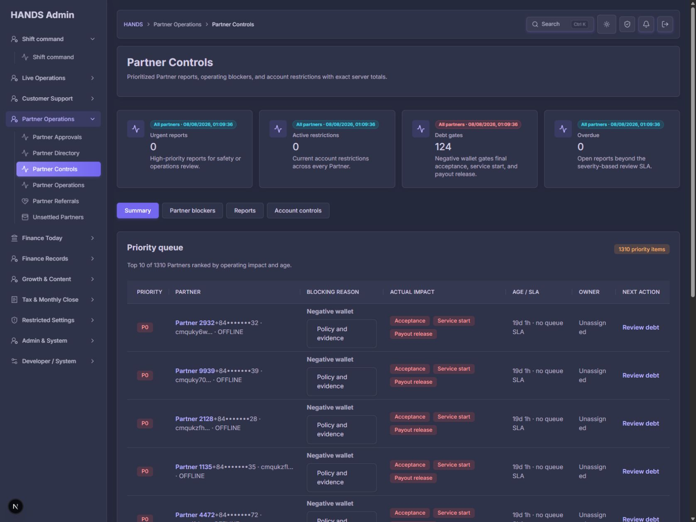

좋아진 점:

- 네 핵심 지표가 모두 클릭 가능한 drill-down이다.
- Debt gates 설명이 acceptance, service start, payout release에 미치는 영향을 바로 알려준다.
- 정확한 집계 생성 시각이 제공된다.
- 내부 workspace 탭이 첫 화면에서 바로 보인다.

남은 문제:

1. 모든 카드가 같은 `All partners · timestamp`를 반복한다. 화면 공간을 사용하면서 비교에는 도움이 되지 않는다.
2. Debt gates 카드에서는 timestamp/scope badge가 위험색으로 표시된다. 위험한 것은 timestamp가 아니라 124건의 Debt gates다.
3. `Urgent reports 0`과 `Overdue 0`은 보이지만 API가 이미 제공하는 전체 open/investigating 보고서 수 `openReports`는 보이지 않는다.
4. `1310 priority items`가 아래에서 보이지만 Summary의 124 debt 및 health signals와 어떤 관계인지 설명이 없다.

권장 수정:

- 생성 시각은 Page actions의 `Updated ... / Refresh` 한 곳으로 이동한다.
- scope는 neutral로 유지하고 값 또는 상태 badge만 위험색을 사용한다.
- `Reports needing review`를 전체 open/investigating 수로 표시하고, 그 안에 urgent/overdue 하위 수치를 함께 보여준다.
- `priority items`를 `Partners with blockers`로 바꾸고 “한 파트너당 가장 영향이 큰 blocker 하나를 표시”한다고 명시한다.

### Step 2. Summary 하단 — 상태: 데이터는 유용, 실행 경로 부족

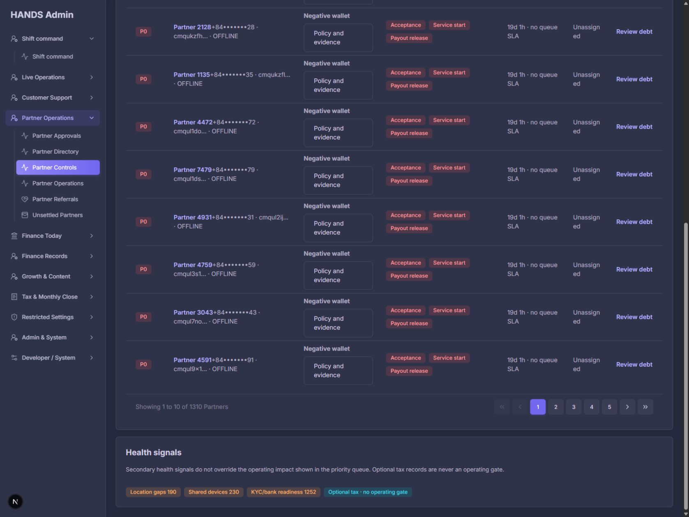

좋아진 점:

- Priority queue와 Health signals를 분리해 보조 신호가 운영 gate를 덮어쓰지 않도록 했다.
- Optional tax가 운영 gate가 아님을 명시한 점은 정책 오해를 막는다.
- 정확한 페이지네이션을 제공한다.

남은 문제:

1. `KYC/bank readiness 1252`는 서로 다른 두 작업을 합친 수치다. KYC 검토와 bank approval은 담당자와 해결 방법이 다르다.
2. Location gaps, Shared devices, KYC/bank readiness가 모두 badge일 뿐 상세 큐로 바로 이동하지 않는다.
3. 1,310은 “이슈 개수”가 아니라 후보 파트너를 한 번씩 세고 최상위 risk만 선택한 값이다. 현재 `priority items`는 중복·집계 기준을 오해하게 한다.
4. Optional tax 안내는 중요하지만 상태 badge처럼 보일 필요는 없다. 설명 문장에 남기는 편이 더 조용하다.

권장 수정:

- KYC와 bank readiness를 별도 집계·링크로 제공하거나 최소한 `KYC or bank gap`이라고 정확히 쓴다.
- Location/KYC/Bank는 해당 Partner blockers 필터 링크로 연결한다.
- Shared devices에 실제 검토 경로가 없다면 클릭 가능한 상세 경로를 제공하거나 Summary에서 제거한다.

### Step 3. Partner blockers 기본 — 상태: 구조 양호, 우선순위 의미 불명확

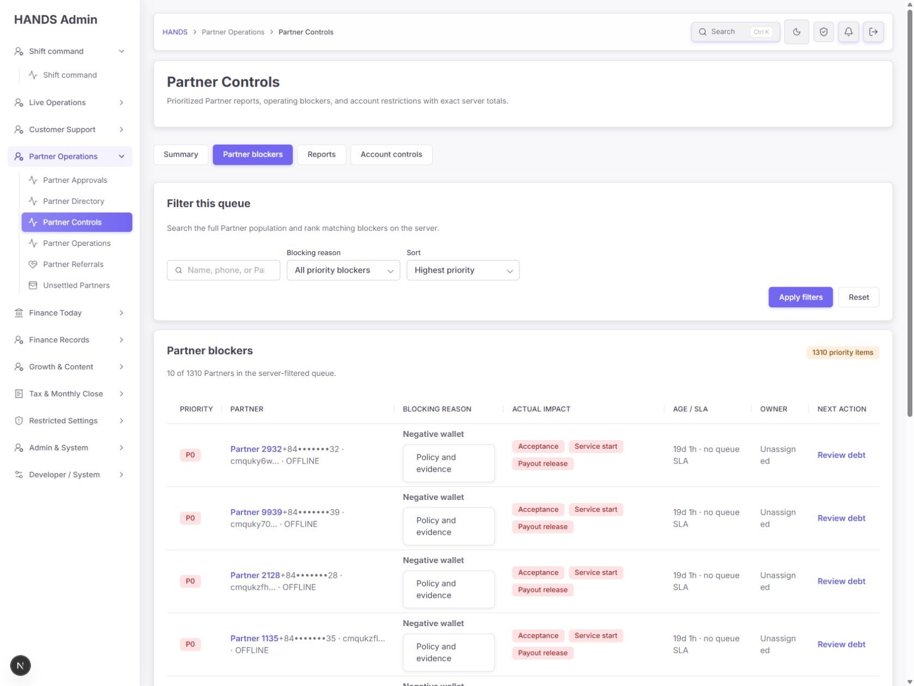

좋아진 점:

- Search, Blocking reason, Sort 세 필터만 남겨 기본 조작이 단순하다.
- 서버 전체 1,310건과 현재 10건을 구분한다.
- Blocking reason, Actual impact, Next action이 한 행에 연결된다.
- 정책 문구를 native disclosure로 숨겨 기본 행 높이를 제한하려는 방향은 적합하다.

남은 문제:

1. 모든 negative wallet이 금액·업무 배정과 관계없이 숫자 90으로 고정돼 `P0`가 된다.
2. 동시에 `no queue SLA`, `Unassigned`라고 표시돼 P0의 긴급성이 무엇을 의미하는지 모순된다.
3. Owner 칼럼이 좁아 `Unassigned`가 두 줄로 부자연스럽게 잘린다.
4. debt amount는 의사결정에 중요한데 `Policy and evidence`를 열어야만 볼 수 있다.
5. `Review debt`는 파트너 문맥 없이 일반 `/cash-settlements`로 이동한다.
6. 필터의 Apply/Reset이 오른쪽 끝에 떨어져 있고 필드와 버튼 사이에 큰 빈 공간이 생긴다.

권장 수정:

- `Priority`를 `Impact tier`로 바꾸고 `P0 · work/payout blocked`, `P2 · readiness gap`처럼 의미를 함께 쓴다.
- SLA가 있는 report와 SLA가 없는 policy gate를 같은 `Age / SLA` 문구로 강제하지 않는다.
  - report: `Age · SLA / overdue`
  - wallet/restriction: `Last changed` 또는 실제 gate 시작 시각
  - 추적 시각 없음: `Start time not tracked`
- 실제 개인 owner가 없는 정책 lane은 `Unassigned` 대신 코드에서 근거가 있는 responsible queue/team을 표시하거나 칼럼명을 `Responsible queue`로 바꾼다.
- negative wallet amount를 행에 직접 표시한다.
- cash settlement/payout action은 가능한 기존 검색 파라미터나 partner finance section을 사용해 대상 파트너 문맥을 유지한다.
- 필터 버튼을 마지막 select 바로 뒤에 배치한다.

### Step 4. Negative wallet 필터 — 상태: 건수는 정확, URL과 행 문맥 개선 필요

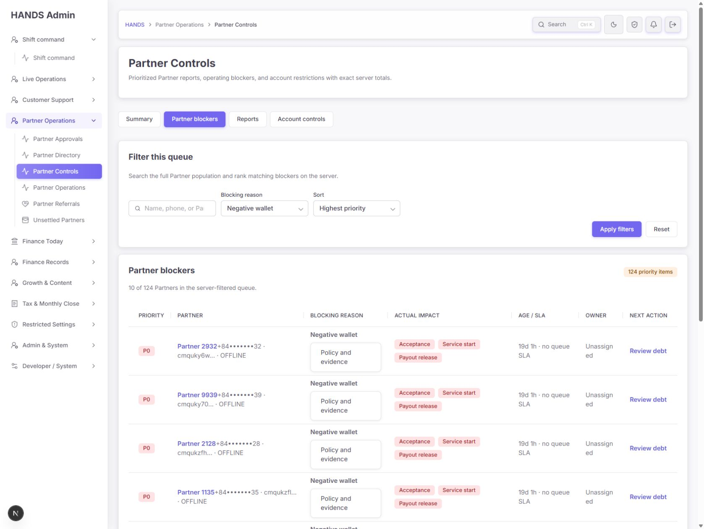

- 건수는 Summary의 Debt gates 124와 일치한다.
- 하지만 native GET 제출 후 주소가 다음처럼 불필요한 기본값을 포함한다.

```text
/partner-controls?details=controls&q=&review=cash-debt&sort=priority
```

목표 주소는 다음처럼 canonical해야 한다.

```text
/partner-controls?details=controls&review=cash-debt
```

Workspace 이동 시에도 `sort=priority`를 Summary나 Account controls로 운반하지 않아야 한다. Reports/Blockers의 `priority`와 Account controls의 `newest/oldest`는 허용값이 다르기 때문이다.

### Step 5. Reports 기본 — 상태: 시각 구조 양호, SLA 의미 오류 P0

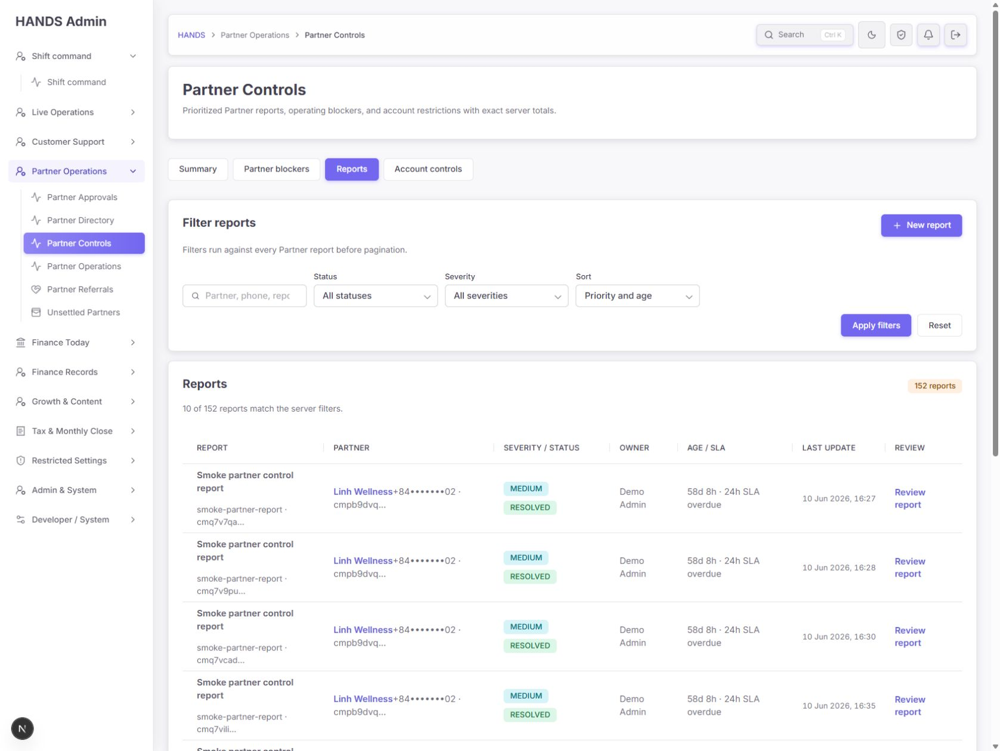

현재 목록은 대부분 `RESOLVED`인데도 모든 행에 `58d 8h · 24h SLA overdue`가 표시된다. Summary는 Overdue 0이며, Open 필터도 실제 0건이다.

코드 원인:

- `page.tsx`의 `reportAgeSlaLabel()`이 report status를 확인하지 않고 현재 시각과 createdAt 차이만 계산한다.
- API의 실제 overdue predicate는 OPEN/INVESTIGATING 상태에만 적용된다.

수정 요구:

- `OPEN`, `INVESTIGATING`에만 현재 SLA/overdue를 표시한다.
- `RESOLVED`, `DISMISSED`에는 `Closed`와 종료 시각 또는 실제 처리시간을 표시한다.
- Reports 기본 workspace는 운영용 Active queue(OPEN + INVESTIGATING)를 먼저 보여주고, Resolved/Dismissed는 History로 분리하는 것을 권장한다.
- All statuses가 필요하면 명시적으로 선택하도록 한다.

### Step 6. New report — 상태: 기능은 있음, 잘못된 대상·분류 선택 위험

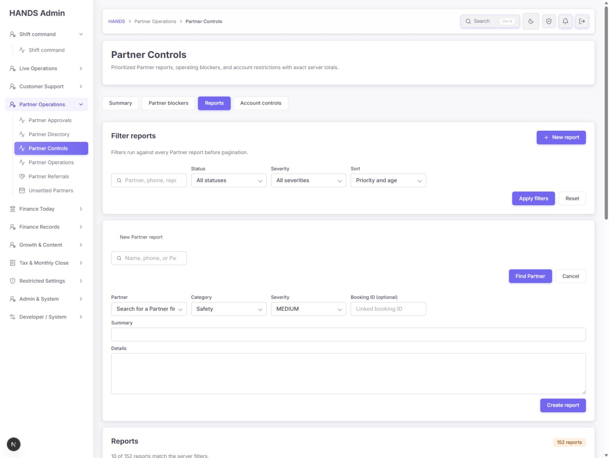

좋아진 점:

- Partner, category, severity, booking ID, summary, details를 한 화면에서 작성한다.
- phone과 ID를 함께 보여 동명이인 구분에 도움을 준다.
- booking 연결은 optional로 명시된다.

남은 문제:

1. `Search for a Partner first`라고 표시하면서 검색 전에도 임의의 20명 옵션을 내려받고 노출한다.
2. Category가 자동으로 Safety, Severity가 MEDIUM으로 선택돼 운영자가 확인 없이 잘못 저장할 수 있다.
3. Summary/Details에 필수 여부, 작성 기준, 남은 글자 수가 없다.
4. 저장 실패 시 generic notice로 redirect되고 New report form이 닫히면서 긴 Details 초안이 사라진다.
5. 검색 버튼이 입력란과 멀리 떨어져 있다.

권장 수정:

- 최소 검색어 입력 후에만 matching Partner를 제공하거나, 검색 전 20명을 유지하려면 placeholder를 `Select a Partner or search`처럼 사실적으로 바꾼다.
- Category와 Severity는 `Select ...` placeholder를 사용해 명시적 선택을 요구한다.
- 기존 restriction form의 `useActionState` 패턴을 재사용해 report 생성 실패 시 입력값과 필드를 유지한다.
- Summary에 `Required · one-line incident description`, Details에 evidence 작성 안내를 제공한다.

### Step 7. Report review — 상태: 읽기 쉬움, 상태 변경 안전장치 부족

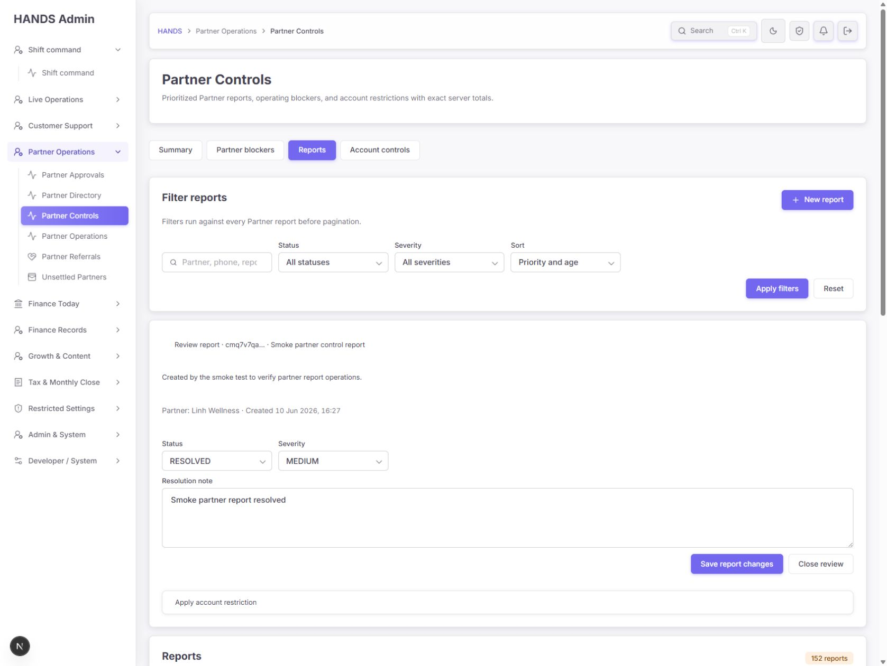

좋아진 점:

- report ID, summary, partner, created time, resolution note를 한 패널에 모았다.
- account restriction은 별도 disclosure 아래 두어 일반 report update와 분리했다.
- 제한 적용에는 영향 preview, reason/evidence, expiry/no-expiry, 대상 확인이 있다.

남은 문제:

1. RESOLVED/DISMISSED로 저장할 때 resolution note가 필수가 아니다. API helper도 빈 note를 허용한다.
2. 상태나 severity 변경 이유는 별도로 수집하지 않는다.
3. New report 링크가 현재 `reviewReportId`를 보존하고, Review report 링크는 현재 `newReport=1`을 보존한다. 두 editor가 동시에 열릴 수 있다.
4. selected report는 현재 report page의 10개 items 안에서만 찾는다. 공유 deep link에서 해당 report가 현재 페이지에 없으면 review panel이 표시되지 않는다.
5. 보고서의 생성자/수정자/상태 변경 history를 패널에서 볼 수 없다.

수정 요구:

- RESOLVED/DISMISSED는 resolution note를 UI와 API trust boundary 모두에서 필수로 한다.
- New report를 열 때 `reviewReportId`를 제거하고, report review를 열 때 `newReport`를 제거한다.
- reviewReportId는 current page items 의존이 아니라 ID 단건 fetch로 불러온다.
- 상태·severity 변경 audit trail을 상세 패널에서 최소 최근 항목으로 확인 가능하게 한다.

### Step 8. Active Account controls — 상태: 빈 상태 양호

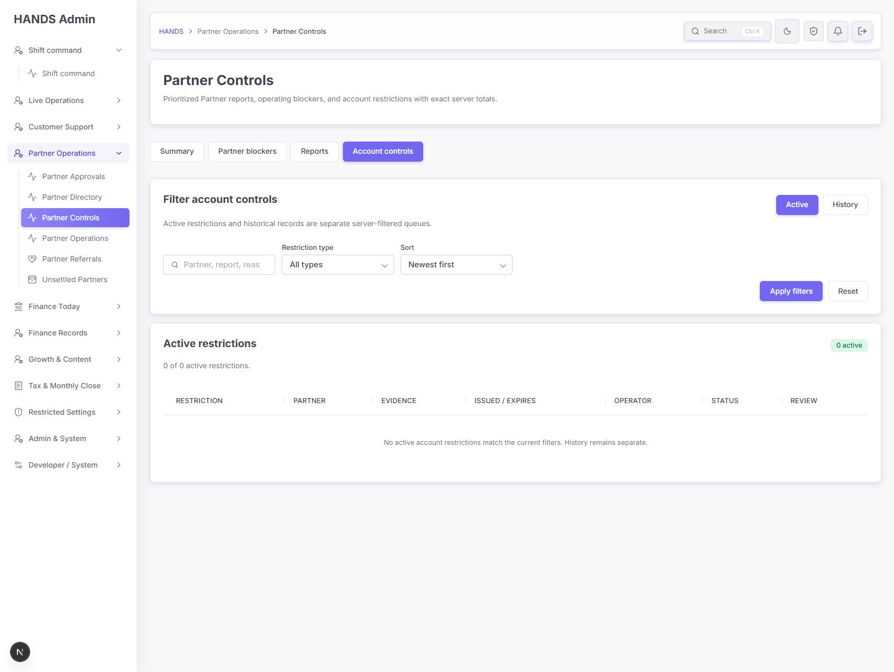

좋아진 점:

- Active와 History가 별도 server-filtered queue로 분리된다.
- 0 active를 성공 tone으로 표현한다.
- empty state에서 History가 별도라는 사실을 알려준다.

개선:

- 필터가 전혀 없는 0건이면 `No active restrictions.`로 간결하게 표시한다.
- 실제 필터가 적용된 0건일 때만 `No active restrictions match these filters`를 사용한다.
- Active count 0일 때도 History 이동은 현재 상단 탭으로 충분하므로 별도 CTA는 필요 없다.

### Step 9. Restriction history — 상태: 조회성 양호, 해제 사유 누락 P1

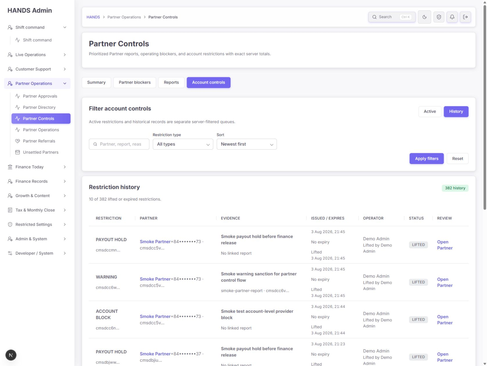

History는 restriction type, Partner, 발행 evidence, 시작/만료/해제 시각, 발행·해제 operator를 보여준다. 그러나 “왜 해제했는가”가 없다.

코드상 `liftProviderSanction`은 빈 body를 보내며 API도 actor/time만 저장한다. Account block 해제는 matching·work·payout 접근을 복원할 수 있으므로 사유 없는 해제는 운영 감사 추적에 부족하다.

수정 요구:

- Lift confirmation에서 `Lift reason and evidence`를 필수 입력한다.
- 최소 길이와 최대 길이를 기존 sanction reason 정책과 같은 수준으로 검증한다.
- API DTO/service에서도 reason을 필수 검증하고 audit metadata에 저장한다.
- 가능하면 sanction record에도 lift reason을 보존해 History에서 보여준다.
- active restriction 데이터가 없어 실제 lift dialog 화면은 이번 감사에서 시각 검증하지 못했다.

### Step 10. Open Reports 빈 상태 — 상태: 양호

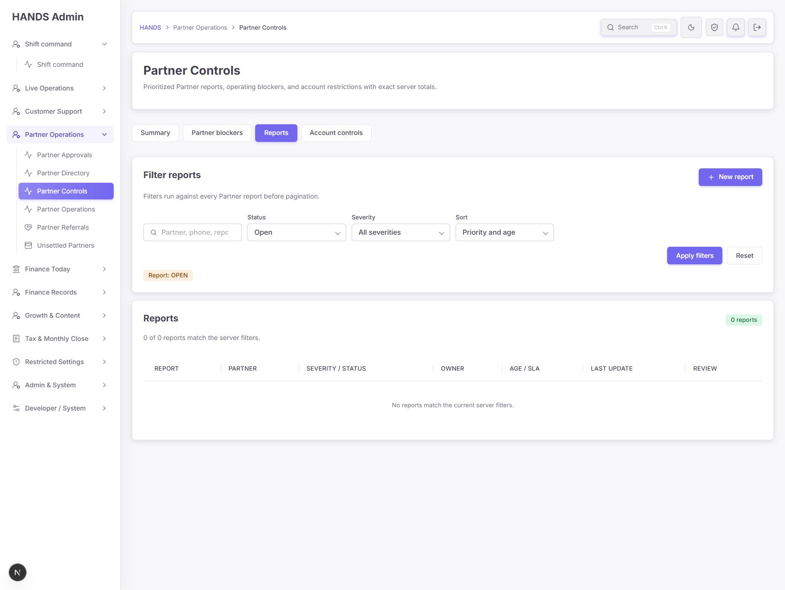

- Open 0건을 표와 상태 badge로 일관되게 표시한다.
- 활성 필터 chip이 현재 상태를 알려준다.
- New report와 Reset 동선이 있다.

개선:

- 기본 Reports를 Active queue로 변경하면 이 빈 상태가 기본으로 나타나므로 `No reports need triage.` 같은 완료형 문구가 더 적절하다.
- History로 이동하는 secondary action을 제공하면 종료 기록 접근이 쉬워진다.

### Step 11. 우선순위 전환 — 상태: 데이터 계층은 보임, 의미와 담당자 부족

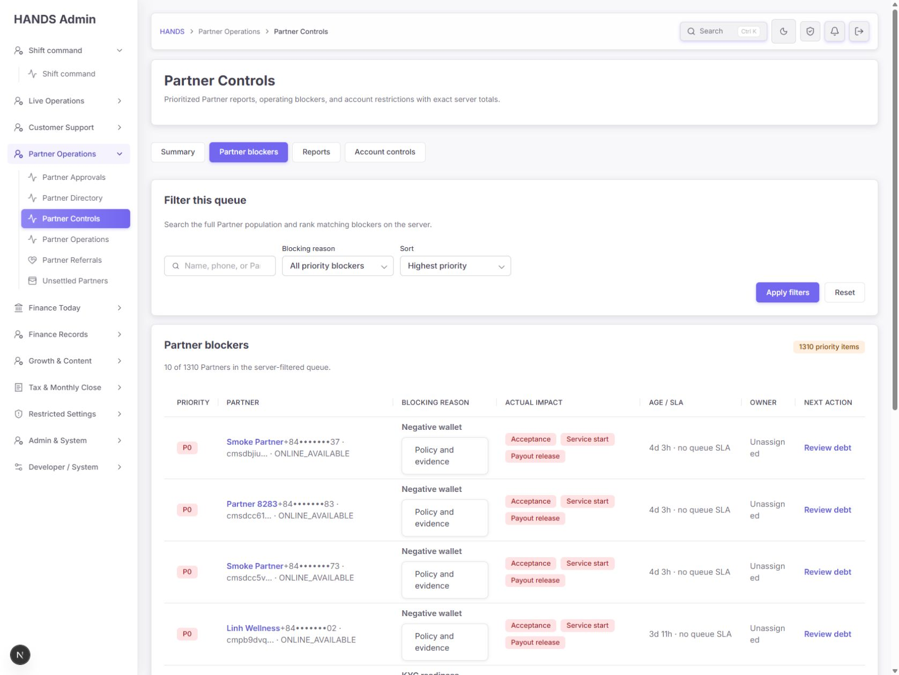

124번째 debt 이후 KYC readiness가 P2로 이어진다. 이 화면으로 현재 알고리즘이 한 파트너당 하나의 최상위 risk만 보여준다는 사실을 확인했다.

문제:

- `P0/P2`만으로는 긴급 incident인지 단순 policy impact tier인지 알 수 없다.
- KYC는 모두 `Age unavailable · no queue SLA`, `Unassigned`다.
- 어떤 KYC 단계가 막혔고 Partner와 Operator 중 누가 행동해야 하는지 없다.

권장:

- KYC row는 `Partner: submit missing KYC`, `Operator: review submitted KYC`처럼 실제 상태에 근거한 next owner/action을 표시한다.
- startedAt를 확보할 수 없으면 SLA 문구를 제거하고 `Start time not tracked`를 데이터 품질 신호로 표시한다.

### Step 12. KYC readiness 행 — 상태: 실제 영향은 명확, 반복 문구 과다

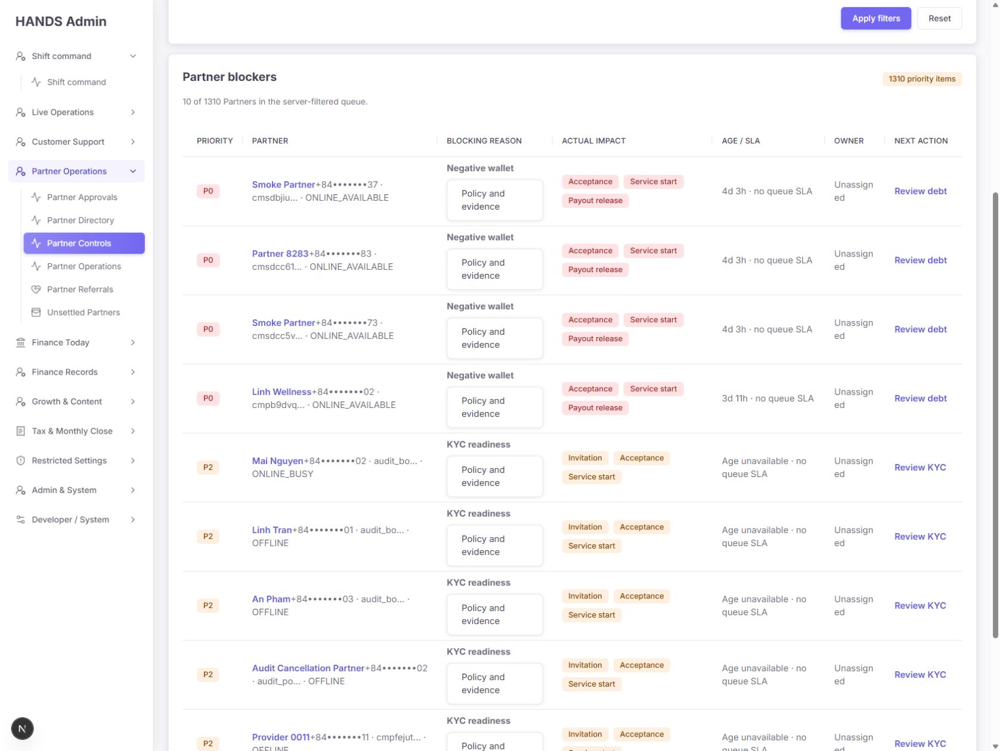

- Invitation/Acceptance/Service start 영향은 명확하다.
- 하지만 각 행에서 `KYC readiness`, 동일 impact badge, `Age unavailable`, `Unassigned`가 반복돼 스캔 효율이 낮다.
- Policy and evidence를 모든 행에 큰 버튼처럼 제공해 table density를 높인다.

권장:

- 정책 설명은 table 상단에 lane-level explanation으로 한 번 보여주고, 행에는 해당 파트너의 실제 evidence만 펼친다.
- Owner와 Next action을 합쳐 `Next owner / action` 하나로 만드는 것이 1692px에서도 더 읽기 쉽다.

### Step 13. KYC 필터 결과 — 상태: 미통과, P0

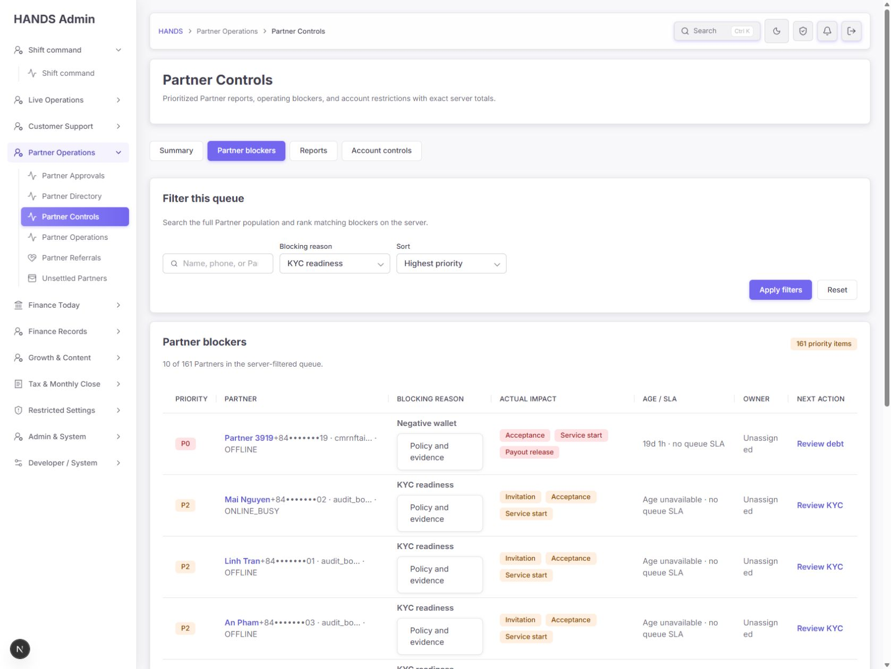

`Blocking reason = KYC readiness`가 선택됐지만 첫 행은 `Negative wallet`이다.

코드 원인:

1. `adminPartnerControlProviderWhere(..., 'kyc')`가 KYC 미승인 파트너 후보를 선택한다.
2. 그 뒤 `adminPartnerControlRisk(candidate)`가 requested review를 전달받지 않는다.
3. risk 함수는 account block → negative wallet → payout hold → report → KYC 순서로 다시 최상위 risk를 선택한다.
4. 따라서 KYC가 미완료이면서 wallet도 음수인 파트너는 KYC 필터 안에서 Negative wallet로 표시된다.

수정 요구:

- `review=attention`일 때만 파트너의 최상위 risk를 선택한다.
- 구체 reason filter에서는 해당 lane의 risk를 계산해 표시한다.
- Account block, cash debt, payout hold, report, overdue, KYC, bank, location 각각 “선택한 필터와 모든 row kind가 일치”하는 API 회귀 테스트를 추가한다.
- totalCount도 화면에 실제 표시되는 해당 reason 행 수와 일치해야 한다.

## 4. 우선순위별 수정 목록

### P0 — 잘못된 운영 판단 방지

1. **Blocking reason 필터와 row kind 일치**
   - 특정 lane에서는 해당 risk만 생성한다.
   - 모든 reason별 API 테스트 추가.

2. **종료 report의 SLA overdue 제거**
   - OPEN/INVESTIGATING만 SLA clock 적용.
   - RESOLVED/DISMISSED는 closed outcome 표시.

### P1 — 감사 추적과 핵심 작업 안전성

3. **Restriction lift reason 필수화**
   - UI, DTO, service, audit metadata, History 표까지 연결.

4. **RESOLVED/DISMISSED resolution note 필수화**
   - UI와 API 양쪽 검증.

5. **Priority queue 의미 재정의**
   - `priority items` → `Partners with blockers`.
   - `Priority` → `Impact tier`.
   - deduplicated/highest risk 기준 설명.

6. **Owner와 시간 문구를 blocker 종류별로 정확히 표시**
   - report assignment와 policy queue를 구분.
   - SLA 없는 항목에 `no queue SLA`를 반복하지 않음.

7. **New report와 Review report 상태 상호 배제**
   - 한 editor를 열면 다른 query state 제거.

8. **Report deep link 단건 fetch**
   - current page의 10개 items에 의존하지 않음.

9. **Report 생성 실패 시 초안 보존**
   - 기존 restriction form action-state 패턴 재사용.

10. **mode-specific load/error 처리**
    - Summary API 실패가 Reports/Account controls 성공 목록을 실패로 오인시키지 않게 함.
    - 현재 `summaryResult.ok`가 모든 mode의 ok 계산에 포함되고 summary를 모든 mode에서 불필요하게 fetch함.

11. **Partner 문맥을 유지하는 Next action**
    - debt/payout 링크가 대상 Partner를 잃지 않게 기존 지원 query 또는 partner detail section 사용.

### P2 — 스캔 속도와 일관성

12. GET 필터에서 빈 값과 기본 sort 제거.
13. workspace 간 허용되지 않는 sort parameter 전달 금지.
14. Category/Severity를 명시적 선택으로 변경.
15. 검색 전 arbitrary 20 Partner 노출과 placeholder 모순 제거.
16. 필터 action을 입력 필드 가까이 정렬.
17. 반복 timestamp를 page-level Updated로 이동.
18. KYC/bank health signal 분리 및 관련 큐 링크 제공.
19. table의 Owner와 Next action을 합쳐 wrapping 감소.
20. lane 공통 Policy 설명은 table 상단 한 번, row에는 실제 evidence 중심으로 축소.

## 5. 권장 문구

| 현재 | 권장 |
|---|---|
| `1310 priority items` | `1,310 Partners with blockers` |
| `Priority` | `Impact tier` |
| `Age unavailable · no queue SLA` | `Start time not tracked` |
| `Unassigned` (policy blocker) | `Responsible queue not set` 또는 근거 있는 팀/주체 |
| `Reports` 기본 | `Reports needing review` |
| `No reports match the current server filters.` (기본 active 0건) | `No reports need triage.` |
| `Search for a Partner first` + 20 options | 검색 전 options 제거 또는 `Select a Partner or search` |
| `All partners · timestamp` 카드별 반복 | page-level `Updated {time}` |

## 6. 코드 기준 root-cause 위치

- `apps/api/src/admin/admin.service.ts`
  - `listPartnerControlProviders()`: 후보 필터 후 `adminPartnerControlRisk(candidate)`를 review 없이 호출.
  - `adminPartnerControlRisk()`: 고정 risk 우선순위와 owner fallback.
  - `liftProviderSanction()`: lift reason을 받거나 저장하지 않음.
  - `adminProviderReportListWhere()`: status가 없으면 history까지 모두 포함.

- `apps/api/src/admin/admin-provider-control-helpers.ts`
  - `normalizeProviderReportUpdateInput()`: RESOLVED/DISMISSED에도 빈 resolutionNote 허용.

- `apps/admin_web/app/partner-controls/page.tsx`
  - `reportAgeSlaLabel()`: report status와 무관하게 overdue 계산.
  - `newReportHref`와 review link가 상호 editor query를 제거하지 않음.
  - selectedReport가 current report page items에서만 검색됨.
  - `priorityLabel()`, `riskAgeLabel()`이 의미가 다른 blocker를 동일 포맷으로 표현.
  - New report의 Partner options와 Category/Severity defaults.

- `apps/admin_web/app/partner-controls/partner-control-page-load-plan.ts`
  - summary를 모든 workspace에서 fetch.
  - workspace 이동 시 `sort`를 mode 구분 없이 보존.

- `apps/admin_web/app/partner-controls/actions.ts`
  - report 실패 시 redirect로 draft 손실.
  - lift API에 빈 body 전송.

## 7. 접근성 및 운영 가독성

확인된 장점:

- 내부 workspace와 Active/History에 `aria-current="page"`가 있다.
- 모든 주요 form control에 visible label이 있다.
- table column header가 semantic header로 노출된다.
- Policy and evidence, report editor, restriction flow가 native disclosure를 사용한다.
- 상태를 색상만이 아니라 P0, RESOLVED, LIFTED 등 텍스트로도 표시한다.
- phone을 마스킹한다.
- restriction 적용에 명시적 대상 확인 checkbox가 있다.
- 오류 notice는 alert, 성공 notice는 status를 사용한다.

남은 위험:

- 좁은 Owner 칼럼 때문에 단어가 부자연스럽게 줄바꿈되어 읽기 흐름이 끊긴다.
- P0 색과 값만으로 의미를 전달하며 P0의 정의가 화면에 없다.
- Summary scope timestamp에 위험색을 사용해 색의 의미가 잘못 연결된다.
- 동일 Policy button과 badge가 반복돼 키보드 focus stop과 낭독량이 커질 수 있다.
- 실제 keyboard-only 전체 순회, screen reader 낭독 순서, 색 대비 수치 측정은 수행하지 않았다. 따라서 WCAG 전체 준수 판정은 하지 않는다.

## 8. 구현 후 수용 기준

- [ ] KYC 필터 결과에는 KYC readiness row만 나온다.
- [ ] 모든 blocking reason filter와 row kind가 일치한다.
- [ ] totalCount가 해당 lane의 실제 표시 가능한 row 수와 일치한다.
- [ ] RESOLVED/DISMISSED report에 current overdue가 표시되지 않는다.
- [ ] OPEN/INVESTIGATING에만 severity SLA가 적용된다.
- [ ] RESOLVED/DISMISSED 저장 시 resolution note가 UI/API 모두에서 필수다.
- [ ] restriction lift에 reason/evidence가 필수이며 History에서 확인할 수 있다.
- [ ] New report와 Review report editor가 동시에 열리지 않는다.
- [ ] 공유 reviewReportId URL이 current page와 무관하게 해당 report를 연다.
- [ ] report 생성 실패 후 Partner/category/severity/summary/details가 유지된다.
- [ ] Summary 실패가 성공한 Reports/Account controls를 실패로 표시하지 않는다.
- [ ] filter URL에 `q=`와 기본 `sort=priority/newest`가 남지 않는다.
- [ ] workspace 이동 시 허용되지 않는 sort가 전달되지 않는다.
- [ ] debt/payout Next action이 대상 Partner 문맥을 유지한다.
- [ ] Summary 생성 시각은 한 번만 표시된다.
- [ ] 1440px 이상에서 표 가로 overflow가 없고 Owner 단어가 한 글자 단위로 깨지지 않는다.
- [ ] 기존 exact totals, pagination, restriction confirmation, error-vs-empty 구분은 유지된다.

## 9. 자동 테스트 결과

- Admin web Partner Controls 관련: **9 files, 29 tests passed**
- API partner control/report/sanction 관련: **2 files, 10 tests passed, 557 skipped by name filter**

현재 테스트는 통과하지만 다음 의미 오류를 검증하지 않는다.

- 특정 blocking reason filter와 반환 row kind의 일치
- RESOLVED report의 SLA 문구
- resolution note 필수 조건
- lift reason 필수 조건
- newReport/reviewReportId 상호 배제
- current page 밖 report deep link
- mode-specific load failure

## 10. 증거 범위와 한계

- 로그인된 실제 관리자 세션과 현재 서버 데이터를 사용했다.
- Active restrictions가 0건이라 실제 lift confirmation dialog는 화면으로 검증하지 못하고 코드로 확인했다.
- Open reports가 0건이라 실제 OPEN/INVESTIGATING row의 SLA 표시와 report 처리 저장은 실행하지 않았다.
- 제한 생성·해제, report 생성·수정처럼 데이터를 바꾸는 작업은 감사 중 실행하지 않았다.
- API 장애를 인위적으로 발생시키지 않아 load notice의 실제 시각 상태는 코드로만 확인했다.
- 1692px에서 document/table overflow를 측정했으며, 요청에 따라 1024px 이하 화면은 검사하지 않았다.
