# Partner-to-Customer Evaluations 운영자 UX 심층 감사 보고서

- 대상: `http://localhost:3101/reviews/partner-customer-evaluations`
- 감사 일자: 2026-08-06 (UTC+7)
- 범위: 로그인된 실제 화면, 기본/전체 기간/검색/빈 결과/비정상 페이지, 1024×768·1265×720·1440×900 반응형 화면, 연결된 관리자 웹·API·데이터 모델
- 관점: 내부 고객 메모를 조회하고 사실관계·민감도·신뢰성을 판단하는 실제 운영자
- 안전 원칙: 읽기 전용 조회만 수행했다. 평가 작성·수정·상태 변경 등 데이터 mutation은 실행하지 않았다.

## 1. 결론

현재 페이지는 “파트너가 완료된 예약 뒤 고객에 대해 남긴 내부 텍스트 메모”를 한곳에서 검색하는 읽기 전용 목록이다. 데이터 생성 단계에는 다음과 같은 좋은 보호 장치가 있다.

- 선택된 파트너만 작성할 수 있다.
- 완료된 booking에만 작성할 수 있다.
- booking당 하나만 작성할 수 있다.
- 공백을 제거하고 1000자로 제한한다.
- 고객 앱에는 노출되지 않는다.

하지만 관리자 화면은 운영 도구라기보다 **정적 설명이 붙은 데이터 조회표**에 가깝다. 실제 전체 데이터는 2건뿐이며 같은 기록이 이미 Booking, Customer, Partner 상세에 표시된다. 그럼에도 별도 사이드바 메뉴와 페이지가 존재하지만 이 페이지에서만 가능한 업무는 검색 외에 없다.

따라서 제품 구조에 대한 권장은 명확하다.

> **현재처럼 읽기 전용이라면 별도 1차 메뉴에서 제거하고 Customer/Booking 상세의 `Partner notes`로 통합하는 편이 낫다.**

별도 페이지를 유지하려면 단순 조회표가 아니라 `Partner notes about customers`라는 글로벌 조사·검토 큐로 역할을 분명히 해야 한다. 그 경우 상태, 검토 사유, 검토자, 처리 시각, 반복 이력, 접근·보존 정책이 필요하다. 고객 리뷰와 같은 공개 콘텐츠로 합쳐서는 안 된다. 두 데이터는 대상·가시성·정책 위험이 다르다.

가장 중요한 결함은 다음과 같다.

1. `All dates`가 `/reviews/partner-customer-evaluations`로 이동하지만 기본 URL은 다시 Today로 정규화된다. 전체 기간은 빈 Custom dates를 통해서만 우회 접근할 수 있다.
2. list 또는 summary API가 실패해도 `adminGet(..., [])` fallback 때문에 0건으로 표시된다. 운영자는 장애와 실제 0건을 구분할 수 없다.
3. `page=99`처럼 범위를 벗어난 URL에서는 “Showing 2 of 2 / 2 evaluations”라고 표시하면서 표는 비어 있고 footer는 “0 to 0 of 2”가 된다.
4. 1024px에서 실제 평가 문구 열이 완전히 화면 밖으로 사라지고, 1440px에서도 표가 268px 넘친다.
5. 데이터 모델에는 `status`, `reportReason`, `moderatedAt`이 있고 `REPORTED` 평가는 고객의 reported review count에 합산되지만, 화면은 이 상태와 사유를 전혀 표시하거나 변경하지 못한다.
6. 파트너가 작성한 고객 메모는 편향·모욕·민감정보·사실 오류가 포함될 가능성이 있는 고신뢰 데이터인데, flag/restrict/review history가 없다.

## 2. 실제 데이터와 화면 상태

감사 시점에 확인한 데이터:

| 범위 | 결과 |
|---|---:|
| 기본 `/reviews/partner-customer-evaluations` | Today, 0건 |
| 빈 Custom dates | 2건 |
| 검색 `refunded` + 빈 Custom dates | 1건 |
| 존재하지 않는 검색어 | 0건 |
| 빈 Custom dates + `page=99` | total 2이지만 표시 행 0 |

현재 두 기록은 같은 고객에 대해 서로 다른 파트너가 작성했으며, 각각 refunded/completed booking 문맥의 내부 평가 문구를 포함한다.

표 실측:

| viewport | 사용 가능한 표 폭 | 실제 표 폭 | 초과 폭 |
|---|---:|---:|---:|
| 1024×768 | 660px | 1320px | 660px |
| 1265×720 | 892px | 1320px | 428px |
| 1440×900 | 1052px | 1320px | 268px |

## 3. 단계별 운영 흐름 평가

### 1) 페이지 진입 — 위험

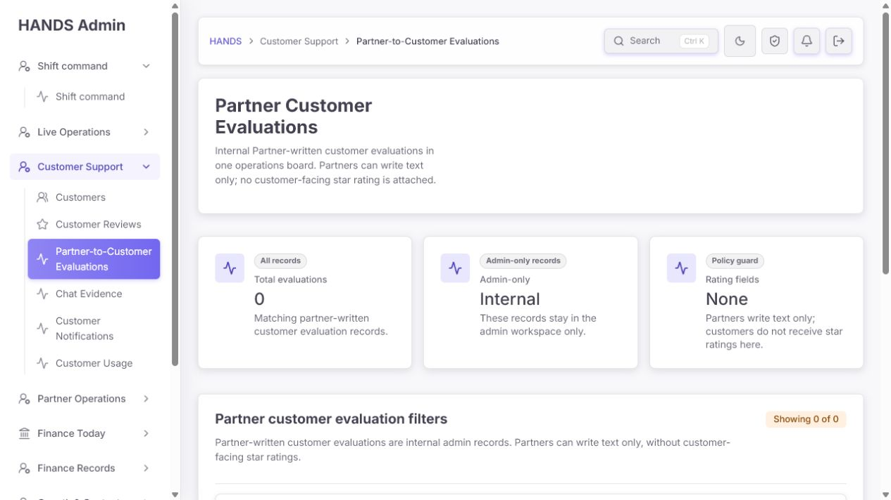

기본 화면에는 0건과 함께 다음 세 개의 큰 카드가 표시된다.

- Total evaluations: 0
- Admin-only: Internal
- Rating fields: None

문제:

- 페이지는 전체 내부 평가 보드처럼 설명되지만 실제 기본 범위는 Today다.
- 당일 데이터가 없으면 “전체 시스템에 기록이 없다”고 오해하기 쉽다.
- `All dates` 링크는 기본 URL과 같고 기본 URL이 Today로 해석되므로 작동 계약이 모순된다.
- `Admin-only`, `Rating fields None`는 지표가 아니라 변하지 않는 정책 설명이다. 큰 카드로 매번 공간을 차지할 이유가 없다.

수정:

- 기본 URL을 All dates로 통일한다.
- Admin-only는 제목 옆 `Internal` 배지와 한 줄 정책 안내로 축소한다.
- Rating fields 카드는 제거한다. 별점이 없다는 사실은 테이블 구조 자체로 충분하다.
- 화면 첫 진입에서 실제 업무인 검색과 메모 목록이 첫 viewport 안에 보여야 한다.

### 2) 페이지 목적과 명칭 — 위험

사이드바는 `Partner-to-Customer Evaluations`, H1은 `Partner Customer Evaluations`, 본문은 `Partner-written customer evaluations`를 사용한다. 운영자는 다음을 즉시 구분하기 어렵다.

- 파트너를 고객이 평가한 것인지
- 파트너가 고객을 평가한 것인지
- 고객 앱에 공개되는 리뷰인지
- 내부 고객 행동 메모인지

현재 실제 의미에 가장 가까운 이름은 `Partner Notes About Customers`다. `Evaluation`은 점수·등급·평판 판단을 연상시키며 고객에 대한 비공개 프로파일링처럼 받아들여질 수 있다.

권장 명칭:

- 내비게이션/H1: `Partner Notes About Customers`
- 고객 상세 탭: `Partner notes`
- 설명: `Internal notes submitted by Partners after completed bookings. Review them only with the linked booking context.`
- 배지: `Internal · Not customer-visible`

### 3) 요약 정보 — 불필요한 밀도

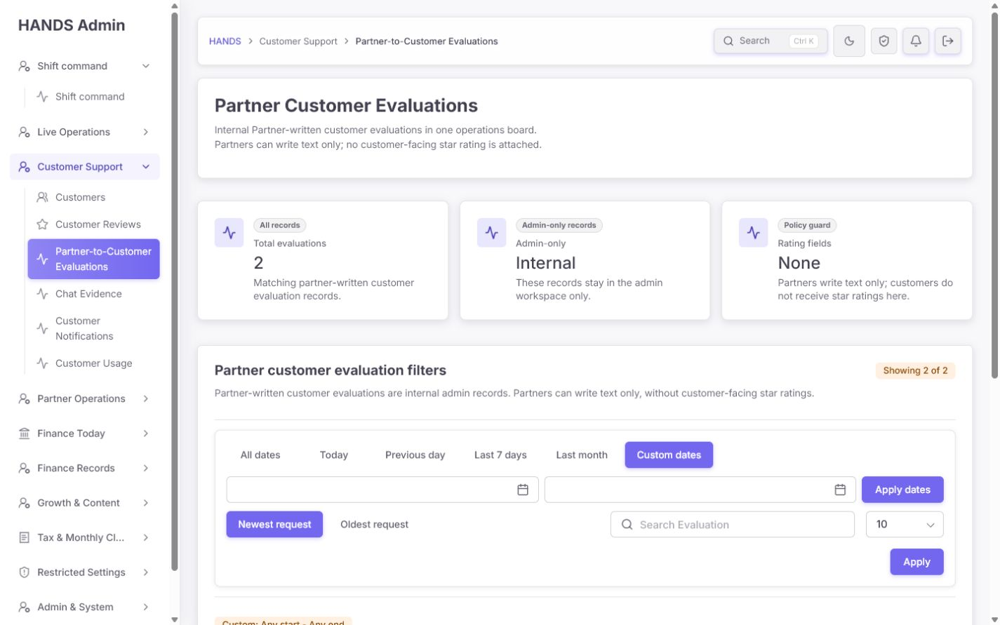

장점:

- 고객에게 별점이 전달되지 않는다는 정책을 명확히 하려는 의도는 좋다.
- 내부 전용이라는 사실을 숨기지 않는다.

문제:

- 3개 카드 중 운영 데이터는 Total evaluations 하나뿐이다.
- `Internal`, `None`은 필터와 무관한 고정 문자열이다.
- 1024px에서는 세 번째 카드가 다음 줄로 내려가 필터와 목록을 아래로 밀어낸다.
- 어떤 메모가 검토가 필요한지, 반복 고객 메모가 있는지, 마지막 제출 시각이 언제인지 보여주지 않는다.

권장:

- 별도 페이지를 유지할 때만 compact summary를 사용한다.
- 최소 구성: `2 notes · 0 needs review · 1 customer · Last submitted 16 Jul`.
- 검토 상태가 아직 없다면 억지로 지표를 만들지 말고 전체 카드 영역을 삭제한다.

### 4) 기간·정렬·검색 필터 — 위험

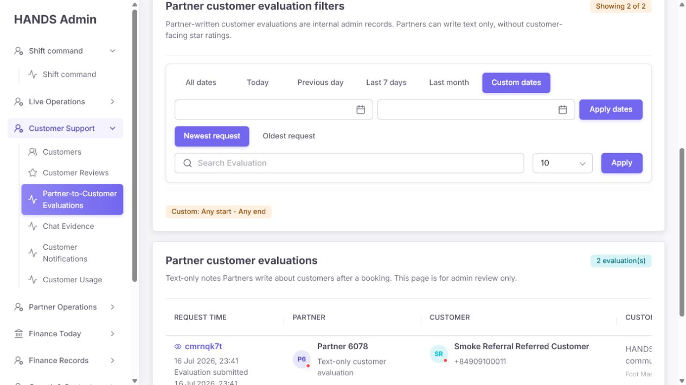

장점:

- 날짜, 검색, 정렬, page size의 기본 기능은 있다.
- `refunded` 검색이 실제 평가 문구 한 건으로 정확히 좁혀졌다.

문제:

- All dates가 기본 Today로 돌아가는 shared filter 결함을 그대로 가진다.
- 빈 Custom dates가 2건 전체를 반환하면서 `Custom: Any start - Any end`라고 표시된다.
- Date from/Date to는 접근성 이름은 있지만 화면에는 보이는 레이블이 없다.
- From > To이면 오류 대신 날짜를 조용히 뒤집는 shared 모델을 사용한다.
- `Evaluation request date`, `Newest request`는 실제 서버 동작과 다르다. 서버는 evaluation `createdAt`으로 필터·정렬하지만 표는 booking `openedAt`을 Request Time으로 먼저 보여준다.
- 필터 그룹 제목이 시각적으로 없어 운영자는 줄의 의미를 추론해야 한다.
- 검색 범위가 안내되지 않는다. 실제 API는 evaluation ID, booking ID, note, reportReason, 고객/파트너 이름·전화까지 검색한다.
- 검색 취소/초기화 버튼이 없다.

수정:

1. `Submitted date`, `Sort`, `Search` 레이블을 화면에 보이게 한다.
2. `Newest request` → `Most recently submitted`.
3. 검색 placeholder → `Search note, customer, Partner, or booking`.
4. Clear filters를 제공한다.
5. Custom empty는 All dates로 정규화한다.
6. 역전 날짜는 inline error로 안내한다.
7. API와 표 모두 evaluation.createdAt을 제출 시각 기준으로 사용한다.

### 5) 평가 목록 — 실패

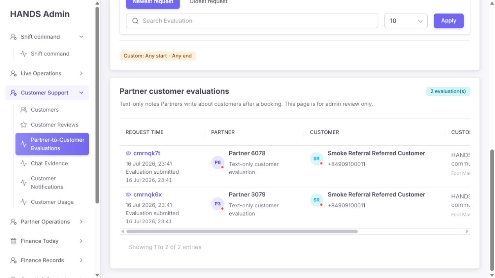

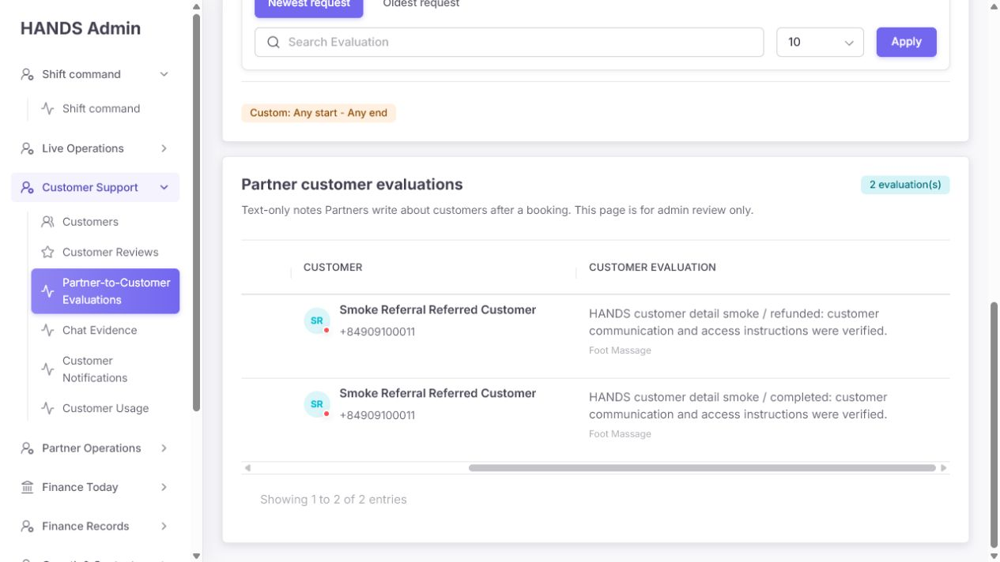

운영자가 이 페이지에 오는 이유는 평가 문구를 읽기 위해서인데, 기본 표는 가장 중요한 `Customer evaluation`을 오른쪽 밖으로 밀어낸다.

문제:

- 1320px 고정 표를 4열 페이지에도 그대로 재사용한다.
- 왼쪽에서는 booking/partner/customer를 볼 수 있지만 note가 잘린다.
- 오른쪽으로 이동하면 note는 보이지만 booking과 작성 파트너 문맥이 사라진다.
- 평가 문구가 1000자까지 가능한데 별도 상세 보기나 확장 기능이 없다.
- booking 시간과 submitted 시간이 중복되지만 어떤 값이 필터 기준인지 설명되지 않는다.
- `Text-only customer evaluation` helper가 모든 파트너 행에 반복된다.
- 고객 전화번호 전체와 현재 앱 접속 점은 평가 검토에 필수 정보가 아니다.
- 상태, report reason, moderatedAt, 검토자, 원본/정책 상태가 보이지 않는다.

권장 목록:

| 열 | 내용 |
|---|---|
| Submitted | evaluation.createdAt, booking short ID |
| Note | 2~3줄 preview, 서비스, 내부 배지 |
| Customer | 고객명, 누적 partner-note 수 |
| Author | 작성 파트너, booking 당시 역할 |
| Review state | Retained / Needs review / Restricted, reason |
| Actions | Open context / Send to review / Restrict |

- 1024px 이하에서는 table보다 stacked row 또는 master-detail을 사용한다.
- 행을 열면 우측 패널에서 전체 note, booking 상태, 제출자, 제출 시각, 상태 이력, 관련 고객 메모를 함께 보여준다.
- 전화번호는 기본 목록에서 제거하고 고객 상세에서 권한에 따라 본다.
- 현재 앱 online/offline 점을 제거한다.

### 6) 검색 결과 — 보통 이하

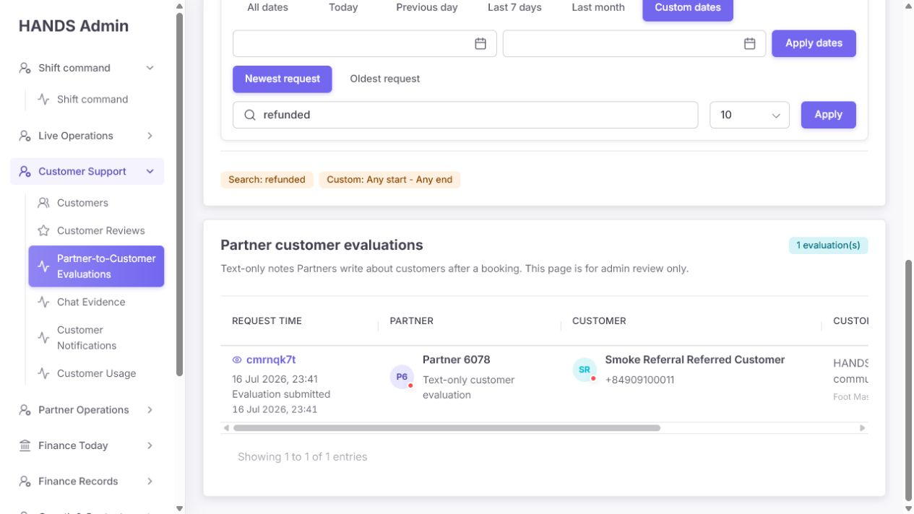

좋은 점:

- 검색어와 결과가 active chip으로 남는다.
- note 본문 검색이 동작한다.
- booking/customer/partner 링크가 보존된다.

개선점:

- `1 evaluation(s)` 문구가 어색하다.
- 검색 결과에서도 note 열이 잘려, 일치한 텍스트를 바로 확인하기 어렵다.
- 검색어 하이라이트가 없어 왜 일치했는지 판단하기 어렵다.
- API는 `reportReason`도 검색하지만 화면은 reportReason을 표시하지 않는다. 표시되지 않는 필드 때문에 검색 결과가 나올 수 있다.
- 검색 결과를 지우는 동작이 input을 직접 비운 뒤 Apply하는 것뿐이다.

권장:

- 결과 문구 `1 note`, `2 notes`.
- note preview에서 검색어를 강조하거나 일치한 줄을 우선 표시한다.
- `Clear search` 제공.
- 검색 대상 필드와 화면 표시 필드를 일치시킨다.

### 7) 빈 결과 — 위험

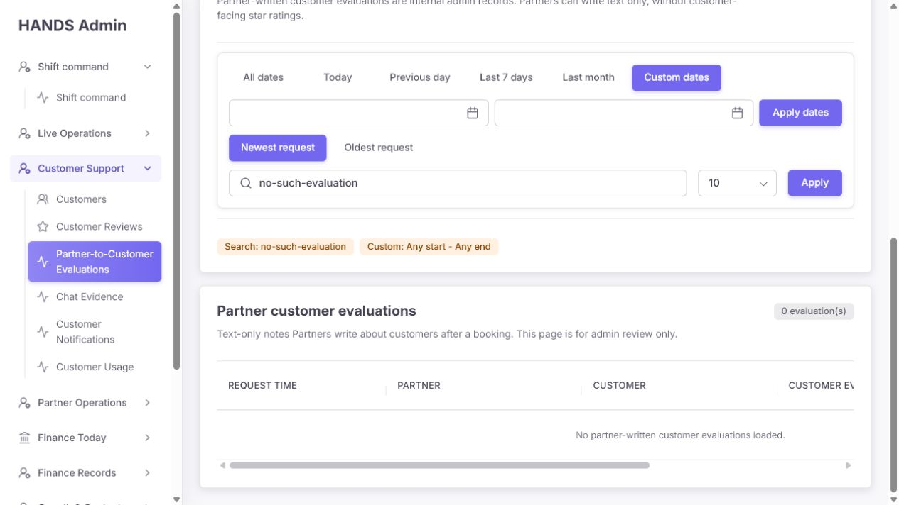

- 화면은 `0 evaluation(s)`와 `No partner-written customer evaluations loaded.`만 보여준다.
- 이는 “데이터가 아직 없음”, “현재 필터 결과 없음”, “API 실패”를 구분하지 않는다.
- 빈 상태가 1320px 테이블 안에 있어 가로 스크롤이 남는다.
- Clear filters 또는 View all dates가 없다.

필요한 세 가지 상태:

1. 데이터 없음: `No Partner notes have been submitted yet.`
2. 필터 결과 없음: `No Partner notes match these filters.` + `Clear filters`
3. 로드 실패: `Partner notes could not be loaded.` + Retry

empty state는 table scroll 내부가 아니라 카드 가용 폭 안에 렌더링한다.

### 8) 범위를 벗어난 페이지 — 실패

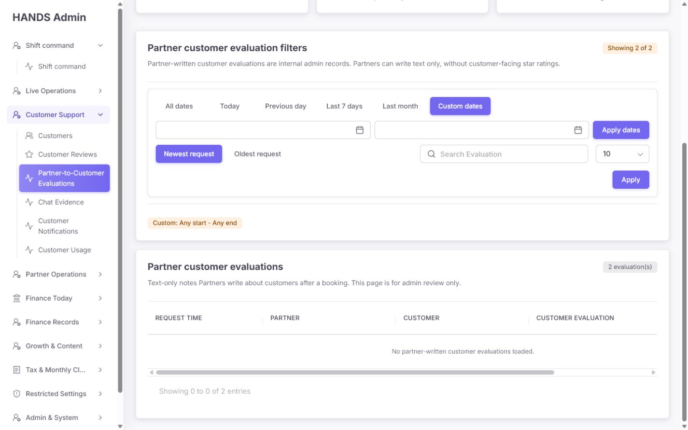

`?dateRange=custom&page=99`에서 다음 문구가 동시에 나타난다.

- Showing 2 of 2
- 2 evaluation(s)
- No partner-written customer evaluations loaded.
- Showing 0 to 0 of 2 entries

원인:

- 요청 API skip은 원래 `filters.page=99`로 계산한다.
- `buildServerReviewPagination()`은 표시 page만 totalPages 안으로 줄이지만 start는 정규화된 page가 아니라 원래 filters.page를 사용한다.
- 서버에서 받은 rows는 이미 비어 있으므로 client-side page 보정만으로 복구되지 않는다.

수정:

- summary에서 totalPages를 구한 뒤 요청 page가 범위를 벗어나면 정규화된 마지막 page로 redirect하거나 해당 page의 rows를 다시 요청한다.
- `Showing X of Y`는 현재 rows 수가 아니라 전체 결과를 애매하게 반복하지 않는다.
- 범위 밖 page 회귀 테스트를 Customer Reviews와 Partner Notes 양쪽에 추가한다.

### 9) 1024·1440 반응형 — 실패

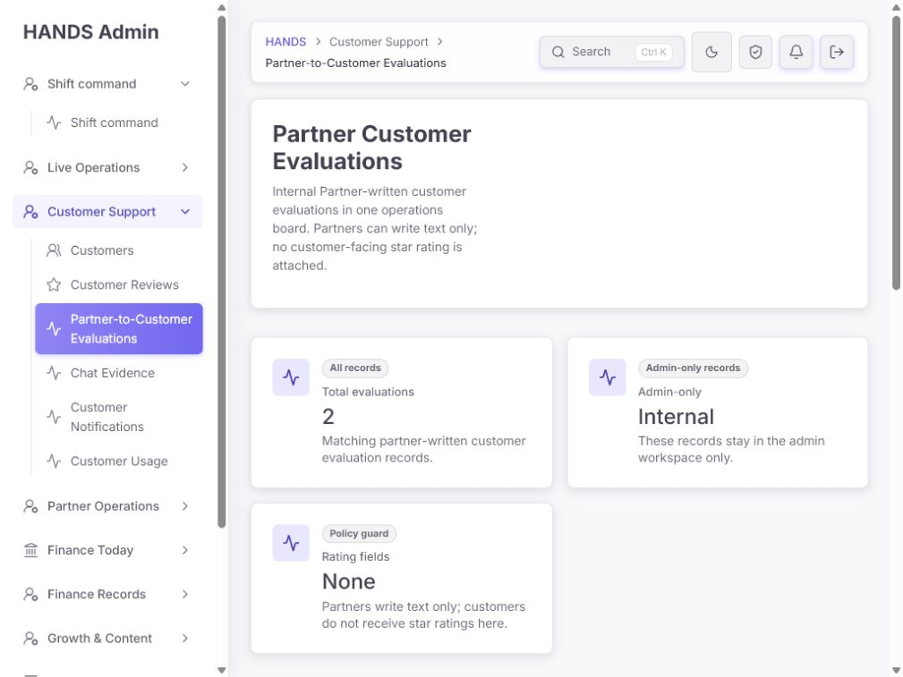

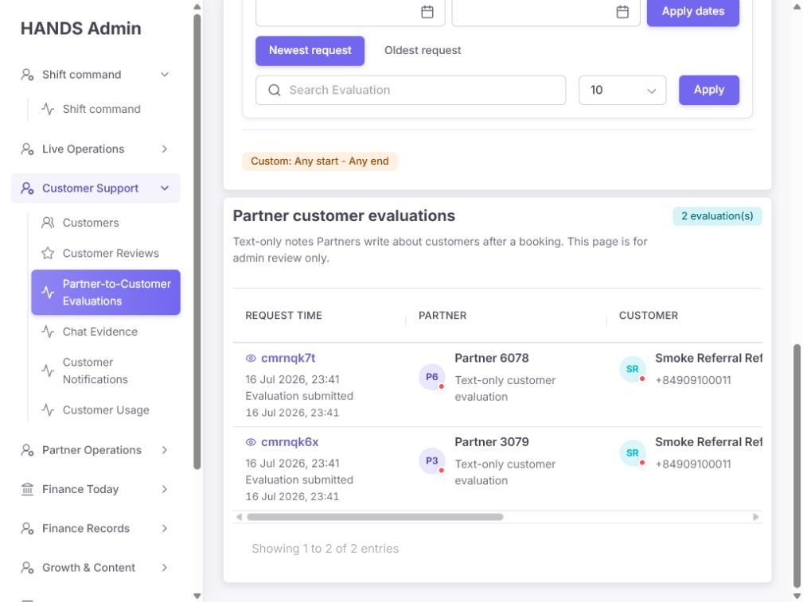

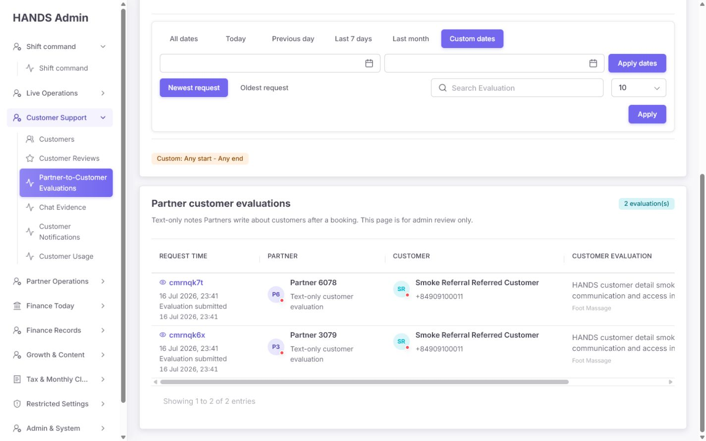

- 1024px에서 콘텐츠 가용 폭은 660px인데 표는 1320px다.
- 핵심 note column이 완전히 보이지 않는다.
- 1440px에서도 note 오른쪽이 잘린다.
- 가로 스크롤은 행 아래에 있어 10~50행일 때 note를 읽기 위해 끝까지 내려가야 한다.
- 200% zoom에서는 같은 문제가 더 심해질 가능성이 높다.

수정 완료 기준:

- 1024px와 1440px에서 note preview와 review state를 가로 스크롤 없이 읽을 수 있다.
- 1000자 note는 preview + detail로 처리한다.
- filter, empty state, pagination이 가로 잘림 없이 reflow한다.

### 10) 신뢰·정책·감사 흐름 — 매우 위험

이 화면의 데이터는 파트너가 고객을 대상으로 작성한 비공개 평가다. 운영 판단에 쓰일 수 있는 만큼 일반 고객 리뷰보다 더 엄격한 문맥과 감사가 필요하다.

현재 확인된 구조:

- DB에는 status, reportReason, moderatedAt이 있다.
- 기본 status는 `PUBLISHED`지만 실제로는 고객에게 공개되지 않는 admin-only note다.
- Admin API는 status/reason/moderatedAt을 읽지만 화면 row model은 모두 버린다.
- 관리자용 moderation endpoint/action이 없다.
- status가 REPORTED인 PartnerCustomerReview는 고객 activity summary의 reportedReviewCount에 합산된다.
- schema에는 누가 moderation했는지 직접 연결하는 필드가 없다.

위험:

- `PUBLISHED`라는 데이터 용어가 공개되지 않는 내부 note와 맞지 않는다.
- 어떤 note가 고객 위험 신호에 영향을 주는지 화면에서 알 수 없다.
- 사실 오류, 모욕, 차별적 표현, 불필요한 개인정보가 있어도 flag/restrict할 수 없다.
- 고객 의사결정에 쓰이는 근거와 검토자가 남지 않는다.
- 내부 전용이라는 문구만 있고 보존 기간·공유 금지·사용 범위가 없다.

최소 안전 설계:

- 기존 enum을 당장 바꾸지 않더라도 UI 의미를 다음처럼 제한한다.
  - PUBLISHED → `Retained`
  - REPORTED → `Needs review`
  - HIDDEN → `Restricted`
- 원문은 편집하지 않는다.
- `Send to review`와 `Restrict from operational use`만 제공한다.
- reason category, operator note, actor, before/after, timestamp를 admin audit에 남긴다.
- REPORTED가 고객 위험 요약에 반영되기 전에 검토가 필요한지 정책을 확정한다.
- note 상세에 `Internal evidence · Do not share with customer`와 booking context를 표시한다.
- 자동 제재나 고객 등급에 사용하지 않는다면 그 제한을 운영 정책에 명시한다.

## 4. 정보구조 결정

### 권장안 A — 현재 규모와 기능에 적합

별도 사이드바 항목을 제거하고 다음 위치에 통합한다.

- Customer detail → Partner notes
- Booking detail → Review records
- Partner detail → Notes written

이 세 위치에는 이미 `AdminReviewRecordsSection`이 사용되고 있다. 글로벌 검색이 필요할 때만 Customer directory 또는 Chat Evidence에서 `Has partner notes` 필터를 제공한다.

장점:

- 기록을 고객·booking 문맥에서 읽는다.
- 별도 빈 보드를 유지하지 않는다.
- 2건을 위해 큰 KPI/필터/페이지를 유지하지 않는다.

### 대안 B — 글로벌 조사 큐가 실제로 필요할 때

페이지를 `Partner Notes About Customers`로 유지하되 다음을 추가한다.

- Retained / Needs review / Restricted 상태
- reason, reviewer, reviewedAt
- customer별 note count와 반복 여부
- note detail drawer
- customer/partner/booking 필터
- 명시적인 내부 증거 정책
- 권한이 있는 export와 access audit

Customer Reviews 페이지와 한 표로 합치지는 않는다. 고객 공개 리뷰와 내부 파트너 note는 목적과 권한이 다르다.

## 5. 우선순위별 수정 요건

### P0 — 신뢰할 수 없는 결과 방지

1. list/summary API 실패를 0건으로 위장하지 않고 명시적 오류 상태로 표시한다.
2. All dates/default Today 계약을 통일한다.
3. 범위를 벗어난 page에서 total과 rows가 충돌하지 않게 한다.
4. REPORTED provider note가 고객 위험 요약에 미치는 정책과 UI 근거를 일치시킨다.

### P1 — 운영 판단과 조사 효율

1. 별도 페이지 유지 여부를 결정한다. 현재 기능이면 nav에서 제거하는 안을 우선한다.
2. 상태·사유·검토 시각·검토자와 booking 문맥을 표시한다.
3. 원문 불변 + review/restrict moderation과 감사 로그를 제공한다.
4. 1024·1440에서 note와 상태를 가로 스크롤 없이 보이게 한다.
5. submitted date 기준으로 UI와 API 의미를 통일한다.
6. 전화번호와 online/offline 점을 기본 목록에서 제거한다.
7. 필터 empty/error states와 Clear filters를 제공한다.

### P2 — 문구·밀도·일관성

1. 정적 KPI 카드 두 개를 제거한다.
2. `evaluation(s)`를 notes 단수/복수로 교체한다.
3. 페이지·내비게이션 명칭을 통일한다.
4. 화면에 보이는 From/To, Status, Submitted date, Sort 레이블을 추가한다.
5. 검색어 하이라이트와 명확한 placeholder를 제공한다.
6. 반복되는 `Text-only customer evaluation` helper를 제거한다.

## 6. 제거·유지·추가할 요소

### 제거 또는 통합

- `Admin-only: Internal`, `Rating fields: None` 큰 카드
- 매 행의 online/offline presence dot
- 매 행의 전체 고객 전화번호
- 반복되는 `Text-only customer evaluation`
- 1320px 고정 표
- 별도 업무가 없는 현재 primary nav 항목

### 유지

- 완료 booking, 선택된 파트너, booking당 하나의 note라는 생성 보호
- 1000자 제한과 공백 정리
- 고객 앱에 공개하지 않는 정책
- booking/customer/partner 연결 링크
- 검색·날짜·정렬 기능의 기본 골격
- 원문을 수정하지 않는 read-only 성격

### 추가

- 명확한 내부 note 명칭과 정책 배지
- Retained / Needs review / Restricted 상태 표시
- moderation reason, reviewer, reviewedAt, audit trail
- note detail drawer와 full context
- customer별 누적 Partner note 수
- Clear filters, Retry, 로드 실패 상태
- 선택적으로 권한이 있는 export/access log

## 7. 권장 화면 구조

```text
Partner Notes About Customers                    Internal · Not customer-visible
Review Partner-submitted notes with their booking context.

2 notes · 0 needs review · 1 customer · Last submitted 16 Jul

Status         [All] [Needs review] [Restricted]
Submitted date [All dates] [Today] [7 days] [30 days] [Custom]
Search         [note, customer, Partner, booking...]     Sort [Newest submitted]

┌ Submitted ┬ Note                           ┬ Customer       ┬ Author       ┬ State ┐
│ 16 Jul     │ customer communication…       │ Smoke Referral │ Partner 6078 │ Retained │
│ Booking …  │ Foot Massage · Internal       │ 2 total notes  │ completed job│ Open     │
└────────────┴────────────────────────────────┴────────────────┴──────────────┴──────────┘
```

행을 열면 전체 note와 다음 정보를 보여준다.

- booking 상태와 서비스
- 작성 파트너와 제출 시각
- 고객과 관련된 다른 Partner notes
- 현재 review state와 reason
- moderation history
- 내부 사용 정책

## 8. 권장 문구 교체안

| 현재 | 권장 |
|---|---|
| Partner-to-Customer Evaluations | Partner Notes About Customers |
| Partner Customer Evaluations | Partner Notes About Customers |
| Internal Partner-written customer evaluations in one operations board... | Internal notes submitted by Partners after completed bookings. Review them with the linked booking context. |
| Total evaluations | Notes |
| Admin-only / Internal | 제목 옆 `Internal` 배지 |
| Rating fields / None | 삭제 |
| Partner customer evaluation filters | Partner note search |
| Evaluation request date | Submitted date |
| Newest request | Most recently submitted |
| Oldest request | Oldest submitted |
| Search Evaluation | Search note, customer, Partner, or booking |
| Customer evaluation | Partner note |
| 2 evaluation(s) | 2 notes |
| No partner-written customer evaluations loaded. | No Partner notes match these filters. |
| Text-only customer evaluation | 삭제 |

## 9. 코드 근거와 수정 지점

| 영역 | 근거 | 수정 방향 |
|---|---|---|
| API 실패가 0건 처리 | `partner-customer-evaluations/page.tsx:26-27` | `adminGetResult`와 별도 error state 사용 |
| 정적 metric cards | `page.tsx:37-58` | compact summary 또는 제거 |
| 기본 Today | `review-page-model.ts:842` | 기본 all 계약으로 통일 |
| all URL 생략 | `review-page-model.ts:406` | 기본값/직렬화 계약 수정 |
| 역전 날짜 자동 교환 | `review-page-model.ts:755` | inline validation |
| row에서 status/reason 누락 | `review-page-model.ts:136-164` | review state와 moderation metadata 매핑 |
| 전화번호·정적 helper | `review-page-model.ts:154,162` | 목록에서 제거 |
| filter 문구 | `partner-customer-evaluations-section.tsx:70,86,132` | submitted/search 의미로 교체 |
| 4열 고정 표 | `partner-customer-evaluations-section.tsx:160` + `globals.css:20902` | 전용 responsive layout |
| 빈 상태 구분 없음 | `partner-customer-evaluations-section.tsx:159` | empty/filter/error 분리 |
| schema 상태 의미 | `apps/api/prisma/schema.prisma:1449-1459` | 내부 note 상태로 UI 매핑, 원문 불변 |
| REPORTED 고객 요약 반영 | `apps/api/src/admin/admin.service.ts:27737-27740` | 정책·감사·UI 근거 통일 |
| 상세 화면 중복 | Booking `page.tsx:1009`, Customer `page.tsx:981`, Partner `page.tsx:1137/1332` | 별도 nav 필요성 재검토 |
| 생성 안전장치 | `apps/api/src/bookings/bookings.service.ts:2856-2888` | 유지 |

## 10. 완료 판정 기준

1. `/reviews/partner-customer-evaluations`의 기본 범위와 활성 버튼이 All dates로 일치한다.
2. 빈 Custom dates 우회 없이 전체 2건을 볼 수 있다.
3. list 또는 summary API 실패가 0건으로 보이지 않는다.
4. `page=99`가 유효 page로 정규화되고 실제 rows를 다시 가져오거나 redirect한다.
5. 결과 count, table rows, footer count가 항상 일치한다.
6. 1024px와 1440px에서 note와 state를 가로 스크롤 없이 읽을 수 있다.
7. Date from/Date to가 화면에 보이고 역전 날짜는 오류로 안내한다.
8. Submitted date와 정렬이 evaluation.createdAt 기준으로 일치한다.
9. 검색 결과에서 일치 note를 바로 확인하고 Clear search를 사용할 수 있다.
10. 고객 전화번호와 presence dot이 기본 목록에서 제거된다.
11. note 원문은 편집되지 않는다.
12. Needs review/Restricted 변경은 reason, actor, before/after, timestamp를 기록한다.
13. 고객 위험 요약에 반영되는 note는 운영 화면에서 근거와 상태를 추적할 수 있다.
14. 별도 페이지를 유지한다면 Customer/Booking/Partner 상세와 역할 중복이 설명된다.
15. 키보드로 필터, 행 열기, 상태 검토, 취소를 수행하고 focus가 복귀한다.

## 11. 검증 시나리오

### 기능

- 기본, All dates, Today, Last 30 days, Custom empty, Custom reversed
- 검색 hit/miss, Clear search
- page 1, 범위 밖 page, pageSize 10/25/50
- list 실패, summary 실패, 부분 실패
- status Retained/Needs review/Restricted

### 데이터 신뢰성

- 원문 불변
- 한 booking 한 note
- 선택 파트너·완료 booking 검증 유지
- moderation audit before/after/reason/actor
- customer reportedReviewCount와 note 상태 일치

### 화면·접근성

- 1024×768, 1280×720, 1440×900, 1920×1080
- 200% 확대, 키보드 전용
- 1000자 note, 긴 고객/파트너 이름, 여러 서비스
- empty/error/loading/success 상태

## 12. 감사 한계

- 실제 note 상태 변경·삭제·제한 작업은 수행하지 않았다.
- 현재 UI에 해당 action이 없으므로 moderation 완료 흐름은 코드 구조로만 평가했다.
- 라이트 모드 중심으로 검사했다. 다크 모드 색 대비는 별도 측정이 필요하다.
- 전체 데이터는 감사 시점의 2건을 기준으로 했다. 대량 데이터 성능은 코드와 레이아웃 구조로 평가했다.
- 스크린샷만으로 전체 WCAG 준수를 판정하지 않았다.

