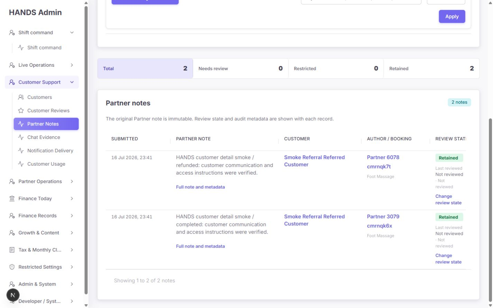
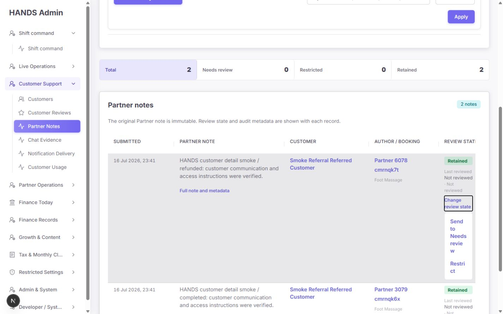
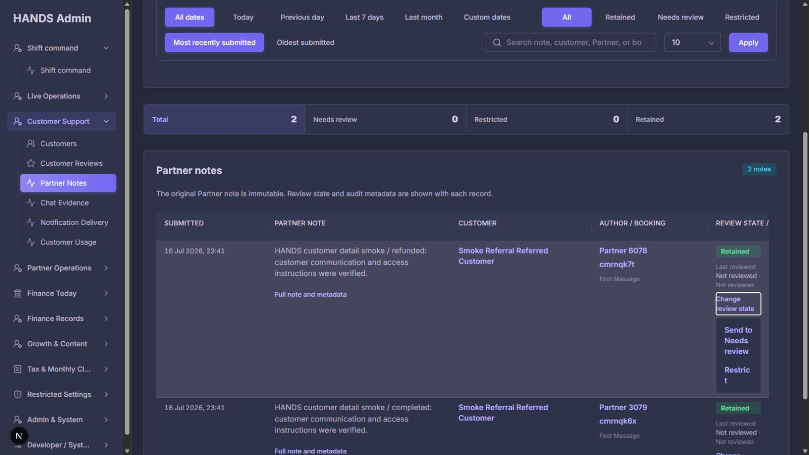
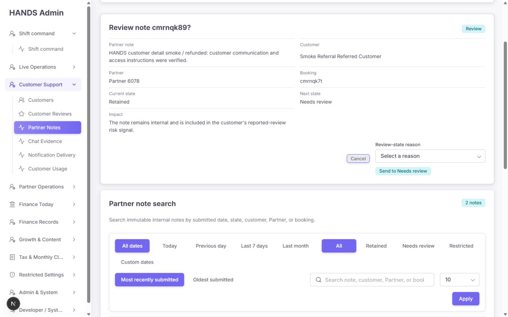
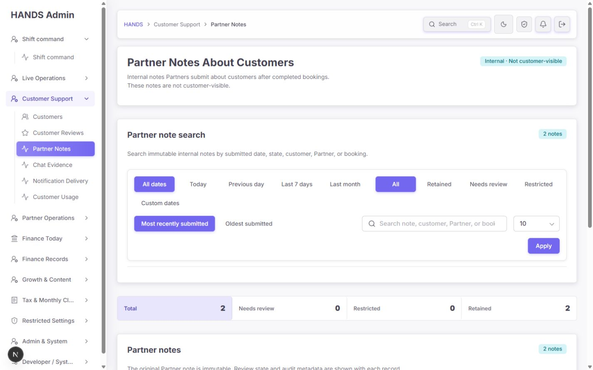
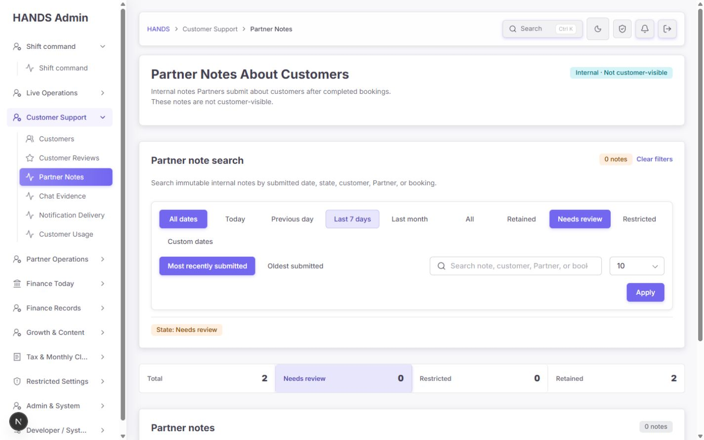
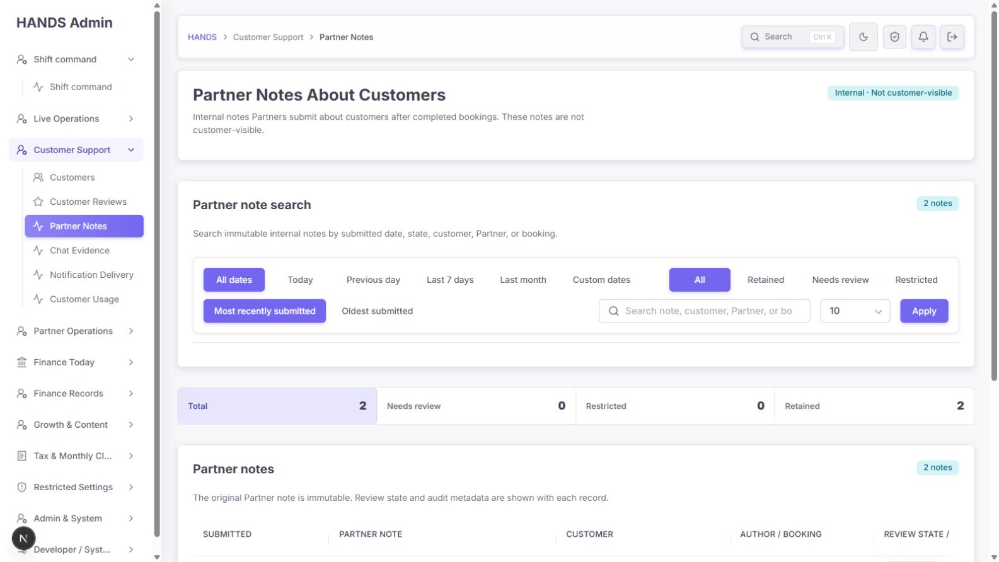
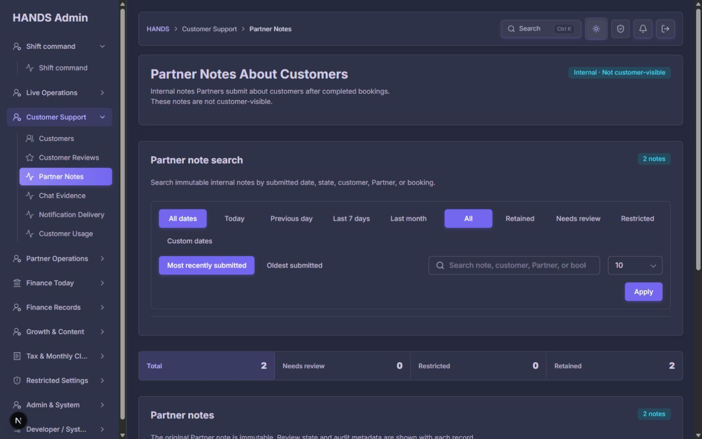

# Partner Notes About Customers 개선 후 심층 감사 보고서

- 대상: `http://localhost:3101/reviews/partner-customer-evaluations`
- 감사 일자: 2026-08-07 (UTC+7)
- 화면 범위: **1440×900, 1600×900 데스크톱만 검사**
- 제외 범위: 1024px 이하, 모바일·태블릿 반응형은 검사하거나 평가하지 않음
- 관점: 파트너가 고객에 관해 남긴 내부 메모를 찾고, 문맥을 확인하고, 상태를 검토하는 실제 운영자
- 안전 원칙: 실제 상태 변경은 제출하지 않았고, 확인 화면 열기·취소·Escape·필터 이동 같은 읽기 전용 동작만 수행함

## 1. 최종 결론

이전 감사의 핵심 방향은 상당 부분 제대로 반영됐다. 페이지와 내비게이션 명칭이 `Partner Notes`로 정리됐고, 기본 범위는 All dates가 됐으며, `Retained / Needs review / Restricted` 상태·집계·확인·감사 로그·명시적 로드 오류가 구현됐다. 1320px 강제 폭도 제거되어 1440px과 1600px에서 페이지 전체 가로 스크롤은 발생하지 않는다.

그러나 **운영 도구로 출시 완료라고 판단하기에는 아직 이르다.** 가장 중요한 상태 변경 메뉴가 두 검사 폭 모두에서 71~81px까지 눌려 문구가 단어 또는 글자 단위로 끊긴다. `Custom dates`는 클릭 즉시 All dates로 되돌아가 From/To 입력을 열 수 없다. 확인 화면은 `aria-modal`을 선언하지만 실제로는 일반 문서 카드이며 배경이 비활성화되지 않고, Escape 후 포커스도 원래 버튼으로 돌아오지 않는다.

또한 필터의 상태 선택과 바로 아래 집계 스트립이 같은 네 상태를 중복 제공하고, 상세 고객·부킹·파트너 화면은 여전히 `Partner evaluations`라는 이전 용어를 쓰면서 Restricted/Needs review 상태를 표시하지 않는다. 즉, **글로벌 페이지의 정책 상태와 다른 운영 화면의 증거 표현이 아직 연결되지 않았다.**

판정:

- 이전 요건 반영도: **약 75%**
- 운영 배포 준비도: **조건부 미완료**
- P0: **0건**
- P1: **6건**
- P2: **7건**
- 우선 수정 순서: **상태 변경 메뉴 → Custom dates → 확인 화면/focus → 필터 통합 → 대비 → 다른 상세 화면 상태 일치**

## 2. 화면 증거

### 1440px 첫 화면

- 명칭, 내부 전용 배지, All dates 기본값, 상태 집계는 이전보다 명확하다.
- 필터 카드가 크게 두 줄 이상으로 감기고 표의 실제 첫 행은 첫 viewport 안에 들어오지 않는다.
- `All dates`와 상태의 `All`이 시각적 그룹 제목 없이 함께 보여 각각의 의미를 순간적으로 구분하기 어렵다.

### 1440px 목록

- note, customer, Partner, booking, state가 한 화면에 들어온 점은 개선됐다.
- 오른쪽 열이 지나치게 좁아 헤더와 review metadata가 끊긴다.
- `Last reviewed Not reviewed · Not reviewed`는 날짜와 사람 두 값이 모두 없다는 사실을 중복 표현한다.

### 상태 변경 메뉴 — 핵심 실패

- 1440px에서 오른쪽 셀의 실제 텍스트 폭은 약 81px다.
- 1600px에서도 메뉴 외곽 폭은 89px, 실제 링크 폭은 약 71px다.
- `Send to Needs review`와 `Restrict`가 여러 줄 또는 글자 단위로 갈라진다.
- 단순 미관 문제가 아니라 운영자의 핵심 moderation 동작을 느리고 불안하게 만드는 P1 결함이다.

### 확인 화면

- note, customer, Partner, booking, current/next state, impact, reason을 확인시키는 정보 구성은 좋다.
- 하지만 실제 DOM은 `role="alertdialog" aria-modal="true"`인 정적 카드다. 실측 `position: static`, `z-index: auto`이며 배경 필터 링크는 `inert=false`, `aria-hidden` 없음, `pointer-events:auto`, `tabIndex=0`이었다.
- Escape는 닫히지만 포커스가 원래 `Change review state`가 아니라 대상 `<tr>`로 돌아왔다.

### Custom dates 실패

- `Custom dates`를 클릭하면 URL과 선택 상태가 다시 All dates로 정규화된다.
- From/To는 렌더링되지 않으므로 운영자는 화면만으로 사용자 지정 기간을 만들 수 없다.

### Needs review 빈 큐

- 상태 chip과 집계 수가 일치하고 0건을 API 장애로 위장하지 않는 점은 좋다.
- 실제 empty message와 `Clear filters`는 아래 table 영역 안에 있어 첫 화면에서 바로 보이지 않는다.

### 1600px 및 다크 모드

- 1600px에서도 검색 placeholder가 잘리고 가장 오른쪽 table header가 완전히 표시되지 않는다.
- 다크 모드 토큰 적용은 일관되지만 필터 재배치와 muted metadata 대비 문제는 그대로 남는다.

## 3. 이전 감사 요건 반영 상태

| 이전 핵심 요건 | 판정 | 현재 증거 |
|---|---|---|
| 페이지/H1/내비게이션을 Partner Notes로 명확화 | 완료 | `Partner Notes About Customers`, `Partner Notes`, 내부 전용 배지 일치 |
| 기본 주소는 All dates | 완료 | 기본 URL에서 All dates 활성, 2건 로드 |
| Today는 명시적 URL | 완료 | `?dateRange=today` 경계가 API에 전달되도록 테스트됨 |
| 빈 Custom dates는 pseudo-custom으로 남기지 않음 | 과잉 구현 | 빈 custom 정규화 자체는 됐지만 Custom dates 버튼까지 무효화됨 |
| reversed date는 오류 표시 | 코드 완료/사용 경로 차단 | 모델·UI·테스트는 있으나 Custom UI를 열 수 없어 정상 화면 경로로 도달 불가 |
| API 실패를 0건으로 위장하지 않음 | 완료 | summary/list 각각 명시적 error state |
| page=99 canonicalize | 완료 | summary 기반 redirect 후 실제 마지막 page 재요청 |
| 상태·사유·검토자·시간 표시 | 부분 완료 | 현재/최근 metadata는 표시하지만 좁은 열과 낮은 대비, 전체 이력 없음 |
| Retained / Needs review / Restricted action | 기능 완료/UX 실패 | API·server action·confirm은 존재하나 row action menu가 읽기 어려움 |
| 원문 불변 + audit log | 완료 | API가 status/reportReason/moderatedAt만 갱신하고 actor/before/after/reason 기록 |
| note/state를 1440px에서 가로 스크롤 없이 표시 | 형식상 완료 | 전체 가로 스크롤은 없지만 action 열이 사용 불가능할 정도로 축소됨 |
| visible filter labels | 미완료 | aria-label·sr-only label만 있고 화면상 Submitted date/Review state/Sort/Rows label 없음 |
| focus가 확인 화면에 들어가고 닫힌 뒤 trigger로 복귀 | 미완료 | Cancel focus는 들어가지만 Escape 후 `<tr>`로 복귀, background 비활성화 안 됨 |
| 상세 Booking/Customer/Partner에서도 정책 표현 일치 | 미완료 | 공용 컴포넌트가 이전 evaluation 용어·무상태 note를 계속 표시 |

## 4. Audit Health Score

이번 점수의 Responsive 항목은 요청에 따라 1440px 이상 데스크톱만 평가했다.

| 차원 | 점수 | 핵심 판단 |
|---|---:|---|
| Accessibility | 2/4 | focus return, aria-modal 계약, visible label, 12px metadata 대비 실패 |
| Performance | 3/4 | 서버 pagination과 grouped summary는 양호하나 list API가 불필요한 사용자/위치 정보를 과다 조회 |
| Desktop layout | 2/4 | 가로 스크롤은 제거됐지만 action 열 71~81px, filter/search wrapping, 첫 행이 fold 아래 |
| Theming | 3/4 | light/dark 토큰 적용은 일관되나 muted metadata가 두 테마 모두 저대비 |
| Implementation integrity | 2/4 | API·audit 구조는 견고하지만 custom-date 상태, 중복 focus boundary, 교차 화면 용어/정책 불일치가 남음 |
| **합계** | **12/20** | **Acceptable — 중요한 운영 결함 수정 필요** |

### 자동 진단 해석

Impeccable detector는 이 페이지 관련 CSS의 blockquote 왼쪽 테두리를 `side-tab`으로 표시했지만, 이는 전체 note 인용문을 구분하는 의미 있는 blockquote 스타일이므로 false positive로 판단했다. 나머지 detector 경고는 `globals.css`의 다른 화면 규칙이며 이번 페이지 범위 밖이다. 실제 핵심 결함은 detector보다 브라우저 실측과 상호작용 검증에서 발견됐다.

## 5. P1 — 출시 전에 수정할 항목

### P1-1. 상태 변경 action을 table cell 안의 inline details로 두지 말 것

위치:

- `apps/admin_web/app/reviews/partner-customer-evaluations-section.tsx:233`
- `apps/admin_web/app/reviews/partner-customer-evaluations-section.tsx:241`
- `apps/admin_web/app/globals.css:19415`
- `apps/admin_web/app/globals.css:19515`

원인:

- 5열 fixed table 안에 상태 metadata와 `
` 메뉴를 모두 넣었다.
- CSS 명목상 마지막 열은 21%지만 다른 열의 최소 내용 폭과 cell padding 때문에 실제 오른쪽 열이 105px 안팎으로 축소된다.
- 메뉴가 cell 폭을 그대로 상속하여 popover가 아니라 좁은 문서 블록으로 열린다.

권장 수정:

1. 기존 관리자 `ActionMenu` 또는 이미 쓰는 overlay/popover 패턴을 재사용한다.
2. 메뉴는 table layout에 참여하지 않게 하고 `min-width: 220px`, viewport 충돌 회피, 우측 정렬을 적용한다.
3. `Customer`와 `Author / booking`을 `Context` 한 열로 합쳐 4열 구조로 줄이는 안을 우선 검토한다.
4. 권장 폭은 `Submitted 150 / Partner note minmax(320, 1fr) / Context 260 / State & action 220`이다.
5. 현재 state는 항상 보이고, actions는 한 개의 `Actions` 버튼 또는 kebab menu에서 연다.

완료 기준:

- 1440×900·1600×900에서 모든 action label이 한 줄 또는 자연스러운 두 줄로 읽힌다.
- 메뉴 링크 최소 유효 폭 200px, 클릭 높이 44px 이상.
- header가 `Review state / actions` 전체 문구를 표시한다.
- 실제 화면 screenshot 또는 Playwright component/E2E assertion으로 menu bounding box를 검증한다.

### P1-2. Custom dates를 “필터 값”이 아니라 “입력 열기 동작”으로 분리할 것

위치:

- `apps/admin_web/app/reviews/review-page-model.ts:206`
- `apps/admin_web/app/reviews/review-page-model.ts:213`
- `apps/admin_web/app/reviews/partner-customer-evaluations/page.tsx:51`
- `apps/admin_web/app/reviews/partner-customer-evaluations/page.tsx:53`
- `apps/admin_web/app/reviews/partner-customer-evaluations-section.tsx:94`

원인:

- `buildReviewFilters()`가 `dateRange=custom`이면서 양쪽 날짜가 비면 즉시 `all`로 바꾼다.
- page가 raw query의 `custom`을 확인한 뒤 이미 `all`이 된 filters로 redirect한다.
- 이 동작은 “빈 custom 결과를 All로 canonicalize”하는 테스트는 통과하지만 “Custom dates를 눌러 입력을 연다”는 실제 interaction을 깨뜨린다.

권장 수정:

- 가장 단순하고 명확한 방법은 `Custom dates`를 segmented range option에서 빼고 **native disclosure/button**으로 만드는 것이다.
- disclosure를 열 때 현재 date range는 그대로 유지하고 From/To 입력만 표시한다.
- Apply dates 시에만 `dateRange=custom&dateFrom=...&dateTo=...`를 제출한다.
- 별도 query state가 반드시 필요하면 `showCustom=1`처럼 UI-only parameter를 쓰되 API filter 의미와 섞지 않는다.

완료 기준:

- Custom dates를 한 번 클릭하면 같은 화면에서 From/To가 보인다.
- 빈 값으로 Apply하면 All dates로 정규화된다.
- 유효 기간, 한쪽만 입력한 open range, From > To 오류를 화면 동작으로 검증한다.
- source string test가 아니라 실제 링크 클릭 후 입력 존재 여부를 검증한다.

### P1-3. 확인 화면의 modal 계약과 focus lifecycle을 하나로 통일할 것

위치:

- `apps/admin_web/app/reviews/partner-customer-evaluations/page.tsx:138`
- `apps/admin_web/app/reviews/partner-customer-evaluations/partner-note-confirmation-focus-boundary.tsx:11`
- `apps/admin_web/components/confirm-dialog.tsx:108`
- `apps/admin_web/components/confirm-dialog-focus-boundary.tsx:26`
- `apps/admin_web/components/admin-surface.tsx:457`

원인:

- `ConfirmDialog` 자체가 이미 `ConfirmDialogFocusBoundary`와 focus trap을 포함한다.
- 이 페이지가 다시 `PartnerNoteConfirmationFocusBoundary`로 감싸 이중 keydown/focus 처리가 생긴다.
- `aria-modal=true`이지만 overlay/backdrop/inert 처리 없이 일반 document flow에 배치된다.
- route navigation 방식이라 원래 action trigger element가 없어지고 Escape 후 fragment target row가 focus된다.

권장 수정:

1. 페이지 전용 `PartnerNoteConfirmationFocusBoundary`를 제거하고 공용 확인 primitive 하나만 사용한다.
2. 진짜 modal이라면 portal/backdrop, background inert, scroll lock, Escape, focus restore를 모두 제공한다.
3. inline confirmation으로 유지한다면 `aria-modal`과 focus trap을 제거하고 일반 region/form으로 정확히 표현한다.
4. 이 업무는 실수 비용이 있으므로 **실제 modal/drawer**를 권장한다.
5. URL로 confirmation을 보존하더라도 trigger id를 `returnFocus`로 전달하거나 action drawer를 client overlay로 열어 원래 버튼에 focus를 복원한다.

완료 기준:

- background의 링크·form은 modal 동안 pointer/tab 접근 불가.
- Tab/Shift+Tab이 한 focus trap에서만 순환.
- Escape·Cancel 후 해당 행의 Actions trigger로 focus 복원.
- browser history/returnTo 필터·page 상태 보존.

### P1-4. 중복 상태 필터와 보이지 않는 그룹 제목을 하나의 queue bar로 통합할 것

위치:

- `apps/admin_web/app/reviews/partner-customer-evaluations-section.tsx:93`
- `apps/admin_web/app/reviews/partner-customer-evaluations-section.tsx:127`
- `apps/admin_web/app/reviews/partner-customer-evaluations-section.tsx:274`
- `apps/admin_web/app/globals.css:19373`

문제:

- filter 안의 `All / Retained / Needs review / Restricted`와 바로 아래 `Total / Needs review / Restricted / Retained`가 같은 상태 filtering을 두 번 제공한다.
- 두 컨트롤의 순서도 서로 다르다.
- Submitted date, Review state, Sort는 접근성 이름만 있고 시각적 제목이 없다.
- 두 개의 보라색 `All`이 한 카드 안에 있어 운영자가 문맥을 추론해야 한다.
- 1440px에서 Custom dates가 다음 줄로 떨어지고 Apply는 오른쪽 아래로 분리된다.

권장 정보 구조:

| 영역 | 유지할 동작 |
|---|---|
| Queue strip | `Total · Needs review · Restricted · Retained` + count; 이것만 상태 필터로 사용 |
| Submitted date | `All dates · Today · Previous day · Last 7 days · Last month` + `Custom dates` disclosure |
| Sort | Most recently / Oldest submitted |
| Search | note, customer, Partner, booking |
| Rows + Apply | visible `Rows` label과 Apply |

- filter 내부 상태 segmented control은 삭제한다.
- `Queue strip`은 table 바로 위 또는 filter header 아래에 둔다.
- CSS flex-wrap 결과에 맡기지 말고 page-specific grid area로 1440/1600 배치를 고정한다.

완료 기준:

- 화면에 `Submitted date`, `Queue`, `Sort`, `Search`, `Rows` 제목이 보인다.
- 상태 변경 경로가 하나뿐이고 active state·count·URL이 일치한다.
- search placeholder가 잘리지 않는다.

### P1-5. review metadata 텍스트 대비를 WCAG AA 이상으로 올릴 것

위치:

- `apps/admin_web/app/globals.css:19469`
- `.partner-note-state-cell small`

실측:

- light: `rgba(47, 43, 61, 0.4)` on white → 약 **2.29:1**
- dark: `rgba(225, 222, 245, 0.4)` on `rgb(52,56,80)` → 약 **2.75:1**
- font size: 12px

두 테마 모두 일반 텍스트 최소 4.5:1을 충족하지 못한다. 이는 보조 설명이 아니라 검토자·검토 시각이라는 운영 증거다.

권장 수정:

- disabled token이 아니라 정상 muted text token을 사용한다.
- 최소 13px, 대비 4.5:1 이상.
- 값이 없으면 여러 저대비 줄을 출력하지 말고 `Not manually reviewed` 한 줄로 정리한다.

### P1-6. Restricted/Needs review 상태를 Booking·Customer·Partner 상세에도 같은 의미로 표시할 것

위치:

- `apps/admin_web/components/admin-review-records-section.tsx:25`
- `apps/admin_web/components/admin-review-records-section.tsx:225`
- `apps/admin_web/components/admin-review-records-section.tsx:247`
- `apps/admin_web/components/admin-review-records-section.tsx:267`

문제:

- 글로벌 페이지는 Partner Notes와 review-state 정책을 도입했지만 공용 상세 컴포넌트는 여전히 `Partner evaluations`, `Customer evaluation`, `evaluation(s)`를 쓴다.
- note text만 표시하고 `status`, active reason, moderation time을 표시하지 않는다.
- 따라서 글로벌 화면에서 Restricted로 변경해도 상세 화면에서는 제한 표시 없이 평범한 고객 평가처럼 읽힌다.
- 이 공용 컴포넌트는 phone/presence 같은 이전 문맥도 계속 표시한다.

권장 수정:

- 공용 block 명칭을 `Partner notes`로 통일한다.
- 각 note에 Retained/Needs review/Restricted badge와 active reason을 표시한다.
- Restricted이면 `Restricted evidence · Do not use for customer decisions` 같은 명시적 사용 제한을 모든 상세 surface에 표시한다.
- moderation 동작은 글로벌 페이지에만 두되 `Open in Partner Notes` deep link를 제공한다.
- partner note 정렬은 booking request가 아니라 note `createdAt`을 기준으로 한다.

## 6. P2 — 다음 개선 패스에서 수정할 항목

### P2-1. 첫 viewport 안에 실제 record 또는 empty result가 보여야 함

1440px에서 table은 약 y=935부터 시작하고 1600px에서도 첫 row는 약 y=883부터 시작한다. 운영자가 페이지에 들어오면 header·설명·필터·집계·table 설명을 본 뒤에야 기록을 볼 수 있다.

수정:

- 상태 segmented와 summary strip 중복을 제거한다.
- filter result badge와 table result badge 중 하나만 유지한다.
- `Partner notes` table description은 제목 아래 한 줄로 축소한다.
- 1440×900에서 첫 row의 note preview와 state가 최소 한 줄 이상 보이게 한다.

### P2-2. Full note and metadata를 좁은 note cell 안에서 확장하지 말 것

현재 details를 열면 note가 반복되고 Partner/Customer/Booking/Service/Submitted/State가 다른 열과 중복되어 한 행이 매우 길어진다.

수정:

- 기존 admin drawer가 있으면 재사용한다.
- drawer에는 full immutable note를 가장 먼저 보여주고, 아래에 Context와 Moderation 두 그룹만 둔다.
- 목록에 이미 보이는 값은 drawer에서만 자세히 표시하고 table cell 안에는 반복하지 않는다.
- 최소 정보: full note, booking requested, active reason, reviewed by/at, previous state history link.

### P2-3. 상태·검토 문구를 운영 결정과 데이터 부재로 분리할 것

현재 `Retained` 녹색 badge 아래 `Last reviewed Not reviewed · Not reviewed`가 붙는다. 기본 PUBLISHED 상태인 것과 운영자가 검토 후 retain한 것을 시각적으로 구분하기 어렵다.

수정:

- moderation log가 없으면 `Retained · default state`와 `Not manually reviewed`를 중립 tone으로 표시한다.
- log가 있으면 `Reviewed 7 Aug · Operator name`처럼 자연어 한 줄로 표시한다.
- `Review state / actions`는 `Note state` 또는 `Moderation state`로 바꾸면 Customer Reviews와 덜 혼동된다.

### P2-4. confirmation title·impact·reason option을 목표 상태별로 다듬을 것

문제:

- Needs review title이 `Review note ...?`라서 읽기 동작인지 상태 변경인지 모호하다.
- `reported-review risk signal`은 내부 구현 용어이며 운영 영향이 구체적이지 않다.
- Needs review와 Restrict가 동일한 reason options를 사용해 `Operational use restricted`를 Needs review 사유로 선택할 수 있다.

수정 예:

- title: `Send note {id} to Needs review?`
- impact: `The note remains internal and increases this customer's Needs review signal used by Customer Support.`
- Needs review reasons: booking context verification, factual dispute, possible sensitive data, possible abusive language.
- Restricted reasons: confirmed sensitive data, confirmed abusive/discriminatory language, confirmed inaccurate note, policy restriction.
- Restrict impact에는 reported-review count에서 제외되는지와 상세 화면에서 계속 보이는지를 정확히 명시한다.

### P2-5. latest moderation만이 아니라 최소한의 history 접근 경로를 제공할 것

API는 audit log를 쓰지만 list/detail 응답은 `distinct target`으로 최신 한 건만 붙인다. 여러 번 Retain → Needs review → Restricted가 일어나면 운영자는 현재 값과 마지막 이벤트만 볼 수 있다.

수정:

- 새로운 workflow를 만들지 말고 기존 admin audit를 target으로 필터한 `View moderation history`를 note drawer에 제공한다.
- event에는 before/after, reason, actor, time을 표시한다.
- 목록 API에는 최신 한 건만 유지해도 된다.

### P2-6. Partner note list API의 과다 선택을 줄일 것

`adminPartnerCustomerReviewBoardSelect`가 공용 `adminProviderSummarySelect`와 `adminUserSummarySelect`를 사용해 화면에 필요 없는 phone, email, roles, rating, currentLat/currentLng, blockedAt 등을 응답에 포함한다.

수정:

- 이 page의 list/confirmation에 필요한 최소 select를 사용한다.
- customer: id, fullName.
- Partner: id, displayName.
- booking: id, openedAt/createdAt, service name.
- note: id, comment, status, reportReason, moderatedAt, createdAt.
- 불필요한 PII·실시간 위치를 전송하지 않는다.

### P2-7. “통과하는 구조 테스트”보다 실제 interaction 회귀 테스트를 추가할 것

현재 focused tests는 45개 모두 통과하지만 다음을 놓쳤다.

- CSS source에 `table-layout: fixed`가 있는지만 확인해 action menu 실제 폭을 검증하지 않는다.
- Custom link href와 empty-custom redirect를 각각 확인하지만 둘의 결합이 입력 UI를 없애는 문제를 검증하지 않는다.
- focus boundary source는 있지만 background inert와 trigger focus return을 검증하지 않는다.

추가할 최소 테스트:

1. Custom dates 클릭 → From/To visible.
2. 1440·1600에서 action menu bounding width ≥ 200px.
3. confirmation open → background inert.
4. Escape/Cancel → 같은 row Actions trigger focus.
5. contextual detail에서 Restricted badge/reason visible.

## 7. 권장 최종 화면 구성

| 순서 | 영역 | 운영 목적 |
|---:|---|---|
| 1 | H1 + `Internal · Not customer-visible` | 데이터 성격 확인 |
| 2 | Queue strip: Total / Needs review / Restricted / Retained | 어떤 업무를 볼지 한 번에 선택 |
| 3 | Submitted date + Custom disclosure | 제출 시점 범위 선택 |
| 4 | Search + Sort + Rows + Apply | 대상 좁히기 |
| 5 | 4열 result table: Submitted / Note / Context / State & Action | 핵심 메모와 판단 근거를 한 행에서 읽기 |
| 6 | Full note drawer | 원문·booking·moderation history 확인 |
| 7 | State confirmation modal | 영향과 이유를 확인하고 안전하게 변경 |

삭제하거나 통합할 것:

- filter 안의 중복 state segmented control
- filter와 table에 반복되는 `2 notes` 중 하나
- `Last reviewed Not reviewed · Not reviewed`
- note cell 안에서 반복되는 Partner/Customer/Booking/Submitted metadata
- 페이지 전용 두 번째 focus boundary

유지할 것:

- 글로벌 Partner Notes 페이지 자체
- All dates 기본값
- Retained / Needs review / Restricted mapping
- 원문 불변
- 명시적 list/summary error state
- server pagination과 canonical redirect
- before/after/reason/actor audit log
- customer/Partner/booking deep links
- light/dark design tokens

## 8. 구현 순서와 완료 기준

### 1단계 — 핵심 task 복구

- ActionMenu overlay 또는 4열 구조 적용
- Custom dates disclosure 복구
- 실제 browser interaction test 추가

### 2단계 — 안전한 moderation

- 이중 focus boundary 제거
- 진짜 modal/backdrop/inert/focus restore 적용
- 상태별 confirmation copy와 reason 분리

### 3단계 — 정보 구조 정리

- queue strip과 state filter 통합
- visible filter labels와 명시적 grid layout
- metadata 대비·문구 정리
- first row/empty state를 1440 첫 viewport에 노출

### 4단계 — 정책 일관성

- AdminReviewRecordsSection 명칭·상태·reason 통일
- Restricted 사용 제한을 Booking/Customer/Partner 상세에도 노출
- moderation history link
- API minimal select

최종 완료 기준:

1. 1440×900·1600×900에서 state action이 잘리지 않는다.
2. Custom dates를 화면에서 열고 적용할 수 있다.
3. 상태 선택 경로가 한 개이고 count·active state·URL이 일치한다.
4. 모든 filter group에 보이는 label이 있다.
5. note state metadata가 light/dark에서 4.5:1 이상이다.
6. modal 동안 background가 inert이고 Escape/Cancel 후 trigger focus가 복원된다.
7. Restricted/Needs review가 모든 contextual copy에서 같은 의미로 보인다.
8. first viewport에서 실제 row 또는 empty message를 확인할 수 있다.
9. 기존 API/audit/pagination 테스트와 새 interaction 테스트가 모두 통과한다.

## 9. 검증 결과

실행 결과:

- Admin Web focused tests: **6 files, 45 tests passed**
- API focused tests: **1 file, 5 passed, 548 skipped by test-name filter**
- Admin Web typecheck: **passed**
- API typecheck: **passed**
- Scoped Admin Web ESLint: **passed**
- Scoped API ESLint: **passed**
- Browser console: React dev/HMR 정보 메시지 외 error/warning 없음
- Impeccable detector: page-specific actionable finding 없음; blockquote border 경고는 false positive

중요한 해석:

> 자동 테스트가 녹색이라는 사실은 현재 UI가 운영에 적합하다는 뜻이 아니다. 이번 핵심 결함은 source-string test가 확인하지 않는 실제 bounding box, navigation 결합, modal 배경 상태, focus return에서 발견됐다.

## 10. 변경 및 보호 영역

- 제품 source code는 수정하지 않았다.
- 실제 Partner note 상태를 변경하지 않았다.
- DB schema/migration, auth, payment, wallet, booking/matching 로직을 건드리지 않았다.
- 이번 감사에서 새로 만든 것은 이 보고서와 screenshot 증거뿐이다.
- worktree의 기존 사용자 변경은 보존했다.

