# Partner Operations 재구현 심층 감사 보고서

- 대상: `http://localhost:3101/partners/overview`
- 감사일: 2026-08-08 (Vietnam time)
- 관찰 환경: 로그인된 로컬 관리자 화면, 1692 × 1272 viewport, DPR 1
- 검사 범위: Today, Last 7 days, Negative wallet 필터, 카드·표·빈 상태·드릴다운 링크, Admin Web/API 코드, 관련 단위 테스트
- 제외 범위: 요청에 따라 1024px 이하 화면은 캡처·평가·권고에서 완전히 제외했다.
- 변경 범위: 애플리케이션 코드는 수정하지 않았으며, 본 보고서와 이번 감사에서 새로 캡처한 증거만 생성했다.

## 1. 최종 판정

**부분 합격.** 이전 감사의 핵심 문제 다수는 실제로 좋아졌다. 특히 카드 레이아웃, 고객 앱 노출과 지급 준비의 분리, `Bookable now` 정의, 품질 목록에서 지갑 업무 제거, 기간 성과와 현재 재무 노출의 시각적 분리는 유효한 개선이다.

그러나 운영자가 숫자를 보고 곧바로 목록을 열거나 우선순위를 결정하기에는 아직 세 가지 종류의 위험이 남아 있다.

1. **숫자와 이동 결과의 불일치** — 필터된 화면의 `1 partner`, `19 partners` 링크가 필터를 잃고 전체 목록으로 이동한다.
2. **지표 명칭과 계산의 불일치** — 취소·no-show·expired를 `Failed`와 `Failure rate`로 표시하고, 현재 스냅샷을 선택 기간 퍼널처럼 표시한다.
3. **업무 우선순위의 불일치** — 상단은 “현재 일이 있는 큐만 표시”한다고 하지만 실제 9개 활성 큐 중 3개 종류만 보여준다.

따라서 현재 화면은 **현황 조회용으로는 사용 가능하지만, 제재·공급 복구·재무 집행의 단독 근거로 사용하기에는 아직 위험하다.**

## 2. 이전 감사 대비 개선 확인

| 이전 핵심 문제 | 현재 판정 | 확인 결과 |
|---|---|---|
| 은행 승인 여부가 고객 앱 노출 blocker로 표시됨 | 통과 | 고객 앱 노출 blocker는 Documents/Service로 정리되고, 은행 미승인은 Finance로 이동했다. |
| `Ready now`가 여러 정의로 사용됨 | 대체로 통과 | 상단과 표 모두 실제 게이트에는 `Bookable now`, 단순 상태에는 `Online available`을 사용한다. |
| Partner 귀책처럼 보이는 취소율 | 부분 통과 | 상단 품질 KPI는 `Non-completed booking rate`로 개선됐지만 Area 표에는 여전히 `Failed`/`Failure rate`가 남았다. |
| 품질 표에 음수 지갑 Partner가 섞임 | 화면 통과 / 집계 부분 실패 | 품질 행은 품질 근거만 보여주지만, API의 품질 총수와 행 predicate가 완전히 같지 않다. |
| Current와 selected period 혼합 | 부분 통과 | Finance는 Period activity/Current exposure로 나뉘었지만, readiness와 app activity에는 여전히 범위 혼합이 남았다. |
| 운영 카드 텍스트가 이어 붙음 | 통과 | 카드 구조와 값·설명·행동의 위계가 정상이다. |
| Finance가 반쪽 폭에서 겹침 | 통과 | 전체 폭, 3열 묶음으로 읽을 수 있다. |
| Selection 표의 행동이 화면 밖에 있음 | 통과 | 6열 중심 구조와 명시적 Recommended action으로 정리됐다. |
| 이벤트 0건을 0%/-100%로 표시 | 통과 | `No events in this period`로 처리된다. |
| 서비스가 bookable 0인데 Healthy | 통과 | `Not bookable`로 표시된다. |
| 앱 텔레메트리 미수집을 행동 0으로 오인 | 대체로 통과 | coverage 1%, no telemetry 수, inactive를 명확히 표시한다. 다만 기간 usage와 현재 coverage가 한 그룹에 섞인다. |
| 0건 상세 큐까지 모두 노출 | 통과 | 활성 큐만 남겼다. |
| 표 landmark 이름 중복 | 통과 | Area, Service, Quality 등 고유한 접근 가능한 이름이 확인된다. |
| 갱신 행동 없음 | 부분 통과 | `Refresh now`는 추가됐지만 stale 경고는 없다. |

## 3. 감사 단계와 건강도

| 단계 | 화면/상태 | 건강도 | 핵심 판정 |
|---:|---|---|---|
| 1 | Today 헤더·필터·Action required | 주의 | 필터 버튼이 홀로 다음 줄로 내려가며 Action required가 실제 큐 전체를 대표하지 않는다. |
| 2 | Today Current supply | 주의 | blocker 구조는 좋아졌지만 모든 Offline을 `Needs action`으로 처리한다. |
| 3 | Today performance·Area·Service | 위험 | Area의 Failed/Failure rate 의미가 실제 집계와 맞지 않고 내부 수평 스크롤이 남았다. |
| 4 | Today readiness·App activity | 위험 | 현재 readiness snapshot에 Today 배지를 붙이고 전환 drop처럼 표현한다. |
| 5 | Today Quality·Finance | 양호 | 0건 처리와 섹션 분리는 좋아졌다. |
| 6 | Today Selection empty state | 주의 | 데이터가 없는데도 탭·정렬·표 구조를 모두 노출한다. |
| 7 | Today Detailed action queues | 주의 | 활성 큐만 표시하지만 나이·SLA·담당·중복 설명이 없다. |
| 8 | 7-day 헤더·Action required | 주의 | 7일 위험 3종은 보이나 실제 활성 큐 9개와 관계가 설명되지 않는다. |
| 9 | 7-day performance·Area | 위험 | HCM `150 Failed`, `99% Failure rate`가 운영자에게 귀책/매칭 실패로 읽힌다. |
| 10 | 7-day Service·Readiness | 위험 | 현재 Registered/Approved/Bookable 값을 `Last 7 days` readiness funnel로 표시한다. |
| 11 | 7-day App activity·Quality | 주의 | selected-period usage와 current telemetry coverage가 한 범위처럼 보인다. |
| 12 | 7-day Quality·Finance | 위험 | `Partner Payout Pending -205,000 VND`는 지급금과 미수금의 의미를 뒤섞는다. |
| 13 | 7-day Selection·Queues | 대체로 양호 | 표 구조는 개선됐지만 Action required/전체 큐의 우선순위 관계가 약하다. |
| 14 | Negative wallet 필터 | 위험 | 필터 자체와 칩은 정상이나, 필터된 수치의 드릴다운 링크가 필터를 보존하지 않는다. |

## 4. 즉시 수정해야 할 P0 문제

### P0-1. 필터된 숫자와 드릴다운 결과가 달라진다

Negative wallet 필터를 적용하면 다음처럼 값이 바뀐다.

- Selection drop-off: 3 → 2
- Quality risk: 56 → 1
- Online but not bookable: 187 → 19

하지만 해당 링크는 다음과 같이 현재 필터를 잃는다.

- Quality risk 1 → `/partners?review=quality-all&qualityRange=7d`
- Online but not bookable 19 → `/partners?review=available-blocked`
- Wallet/Quality 상단 카드도 일부 hard-coded URL을 사용한다.

화면 근거: Step 14, `14-seven-day-negative-wallet-filter-1692.png`  
코드 근거: `apps/admin_web/app/partners/overview/page.tsx:625-660`, `apps/api/src/admin/admin.service.ts:35341-35419`

운영 영향:

- 운영자는 1건을 검토하려고 눌렀다가 56건 목록을 받는다.
- 19명을 보려던 공급 복구 담당자가 187명 전체를 받는다.
- 화면의 수치가 틀렸다고 판단하거나, 엉뚱한 Partner를 처리할 수 있다.

수정 요건:

1. `overview count → target list query`를 하나의 공통 query builder로 만든다.
2. `city`, `serviceId`, `verificationStatus`, `onlineStatus`, `walletStatus`, `riskStatus` 중 대상 목록이 지원하는 필터를 반드시 전달한다.
3. 대상 목록에서 지원하지 못하는 필터가 있으면, 해당 필터가 적용된 subset count를 링크에 사용하지 말고 “전체 큐 열기”라고 명시한다.
4. 카드의 accessible name도 `Filtered result` 또는 실제 범위를 포함해야 한다.

완료 기준:

- Negative wallet + 7d 상태에서 `Quality risk 1`을 누르면 결과 목록도 1명이다.
- `Online but not bookable 19`를 누르면 결과 목록도 19명이다.
- 모든 필터 조합에서 카드 count와 대상 목록 count가 일치하는 계약 테스트가 있다.

### P0-2. Area의 `Failed`/`Failure rate`가 실제 매칭 실패가 아니다

7일 HCM은 `Open demand 1`, `Failed 150`, `Failure rate 99%`로 보인다. 그러나 API는 `CANCELLED`, `NO_SHOW`, `EXPIRED`를 원인·행위자 구분 없이 모두 failed booking으로 합치고, `(open + failed)`를 분모로 사용한다.

화면 근거: Step 9~10, `09-seven-day-performance-supply-1692.png`, `10-seven-day-supply-funnel-1692.png`  
코드 근거: `apps/api/src/admin/admin.service.ts:7606`, `7948-7968`, `35060-35089`; UI `page.tsx:723-753`

수정 요건:

- 현 데이터 정의를 유지하면 `Non-completed outcomes`, `Non-completed share`로 바꾼다.
- 실제 `Matching failure`는 공급 부족, timeout, no provider 등 확정된 closed reason/actor만 별도로 집계한다.
- 상단 `Non-completed booking rate`와 Area 표가 같은 상태 집합과 같은 용어 계약을 사용해야 한다.
- `High Failure` 상태도 실제 matching failure가 없으면 사용하지 않는다.

### P0-3. Readiness가 기간 퍼널처럼 보이지만 실제로는 현재 스냅샷이다

Today와 Last 7 days에서 Registered 1,392 → Approved 1,235 → Bookable now 0이 동일하다. API funnel은 현재 count만 사용하지만 UI는 `overview.rangeLabel`을 status badge로 붙인다. `100% from signup · 100% drop`은 현재 bookability를 가입 전환 손실처럼 보이게 한다.

화면 근거: Step 4, Step 10  
코드 근거: `apps/api/src/admin/admin.service.ts:8817-8825`; `apps/admin_web/app/partners/overview/page.tsx:446`

수정 요건:

- 가장 안전한 수정은 섹션명을 `Current readiness snapshot`으로 바꾸고 기간 배지와 drop/conversion 문구를 제거하는 것이다.
- 현재 지표는 `Registered`, `Approved`, `Bookable now`, `Bookable / approved`처럼 현황 비율로 보여준다.
- 진짜 퍼널이 필요하면 선택 기간 가입 cohort가 승인·최초 온라인·최초 완료까지 진행한 비율을 별도 데이터로 만든다.

### P0-4. `Action required`가 전체 활성 업무처럼 말하지만 세 종류만 보여준다

7일 화면 상단은 `3 active queues`라고 표시하지만 하단에는 9개 active queue가 있다. Today도 상단은 지갑 1개만 보이지만 Detailed queues에는 pending verification, inactive, payout blocked, tax missing 등 8개가 있다. 설명 `Only queues with current work are shown`은 사실상 “선택된 세 종류 중 현재 값이 있는 것”만 뜻한다.

화면 근거: Step 1, Step 7, Step 8, Step 13  
코드 근거: `page.tsx:620-674` — selection, wallet, quality 세 카드만 생성

수정 요건:

- 권장: 모든 활성 큐를 하나의 후보 집합으로 만들고 `운영 영향 + oldest waiting + SLA breach`로 정렬해 상위 3~4개를 보여준다.
- 세 종류만 유지하려면 제목을 `Selected risk signals`로 바꾸고 “Supply/approval/finance queues are listed below”를 명시한다.
- `Online but not bookable 187`, `Pending verification 161`은 실제 공급 복구 관점에서 상단 후보에 포함한다.
- 단순 Offline 전체는 상단 우선순위에서 제외한다.

### P0-5. 모든 Offline을 `Needs action`으로 표시한다

Offline 설명에는 manual off, outside schedule, app off, blocked, not ready가 함께 들어 있다. 정상적인 비근무 상태까지 1,043건 모두 행동 대상으로 칠하면 실제 위험과 구분되지 않는다.

화면 근거: Step 1~2  
코드 근거: `page.tsx:1221-1227` — key가 `offline`이면 무조건 `Needs action`

수정 요건:

- Offline은 neutral/current 상태로 유지한다.
- `Expected online but offline`, `No activity 7d`, `Stale after scheduled shift`, `Account blocked`처럼 근거가 있는 예외만 action으로 만든다.
- Offline 1,043과 inactive 1,074의 중복 관계를 설명한다.

### P0-6. Quality risk 총수와 실제 행 predicate가 다르다

API의 `qualityRiskPartnerCount`는 선택 기간의 저평점 리뷰 외에 lifetime `ratingAvg < 3`도 포함한다. 반면 `qualityRiskFacts` 행은 `cancellationRate >= 20 || lowReviewCount > 0 || noShowReports > 0`만 사용한다. 따라서 상단 총수에는 들어가지만 품질 표에서 찾을 수 없는 Partner가 생길 수 있다.

코드 근거: `apps/api/src/admin/admin.service.ts:8369-8405`, `8579-8604`, `8920-8966`

수정 요건:

- count와 rows를 동일한 canonical predicate에서 파생한다.
- lifetime rating 신호를 유지하면 행에도 `Lifetime rating below 3` 근거를 표시하고 selected-period 품질과 scope를 분리한다.
- API가 `riskPartnerCount`, `riskPartnersTotal`, `riskPartnersPreview`를 같은 query contract로 반환하도록 한다.

### P0-7. `Partner Payout Pending`이 음수이며 기간 값인데 Current exposure로 보인다

7일 화면에 `Partner Payout Pending -205,000 VND`가 표시된다. API는 PENDING/AVAILABLE earning을 `createdAt` selected period로 제한하고 netAmount 부호를 분리하지 않고 합친다. 음수 netAmount는 지급 대기금이 아니라 receivable/debt 성격이다.

화면 근거: Step 12, `12-seven-day-quality-finance-1692.png`  
코드 근거: `apps/api/src/admin/admin.service.ts:8047-8061`, `8984-8989`

수정 요건:

1. `Pending payout`은 `netAmount > 0`만 합산한다.
2. `Current payout outstanding`이 목적이면 `createdAt` 기간 필터를 제거하고 현재 open 상태 전체를 계산한다.
3. 음수 PENDING/AVAILABLE은 `Partner receivable outstanding`으로 별도 표시한다.
4. selected-period 생성액이 필요하면 `Payout created in period`로 Period activity에 둔다.

## 5. P1 운영 효율·정보 구조 문제

### P1-1. 1692px에서도 Apply filters가 혼자 다음 줄로 내려간다

6개 필터 + 버튼인데 CSS는 `repeat(5, 1fr) auto`라 7번째 요소가 wrap된다. 넓은 업무 화면에서 버튼과 필터의 관계가 약해지고 활성 필터 칩과도 시선이 충돌한다.

- 화면: Step 1, Step 8, Step 14
- 코드: `apps/admin_web/app/globals.css:12113-12123`
- 권장: `City 1.2fr + 5 selects + auto button`의 7열을 쓰거나, 6개 필터 1행과 `Active filters | Apply` 2행으로 명시적으로 구성한다.

### P1-2. 기간 정보가 지나치게 반복된다

`Last 7 days`가 필터 헤더, Performance status, segmented button, KPI 카드마다 반복된다. 실제로 scope가 다른 readiness/current metrics는 오히려 기간 배지를 잘못 갖는다.

- 권장: Performance section header 한 곳에만 기간을 고정하고, 혼합 scope 카드에만 `Current`/`Selected period`를 별도로 붙인다.

### P1-3. Area/Service 표가 1692px에서도 내부 수평 스크롤이다

전체 폭으로 옮긴 것은 개선이지만, Area Status는 첫 화면에서 잘리고 10개 열을 옆으로 이동해야 한다. 운영자는 Area 이름과 Status를 동시에 비교하기 어렵다.

- 화면: Step 3, Step 9~10
- 권장 열 구조:
  - 고정: `Area | Status`
  - Current supply: `Partners | Online | Fresh | Bookable`
  - Selected-period demand: `Open | Non-completed | Response`
- Status를 Area 바로 뒤에 두고 Area를 sticky로 만든다.

### P1-4. 공급 0인 네 지역을 매번 전체 행으로 보여준다

Hanoi, Hai Phong, Da Nang, Can Tho의 0값 행이 핵심 HCM 행과 같은 높이를 차지한다.

- 권장: 공급/수요가 있는 지역을 먼저 표시하고 `4 areas with no supply` 한 줄로 접는다.

### P1-5. Readiness 5열 grid에 카드 3개만 있어 40%가 빈다

- 코드: `apps/admin_web/app/globals.css:12481` 부근
- 권장: snapshot을 유지하면 3열로 맞추거나 한 줄의 readiness summary로 축약한다.

### P1-6. App activity가 selected-period usage와 current coverage를 혼합한다

7일 App Opens 20/Session Starts 19는 기간 성과지만, telemetry inactive 7d+, no telemetry 1,223, coverage 1%는 현재 데이터 품질 상태다.

- 화면: Step 11
- 권장:
  - `Usage in selected period`: active, opens, sessions, most active
  - `Telemetry coverage and current gaps`: coverage, untracked, inactive
- coverage 1%일 때 “20 opens”를 전체 Partner 행동의 대표 성과로 해석하지 않도록 경고한다.

### P1-7. Today 빈 상태가 여전히 너무 크다

Today Booking quality가 비어도 KPI strip과 표 빈 상태를 모두 표시하고, Selection 0건도 이슈 탭·정렬·전체 표 껍데기를 노출한다. 문서 높이는 약 6,744px다.

- 화면: Step 5~7
- 권장: 0건이면 `No quality follow-up in Today` 한 줄로 축약하고 표/정렬을 숨긴다. Selection도 `No selection friction detected`만 남긴다.

### P1-8. Finance 표가 “Top 5 of 124”임을 말하지 않는다

5행만 보이지만 전체 Negative wallet 124명과 관계, 정렬 기준, local View all이 없다. 모든 행의 Status `Current receivable`도 중복된다.

- 화면: Step 6, Step 12~13
- 권장: `Largest 5 receivables of 124 · sorted by amount` + `View all 124`를 추가하고 반복 Status 열은 제거한다.

### P1-9. Finance blocker 숫자는 서로 겹치지만 합산 금지 안내가 없다

Payout blocked 1,321, bank not approved 1,091, tax missing 1,280, negative wallet 124는 같은 Partner가 여러 집합에 포함될 수 있다.

- 권장: `Unique payout-blocked Partners; reasons overlap` 문구와 각 reason별 drilldown을 제공한다.

### P1-10. Detailed action queues에 나이·SLA·담당·중복 정보가 없다

현재 표는 `Queue | Scope | Open Partners | Action`뿐이다. 1,321건과 161건 중 무엇이 먼저인지 count만으로 알 수 없고, inactive 7d/30d·payout/tax 집합의 중복도 설명하지 않는다.

- 화면: Step 7, Step 13
- 코드: `page.tsx:1233-1274`
- 권장: 실제 데이터가 있는 경우에만 `Oldest waiting | SLA | Owner | Impact`를 추가한다. 데이터가 없다면 임의 owner/SLA를 만들지 말고 backend contract부터 추가한다.

### P1-11. Service `Completed share` 계산이 booking outcome share가 아니다

서비스별 비율은 `completed / (open + completed)`로 계산한다. 취소·no-show·expired를 제외하므로 상단 `Completed booking share`와 의미가 다르다.

- 코드: `apps/api/src/admin/admin.service.ts:35121-35124`
- 권장: outcome share라면 `completed / (completed + non-completed)`로 맞추고, 현재 open 수요는 별도 열로 둔다.

## 6. P2 문구·미세 사용성

1. `Location <= 90m` → `Fresh location: last 90 min`으로 운영 문구화한다.
2. `Visible in customer app: Approved public profiles with active services`는 실제 필수 신분 문서 predicate도 포함하므로 `Approved public identity + active service`로 정확히 쓴다.
3. blocker count가 overlap된다는 말뿐 아니라 어떤 base population인지 명시한다. Visible 1,039 + no service 192가 전체 Approved 1,235와 바로 맞지 않는 이유를 설명해야 한다.
4. City/area 자유 입력은 지원 alias와 정규화 결과를 보여주지 않는다. 기존 Vietnam region bucket을 select/typeahead로 재사용하거나 0건일 때 교정 제안을 제공한다.
5. `Refresh now`는 있지만 API의 60초 refresh contract를 이용한 stale 표시가 없다. generatedAt이 120초를 넘으면 `Data may be stale`를 표시한다.
6. `No events in this period`는 올바르지만 작은 카드마다 cyan status로 반복돼 실제 위험 배지와 경쟁한다. neutral dash 또는 섹션 단위 empty summary가 더 적합하다.

## 7. 권장 최종 화면 구조

### A. Header / Filters

- H1 `Partner Operations`
- `Current operations · as of … · Vietnam time`
- stale일 때만 경고
- 6개 필터 + Apply를 한 desktop 행에 배치
- active filter chips는 다음 행에서 유지

### B. Action required

활성 큐 전체에서 상위 4개만 계산:

- Online but not bookable
- Pending verification
- Quality follow-up
- Wallet/finance blocker

각 카드: `Count | Oldest | Impact | Next action`. 단, backend에 근거 없는 oldest/owner/SLA를 만들지 않는다.

### C. Current supply

- Bookable now
- Online available but blocked
- Busy/in service
- Offline (neutral)
- No operational activity 7d (action)
- Customer app visibility + blockers

### D. Performance · selected period

- Completed/non-completed outcomes
- Response time
- selected-period rating/reviews
- Selection friction
- Area/Service demand outcomes

### E. Data quality / Finance

- App usage와 telemetry coverage를 분리
- Period earnings와 current payout/receivable을 분리
- payout blocker reasons는 overlap 표시

### F. Details

- Today 0건 섹션은 한 줄 empty state
- Detailed action queues는 기본 표로 유지하되 priority/age/owner를 추가
- 긴 표는 식별+상태 열을 우선하고 부차 데이터는 details 또는 우측 그룹으로 이동

## 8. 구현 순서

### 1차 — 운영 오판 차단

1. 모든 overview 카드 count와 target list query를 동일 계약으로 연결한다.
2. Area Failed/Failure rate를 Non-completed로 바꾸거나 실제 matching failure를 계산한다.
3. Readiness를 current snapshot으로 재정의한다.
4. Action required의 범위를 실제 활성 큐 전체와 맞춘다.
5. payout pending의 부호와 기간/current scope를 분리한다.
6. quality count/row predicate를 하나로 만든다.

### 2차 — 운영 우선순위 강화

1. Offline을 neutral로 바꾸고 근거 있는 예외만 action 처리한다.
2. Detailed queues에 oldest/SLA/owner/impact를 추가한다.
3. Finance blocker overlap과 top-5 범위를 명시한다.
4. Current vs selected-period badge 중복을 제거한다.

### 3차 — 화면 밀도와 읽기 속도

1. 필터 Apply 배치를 수정한다.
2. Area/Service의 열 우선순위와 sticky identity를 수정한다.
3. 0건 Quality/Selection을 축약한다.
4. zero-supply 지역을 접는다.
5. App usage와 telemetry coverage를 나눈다.

## 9. Codex 구현 완료 기준

- Negative wallet/City/Service/Risk 등 필터 조합에서 모든 카드 count와 이동 후 목록 count가 일치한다.
- Area에서 `Failed`, `Failure rate`, `High Failure`라는 표현이 원인 미확정 취소에 사용되지 않는다.
- Last 7 days 화면에서 현재 Registered/Approved/Bookable 값에 기간 funnel 배지가 붙지 않는다.
- Action required 수와 상세 활성 큐 수의 관계가 설명되거나 같은 후보 집합에서 파생된다.
- 정상 Offline은 `Needs action`이 아니다.
- Quality 총수와 상세 행은 같은 predicate를 사용한다.
- Pending payout은 음수가 될 수 없고 current outstanding과 selected-period 생성액이 분리된다.
- 1692px에서 Apply filters가 홀로 wrap되지 않는다.
- 1692px에서 Area 이름과 Status/Action을 동시에 읽을 수 있다.
- 0건 Quality/Selection은 불필요한 탭·정렬·빈 표를 렌더하지 않는다.
- stale data warning이 `generatedAt > refreshSeconds × 2`일 때 표시된다.

필수 테스트:

1. Overview filter → card count → Partner list count 계약 테스트.
2. customer/system cancellation이 actual matching failure로 집계되지 않는 테스트.
3. readiness current snapshot이 range와 무관함을 명시하는 테스트.
4. lifetime low rating만 있는 Partner의 quality count/row 일치 테스트.
5. negative earning이 payout pending에 포함되지 않는 테스트.
6. 1440px 이상 브라우저 visual smoke: 필터 배치, 표 identity/status 동시 가시성, 빈 상태 축약.

## 10. 코드·기능 검증 결과

- Admin Web Partner Overview 테스트: **2 files, 19 tests passed**
- API Partner Overview 대상 테스트: **17 tests passed**, 나머지 543 skipped
- 문서 가로 overflow: 없음 (`scrollWidth 1677`, viewport content 기준)
- Area/Service 내부 table scroll: 존재
- Today 문서 높이: 약 6,744px
- 이번 감사에서 앱 코드는 변경하지 않았다.

테스트가 통과해도 남은 이유:

- 필터된 card count와 target list count의 end-to-end 계약을 검사하지 않는다.
- 지표의 라벨과 분모/분자 의미를 계약 테스트로 고정하지 않았다.
- CSS 존재 여부와 컴포넌트 렌더만으로 1440+ 실제 열 우선순위/배치를 검증하기 어렵다.

## 11. 접근성 확인과 한계

확인된 장점:

- 필터는 보이는 label과 accessible name을 갖는다.
- action card는 수치와 행동을 포함한 링크 이름을 갖는다.
- table scroll region은 Area/Service/Quality 등 고유한 이름을 갖는다.
- 상태는 색상뿐 아니라 텍스트로도 표현된다.
- 활성 필터는 개별 제거와 Clear all을 제공한다.

추가 확인이 필요한 항목:

- 키보드만으로 전체 필터·수평 표·링크를 이동하는 실제 focus 순서
- screen reader의 table header/section announcement
- 텍스트/배지 contrast 측정값
- 200% zoom, Windows high contrast/forced-colors
- 로딩·API 오류·권한별 제한 상태

따라서 본 보고서는 WCAG 준수 판정이 아니라, 화면·DOM·코드에서 확인 가능한 접근성 위험 감사다.

## 12. 이번 감사 증거 화면

### Step 1 — Today 헤더·Action required·Current supply

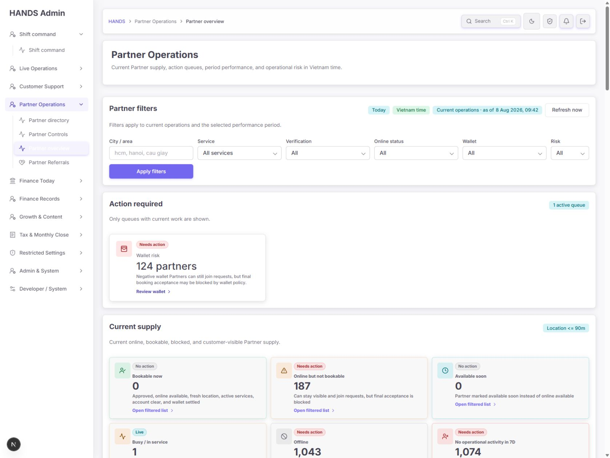

### Step 2 — Today Current supply·Performance

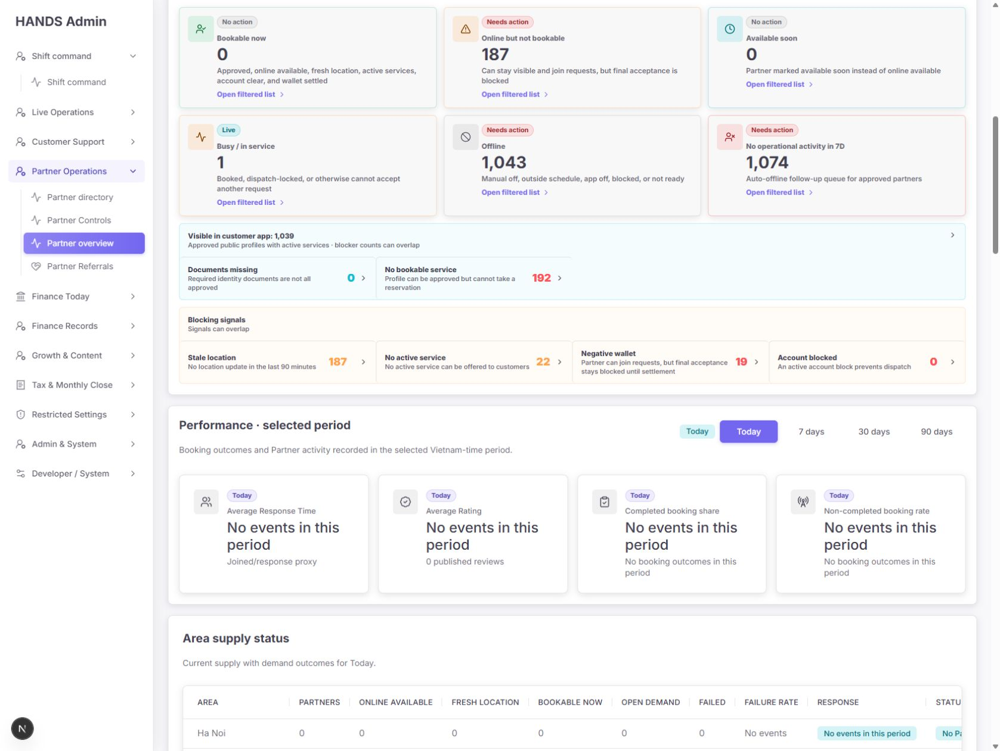

### Step 3 — Today Area·Service supply

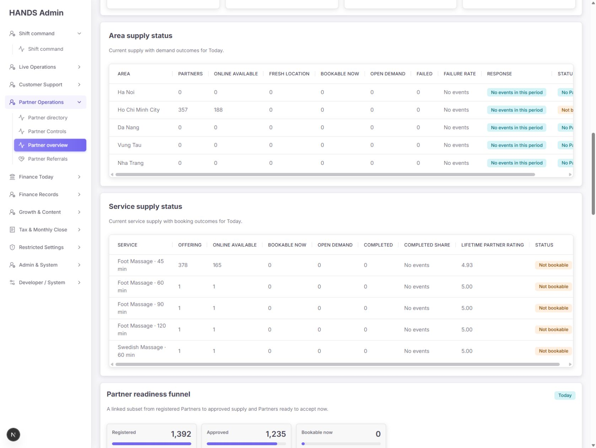

### Step 4 — Today Readiness·App activity

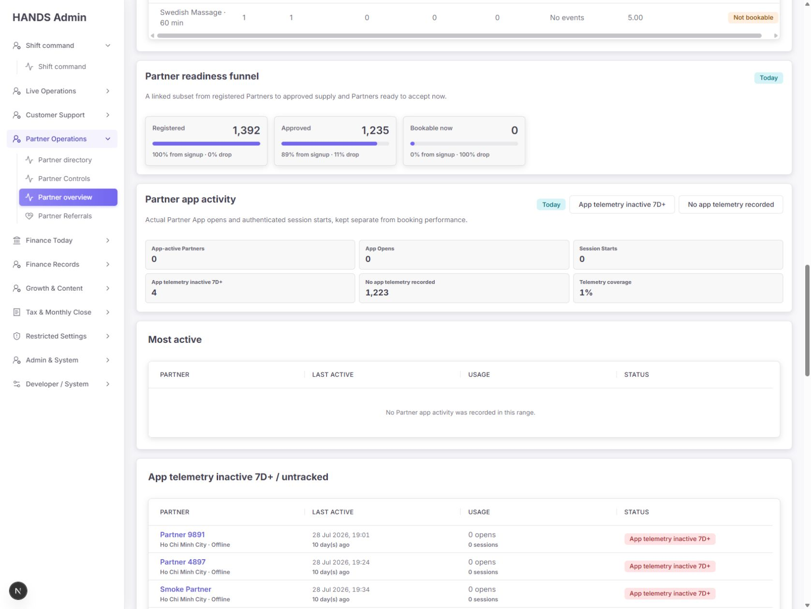

### Step 5 — Today App·Quality·Finance

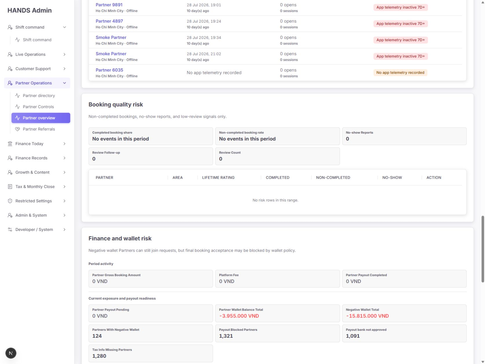

### Step 6 — Today Finance·Selection empty

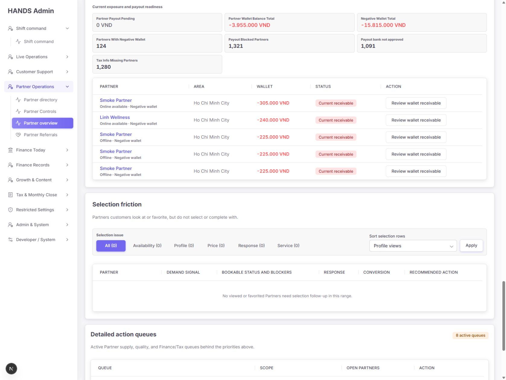

### Step 7 — Today Detailed action queues

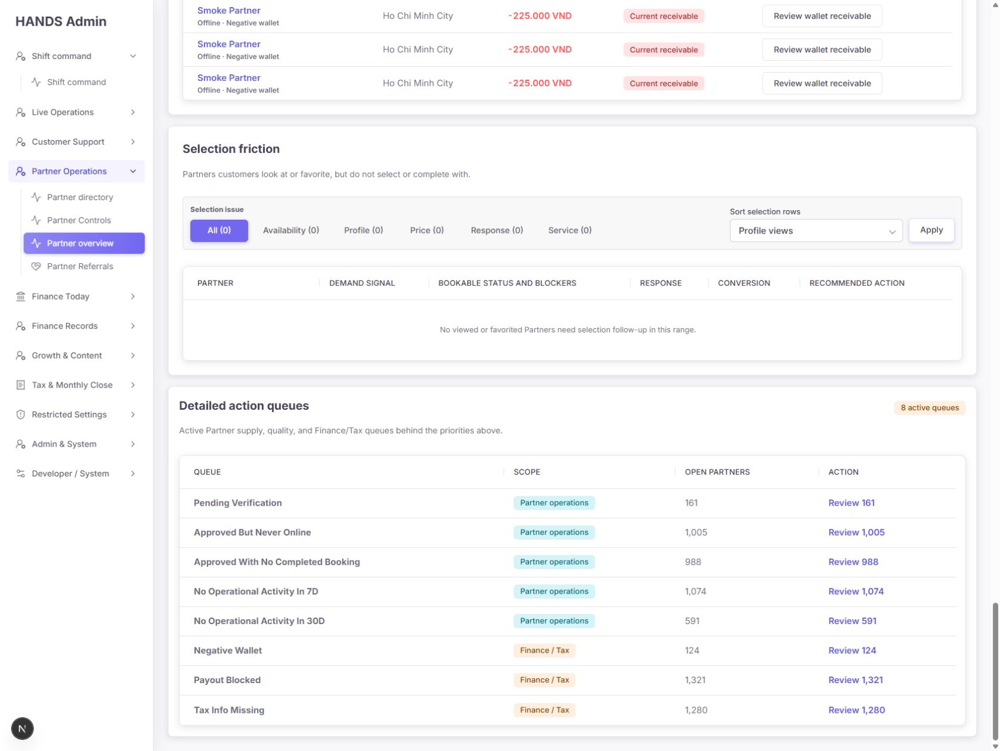

### Step 8 — Last 7 days 헤더·Action required

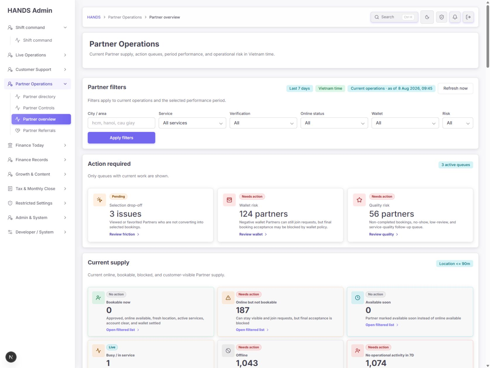

### Step 9 — Last 7 days Performance·Area

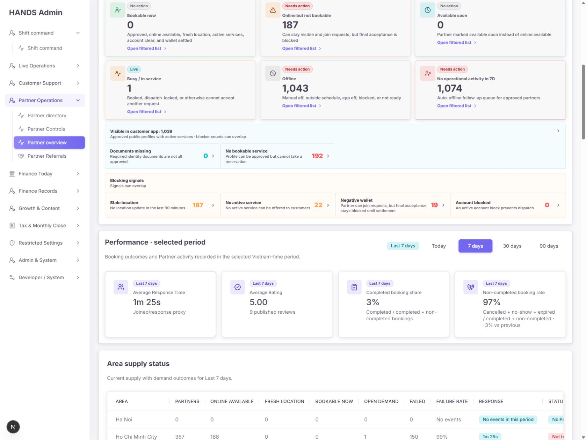

### Step 10 — Last 7 days Service·Readiness

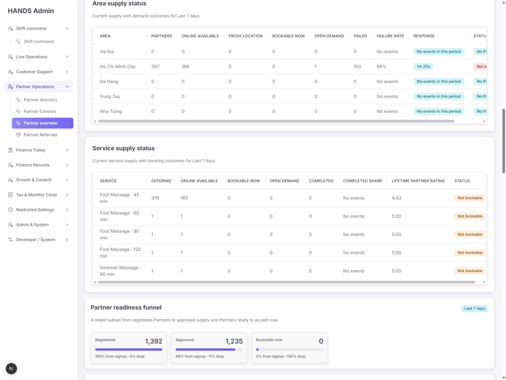

### Step 11 — Last 7 days App activity·Quality

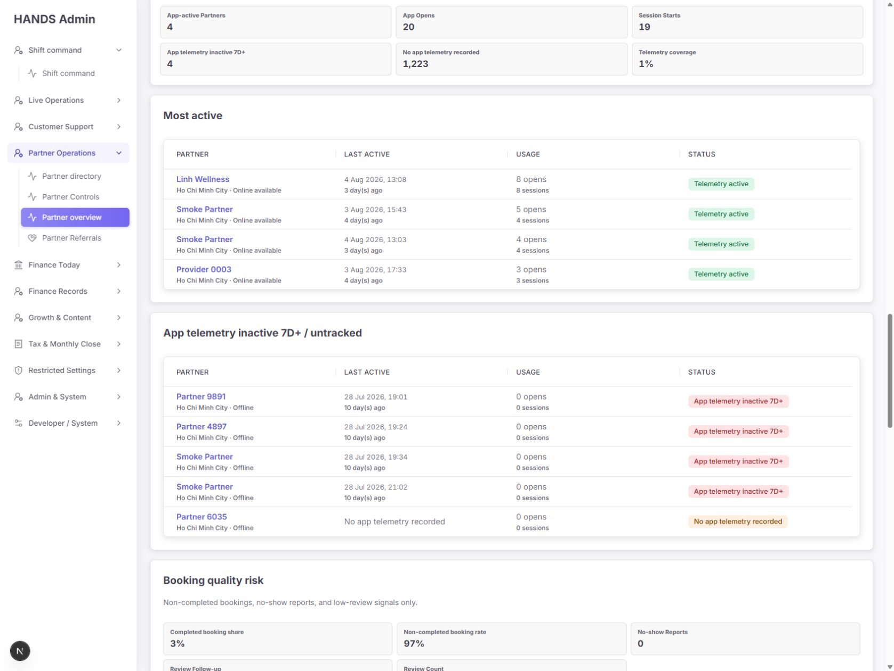

### Step 12 — Last 7 days Quality·Finance

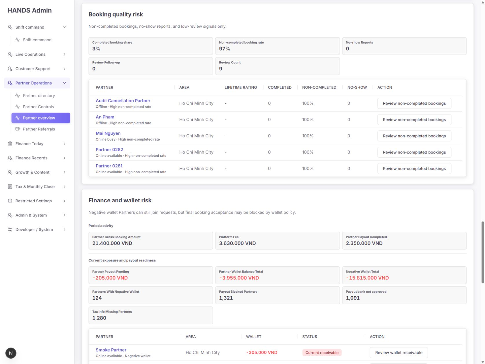

### Step 13 — Last 7 days Selection·Queues

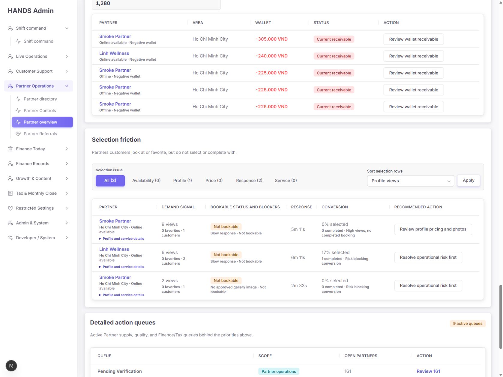

### Step 14 — Negative wallet 필터 적용 상태

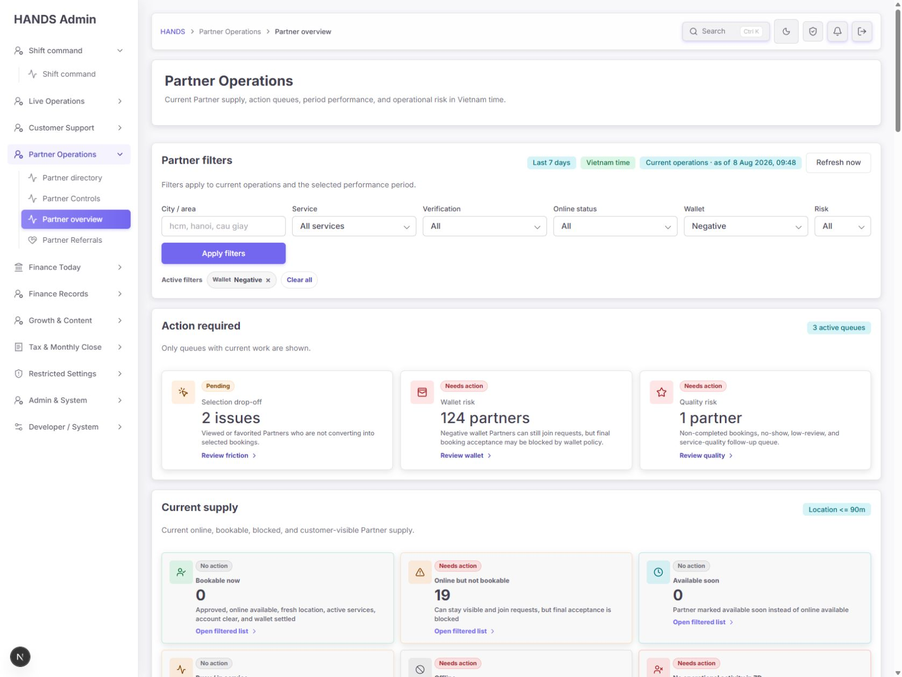

## 13. 감사 한계

- 로컬 로그인 상태와 2026-08-08의 현재 데이터만 사용했다.
- 요청에 따라 1024px 이하 반응형 검사는 수행하지 않았고 보고서에도 포함하지 않았다.
- Today, 7d, Negative wallet의 대표 상태를 확인했으며 모든 도시·서비스·승인·risk 조합을 전수 실행하지 않았다.
- 프로덕션 데이터량, 네트워크 지연, 권한별 UI, 다크 모드, 실제 운영 SLA 정책은 이번 범위가 아니다.
- 스크린샷은 모두 이번 감사에서 새로 캡처하고 개별 확인한 화면만 사용했다.
