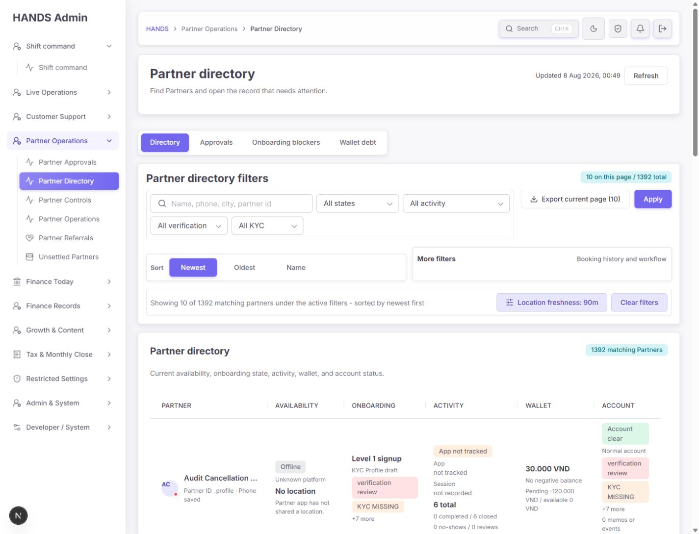
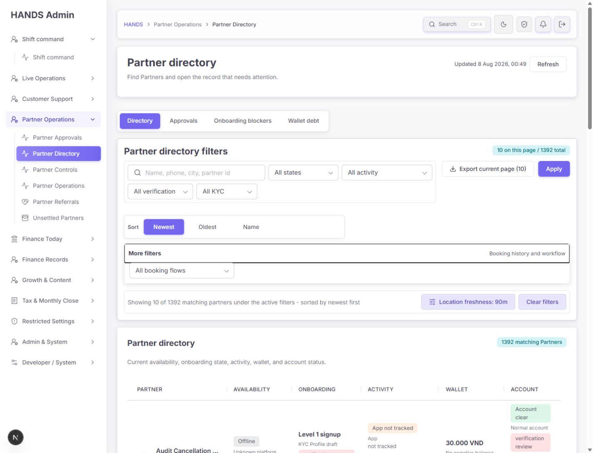
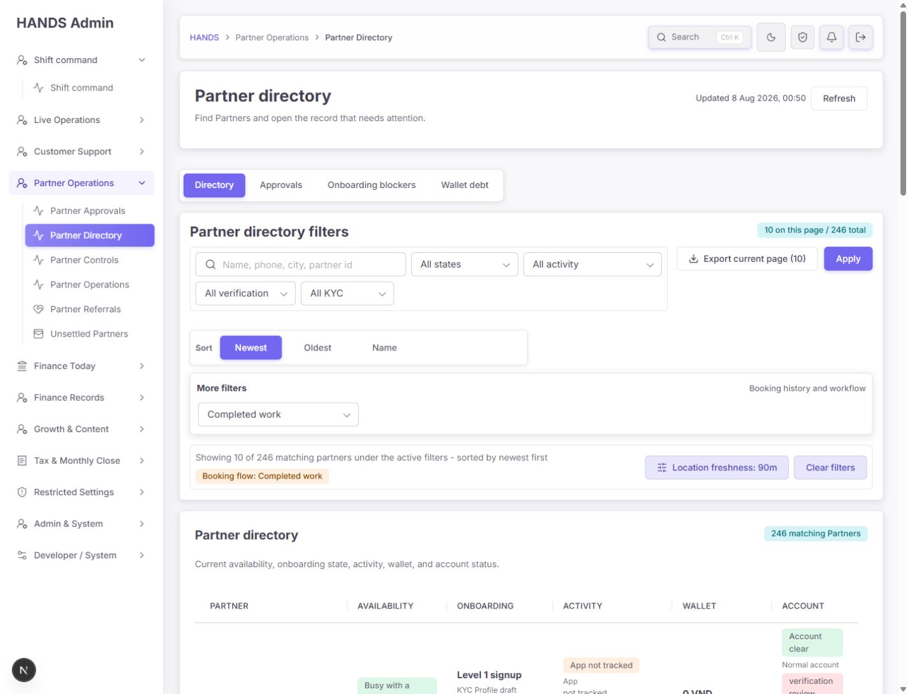
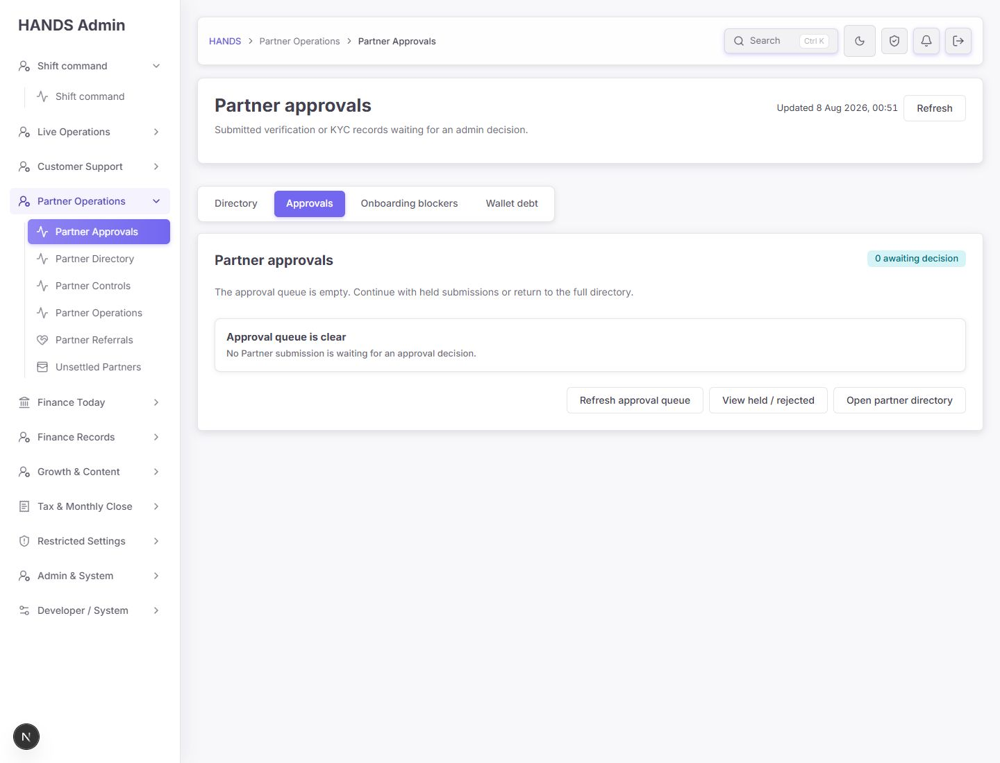
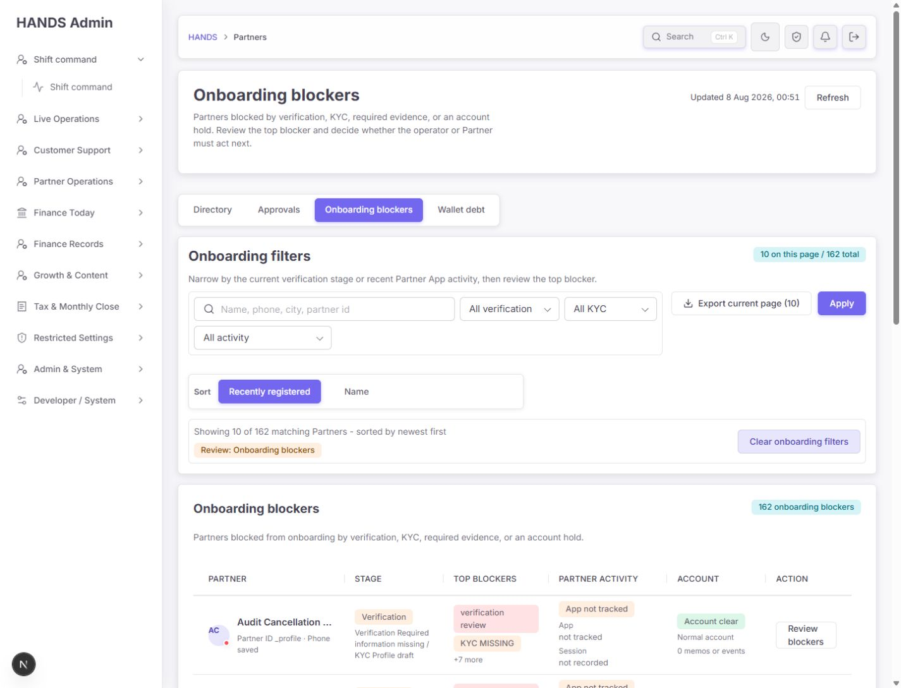
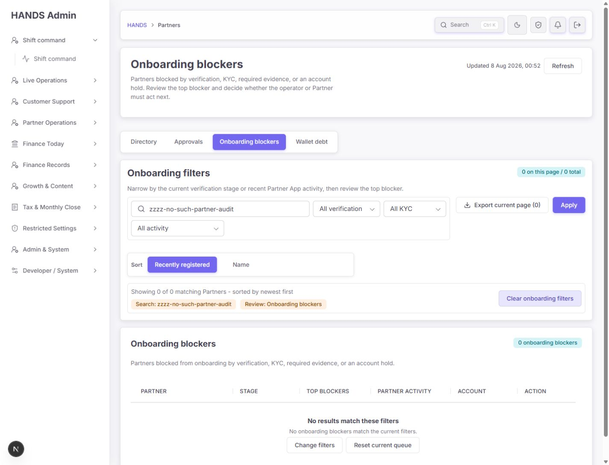
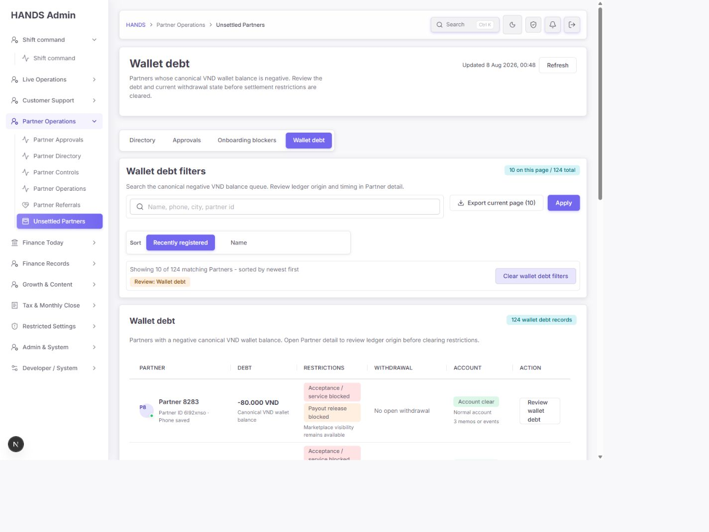

# Partners 페이지 재감사 보고서

- 대상: `http://localhost:3101/partners` 및 Directory / Approvals / Onboarding blockers / Wallet debt 모드
- 감사일: 2026-08-08
- 기준 화면: 1440px 이상 데스크톱 운영 환경
- 제외: 요청에 따라 1024px 이하 반응형·모바일 화면은 검사하지 않음
- 방법: 로그인된 실제 화면 캡처, 필터·정렬·초기화 동작 검증, URL·DOM 확인, 관련 UI·API·CSV 코드 교차 검토, 관련 자동 테스트 실행

## 1. 종합 결론

이전 감사의 핵심 방향은 상당 부분 잘 반영됐다. 대규모 목록이 서버 기준 건수와 함께 표시되고, 네 가지 운영 모드가 내부 탭으로 정리됐으며, Wallet debt 화면은 기준 잔액과 제한 정책을 운영 언어로 명확히 보여준다. 1440px에서도 핵심 표가 가로 스크롤 없이 들어온다.

다만 아직 완료로 보기 어려운 문제가 다섯 가지 있다.

1. `Oldest` 정렬이 가입일이 아니라 `updatedAt`을 사용해 운영자 기대와 실제 결과가 다르다.
2. 좌측 내비게이션, breadcrumb, 내부 탭의 분류와 명칭이 서로 다르다.
3. 필터 제출 후 빈 파라미터와 기본값이 URL에 누적된다.
4. Onboarding blockers가 문제 개수는 보여주지만 “누가 다음에 무엇을 해야 하는가”는 충분히 알려주지 않는다.
5. CSV upstream 조회 실패가 정상적인 0건 CSV처럼 보일 수 있다.

전체 판정은 **양호하지만 운영 배포 전 P1 수정 권장**이다. 남은 작업은 시각 장식보다 데이터 의미, 정보구조, 오류 신뢰성에 집중해야 한다.

## 2. 이전 핵심 요건 재검증

| 감사 항목 | 판정 | 확인 내용 |
|---|---|---|
| 서버 기준 목록·건수·페이지네이션 | 통과 | Directory 1,392건, Onboarding blockers 162건, Wallet debt 124건이 표·요약에 일관되게 반영됨 |
| 전체 결과 기준 정렬 | 부분 통과 | Name 정렬은 전체 124건을 유지했지만 `Oldest`는 가입일이 아닌 수정일 오름차순 |
| 네 가지 운영 모드 | 부분 통과 | 내부 탭은 명확하지만 좌측 메뉴에는 3개만 있고 명칭도 다름 |
| Wallet debt 기준 잔액 | 통과 | `Canonical VND wallet balance`와 제한 상태를 함께 표시 |
| Approval queue | 통과(빈 상태만 확인) | 0건 상태와 복귀 동선은 명확함. 실제 승인 대기 행은 데이터 부재로 미검증 |
| Onboarding blockers | 부분 통과 | blocker 요약은 있으나 다음 담당자와 구체 행동이 부족함 |
| 필터 적용·초기화 | 통과 | Booking flow 적용 시 1,392→246건, 초기화 시 `/partners`와 1,392건으로 복귀 |
| 필터 URL 정규화 | 미통과 | GET form이 빈 값과 기본 정렬을 주소에 포함 |
| 1440px 표 가독성 | 통과 | 표와 부모가 약 1,052px로 일치하고 가로 overflow 없음 |
| 빈 결과 복구 | 통과 | 설명, 활성 필터, 초기화 동선 제공 |
| CSV 범위 명시 | 통과 | `Export current page (10)` 및 응답 메타데이터가 현재 페이지 범위를 명시 |
| CSV 실패 처리 | 미통과 | upstream 실패를 `[]`로 바꿔 정상 0건처럼 생성될 수 있음 |
| 파트너 전역 검색 | 부분 통과 | `Partners` 검색 시 복수형 때문에 일부 목적지가 검색되지 않음 |

## 3. 화면별 분석

### 3.1 Directory — 상태: 양호, 행 정보 중복 정리 필요



좋아진 점:

- 총 1,392건과 현재 페이지 10건을 명확히 구분한다.
- Search, State, App activity, Verification, KYC와 Apply, 정렬의 역할이 구분된다.
- 여섯 칼럼이 1440px에서 가로 스크롤 없이 보인다.
- 표 머리글의 `scope="col"`, 내부 탭의 `aria-current="page"` 등 기본 접근성 구조가 있다.
- Wallet이 잔액과 payout 상태를 함께 보여 상세 진입 전 분류에 유용하다.

남은 문제와 수정:

1. `Onboarding`과 `Account`에 같은 blocker가 반복된다. Account에서는 계정 제한/정상 상태와 프로필 열기만 보여주고 blocker 반복 표시는 제거한다.
2. `Open`이 Account 칼럼 안에 있으므로 칼럼명을 `Account / action`으로 바꾸거나 버튼을 `Open profile`로 명확히 한다. 별도 칼럼 추가는 1440px 밀도를 해칠 수 있어 우선 문구 수정이 더 안전하다.
3. `Find Partners and open the record that needs attention.`은 너무 포괄적이다. `Search by partner name, phone, or ID, then open a profile to review status and restrictions.`처럼 실제 행동을 설명한다.
4. `Newest`는 가입일 내림차순인데 `Oldest`는 수정일 오름차순이다. Directory의 Oldest를 `user.createdAt asc`로 맞추고 승인 큐의 제출일 정렬은 별도로 유지한다.

수용 기준:

- Newest와 Oldest가 같은 가입일 필드의 desc/asc여야 한다.
- Onboarding과 Account에서 같은 blocker 문구가 반복되지 않아야 한다.
- 표 머리글과 버튼 문구만 보고 프로필 열기 위치를 예측할 수 있어야 한다.

### 3.2 More filters — 상태: 동작 정상, 숨김 구조 비효율



숨겨진 영역에는 `Booking flow` 한 개만 있다. native `details`와 focus outline 덕분에 기본 조작은 가능하지만, 핵심 필터의 존재를 열기 전에는 알 수 없다.

권장 수정:

- 가장 단순한 방법은 Booking flow를 기본 필터 줄로 올리는 것이다.
- 폭을 유지해야 한다면 disclosure 라벨을 `More filters`가 아니라 `Booking flow`로 바꾼다.
- 실제 숨길 필터가 2개 이상 생기기 전까지 drawer나 새 필터 프레임워크는 만들지 않는다.

### 3.3 필터 적용 — 상태: 결과 정확, URL 비정규화



`Completed work` 적용 시 1,392건에서 246건으로 줄고, 활성 칩과 CSV 경로도 갱신된다. Clear filters도 정확히 기본 화면으로 돌아간다.

문제는 주소가 다음처럼 불필요한 값까지 포함한다는 점이다.

```text
/partners?sort=newest&q=&providerStatus=&activity=&verification=&kyc=&bookingFlow=completed-work
```

생성된 내부 링크는 이미 `/partners?bookingFlow=completed-work`로 정규화되므로 원인은 링크 빌더가 아니라 native GET form 제출이다.

권장 수정:

- `AdminDirectoryFilterForm`의 모든 호출부를 확인한 뒤 빈 값과 기본값을 제출 전 제거하는 한 곳의 root-cause 수정으로 해결한다.
- 현재 `buildPartnerListHref`의 정규화 규칙을 submit 경로에서 재사용한다.
- 기본 `sort=newest`와 빈 `q`, `providerStatus`, `activity`, `verification`, `kyc`는 URL에서 생략한다.

수용 기준:

- Completed work만 적용한 주소는 `/partners?bookingFlow=completed-work`여야 한다.
- Onboarding 검색은 `/partners?review=unapproved&q=...`만 남아야 한다.
- URL 공유 후 같은 탭·필터·건수가 복원되어야 한다.

### 3.4 Approvals 빈 큐 — 상태: 양호, 복귀 문구 정리 필요



좋아진 점:

- `0 awaiting decision`과 `Approval queue is clear.`가 현재 상태를 즉시 설명한다.
- 빈 표 대신 완료 상태를 보여 불필요한 탐색을 막는다.
- 디렉터리로 돌아가는 동선이 있다.

남은 문제와 수정:

1. 상단 `Refresh`와 본문 `Refresh approval queue`가 중복된다. 상단 하나만 유지한다.
2. `View held / rejected`는 전체 onboarding blockers로 이동하므로 목적지를 과도하게 좁게 설명한다. 실제 별도 필터가 없다면 `View onboarding blockers`로 바꾼다.
3. 실제 held/rejected 전용 모드는 운영 요구와 데이터 분류가 확인되기 전에는 추가하지 않는다.

### 3.5 Onboarding blockers — 상태: 부분 양호, 다음 행동 부족



좋아진 점:

- 162건과 현재 페이지 10건을 구분한다.
- Verification stage, KYC stage, Partner activity가 업무에 맞게 구성됐다.
- Top blockers와 `+N more`가 모든 blocker의 무제한 확장을 막는다.
- 1440px에서 여섯 칼럼이 안정적이다.

핵심 문제:

- 화면 설명은 operator와 Partner 중 다음 행동 주체를 결정한다고 하지만 행에는 owner가 없다.
- `verification review`, `KYC MISSING`, `+7 more`는 상태이지 행동 지시가 아니다.
- Stage 셀의 `Verification Verification ...`처럼 같은 단어가 반복된다.
- CTA가 모두 `Review blockers`라서 다음 작업 차이를 보여주지 못한다.

권장 구조:

1. Stage: 현재 단계만 간결히 표시
2. Next action: `Partner: upload ID front`, `Operator: review submitted KYC`, `Operator: lift account hold`
3. Other blockers: `+N more`
4. Activity
5. Account
6. Review blockers

새 칼럼을 늘리기보다 현재 Top blockers 내용을 담당자+행동으로 바꾸면 1440px 폭을 유지할 수 있다.

수용 기준:

- 모든 행에서 다음 담당자가 Partner인지 Operator인지 프로필 진입 전에 보여야 한다.
- 첫 blocker는 상태명이 아니라 실행 가능한 동사 문구여야 한다.
- 같은 단어가 한 셀에 불필요하게 반복되지 않아야 한다.

### 3.6 Onboarding 필터 0건 — 상태: 양호, 행동 중복 정리 필요



좋아진 점:

- `No results match these filters`가 큐 자체가 비었다는 오해를 막는다.
- 활성 필터와 초기화 동선이 있다.
- 초기화 후에도 Onboarding blockers 모드를 유지한다.

남은 문제와 수정:

1. `Clear onboarding filters`, `Change filters`, `Reset current queue`가 회복 동작을 반복한다. `Reset filters` 하나를 primary로 남기고, 필요하면 Change filters만 secondary text link로 둔다.
2. `Export current page (0)`이 활성 상태다. 0건이면 disabled 또는 숨김 처리하고 `No records to export`를 보조 설명으로 제공한다.

### 3.7 Wallet debt — 상태: 양호, 개선 성공



이번 재감사에서 가장 안정적인 영역이다.

- 124건과 현재 페이지 10건을 명확히 구분한다.
- `Canonical VND wallet balance`가 제한 판단 기준 금액임을 분명히 한다.
- `Acceptance/service blocked`, `Payout release blocked`, `Marketplace visibility remains available`이 정책 결과를 운영 언어로 설명한다.
- Debt → Restrictions → Withdrawal → Account → Action 순서가 자연스럽다.
- Name 정렬 후에도 전체 124건을 유지해 현재 페이지 로컬 정렬 문제는 보이지 않았다.

남은 문제는 전역 명칭이다. 내부는 `Wallet debt`인데 좌측 메뉴와 검색은 `Unsettled Partners`라고 부른다. 같은 업무를 두 이름으로 부르면 별도 기능처럼 보인다. 모든 위치에서 `Wallet debt`로 통일한다.

## 4. 정보구조와 내비게이션

좌측 메뉴에는 `Partner Approvals`, `Partner Directory`, `Unsettled Partners`가 있지만 내부 탭에는 `Directory`, `Approvals`, `Onboarding blockers`, `Wallet debt`가 있다. 3개와 4개가 불일치하고 명칭도 다르며, Onboarding blockers에서는 좌측 Partner Operations 그룹이 접히고 breadcrumb도 `HANDS > Partners`로 축소된다.

권장 구조:

```text
Partner Operations
└─ Partner directory (또는 Partner workspace)
   ├─ Directory
   ├─ Approvals
   ├─ Onboarding blockers
   └─ Wallet debt
```

- 좌측 메뉴는 `/partners` workspace 진입점 하나를 사용한다.
- 모든 primary review query에서도 같은 좌측 항목을 활성화한다.
- 세부 모드는 내부 탭이 담당한다.
- breadcrumb는 `Partner Operations > Partner directory > Onboarding blockers`처럼 현재 모드까지 보여준다.
- `/partners/overview` 링크가 상위 그룹과 같은 `Partner Operations` 라벨이면 `Partner overview` 또는 `Supply overview`로 바꾼다.

좌측에 네 큐를 모두 노출하는 대안도 있으나 내부 탭과 역할이 중복된다. 직접 진입 빈도 데이터가 없는 현재는 workspace 하나가 더 단순하다.

## 5. 전역 검색

`Partners` 검색 시 `Unsettled Partners`만 나타났다. `Partner Directory`와 `Partner Approvals`는 단순 substring 비교 때문에 단수형과 복수형이 일치하지 않는다.

권장 수정:

- 검색 alias에 `partner`, `partners`, `provider`, `providers`를 추가하거나 단순 복수형 `s`를 제거한 token 비교를 적용한다.
- `Unsettled Partners`를 `Wallet debt`로 바꾼다.
- workspace 하나로 통합하면 검색 결과는 Partner directory 하나를 기본으로 하고 approvals/onboarding/wallet debt를 alias로 연결한다.

## 6. CSV 운영 안전성

UI의 `Export current page (10)`과 범위 메타데이터는 정확하다. 현재 증거만으로 전체 CSV 기능을 추가할 필요는 없다.

그러나 `apps/admin_web/app/api/admin/partners/export/route.ts`에서 partner list와 policy 조회 실패 시 fallback `[]`를 사용한다. API 장애가 정상 0건 CSV처럼 보일 수 있다.

권장 수정:

- 기존 프로젝트의 result-aware fetch 패턴을 재사용한다.
- upstream 실패 시 CSV 200을 만들지 말고 non-2xx와 운영자용 오류를 반환한다.
- 정상 조회가 실제 0건인 경우만 header-only CSV 또는 UI 0건 disabled 정책을 적용한다.
- 새 export service나 retry framework는 필요 없다.

수용 기준:

- upstream 500/timeout이 다운로드 성공처럼 보이지 않아야 한다.
- 정상 0건과 조회 실패가 테스트에서 다른 응답 상태를 가져야 한다.
- 기존 current-page 범위 메타데이터는 유지한다.

## 7. 우선순위

### P1 — 운영 판단 오류 또는 핵심 탐색 혼란

1. **Oldest 정렬 기준 수정**
   - 근거: `apps/api/src/admin/admin.service.ts`의 default는 `user.createdAt desc`, old는 `updatedAt asc`.
   - 수정: Directory old를 `user.createdAt asc`로 변경. Approval 제출일 정렬은 유지.

2. **파트너 내비게이션 단일 workspace화**
   - 근거: `admin-navigation.ts`에는 Approvals, Directory, Unsettled만 있고 unapproved 항목이 없음. `admin-nav-match.ts`는 unapproved를 primary review로 보지만 매칭 nav href가 없음.
   - 수정: `/partners` 하나를 workspace 항목으로 만들고 모든 primary review에서 활성 유지.

3. **CSV 실패와 정상 0건 분리**
   - 근거: export route의 `adminGet(..., [])` fallback.
   - 수정: result-aware fetch 후 실패 시 non-2xx.

4. **Onboarding 담당자+행동 표시**
   - 수정: 기존 Top blockers를 Next action으로 재구성. 새 데이터 모델보다 기존 blocker/status에서 owner/action을 매핑.

### P2 — 반복 작업과 인지 부하

5. 필터 URL에서 빈 값과 기본 sort 제거.
6. Booking flow를 기본 필터로 이동하거나 disclosure 라벨을 직접 표기.
7. Directory의 중복 blocker 제거.
8. 빈 상태 refresh/reset 중복과 0건 export 정리.
9. Partner/Partners 검색 alias와 Wallet debt 명칭 통일.

## 8. 접근성·운영 가독성

확인된 장점:

- 내부 탭의 현재 상태가 `aria-current="page"`로 노출된다.
- 표 머리글이 column scope를 가진다.
- native label과 form control 연결이 사용된다.
- More filters를 키보드로 열 수 있고 focus outline이 보인다.
- 상태를 색상만이 아니라 텍스트 배지로도 표현한다.

남은 위험:

- 좌측 활성 상태와 breadcrumb가 사라지면 보조기술 사용자도 현재 위치 맥락을 잃는다.
- 같은 기능을 서로 다른 이름으로 중복 제공하면 탐색 순서가 길어진다.
- 0건 export는 의미 없는 focus stop을 만든다.

이번 감사에서는 실제 스크린리더 낭독 순서, 전체 키보드 순회, 색 대비 수치 측정을 수행하지 않았으므로 WCAG 전체 준수 판정은 하지 않는다.

## 9. 최소 수정 파일

1. `apps/api/src/admin/admin.service.ts` — Directory Oldest 기준
2. `apps/admin_web/lib/admin-navigation.ts` — workspace 명칭·링크
3. `apps/admin_web/lib/admin-nav-match.ts` — review query 활성 매칭
4. `apps/admin_web/components/admin-workspace-header.tsx` — 검색 alias/복수형
5. `apps/admin_web/components/admin-directory-filter-form.tsx` 또는 기존 canonical href helper — 빈/default GET 파라미터 제거
6. `apps/admin_web/app/partners/partner-master-list-section.tsx` — Next action, 중복 blocker, 빈 상태 문구
7. `apps/admin_web/app/api/admin/partners/export/route.ts` — upstream 오류 분리

별도 UI 라이브러리, 필터 상태 관리 패키지, 새 export 계층은 필요 없다.

## 10. 구현 후 체크리스트

- [ ] 1440px의 네 모드 모두 가로 스크롤이 없다.
- [ ] Newest/Oldest가 같은 가입일 필드의 desc/asc를 사용한다.
- [ ] 좌측 메뉴는 네 내부 모드 모두에서 같은 항목을 활성화한다.
- [ ] breadcrumb가 현재 내부 모드까지 표시한다.
- [ ] Partner/Partners/Provider/Providers 검색이 같은 workspace를 찾는다.
- [ ] 필터 URL에 빈 파라미터와 기본 sort가 없다.
- [ ] URL 공유 후 같은 탭·필터·건수가 복원된다.
- [ ] Onboarding 각 행에서 다음 담당자와 행동을 프로필 진입 전에 알 수 있다.
- [ ] Directory에서 같은 blocker가 두 칼럼에 반복되지 않는다.
- [ ] 0건에서는 export가 실행되지 않는다.
- [ ] upstream 실패 시 CSV 200이 아니라 오류 응답이 난다.
- [ ] 승인 큐에 실제 데이터가 생기면 제출 경과 시간과 결정 CTA를 재검증한다.

## 11. 자동 테스트

- Admin web 파트너 관련: **10 files, 134 tests passed**
- API partner 관련: **1 file, 65 tests passed, 492 skipped by name filter**

테스트가 통과해도 Oldest 의미 불일치와 CSV false-empty는 현재 기대값이 구현을 허용하기 때문에 남아 있다. 수정 시 각각 작은 회귀 테스트를 추가해야 한다.

## 12. 증거 범위와 한계

- 현재 로그인 세션과 존재하는 데이터로 검증했다.
- Approvals가 0건이라 실제 승인 대기 row는 시각 검증하지 못했다.
- CSV는 실제 개인정보 파일을 다운로드하지 않고 route 코드와 테스트로 검토했다.
- 요청에 따라 1440px 이상만 감사했으며 1024px 이하 화면은 포함하지 않았다.
- 1440px에서 실제 표와 부모 컨테이너 너비를 비교해 overflow 부재를 확인했다.
