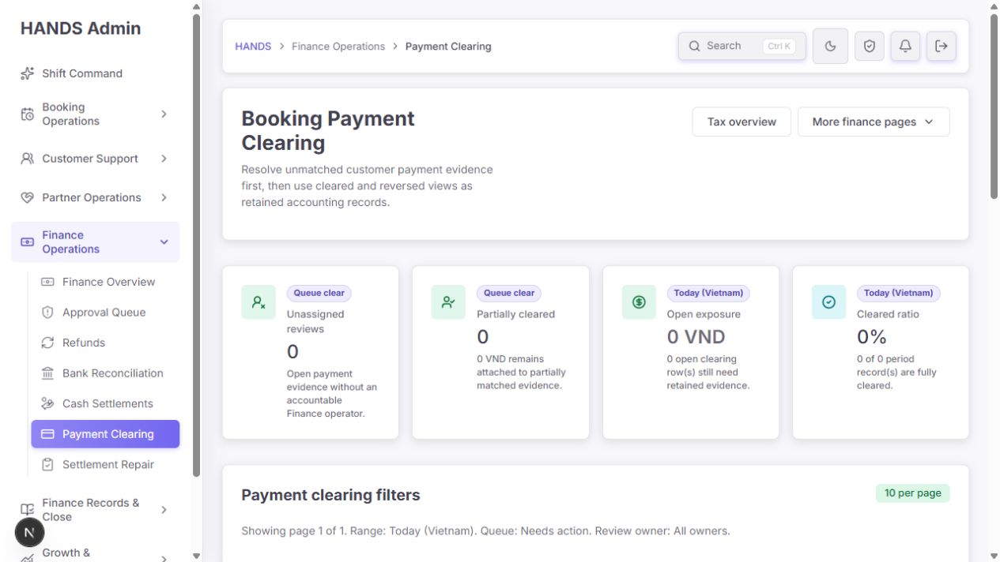
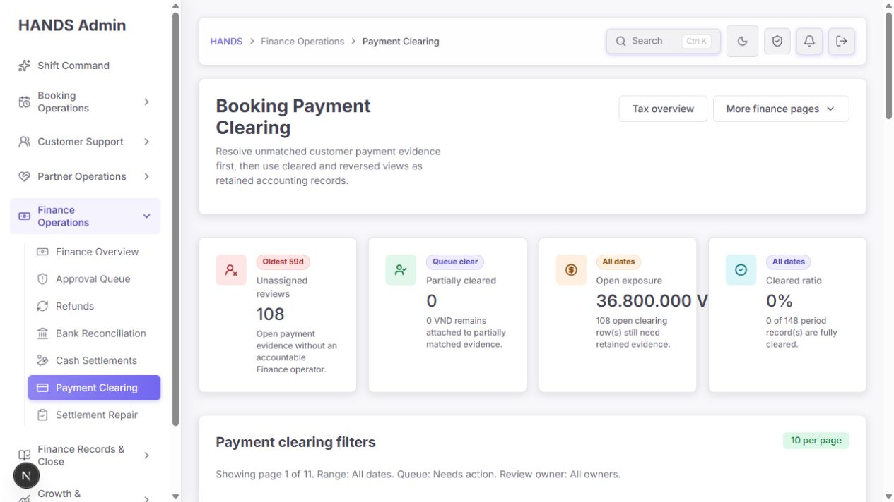
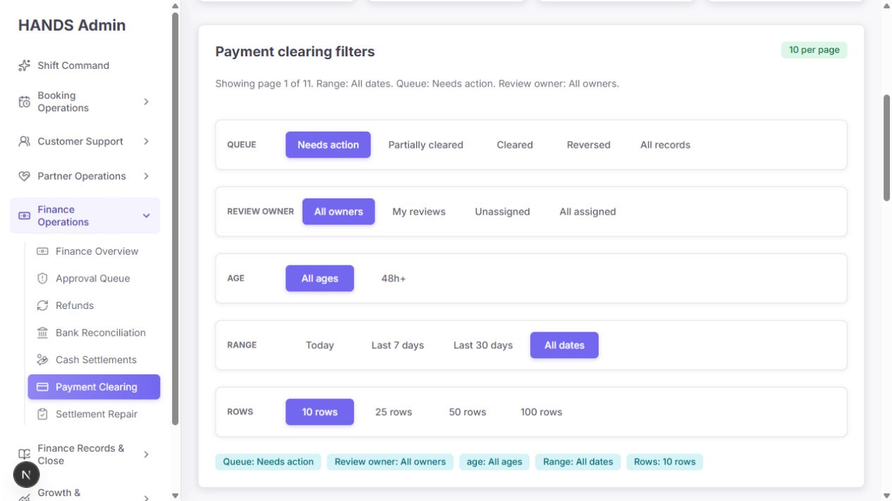
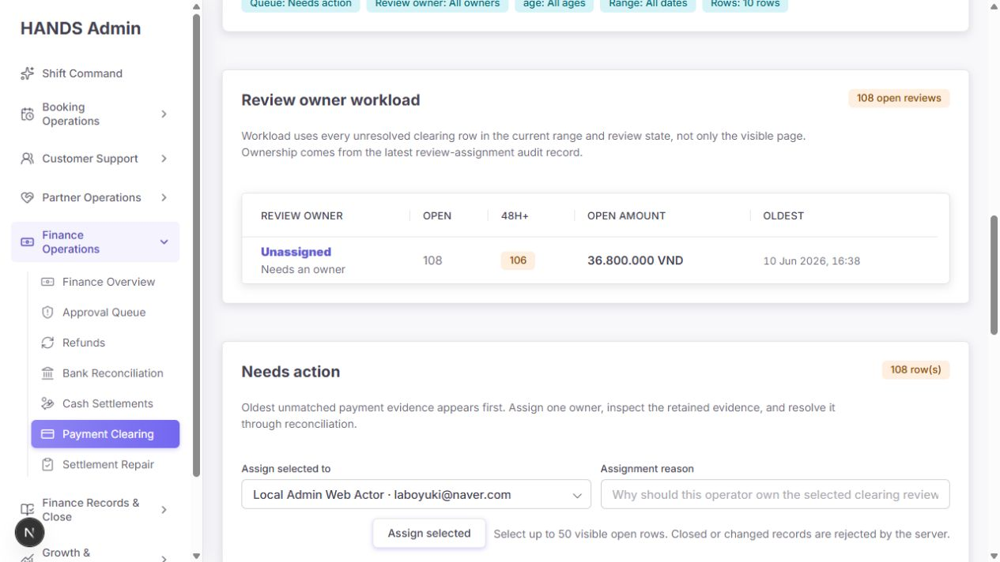
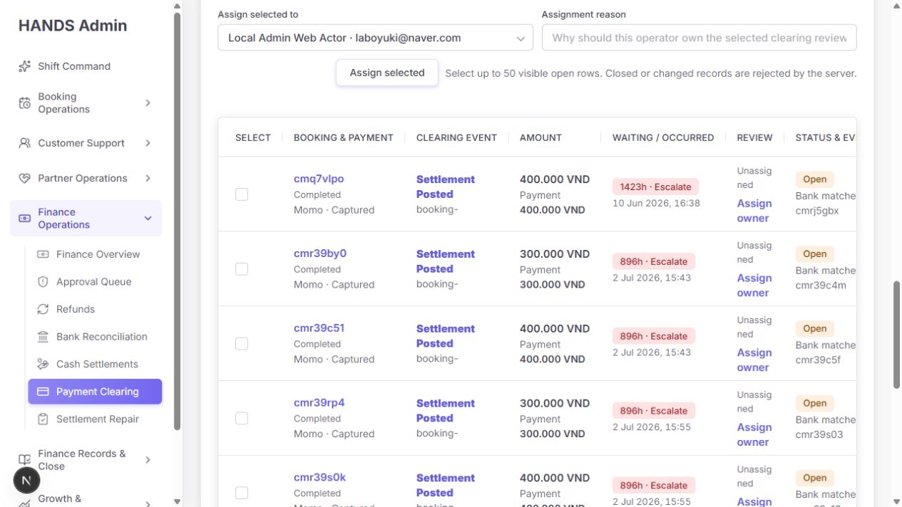
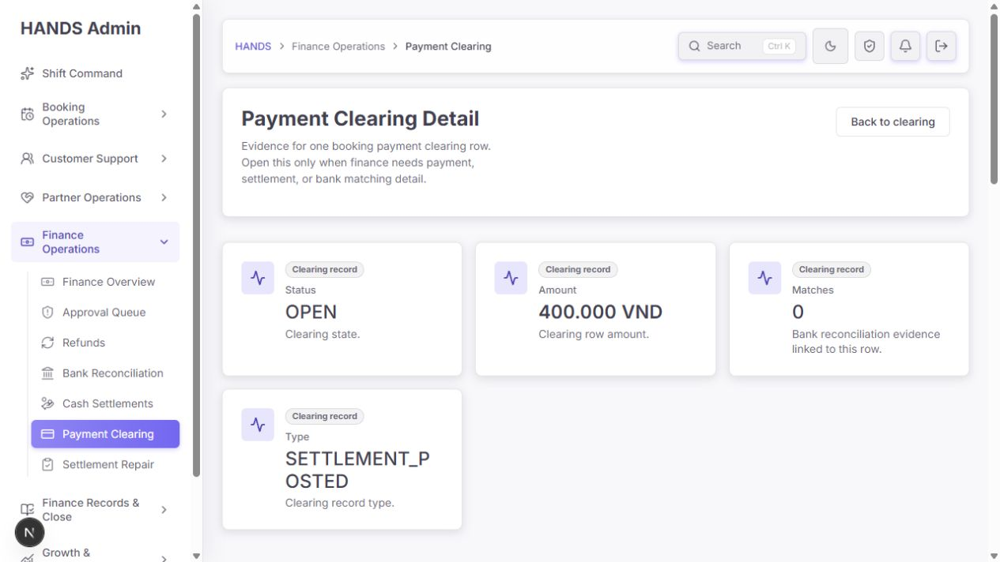
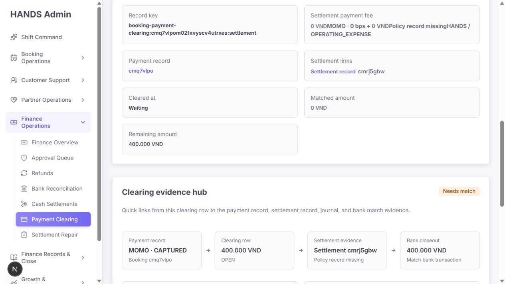
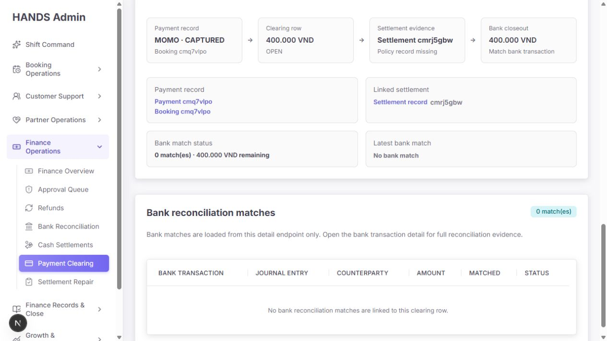
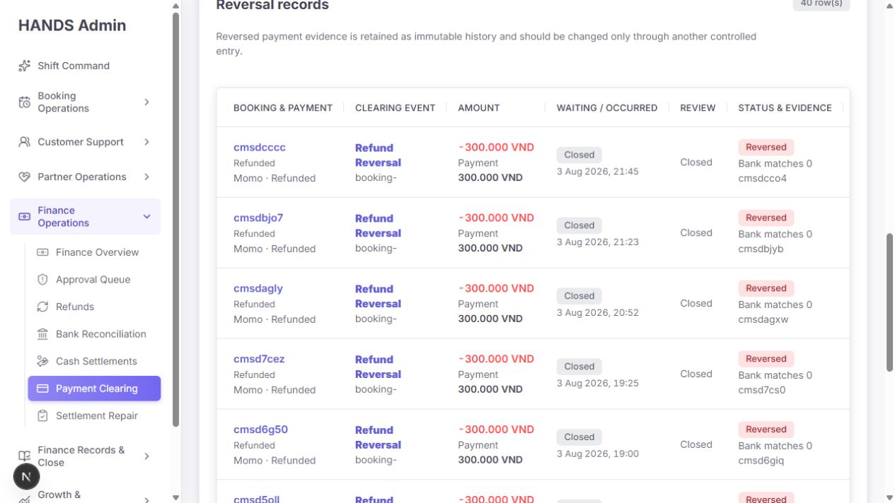
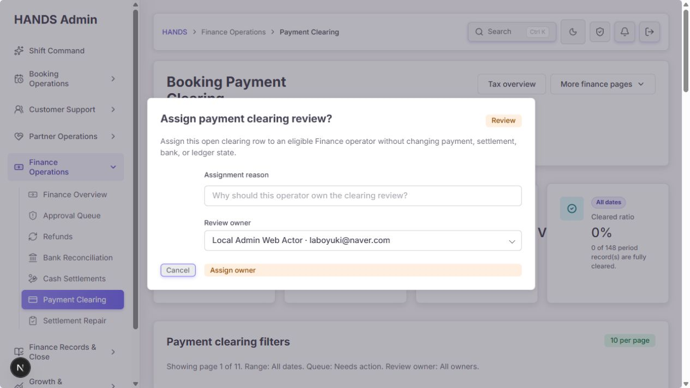

# Payment Clearing 운영 화면 심층 감사 보고서

- 감사일: 2026-08-08
- 대상 화면: `/finance-tax/payment-clearing`, 전체 기간·Needs action·Reversed·owner assignment 및 `/finance-tax/payment-clearing/[id]`
- 연결 업무: `/finance-tax/bank-reconciliation/[id]`의 payment-clearing candidate 선택과 Admin API reconciliation 상태 전이
- 사용자 관점: 재무 운영자가 미매칭 결제 증빙을 찾고, 담당자를 지정하고, 올바른 은행 거래와 연결해 결과를 확인하는 흐름
- 화면 범위: 1440px 이상 데스크톱 운영 환경을 목표로 평가했다. 1024px 이하 반응형은 요청에 따라 평가에서 제외했다.
- 안전 원칙: 실제 배정·매칭·취소 mutation은 실행하지 않고, 읽기 전용 화면과 코드·테스트로 검증했다.

## 1. 최종 판정

현재 Payment Clearing은 **현황 조회와 담당자 분배를 위한 큐로는 의미가 있으나, Payment Clearing 안에서 실제 clearing을 끝낼 수 없는 반쪽짜리 운영 흐름**이다.

감사 시점의 실제 전체 기간 현황은 다음과 같았다.

- 전체 기록: 148건
- Needs action: 108건
- Open exposure: 36,800,000 VND
- 48시간 초과: 106건
- 최장 대기: 59일
- Unassigned: 108건
- Partially cleared: 0건
- Cleared: 0건
- Reversed: 40건

그런데 기본 진입 화면은 `Today`를 사용하여 모든 값을 0으로 보여준다. 더 심각하게는 clearing을 실제로 수행하는 Bank Reconciliation 화면이 payment-clearing 후보를 `최근 30일`, `OPEN`, `최대 50개`로만 불러온다. 따라서 현재 59일 된 항목과 향후 partially-cleared 항목은 UI에서 은행 거래에 연결할 후보로 나타나지 않을 수 있다.

또한 API는 payment-clearing source와 bank transaction을 연결할 때 currency와 상태는 검사하지만, positive payment clearing과 bank `OUTFLOW`처럼 방향이 맞지 않는 조합을 서버에서 명시적으로 차단하지 않는다.

**운영 준비도: 4.6/10 — 읽기·분배 용도로는 사용 가능하지만, clearing 완료 흐름은 P0 수정 전 운영 배포 보류가 적절하다.**

## 2. 화면 흐름별 감사

### Step 1. 기본 진입 — 건강 상태: 위험

기본 URL은 `Needs action + Today (Vietnam)`이며 4개 command card가 모두 0이다. 운영자가 사이드바에서 처음 진입하면 실제 108건의 backlog가 존재한다는 사실을 알 수 없다.

좋은 점:

- 제목과 설명이 Payment Clearing의 목적을 대략 전달한다.
- `Unassigned`, `Partially cleared`, `Open exposure`, `Cleared ratio`로 운영 상태를 나누려는 구조는 합리적이다.

문제:

- `Today`라는 생성일 범위가 미해결 업무 큐의 기본 범위로 사용된다.
- 59일 된 미해결 건이 있어도 기본 화면은 “Queue clear”로 보인다.
- 오늘 빈 상태에서 전체 기간 backlog로 이동해야 한다는 안내가 없다.

권고:

- 기본값을 `All unresolved`로 변경한다.
- Today는 분석용 날짜 필터로만 유지한다.
- Today가 0이면서 다른 기간에 미해결 건이 있으면 `108 open records exist outside today`와 같은 cross-range 안내를 표시한다.
- command board의 날짜 기준과 queue 기준을 분리한다.

### Step 2. 전체 기간 command board — 건강 상태: 개선 필요

전체 기간에서는 108건, 36,800,000 VND, 최장 59일이라는 실제 위험이 드러난다. 그러나 `Cleared ratio 0%`는 148건 전체를 분모로 사용하면서 40건의 Reversed terminal record도 실패처럼 분모에 포함한다.

문제:

- `Cleared ratio = cleared / all records`는 reversed 상태가 존재하는 시스템에서 운영 해결률을 제대로 표현하지 못한다.
- 40건이 terminal reversal인데도 0%로만 보여 “아무 것도 해결되지 않았다”는 인상을 준다.
- 긴 금액 `36.800.000 VND`가 card 가용 폭을 넘어 시각적으로 잘릴 가능성이 확인되었다.
- Unassigned 108과 Open 108이 사실상 같은 backlog를 두 카드에서 반복한다.

권고 KPI:

1. `Open exposure` — 36,800,000 VND / 108건
2. `Over SLA` — 106건 / oldest 59d
3. `Unassigned` — 108건
4. `Terminal outcome` — Cleared 0 / Reversed 40

`Cleared ratio`를 유지하려면 분모 정의를 명시하거나 `Resolved ratio = (cleared + reversed) / total`로 바꾸고 상태별 수치를 함께 보여준다.

### Step 3. 필터 — 건강 상태: 과도한 기본 정보

Queue, Review owner, Age, Range, Rows의 모든 선택지가 각각 큰 한 줄을 차지하고, 그 아래에 같은 기본 선택을 칩으로 다시 반복한다.

문제:

- 기본값까지 활성 칩으로 반복하여 실제 사용자가 바꾼 조건이 구분되지 않는다.
- 108건을 다루는데 booking ID, payment ID, clearing ID, source key를 찾는 검색이 없다.
- event type, payment method, 금액, candidate availability 같은 실무 필터가 없다.
- Rows 10/25/50/100이 업무 필터와 같은 위계로 보여 정보량이 커진다.

권고 구성:

- 1행: `Needs match`, `Partially matched`, `Cleared`, `Reversed`, `All records` queue tabs
- 2행: ID 검색 + Owner + Sort + `Advanced filters`
- Advanced filters: SLA age, occurred range, event type, payment method, amount, rows per page
- 활성 칩은 기본값이 아닌 변경 조건만 표시
- 검색 API는 bookingId, paymentId, clearingEntryId, sourceKey와 정확 금액/transfer reference 관련 키를 지원

`Needs action`보다 `Needs bank match`가 이 화면의 실제 다음 행동을 더 정확히 설명한다.

### Step 4. Review owner workload — 건강 상태: 구조는 좋으나 운영 상태가 붕괴됨

현재 페이지 10건이 아니라 전체 unresolved queue를 기준으로 workload를 집계하는 것은 좋은 설계다. 그러나 현재는 108건 전체가 Unassigned라 workload table이 사실상 한 개의 경고 행으로 끝난다.

좋은 점:

- 전역 집계임을 문구로 명확히 설명한다.
- Open, 48h+, amount, oldest를 한 행에서 비교한다.
- API는 latest assignment audit를 기준으로 workload를 계산한다.

부족한 점:

- owner만 있고 `next due`, `last action`, `review progress`가 없다.
- assignment가 실제 reconciliation 권한이나 수행 actor와 연결되지 않아 “담당”의 의미가 workload 표시 수준에 머문다.
- 상세 화면에는 현재 owner와 assignment reason/history가 보이지 않는다.

권고:

- `Owner / Open / Over SLA / Exposure / Oldest / Due today`를 기본 열로 사용한다.
- owner 상세 drill-down에서 최근 배정 사유와 마지막 처리 시각을 보여준다.
- Payment Clearing detail에도 owner, assigned at/by, reason을 표시한다.
- `My reviews`를 개인 업무 진입점으로 명확하게 제공한다.

### Step 5. Needs action table — 건강 상태: 스캔 가능하지만 선택·해결이 어려움

Oldest-first로 1423h, 896h 등의 장기 미해결 건이 먼저 나타나는 점은 좋다. 하지만 표는 8개 열과 반복 링크로 넓고, 마지막 `Open detail` 동작은 수평 영역 끝에 있어 즉시 보이지 않을 수 있다.

핵심 문제:

- 모든 checkbox accessible label이 사실상 `Select booking-`로 동일하다.
- source key에 `shortId()`를 적용해 모든 `booking-payment-clearing:...` 값이 `booking-`로 보인다.
- `Settlement Posted` 링크와 `Open detail`이 같은 상세로 이동해 동작이 중복된다.
- `Status & evidence`는 `Bank matches 0`만 보여 remaining amount와 실제 candidate 존재 여부를 알려주지 않는다.
- 100 rows를 표시할 수 있지만 bulk assignment는 최대 50개이고 `Select all visible`, selected count가 없다.
- 50개를 배정하려면 checkbox를 하나씩 선택해야 한다.
- raw hour인 `1423h`는 59일보다 빠르게 이해하기 어렵다.

권고 열:

- Select
- Payment / Booking
- Evidence event
- Amount
- Age / SLA
- Owner
- Evidence gap / candidate state
- Next action

수정 기준:

- checkbox label을 `Select payment clearing {entry short id}, booking {booking short id}, 400,000 VND`처럼 고유하게 만든다.
- source key의 prefix가 아니라 clearing entry ID나 booking ID를 표시한다.
- `1423h`는 `59d 7h`로 표시하고 absolute date는 보조 정보로 둔다.
- `Select all visible`, selected count, 50개 초과 방지 안내를 추가한다.
- 마지막 동작은 `Review and match` 하나로 통일한다.

### Step 6. Clearing detail 상단 — 건강 상태: 문맥 손실 및 정보 중복

All dates에서 상세를 열었지만 `Back to clearing`은 현재 목록 문맥을 보존하지 않고 `range=30d&review=open&take=25&page=1`로 고정되어 있다.

문제:

- 상세 진입 시 range, owner, age, page, take가 모두 사라진다.
- 뒤로 가기 버튼이 사용자가 보던 상태가 아니라 고정된 다른 상태로 이동한다.
- `Status`, `Amount`, `Matches`, `Type` 카드 뒤에 Clearing overview가 같은 정보를 다시 제시한다.
- `SETTLEMENT_POSTED`가 사람이 읽기 어려운 raw enum이며 card 안에서 어색하게 줄바꿈된다.
- 현재 owner와 배정 정보가 없다.

권고:

- detail URL에 검증된 same-origin `returnTo`를 전달하거나 list/detail을 drawer 구조로 전환한다.
- `Back to clearing`은 exact filter/page/scroll/focus 상태를 복원한다.
- raw enum은 `Settlement posted`로 표시한다.
- 상단 요약은 `Status / Remaining / Age / Owner` 네 가지로 바꾼다.
- Record type과 raw key는 technical details 섹션으로 내린다.

### Step 7. Evidence hub — 건강 상태: 증빙 연결은 좋지만 실행 동작이 없음

Payment → Clearing row → Settlement evidence → Bank closeout의 관계를 시각적으로 연결한 것은 좋은 방향이다. 그러나 마지막 `Match bank transaction`은 링크나 버튼이 아닌 설명 텍스트다.

문제:

- 사용자는 이 화면에서 clearing을 끝낼 수 없다.
- `Payment record`, `Settlement record` 링크는 있지만 Bank Reconciliation 후보로 이동하는 CTA가 없다.
- `Policy record missing`이 중요한 증빙 결함인데 path 안의 작은 보조문구로만 표시된다.
- settlement payment fee 카드의 여러 span에 존재하지 않는 `admin-block` class를 사용하여 `0 VNDMOMO · 0 bps + 0 VNDPolicy record missingHANDS / OPERATING_EXPENSE`처럼 문구가 붙어 보인다.

권고:

- primary action을 `Find bank transaction`으로 제공한다.
- Bank Reconciliation workbench로 이동할 때 clearingEntryId, amount, currency, occurred date를 candidate context로 전달한다.
- `Policy record missing`은 별도 evidence warning으로 승격하고 담당 queue를 연결한다.
- payment fee evidence를 definition list 또는 행 단위 구조로 렌더링한다.

### Step 8. Bank matches empty state — 건강 상태: 사실은 보이나 다음 행동이 없음

0 matches, 400,000 VND remaining은 명확하다. 그러나 empty state는 `No bank reconciliation matches`로 끝나고, 일치 후보를 찾거나 Bank Reconciliation으로 이동하는 동작을 제공하지 않는다.

권고 empty state:

- 제목: `No bank transaction is linked yet`
- 설명: `400,000 VND remains unresolved for booking cmq7vlpo.`
- 주 동작: `Find matching bank transaction`
- 보조 동작: `Open payment record`, `Open settlement record`
- 후보가 없는 경우: `No eligible bank transaction candidate in the selected range`와 데이터 import/검색 경로 제공

### Step 9. Reversed records — 건강 상태: 읽기 전용 기록으로는 양호

Reversed를 red status와 음수 금액으로 구분하고, 변경 대신 controlled entry를 사용하라고 설명하는 것은 금융 기록 화면으로 적절하다.

개선점:

- `Refund Reversal`과 `booking-` source 표시가 여전히 불완전하다.
- Bank matches 0만으로 어떤 원래 match가 reversal 되었는지 알 수 없다.
- reversal reason, reversed by, linked original clearing/match를 목록 또는 상세에서 확인할 수 있어야 한다.
- `Open detail`이 테이블 오른쪽 끝에 숨지 않도록 event link를 유일한 상세 진입점으로 사용한다.

### Step 10. Owner assignment dialog — 건강 상태: 확인 대상 정보 부족

대화상자는 focus boundary, 필수 reason, eligible owner select를 제공한다. 그러나 사용자가 어느 record를 배정하는지 확인할 근거가 없다.

현재 없는 정보:

- booking/payment/clearing ID
- amount와 currency
- event type
- age/SLA
- 현재 owner
- evidence gap

잘못된 행에서 `Assign owner`를 눌렀더라도 확인 단계에서 발견하기 어렵다.

권고:

- 대화상자 상단에 `Booking cmq7vlpo · 400,000 VND · 59d overdue · 0 bank matches`를 표시한다.
- 현재 owner와 새 owner를 before/after 형태로 보여준다.
- assignee 기본 선택을 자동 지정하지 말고 명시적으로 고르게 한다.
- 성공 결과에 assigned count, unchanged count, audit log ID를 표시한다.
- 오류를 하나의 `failed` 문구로 합치지 말고 permission, stale status, already assigned, notification delivery failure를 구분한다.

## 3. P0 — 작업 완료와 금융 무결성을 막는 문제

### P0-01. 30일·50개 후보 제한 때문에 오래된 clearing을 실제로 match할 수 없음

관련 코드:

- `apps/admin_web/app/finance-tax/bank-reconciliation/[id]/page.tsx:127-132`

Bank Reconciliation detail은 payment-clearing candidate를 다음 조건으로 고정 조회한다.

- `range: '30d'`
- `review: 'open'`
- `take: 50`

현재 가장 오래된 open clearing은 59일이다. 또한 `PARTIALLY_CLEARED`는 후보에서 제외된다. 이 구조에서는 다음 항목이 UI candidate select에 나타나지 않는다.

- 30일보다 오래된 open clearing
- 50개 이후의 open clearing
- 남은 금액을 추가로 match해야 하는 partially-cleared clearing

영향:

- Payment Clearing에는 작업이 보이지만 실제 해결 UI에서는 선택할 수 없다.
- backlog가 오래될수록 영구적으로 candidate 창 밖에 남는다.

수정:

- bank transaction과 amount/currency/direction에 맞는 server-side candidate search endpoint를 만든다.
- clearing ID/booking/payment 검색과 pagination을 지원한다.
- OPEN과 PARTIALLY_CLEARED의 remaining amount를 후보로 포함한다.
- 현재 clearing detail에서 Bank Reconciliation candidate search로 바로 deep-link한다.

### P0-02. Payment clearing과 bank transaction 방향 검증 부족

관련 코드:

- `apps/api/src/admin/admin.service.ts:20165` 부근의 `validateBankReconciliationSource`

payment-clearing source 분기는 다음만 검사한다.

- record 존재
- status가 REVERSED가 아님
- currency 일치

하지만 bank transaction의 `INFLOW/OUTFLOW`과 clearing event type/amount direction의 적합성을 검사하지 않는다. UI 추천이 정상이어도 서버가 잘못된 수동 조합을 최종 방어해야 한다.

수정:

- event type과 amount sign으로 expected bank direction을 결정한다.
- captured/settlement inflow evidence는 INFLOW만, refund/outflow evidence는 정의된 OUTFLOW만 허용한다.
- source와 bank 양쪽 remaining amount, direction, currency를 동일한 server preflight에서 검증한다.
- 잘못된 direction 회귀 테스트를 추가한다.

### P0-03. Assignment는 성공했지만 notification 실패로 UI에는 실패로 보일 수 있음

관련 코드:

- 단건: `apps/api/src/admin/admin.service.ts:18367`, `:18383`
- 일괄: `apps/api/src/admin/admin.service.ts:18454`, `:18549`

단건은 assignment audit log를 먼저 생성한 뒤 notification을 생성한다. 일괄은 assignment audit transaction을 commit한 뒤 notification을 `Promise.all`로 생성한다. notification이 실패하면 endpoint가 실패하지만 assignment source of truth인 audit log는 이미 변경된 상태다.

영향:

- UI는 `Review assignment failed`를 표시하지만 실제 owner가 바뀌어 있을 수 있다.
- 운영자가 재시도하면 conflict 또는 중복 notification이 발생한다.

수정:

- assignment 결과와 notification delivery를 분리한다.
- assignment commit 성공은 성공으로 반환하고 notification 실패는 `warning + retryable delivery status`로 기록한다.
- outbox/queue 기반 notification을 사용하거나 durable event를 transaction 안에서 기록한다.
- API 응답에 assignedCount, unchangedCount, notificationFailedCount, audit IDs를 포함한다.

## 4. P1 — 배포 전 반드시 개선할 문제

### P1-01. Today 기본값이 108건 backlog를 숨김

- `apps/admin_web/app/finance-tax/payment-clearing/page.tsx:67`
- `apps/admin_web/lib/date-range.ts:15`

운영 큐 기본값을 `All unresolved`로 변경한다.

### P1-02. 목록 → 상세 → 목록 문맥이 보존되지 않음

- detail link: `paymentClearingDetailHref(entry.id)`
- hard-coded back link: `apps/admin_web/app/finance-tax/payment-clearing/[id]/page.tsx:60`

range, queue, owner, age, page, take와 포커스를 보존하는 검증된 `returnTo` 또는 detail drawer가 필요하다.

### P1-03. 실무 검색이 없음

Page/API route 모두 `q`를 지원하지 않는다. booking/payment/clearing/source ID 검색을 추가한다.

### P1-04. Payment Clearing detail이 실제 action으로 연결되지 않음

`Match bank transaction`은 plain text다. candidate search 또는 Bank Reconciliation workbench로 이동하는 primary CTA가 필요하다.

### P1-05. owner assignment 확인 대상이 불명확

대화상자에 target record context와 current/new owner가 필요하다.

### P1-06. checkbox label과 source identifier가 모두 동일하게 보임

- `apps/admin_web/app/finance-tax/payment-clearing/page.tsx:420`
- `apps/admin_web/app/finance-tax/payment-clearing/page.tsx:450`

`shortId(sourceKey)` 대신 entry/booking/payment identifiers를 사용한다.

### P1-07. detail에 assignment 정보가 없음

`bookingPaymentClearingEntryDetail`은 raw clearing record만 반환하며 latest assignment audit를 합치지 않는다. owner, assignedAt/by, reason/history를 detail API에 포함한다.

### P1-08. bulk assignment UX가 API 한도와 맞지 않음

- Rows는 최대 100개
- bulk assignment는 최대 50개
- select-all과 selected count 없음

현재 페이지 기준 select-all, 선택 수, 한도 preview, 결과 count를 추가한다.

### P1-09. `Cleared ratio` 정의가 운영 결과를 왜곡

Cleared 0, Reversed 40, Total 148을 단순 0%로 표현한다. 상태별 terminal disposition과 resolved rate를 분리한다.

### P1-10. payment fee evidence 레이아웃 결함

- `apps/admin_web/app/finance-tax/payment-clearing/[id]/page.tsx:103-113`
- 전역 CSS에 `.admin-block` 정의가 없음

여러 evidence 값이 붙어 읽히므로 semantic definition list 또는 실제 block layout을 사용한다.

## 5. P2 — 생산성·문구·폴리시

- `retained evidence`, `clearing row` 같은 내부 용어를 `bank match evidence`, `payment evidence record`로 구체화한다.
- `1423h`를 `59d 7h`로 변환한다.
- 기본 assignee 자동 선택을 제거하고 placeholder를 둔다.
- table event link와 Open detail 중복을 제거한다.
- 기본값 active chips를 숨긴다.
- `Last refreshed`와 데이터 신선도를 표시한다.
- empty state에서 다른 기간 backlog와 다음 행동을 안내한다.
- reversal detail에 reason, actor, original match를 노출한다.

## 6. Bank Reconciliation과 합칠 것인가

### 결론

**데이터 모델과 URL은 분리해도 되지만, 운영자 workspace와 사이드바 진입점은 하나로 통합하는 편이 효율적이다.**

현재 구조:

- Payment Clearing: payment/settlement source 쪽 backlog와 owner assignment
- Bank Reconciliation: bank transaction 쪽 matching 및 maker-checker 실행

이론적으로는 다른 관점이지만 운영자는 하나의 match 사건을 해결하기 위해 두 페이지를 오간다. Payment Clearing 자체에는 완료 action이 없고 Bank Reconciliation의 후보 창은 제한되어 있어 분리 비용만 크게 느껴진다.

권장 IA:

- 상위 메뉴: `Bank Reconciliation`
- 내부 tabs:
  1. `Bank transactions`
  2. `Unmatched payment evidence`
  3. `Partial matches`
  4. `Cleared & reversed history`
- detail drawer/case workspace에서 payment, settlement, bank transaction, journal, owner, audit를 함께 표시
- 기존 `/finance-tax/payment-clearing` URL은 호환 deep-link로 유지
- 별도 sidebar의 `Payment Clearing`은 제거하거나 `Unmatched payment evidence`라는 하위 항목으로 내린다.

즉, source queue 자체는 유지하되 **실행 경험은 Bank Reconciliation workbench 안에서 통합**해야 한다.

## 7. 권장 최종 화면

### 상단

- 제목: `Payment evidence awaiting bank match`
- Last refreshed / Refresh
- Open exposure / Over SLA / Unassigned / Terminal outcomes

### 필터 바

- Queue tabs
- ID search
- Owner
- Sort: Oldest, Highest amount, Recently updated
- Advanced filters

### Work table

- Select
- Booking / Payment
- Event
- Remaining amount
- Age / SLA
- Owner
- Candidate state
- `Review and match`

### Detail drawer

- Payment and booking identity
- Current status and owner
- Settlement/policy evidence
- Matched/remaining authoritative amounts
- Suggested bank candidates with direction/currency validation
- Assignment/audit timeline
- Primary action: `Open reconciliation case`

## 8. 접근성·성능·테마·구현 품질

| 항목 | 점수 | 근거 |
|---|---:|---|
| 접근성 | 2/4 | semantic table, focusable scroll region, form labels, alertdialog는 긍정적이다. 동일한 `Select booking-` checkbox 이름과 넓은 표의 숨은 동작은 주요 위험이다. |
| 성능 | 3/4 | 서버 컴포넌트와 병렬 fetch를 사용한다. 로컬 측정은 Open 약 798ms, Reversed 655ms, Detail 553ms였다. 운영 데이터·네트워크 기준 profile은 별도 필요하다. |
| 테마 | 3/4 | token 기반 light UI는 일관적이다. 이번 캡처에서 dark 상태를 유효하게 확인하지 못해 완전 판정하지 않았다. |
| 구현 무결성 | 1/4 | 자동 detector 위반은 없었지만 candidate 범위, 방향 검증, notification 부분 성공, 문맥 손실이 금융 운영 흐름을 깨뜨린다. |
| 반응형 | N/A | 요청에 따라 1024px 이하와 모바일은 평가하지 않았다. |

평가 합계: **9/16 — 시각 시스템은 안정적이지만 업무·금융 무결성 개선이 필요하다.**

화면 캡처만으로 WCAG 준수를 단정하지 않는다. 최종 배포 전 1440px 이상에서 keyboard navigation, horizontal table operation, focus restore, screen reader row/checkbox naming을 수동 검증해야 한다.

## 9. 긍정적인 구현 요소

- Open/partial queue를 server-side oldest-first로 정렬한다.
- Review owner workload는 현재 page가 아닌 전역 unresolved 범위를 사용한다.
- assignee의 role/category를 서버에서 검증한다.
- bulk assignment는 selected rows를 lock하고 closed row가 섞이면 전체를 거절한다.
- bank matching은 finance approver와 다른 review owner를 요구하는 maker-checker를 사용한다.
- match 생성·reverse는 Serializable transaction에서 over-allocation, currency, status를 검사하고 audit log를 함께 남긴다.
- semantic table, time element, labeled fields, focus boundary 등 기본 접근성 구조가 있다.
- deterministic Impeccable detector 결과는 `[]`로, 일반적인 디자인 시스템 이탈은 발견되지 않았다.

이 강점은 유지하되 source candidate selection과 assignment delivery consistency를 같은 수준으로 강화해야 한다.

## 10. 구현 순서

### Phase 1 — P0 금융·작업 완료성

1. bank transaction ↔ clearing direction 검증 추가
2. payment-clearing candidate search를 range/take 고정값에서 server-side 검색·pagination으로 교체
3. partial clearing과 30일 초과 backlog를 후보에 포함
4. assignment commit과 notification delivery 결과 분리

### Phase 2 — 단일 운영 흐름

1. Payment Clearing detail에 `Open reconciliation case` 제공
2. list/detail return context 보존
3. Bank Reconciliation workbench 안에 Unmatched payment evidence tab 통합
4. search, candidate state, remaining amount 제공

### Phase 3 — 생산성·접근성

1. 고유 checkbox label과 올바른 identifiers
2. compact filters와 selected count/select-all
3. owner/audit history와 result feedback
4. KPI와 copy 수정
5. payment fee evidence layout 수정

## 11. 필수 회귀 테스트

### Candidate와 금융 검증

- 59일 된 OPEN clearing이 candidate search에 나타난다.
- PARTIALLY_CLEARED record가 remaining amount로 후보에 나타난다.
- 50개를 넘는 후보를 검색/pagination할 수 있다.
- positive inflow clearing과 OUTFLOW bank transaction 연결은 서버에서 거절된다.
- direction, currency, remaining amount가 맞는 match만 성공한다.
- 동일 source/bank의 합산 match가 양쪽 remaining amount를 초과하지 않는다.

### Assignment

- notification 실패 후에도 assignment 성공 여부와 audit ID가 정확히 반환된다.
- partial notification failure count가 표시된다.
- bulk assignment에서 closed/stale row 정책이 명확히 테스트된다.
- 동일 assignee 재배정은 conflict로 구분된다.

### URL과 화면

- `range=all&review=open&owner=unassigned&age=48h&page=4&take=25`에서 detail 진입/복귀 후 모든 상태가 보존된다.
- target record가 dialog에 표시된다.
- checkbox accessible name이 모든 row에서 고유하다.
- search가 booking/payment/clearing/source ID를 찾는다.
- 1440px 이상에서 amount card와 detail fee evidence가 잘리거나 붙지 않는다.
- keyboard로 table scroll, selection, drawer/dialog, cancel, focus restore가 가능하다.

## 12. 현재 검증 결과

- Admin Web Payment Clearing: 2 test files, 9 tests passed.
- Admin API 관련 선택 테스트: 2 test files, 16 passed, 711 skipped.
- Impeccable deterministic detector: 0 findings.
- 로컬 read-only 화면 응답 신호:
  - All dates / open: 약 798ms
  - All dates / reversed: 약 655ms
  - Detail: 약 553ms

기존 테스트는 컴포넌트 사용과 기본 queue 구조를 주로 확인하며, 다음 핵심 문제는 현재 고정하지 않는다.

- detail return context
- candidate 30d/50 limit
- partial candidate 누락
- bank direction mismatch
- notification 부분 성공
- checkbox accessible name uniqueness
- assignment dialog target context

## 13. 배포 권고

**읽기·owner 분배 기능은 조건부 사용 가능하지만, Payment Clearing을 실제 clearing 완료 도구로 간주해서는 안 된다.**

P0-01과 P0-02가 해결되기 전에는 오래된 증빙이 계속 남거나 잘못된 bank direction과 연결될 위험이 있다. P0-03이 해결되기 전에는 assignment 성공/실패 판정이 운영자 화면과 실제 상태에서 달라질 수 있다.

따라서 Phase 1 완료와 관련 금융 회귀 테스트 통과 후 운영 배포를 승인하는 것이 적절하다.
