# HANDS Admin `/payments` 심층 재감사 보고서

- 감사일: 2026-08-09
- 대상: `http://localhost:3101/payments` 및 결제 상세/확인 흐름
- 기준 화면: 1440 × 900, 데스크톱 운영 환경
- 제외 범위: 1024px 이하 반응형/모바일 UI
- 감사 방법: 로그인된 실화면 캡처와 상호작용, 접근성 구조 확인, Admin Web·API 소스 추적, 결제 관련 회귀 테스트 실행
- 소스 수정: 없음. 이 폴더에는 감사 보고서와 증빙 캡처만 추가함

## 1. 결론

현재 페이지는 결제·부킹·콜백·환불·정산 증거를 한곳에서 추적하려는 방향과 상세 페이지의 증거 구성은 좋아졌다. 그러나 목록 화면은 1440px 데스크톱에서도 사실상 사용할 수 없는 수준으로 무너져 있으며, 화면이 설명하는 실행 조건과 실제 버튼/API 실행 조건이 서로 다르다. 금융 운영 화면에서 가장 중요한 두 가지, 즉 **빠르게 대상을 찾는 능력**과 **잘못된 금액 상태 전이를 막는 능력**이 아직 충족되지 않았다.

현재 데이터 기준 핵심 수치는 다음과 같다.

| 항목 | 건수 | 운영 해석 |
|---|---:|---|
| 전체 결제 | 2,954 | 전체 기간 기준 |
| Needs action | 1,038 | Pending cash 667 + Authorized 371과 정확히 일치 |
| Pending cash | 667 | 부킹 상태를 제한하지 않아 만료/취소된 건도 포함 |
| Authorized | 371 | 서비스 완료/취소/진행 중이 한 큐에 섞임 |
| Captured | 299 | 히스토리성 지표 |
| Refunded | 148 | 히스토리성 큐 |
| Linked refunds | 151 | 결제 환불 상태와 의미가 다르지만 같은 급으로 노출 |
| Callback review | 0 | 콜백이 없는 결제를 탐지하는 값이 아님 |
| Callback verified | 0 | 0인데 상세 화면은 `Trace ready`라고 표현 |
| 24시간 초과 | 2,954 | 실제 결제 시간 대신 부킹 시각을 사용한 결과로 보임 |

최종 판정은 **조건부 실패**다. 디자인 폴리시보다 먼저 P0 금융 안전성과 목록 구조를 수정해야 한다.

## 2. 잘된 부분

1. 상세 화면은 결제, 부킹, 고객/파트너, 서비스/주소, 콜백 타임라인, 금액 원장, 감사 로그를 한 흐름으로 연결한다.
2. 콜백 payload 표시 시 비밀값을 가리는 로직이 존재한다.
3. 목록은 서버 페이지네이션을 사용하고, summary를 별도 count API로 가져온다.
4. 확인 창은 `role="alertdialog"`, `aria-labelledby`, `aria-describedby`, 배경 `inert` 처리를 갖췄다.
5. 환불은 즉시 환불이 아니라 승인 큐에 요청하도록 문구와 API 경로를 분리했다.
6. 상세 화면의 `Payment action execution map`은 운영 판단 근거를 설명하려는 시도가 좋다.

다만 6번의 실행 맵이 실제 버튼/API 권한 조건과 연결되지 않아 현재는 안전장치가 아니라 상충하는 설명이 되었다.

## 3. 화면 흐름별 감사

### 3.1 기본 진입 — 건강도: 주의


- 기본값은 `Today + Needs action`이다.
- 오늘 데이터가 모두 0이어도 9개의 동일 크기 지표 카드가 화면 대부분을 차지한다.
- 운영자가 첫 진입에서 알아야 할 것은 “오늘 생성된 결제 수”보다 “지금 결정을 내려야 하는 금액”이다.
- 현재 날짜는 결제 발생/승인/캡처일이 아니라 연결된 부킹 생성일이다. 이름과 실제 데이터 기준이 다르다.

권장:

- 기본 큐를 `Open payment decisions`로 바꾸고 날짜 기본값은 `All open` 또는 별도의 `As of now`로 둔다.
- 상단은 `Capture ready`, `Release recommended`, `Active cash collection`, `Evidence conflicts` 4개만 남긴다.
- 모두 0이면 9개 빈 카드 대신 “현재 열린 결제 조치 없음” 한 줄과 최근 처리 이력 링크를 제공한다.

### 3.2 전체 기간 요약 — 건강도: 주의


- 전체 2,954건 중 1,038건이 `Needs action`이다.
- `Pending cash 667`과 `Authorized 371`이 모두 오래된 건으로 잡혀 실제 긴급 큐와 레거시 데이터가 구분되지 않는다.
- `Captured`, `Refunded`, `Linked refunds`, `Callback verified`는 운영 조치 큐가 아니라 결과/이력 지표다.
- 활성 큐를 바꿀 때 상단 카드 숫자도 해당 큐 내부 숫자로 바뀐다. 카드 제목에는 이 범위 변화가 드러나지 않아 운영자가 전역 현황으로 오해할 수 있다.

권장:

- 상단 지표는 항상 전역 운영 지표로 유지하거나, 제목에 `현재 큐 내`를 명시한다.
- 실시간 조치 지표와 히스토리 지표를 분리한다.
- `Linked refunds`는 `/refunds`의 승인/처리 흐름과 연결하고, 결제 페이지에서는 보조 링크로 낮춘다.

### 3.3 필터와 큐 선택 — 건강도: 미흡

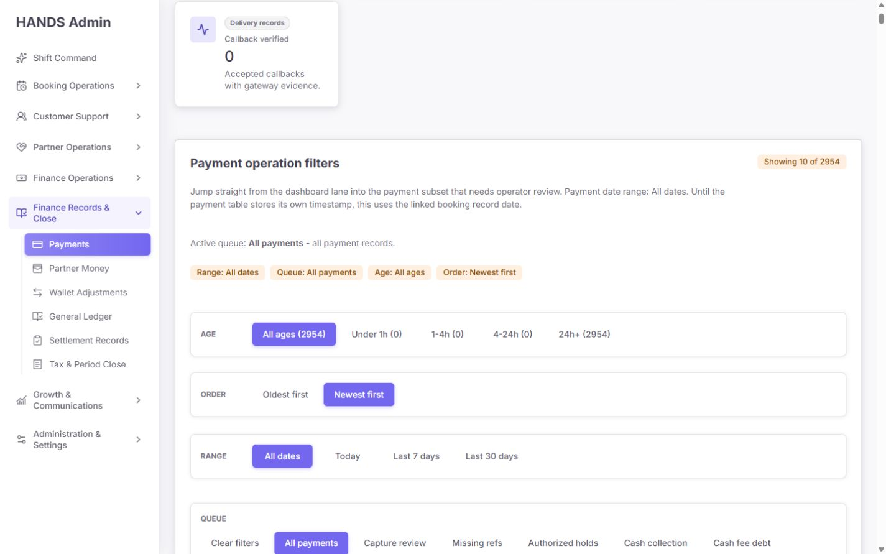

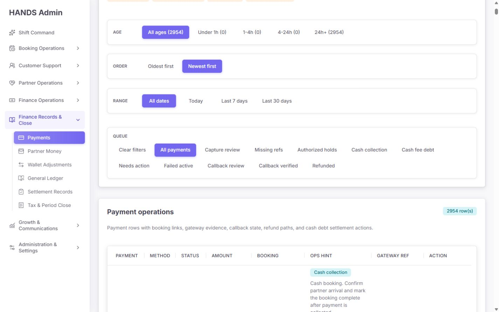

- 11개 큐가 업무 성격 구분 없이 한 줄 목록으로 펼쳐진다.
- 2,954건을 다루지만 결제 ID, 부킹 ID, 고객 전화, 게이트웨이 참조를 찾는 검색이 없다.
- 결제수단, 결제상태, 부킹상태, 금액 구간, 콜백 증거 상태, 담당자 필터가 없다.
- `Range`, `Age`, `SLA`가 서로 다른 시각 기준을 사용한다. Range는 부킹 `createdAt`, Age와 Authorized SLA는 부킹 `updatedAt`을 사용한다.
- `Record date` 경고 문구는 구현 한계를 설명할 뿐 운영자가 어떤 기간을 보고 있는지 확실하게 만들지 못한다.

권장 큐 구조:

| 대분류 | 큐 | 포함 조건 |
|---|---|---|
| Live decisions | Capture ready | 온라인 `AUTHORIZED` + 부킹 `COMPLETED` + 필요한 증거 충족 |
| Live decisions | Release recommended | 온라인 `AUTHORIZED` + 취소/만료/노쇼 등 미캡처 종료 |
| Live decisions | Active cash collection | `CASH/PENDING` + 현재 서비스 진행 가능 상태만 |
| Exceptions | Stale or lifecycle mismatch | 결제와 부킹 상태가 정책상 모순되거나 오래된 건 |
| Exceptions | Missing gateway evidence | 외부 게이트웨이 방식인데 provider ref/콜백/조회 증거가 필요한 건 |
| Exceptions | Failed active payment | 활성 부킹의 실패 결제 |
| Exceptions | Callback conflict | 수신된 콜백의 서명/결과/금액 불일치 |
| Exceptions | Cash debt | 별도 입금/상계 증거가 필요한 파트너 채무 |
| History | Captured / Released / Refunded | 완료 상태, 기본 접힘 또는 별도 History 탭 |

보조 필터는 `Search`, `Payment method`, `Payment state`, `Booking state`, `Evidence`, `Age/SLA`, `Owner` 순으로 둔다. 적용된 필터는 테이블 바로 위에 제거 가능한 칩으로 표시한다.

### 3.4 결제 목록 — 건강도: 실패(P0)

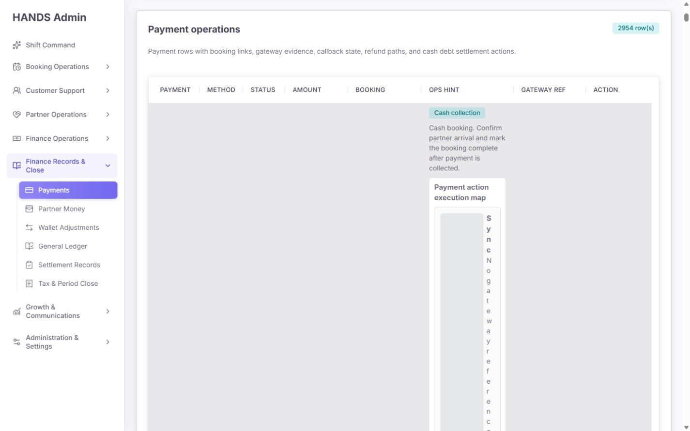

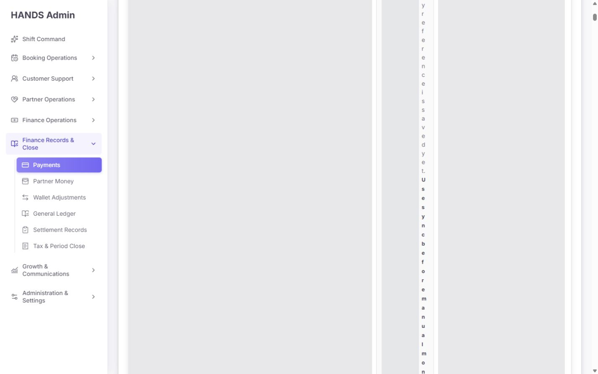

- `Ops hint` 한 셀 안에 5단계 `Payment action execution map` 전체를 매 행 반복한다.
- 공용 `.setup-stage-item`은 `90px minmax(0, 1fr) auto` 3열 구조다. 8열 테이블의 좁은 셀에 들어가면서 세 번째 상태 열이 한 글자 폭으로 줄어든다.
- 결과적으로 행 하나가 수천~1만 px 높이가 되며 나머지 필드는 화면에서 사라진다.
- 10개 행만 렌더링해도 전체 문서 높이가 `All` 큐 135,060px, `Needs action` 큐 154,745px로 측정됐다.
- 안정화 후 목록 DOM은 약 1,350개 노드, 링크 100~137개다. 10행 목록으로서는 과도하다.
- 운영자는 여러 건을 비교하거나 다음 행으로 이동할 수 없고, 페이지네이션까지 사실상 도달하기 어렵다.

코드 원인:

- `apps/admin_web/app/payments/payment-operations-table-section.tsx:111-132` — 행마다 전체 실행 맵 렌더링
- `apps/admin_web/app/globals.css:18832-18836` — 카드용 3열 레이아웃을 좁은 테이블 셀에 재사용
- `apps/admin_web/app/globals.css:1351-1359` — 테이블을 `width: max-content`로 확장하지만 각 셀의 업무별 최소/최대 폭이 없음

권장 테이블:

| 열 | 표시 내용 |
|---|---|
| Payment / Booking | 짧은 ID 2개와 상세 링크 |
| Customer / Partner | 이름 또는 전화, 파트너 배정 상태 |
| Method / Amount | 수단 + 현지화 금액 |
| Payment state | 상태 배지와 핵심 gateway ref |
| Booking state | 부킹 상태와 서비스 결과 |
| Evidence | `Verified`, `Missing`, `Conflict`, `N/A` 중 하나 |
| Age / SLA | 실제 조치 대기 시작 시각 기준 |
| Next safe action | 한 문장 + 가장 안전한 1개 기본 액션 |
| More | 나머지 액션 메뉴 |

행 높이는 기본 72~88px, 최대 120px로 제한한다. 실행 맵 전체는 상세 화면 또는 우측 검토 drawer에서만 보여준다. 긴 ID·참조는 줄임표와 복사 버튼을 제공한다.

### 3.5 오래된 Needs action / Capture 확인 — 건강도: 실패(P0)

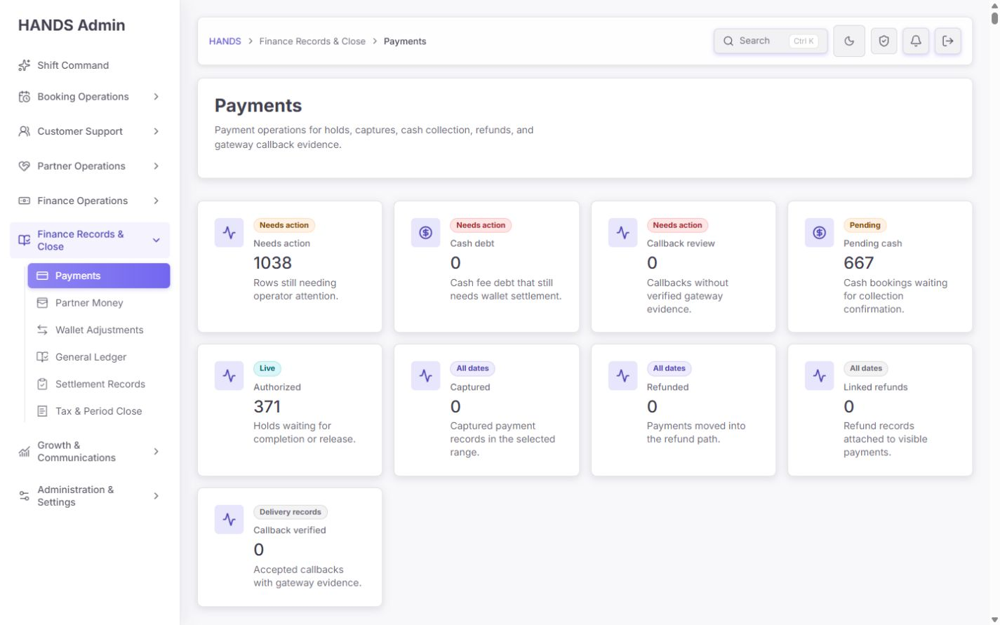

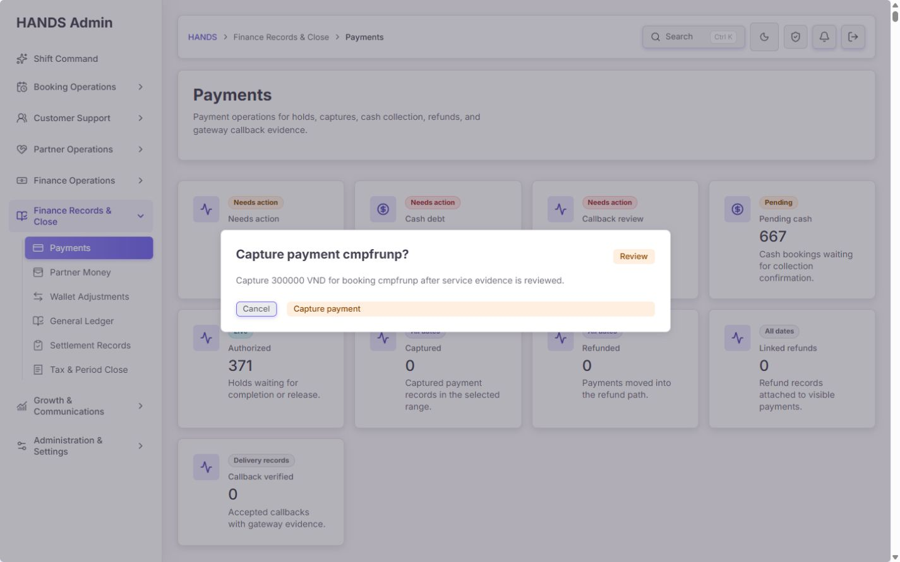

검사한 결제는 `MOMO / AUTHORIZED / 300,000 VND`이고 연결 부킹은 `CANCELLED`다.

- 실행 맵은 `Capture — Wait for completion`, `Release — Review release`라고 설명한다.
- 그러나 Action 메뉴와 확인 창은 Capture를 활성화한다.
- API `capture()`는 결제 방식/결제상태만 검사하고 부킹 상태를 조회하지 않는다. 온라인 결제는 `AUTHORIZED`이면 캡처 가능하다.
- 따라서 취소된 부킹의 승인 홀드를 운영자가 실수로 캡처할 수 있다.
- 확인 창에는 고객, 부킹 전체 상태, 서비스 완료 증거, 게이트웨이/콜백 증거, 실행 전후 상태, 조치 사유가 없다.
- `capture/release/sync` Server Action은 실패를 던지는 API helper가 아니라 `adminPost(..., null)`을 사용한다. 4xx/5xx와 권한 거부를 `null`로 삼켜 운영자가 성공/실패를 구분할 수 없다.

코드 원인:

- `payment-page-presenters.tsx:73-118` — terminal 결제 여부만으로 Capture/Release/Refund 메뉴를 활성화
- `payment-action-confirmation.ts:38-83` — 확인 가능 조건도 부킹 상태를 보지 않음
- `payments.service.ts:475-504` — Capture API가 부킹 lifecycle을 검사하지 않음
- `payments.service.ts:507-539` — Release API도 결제 상태만 검사
- `actions.ts:13-28` — `sync/capture/release` 오류를 fallback으로 흡수
- `payment-status-transition.ts:35-38` — CASH는 `PENDING`, 그 외는 `AUTHORIZED`이면 캡처 전이 허용

필수 수정:

1. 서버가 각 결제에 `actionDecisions`를 반환한다. 액션별 값은 `AVAILABLE | REVIEW_REQUIRED | BLOCKED`, `reasonCode`, `reason`, `requiredEvidence`, `recommendedAction`을 포함한다.
2. 목록, 상세, 확인 창, API가 같은 정책 함수를 사용한다. UI가 독립적으로 disabled 조건을 재구현하지 않는다.
3. Capture는 원칙적으로 `AUTHORIZED + booking COMPLETED + evidence gate passed`만 허용한다.
4. Cash capture는 `PENDING + 실제 수금 증거 + 서비스 완료`만 허용한다. `EXPIRED/CANCELLED/NO_SHOW`는 차단한다.
5. Release는 미캡처 종료 상태에서 권장하되, 사유와 상태 증거를 요구한다.
6. Refund request는 `CAPTURED`만 활성화한다. 현재 UI는 PENDING/AUTHORIZED에도 보여 API가 뒤늦게 거부한다.
7. 모든 금액 변경 action은 `adminPostOrThrow`와 구조화된 성공/오류 결과를 사용하고, 완료 후 `action`, `actor`, `before`, `after`, `auditId`를 화면에 보여준다.

### 3.6 결제 상세 — 건강도: 주의

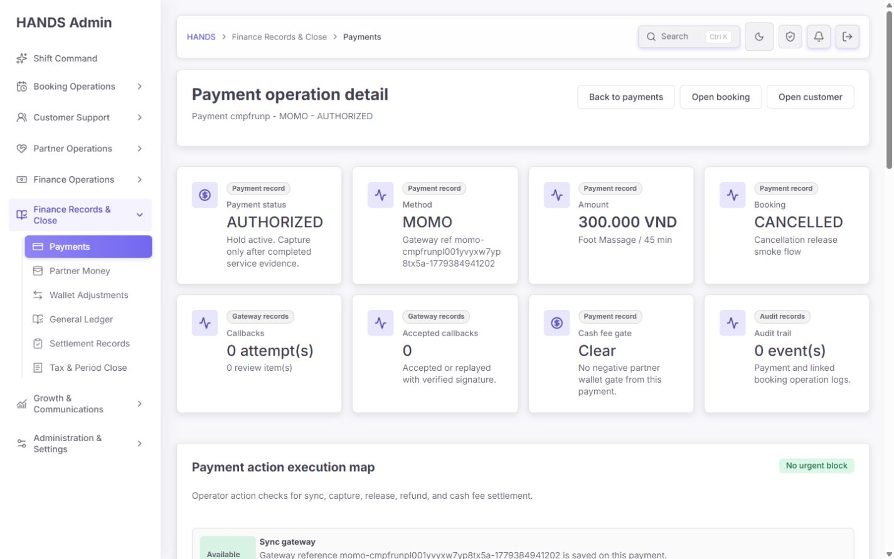

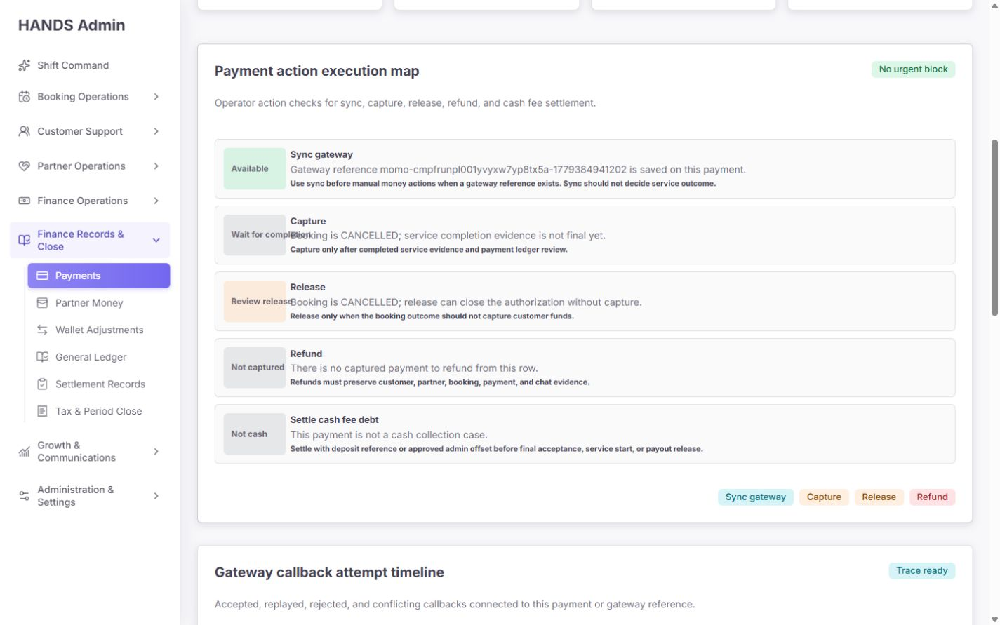

- `AUTHORIZED` 결제가 `CANCELLED` 부킹에 연결됐는데 상단 판정은 `No urgent block`이다.
- 이 판정은 cash debt 또는 callback review가 있는지만 보고, 실행 맵의 부킹 상태 판단을 반영하지 않는다.
- `Capture: Wait for completion`과 `Release: Review release` 배지가 인접 문구와 겹쳐 읽기 어렵다.
- Capture/Release 버튼은 실행 맵 결과와 무관하게 활성화된다.
- `Cash fee gate Clear`는 earning이 없는 비현금 결제에도 강한 정상 판정을 준다. `Not applicable` 또는 `Not evaluated`가 맞다.

권장 상세 상단:

- 하나의 `Decision strip`을 둔다: `Recommended: Release authorization`, `Risk: Capturing cancelled booking`, `Evidence: callback missing`, `Last verified: …`.
- 금액 액션은 추천 액션 1개만 primary로 둔다. 나머지는 More 메뉴에 넣고 차단 이유를 직접 표시한다.
- `No urgent block` 같은 전역 안심 문구를 제거하고 액션별 판정을 표시한다.
- 실행 맵은 상태, 근거, required evidence, 정책 버전, 최종 검증 시각을 포함한다.

### 3.7 콜백·원장·감사 증거 — 건강도: 주의

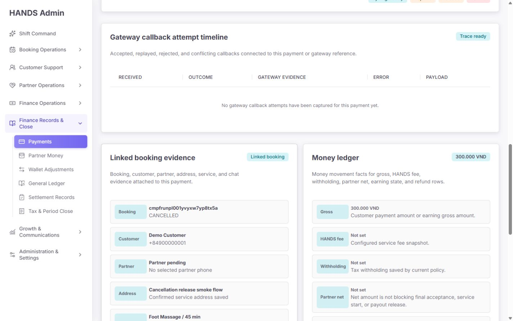

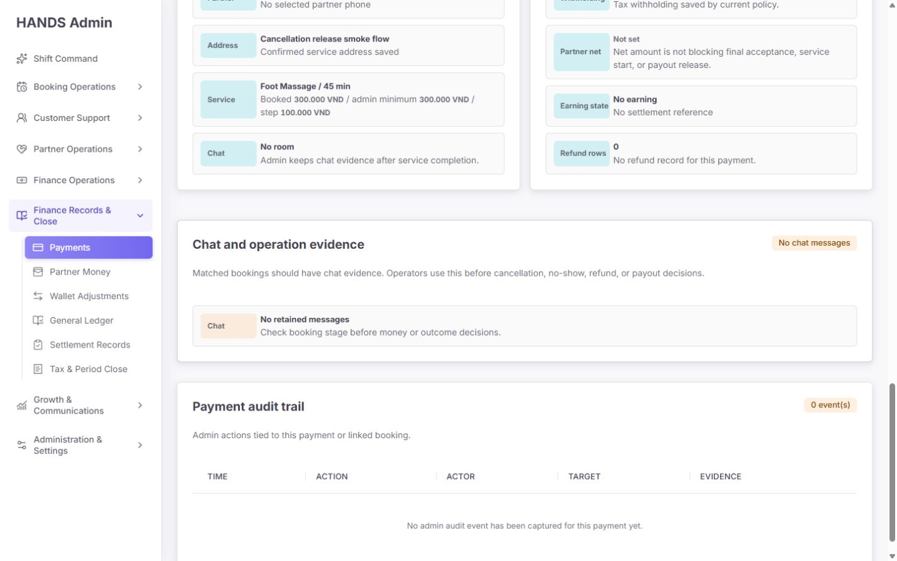

- 콜백 시도가 0개인데 `Trace ready`가 표시된다.
- `Callback review 0`은 “문제 없음”이 아니라 “검토할 수신 콜백이 없음”이다.
- 외부 결제에 provider ref가 있으면서 콜백 시도가 0이면 `Missing callback evidence` 또는 `Status query required`로 다뤄야 한다.
- audit trail 0, retained chat 0인 상태에서도 Capture/Release 액션이 활성화된다.
- earning이 없을 때 HANDS fee/withholding/partner net을 `Not set`으로 보여주면서 “blocking 아님”이라고 표현하면, 데이터가 없다는 사실을 정상으로 오해할 수 있다.

문구 수정:

- `Trace ready` → 시도 0건이면 `No callback attempts recorded`
- 검증 성공이 있을 때만 `Callback evidence verified`
- `Cash fee gate Clear` → 비대상이면 `Not applicable`, 데이터 부족이면 `Not evaluated`
- `No urgent block` → `Recommended action`과 구체적 차단/주의 사유

### 3.8 Cash collection — 건강도: 실패(P0)


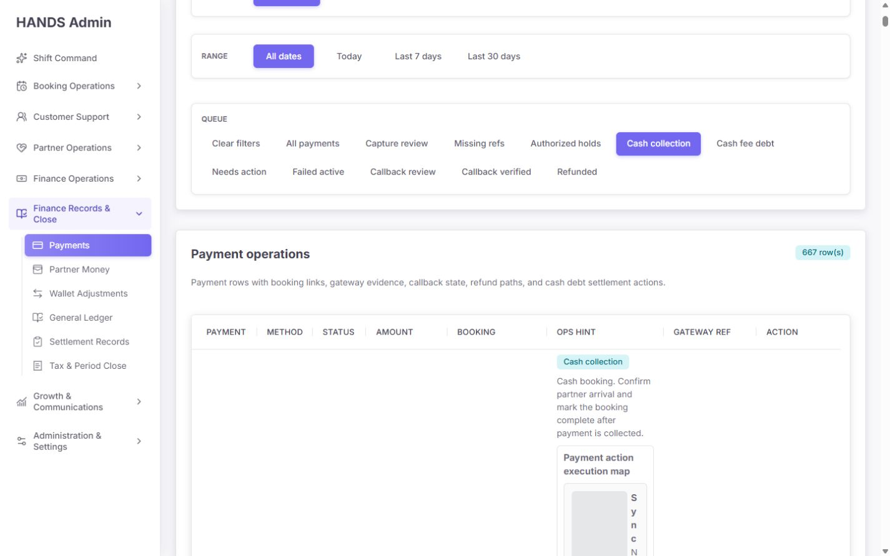

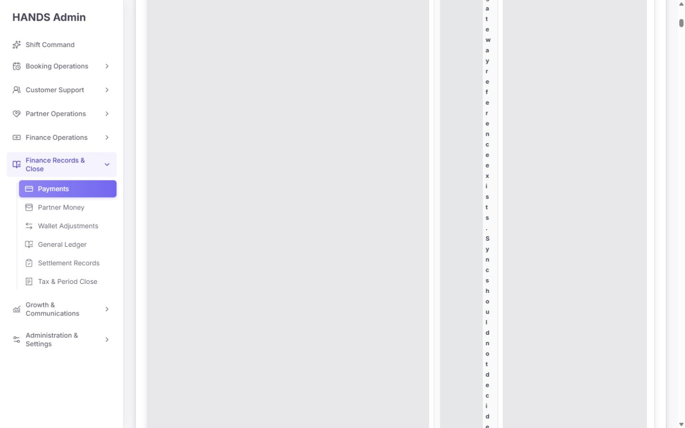

- 667건 모두 24시간 초과로 표시된다.
- 검사한 첫 행은 `CASH / PENDING / booking EXPIRED`다.
- 화면은 “파트너 도착 확인 후 결제 수금 및 부킹 완료”를 안내하지만 이미 만료된 부킹이다.
- Cash queue 조건이 `method=CASH + status=PENDING`뿐이라 lifecycle 불일치를 분리하지 않는다.
- Cash PENDING은 API상 Capture 가능한 상태다. 현재 버튼은 만료 부킹도 Capture 확인으로 보낸다.
- 실행 맵은 Cash PENDING을 `Not authorized`라고 표시해 API와 반대로 설명한다.

권장:

- `Active cash collection`은 진행 가능한 부킹 상태만 포함한다.
- 종료 부킹의 CASH/PENDING은 `Stale or lifecycle mismatch`로 격리한다.
- 현금 캡처에는 `service completed`, `cash collected`, `collector/partner`, `collection time`, `receipt/reference`가 필요하다.
- 레거시 667건은 실시간 큐에서 제거하고 일회성 정리 작업으로 분리한다.

### 3.9 Missing ref — 건강도: 실패(P1)

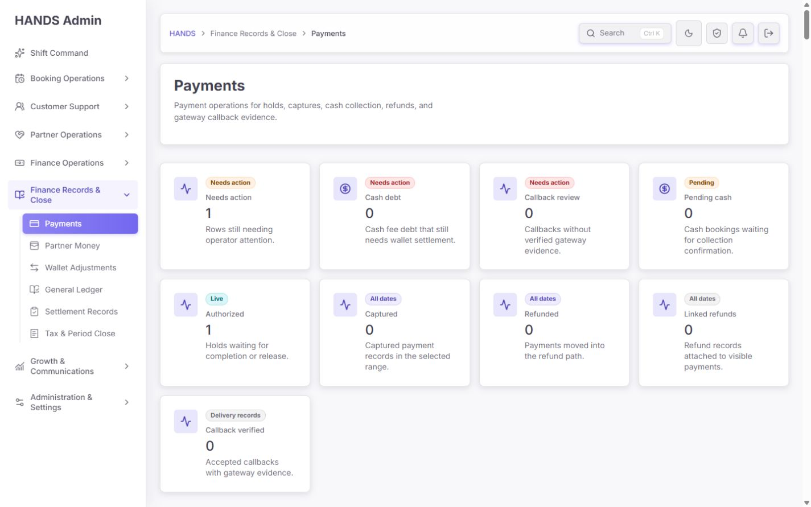

- 유일한 행은 `CUSTOMER_WALLET / AUTHORIZED / booking CANCELLED`다.
- 현재 규칙은 결제수단과 무관하게 `AUTHORIZED && providerRef is null`이다.
- 내부 지갑은 외부 gateway reference가 필수라는 보장이 없으므로 이름과 조건이 맞지 않는다.

권장:

- `Missing gateway evidence`는 `MOMO/VNPAY/CARD`처럼 외부 참조가 필요한 방식에만 적용한다.
- `CUSTOMER_WALLET`은 wallet ledger reservation/release entry의 존재를 별도 증거로 검사한다.
- 단순 ref 부재가 아니라 수단별 필수 증거 계약을 정의한다.

### 3.10 Callback review — 건강도: 주의

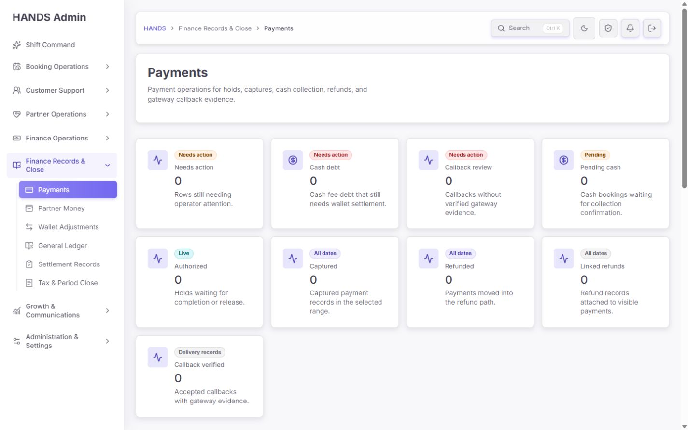

- 현재 큐는 실제로 수신된 콜백 중 outcome/signature가 문제인 시도만 포함한다.
- 콜백이 아예 오지 않은 온라인 결제, gateway 조회와 상태가 불일치한 결제는 포함하지 않는다.
- 큐가 0이면 “콜백 검증 완료”가 아니라 “수신된 콜백 검토 건 없음”으로 해석해야 한다.

권장:

- `Unverified callback attempts`: 수신됐지만 서명/결과 검증 실패
- `Missing expected callback`: 온라인 승인/캡처 후 정책 시간 내 콜백 없음
- `Gateway state mismatch`: sync/query 결과와 로컬 상태 불일치
- `Verified callback history`: 히스토리 영역

## 4. 우선순위별 결함

### P0 — 배포 전 수정

| ID | 결함 | 영향 | 완료 조건 |
|---|---|---|---|
| PAY-P0-01 | 1440px에서도 목록 행/열 붕괴 | 조회·비교·페이지 이동 불가 | 10행이 정상 행 높이로 보이고 문서 높이 2,500px 내외, 가로 스크롤 없이 핵심 열 읽기 가능 |
| PAY-P0-02 | UI 실행 맵, 메뉴 disabled, 확인 창, API 실행 조건이 다름 | 취소 부킹 Capture 등 직접적인 금액 오류 가능 | 단일 서버 정책으로 네 계층이 같은 결과를 사용하고 차단 API 테스트 존재 |
| PAY-P0-03 | Cash queue가 종료 부킹을 활성 수금으로 분류 | 667건 레거시 혼입, 만료 부킹 오캡처 가능 | 활성/불일치 큐 분리, 종료 상태 Capture 차단 |
| PAY-P0-04 | `adminPost`가 sync/capture/release 실패를 삼킴 | 실패를 성공으로 오인, 재시도/중복 조작 위험 | throw 기반 호출, 오류 배너, 성공 receipt, idempotency key/전이 결과 표시 |
| PAY-P0-05 | 액션 링크가 현재 range/review/sort/page를 버림 | 오래된 행에서 확인 창이 열리지 않거나 취소 후 위치 상실 | action/cancel/detail/back 경로가 현재 컨텍스트를 보존하고 대상 결제를 별도 조회 |
| PAY-P0-06 | GET fallback이 API 오류를 0건/빈 목록으로 표현 | 장애 시 “문제 없음”으로 보이는 false clear | `adminGetResult` 기반 fail-closed error state, retry와 status 표시 |

`PAY-P0-05`의 실제 원인은 `paymentActionConfirmHref()`가 `/payments?confirm=...&paymentId=...`만 만들고, 확인 모델이 현재 10개 행에서만 대상을 찾는 것이다. `PAY-P0-06`은 목록에서 `adminGet(..., [])`, summary에서 `adminGet(..., null)`을 사용하는 구조다.

### P1 — 다음 운영 릴리스

| ID | 결함 | 권장 수정 |
|---|---|---|
| PAY-P1-01 | 11개 큐가 평면적이고 live/exception/history가 섞임 | 3개 그룹 IA 적용, 히스토리 기본 접힘 |
| PAY-P1-02 | 검색/핵심 필터 부재 | q, method, paymentState, bookingState, evidence, owner 추가 |
| PAY-P1-03 | Range/Age/SLA가 payment 시간이 아니라 booking 시간 사용 | Payment에 created/authorized/captured/released/refunded/actionableAt 추가 |
| PAY-P1-04 | 현재 큐에 따라 상단 지표 의미가 변하지만 표기 없음 | 전역 strip 유지 또는 `Within this queue` 표기 |
| PAY-P1-05 | Missing ref가 CUSTOMER_WALLET까지 포함 | 수단별 evidence policy 적용 |
| PAY-P1-06 | 콜백이 없는 상태를 정상/중립으로 표현 | missing expected callback 별도 탐지 |
| PAY-P1-07 | 상세의 `No urgent block`, `Clear`, `Trace ready`가 과잉 안심 | Unknown/N/A/Not evaluated를 정확히 구분 |
| PAY-P1-08 | 확인 창의 증거·이유·변경 결과가 부족 | before/after, evidence checklist, required reason, actor/audit receipt |
| PAY-P1-09 | 동일 실행 맵을 행마다 반복해 DOM과 인지 부하 증가 | 목록 1줄 next action, 상세/drawer에서 전체 맵 |
| PAY-P1-10 | 모달 키보드 회귀 보장 부족 | Cancel→Confirm→Cancel Tab 순환, Shift+Tab, Escape, focus return E2E 추가 |

모달 DOM에는 Cancel과 Confirm 두 개의 focusable이 확인됐지만 브라우저 자동 점검에서 Tab 후 focus가 Cancel에 남았다. 도구 한계 가능성을 배제할 수 없으므로 실제 키보드 E2E로 재현 여부를 확정해야 한다.

### P2 — 품질 향상

1. 전체 ID 대신 짧은 ID + 복사 버튼을 사용한다.
2. amount 문구를 `300000 VND`가 아니라 목록과 동일한 `300,000 VND`로 통일한다.
3. 큐마다 빈 상태에 다음 점검 시각, 필터 초기화, 관련 히스토리 링크를 제공한다.
4. 고위험 액션은 색만으로 구분하지 말고 아이콘/동사/결과를 함께 사용한다.
5. 마지막 동기화 시각과 데이터 출처를 페이지 상단에 표시한다.
6. 액션 결과 toast만으로 끝내지 않고 영속적인 operation receipt를 남긴다.

## 5. 권장 최종 화면 구성

```text
Payments
├─ Operational health: Open decisions | Stale holds | Evidence conflicts | Active cash
├─ Queue tabs
│  ├─ Live decisions
│  ├─ Exceptions
│  └─ History
├─ Search + Method + Payment state + Booking state + Evidence + Age/SLA + Owner
├─ Applied filter chips / Result count / Last refreshed
├─ Compact payment table
│  └─ One recommended action per row + More
└─ Review drawer
   ├─ Decision and risk
   ├─ Payment / booking / customer / partner
   ├─ Gateway and callback evidence
   ├─ Money ledger
   ├─ Required evidence and reason
   └─ Confirm action / receipt
```

상세 페이지는 증거 보존용 canonical view로 유지하고, 목록 drawer는 반복 업무의 속도를 높이는 축약 검토 화면으로 사용한다. `/refunds`와 Finance Approval Queue는 환불 승인/집행의 canonical owner로 유지한다.

## 6. 권장 문구 사전

| 현재 | 권장 |
|---|---|
| Needs action | Open payment decisions |
| Cash collection | Active cash collection |
| Missing refs | Missing gateway evidence |
| Callback review | Unverified callback attempts |
| Callback verified | Verified callback history |
| No callback | No callback attempts recorded |
| Trace ready | Callback evidence verified / No attempts recorded |
| No urgent block | Recommended action: … / Blocked: … |
| Cash fee gate Clear | Not applicable / Not evaluated / No open cash debt |
| Record date | Booking created at (임시) |
| Capture after service | Capture only after verified completion |

## 7. 구현 기준

### 단일 action-decision 계약 예시

```ts
type PaymentActionDecision = {
  action: 'SYNC' | 'CAPTURE' | 'RELEASE' | 'REQUEST_REFUND';
  state: 'AVAILABLE' | 'REVIEW_REQUIRED' | 'BLOCKED';
  recommended: boolean;
  reasonCode: string;
  reason: string;
  requiredEvidence: string[];
  verifiedAt: string;
  policyVersion: string;
};
```

API는 액션 실행 시 다시 같은 정책을 계산해야 한다. 화면이 전달한 `AVAILABLE` 값을 신뢰하면 안 된다. `CAPTURE`에는 결제 전이 조건뿐 아니라 부킹 lifecycle과 증거 gate를 함께 검사한다.

### 액션 완료 응답 예시

```ts
type PaymentActionReceipt = {
  auditId: string;
  paymentId: string;
  action: string;
  before: { paymentStatus: string; bookingStatus: string };
  after: { paymentStatus: string; bookingStatus: string };
  actorId: string;
  completedAt: string;
  idempotencyKey: string;
};
```

### 오류/로딩 정책

- 목록 또는 summary 하나라도 실패하면 0으로 대체하지 않는다.
- `Data unavailable`, 실패 endpoint, 시각, Retry를 표시한다.
- 기존 성공 데이터가 있으면 `stale` 배지와 마지막 성공 시각을 표시하되 액션은 재검증 전 차단한다.
- 금액 변경 중에는 중복 submit을 막고, 응답 receipt가 오기 전 성공으로 표시하지 않는다.

## 8. 접근성·성능·구현 품질 평가

1024px 이하 반응형 항목은 평가에서 제외했다.

| 영역 | 점수 | 근거 |
|---|---:|---|
| Accessibility | 1/4 | 표 스캔 불가, 키보드 모달 재검증 필요; 상세 heading/alertdialog 기반은 존재 |
| Performance | 1/4 | 10행에서 1,350+ DOM, 135k~155k px 문서, 실행 맵 50개 반복 |
| Theming consistency | 3/4 | 토큰·공용 컴포넌트 사용은 일관적이나 상태 배지 겹침과 과도한 카드 밀도 존재 |
| Implementation integrity | 1/4 | 정책 중복과 drift, fail-open UI, 오류 삼킴, 컨텍스트 손실 |
| 합계 | **6/16** | 반응형 제외 |

로컬 warm navigation 자체는 약 121~136ms로 빠르게 반환됐지만, 안정화 후 목록 문서가 비정상적으로 커졌다. 체감 성능 문제의 주원인은 네트워크보다 반복 렌더링과 붕괴한 레이아웃이다. 실제 운영 환경에서는 API count 12회(summary)와 목록 query가 더해지므로 DB 인덱스/실행계획은 별도 부하 테스트가 필요하다.

## 9. 권장 구현 순서

1. P0-02/P0-04: 서버 단일 action decision 및 throw 기반 액션 결과부터 만든다.
2. P0-01: 목록에서 실행 맵을 제거하고 compact table을 적용한다.
3. P0-03: Cash/Authorized/Needs action을 booking lifecycle 기준으로 재분류한다.
4. P0-05/P0-06: URL 컨텍스트 보존, 대상 별도 조회, fail-closed error state를 구현한다.
5. P1-01~P1-04: 큐 IA, 검색/필터, 전역 health strip, 실제 payment timestamp를 정리한다.
6. 상세 decision strip과 확인 drawer를 action decision 계약에 연결한다.
7. 레거시 667 cash 건과 371 authorized 건을 migration/ops cleanup 작업으로 분리한다.

## 10. 필수 회귀 테스트

### 정책/API

- `AUTHORIZED + COMPLETED` 온라인 결제만 Capture 가능
- `AUTHORIZED + CANCELLED/EXPIRED/NO_SHOW` Capture 409, Release decision 권장
- `CASH/PENDING + COMPLETED + collection evidence`만 Capture 가능
- `CASH/PENDING + EXPIRED/CANCELLED` Capture 409
- Refund request는 `CAPTURED`만 가능
- CUSTOMER_WALLET은 providerRef 부재로 Missing gateway evidence가 되지 않음
- 동일 idempotency key 재요청은 동일 receipt 반환
- API 실패 시 Admin Web이 0건/성공으로 표시하지 않음

### UI/E2E

- 1440×900에서 10행 목록 전체 행 높이 정상, 핵심 열 가독성 유지
- queue/filter/page에서 action 확인을 열고 닫아도 URL 컨텍스트 유지
- 현재 페이지에 없는 paymentId도 확인 대상 별도 조회
- Cancel→Confirm Tab, Confirm→Cancel Tab, Shift+Tab, Escape, focus return
- 차단 액션은 버튼 자체가 disabled이며 이유가 화면과 API 응답에서 동일
- 오류 후 Retry 가능, 성공 후 audit receipt와 변경된 상태 표시

## 11. 실행 검증 결과

- Admin Web payment 테스트: **12 files / 62 tests passed**
- API payment 핵심 테스트: **5 files / 62 tests passed**
- API admin service payment 필터 테스트: **49 passed / 541 skipped**
- Impeccable 정적 detector: **0 findings**

기존 테스트가 모두 통과했지만 이번 P0을 잡지 못했다. 현재 테스트는 컴포넌트 존재와 기본 전이를 확인할 뿐, 부킹 lifecycle과 결제 액션의 통합 정책, 1440px 실제 레이아웃, fail-closed 오류 상태를 검증하지 않는다.

## 12. 완료 판정 체크리스트

- [ ] 1440px에서 표가 정상적인 행 높이와 열 폭으로 보인다.
- [ ] 목록/상세/확인/API가 동일 action decision을 사용한다.
- [ ] 취소·만료·노쇼 부킹을 Capture할 수 없다.
- [ ] 활성 Cash와 레거시/불일치 Cash가 분리된다.
- [ ] 액션 실패가 성공처럼 보이지 않는다.
- [ ] 필터·정렬·페이지가 확인/취소/상세/뒤로가기에서 유지된다.
- [ ] API 장애가 0건이나 `Clear`로 보이지 않는다.
- [ ] 검색과 수단/결제/부킹/증거 필터가 있다.
- [ ] Range/Age/SLA가 명시적 payment/action timestamp를 사용한다.
- [ ] 콜백 없음, 미검증, 검증 완료가 서로 다른 상태다.
- [ ] 모든 금액 변경에 사유, 증거, actor, audit receipt가 남는다.

이 체크리스트가 모두 충족되기 전에는 `/payments`를 운영자의 단일 결제 command center로 간주하면 안 된다.
