# HANDS Admin `/payouts` 심층 감사 보고서

- 감사일: 2026-08-09
- 대상: `http://localhost:3101/payouts`와 `Operations`, `Release policy`, `Audit evidence`, `Records`, 지급 상태 변경, 지급 증빙 편집, 파트너 지갑 출금 대사 흐름
- 기준 화면: 1440 × 900 데스크톱 운영 환경
- 제외 범위: 1024px 이하 반응형·모바일 UI는 검사와 판정에서 완전히 제외
- 감사 방법: 로그인된 실화면 캡처 및 상호작용, 1440px 구조/접근성 계측, Admin Web·API 계산 경로 추적, 관련 회귀 테스트 실행
- 소스 수정: 없음. 보고서와 화면 증빙만 추가

## 1. 최종 결론

현재 `/payouts`는 금융 액션 자체의 서버 안전장치는 상당히 잘 구현되어 있다. 특히 지급 완료의 maker-checker, 지급 증빙 변경 시 대상 ID 재확인과 동시성 검사, 유료 지급/출금 취소 시 별도 Finance approver와 은행 증빙을 요구하는 부분은 유지해야 한다.

그러나 운영 화면의 판정과 범위 표시는 아직 금융 운영자가 믿고 사용하기 어렵다. 가장 큰 문제는 다음 네 가지다.

1. **전체 기간 요약과 현재 10개 행의 표본 계산을 같은 범위처럼 보여준다.** 전체 `64,440,000 VND`와 현재 페이지 증빙 `5,250,000 VND`가 같은 Money flow에 놓이지만, `MATCHED` 판정은 현재 10개 행끼리만 비교한다.
2. **49건의 Paid / bank match pending이 있는데도 기본 선택 큐가 0건이면 섹션 전체가 `Clear`로 표시된다.** 빈 필터와 전체 위험 상태가 혼동된다.
3. **API 실패가 빈 배열·null fallback으로 바뀌어 0 또는 Clear로 보일 수 있다.** 금융 화면에서 “조회 실패”와 “정상 0건”이 구분되지 않는다.
4. **PAID 이력의 회계 증빙 이상을 지급 전 `Release blocker`로 분류한다.** 이미 지급된 건에 “지급하지 말라”는 지시가 표시되어 현재 조치 큐를 오염시킨다.

최종 판정은 **조건부 실패**다. 서버 액션 안전성은 통과에 가깝지만, 운영 판정의 신뢰성과 우선순위가 실패다. 디자인 폴리시보다 먼저 P0 데이터 범위·실패 상태·false-clear 문제를 수정해야 한다.

### 품질 점수

| 영역 | 점수 | 판정 |
|---|---:|---|
| 금융 액션 안전성 | 4.2 / 5 | 양호 |
| 정보 구조 | 2.2 / 5 | 미흡 |
| 운영 우선순위 | 1.8 / 5 | 실패 |
| 데이터 범위·판정 신뢰성 | 1.3 / 5 | 실패 |
| 1440px 가독성 | 2.2 / 5 | 미흡 |
| 접근성 기본 구조 | 4.0 / 5 | 양호 |
| 성능·렌더링 효율 | 2.0 / 5 | 미흡 |
| 운영 문구 | 2.3 / 5 | 미흡 |
| 종합 | **2.4 / 5** | **조건부 실패** |

## 2. 실데이터와 코드로 확인한 핵심 사실

| 항목 | 확인값 | 운영상 의미 |
|---|---:|---|
| 전체 지급 배치 | 159 | All dates summary 범위 |
| Settled | 154 | 이력 지표 |
| In progress | 4 | 전체 범위 집계 |
| Needs review | 1 | 전체 범위 집계 |
| Missing refs | 2 | 전체 범위 집계 |
| 전체 Partner net | 64,440,000 VND | 전체 범위 집계 |
| 전체 Withheld tax | 2,730,000 VND | 전체 범위 집계 |
| 현재 로드된 배치 | 10 | 목록 API `take=10` |
| 현재 표본 Partner net evidence | 5,250,000 VND | 현재 10개 배치의 연결 earning |
| 현재 표본 Tax | 350,000 VND | 현재 10개 배치의 연결 earning |
| Paid / bank match pending | 49 | 미해결 은행 대사 큐 |
| 기본 Review required | 0 | 기본 선택 필터 결과 |

`Today` 기본 화면은 모든 상단 지표가 0이지만, `Last 7 days`에는 Needs review 1건과 7개 배치가 있고 `Last 30 days`에는 In progress 2건과 20개 배치가 있다. “오늘 생성된 배치”가 없다는 사실이 “지금 처리할 업무”가 없다는 뜻은 아니다.

## 3. 잘된 부분 — 반드시 보존할 것

1. 지급 증빙 편집은 전체 payout batch ID 재입력, 10자 이상 변경 사유, 기존 status/ref/note를 이용한 optimistic concurrency 검사를 요구한다.
2. API는 증빙 변경 시 대상 ID 불일치와 최신값 충돌을 서버에서 다시 차단하고 before/after/reason을 audit log에 기록한다.
3. 지급 완료는 `PROCESSING` 상태, transfer reference, FINANCE_APPROVER 권한, 처리 요청자와 승인자가 다른 maker-checker 조건을 서버에서 검사한다.
4. 파트너 지갑 출금의 paid closeout도 은행 증빙 제출자와 승인자를 분리한다.
5. 유료 지급·출금 취소는 별도 Finance approver, 10자 이상 사유, 은행 반송 reference, private evidence URL 또는 attachment를 요구하고 새 회계 journal을 남긴다.
6. 확인창은 액션을 바로 실행하지 않고 별도 확인 단계를 제공하며, 서버 preflight가 허용하지 않는 `Mark paid`는 비활성화된다.
7. 파트너, 은행 계좌, 금액, 상태 변경자, 승인자, 전표 링크, 은행 대사 링크가 연결돼 있어 증거 추적의 재료는 충분하다.
8. 1440px 검사에서 중복 ID가 없었고, 화면의 입력·버튼·링크는 접근 가능한 이름을 갖고 있었다. heading outline도 `h1 → h2 → h3`로 정상적이었다.

이 장점들은 화면 구조를 단순화해도 제거하면 안 된다.

## 4. 화면 흐름별 감사

### 4.1 기본 진입 `Today` — 건강도: 미흡

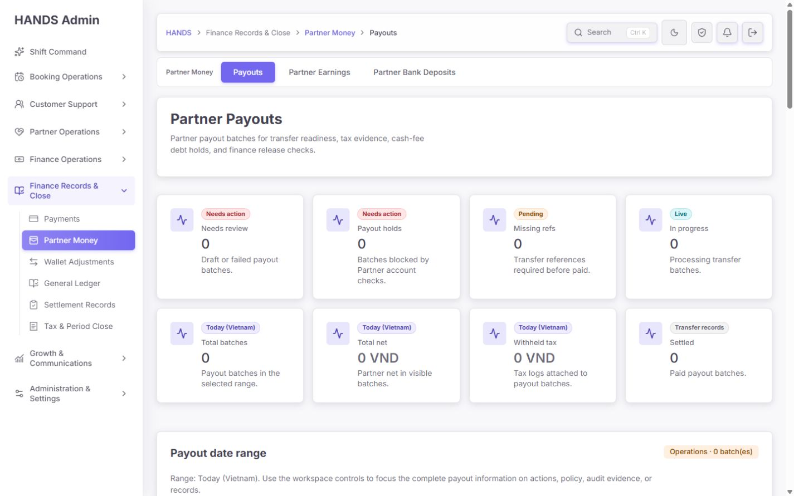

- 기본값은 `Today + Operations`다.
- 모든 값이 0인데 동일한 크기의 KPI 8개가 첫 화면 대부분을 차지한다.
- 오래된 Needs review, Processing, 미대사 건은 오늘 생성된 레코드가 아니면 기본 화면에서 긴급도가 낮아지거나 사라진다.
- payout 운영자는 “오늘 생성”보다 “아직 닫히지 않은 돈의 상태”를 먼저 봐야 한다.

권장:

- 기본 진입을 `Open payout work`로 바꾼다. 열린 상태는 날짜 범위와 독립적으로 누적한다.
- 상단은 `Review 1`, `Processing 4`, `Bank match pending 49`, `Post-payment evidence repair N` 네 개만 우선 노출한다.
- `Total batches`, `Total net`, `Withheld tax`, `Settled`는 접힌 기간 요약 또는 `Records`에 둔다.
- 오늘 열린 조치가 0이면 “오늘 생성 0”이 아니라 “현재 열린 조치 N / 오늘 새로 들어온 조치 0”으로 표현한다.

### 4.2 All dates 상단 요약 — 건강도: 주의

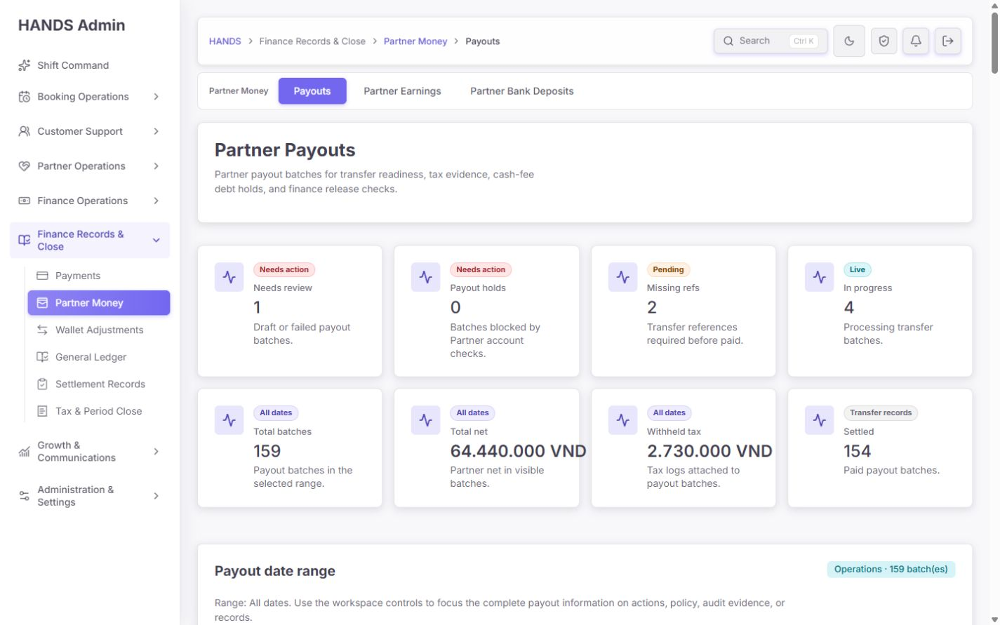

- 159개 배치, 64,440,000 VND, 세금 2,730,000 VND라는 전체 범위 수치는 유용하다.
- `Needs action`, `Pending`, `Live`, `All dates`, `Transfer records`라는 scope 배지가 8개 카드에 혼재해 한 줄 요약으로 읽히지 않는다.
- `Payout holds 0`은 partner sanction 기반 active hold를 뜻하지만, Audit evidence에는 cash debt held 4건이 있다. 이름이 같아 보이는 위험 개념이 서로 다른 계산 기준을 쓴다.
- 상단의 `In progress 4`와 아래 `Banking in motion 0`이 동시에 보인다. 전자는 159개 전체 집계, 후자는 현재 로드된 10개 행 집계다.

권장:

- 각 숫자에 데이터 범위를 명시한다: `전체 범위 159`, `현재 페이지 10`, `열린 큐 전체 49`.
- `Payout holds`는 `Active partner account holds`로, cash debt는 `Unbatched cash-debt holds`로 명확히 분리한다.
- 같은 화면에서 전역 수치와 현재 페이지 수치를 비교하지 않는다.

### 4.3 Needs action — 건강도: 실패

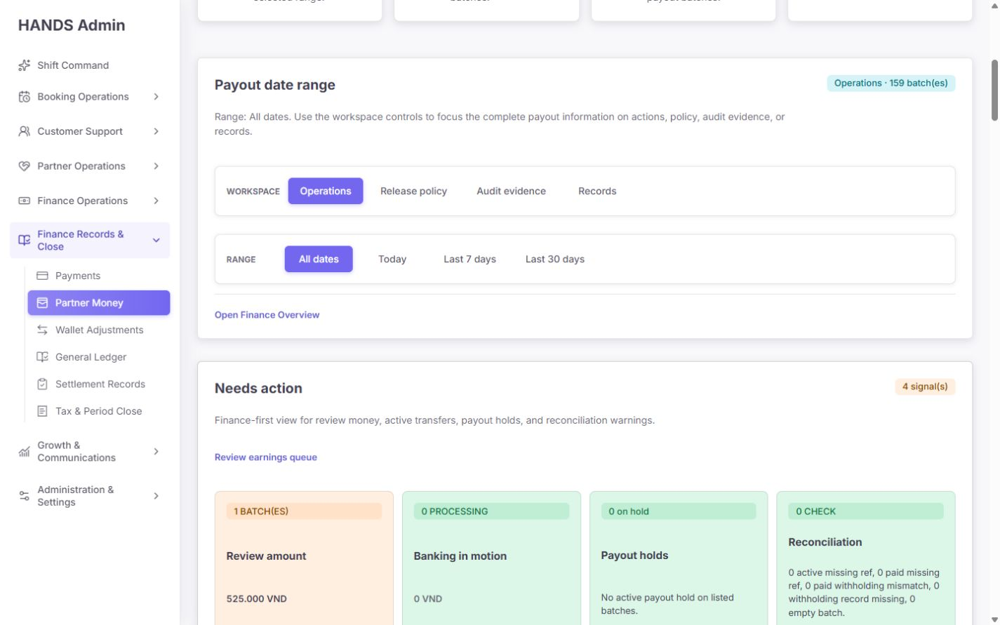

- `4 signal(s)`는 문제가 4개라는 뜻이 아니라 항상 렌더링되는 카드 종류가 4개라는 뜻이다.
- 4개 카드 중 Review만 1건이고 나머지는 0인데도 섹션 전체가 warning이다.
- `Banking in motion 0`은 전체 In progress 4와 충돌한다.
- `Review amount 525,000 VND`가 총액인지 net인지 명시되지 않는다.
- 카드 설명은 지시 문장처럼 보이지만 실제 대상 행으로 바로 이동하지 않는다.

코드 원인:

- `payout-command-queue-section.tsx:27-28`이 `signals.length`를 위험 건수로 사용한다.
- `page.tsx:152`와 `page.tsx:1784-1859`는 현재 로드된 10개 `batches`로 신호를 만든다.
- `page.tsx:223-228`의 상단 In progress는 전체 summary API 값을 쓴다.

필수 수정:

- 결과 배지는 카드 개수가 아니라 실제 open issue 합계를 사용한다.
- 각 카드에 `Open N`, `Amount`, `Oldest age`, `Owner/SLA`, `Open queue`를 제공한다.
- 0인 카드는 접거나 한 줄 `Clear`로 축소한다.
- 전역 action summary용 API를 별도로 만들거나 현재 페이지라는 사실을 제목에 명시한다.

### 4.4 Money flow — 건강도: 실패(P0)

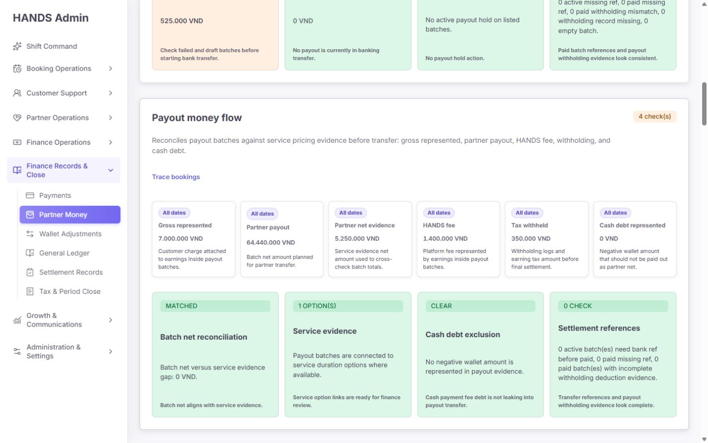

화면에는 다음 값이 함께 표시된다.

- Gross represented: 7,000,000 VND
- Partner payout: 64,440,000 VND
- Partner net evidence: 5,250,000 VND
- HANDS fee: 1,400,000 VND
- Tax withheld: 350,000 VND
- Batch net reconciliation gap: 0 VND / MATCHED

`Partner payout`만 전체 159개 summary이고 나머지 service evidence는 현재 로드된 10개 배치다. 하지만 gap은 `64,440,000 - 5,250,000`이 아니라 현재 10개 batch net과 service evidence를 비교해 0이 된다. 운영자는 같은 카드의 64,440,000과 5,250,000이 `MATCHED`라고 오해하게 된다.

코드 원인:

- `page.tsx:1074-1115`의 카드에서 Partner payout은 `summary.totalNetAmount`, 나머지는 paginated `serviceEvidence`를 사용한다.
- `page.tsx:1118-1125`의 gap은 paginated `batches`와 paginated `serviceEvidence`를 비교한다.
- `payout-money-flow-section.tsx:49-55`는 두 범위를 모두 `All dates` scope로 표시한다.
- 상단 tax는 2,730,000 VND지만 이 카드 tax는 350,000 VND다.

필수 수정:

1. 같은 reconciliation block의 모든 값은 동일한 batch ID 집합에서 계산한다.
2. 전 범위 계산이 필요하면 API가 전체 gross/net/fee/tax/cash debt/gap/count를 aggregate해 반환한다.
3. 현재 페이지 계산을 유지하려면 제목을 `Visible 10 batches`로 바꾸고 전체 summary 숫자를 섞지 않는다.
4. `MATCHED`는 `scopeBatchCount`, `evidenceBatchCount`, `generatedAt`, `completeness`가 모두 충족될 때만 표시한다.
5. 데이터 범위가 다르거나 일부 API가 실패하면 `NOT EVALUATED`로 표시한다.

### 4.5 Release blocker / Partner finance queue — 건강도: 실패

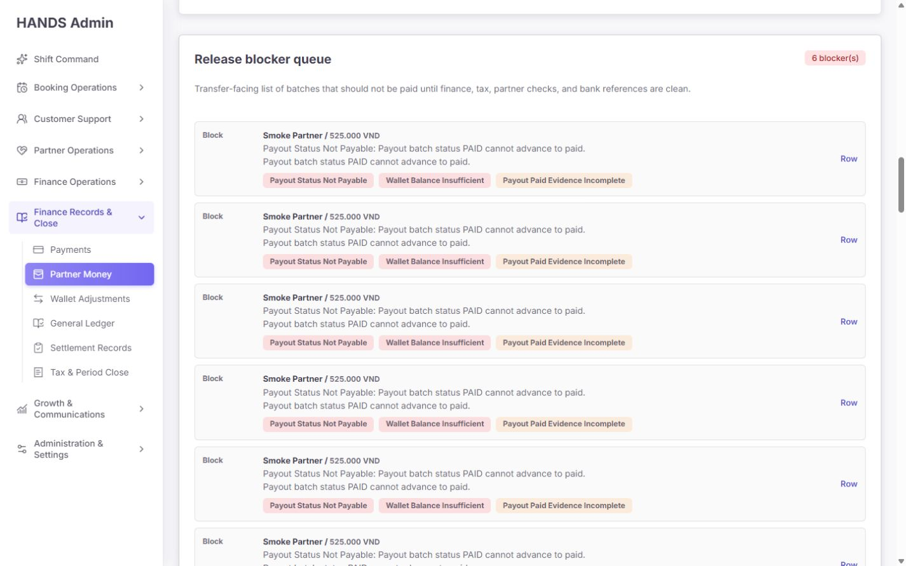

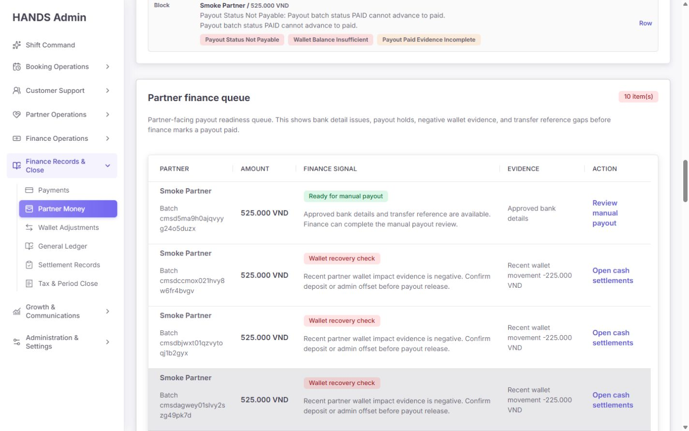

- Release blocker 6개 대부분이 이미 `PAID / Settlement finished`인 과거 배치다.
- `Payout batch status PAID cannot advance to paid`, `Partner wallet ledger balance cannot cover`, `historical paid payout missing evidence`가 한 묶음으로 표시된다.
- 이미 지급된 건에 “should not be paid”와 “before finance marks paid”라는 문구가 표시된다.
- Partner finance queue도 PAID 배치의 최근 음수 wallet movement를 `Wallet recovery check`로 반복한다.
- 한 배치가 Release blocker, Partner finance queue, Payout batch list에 세 번 나타난다.
- `Row` 링크는 대상과 행동을 설명하지 않는다.

코드 원인:

- API `admin.service.ts:26414-26424`는 PAID에도 `PAYOUT_STATUS_NOT_PAYABLE` blocker를 만든다.
- `admin.service.ts:26529-26536`은 paid evidence 문제를 warning으로 별도 추가하지만 UI는 blocker와 warning을 합친다.
- `page.tsx:1870-1885`가 preflight blockers와 warnings를 하나의 `payoutBlockingReasons` 배열로 합친다.
- `page.tsx:1567-1591`이 terminal 상태를 제외하지 않고 Release queue를 만든다.
- `payout-partner-finance-queue-model.ts:101`은 `isTerminal` 조건 없이 음수 recent movement를 queue row로 만든다.

필수 수정:

- `releasePreflight`: DRAFT/FAILED/PROCESSING 전용 지급 전 차단.
- `postPaymentReconciliationFindings`: PAID 전용 ledger/GL/tax/reference 수선.
- PAID/CANCELLED는 Release blocker에서 완전히 제외한다.
- 최근 wallet movement는 지급 가능 잔액이 아니다. 현재 wallet balance, open reservations, target payout amount를 같은 snapshot으로 비교한다.
- 한 배치는 한 번만 표시하고 주된 next action 하나를 정한다. 보조 사유는 펼침/드로어에 둔다.
- `Row`를 `Open batch cmsd5ma9` 또는 `Repair ledger evidence`로 바꾼다.

### 4.6 Withdrawal summary — 건강도: 실패(P0)

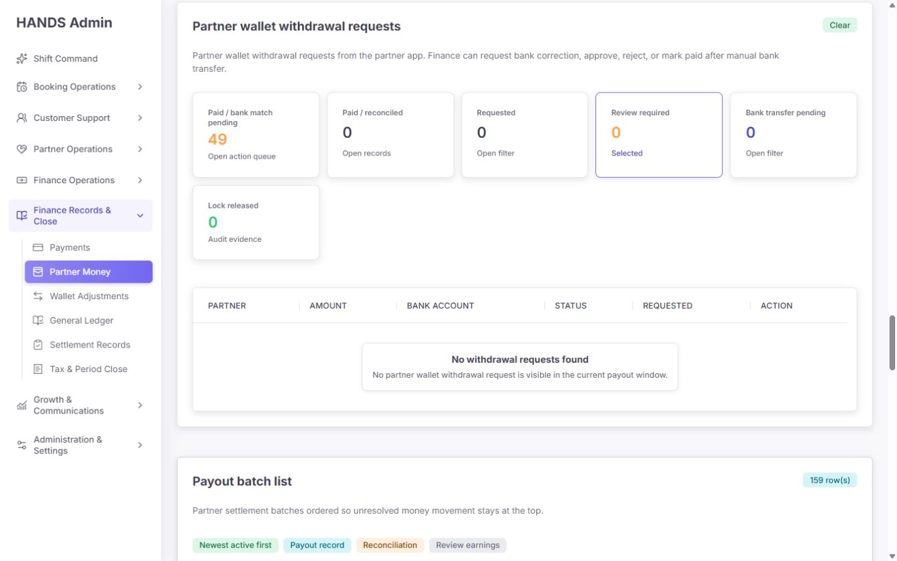

- Paid / bank match pending은 49건인데 기본 선택은 Review required 0건이다.
- 섹션 우측 상단은 `Clear`로 표시된다.
- 49는 전체 summary API 값이고, `Clear` 판정은 현재 requests 배열의 0건을 센 값이다.
- 빈 필터 결과와 전체 queue health를 한 배지로 표현하는 전형적인 false-clear다.

코드 원인:

- `payouts-page-model.ts:62-66`은 별도 필터가 없으면 `REVIEW_REQUIRED`를 기본 선택한다.
- `payout-wallet-withdrawal-request-section.tsx:77-100`은 현재 로드된 requests에 actionable row가 없으면 server summary에 49가 있어도 `Clear`를 반환한다.
- Requested/Review required/Bank transfer pending 카운트도 server summary가 아니라 현재 rows로 만든 `visibleSummary`를 사용한다.

필수 수정:

- 섹션 health는 server summary의 전역 open counters로 계산한다.
- 선택 큐가 비어 있으면 `No records in Review required`라고 표현하고, 별도로 `49 bank matches pending` warning을 유지한다.
- 기본 선택은 가장 높은 우선순위의 non-zero action queue로 결정하거나 `All open`을 둔다.
- 오래된 미대사 건은 날짜 필터와 독립된 outstanding backlog로 계산한다.

### 4.7 Paid / bank match pending 큐 — 건강도: 미흡

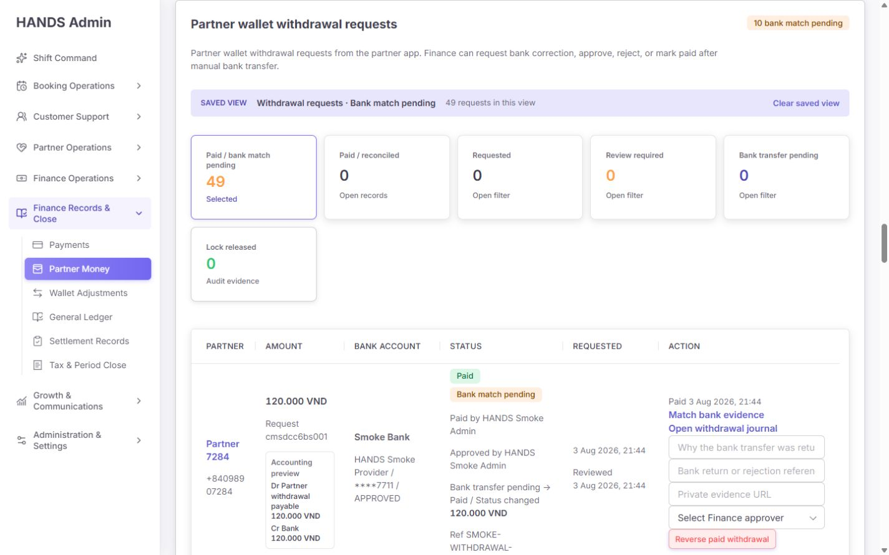

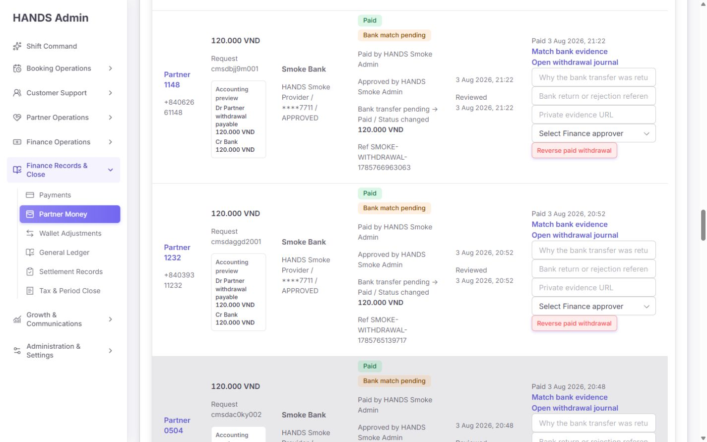

- saved view에는 49건이라고 표시되지만 상단 결과는 현재 페이지 10건을 세어 `10 bank match pending`이라고 한다.
- 표에는 partner, phone, 금액, accounting preview, bank account, 상태, 처리자/승인자/시각, 상태 전이, transfer ref, bank match, journal link까지 충분한 증거가 있다.
- 그러나 10개 행 모두에 reversal reason, reference, evidence URL, approver select, submit 버튼을 반복한다.
- 사용자는 단순 bank matching 업무를 보면서 10개의 파괴적 취소 폼에 노출된다.

1440px 실측:

| 지표 | 값 |
|---|---:|
| 전체 문서 높이 | 12,415px |
| DOM nodes | 2,188 |
| 링크 | 130 |
| forms | 11 |
| visible input/select | 40 |
| table rows | 30 |
| tables | 14 |

코드 원인:

- `payout-wallet-withdrawal-request-section.tsx:306-370`이 PAID 행마다 전체 reversal form을 렌더링한다.
- 10개 accounting preview가 각자 table 구조를 사용해 전체 table 수가 증가한다.
- approver directory는 paid row에 reversal 가능성이 있으면 페이지 진입 시 로드된다 (`page.tsx:181-190`).

권장:

- 행에는 `Match bank evidence`, `Open journal`, `More`만 둔다.
- `Reverse paid withdrawal`을 선택했을 때만 drawer/modal에 하나의 form을 렌더링한다.
- 상단에는 `Showing 10 of 49 bank matches pending`라고 정확히 쓴다.
- reversal drawer에서 partner, amount, bank, transfer ref, original paid actor/time, expected journal, approver, reason, evidence를 한 번에 확인한다.
- approver directory는 drawer를 열 때 로드하거나 짧게 캐시한다.

### 4.8 Payout batch list — 건강도: 미흡

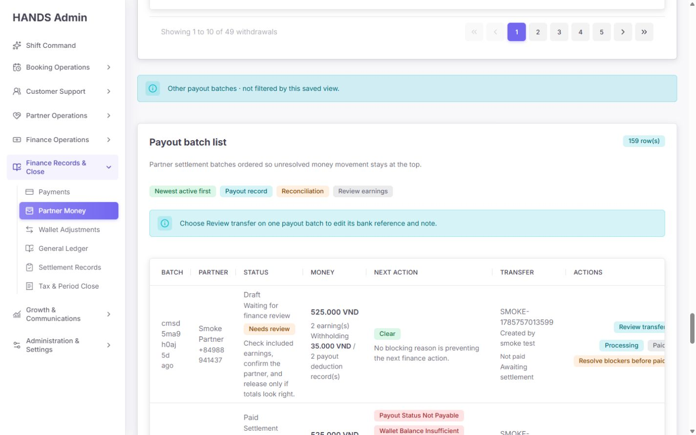

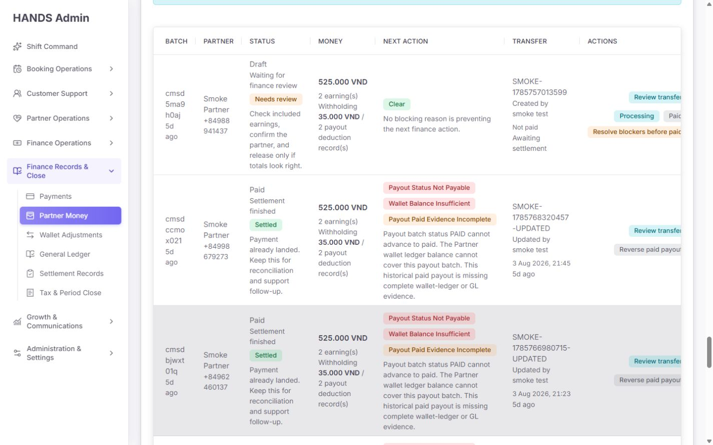

- 159건을 다루지만 batch ID, partner name/phone, transfer ref 검색이 없다.
- status, exception, bank evidence, amount, owner, age/SLA 필터가 없다.
- 1440px에서 실제 content width는 약 1,050px인데 7개의 정보 밀도 높은 열을 넣어 ID와 문장이 과도하게 줄바꿈된다.
- Action 열이 우측에 밀리며 행별 빠른 비교가 어렵다.
- CSS에는 `.payout-batch-list-card .table { min-width: 1840px }`가 있으나 `PayoutBatchListSection`의 panel에는 `payout-batch-list-card` class가 없어 의도한 규칙이 적용되지 않는다.
- 이 class를 단순히 붙이면 1,840px 수평 스크롤이 생긴다. 근본 해결은 열 재설계다.

권장 목록:

| 열 | 내용 |
|---|---|
| Partner / Batch | partner name·phone, short batch ID, 복사 |
| Amount | net, withholding은 보조 |
| Stage | Review / Processing / Paid / Repair |
| Primary issue | 가장 중요한 blocker 또는 warning 하나 |
| Transfer evidence | ref, bank, evidence 상태 |
| Age / Owner | queue entered at, SLA, 담당자 |
| Next action | primary action 하나 + More |

기본 행은 80~112px를 목표로 하고, 나머지 earning/tax/operator evidence는 우측 drawer로 보낸다.

### 4.9 Transfer evidence editor — 건강도: 양호하나 동선 결함

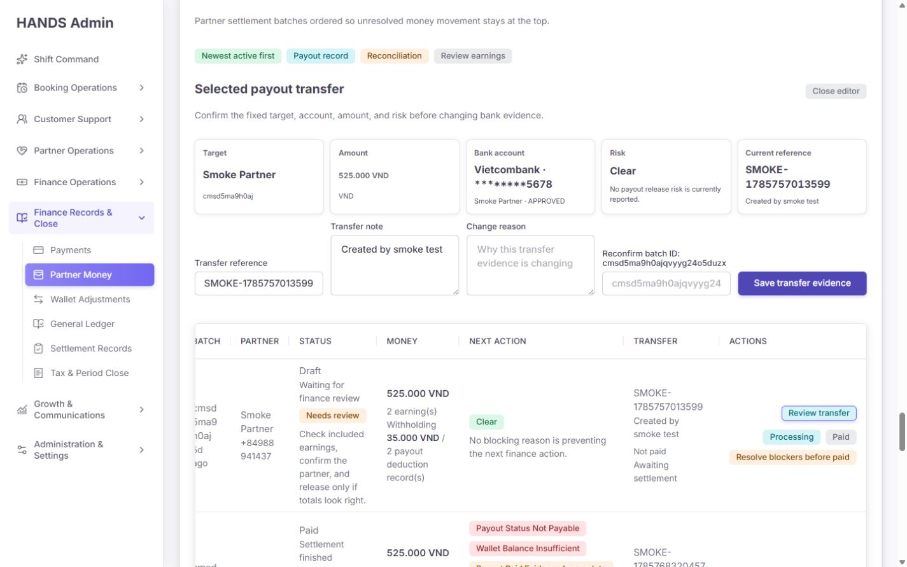

좋은 점:

- Target, amount, bank account, risk, current reference를 저장 전 확인한다.
- full batch ID 재입력, change reason, expected status/ref/note 동시성 검사가 있다.

문제:

- withdrawal saved view에서 `Review transfer`를 누르면 `#partner-wallet-withdrawal-requests` hash를 그대로 보존한다.
- editor는 문서 Y≈9,497에 렌더링되지만 브라우저는 withdrawal section Y≈4,998에 머문다. 화면상 버튼을 눌러도 editor가 열린 사실을 알기 어렵다.
- 5열 form이 1,050px 안에 압축돼 full batch ID label과 입력값이 잘린다.
- editor 아래에 전체 batch table이 바로 붙어 집중을 방해한다.

코드 원인:

- `page.tsx:751-762`의 review href가 `filters.hasWithdrawalSavedView`이면 withdrawal focus를 유지한다.
- `payouts-page-model.ts:payoutHref()`가 focus flag에 따라 withdrawal hash를 붙인다.

필수 수정:

- batch action을 시작할 때 withdrawal hash를 제거하고 `#selected-payout-transfer`로 이동한다.
- 가장 좋은 구조는 우측 drawer다. URL은 `selectedBatchId`를 유지하되 scroll 위치에 의존하지 않는다.
- form은 2열 또는 3열로 줄이고 full ID confirmation은 한 줄 전체 폭으로 둔다.

### 4.10 Processing / Paid confirmation — 건강도: 부분 통과

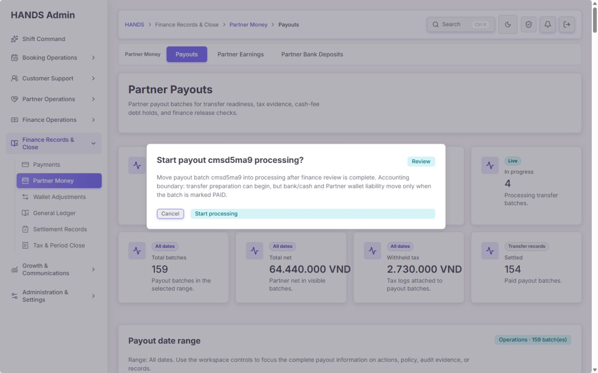

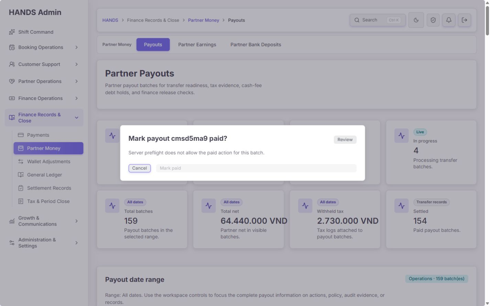

- Processing 확인창은 회계 이동이 PAID 시점에만 발생한다는 경계를 잘 설명한다.
- 직접 `confirm=paid` URL을 만들어도 server preflight 불허 상태에서는 버튼이 비활성화된다.
- 그러나 Processing 확인창은 short ID만 보여주고 partner, amount, bank account, transfer ref를 보여주지 않는다.
- 상태 변경은 reversible해도 금융 작업 순서를 시작하는 액션이므로 잘못된 행 선택을 막는 핵심 식별자가 필요하다.

권장:

- 모든 payout confirmation에 partner, amount, bank last4, full/short batch ID, current stage, transfer ref, maker를 표시한다.
- Processing은 `Start transfer preparation`, Paid는 `Approve paid closeout`처럼 실제 책임을 표현한다.
- Paid confirmation은 maker, approver, expected journal, evidence completeness를 표시하고 서버 판단값을 그대로 사용한다.

### 4.11 Release policy workspace — 건강도: 주의

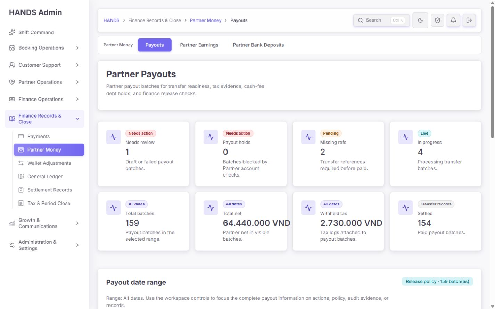

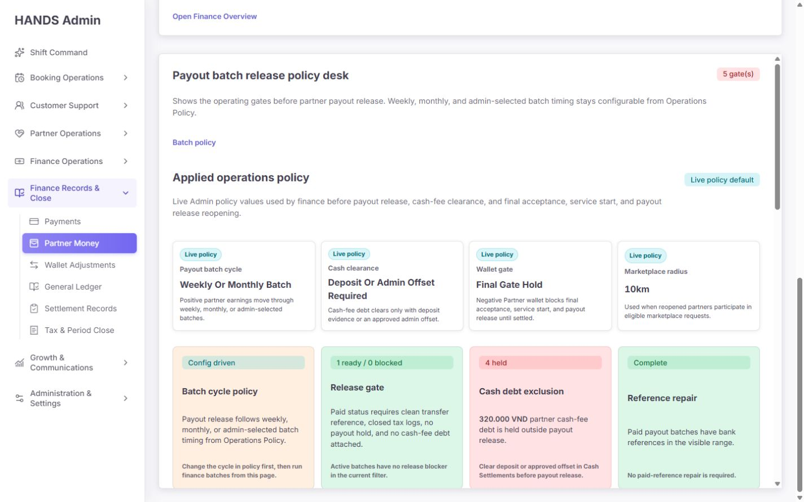

- live policy 값, release gate, cash debt exclusion, reference repair를 한 흐름에 둔 방향은 좋다.
- 상단 KPI 8개가 모든 workspace에서 반복되어 정책 내용은 한 화면 아래로 밀린다.
- policy panel에 `max-height: calc(100vh - 120px); overflow-y:auto`가 적용돼 페이지 스크롤과 panel 내부 스크롤이 동시에 생긴다.
- `Payout holds 0`과 policy의 `Cash debt exclusion 4 held`가 개념 구분 없이 보인다.
- 실제 정책 변경은 `/operations-policy`에서 하므로 이 workspace는 읽기 전용 설명과 운영 큐가 섞인 중간 페이지다.

권장:

- `Release policy`는 메인 workspace보다 `Policy summary` drawer 또는 `/operations-policy` deep link로 낮춘다.
- 유지한다면 상단 KPI 반복을 제거하고 applied policy + 현재 gate effect만 보여준다.
- nested vertical scroll을 제거한다.

### 4.12 Audit evidence workspace — 건강도: 주의

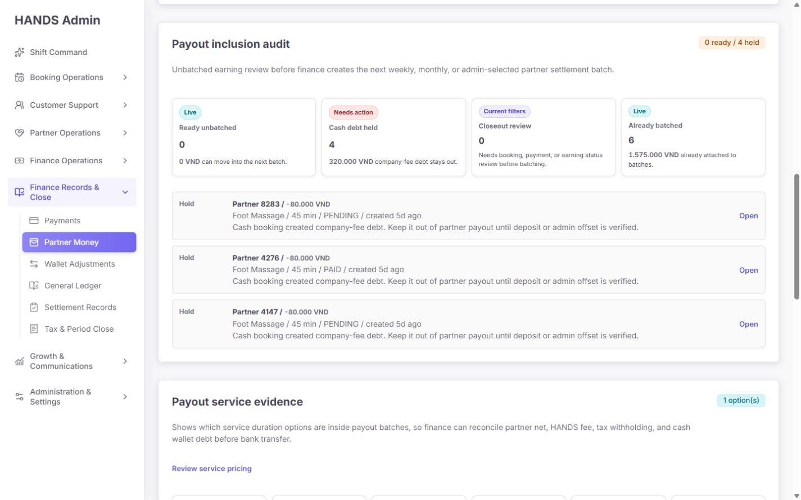

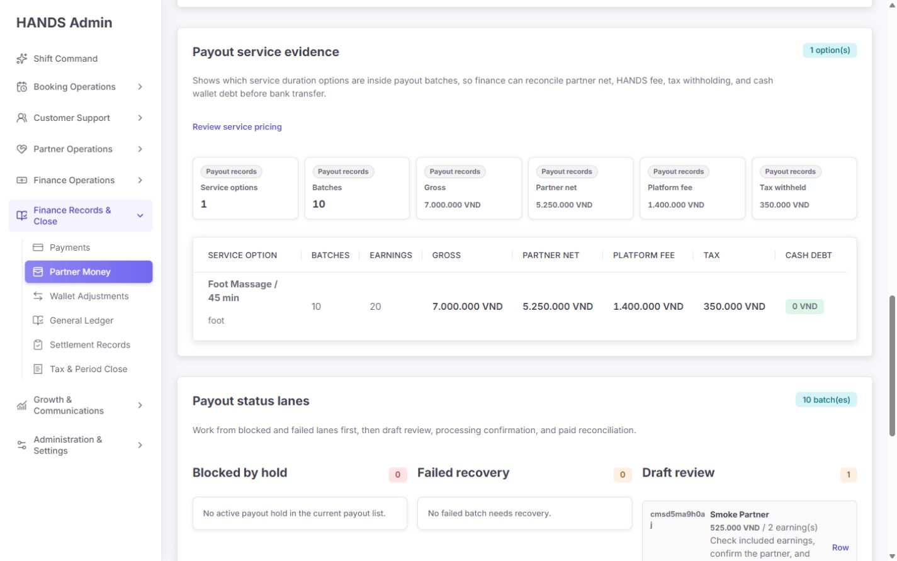

- unbatched cash debt 4건을 payout에서 제외하는 근거와 service option별 gross/net/fee/tax를 연결한 것은 유용하다.
- 그러나 `Already batched 6`, `Batches 10`, `Status lanes 10 batches`는 All dates 전체 159건이 아니라 현재 10개 배치 표본이다.
- `All dates`라는 range와 `159 batch(es)` 결과 배지가 상단에 있어 표본 10건이라는 사실이 드러나지 않는다.
- `Service options 1`도 전체 서비스 구성으로 오해할 수 있다.

권장:

- `Audit evidence`를 `Reconciliation`으로 명명하고 모든 aggregate를 서버에서 전체 범위로 계산한다.
- 표본을 유지한다면 `Current page: 10 of 159 batches`를 각 섹션 헤더에 표시한다.
- `Already batched 6`은 earning count인지 batch count인지 명확히 구분한다.

### 4.13 Records workspace — 건강도: 실패

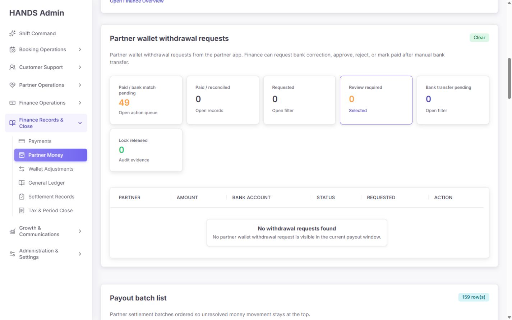

- 49건의 bank match pending이 보이는데 선택된 Review required 0 때문에 다시 `Clear`가 표시된다.
- `Records` 안에서 withdrawal table과 payout batch table을 한 번에 길게 쌓는다.
- saved view가 있으면 “Other payout batches · not filtered by this saved view”라고 알리지만, 이 문구는 혼합을 설명할 뿐 문제를 해결하지 않는다.
- 기록 조회와 실시간 조치가 같은 row action을 공유한다.

권장:

- Records를 `Payout batches`, `Wallet withdrawals`, `Reconciliation` 세 탭으로 분리한다.
- 같은 `/payouts` route의 `view` parameter를 사용할 수 있으므로 별도 상위 페이지를 늘릴 필요는 없다.
- 선택한 view의 데이터만 fetch/render한다.

## 5. 권장 정보 구조

현재 `Operations / Release policy / Audit evidence / Records`보다 아래 구조가 운영 역할과 더 잘 맞는다.

```text
Partner Money
└─ Payouts
   ├─ Payout batches        기본: 열린 지급 업무
   │  ├─ Review
   │  ├─ Processing
   │  ├─ Release blocked
   │  └─ Paid history
   ├─ Wallet withdrawals    요청 → 은행송금 → paid closeout
   │  ├─ Requested
   │  ├─ Review / correction
   │  ├─ Bank transfer pending
   │  └─ Paid / bank match pending
   └─ Reconciliation        지급 후 증빙 수선
      ├─ Bank unmatched
      ├─ Ledger / GL incomplete
      ├─ Tax evidence mismatch
      └─ Reversal history

Operations Policy
└─ Payout release policy    설정의 단일 원천
```

핵심 원칙:

- 한 페이지 route는 유지하되 한 번에 한 업무 view만 보여준다.
- `Payout batches`와 `Wallet withdrawals`는 서로 다른 지급 엔진이므로 한 table 아래에 연속 배치하지 않는다.
- `Policy`는 설정 원천으로 이동하고, payout 화면에는 현재 적용값과 영향만 요약한다.
- `Audit evidence`는 지급 전 blocker가 아니라 지급 후 repair queue 중심의 `Reconciliation`으로 바꾼다.

## 6. 필터와 검색 요건

### Payout batches

- Search: batch ID, partner name/phone, transfer ref
- Queue: Review, Processing, Release blocked, Post-payment repair, Paid history
- Status: DRAFT, PROCESSING, FAILED, PAID, CANCELLED
- Evidence: missing ref, bank account issue, tax mismatch, ledger/GL mismatch
- Amount range
- Age/SLA
- Owner
- Sort: severity, oldest, highest amount, newest

### Wallet withdrawals

- Search: request ID, partner name/phone, transfer ref, bank last4
- Queue: Requested, Correction, Review, Bank transfer pending, Paid unmatched, Reconciled, Reversed
- Evidence: attachment missing, transfer date missing, maker missing, journal missing
- Age/SLA
- Owner/approver

필터 적용 상태는 table 바로 위의 제거 가능한 chip으로 표시하고, `Clear saved view`는 업무 view 전체를 바꾸지 않도록 한다.

## 7. 운영 문구 교정안

| 현재 문구 | 문제 | 권장 문구 |
|---|---|---|
| `4 signal(s)` | 카드 종류 개수 | `1 batch needs review` 또는 실제 open 합계 |
| `4 check(s)` | 항상 렌더링되는 check 종류 | `0 mismatches` / `Not evaluated` |
| `Clear` | 빈 필터와 전역 정상 혼동 | `No records in Review required` |
| `10 bank match pending` | 현재 페이지 10건만 표시 | `Showing 10 of 49 bank matches pending` |
| `Release blocker queue`에 PAID 포함 | 시점이 틀림 | `Post-payment evidence repair` |
| `Partner-facing payout readiness queue` | 내부 관리자 화면 문구가 아님 | `Partner payout readiness queue` |
| `Row` | 목적 불명확 | `Open batch cmsd5ma9` |
| `Review amount` | 어떤 금액인지 불명확 | `Net payout awaiting review` |
| `Payout holds` | sanction/cash debt 혼동 | `Active partner account holds` |
| `Cash debt held` | unbatched earning 범위 불명확 | `Unbatched cash-debt earnings` |
| `Processing` | 상태와 액션 혼동 | `Start transfer preparation` |
| `Paid` | 단순 상태처럼 보임 | `Approve paid closeout` |
| `Other payout batches · not filtered...` | 혼합 화면을 설명만 함 | 해당 table을 다른 view로 분리 |
| `item(s)`, `row(s)`, `batch(es)` | 기계적인 복수형 | 정상 단·복수형 formatter 사용 |

## 8. 우선순위별 수정 목록

### P0 — 배포 전 필수

1. Money flow의 전체 summary와 현재 10행 표본 혼합을 제거한다.
2. 모든 reconciliation 판정에 동일 scope와 completeness contract를 강제한다.
3. API 오류를 0/Clear fallback으로 표시하지 않는다. panel별 `Data unavailable`, retry, last successful sync를 제공한다.
4. Withdrawal header health를 server summary의 전역 open counters로 계산한다.
5. 빈 선택 필터는 `No records in this filter`로, 전체 정상은 별도의 `All clear`로 구분한다.
6. PAID/CANCELLED를 Release blocker에서 제외하고 post-payment repair로 이동한다.

### P1 — 운영 효율에 필수

1. `/payouts`를 Payout batches / Wallet withdrawals / Reconciliation view로 분리하고 active view만 fetch한다.
2. 기본 진입을 Today가 아닌 open work queue로 바꾼다.
3. batch/partner/ref 검색과 status/evidence/age/owner 필터를 추가한다.
4. 10개 반복 reversal form을 단일 drawer/modal로 바꾼다.
5. payout batch list를 7개 압축 열로 재설계하고 row detail을 drawer로 옮긴다.
6. batch action URL에서 withdrawal hash를 제거한다.
7. Processing/Paid confirmation에 partner, amount, bank, ref, maker/approver를 표시한다.
8. 모든 queue에 oldest age, SLA, owner를 추가한다.

### P2 — 폴리시 및 일관성

1. KPI 8개를 4개 운영 KPI로 축소한다.
2. Release policy의 중첩 스크롤을 제거한다.
3. Policy workspace를 Operations Policy deep link로 단순화한다.
4. 영문 복수형과 `Row`, `Clear`, `signal(s)` 같은 기계적 문구를 교정한다.
5. `Payout holds`와 `Cash debt held`의 용어·범위를 통일한다.

## 9. API·데이터 계약 권장안

### 9.1 Panel result를 상태 포함 객체로 반환

```ts
type FinancePanelResult<T> = {
  status: 'ready' | 'partial' | 'error';
  data: T | null;
  scope: {
    range: string;
    batchCount: number;
    isComplete: boolean;
  };
  generatedAt: string | null;
  errorCode?: string;
};
```

`error` 또는 `partial`이면 UI가 Clear/MATCHED를 계산하지 못하게 한다.

### 9.2 Money flow aggregate

```ts
type PayoutMoneyFlowSummary = {
  scopeBatchCount: number;
  evidenceBatchCount: number;
  grossAmount: number;
  payoutNetAmount: number;
  evidenceNetAmount: number;
  platformFeeAmount: number;
  withholdingAmount: number;
  cashDebtAmount: number;
  netGap: number;
  verdict: 'MATCHED' | 'MISMATCH' | 'NOT_EVALUATED';
};
```

### 9.3 Preflight 분리

```ts
type PayoutRiskModel = {
  releasePreflight: {
    allowed: boolean;
    blockers: Finding[];
    warnings: Finding[];
  } | null; // active batch only
  reconciliationFindings: Finding[]; // paid/cancelled only
};
```

## 10. 성능 개선안

현재 operations page는 Admin Web에서 최대 6개의 admin API를 병렬 호출하고, reversal 가능 paid rows가 있으면 현재 operator와 Finance approver directory를 추가로 불러온다. API의 payout/withdrawal preflight는 wallet balances, pending withdrawals, ledger entries, accounting journals, approver, monthly closing 등을 다시 조회한다.

권장 순서:

1. active view 데이터만 fetch한다. Batch view에서 withdrawal rows와 approver directory를 읽지 않는다.
2. 상단은 가벼운 summary endpoint 하나로 통합한다.
3. row detail과 reversal approver는 drawer open 시 지연 로드한다.
4. Operations policy와 approver directory는 짧은 tagged cache를 사용하고, balance/preflight는 live로 유지한다.
5. accounting preview를 매 행의 내부 table 대신 compact definition list로 바꾼다.
6. 1440px 기준 performance budget을 둔다: 기본 문서 높이 < 5,000px, visible rows 10, forms 0~1, visible controls < 15, DOM nodes < 1,500.

로컬 탐색은 약 0.4~1.2초 범위였지만, 이는 개발 환경의 체감치이며 실제 네트워크 성능 판정은 아니다. 구조적으로는 active view 분리와 반복 form 제거가 가장 큰 개선 포인트다.

## 11. 접근성·시각 품질

통과:

- 1440px에서 document-level 수평 overflow는 없었다.
- 중복 ID 없음.
- 이름 없는 interactive control 없음.
- heading hierarchy가 논리적이다.
- 확인창과 입력 label이 접근 가능한 이름을 제공한다.

개선:

- 1440px content 폭 1,050px에서 batch table text가 과도하게 줄바꿈된다.
- destructive reversal controls가 모든 row에 반복되어 시각적·인지적 부담이 크다.
- policy panel의 이중 세로 스크롤을 제거한다.
- warning/success badge는 전체 health와 선택 filter state를 구분해야 한다.

Impeccable deterministic detector는 `globals.css`의 전역 `side-tab` 패턴 6개를 보고했지만 모두 Vietnam map, Marketing, Booking, Dispatch, Timeline, Ops check selector였고 payout selector와 직접 관련이 없어 이번 페이지 결함으로 채택하지 않았다. 핵심 결함은 detector가 아니라 화면·계산 범위·운영 흐름 검토에서 발견됐다.

## 12. 회귀 테스트 및 검증 결과

실행 결과:

- Admin Web payout tests: **15 files / 108 tests passed**
- API payout tests: **87 passed / 565 skipped**
- API withdrawal tests: **28 passed / 624 skipped**

테스트 통과는 현재 구현과 계약이 일치한다는 뜻이지 운영 판정이 올바르다는 뜻은 아니다. 특히 page tests는 `adminGet` fallback을 정상 empty state로 취급하고 있어 failure와 empty의 분리를 검증하지 않는다.

### 추가해야 할 acceptance tests

1. payout summary API 실패 시 `0`, `Clear`, `MATCHED`가 표시되지 않는다.
2. All dates Money flow의 모든 카드와 gap이 동일한 159개 scope를 사용한다.
3. 현재 10개만 계산하면 `Visible 10 of 159`가 표시되고 전체 64,440,000을 섞지 않는다.
4. server summary가 paidUnreconciled 49이고 selected Review required가 0이면 header는 warning을 유지한다.
5. PAID batch는 Release blocker에 나타나지 않고 Post-payment repair에 나타난다.
6. `Review transfer`가 withdrawal saved view에서 선택 editor로 정확히 이동한다.
7. reversal form은 선택한 한 건에만 렌더링된다.
8. 1440 × 900 screenshot에서 batch row 핵심 열과 primary action이 읽힌다.
9. Processing confirmation은 partner, amount, bank, batch ID를 포함한다.
10. partial data 상태에서는 finance action이 disable되거나 명시적 재검증을 요구한다.

## 13. 권장 구현 순서

1. P0 scope contract와 error state부터 고친다.
2. PAID findings를 release blocker에서 분리한다.
3. page view를 Payout batches / Wallet withdrawals / Reconciliation로 나눈다.
4. 각 view의 summary, 검색, 필터, owner/SLA를 추가한다.
5. batch review와 reversal을 drawer로 이동한다.
6. 1440px table과 copy를 정리한다.
7. API/page/interaction/screenshot acceptance tests를 추가한다.

## 14. 최종 판정

현재 `/payouts`는 “잘못된 버튼 실행을 서버가 막는 능력”은 좋아졌지만, “운영자에게 지금 무엇이 위험한지 정확히 말하는 능력”은 아직 부족하다. 금융 화면에서 `Clear`와 `MATCHED`는 가장 강한 신뢰 신호다. 현재 두 신호가 부분 데이터와 빈 필터에서 만들어질 수 있으므로 우선 제거해야 한다.

수정 완료 기준은 단순히 화면을 짧게 만드는 것이 아니다.

- 같은 숫자 블록은 같은 scope를 사용한다.
- 데이터 실패와 정상 0건이 구분된다.
- 지급 전 blocker와 지급 후 repair가 분리된다.
- 기본 화면은 날짜가 아니라 미해결 업무를 우선한다.
- 한 화면에는 한 업무 엔진만 보인다.
- 한 행에는 하나의 primary action만 보인다.
- 모든 금융 상태 변경은 현재의 서버 preflight와 maker-checker를 유지한다.

이 조건이 충족되면 `/payouts`는 증거가 많은 화면에서, 운영자가 빠르고 안전하게 결정할 수 있는 Finance command surface로 바뀔 수 있다.
