# Partner Payouts 사후 개선 재감사 보고서

- 감사 대상: `http://localhost:3101/payouts`
- 감사일: 2026-08-09
- 기준 화면: 데스크톱 1440 × 900만 검사
- 제외 범위: 1024px 이하 반응형·모바일·태블릿
- 비교 기준:
  - `output/payouts-audit-2026-08-09/payouts-deep-audit-report.md`
  - `output/payouts-audit-2026-08-09/payouts-improvement-codex-prompt.md`
  - 현재 브라우저 화면, 현재 소스 코드, API 집계 로직, 관련 테스트
- 코드 변경: 없음. 본 문서는 감사 및 개선 제안만 수행한다.

## 1. 최종 판정

**조건부 통과 — 3.0 / 5.0**

이전 2.4/5 상태보다 분명히 좋아졌다. `Payout batches / Withdrawals / Reconciliation` 분리, 서버 기준 요약, 범위가 일치하는 money-flow, 빈 필터 상태, 반복 reversal form 제거, 단일 확인 대화상자, 검색·정렬·서버 페이지네이션, 다크 테마는 실제 화면과 코드에서 확인됐다.

그러나 아직 운영자가 매일 사용하는 재무 작업대로는 완성되지 않았다. 핵심 잔여 문제는 다음 여섯 가지다.

1. Reconciliation이 다시 두 개의 대형 작업목록을 한 화면에 합쳐 19,928px까지 길어진다.
2. `Review transfer`로 연 편집기가 화면 상단에서 약 8,005px 아래에 생기며 브라우저는 상단으로 돌아간다.
3. 1440px에서도 핵심 Actions 열이 가려지고, ID·상태 문구가 세로로 찢어진다.
4. PAID reversal 불가 사유에 “cannot advance to paid”, “wallet balance cannot cover” 같은 지급 전 사유가 섞인다.
5. 처리 시작 확인창에 Partner·금액·은행계좌·transfer reference가 부족하다.
6. `Evidence complete`와 `Post-payment repair 154`가 서로 다른 증빙 계층을 같은 “evidence”로 표현해 모순처럼 보인다.

### 종합 점수

| 평가축 | 점수 | 판정 |
|---|---:|---|
| 재무 집계·데이터 의미 | 3/4 | 범위와 서버 판정은 좋아졌으나 earning 증빙과 wallet/GL 증빙의 이름이 섞임 |
| 운영 IA·작업 흐름 | 2/4 | 3개 뷰 분리는 좋지만 Reconciliation에서 다시 결합됨 |
| 1440px 데스크톱 사용성 | 2/4 | 주요 조작은 가능하나 가로 스크롤·열 잘림·과도한 행 높이가 큼 |
| 안전성·접근성 | 3/4 | 서버 preflight·확인창·focus trap은 있으나 문맥과 focus return이 부족 |
| 성능·화면 복잡도 | 2/4 | 기본 화면은 개선됐지만 Reconciliation이 2,404 DOM / 47 tables까지 증가 |
| **합계** | **12/20** | **조건부 통과** |

## 2. 검수 방법과 증거

- 로그인된 인앱 브라우저에서 실제 렌더링·상호작용을 검사했다.
- 각 주요 상태를 1440 × 900으로 캡처했다.
- 기본, 필터, 빈 상태, reversal, reconciliation, transfer editor, processing confirmation, dark theme를 순서대로 확인했다.
- 현재 화면의 DOM 규모, 문서 높이, table/form 수, 가로 overflow를 측정했다.
- 프론트의 URL 상태·데이터 로딩·표·확인창 코드를 읽었다.
- API의 post-payment repair predicate, payout preflight, summary 범위를 확인했다.
- payout 관련 프론트 테스트 109개, API 관련 테스트 655개, 양쪽 typecheck를 실행했다.
- 브라우저 console warning/error는 0건이었다.

## 3. 이전 개선 요구사항 이행표

| 이전 요구 | 현재 상태 | 판정 | 재감사 의견 |
|---|---|---|---|
| Batches / Withdrawals / Reconciliation 분리 | 구현됨 | 통과 | 최상단 3개 segmented view는 이해하기 쉬움 |
| 선택 범위와 money-flow 범위 통일 | 구현됨 | 통과 | Gross, batch net, evidence net가 같은 범위 계약을 사용함 |
| 선택 결과 0인데 전체가 clear로 보이는 문제 제거 | 구현됨 | 통과 | 빈 필터에도 global bank-match 위험 49가 유지됨 |
| API 실패를 빈 데이터로 숨기지 않기 | 구현됨 | 통과 | summary/list/global-summary 실패 notice가 분리됨 |
| 반복 reversal form 제거 | 구현됨 | 통과 | 단일 `alertdialog`로 전환됨 |
| 검색·정렬·페이지네이션 | 구현됨 | 부분 통과 | 기본 기능은 있으나 뷰별 필드와 고급 필터가 부족 |
| PAID를 지급 전 blocker에서 분리 | 일부 구현 | 부분 통과 | riskModel은 분리됐지만 reversal disabled reason은 전체 preflight blocker를 재사용 |
| 활성 뷰의 행 데이터만 로드 | 일부 구현 | 부분 통과 | Batches/Withdrawals는 분리, Reconciliation은 양쪽 20행을 동시에 로드·렌더링 |
| 운영 가능한 1440px 표 | 미완성 | 실패 | Batch/Withdrawal 모두 Actions가 오른쪽에 가려짐 |
| 편집 대상이 즉시 보이는 drawer/modal | 미구현 | 실패 | 페이지 중간 inline editor라 실제 클릭 후 상단에서 발견 불가 |
| 안전한 확인창에 대상·금액·은행·ref 표시 | 일부 구현 | 부분 통과 | paid 설명에 금액은 있으나 processing은 short ID와 일반 설명 중심 |
| owner/SLA/age 기반 운영 | 미구현 | 미완성 | 담당자·기한·aging이 작업목록에 없음 |
| 다크 테마 | 구현됨 | 통과 | 정보계층과 대비가 전반적으로 안정적 |

## 4. 화면별 운영 흐름 재감사

### Step 1. Payout batches 기본 화면 — 부분 양호

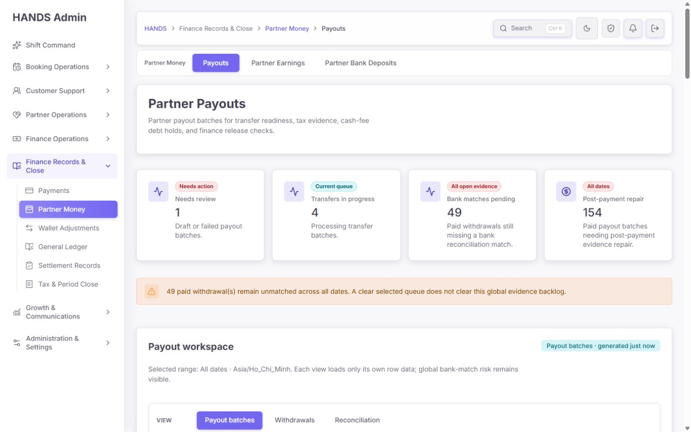

좋아진 점:

- 4개 핵심 지표와 3개 업무 뷰가 첫 화면에서 보인다.
- `Needs review`, `Transfers in progress`, `Bank matches pending`, `Post-payment repair`가 서로 다른 운영 위험을 보여준다.
- 실패 시 “Unavailable”로 닫는 구조가 코드에 있어 거짓 0을 만들지 않는다.

남은 문제:

- 기본값이 `All queues`라서 1개 review, 4개 processing 이후 154개 PAID history가 같은 목록에 이어진다.
- 상단 KPI 카드가 링크가 아니어서 위험 숫자에서 작업목록으로 바로 진입하지 못한다.
- `Post-payment repair 154`가 현재 range 기반인 반면 `Bank matches pending 49`는 `All open evidence`다. 카드 안 scope 표기는 있으나 빠른 비교 시 범위 차이를 놓치기 쉽다.

권고:

- 기본 queue를 `Open work`로 만들고 `review + transfer`만 표시한다.
- `Paid history`는 `History` queue 또는 별도 records view로 보낸다.
- KPI 카드 전체를 클릭 가능하게 만들고 선택된 queue/filter와 URL을 일치시킨다.
- 범위가 다른 전역 backlog는 카드 상단에 `GLOBAL` 배지를 사용해 숫자보다 먼저 인지되게 한다.

### Step 2. Payout batch 표 — 개선 필요

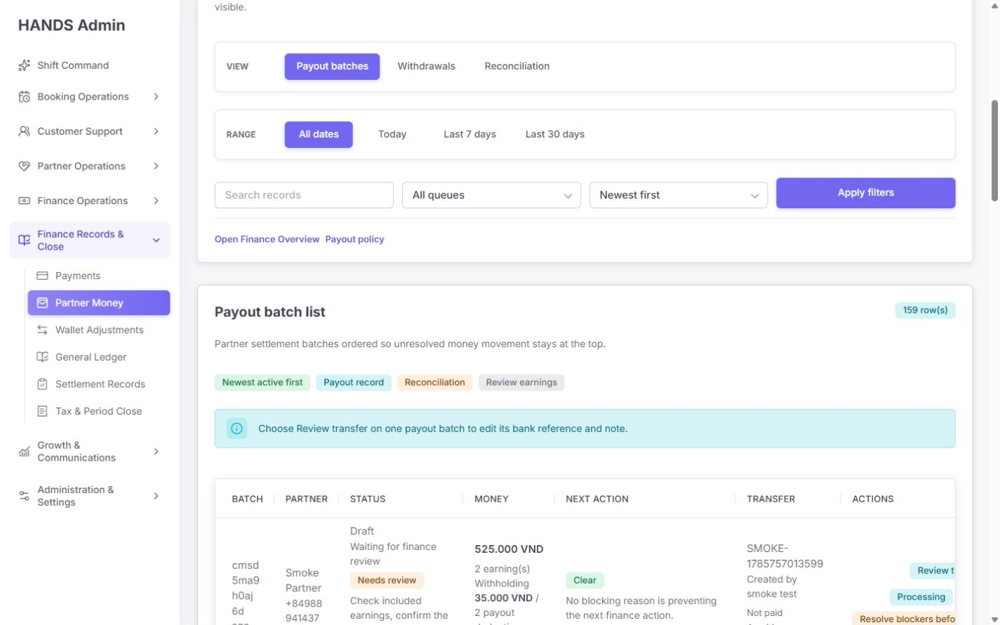

실측:

- 표 viewport 약 1,050px
- 표 scroll width 약 1,143px 이상
- 실제 CSS에는 payout batch table `min-width: 1380px` 규칙도 존재
- 오른쪽 Actions 열은 초기 시야에서 잘린다.

운영 문제:

- Batch ID와 Partner phone이 문자 단위로 줄바꿈된다.
- `Next action` 안의 긴 문장이 행 높이를 크게 만든다.
- 핵심 액션은 가장 오른쪽에 있어 운영자가 매 행마다 가로 스크롤해야 한다.
- PAID 행도 `Blocking reasons for …`라는 aria-label을 사용한다. post-payment repair는 blocker가 아니라 reconciliation finding이다.
- 모든 행의 액션명이 `Review transfer`라서 PAID history의 증빙 복구와 DRAFT/PROCESSING 편집 목적이 구분되지 않는다.

수정안:

- 열을 `Partner / Batch`, `Amount`, `State`, `Issue / next action`, `Transfer evidence`, `Action`의 6열로 재설계한다.
- Batch ID는 한 줄 short ID + copy 버튼, 전화번호는 한 줄 고정한다.
- desktop 1440 기준 표 본문을 가로 스크롤 없이 맞추거나, Actions를 첫 번째/두 번째 sticky 열로 이동한다.
- 긴 원문 오류는 badge 1개 + 한 줄 요약 + `View details`로 축약한다.
- PAID는 `Repair transfer evidence`, open batch는 `Review transfer`로 라벨을 나눈다.
- aria-label도 phase에 따라 `Release checks` / `Reconciliation findings`로 분기한다.

### Step 3. Withdrawals 상단 — 양호

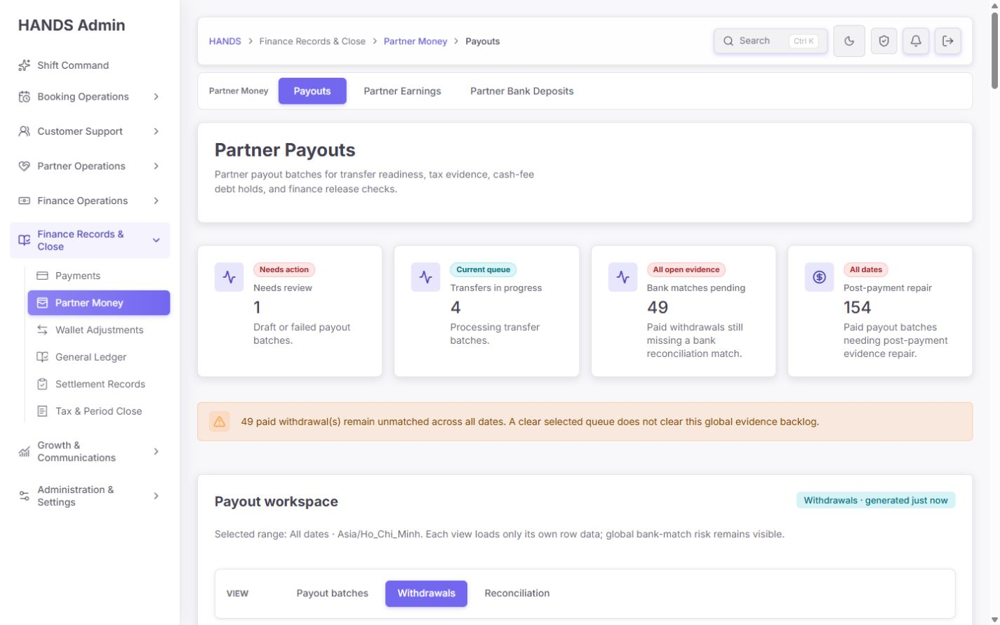

좋아진 점:

- withdrawal 전용 summary cards가 실제 filter link로 작동한다.
- saved view가 현재 조건과 결과 수를 명시한다.
- 전역 `Bank matches pending` 위험을 유지하면서 현재 결과를 따로 표시한다.

남은 문제:

- 공통 검색 label이 `Search batch, Partner, phone, or transfer reference`다. withdrawal에서는 batch가 아니라 withdrawal request ID, bank account last4가 더 중요하다.
- 상태·reconciliation 카드가 상단 KPI와 한 번 더 반복되어 무엇이 전역 지표이고 무엇이 현재 목록 필터인지 학습이 필요하다.

권고:

- 뷰별 검색 label을 분기한다.
  - Batches: `Search batch ID, Partner, phone, transfer reference`
  - Withdrawals: `Search withdrawal ID, Partner, phone, bank last 4, transfer reference`
- 전역 KPI와 현재-view summary를 시각적으로 분리한다. 전역은 compact warning strip, 현재 목록 필터는 cards/chips로 유지한다.

### Step 4. Withdrawal 작업목록 — 개선 필요

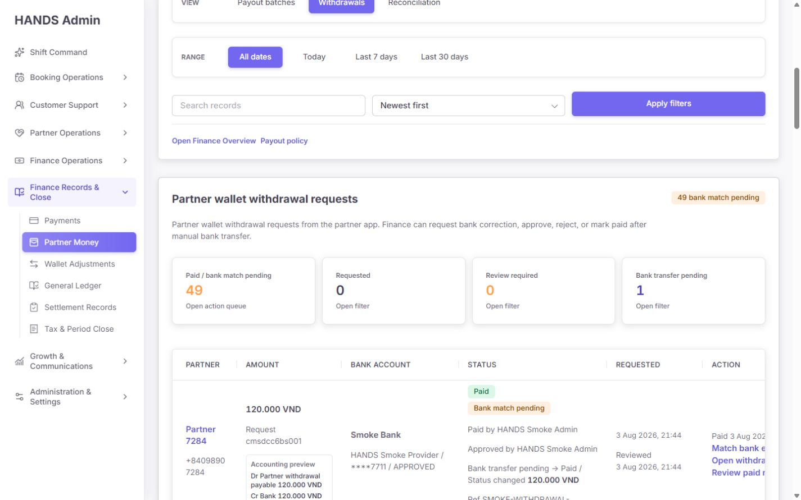

실측:

- 표 viewport 약 1,050px
- table `min-width: 1280px`
- 20행 문서 높이 약 7,053px
- DOM 약 1,447개, form 2개

운영 문제:

- Actions 열이 초기 시야에서 잘린다.
- 각 행에 `Accounting preview`가 중첩되어 스캔 밀도가 낮다.
- 금액·계좌·상태·operator evidence가 모두 세로 누적되어 한 화면에서 비교할 수 있는 행 수가 매우 적다.

수정안:

- 목록에서는 금액과 `Dr/Cr` 결과 한 줄만 표시하고 journal 상세는 row drawer로 이동한다.
- `Partner / Bank`, `Amount`, `Status / age`, `Evidence`, `Action`의 5열로 압축한다.
- Action 열을 sticky right로 유지하거나 Partner 다음 열로 옮긴다.
- 20행 페이지는 유지하되 기본 row height 목표를 104~132px로 설정한다.

### Step 5. 결과 0 필터 — 양호

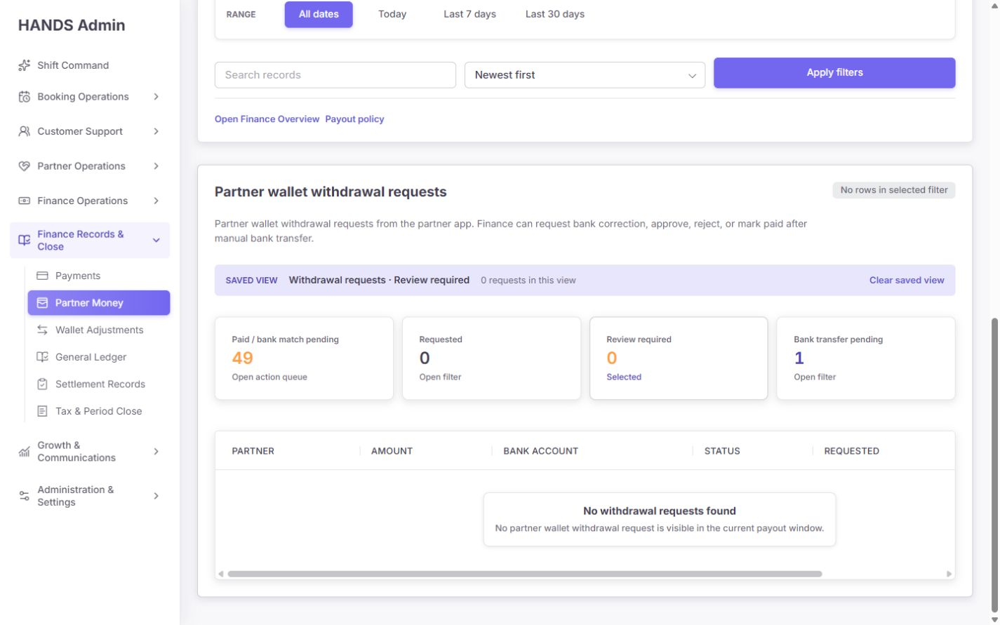

확인 결과:

- `Review required 0` saved view에 `0 requests`가 명확히 보인다.
- 동시에 전역 `Bank matches pending 49`가 사라지지 않는다.
- 이전의 “선택 결과 0 = 전체 clear” 문제는 해결됐다.

남은 소규모 문제:

- 빈 표에도 가로 scrollbar가 남아 시각적 노이즈가 된다.
- empty state 문구가 `current payout window`로 넓어 선택된 필터 조건을 직접 말하지 않는다.

수정안:

- row가 0이면 table wrapper의 x-scroll을 제거한다.
- `No withdrawal requests match “Review required” in All dates`처럼 현재 조건을 문장에 포함한다.

### Step 6. Paid withdrawal reversal — 부분 양호

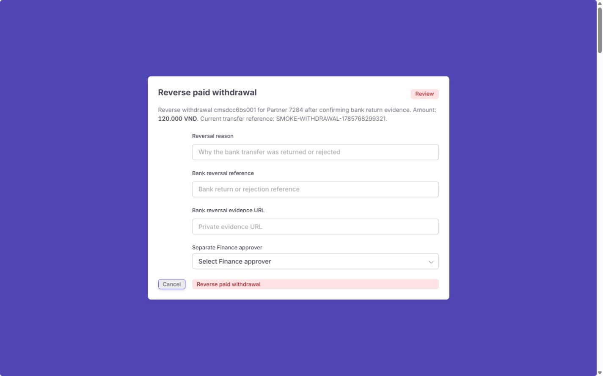

좋아진 점:

- 단일 `alertdialog`와 명시적 위험 action을 사용한다.
- reversal reason, bank reference, evidence URL, separate approver가 필수 입력이다.
- Tab 순환은 대화상자 내부에 갇혀 있어 focus trap은 작동한다.

남은 문제:

- 대화상자에 은행계좌 last4, 원 지급 actor/time, 현재 bank match 상태, posting journal 기대값이 없다.
- Escape로 닫은 뒤 focus가 `Review paid reversal`로 돌아가지 않고 `BODY`로 이동한다.
- 이 화면의 보라색 full backdrop은 다른 confirmation의 muted overlay와 강도가 다르다.

수정안:

- confirmation summary에 `Partner`, `Amount`, `Bank account`, `Paid at/by`, `Current ref`, `Bank match`, `Reversal journal preview`를 고정한다.
- query-string modal을 닫을 때 trigger ID를 URL 또는 state로 보존해 focus를 복구한다.
- backdrop token을 공통 confirmation dialog와 통일한다.

### Step 7. Reconciliation 상단 및 money flow — 데이터는 개선, 이름은 보완 필요

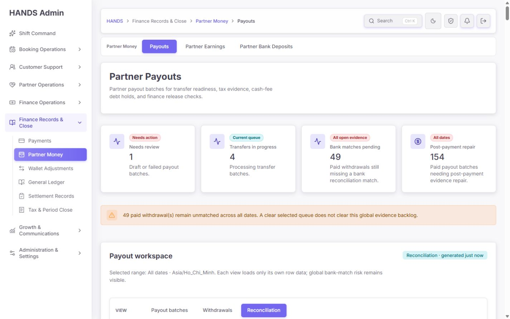

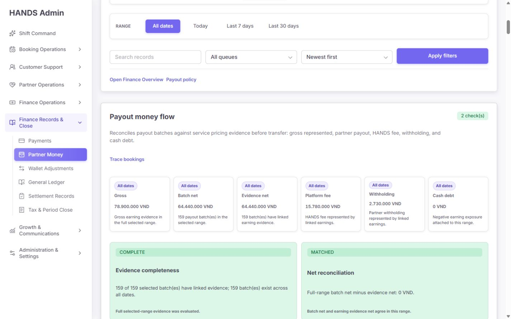

확인 결과:

- Gross 78.9m, batch net 64.44m, evidence net 64.44m, fee 15.78m, withholding 2.73m, cash debt 0이 같은 selected range를 사용한다.
- 159/159 linked earning evidence와 net MATCHED 판정은 서버 summary 계약에서 계산된다.
- `Post-payment repair 154`도 별도 서버 predicate로 계산된다. PAID batch의 transfer ref, withholding, wallet ledger amount, posted GL journal을 검사하므로 단순히 PAID 총수를 세는 코드는 아니다.

핵심 표현 문제:

- money-flow의 `Evidence complete`는 **linked earning roll-up completeness**를 의미한다.
- `Post-payment repair 154`는 **wallet-ledger / GL / transfer / withholding closeout evidence**를 의미한다.
- 둘 다 `evidence`라고만 써서 “159/159 complete인데 왜 154가 repair인가?”라는 모순을 만든다.

수정안:

- `Evidence net` → `Linked earnings net`
- `Evidence completeness` → `Earning linkage coverage`
- `COMPLETE` → `159/159 earnings linked`
- `Post-payment repair` → `Wallet / GL closeout repair`
- helper → `Paid batches missing transfer, withholding, wallet-ledger, or posted GL evidence`
- money flow panel 설명에 `This check does not validate wallet-ledger or GL posting`를 명시한다.
- `2 check(s)`는 `2 controls evaluated`로 바꾼다.

### Step 8. Reconciliation 목록 — 가장 큰 잔여 문제

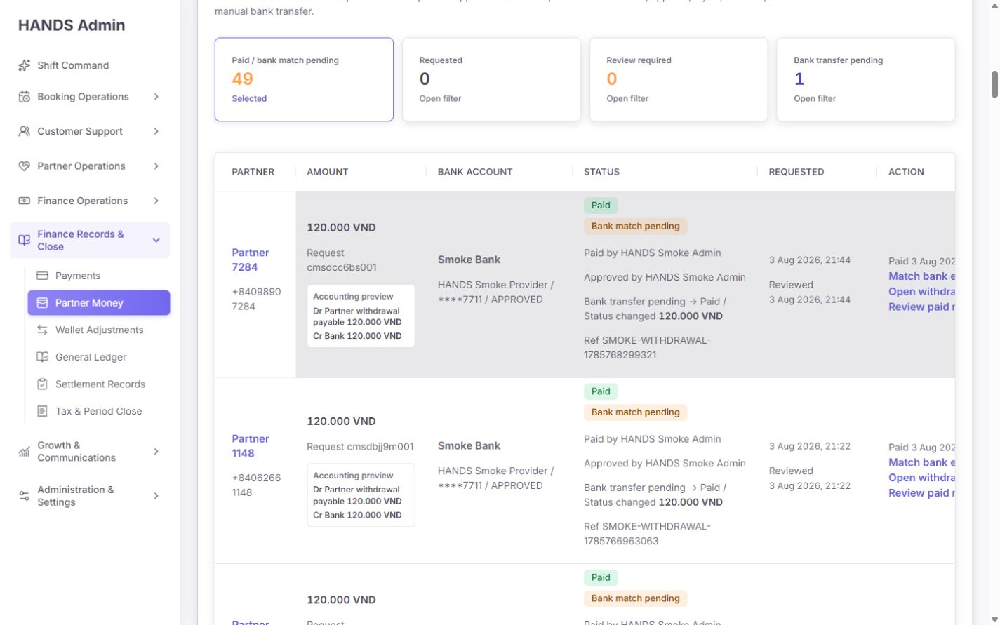

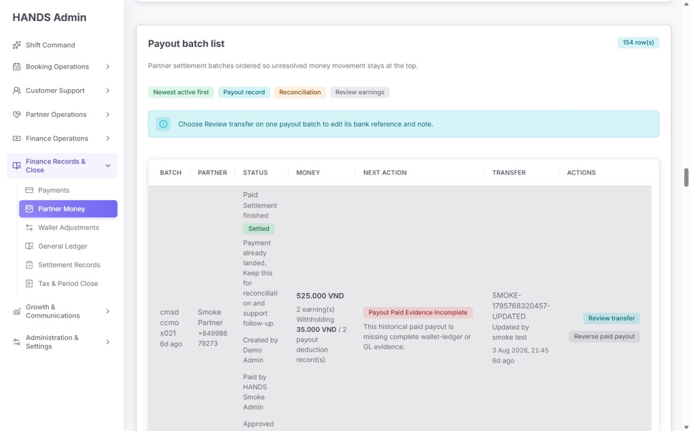

실측:

- 문서 높이: **19,928px**
- DOM node: **2,404개**
- link: **168개**
- table: **47개**
- form: 2개
- withdrawal 20행 + payout repair 20행이 동시에 렌더링됨

왜 문제가 되는가:

- 뷰를 3개로 분리한 목적이 Reconciliation에서 다시 무너진다.
- 47개 table의 대부분은 withdrawal 각 행 안의 accounting preview 중첩 table이다.
- bank unmatched를 처리하는 운영자에게 payout GL repair 154행의 첫 page까지 항상 같이 내려온다.
- payout repair를 열려는 운영자는 withdrawal 20행 전체를 먼저 지나야 한다.
- 상태 설명이 좁은 열에서 단어 단위로 줄바꿈되어 한 행이 수백 px까지 커진다.

권고 IA:

- Reconciliation 안에 두 번째 수준 segmented control을 둔다.
  1. `Overview`
  2. `Bank unmatched (49)`
  3. `Payout closeout repair (154)`
- Overview는 money-flow, 두 backlog count, oldest age, amount exposure, owner/SLA만 보여준다.
- `Bank unmatched`는 withdrawal rows만 로드한다.
- `Payout closeout repair`는 payout rows만 로드한다.
- URL 예:
  - `/payouts?view=reconciliation&queue=overview`
  - `/payouts?view=reconciliation&queue=bank-unmatched`
  - `/payouts?view=reconciliation&queue=payout-closeout-repair`
- server component 단계에서 선택되지 않은 dataset API를 호출하지 않는다.

목표 예산:

- active queue당 DOM < 1,200
- document height < 7,500px (20행 기준)
- nested table 0개
- initial visible table 1개
- 1440px에서 primary action이 가로 스크롤 없이 보임

### Step 9. Selected payout transfer editor — 부분 구현, 진입 흐름 실패

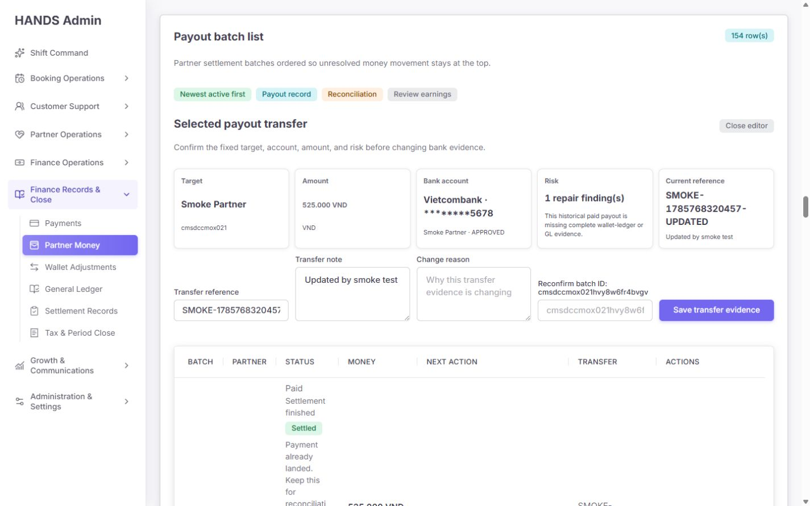

좋아진 점:

- Target, amount, bank account, risk, current reference가 고정 요약으로 추가됐다.
- expected status/ref/notes와 full ID 재확인, change reason을 전송해 optimistic concurrency와 감사 사유를 보존한다.

치명적 흐름 문제:

- reconciliation payout row에서 `Review transfer`를 누르면 URL에는 `editPayoutBatchId`가 생기지만 scrollY는 0으로 돌아간다.
- 선택 편집기 heading은 화면 상단에서 약 **8,005px 아래**에 렌더링된다.
- URL에 `withdrawalReconciliation=unmatched`도 그대로 남아 편집 대상과 무관한 withdrawal queue 문맥이 유지된다.
- 운영자는 클릭이 실패한 것으로 생각하거나 8,000px를 수동으로 내려야 한다.

수정안:

- 최선: route-controlled side drawer 또는 modal로 portal 렌더링한다.
- 대안: 편집기를 list 바로 위가 아니라 page top workspace 다음에 배치하고 URL에 `#selected-payout-transfer`를 붙이며 서버 렌더 후 focus/scroll을 보장한다.
- payout editor를 열 때 withdrawal-only query를 제거한다.
- full ID는 긴 label에 넣지 말고 monospace readonly value + copy button으로 보여주고, 확인 input label은 `Type the full batch ID to confirm`으로 짧게 한다.

### Step 10. Start processing 확인창 — 개선 필요

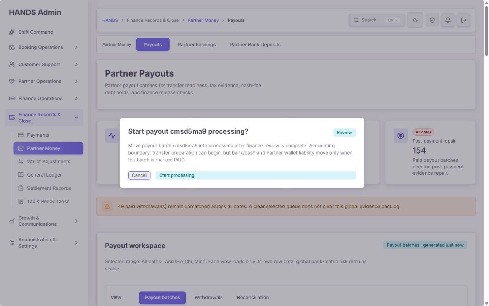

현재 확인창은 short batch ID와 일반적인 accounting boundary만 보여준다. 실제 송금 준비를 시작하기 전 확인해야 할 핵심 대상 정보가 부족하다.

필수 추가 정보:

- Partner display name / phone
- payout amount / currency
- approved bank name / masked account
- current transfer reference 또는 `Not recorded`
- linked earning count / withholding evidence
- payout hold / preflight result
- maker 역할 및 이후 별도 approver가 필요하다는 안내

문구 예시:

> Start transfer processing for Nguyen A · ₫1,250,000 to Vietcombank ****1234? No bank or wallet posting occurs yet. A different Finance approver must close the batch as PAID after transfer evidence is saved.

접근성:

- focus trap은 유지한다.
- Escape/Cancel 후 `Processing` trigger로 focus를 반드시 복구한다. 현재는 BODY로 이동한다.

### Step 11. Dark theme — 양호

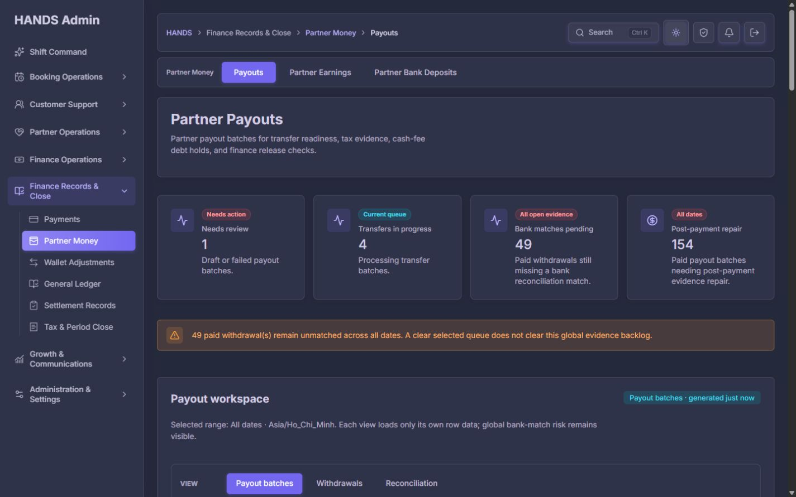

- light/dark에서 card, badge, text, border 대비가 일관적이다.
- 테마 전환으로 핵심 상태 의미가 사라지지 않는다.
- 이번 재감사 범위에서 dark theme 관련 P1 문제는 없다.

## 5. 코드·데이터 계약 감사

### 5.1 Post-payment repair 154의 실제 의미

API는 PAID batch 후보에 대해 아래 네 계층을 검사한다.

1. transfer reference 존재
2. withholding evidence 완료
3. provider wallet ledger 합계가 `-totalNetAmount`와 일치
4. `provider-payout-batch:<id>:paid` posted journal의 debit/credit이 payout amount와 일치

따라서 154는 “모든 PAID를 무조건 세는 프론트 오집계”는 아니다. 현재 데이터상 대부분의 과거 PAID batch가 신규 wallet/GL closeout evidence 계약을 충족하지 않는 것으로 해석해야 한다.

필수 운영 조치:

- UI 개선과 별개로 154건을 legacy migration/backfill 대상과 실제 anomaly로 분리한다.
- `Legacy evidence not backfilled`와 `New transaction evidence broken`를 같은 위험 badge로 처리하지 않는다.
- 생성일 또는 accounting migration cutoff를 기준으로 backlog를 두 그룹으로 분리하고 SLA를 다르게 둔다.

### 5.2 PAID reversal의 잘못된 disabled reason

서버 `withPayoutBatchPreflight`는 상태와 상관없이 release blocker 배열을 만든다. PAID에도 다음 메시지가 들어갈 수 있다.

- `PAYOUT_STATUS_NOT_PAYABLE`: PAID cannot advance to paid
- `WALLET_BALANCE_INSUFFICIENT`: current wallet balance cannot cover this batch

`riskModel.reconciliationFindings`는 PAID에서 이를 제외해 잘 분리했지만, 프론트의 `payoutActionDisabledReason(..., 'reverse')`는 `preflight.canReversePaid`가 false일 때 `preflight.blockers` 전체를 다시 출력한다.

결과적으로 reversal 메뉴에는 reversal과 무관한 지급 전 blocker가 노출된다.

수정 기준:

- API에 `reversalBlockers` 또는 action-specific `actionAvailability.reverse`를 제공한다.
- reversal blocker는 다음만 허용한다.
  - paid ledger/journal missing or mismatched
  - already reversed
  - separate approver unavailable
  - posting period closed
  - required bank return evidence missing(입력 전 안내)
- 프론트는 action별 blocker만 표시하고 generic preflight blocker를 재사용하지 않는다.

### 5.3 API failure state

현재 코드는 payout summary, payout rows, withdrawal rows, withdrawal global summary를 각각 `ok/status/data`로 분리한다. 실패 시:

- KPI는 `Unavailable`
- danger notice 노출
- 해당 행 목록을 숨기거나 action 전에 reload 요구

이전의 failure→empty/zero 축약 문제는 코드상 개선됐다. 단, 화면 상단 4개 KPI 중 일부만 실패한 partial failure 상태가 시각적으로 더 명확하도록 해당 카드에 `Data unavailable` icon/tooltip을 추가하면 좋다.

## 6. 우선순위별 수정 목록

### P0 — 없음

현재 검사에서 재무 action이 완전히 무방비로 실행되거나, API 오류가 성공으로 보이는 P0는 확인되지 않았다.

### P1 — 다음 배포 전에 수정

#### P1-1. Reconciliation 하위 queue 분리

- 현재: money-flow + withdrawal 20행 + payout repair 20행 동시 렌더
- 수정: Overview / Bank unmatched / Payout closeout repair로 분리
- 완료 기준: 선택되지 않은 dataset은 서버에서 fetch하지 않고 DOM에도 없음

#### P1-2. Transfer editor를 즉시 보이는 drawer/modal로 전환

- 현재: 클릭 후 editor가 y≈8,005, focus/scroll 없음
- 수정: route-controlled drawer 또는 top-level anchored editor
- 완료 기준: 클릭 후 1초 내 editor heading과 대상 Partner가 viewport에 보이고 focus가 heading 또는 첫 필드에 위치

#### P1-3. 1440px 표에서 primary action 노출

- 현재: batch/withdrawal Actions가 오른쪽에 가려짐
- 수정: 열 축약, action 열 재배치/sticky, nested accounting preview 제거
- 완료 기준: 1440 × 900, 기본 x-scroll 0에서 primary action이 보임

#### P1-4. Reversal action 전용 blocker 사용

- 현재: PAID reversal에 `cannot advance to paid`, wallet coverage 등 잘못된 이유 노출
- 수정: API/FE action-specific availability contract
- 완료 기준: PAID reversal disabled reason에 pre-release 코드가 한 건도 포함되지 않음

#### P1-5. Earning evidence와 wallet/GL evidence 명칭 분리

- 현재: `Evidence complete`와 `154 repair`가 모순처럼 보임
- 수정: earning linkage / wallet & GL closeout이라는 두 계층으로 명명
- 완료 기준: 운영자 5초 테스트에서 두 숫자의 차이를 설명할 수 있음

#### P1-6. 확인창 의사결정 정보 보강 및 focus return

- 현재: processing은 short ID 중심, modal close 후 BODY focus
- 수정: Partner/amount/bank/ref/risk/maker-approver 표시, trigger focus 복구
- 완료 기준: 키보드만으로 열기→검토→취소→원 trigger 복귀 가능

### P2 — 운영 효율 개선

1. Batches 기본 queue를 `Open work`로 변경하고 PAID history 분리
2. KPI 카드 전체를 queue link로 전환
3. 검색 문구와 필드를 view별로 분기
4. amount range, evidence type, age, owner, status 필터 추가
5. owner, SLA due, oldest age, amount exposure를 queue header와 row에 추가
6. `row(s)`, `batch(es)`, `earning(s)`, `check(s)` 제거
7. 빈 table horizontal scrollbar 제거
8. reversal/confirmation backdrop token 통일
9. 긴 error/detail을 한 줄 요약 + details drawer로 축약
10. legacy backfill backlog와 신규 anomaly를 구분

## 7. 권장 정보구조

```text
Partner Payouts
├─ Payout batches
│  ├─ Open work (default)
│  ├─ Needs review
│  ├─ In transfer
│  └─ Paid / archived history
├─ Withdrawals
│  ├─ Requested
│  ├─ Review required
│  ├─ Bank transfer pending
│  └─ Paid / closed history
└─ Reconciliation
   ├─ Overview
   ├─ Bank unmatched
   └─ Payout closeout repair
```

중요한 원칙은 “한 화면에 한 운영 질문”이다.

- Payout batches: 지금 송금을 준비·승인할 batch는 무엇인가?
- Withdrawals: Partner withdrawal 요청의 다음 상태 전환은 무엇인가?
- Reconciliation: 돈이 이동한 뒤 어떤 은행·원장 증빙이 불완전한가?

## 8. 문구 교체안

| 현재 | 권장 |
|---|---|
| Post-payment repair | Wallet / GL closeout repair |
| Evidence net | Linked earnings net |
| Evidence completeness | Earning linkage coverage |
| 2 check(s) | 2 controls evaluated |
| 154 row(s) | 154 payout batches |
| 159 batch(es) | 159 payout batches |
| 3 earning(s) | 3 earnings |
| Blocking reasons for PAID batch | Reconciliation findings for paid batch |
| Review transfer (PAID) | Repair transfer evidence |
| Review transfer (open) | Review transfer |
| No blocking reason is preventing the next finance action. | Ready for the next finance action. |
| All queues | Open work / All records 분리 |

영문 운영 UI를 유지하더라도 괄호형 복수형은 제거하고, 숫자에 맞춘 자연어 또는 항상 복수 가능한 명사(`records`, `controls`)를 사용한다.

## 9. 성능·복잡도 결과

### 확인된 개선

기존 verification 기록 기준 기본 payout 화면은 다음과 같이 줄었다.

- document height: 12,415 → 약 5,295
- DOM: 2,188 → 약 1,392
- form: 11 → 2

이는 반복 row form 제거와 view 분리 효과다.

### 남은 회귀

Reconciliation에서는 다시 다음까지 증가한다.

- document height: 19,928
- DOM: 2,404
- tables: 47
- links: 168

따라서 “페이지 전체가 개선됐다”가 아니라 “Batches 기본 화면은 개선됐지만 Reconciliation에서 복잡도가 이동했다”가 정확한 결론이다.

성능 수정 순서:

1. reconciliation dataset 분리
2. nested accounting table 제거
3. row detail lazy drawer
4. active queue만 fetch
5. 필요하면 table virtualization 검토 — 20행 분리가 제대로 되면 먼저 도입할 필요는 없음

## 10. 접근성·안전성 결과

통과:

- reversal dialog의 `alertdialog`
- 입력 label과 required 상태
- dialog focus trap
- destructive action의 별도 확인
- server preflight와 optimistic concurrency fields
- 실패 데이터의 fail-closed notice

보완:

- dialog close 후 trigger focus return
- selected editor open 후 focus/scroll
- phase별 aria-label
- 길게 잘린 status/error의 accessible details 연결
- Actions가 가로 scroll 뒤에만 존재하지 않도록 시각·키보드 접근 경로 개선

## 11. 자동 검증 결과

| 검증 | 결과 |
|---|---|
| Admin payout 관련 Vitest | 15 files, 109 tests 통과 |
| API earnings/admin 관련 Vitest | 2 files, 655 tests 통과 |
| Admin Web typecheck | 통과 |
| API typecheck | 통과 |
| 브라우저 console error/warning | 0건 |
| Impeccable detector | 글로벌 CSS의 일반 side-border 패턴 warning만 탐지; payout 화면 직접 P1 근거로 사용하지 않음 |

테스트가 통과한 것은 로직 회귀가 없다는 좋은 신호지만, 현재 실패 대부분은 통합 UX 조건이다. 다음 자동화가 추가돼야 한다.

- 1440px에서 primary action visible assertion
- `Review transfer` 후 editor in-viewport/focus assertion
- dialog close 후 trigger focus assertion
- reconciliation subqueue별 non-selected API not-called assertion
- PAID reversal reason에 pre-release blocker code가 없다는 contract test
- `Earning linkage complete`와 `Wallet/GL repair` copy contract test

## 12. Codex 수정 순서 제안

### 1차 — 데이터 의미와 위험 메시지

1. reversal action-specific blockers 추가
2. earning linkage / wallet-GL closeout 명칭 분리
3. legacy backfill과 신규 anomaly 분류

### 2차 — Reconciliation 구조

1. 하위 queue URL 모델 추가
2. active dataset만 fetch
3. Overview 요약 화면 작성
4. withdrawal/payout repair table 분리

### 3차 — 1440px 작업표와 editor

1. 표 열 축약·primary action 이동
2. accounting preview drawer화
3. route-controlled editor drawer
4. focus·scroll·query cleanup

### 4차 — 확인창·문구·운영 메타

1. Partner/amount/bank/ref/risk summary
2. focus return
3. owner/SLA/age 추가
4. pluralization 및 empty-state 정리

## 13. 최종 완료 조건

다음 조건이 모두 충족되면 재감사에서 통과로 볼 수 있다.

- 1440 × 900에서 주요 action이 가로 스크롤 없이 보인다.
- Reconciliation 기본 문서 높이가 7,500px 이내이고 table이 한 개만 보인다.
- active reconciliation queue 외 dataset API를 호출하지 않는다.
- `Review transfer` 직후 editor가 viewport 안에 있고 focus가 이동한다.
- dialog 취소/닫기 후 원 trigger로 focus가 돌아간다.
- PAID reversal 불가 사유에 지급 전 blocker가 없다.
- money-flow earning linkage와 wallet/GL closeout repair가 서로 다른 용어로 보인다.
- confirmation에 Partner, amount, bank, ref, risk, maker/approver 정보가 있다.
- default Batches는 open work를 우선하고 paid history는 분리된다.
- 관련 unit/integration/typecheck와 1440px browser test가 모두 통과한다.

## 14. 결론

이번 수정은 형식적인 변화가 아니라 실제 개선이다. 특히 데이터 실패를 숨기지 않는 계약, 범위가 맞는 money-flow, 반복 reversal form 제거, 세 개 업무 뷰 분리는 잘됐다.

하지만 운영자의 실제 동선에서는 아직 “분리한 목록을 Reconciliation에서 다시 합침”, “클릭한 편집기가 8,000px 아래에 열림”, “1440px에서 Actions가 가려짐”이라는 큰 문제가 남아 있다. 다음 수정은 카드나 색상을 더 다듬기보다 **한 화면 한 작업, action-specific risk, 즉시 보이는 편집기, earning과 ledger 증빙의 명확한 용어 분리**에 집중해야 한다.
