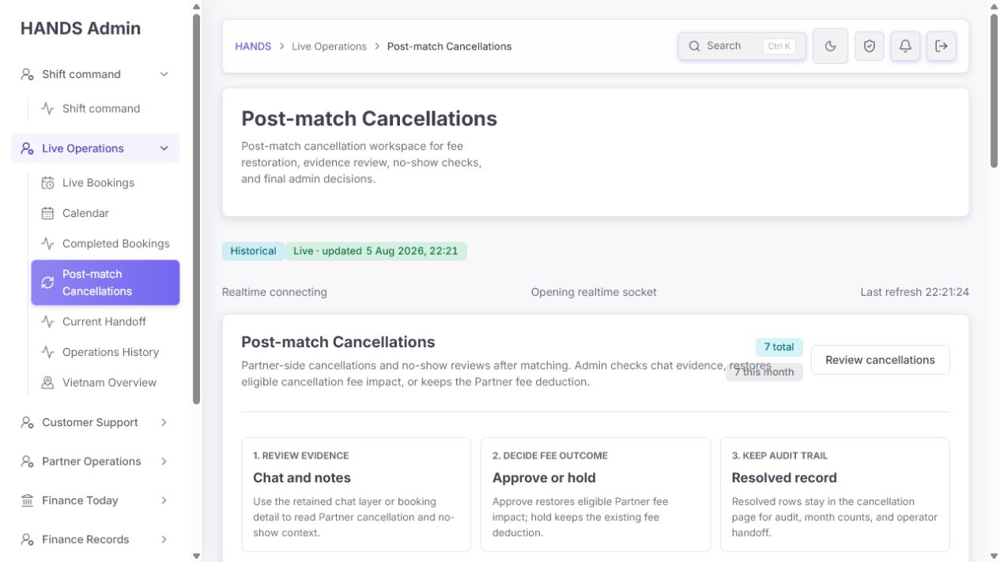
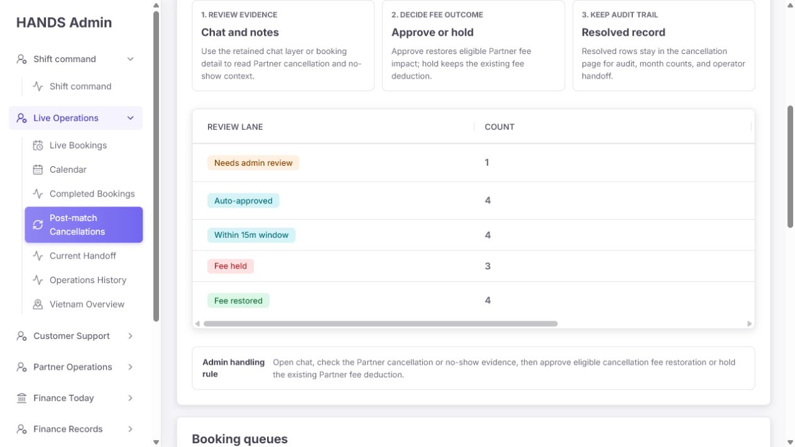
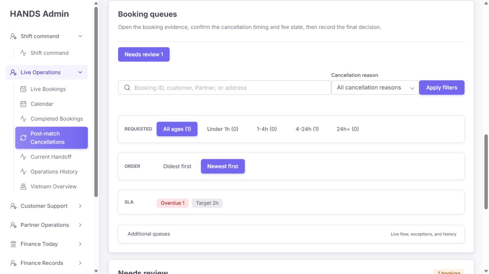
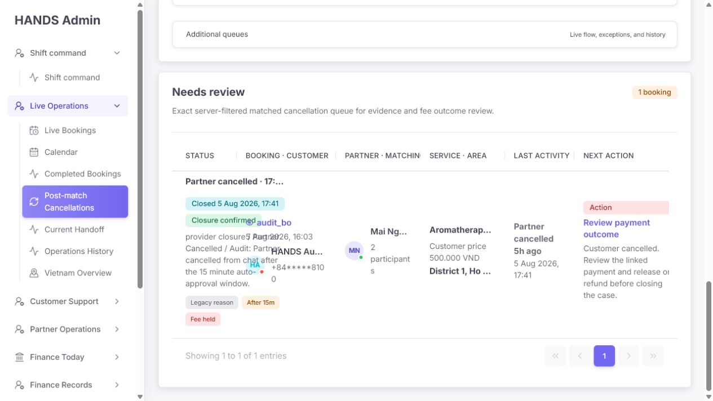
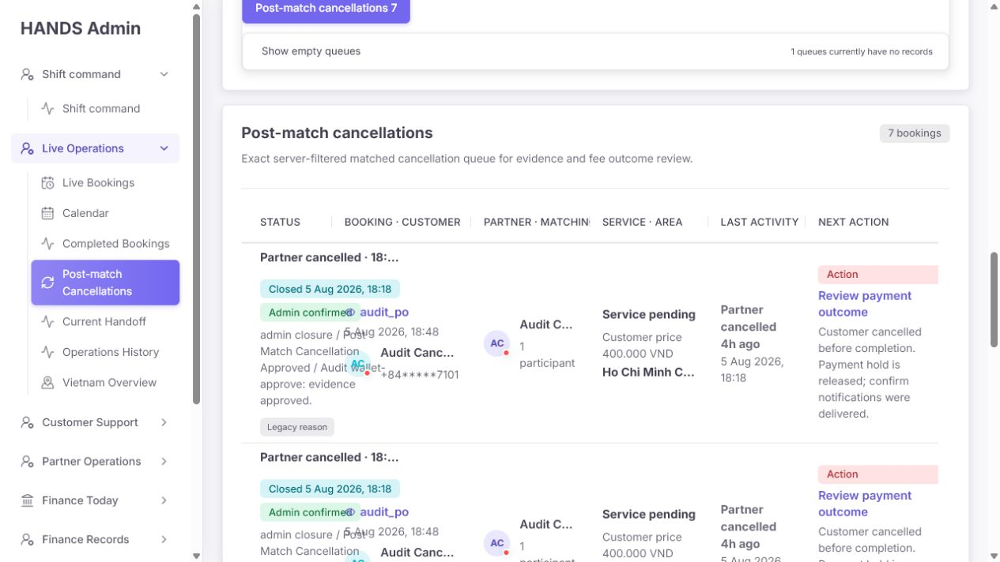
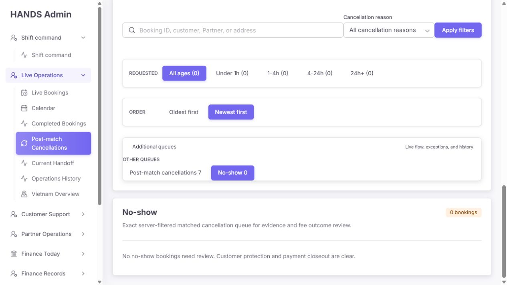
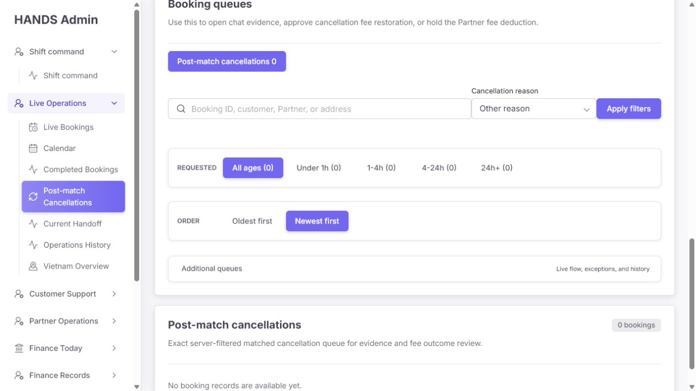
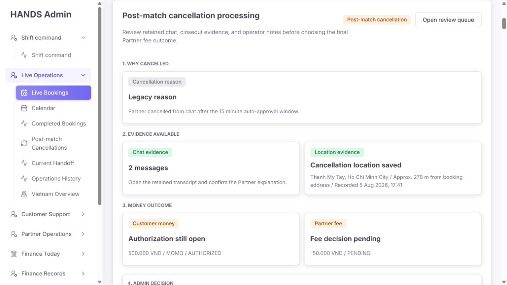
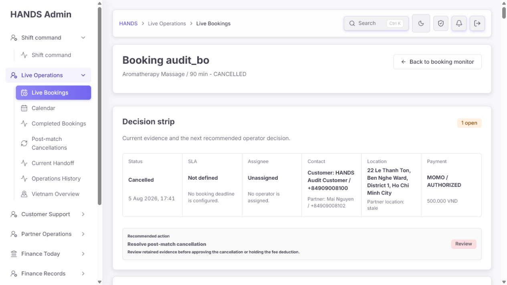

# Post-match Cancellations 운영자 관점 심층 감사

- 감사 대상: `http://localhost:3101/bookings/post-match-cancellations`
- 감사 일시: 2026-08-05 (Asia/Bangkok, 화면 표기는 Asia/Ho_Chi_Minh)
- 실제 확인 상태: 기본 Needs review, 전체 Post-match cancellations, No-show 빈 큐, 검색 결과 없음, 취소 사유 필터 결과 없음, 상세 결정 패널과 복귀 동선
- 실제 화면 크기: 1280 × 720px, 왼쪽 내비게이션이 열린 일반 노트북 환경
- 코드 확인 범위: Admin route/load plan, summary/list API query, queue/filter/list 컴포넌트, post-match summary board, 상세 화면 딥링크, 공용 operations table CSS
- 주의: 화면의 예약과 건수는 로컬 감사 fixture이다. 숫자의 절대값보다 큐 분류, 집계 의미, 문구, 작업 동선, 레이아웃을 평가했다.

## 1. 결론

현재 화면은 상세 화면의 증거 검토와 `Waive / Keep Partner fee deduction` 결정 기능까지 연결되어 있어 핵심 업무 기능은 존재한다. 그러나 목록 화면은 운영자에게 **무엇이 오늘의 처리 대상인지, 어떤 증거가 있고, 돈 상태가 무엇이며, 지금 어떤 결정을 내려야 하는지**를 정확히 전달하지 못한다.

가장 먼저 고칠 문제는 다음 다섯 가지다.

1. 기본 `Needs review`가 운영 backlog 전체가 아니라 숨겨진 `Today` 범위로 조회된다. 어제 이전의 미결 건이 기본 화면에서 보이지 않을 수 있다.
2. 목록은 `Partner cancelled`라고 표시하면서 다음 행동은 `Customer cancelled / Review payment outcome`이라고 안내한다. 취소 주체와 작업 목적이 서로 모순된다.
3. `Auto-approved` 건수는 실제 자동 처리 여부가 아니라 “승인 상태이면서 자동 승인 조건에 해당”하는지를 추론한 값이다. 화면에 `Admin confirmed`라고 보이는 행도 Auto-approved로 집계될 수 있다.
4. 1280px에서도 행 텍스트가 서로 겹치고, 첫 검토 대상은 페이지 상단에서 약 1,900px 아래에 있다.
5. 목록은 `Target 2h / Overdue`를 보여주지만 상세는 같은 예약에 `SLA Not defined`라고 표시하고, 뒤로 가기는 Post-match 큐가 아닌 Live Bookings로 이동한다.

따라서 이 페이지는 색상이나 카드 장식보다 먼저 **backlog 범위, 집계 정의, 큐별 action, SLA 기준**을 사실에 맞게 고쳐야 한다. 그 다음 실제 검토 행을 첫 화면으로 올리고, 증거·금액·결정을 한 행에서 스캔할 수 있게 재구성해야 한다.

## 2. 캡처 증거

### 첫 화면: 실제 검토 대상보다 설명 카드가 먼저 보임



- `Historical`, `Live · updated`, `Realtime connecting`이 동시에 나타난다.
- 페이지 제목과 요약 카드 제목이 같은 `Post-match Cancellations`로 반복된다.
- 현재 페이지로 다시 이동하는 `Review cancellations` 버튼은 기본 화면에서 실질적인 행동이 아니다.

### 집계 표: 3열 표인데 1,380px 폭을 가져 handling rule이 화면 밖으로 나감



실측값은 다음과 같다.

- viewport: 1280 × 720px
- 집계 표 컨테이너: 약 907px
- 집계 표 실제 폭: 1,380px
- 따라서 `Handling Rule` 열은 가로 스크롤을 해야만 읽을 수 있다.

### 기본 큐와 필터



- 전용 페이지인데 핵심 큐는 `Needs review 1` 하나만 바로 보인다.
- `Post-match cancellations 7`과 `No-show 0`은 `Additional queues → Other queues → Show empty queues` 안에 숨는다.
- `Requested`, `Newest first`, `Target 2h`가 보이지만 어떤 시각을 기준으로 하는지 실제 데이터 처리와 일치하지 않는다.

### 기본 Needs review 행: 내용이 겹쳐 판단할 수 없음



- 상태 설명, 예약 ID, 고객명, Partner, 서비스가 서로 겹친다.
- `Partner cancelled`와 `Review payment outcome / Customer cancelled`가 한 행에서 모순된다.
- 현재 큐의 핵심인 채팅 메시지 수, 위치 증거, payment authorization, Partner fee 금액은 보이지 않는다.

### 전체 취소 기록: 여러 예약 ID가 모두 `audit_po`로 보임



- `shortId(..., length=8)`가 앞부분만 표시해 audit fixture 여러 건을 구분하지 못한다.
- 승인/보류/미결 행이 섞여도 모든 CANCELLED 행의 CTA가 `Review payment outcome`이다.
- `Admin confirmed` 행도 상단 Auto-approved 수치에 포함될 수 있다.

### No-show 빈 상태



- 빈 상태 자체는 명확하지만, No-show가 핵심 큐가 아니라 부가 큐로 취급된다.
- 설명은 “still needing review”라고 하지만 API는 `status = NO_SHOW`만 검사하므로 실제로 미결 건만 보장하지 않는다.

### 취소 사유 필터: 활성화됐지만 초기화 방법이 없음



- `Other reason`이 활성 상태인데 `Clear` 또는 `Reset filters`가 없다.
- 결과 문구 `No booking records are available yet.`는 데이터가 없는 것처럼 말한다. 실제로는 현재 필터와 일치하는 행이 없는 것이다.
- 목록의 7건은 모두 `Legacy reason`으로 보이지만 필터 옵션에는 Legacy/Unknown이 없다.

### 상세 결정 패널: 핵심 증거와 최종 행동은 잘 구성됨



- 취소 사유 → 채팅/위치 증거 → 고객 돈/Partner fee → Admin decision 순서는 적절하다.
- 목록에서도 이 모델의 핵심 값을 요약해 보여주면 운영 판단이 크게 빨라진다.

### 상세 상단: 목록과 SLA가 다르고 복귀 동선이 잘못됨



- 목록: `SLA Overdue 1 · Target 2h`
- 상세: `SLA Not defined · No booking deadline is configured.`
- breadcrumb와 왼쪽 활성 메뉴는 `Live Bookings`, 뒤로 가기 링크도 `/bookings`이다.
- 운영자는 Post-match review context와 필터 위치를 잃는다.

## 3. 잘된 점

- 기본 진입 view가 전체 기록이 아니라 `Needs review`인 방향은 맞다.
- 목록은 서버 필터와 서버 페이지네이션을 사용한다. 대량 데이터를 클라이언트에서 다시 분류하지 않는다.
- 검색은 Booking ID, 고객/Partner ID·이름·전화번호, 주소까지 서버에서 찾는다.
- 전화번호는 목록에서 마스킹되어 있다.
- 테이블 헤더는 시맨틱 column header이고, 가로 스크롤 영역은 `role=region`, `tabIndex=0`, 명확한 aria-label을 가진다.
- 취소 사유 select에는 연결된 label이 있고, 큐 링크에는 건수를 포함한 접근성 이름이 있다.
- 상세 딥링크 `#booking-post-match-cancellation-decision`은 실제 존재하며 올바른 결정 패널로 이동한다.
- 상세 패널은 구조화된 사유, 채팅, 위치, 고객 결제, Partner fee와 두 개의 최종 결정을 한 흐름으로 제공한다.
- 목록에서 고위험 금액 결정을 즉시 실행하지 않고 상세 증거 검토 후 처리하게 한 점은 안전하다.
- 이번 확인에서 브라우저 console error는 발견되지 않았다.
- 새 UI 라이브러리 없이 기존 `AdminTablePanel`, `AdminSegmentedControl`, `StatusBadge`, `AdminDataTable`과 기존 상세 decision model을 재사용해 개선할 수 있다.

## 4. 우선순위별 문제와 수정 요건

### P0-1. 기본 미결 큐가 숨겨진 Today 범위라 오래된 backlog를 놓칠 수 있음

**문제**

운영 큐의 가장 중요한 보장은 “아직 처리하지 않은 건은 날짜가 바뀌어도 남는다”이다. 현재 기본 `manual-decision` 화면은 미결 backlog 전체가 아니라 오늘 범위만 조회한다. 화면에는 기간 컨트롤도 보이지 않아 운영자가 이 제한을 알 수 없다.

**코드 원인**

- route load plan은 `dateRange`가 없으면 항상 `today`를 사용한다 (`booking-monitor-route-load-plan.ts:40`, `:64`).
- `bookingListUsesDateRange`는 `kind !== 'all'`이면 모든 Completed/Post-match view에 날짜 범위를 적용한다 (`booking-monitor-route-load-plan.ts:145`).
- 반면 operations table의 날짜 컨트롤은 `all` 등 일부 view가 아니면 숨긴다 (`booking-monitor.tsx:582-585`).
- API 날짜 조건은 cancellation decision 시각 하나가 아니라 opened/created/updated/matched/closed/expires 중 하나라도 오늘이면 포함한다 (`admin.service.ts:30531-30556`).

**운영 위험**

- 어제 발생해 아직 결정되지 않은 cancellation이 오늘 기본 큐에서 사라질 수 있다.
- 반대로 오래된 취소라도 오늘 다른 필드가 업데이트되면 오늘 건처럼 들어올 수 있다.
- `Needs review 1`을 전체 미결 건수로 오해하게 된다.

**수정 방법**

- `manual-decision`은 날짜 범위를 적용하지 않는 **전체 open backlog**로 만든다.
- `No-show review`도 실제 미결 condition이 있는 open queue라면 날짜로 숨기지 않는다.
- resolved/all records에만 `Decision period`를 보이게 하고 기본 30일을 사용한다.
- 기간 기준은 `COALESCE(closedAt, updatedAt, createdAt)`로 만든 현재 `decisionAt` 하나로 통일한다. 과거 건의 오늘 수정 여부가 필요하면 별도 `Updated today` 필터로 분리한다.

**완료 기준**

- 전날 이전의 pending fixture가 기본 Needs decision 큐에 계속 보인다.
- resolved record의 기간 필터는 decisionAt만 기준으로 한다.
- 화면에 표시되지 않는 날짜 필터가 API query에 암묵적으로 적용되지 않는다.

### P0-2. 목록의 취소 주체와 다음 행동이 서로 모순됨

**화면 증거**

한 행에서 다음이 동시에 보인다.

- 상태: `Partner cancelled`
- reason: `Partner Cancelled / ...`
- next action: `Review payment outcome`
- helper: `Customer cancelled. Review the linked payment...`

운영자는 Partner fee를 승인/보류해야 하는데 customer cancellation/payment release 문제로 안내받는다.

**코드 원인**

- `bookingMonitorNextAction`은 현재 route/view를 받지 않고 booking status만 사용한다 (`booking-monitor-next-action-label.ts:5`).
- `CANCELLED`의 기본 label은 `Review payment outcome`이다 (`...:42`).
- 공용 `bookingNextActionCopy`는 모든 CANCELLED를 `Customer cancelled`로 하드코딩한다 (`lib/booking-next-action-copy.ts:20`).
- operations row는 해당 공용 값을 그대로 렌더링한다 (`booking-monitor-list-section.tsx:744-752`).

**수정 방법**

- `bookingMonitorNextAction`에 현재 `view` 또는 명시적인 `workspace kind`를 전달한다.
- post-match cancellation이면 status 일반 규칙보다 구조화된 cancellation resolution을 먼저 사용한다.
- 권장 action:
  - 미결: `Review cancellation decision`
  - 승인 완료: `View restored fee record`
  - 보류 완료: `View held fee record`
  - No-show 미결: `Review no-show outcome`
- helper는 실제 facts를 조합한다. 예: `Partner cancelled 48m after match. Fee decision pending; customer authorization is still open.`

**완료 기준**

- Partner cancellation fixture에서 `Customer cancelled` 문구가 0건이다.
- CTA, helper, 상세 anchor가 같은 결정을 가리킨다.
- resolved 행은 처리하라는 danger action 대신 결과 확인용 neutral action을 보인다.

### P0-3. `Auto-approved`가 실제 자동 처리 건수를 의미하지 않음

**문제**

화면은 `Auto-approved 4`라고 단정하지만 API는 실제 처리 주체나 audit action을 확인하지 않는다. 단지 `resolution = approved`이고 `autoApprovalEligible = true`이면 Auto-approved로 센다.

**코드 원인**

- `autoApprovedCount` 조건은 `resolution = 'approved' AND autoApprovalEligible`뿐이다 (`admin.service.ts:12232-12234`).
- `resolution`은 구조화된 decision 필드가 아니라 `closedReason`에 `approved/held/hold` 문자열이 있는지, earning status/amount가 어떤지로 추론한다 (`admin.service.ts:30276-30284`).
- `autoApprovalEligible`은 reason code가 `NULL`인 legacy 기록도 허용한다 (`admin.service.ts:30286-30302`).
- 실제 화면에는 `Admin confirmed / Post Match Cancellation Approved` 행이 존재한다.

**추가 문구 오류**

- `Within 15m window`도 단순 시간 조건이 아니다. CANCELLED, matched, 특정 reason, requiresAdminReview false까지 모두 만족한 “자동 승인 가능” 수치다.
- `Fee held`는 final held decision만 세지 않고 earning이 non-cancelled/non-zero인 pending 건도 포함한다 (`admin.service.ts:12236-12240`).

**수정 방법**

- 실제 자동 처리 audit/action 또는 구조화된 `resolutionSource: AUTO | ADMIN`을 source of truth로 사용한다.
- legacy/free-text 추론은 `Unknown source`로 표시하고 자동 처리 건수에 포함하지 않는다.
- metric을 서로 배타적이고 운영적으로 설명 가능한 값으로 정리한다.
  - `Needs decision`
  - `Auto-resolved`
  - `Admin approved`
  - `Admin kept fee`
  - `Unknown / legacy`
- `Within 15m window`가 필요하면 실제 `minutesAfterMatch <= 15`만 세거나, 현재 조건을 유지한다면 `Auto-approval eligible`로 정확히 이름 붙인다.

**완료 기준**

- Admin-confirmed fixture는 Auto-resolved에 포함되지 않는다.
- reason/source가 없는 legacy 기록은 Unknown으로 집계된다.
- metric 정의가 API unit test 이름과 UI tooltip에 동일하게 적힌다.

### P0-4. 1280px 화면에서 표가 겹쳐 읽을 수 없음

**화면/측정 증거**

- 1280px viewport, sidebar open에서 operations table 영역은 약 907px이다.
- 표는 약 892px 고정 레이아웃 안에 여섯 열과 내부 최소 폭을 밀어 넣는다.
- 상태, 예약/고객, Partner, 서비스 값이 인접 열 위로 겹친다.
- 모바일/card 전환은 viewport가 1100px 이하일 때만 작동한다. 1280px에서는 sidebar를 제외한 실제 container가 좁아도 desktop table이 유지된다.

**코드 원인**

- operations table은 `table-layout: fixed`, 최소 폭 820px이다 (`globals.css:4121-4124`).
- 열 최소 폭 합은 860px이고 next action 내부도 별도 `min-width:160px`이다 (`globals.css:4131-4135`, `:4229-4262`). padding과 내부 컴포넌트 폭까지 감당하지 못한다.
- card layout breakpoint는 viewport `max-width:1100px`이다 (`globals.css:17622`).

**수정 방법**

- `.admin-table-scroll` 또는 table panel에 container query를 적용해 실제 컨테이너가 약 1,050~1,100px 미만이면 카드형 행으로 전환한다.
- 또는 이 전용 페이지에서는 처음부터 2행 operator record 형태를 사용한다.
- 단순 글자 크기 축소, ellipsis 확대, `overflow:hidden`으로 값을 숨기는 방식은 금지한다.
- 긴 closure note 전문은 목록에서 제거하고, `After 15m`, `Legacy`, `Fee pending`처럼 결정 facts만 chip으로 남긴다.

**완료 기준**

- 1280×720/sidebar open에서 텍스트 겹침 0건.
- 1024px desktop pointer에서 모든 핵심 값과 CTA가 보인다.
- 1440px 이상에서는 6열 또는 더 간결한 5열 표가 자연스럽게 유지된다.

### P0-5. 목록 SLA, 상세 SLA, 복귀 context가 서로 다름

**화면 증거**

- 목록: `Overdue 1`, `Target 2h`
- 상세: `SLA Not defined`, `No booking deadline is configured.`
- 상세 breadcrumb/active nav/back link: Live Bookings

**코드 원인**

- post-match review list에는 cancellation review SLA policy가 존재하고 `decisionAt`을 기준으로 overdue를 계산한다 (`admin.service.ts:30136-30146`, `:30161-30165`).
- 상세 Decision strip은 booking deadline 모델을 보여주므로 cancellation review SLA를 알지 못한다.
- 상세 toolbar는 `href="/bookings"`로 하드코딩되어 있다 (`booking-command-briefing-sections.tsx:133-142`).
- 상세의 `Open review queue`도 항상 `view=post-match-cancellations`로 돌아가며 원래 `manual-decision`, 검색, age, sort를 보존하지 않는다 (`booking-outcome-review-panel.ts:389-394`).

**수정 방법**

- cancellation detail에서는 generic booking deadline 대신 `Cancellation review SLA`를 표시한다.
- list → detail 링크에 `returnTo` 또는 안전하게 화이트리스트된 query context를 전달한다.
- back link, breadcrumb, active nav는 `Post-match Cancellations > Needs decision`을 유지한다.
- 상세 처리 후 원래 필터와 해당 row anchor로 돌아간다.

**완료 기준**

- 같은 예약의 list/detail SLA 값과 기준 시각이 동일하다.
- 뒤로 가기 후 view, search, reason, age, sort, page가 보존된다.
- 처리 완료 후 다음 미결 건을 연속해서 검토할 수 있다.

### P1-1. 실제 작업 행이 첫 화면에서 너무 멀리 있음

실측상 첫 operations panel은 문서 상단에서 약 1,912px, 첫 table row는 약 2,035px 아래에 있다. 720px 높이 화면에서는 최소 2~3번 스크롤해야 첫 건을 본다.

원인은 다음 정적 정보가 모두 큐 앞에 있기 때문이다.

- H1 page header
- data/realtime status
- 동일 제목의 summary card
- 3단계 decision flow
- 5행 metric table
- Admin handling rule
- filter/age/sort/SLA/additional queue panel

**수정 방법**

- 첫 화면 순서를 `페이지 상태 → 핵심 큐 → 필터 → 첫 결과`로 바꾼다.
- 3단계 안내와 handling rule은 `How to decide` disclosure 또는 Operations Policy로 이동한다.
- metric table은 4~5개의 compact stat/chip으로 바꾸고, 상세 정의만 tooltip/도움말에 둔다.
- `Review cancellations` 자기 링크는 제거하거나 `Jump to needs decision` anchor로 바꾼다.

### P1-2. 3열 집계 표가 9열 booking table의 전역 최소 폭을 상속함

`BookingPostMatchCancellationsSection`은 3열 metric table에 `vuexy-booking-table` class를 사용한다. 공용 CSS는 해당 class에 큰 booking table 폭을 부여한다.

- 공용 rule: `.booking-monitor .admin-table-scroll .table { min-width: 1380px }` (`globals.css:4018-4024`)
- booking table rule: `min-width:1480px` (`globals.css:4110-4118`)
- 결과: 3열 표의 handling rule이 907px container 밖으로 밀림.

**수정 방법**

- metric table에서 `vuexy-booking-table` class를 제거하고 generic compact table을 재사용한다.
- 또는 `booking-post-match-summary-table` 전용 class에 `min-width:0; width:100%; table-layout:auto`를 부여한다.
- 5행 table 자체가 필요하지 않으면 metric chips + 짧은 정의 disclosure가 더 작다.

### P1-3. 핵심 세 큐가 direct tab이 아니고 일반적인 “Other queues” 안에 숨음

전용 페이지에서 `Needs review`, `All records`, `No-show`는 모두 핵심 navigation이다. 현재 알고리즘은 첫 visible option 하나만 primary로 두고 나머지를 generic additional group으로 보낸다 (`booking-monitor-filters-section.tsx:115-136`). 그 결과:

- All records는 Additional queues → Other queues
- No-show 0은 Additional queues → Show empty queues → Other queues
- 안내 `Live flow, exceptions, and history`는 이 페이지의 업무와 관계가 없다.

**수정 방법**

- 이 route에서는 세 tab을 항상 직접 표시한다.
  - `Needs decision 1`
  - `All cancellation records 7`
  - `No-show review 0`
- 0건이어도 no-show 상태는 운영자가 확인해야 하므로 숨기지 않는다.
- generic `Additional queues` 컴포넌트는 live route에만 사용한다.

### P1-4. 취소 사유 필터는 현재 데이터의 Legacy reason을 찾을 수 없고 reset도 없음

**코드 원인**

- filter options에는 5개 구조화 reason만 있다 (`booking-post-match-cancellation-reason.ts:38-67`).
- 구조화 reason이 없으면 화면에는 `Legacy reason`이라고 표시한다 (`...:117-124`).
- `Clear` 링크는 `searchQuery`가 있을 때만 렌더링된다 (`booking-monitor-filters-section.tsx:190-194`).
- 따라서 reason만 선택한 상태에서는 초기화 control이 없다.

**수정 방법**

- filter에 `Legacy / unknown`을 추가하고 API에서 reason code NULL 조건을 지원한다.
- search, reason, age, SLA, sort, period 중 하나라도 기본값이 아니면 `Reset filters`를 항상 표시한다.
- 현재 filter를 chip으로 요약한다. 예: `Reason: Other ×`.
- 빈 결과 문구에 원인을 넣는다: `No cancellation records match Reason: Other. Reset filters.`

### P1-5. 검색·사유·age가 global summary와 큐 건수까지 0으로 바꿔 scope를 오해시킴

검색어 또는 reason을 적용하면 상단의 `7 total / 7 this month / Needs review 1`이 모두 0으로 바뀐다. 필터된 수치라는 설명은 없다.

**코드 원인**

- summary request에도 `dateRange`, `q`, `age`, `cancellationReason`을 그대로 전달한다 (`booking-monitor-route-load-plan.ts:34-50`).
- board와 queue tabs는 이 summary 값을 global queue count처럼 표시한다 (`booking-monitor.tsx:302-307`).

**수정 방법**

- 상단 queue count는 search/reason/age와 분리해 전체 open backlog를 유지한다.
- 결과 panel에서만 `1 of 7 matching current filters`처럼 filtered count를 표시한다.
- 만약 summary도 필터를 따르게 유지한다면 제목을 `Filtered summary`로 바꾸고 active filters를 바로 옆에 보여준다.

### P1-6. `Requested` age filter와 실제 SQL 기준이 일관되지 않음

operations page의 age count는 `decisionAt`으로 계산하지만, 사용자가 age filter를 선택하면 facts CTE 앞단에서 `booking.createdAt` 조건을 적용한다.

- UI 도움말/label: `Queue age is measured from booking request creation time`, `Requested` (`booking-monitor-filters-section.tsx:241-250`).
- operation count: `occurredAt = decisionAt` (`admin.service.ts:30136-30146`, `:12060-12069`).
- selected age filter: `booking.createdAt` (`admin.service.ts:30415-30426`).

따라서 chip에 보이는 건수와 chip을 눌렀을 때 나오는 결과가 다른 기준을 사용할 수 있다.

**수정 방법**

- post-match route의 age는 모두 `decisionAt`으로 통일한다.
- label을 `Decision age` 또는 `Waiting since cancellation`으로 바꾼다.
- 기본 정렬은 open `Needs decision`에서는 `Longest waiting`, resolved records에서는 `Most recently decided`로 분리한다.

### P1-7. 목록에 결정에 필요한 증거와 돈 상태가 없음

현재 목록은 서비스/주소/앱 presence/participant count를 보여주지만 다음 핵심 facts를 숨긴다.

- 취소가 match 후 몇 분에 발생했는가
- 구조화 reason과 detailed note가 있는가
- chat message 수
- cancellation location이 저장됐는가
- customer payment method/status/amount
- Partner fee amount와 resolution pending/approved/held
- review SLA와 assignee

이 값은 이미 상세 모델과 `AdminBooking` 데이터에 있으므로 새 backend table이나 새 dependency가 필요하지 않다.

**권장 열**

| 열 | 운영자가 답해야 하는 질문 |
|---|---|
| Priority | SLA가 넘었는가, 얼마나 기다렸는가? |
| Booking / customer | 어떤 예약과 고객인가? |
| Partner / cancellation | 누가 왜, match 후 언제 취소했는가? |
| Evidence | Chat, location, note가 충분한가? |
| Money | 고객 authorization과 Partner fee 상태가 무엇인가? |
| Decision | 지금 어떤 한 가지 결정을 해야 하는가? |

`Service · Area`는 booking/customer 아래 보조 한 줄로 줄이고, `App online/offline`, `2 participants`는 상세로 이동한다.

### P1-8. 전체 기록과 미결 기록이 같은 danger action UI를 사용함

`Post-match cancellations 7`에는 approved, held, pending이 모두 섞인다. 그러나 status가 CANCELLED이면 모두 `Action` danger badge와 `Review payment outcome`을 표시한다.

**수정 방법**

- 미결: danger/warning `Review decision`
- resolved: success/neutral `View decision record`
- auto-resolved: info `View automatic resolution`
- table panel tone도 `Needs decision`만 warning, All records/No-show empty는 neutral/success로 구분한다.

### P1-9. No-show 큐의 이름과 API 조건이 다름

UI 설명은 `bookings closed as no-show but still needing ... review`라고 말한다 (`booking-monitor-options.ts`). API 조건은 `facts.status = NO_SHOW`뿐이다 (`admin.service.ts:30389-30390`). resolution pending/evidence missing/payment open 여부를 보지 않는다.

두 방향 중 하나를 결정해야 한다.

1. **미결 큐로 유지**: `NO_SHOW AND resolution/payment/evidence needs review` 조건을 명시한다.
2. **전체 기록으로 유지**: 이름을 `No-show records`로 바꾸고 description에서 “still needing review”를 제거한다.

운영 페이지 목적을 고려하면 1번이 더 유용하다.

### P1-10. 식별자가 너무 짧아 여러 행을 구분하지 못함

`shortId`는 기본적으로 첫 8자만 반환한다 (`admin-format.ts:109-122`). 현재 fixture 여러 건이 `audit_po...`로 시작해 모두 `audit_po`로 보인다.

**수정 방법**

- `prefix…suffix` 형식 또는 이미 존재하는 12자 `shortRecordId`를 사용한다.
- 전체 ID를 accessible name/title에 두고 copy action을 제공한다.
- 고객명·취소 시각과 함께 식별되도록 한다.

### P1-11. Historical 화면에서 realtime socket 연결 중이라고 계속 표시함

**코드 원인**

- realtime 사용 여부는 `/bookings` live view에만 true다 (`booking-monitor-realtime.ts:14`).
- state 초기값은 모든 route에서 `connecting`이다 (`booking-monitor.tsx:161`).
- historical route도 live status section을 렌더링하고 `realtimeDisplayState`는 usesRealtime을 고려하지 않는다 (`booking-monitor.tsx:448-449`, `:520-537`).

**수정 방법**

- `usesRealtime === false`이면 realtime status row를 렌더링하지 않는다.
- `Historical snapshot · refreshed 22:21` 한 문장으로 합친다.
- `Historical`과 `Live · updated`를 동시에 표시하지 않는다.

### P1-12. empty state가 필터 상태를 구분하지 않음

현재 empty message는 `view`만 받는다 (`booking-monitor.tsx:598`, `booking-empty-message.ts`). 따라서 다음 세 상태를 구분하지 못한다.

1. 업무가 모두 처리된 정상 빈 큐
2. 검색/사유/age/SLA 필터로 결과만 0건
3. 데이터 source load 실패

load failure는 별도 error state가 있어 잘 처리되지만 1과 2가 섞인다.

**권장 문구**

- 업무 빈 큐: `No cancellation decisions are waiting. Fee and evidence review is clear.`
- 검색 없음: `No bookings match “…” in Needs decision.`
- reason 없음: `No records match Reason: Other.`
- No-show 0: `No no-show decisions are waiting.`

항상 `Reset filters` 또는 `View all records` 한 가지 복구 행동을 제공한다.

### P2-1. 중복 제목과 자기 자신으로 가는 CTA가 첫 화면을 복잡하게 함

- H1과 H2가 모두 `Post-match Cancellations`이다.
- `Review cancellations`는 현재 기본 URL로 이동한다.
- H1 아래 설명, H2 아래 설명, 3단계 helper, handling rule이 같은 내용을 반복한다.

H1 하나와 한 줄 설명만 유지하고 나머지는 compact queue summary 또는 접힌 도움말로 바꾼다.

### P2-2. 상태 셀에 audit note 전문이 노출되어 스캔을 방해함

현재 `admin closure / Post Match Cancellation Approved / Audit: ...` 같은 개발·감사 로그 문장이 목록에 그대로 보인다. 운영자는 상세 사실만 빠르게 봐야 한다.

권장 표시:

```text
Needs decision · overdue 3h
Partner cancelled · 48m after match
Legacy reason · Chat 2 · Location saved
Fee -50,000 VND pending
```

긴 note는 상세의 audit trail에서 전체 제공한다.

### P2-3. 종료된 예약의 app online/offline과 participant 수가 과도하게 강조됨

사후 취소 fee 결정에서 현재 앱 presence와 과거 matching participant 수는 핵심 판단 정보가 아니다. 빨간/초록 dot가 payment/evidence 상태보다 더 눈에 띈다.

- 기본 목록에서 제거한다.
- 실제 연락이 next action일 때만 contact availability로 표시한다.

### P2-4. 한 페이지뿐인데 비활성 pagination 버튼이 모두 표시됨

1건/7건 모두 `First / Previous / 1 / Next / Last`가 보인다. `totalPages <= 1`이면 page button은 숨기고 `Showing 1 booking` 또는 `Showing 7 bookings`만 유지한다.

### P2-5. 전용 route가 페이지당 50건을 요청함

`kind !== all`이면 pageSize가 50이다 (`booking-monitor-route-load-plan.ts:77`). 현재처럼 각 행이 긴 note와 사람 정보를 모두 가지면 스캔 비용이 크다.

- 20~25건을 기본으로 사용한다.
- page size selector는 실제 운영 요구가 확인되기 전에는 추가하지 않는다.

### P2-6. 접근성 기본 구조는 있으나 실제 보조기기 검증이 필요함

- 장점: H1, searchbox, select label, table headers, focusable scroll region, disclosure group, link accessible names가 있다.
- 화면 캡처와 DOM/code inspection에서 duplicate ID 문제는 발견하지 못했다.
- 색만으로 상태를 구분하지 않고 text badge도 함께 제공한다.
- 다만 실제 keyboard-only 전체 순회, NVDA/VoiceOver 낭독, 200% zoom, dark mode 대비는 이번 감사에서 수행하지 않았다.
- CSS `content`로 넣는 responsive cell label은 스크린리더 정보로 신뢰하지 말고 DOM의 header association을 유지해야 한다.

## 5. 권장 화면 구조

### 첫 화면 우선순위

1. 제목: `Post-match cancellation review`
2. 상태: `Historical snapshot · refreshed 22:21`
3. 핵심 operational summary: `Needs decision 1 · Overdue 1 · Unassigned 1 · Oldest waiting 4h`
4. 항상 보이는 세 tab: `Needs decision`, `All cancellation records`, `No-show review`
5. 검색 + reason + outcome + evidence/payment + decision age + `Reset filters`
6. 즉시 첫 결과 행
7. resolved trend/metrics와 review guide는 아래 또는 disclosure

### 권장 행 구조

```text
[Overdue 3h]  audit_booking…booking · HANDS Audit Customer
Aromatherapy 90 min · District 1 · 500,000 VND

Partner: Mai Nguyen · Cancelled 48m after match
Reason: Legacy/unknown · Chat 2 · Location saved
Customer money: MOMO AUTHORIZED · Partner fee: -50,000 VND pending

[Review cancellation decision]
```

이 구조는 운영자가 다음 순서로 읽게 한다.

1. 얼마나 급한가
2. 누구의 어떤 예약인가
3. 누가 왜 취소했는가
4. 증거가 충분한가
5. 돈이 어디에 멈췄는가
6. 지금 무엇을 결정해야 하는가

### 권장 필터

- Search: Booking ID / customer / Partner / address
- Decision status: Needs decision / Auto-resolved / Admin approved / Fee kept / Unknown
- Cancellation reason: structured reasons + Legacy/unknown
- Evidence: Complete / Chat missing / Location missing / Note missing
- Customer money: Authorized / Released / Refunded / Cash pending
- Decision age: Under 1h / 1–2h / Over SLA / 24h+
- Sort: Longest waiting / Most recently cancelled

모든 filter를 한 번에 노출하면 복잡할 수 있으므로 기본은 Search, Decision status, Reason, Over SLA만 보이고 나머지는 `More filters`에 둔다.

## 6. 문구 교체표

| 현재 | 권장 |
|---|---|
| Post-match Cancellations | Post-match cancellation review |
| Needs review | Needs decision |
| Post-match cancellations | All cancellation records |
| No-show | No-show review |
| Booking queues | Cancellation review queues |
| Requested | Decision age |
| Oldest first | Longest waiting |
| Newest first | Most recently cancelled |
| Review payment outcome | Review cancellation decision |
| Customer cancelled. Review... | Partner cancelled after matching. Review evidence, customer money, and Partner fee outcome. |
| 7 total | 7 records in selected decision period |
| 7 this month | 7 decisions this month |
| Auto-approved | Auto-resolved (verified source only) |
| Within 15m window | Auto-approval eligible / 또는 실제 Within 15m 정의로 수정 |
| Fee held | Fee currently deducted / Final fee kept를 별도 분리 |
| Exact server-filtered matched cancellation queue... | 현재 view별 목적을 직접 설명 |
| No booking records are available yet. | No records match the current filters. |
| Realtime connecting | historical route에서 제거 |
| Review cancellations | 제거 또는 Jump to needs decision |

## 7. 최소 구현 순서

### 1단계: 누락·오판 방지

1. `manual-decision`의 hidden Today 범위를 제거하고 전체 open backlog를 조회한다.
2. period 기준을 post-match `decisionAt`으로 통일한다.
3. Auto-approved/source/fee-held metric을 구조화된 사실에 맞게 고친다.
4. post-match route별 next action과 helper를 만든다.
5. list/detail SLA와 return context를 통일한다.

### 2단계: 읽을 수 있는 작업 화면

1. operations table을 container 기반 반응형 또는 전용 record row로 전환한다.
2. 정적 3단계 guide/metric table을 접고 첫 검토 행을 첫 viewport에 올린다.
3. 상세 decision model의 evidence/payment/fee facts를 목록 요약에 재사용한다.
4. app presence, participant count, 긴 audit note를 목록에서 제거한다.

### 3단계: 필터와 상태 마감

1. 세 핵심 queue tab을 항상 직접 노출한다.
2. Legacy/unknown reason과 Reset filters를 추가한다.
3. global backlog count와 filtered result count를 구분한다.
4. filter-aware empty state, view별 설명, 1-page pagination 숨김을 적용한다.
5. historical realtime 문구를 제거한다.

새 dependency, 새 전역 상태 관리, 새 디자인 시스템은 필요 없다. 기존 공용 admin component와 이미 로드되는 cancellation/payment/evidence facts를 재사용하는 것이 가장 작고 안전한 구현이다.

## 8. 필수 회귀 테스트

1. 전날 이전 pending cancellation이 기본 Needs decision 큐에 보인다.
2. resolved record 기간은 decisionAt만 기준으로 필터링된다.
3. `Admin confirmed` fixture가 Auto-resolved 수치에 포함되지 않는다.
4. legacy/unknown source는 자동 처리로 분류되지 않는다.
5. Partner cancellation 행에서 `Customer cancelled` 문구가 렌더링되지 않는다.
6. pending/approved/held/no-show 각각에 view-specific label, helper, anchor가 나온다.
7. 1280×720/sidebar open에서 행 텍스트 겹침이 없다.
8. 1024px desktop pointer에서 카드형 행 또는 안전한 가로 스크롤이 동작한다.
9. 1440px 이상에서 표/행이 자연스럽게 유지된다.
10. 3열 metric table이 container 폭을 넘지 않는다.
11. age chip의 표시 건수와 선택 결과가 모두 decisionAt 기준으로 일치한다.
12. open queue 기본 정렬에서 가장 오래 기다린 미결 건이 첫 행이다.
13. reason-only filter에도 Reset filters가 보인다.
14. Legacy/unknown filter가 legacy 행을 정확히 찾는다.
15. 검색/사유/age 활성 시 global backlog count가 잘못 0으로 바뀌지 않는다.
16. 검색 결과 없음과 정상 빈 업무 큐가 다른 문구를 사용한다.
17. no-show queue가 실제 미결 조건을 만족하는 행만 반환한다.
18. list와 detail의 review SLA/overdue 상태가 동일하다.
19. list → detail → back에서 view/query/page/row 위치가 보존된다.
20. realtime 비사용 route에서 socket connecting 문구가 보이지 않는다.
21. totalPages=1이면 pagination 버튼이 렌더링되지 않는다.
22. keyboard-only로 search, filters, queue tabs, scroll region, row action, detail decision까지 이동할 수 있다.
23. NVDA 또는 VoiceOver에서 queue name, result count, row priority, evidence, money, primary action 순으로 자연스럽게 낭독된다.

## 9. 코드 영향 범위

주요 수정 후보:

- `apps/admin_web/app/bookings/booking-monitor-page.tsx`
- `apps/admin_web/app/bookings/booking-monitor-route-load-plan.ts`
- `apps/admin_web/app/bookings/booking-monitor.tsx`
- `apps/admin_web/app/bookings/booking-monitor-options.ts`
- `apps/admin_web/app/bookings/booking-monitor-filters-section.tsx`
- `apps/admin_web/app/bookings/booking-monitor-list-section.tsx`
- `apps/admin_web/app/bookings/booking-monitor-list-row-model.ts`
- `apps/admin_web/app/bookings/booking-monitor-next-action-label.ts`
- `apps/admin_web/app/bookings/booking-empty-message.ts`
- `apps/admin_web/app/bookings/booking-post-match-cancellations-section.tsx`
- `apps/admin_web/app/bookings/booking-post-match-cancellation-reason.ts`
- `apps/admin_web/app/bookings/[id]/booking-command-briefing-sections.tsx`
- `apps/admin_web/app/bookings/[id]/booking-outcome-review-panel.ts`
- `apps/admin_web/app/globals.css`
- `apps/api/src/admin/admin-booking-list-query.ts`
- `apps/api/src/admin/admin.service.ts`

API의 post-match summary/list 조건은 운영·금액 판단에 영향을 주는 보호 영역이다. 실제 구현 시 Admin과 API를 함께 검증해야 한다.

- `npm.cmd run verify:scope -- -Scope admin`
- `npm.cmd run verify:scope -- -Scope api`
- 관련 unit tests: route load plan, filters section, next action, empty message, post-match model/summary, admin booking list query
- 동작 변경 후 전체 로컬 검증: `npm.cmd run verify:local`

## 10. 최종 판정

- 운영 정확성: **수정 필요** — hidden Today backlog, Auto-approved 추론, actor/action 불일치가 있다.
- 업무 누락 방지: **즉시 수정 필요** — 오래된 pending cancellation이 기본 큐에서 숨을 수 있다.
- 가독성: **즉시 수정 필요** — 1280px에서 표 겹침과 과도한 상단 설명이 실제 업무를 방해한다.
- 검색/필터: **조건부 사용 가능** — 서버 검색은 동작하지만 reason reset/legacy/filter scope가 불완전하다.
- 상세 결정 기능: **기본 구조 양호** — 증거→금액→결정 순서는 좋지만 SLA와 복귀 context가 목록과 다르다.
- 접근성: **기본 시맨틱 구조 양호, 실사용 검증 필요**.
- 외부 요소: **추가 불필요** — 현재 컴포넌트와 기존 데이터로 해결 가능하다.

