# Post-match Cancellations 개선 후 심층 감사 보고서

- 감사 대상: `http://localhost:3101/bookings/post-match-cancellations`
- 감사 일자: 2026-08-07 (Asia/Bangkok)
- 검수 범위: 목록, 요약, 탭, 검색/사유/기간/연령/SLA/정렬 필터, 빈 상태, 숨은 큐, 테이블, 상세 진입·복귀, 관리자 결정, 결제·Partner fee 문구, 라이트/다크 모드, 관련 Admin/API 코드와 테스트
- 화면 기준: 1440×900, 1600×900 데스크톱 운영 환경
- 변경 범위: 이번 작업은 감사와 보고서 작성만 수행했으며 애플리케이션 코드는 변경하지 않았다.

## 1. 최종 판정

**판정: 구조 개선은 확인되지만, 운영 배포 완료 판정은 보류한다.**

지난 감사에서 지적한 오래된 미결 건 누락, 취소 주체 오표기, 목록/상세 SLA 불일치, 직접 큐 이동 부재, 구조화된 사유 필터 부재 등은 상당 부분 개선됐다. 현재 화면은 이전보다 훨씬 읽기 쉽고, 운영자가 목록에서 증거·결제·Partner 상태를 훑을 수 있게 됐다.

그러나 관리자 결정 버튼이 실제로 수행하는 금전 결과와 화면 설명이 일치하지 않는 출시 차단급 문제가 남아 있다. 화면은 “Partner fee 결과만 선택한다”고 설명하지만 API는 두 결정 모두에서 고객 결제 종료 처리까지 함께 수행한다. 또한 Partner fee/earning이 없다고 표시된 건에도 “차감 면제/차감 유지” 두 버튼을 노출하고, 실제 운영자 판단 근거를 입력받지 않으며, 실패 응답도 화면에서 조용히 삼킨다.

즉, **정보를 보여주는 목록은 개선됐지만 실제 결정을 안전하게 실행하는 마지막 1미터는 아직 운영 친화적이지 않다.**

### 분야별 상태

| 분야 | 상태 | 판단 |
|---|---|---|
| 큐 분리와 기본 라우팅 | 양호 | 미결/해결/No-show가 직접 탭으로 노출되고 미결 건은 전체 기간으로 로드된다. |
| 목록 정보량 | 개선됨 | actor, reason, evidence, payment, fee, next action을 한 행에서 확인할 수 있다. |
| 1440 화면 작업 효율 | 미흡 | 첫 행까지 약 1,215px로 스크롤이 필요하고 테이블에 68px 가로 오버플로가 있다. |
| 필터/빈 상태 | 부분 개선 | Legacy와 Reset은 추가됐지만 0건 상태, Reset 중복, 무의미한 SLA 성공 표시가 남아 있다. |
| 상세 진입·복귀 | 부분 개선 | 상단 Back과 행 anchor 복귀는 맞지만 breadcrumb/좌측 메뉴/내부 queue 링크가 다른 작업공간을 가리킨다. |
| 결정 안전성 | **출시 차단** | 고객 결제 영향이 숨겨지고, fee가 없는 건에도 fee 선택을 요구하며, 근거 입력·실패 피드백이 없다. |
| 다크 모드 | 양호 | 1440 기준 주요 정보 손실, 겹침, 잘림은 발견하지 못했다. |
| 테스트 신뢰도 | 부분 양호 | 관련 테스트는 통과하지만 핵심 금전 결과·문구·라우팅·1440 레이아웃을 검증하지 않는다. |

## 2. 이전 감사 항목 재검증

| 이전 핵심 지적 | 현재 상태 | 재검증 결과 |
|---|---|---|
| 오늘 범위 때문에 오래된 미결 건이 숨음 | 해결 | `manual-decision`과 `no-show` 목록에는 기간 조건을 적용하지 않는다. 현재 24일 된 건도 첫 행에 노출된다. |
| 핵심 큐가 숨은 메뉴 안에 있음 | 해결 | Needs decision / All cancellation records / No-show review가 상단 직접 탭으로 노출된다. |
| 취소 주체와 다음 행동이 불일치 | 해결 | 현재 미결 행은 `Partner cancelled`로 표시되고 상세 결정으로 연결된다. |
| 목록과 상세 SLA가 다름 | 해결 | 둘 다 2시간 기준이며 현재 4건 모두 Overdue로 일치한다. |
| 구조화된 취소 사유와 Legacy 필터 부재 | 해결 | 6개 사유와 `Legacy / unknown reason`이 제공된다. |
| 검색/필터 초기화 부재 | 부분 해결 | Reset 링크가 생겼지만 필터 영역과 빈 결과 영역에 중복 노출되고 배치가 비효율적이다. |
| 목록에서 증거와 금전 상태를 판단하기 어려움 | 개선 | chat 수, location 여부, payment method/status/amount, fee state를 한 행에서 보여준다. 다만 fee가 없는 건의 행동 문구는 아직 모순된다. |
| 상세에서 원래 큐로 돌아가기 어려움 | 부분 해결 | 상단 Back은 정확한 view와 행 anchor를 보존한다. 내부 `Open review queue`, breadcrumb, 좌측 active 메뉴는 틀리다. |
| 첫 화면에 작업 행이 보이지 않음 | 부분 개선 | 이전보다 압축됐지만 1440×900에서 테이블 상단은 약 1,215px로 여전히 첫 화면 밖이다. |
| 1440에서 테이블이 화면에 맞지 않음 | 미해결 | 컨테이너 1,052px, 테이블 1,120px로 68px 가로 스크롤이 남는다. 1600에서는 맞는다. |
| 자동/관리자/Legacy 결과 구분 부재 | 해결 | Auto-resolved / Admin approved / Admin kept fee / Unknown legacy로 구분한다. |
| 결정 결과가 실제 원장 영향과 명확히 연결되지 않음 | **미해결** | 현재는 오히려 화면상 fee 결정과 API의 고객 결제 처리 결합이 드러나지 않아 가장 위험한 상태다. |

## 3. 현재 화면 흐름 감사

### Step 1 — 기본 Needs decision 진입: 주의 필요

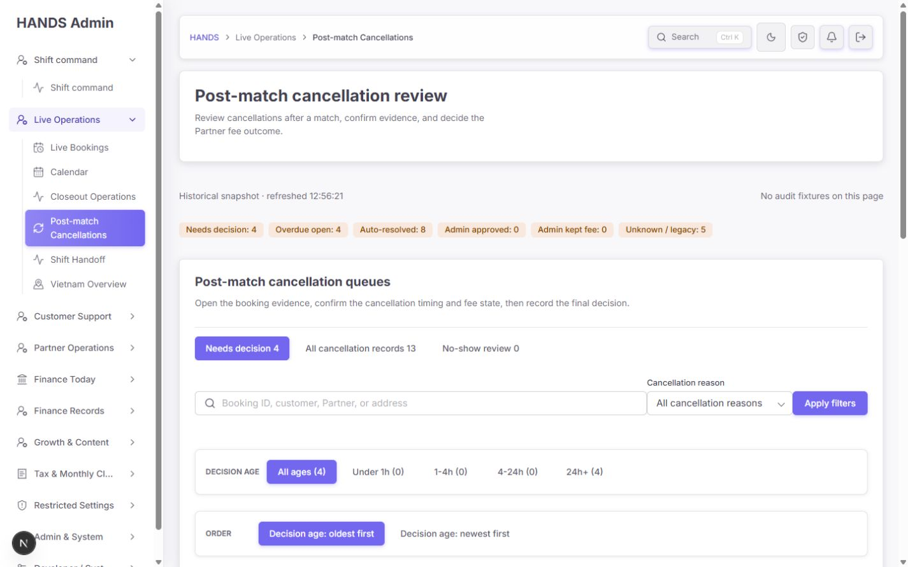

좋아진 점:

- 페이지 제목과 설명이 post-match cancellation 업무로 한정됐다.
- `Historical snapshot`으로 실시간 화면이 아님을 명시했다.
- 미결 4건, SLA 초과 4건, 해결 출처별 수치를 한눈에 볼 수 있다.
- 세 개의 핵심 큐를 숨기지 않고 바로 보여준다.

남은 문제:

- 첫 화면의 상단 영역이 제목 카드, source status, 6개 요약, 큐 카드, 탭, 검색, Decision age, Order, SLA로 반복돼 실제 작업 행이 보이지 않는다.
- Needs decision 4, Overdue 4가 요약·탭·Decision age·SLA에서 반복된다. 같은 사실이 네 번 노출돼 정보 밀도보다 시각적 높이만 늘어난다.
- 6개 요약은 서로 다른 범위를 섞는다. Needs decision/Overdue/No-show는 전체 기간이고 resolved breakdown은 선택 기간(기본 30일)이다. 화면에는 범위 구분이 없다.
- `Decision age is measured from decisionAt...` 문구는 내부 필드명을 운영자에게 노출한다.

### Step 2 — 미결 테이블: 주의 필요

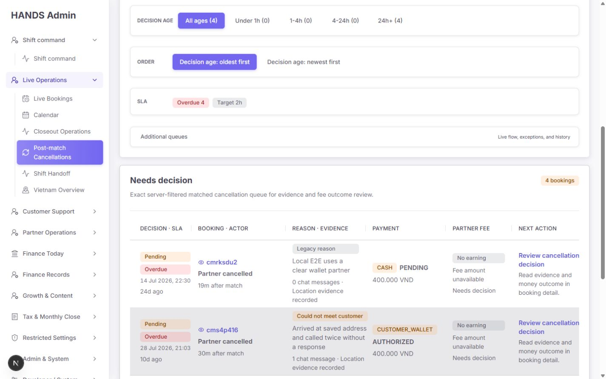

좋아진 점:

- 가장 오래된 미결부터 보여주며 24일, 10일, 4일, 3일 순서가 정확하다.
- actor, cancellation reason/detail, chat, location, payment, Partner fee, 다음 행동을 한 행에 모았다.
- 행 링크는 원래 view와 booking anchor를 `returnTo`에 보존한다.

남은 문제:

- 1440에서 테이블 wrapper는 1,052px인데 테이블 `min-width`가 1,120px라 68px 가로 오버플로가 발생한다. 우측 행동이 최초 상태에서 일부 잘릴 수 있다.
- 네 미결 행 모두 `No earning / Fee amount unavailable / Needs decision`이다. fee 자체가 없는데 fee 결정을 요구하는 모델로 읽힌다.
- `Read evidence and money outcome in booking detail`은 방향은 맞지만, 고객 결제와 Partner fee 중 무엇을 먼저 해결해야 하는지 알려주지 않는다.
- 현재 운영 데이터에 `Local E2E`, `smoke`, `Cleanup for ... smoke verification` 문구가 노출되는데 상단은 `No audit fixtures on this page`라고 표시한다. 데이터 신뢰 메시지가 충돌한다.

### Step 3 — 해결 기록 탭: 부분 양호

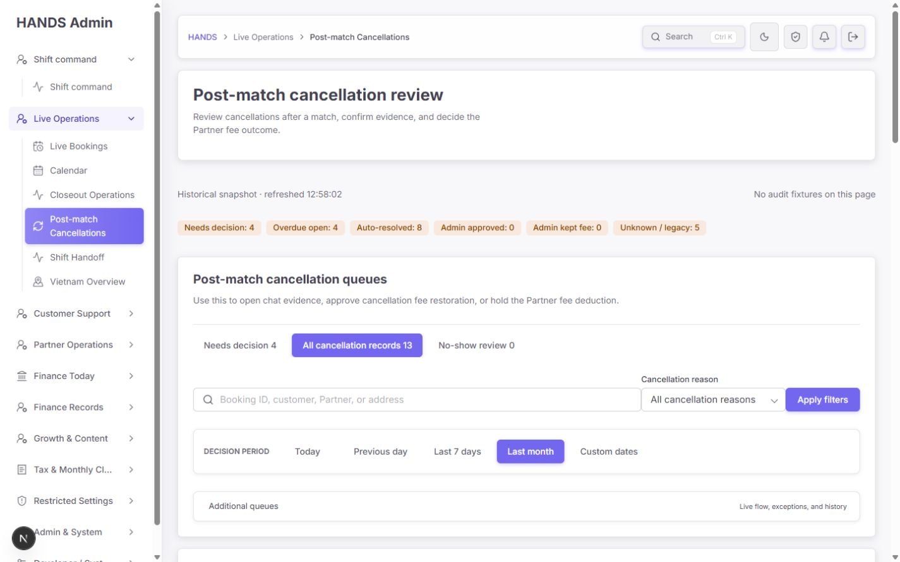

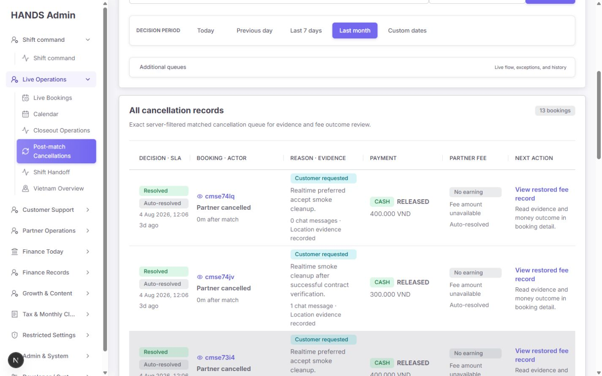

좋아진 점:

- 해결 기록에만 Decision period를 적용하고 기본값을 Last month로 제한한다.
- 최근 결과부터 보여주며 자동/관리자/Legacy source를 분리한다.
- 현재 13건은 Auto-resolved 8 + Unknown/legacy 5로 합계가 맞는다.

남은 문제:

- 탭 이름 `All cancellation records`는 실제 조건과 다르다. API 조건은 `decisionSource <> open`이므로 **모든 취소가 아니라 해결된 기록만** 보여준다. `Resolved records`가 정확하다.
- resolved 행도 earning이 없는데 `View restored fee record`라고 표시한다. 복원한 fee record가 없으므로 `View cancellation outcome` 또는 `View decision record`가 맞다.
- 현재 데이터에는 Admin approved/Admin kept fee 사례가 0건이라 이 두 상태의 실제 행·상세·복귀 흐름은 시각 검증하지 못했다.

### Step 4 — No-show 0건: 주의 필요

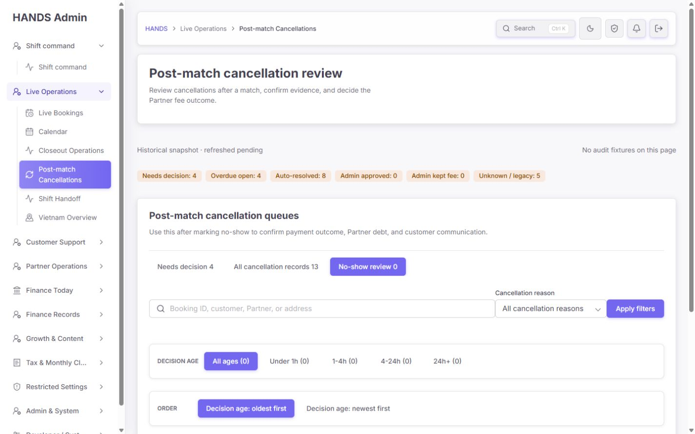

좋아진 점:

- No-show가 별도 직접 탭으로 존재한다.
- `No no-show cases currently need review.` 빈 문구는 명확하다.

남은 문제:

- 0건인데 취소 사유, Decision age 5개, 정렬, SLA `On time`, Target 2h를 모두 보여준다. 운영자는 빈 큐를 확인하려고 한 번 더 화면 전체를 해석해야 한다.
- No-show 생성 로직은 `admin_no_show`와 일반 reason note를 저장하며 postMatchCancellation reasonCode를 저장하지 않는다. 따라서 현재 `Cancellation reason` 필터는 No-show에서 대부분 `Legacy`로만 작동할 가능성이 높다.
- `On time`은 “처리할 건이 없다”가 아니라 “현재 필터 결과가 0개”에서 계산된 성공 배지다. 0건 상태에서는 SLA를 숨기거나 `No cases`로 표현해야 한다.

### Step 5 — 필터 결과 0건: 주의 필요

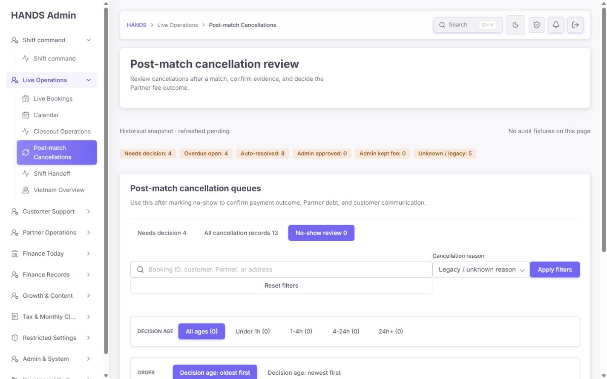

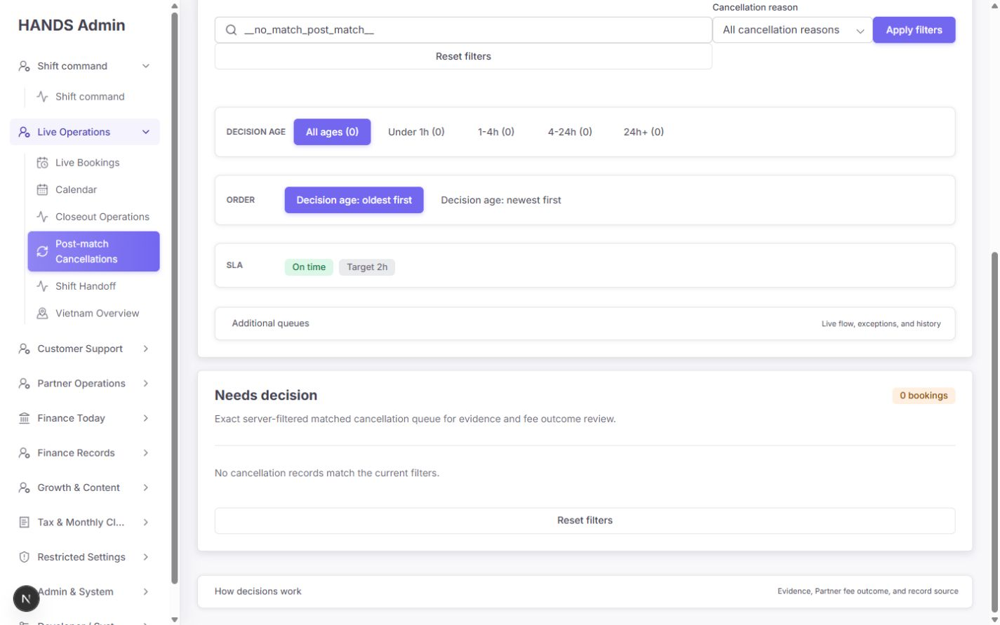

- 검색과 사유 필터의 결과 문구는 `No cancellation records match the current filters.`로 개선됐다.
- 그러나 Reset filters가 검색 폼의 두 번째 행과 빈 결과 카드에 중복 노출된다.
- 필터 결과가 0건이어도 상단 전역 요약과 탭 수치는 그대로 4/13/0이고, 아래 age/SLA만 0/On time으로 바뀐다. “전역 업무량”과 “현재 필터 결과”를 구분하는 라벨이 없다.
- GET 폼은 기본값도 `q=&cancellationReason=all`로 URL에 남겨 주소를 불필요하게 길게 만든다.

### Step 6 — 숨은 Additional queues: 불필요

코드와 DOM을 함께 확인한 결과, dedicated post-match 페이지에서 `additionalViewOptions`는 강제로 빈 배열인데 `emptyAdditionalViewOptions`는 primaryViewOptions를 제외하지 않는다. 그 결과 `Additional queues → Show empty queues → Other queues → No-show review 0`가 만들어져 상단 기본 탭의 No-show를 중복 노출한다.

현재 요약 문구 `Live flow, exceptions, and history`도 이 페이지의 실제 내용과 맞지 않는다. 이 페이지에서는 해당 disclosure를 **통째로 제거**하는 것이 가장 단순하고 정확하다.

관련 코드:

- `booking-monitor-filters-section.tsx:179-196`
- `booking-monitor-filters-section.tsx:468-518`
- `booking-monitor.tsx:666`

### Step 7 — 1600 테이블: 양호

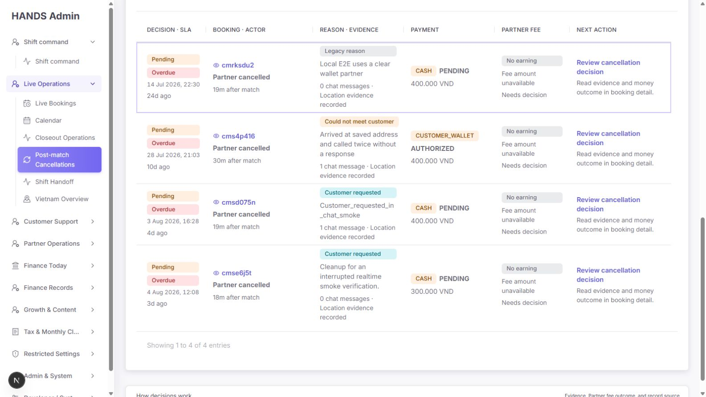

- 1600×900에서는 wrapper와 table이 모두 약 1,212px로 맞아 가로 스크롤이 없다.
- 열 구분과 행 정보는 읽을 수 있다.
- 따라서 반응형 전체 재설계보다 post-match 전용 테이블의 `min-width: 0; width: 100%`와 열 비율 조정으로 해결할 수 있다.

### Step 8 — 다크 모드: 양호

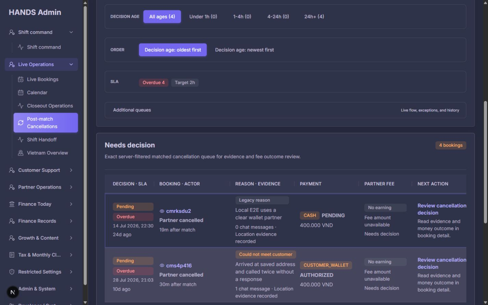

- 주요 surface, row boundary, status tone, active navigation이 구분된다.
- 정보 누락이나 겹침은 확인되지 않았다.
- 다만 라이트 모드와 동일하게 첫 행까지의 긴 스크롤과 1440 가로 오버플로는 남는다.

### Step 9 — 상세 결정: 출시 차단

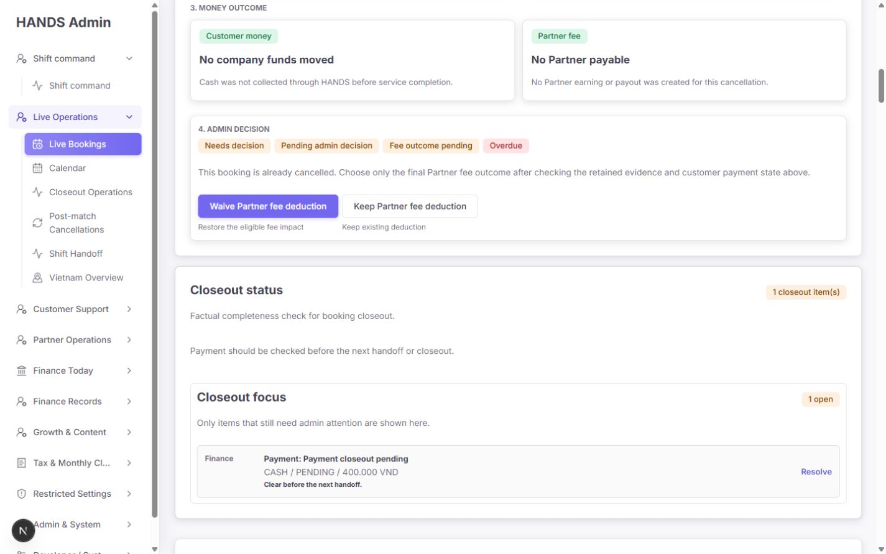

화면에는 동시에 다음 세 사실이 표시된다.

1. Customer money: `No company funds moved` 또는 `Wallet amount still held`
2. Partner fee: `No Partner payable`, `No Partner earning or payout was created`
3. Admin decision: `Waive Partner fee deduction` / `Keep Partner fee deduction`

fee도 earning도 없는데 “기존 차감 유지”를 선택하게 하는 것은 의미가 없다. 운영자는 어떤 금액을 유지하는지 확인할 수 없고, 확인창에는 `No Partner fee amount`만 들어간다.

더 중요한 문제는 API가 두 버튼 모두에서 `closeUnmatchedBookingPayment()`를 먼저 호출한다는 점이다. 즉 CUSTOMER_WALLET `AUTHORIZED` 건은 fee 버튼을 누르면 고객 wallet hold release가 함께 처리되고, CAPTURED 건은 refund request가 만들어질 수 있다. 화면은 이 결과를 설명하지 않는다.

관련 코드:

- UI의 fee-only 설명과 버튼: `booking-detail-post-match-decision-section.tsx:42, 92-118`
- generic hidden note와 confirm: `booking-detail-post-match-decision-section.tsx:103, 114, 141`
- 고객 결제 종료 호출: `admin.service.ts:13365-13408`
- approve일 때만 earning 복원: `admin.service.ts:13479-13482`
- payment release/refund request 분기: `payments.service.ts:542-569`

### Step 10 — Wallet hold 사례: 출시 차단

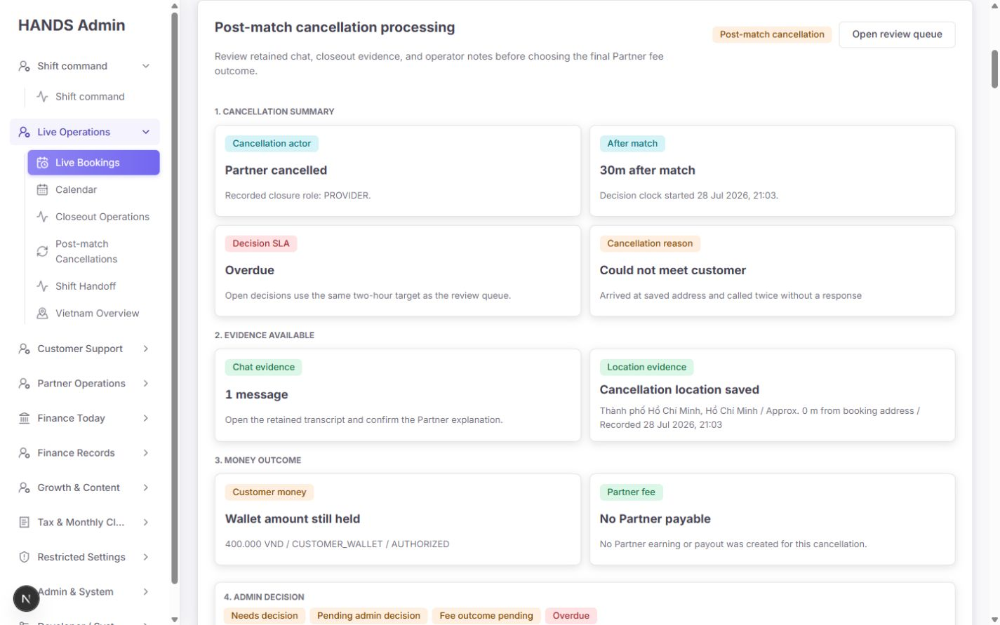

이 화면은 모순을 가장 분명히 보여준다.

- `Wallet amount still held · 400,000 VND · AUTHORIZED`
- `No Partner payable · No Partner earning or payout was created`
- 아래에는 여전히 `Waive Partner fee deduction` / `Keep Partner fee deduction`
- 같은 상세의 Closeout status는 Payment closeout pending과 별도 `Resolve` 링크를 보여준다.

운영자는 결제와 fee를 별개 단계로 이해하지만, 실제 fee 결정 서버 액션은 결제까지 처리한다. 이는 단순 copy 문제가 아니라 화면의 작업 모델과 실제 mutation 계약이 다른 문제다.

## 4. 우선순위별 개선 요구사항

### P0-1. 결정 화면과 실제 금전 mutation을 일치시킬 것

현재:

- 화면: Partner fee 결과만 선택
- 실제: 고객 결제 종료 + cancellation decision 기록 + approve일 때 earning 복원

요구사항:

1. 결정 영역 바로 위에 `This action will change` 결과표를 둔다.
2. Customer money, Partner fee, Review status 세 결과를 **선택 전 상태 → 선택 후 상태**로 표시한다.
3. `AUTHORIZED`는 `400,000 VND wallet hold → release`라고 명시한다.
4. `CAPTURED`는 `refund request created; finance approval still required`라고 명시한다.
5. CASH/no payment는 `No customer funds movement`라고 명시한다.
6. earning/fee record가 없으면 fee waive/keep 두 선택을 제거한다.
7. 결제와 fee를 정책상 반드시 한 액션으로 묶어야 한다면 버튼 이름도 전체 결과를 말해야 한다.

권장 버튼 문구 예시:

| 현재 상태 | 권장 primary action | 권장 secondary action |
|---|---|---|
| Wallet AUTHORIZED + fee 없음 | `Approve cancellation & release 400,000 VND` | 정책상 다른 유효 결과가 없다면 노출하지 않음 |
| Wallet AUTHORIZED + fee 존재 | `Approve, release wallet hold & waive fee` | `Release wallet hold & keep Partner fee` |
| Captured payment | `Approve & request customer refund` | 정책에 맞는 고객/Partner 결과를 모두 명시 |
| CASH + fee 없음 | `Close review — no money movement` | 불필요 |

화면을 두 축으로 분리할 수 있다면 더 안전하다.

- Step A: Customer payment outcome
- Step B: Partner fee outcome
- Final confirmation: 두 결과와 감사 메모를 함께 저장

### P0-2. 운영자 결정 근거와 성공/실패 피드백을 강제할 것

현재:

- 화면은 operator notes를 확인하라고 말하지만 note 0건이어도 버튼이 활성화된다.
- form은 운영자 입력이 아니라 generic hidden note를 전송한다.
- server action은 `adminPost()` fallback을 사용해 4xx/5xx를 조용히 삼키고 revalidate만 수행한다.
- 성공/실패 메시지, 처리 중 disabled 상태, 중복 클릭 방지 상태가 없다.

요구사항:

1. 결정 reason을 필수로 받는다. 자유 입력만 강요하기보다 3~5개의 정책 기반 preset + Other note가 적합하다.
2. 선택한 근거와 Customer/Partner 금전 결과를 confirm dialog에 모두 표시한다.
3. `adminPostOrThrow()`와 기존 notice redirect 패턴을 재사용해 성공/실패를 명확히 알린다.
4. 제출 중 두 버튼을 모두 disable하고 `Saving decision…`을 표시한다.
5. Conflict/이미 처리됨 응답은 `Another operator already resolved this review. Refresh to see the result.`로 구분한다.
6. payment 처리와 decision claim의 원자성/순서를 API에서 재검토한다. 현재 payment가 decision claim보다 먼저 실행된다.

### P1-1. 상세 작업공간 컨텍스트를 끝까지 보존할 것

현재:

- 상단 Back 링크: 정확히 Needs decision + 원래 행으로 복귀
- 좌측 active: `Live Bookings`
- breadcrumb: `Live Operations / Live Bookings`
- 상세의 `Open review queue`: 항상 `view=post-match-cancellations`, 즉 해결 기록으로 이동
- No-show detail도 동일 helper를 사용해 해결 기록으로 이동할 수 있다.

요구사항:

1. `returnTo`에서 유효한 booking workspace를 읽는 공용 helper를 만든다.
2. 좌측 active, breadcrumb, Back, `Open review queue`가 같은 effective workspace를 사용하게 한다.
3. `manual-decision`에서 왔으면 `Needs decision`, `no-show`에서 왔으면 `No-show review`, resolved에서 왔으면 `Resolved records`로 복귀한다.
4. `returnTo`는 허용된 내부 경로만 사용하고 외부 URL은 거부한다.

관련 코드:

- `admin-nav-match.ts:33-38`
- `admin-workspace-header.tsx:55-59`
- `booking-outcome-review-panel.ts:447-455`

### P1-2. 1440 첫 화면에 최소 한 개의 작업 행을 노출할 것

측정:

- 1440×900 테이블 상단: 약 1,214.5px
- 목표: 1440×900에서 테이블 header와 첫 행의 핵심 상태/행동이 보이도록 760~820px 이내

최소 수정안:

1. 상단 제목 카드를 줄이고 source status와 summary를 같은 한 줄에 둔다.
2. 요약을 `Open workload`와 `Resolved · Last 30 days` 두 compact group으로 합친다.
3. Decision age, Order, SLA를 세 개의 큰 full-width card가 아니라 한 줄 toolbar로 합친다.
4. `Additional queues`를 제거한다.
5. 검색/사유/Apply/Reset을 한 행에서 끝낸다.

새 라이브러리나 별도 dashboard component는 필요 없다. 기존 `AdminSegmentedControl`, `StatusBadge`, `AdminForm*`를 재배치하면 된다.

### P1-3. post-match 전용 테이블을 1440에서 가로 스크롤 없이 맞출 것

현재 CSS는 `.vuexy-booking-operations-table`에 `min-width: 1120px`를 강제한다. Closeout table은 별도 override로 `min-width: 0`을 적용하지만 post-match에는 없다.

요구사항:

- post-match table class를 추가해 `min-width: 0; width: 100%; table-layout: fixed`를 사용한다.
- 열 비율 권장: Decision 13%, Booking 17%, Reason/Evidence 24%, Payment 14%, Partner impact 14%, Next action 18%.
- 반복 helper는 한 줄로 제한하고 긴 reason detail은 2줄 clamp + title/상세 링크를 사용한다.
- acceptance: 1440에서 `scrollWidth <= clientWidth`, Next action이 최초 상태에서 완전히 보인다.

### P1-4. summary의 범위와 현재 결과를 구분할 것

권장 구조:

- `Open workload · All dates`: Needs decision 4 / Overdue 4 / No-show 0
- `Resolved · Last 30 days`: Total 13 / Auto-approved 8 / Admin approved 0 / Fee kept 0 / Legacy 5
- 필터 적용 시 table header에 `Current result: 0`을 별도로 표시

검색과 cancellation reason이 summary를 필터링하지 않는 현재 정책을 유지해도 되지만, 그 경우 summary에 `Overall`을 명시해야 한다.

### P1-5. Additional queues를 제거하고 중복 No-show를 없앨 것

가장 작은 수정은 post-match workspace에서 `showAdditionalQueues={false}`로 두는 것이다. 이 페이지의 모든 정상 작업 경로는 상단 세 탭이면 충분하다.

### P1-6. No-show에는 No-show용 필터만 보여줄 것

- 0건이면 탭 + 명확한 empty state만 보여주고 age/order/SLA를 숨긴다.
- 건수가 생겼을 때는 `No-show reason`, payment state, evidence completeness 등 실제 저장된 필드만 필터로 제공한다.
- postMatchCancellation reasonCode를 저장하지 않는 현재 데이터 모델에서 Cancellation reason 필터를 재사용하지 않는다.

### P2-1. 문구를 운영 언어로 바꿀 것

| 현재 문구 | 권장 문구 |
|---|---|
| All cancellation records | Resolved records |
| Decision age is measured from decisionAt: closed time, then updated time, then created time. | Decision age starts at cancellation time. If unavailable, the latest recorded update is used. |
| No earning / Fee amount unavailable / Needs decision | No Partner fee record · No fee amount to decide |
| View restored fee record (earning 없음) | View cancellation outcome |
| Auto-resolved | Auto-approved · fee waived |
| Admin approved | Admin approved · fee waived |
| Admin kept fee | Admin decision · fee kept |
| Open review queue | Back to Needs decision / Back to No-show review / Back to Resolved records |
| Keep existing deduction (fee 없음) | 버튼 자체를 숨김 |

### P2-2. 예상 payout과 실제 earning을 구분할 것

상세 상단은 `No Partner payable / earning not created`라고 말하지만 아래 evidence bundle은 활성 payout rule에서 계산한 `Partner 320,000 VND`를 실제 money record처럼 보여준다.

권장:

- earning이 없으면 `Projected payout rule: 320,000 VND · no earning created`로 표시한다.
- 실제 earning/fee decision 금액과 catalog projection을 같은 `Partner` 라벨 아래 두지 않는다.
- 결정 panel은 오직 실제 ledger/earning 근거만 사용한다.

### P2-3. 테스트/데모 데이터 표시 신뢰도를 정리할 것

현재 production-data SQL은 ID prefix와 명시적 metadata flag를 제외하지만 free-text note/detail의 `E2E`, `smoke`는 분류하지 않는다. 문자열 이름을 보고 임의 분류하는 방식은 추가하지 말고, fixture 생성 시 `dataClass=test` 또는 명시적 metadata를 반드시 저장하도록 고친다.

- `No audit fixtures on this page`는 모든 행의 명시적 classification이 production일 때만 표시한다.
- local 개발 환경이면 별도의 `Local data` 배지를 사용한다.
- production 목록/summary가 같은 classification predicate를 사용하도록 유지한다.

## 5. 필터와 버튼별 상세 판정

| 요소 | 현재 판정 | 권장 처리 |
|---|---|---|
| Needs decision | 적합 | 유지. `All dates` scope 표시 추가. |
| All cancellation records | 이름 부정확 | `Resolved records`로 변경. |
| No-show review | 구조 적합 | 0건일 때 보조 필터 축소, No-show 전용 필터 사용. |
| Search | 적합 | 결과 수/전역 수 scope 표시, empty q URL 제거. |
| Cancellation reason | Cancellation에는 적합 | No-show에서는 숨김 또는 전용 사유로 교체. |
| Apply filters | 적합 | Reset과 한 행에 배치. |
| Reset filters | 기능 적합/배치 미흡 | 화면당 한 번만 노출. active filter chip 우측에 compact link로 배치. |
| Decision age | 적합 | 큰 카드 대신 compact toolbar. 0건일 때 숨김. |
| Order | 적합 | Needs decision은 oldest 기본 유지, resolved는 newest 기본 유지. |
| SLA | 계산 적합/빈 상태 문구 부적합 | 0건에서 `On time` 대신 숨김 또는 `No cases`. |
| Additional queues | 부적합 | dedicated 페이지에서 제거. |
| Review cancellation decision | 진입은 적합 | 목록에 결제 영향 힌트 추가. |
| Open review queue | 부적합 | 원래 view/anchor를 재사용. |
| Waive fee / Keep fee | 현재 데이터에서 부적합 | 실제 fee 존재 여부와 customer payment 결과에 따라 동적으로 구성. |
| Native confirm | 불충분 | 금액·before/after·reason·irreversibility를 담은 확인 dialog로 교체. |

## 6. 구현 순서

### 1차 — 출시 차단 해소

1. decision action의 Customer money + Partner fee 실제 결과 계약 확정
2. fee 없음/있음, wallet/captured/cash별 동적 action model 작성
3. 필수 decision reason/note 추가
4. `adminPostOrThrow` 기반 성공/실패 notice와 submit pending 상태 추가
5. payment 처리와 decision claim 순서/원자성 검토

### 2차 — 작업 흐름 정리

1. `returnTo` 기반 workspace context 공용화
2. `Open review queue`, breadcrumb, 좌측 active 수정
3. Additional queues 제거
4. All cancellation records → Resolved records
5. No-show 전용 empty/filter 처리

### 3차 — 1440 밀도와 표 개선

1. summary scope 두 그룹으로 재구성
2. age/order/SLA 한 줄 toolbar
3. Reset 중복 제거
4. post-match table min-width override와 열 비율 조정
5. 첫 행 760~820px 이내 노출 검증

### 4차 — 데이터 신뢰와 문구 정리

1. fixture explicit classification 보강
2. projected payout와 actual earning 구분
3. 내부 필드명 및 generic 문구 교체

## 7. 필수 회귀 테스트

### Admin Web

- fee가 없으면 waive/keep 두 버튼을 렌더링하지 않는다.
- wallet AUTHORIZED의 confirm에는 release 금액이 표시된다.
- captured payment의 confirm에는 refund request와 후속 finance approval이 표시된다.
- decision reason/note가 없으면 제출할 수 없다.
- action 409/4xx/5xx에서 실패 notice가 표시되고 성공처럼 보이지 않는다.
- `manual-decision`, `no-show`, resolved 각각 상세 진입 후 breadcrumb/active nav/Back/queue link가 같은 workspace를 유지한다.
- post-match workspace에서 `Additional queues`와 중복 `No-show review 0`이 렌더링되지 않는다.
- 0건 No-show에서 cancellation reason, Decision age, SLA On time을 렌더링하지 않는다.
- `Resolved records`만 `decisionSource <> open`을 사용한다.
- 1440 fixture에서 post-match table `scrollWidth <= clientWidth`를 검증한다.

### API

- decision claim, payment resolution, earning resolution의 실행 순서와 중복 호출 계약을 검증한다.
- APPROVED/HELD 각각 wallet authorized, captured, cash, no payment를 검증한다.
- fee 없음에서 HELD가 어떤 비즈니스 의미를 갖는지 명시적으로 검증하거나 action을 거부한다.
- 동일 booking을 두 운영자가 동시에 처리할 때 한 건만 성공하고 고객 결제가 중복 처리되지 않는다.
- fixture classification이 list와 summary 양쪽에서 동일하게 적용된다.

### 현재 실행 결과

- Admin Web 집중 테스트: **11 files, 127 tests passed**
- API post-match 집중 테스트: **3 files, 10 tests passed, 595 skipped**
- API no-show 집중 테스트: **1 file passed, 3 tests passed, 554 skipped**

주의: 현재 테스트는 실제 UI 문구와 mutation 결과의 일치, fee가 없는 상태의 버튼 노출, silent failure, workspace context, Additional queue 중복, 1440 overflow를 검증하지 않는다. `booking-detail-post-match-decision-section.spec.tsx`의 순서 테스트는 `1. Why cancelled` 존재를 먼저 assert하지 않아 현재 `1. Cancellation summary`로 바뀌어도 통과하는 false-positive가 있다.

## 8. 완료 승인 기준

다음 조건을 모두 만족해야 개선 완료로 판정한다.

- [ ] 결정 전 Customer money와 Partner fee의 before/after가 금액과 함께 보인다.
- [ ] fee/earning이 없으면 존재하지 않는 deduction을 waive/keep하도록 요구하지 않는다.
- [ ] 운영자 결정 reason/note가 audit에 저장된다.
- [ ] 성공, 실패, 이미 처리됨이 서로 다른 메시지로 보인다.
- [ ] payment mutation과 decision claim의 중복/경합 안전성이 검증된다.
- [ ] 상세의 breadcrumb, 좌측 active, Back, queue link가 원래 queue와 일치한다.
- [ ] 1440×900 첫 화면에 최소 한 개의 작업 행과 next action이 보인다.
- [ ] 1440에서 post-match table 가로 스크롤이 없다.
- [ ] Additional queues와 중복 No-show 링크가 없다.
- [ ] No-show 0건 상태에 무의미한 필터/SLA 성공 표시가 없다.
- [ ] overall summary와 current filtered result의 범위가 명시된다.
- [ ] projected payout와 actual earning/fee가 명확히 구분된다.
- [ ] 위 회귀 테스트가 추가되고 통과한다.

## 9. 코드 근거 요약

- route/load plan: `apps/admin_web/app/bookings/booking-monitor-route-load-plan.ts`
- summary/filter composition: `apps/admin_web/app/bookings/booking-monitor.tsx`
- primary/additional/empty queue composition: `apps/admin_web/app/bookings/booking-monitor-filters-section.tsx`
- post-match list row/action copy: `apps/admin_web/app/bookings/booking-monitor-list-section.tsx`
- decision/fee/source model: `apps/admin_web/app/bookings/booking-post-match-cancellations-model.ts`
- detail money context and queue link: `apps/admin_web/app/bookings/[id]/booking-outcome-review-panel.ts`
- detail decision UI: `apps/admin_web/app/bookings/[id]/booking-detail-post-match-decision-section.tsx`
- server action error handling: `apps/admin_web/app/bookings/[id]/actions.ts`
- API decision orchestration: `apps/api/src/admin/admin.service.ts`
- payment release/refund request behavior: `apps/api/src/payments/payments.service.ts`
- earning restore behavior: `apps/api/src/bookings/post-match-cancellation.ts`
- production fixture predicate: `apps/api/src/admin/admin-booking-list-query.ts`
- workspace active/breadcrumb matching: `apps/admin_web/lib/admin-nav-match.ts`, `apps/admin_web/components/admin-workspace-header.tsx`
- desktop table layout: `apps/admin_web/app/globals.css`

## 10. 감사 한계

- 현재 데이터에 Admin approved/Admin kept fee와 활성 No-show 건이 없어 해당 실제 행 상태는 코드와 테스트로만 검증했다.
- 실제 결정 버튼은 금전 상태를 변경하므로 감사 중 클릭하지 않았다.
- 라이트/다크 및 1440/1600 데스크톱만 검수했다.

