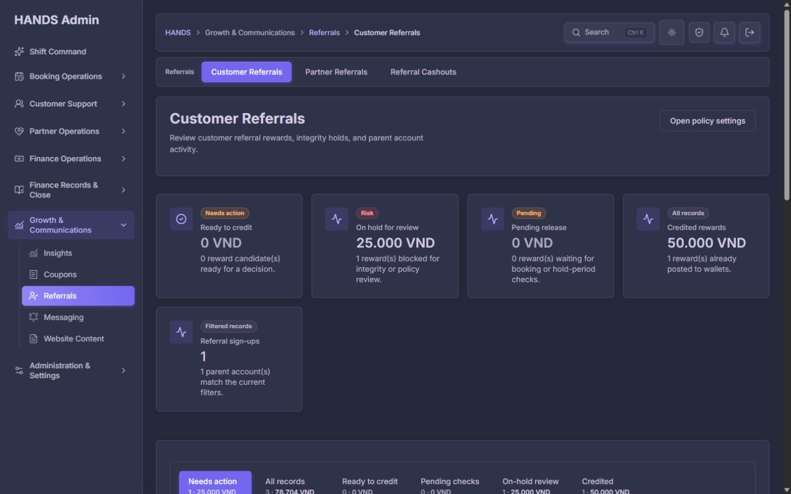
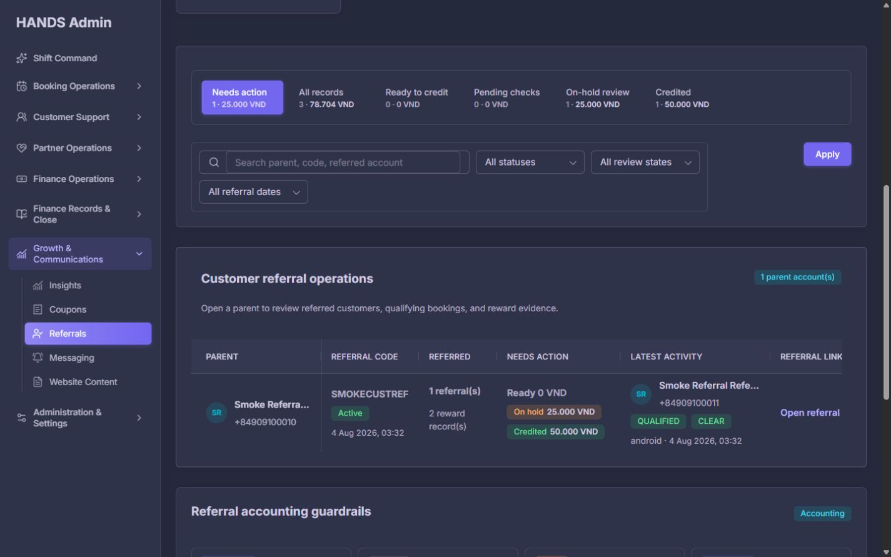
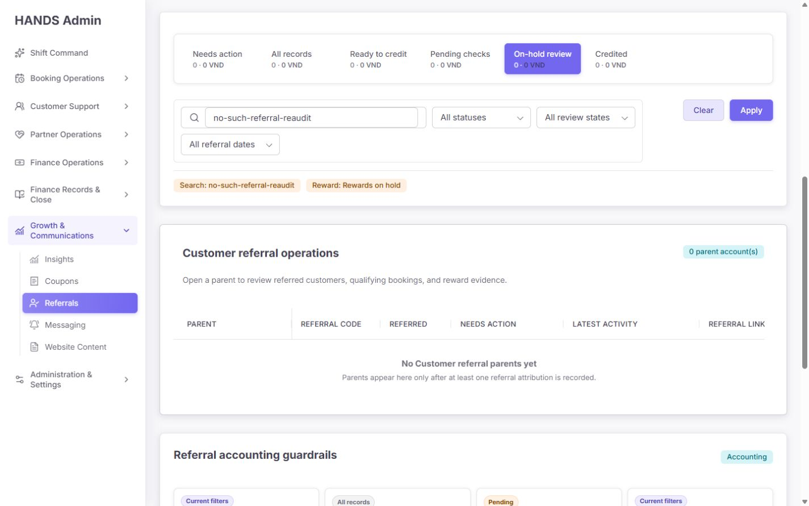
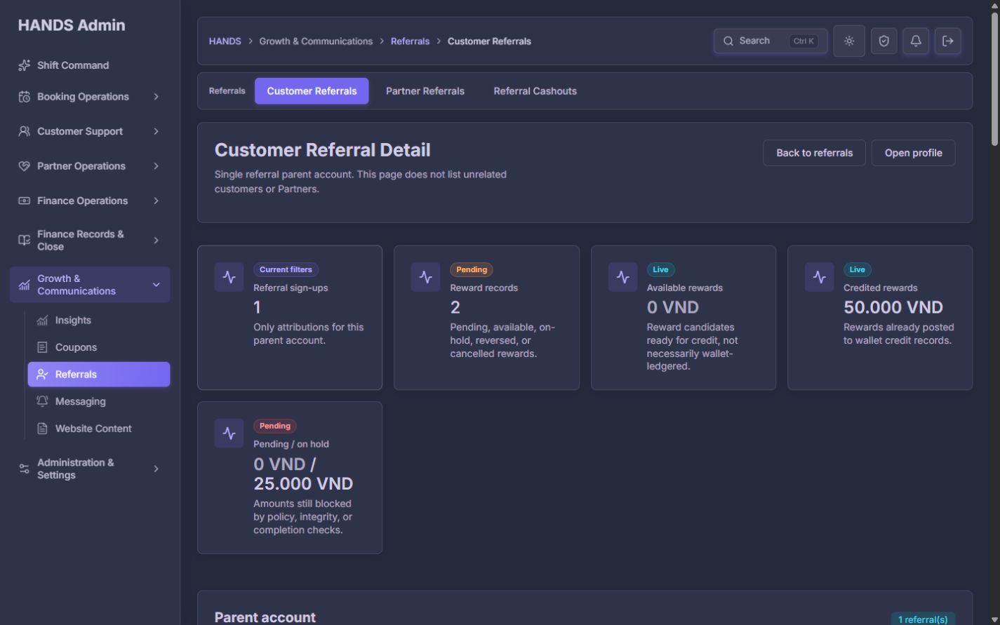
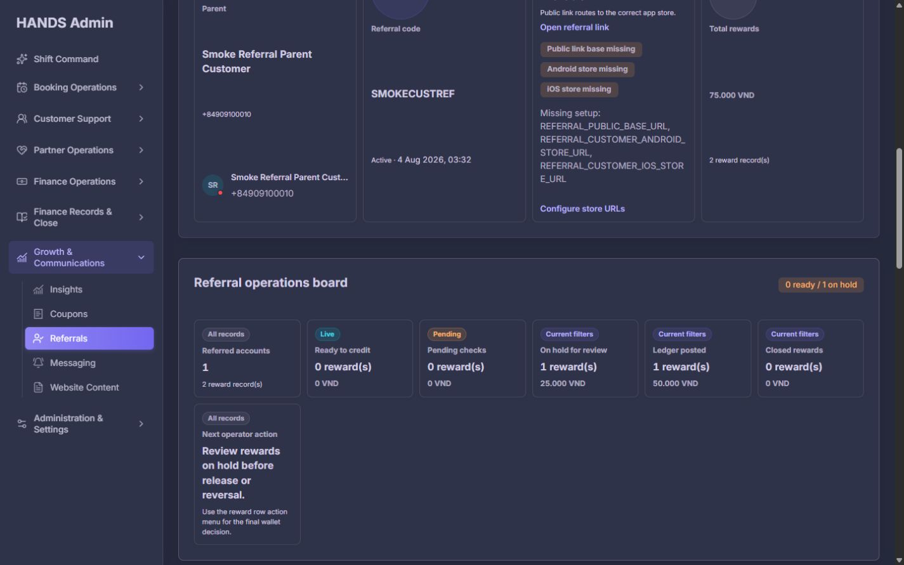
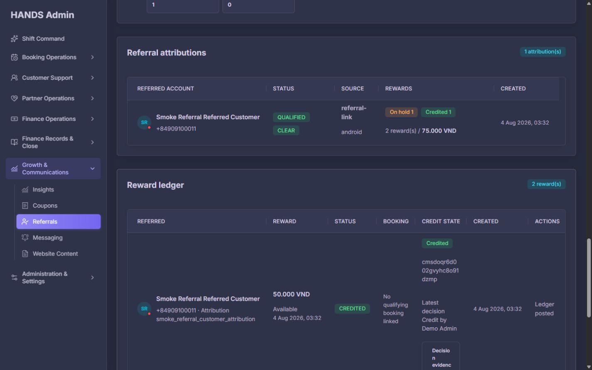
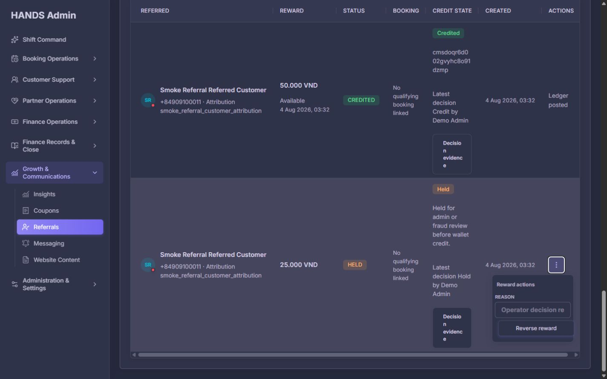
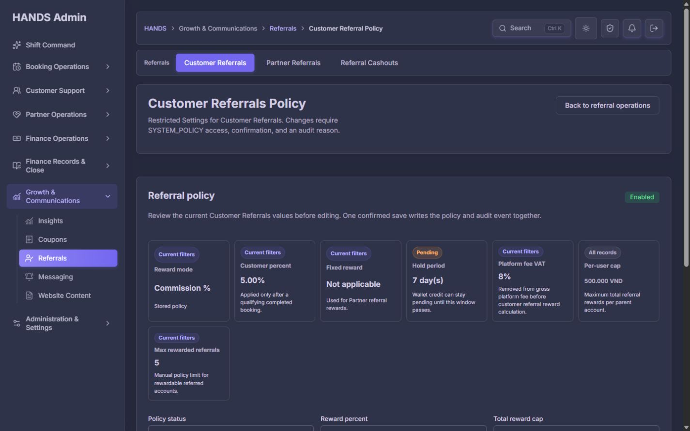
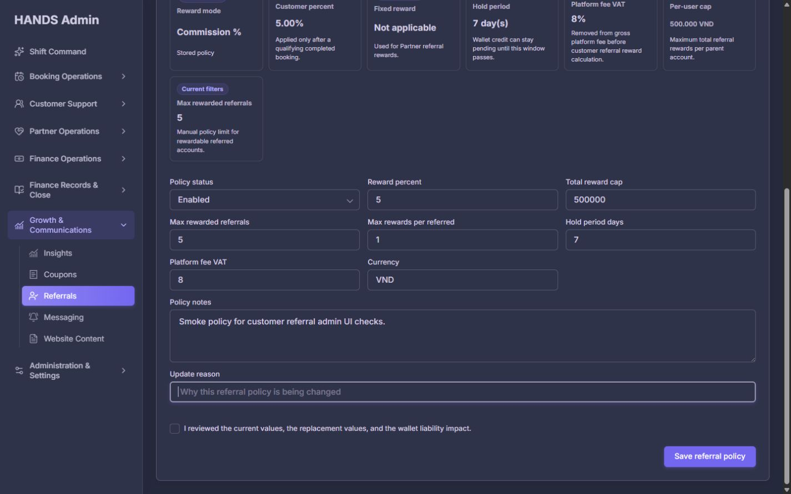
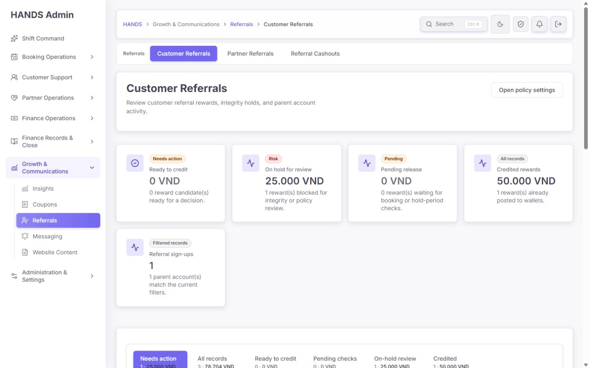

# Customer Referrals 사후 개선 심층 재감사 보고서

- 감사 일자: 2026-08-10
- 대상: `http://localhost:3101/referrals/customers`
- 포함 범위: 기본 목록, 보상 큐, 검색·필터, 필터 결과 없음, 부모 상세, 보상 조치 메뉴, 정책 화면, 라이트·다크 테마, 관련 Admin Web/API 코드와 테스트
- 화면 기준: 1440 × 900 데스크톱. 1024px 이하 화면은 이번 감사에서 완전히 제외했다.
- 변경 여부: 소스와 운영 데이터는 변경하지 않았다. 브라우저 조작은 읽기·탐색·캡처와 비파괴 dry-run에 한정했다.

## 1. 최종 판정

**판정: IA 개선은 통과했지만, 금전성 보상 조치의 운영 투입은 보류해야 한다.**

이전 IA 보고서에서 요구한 `Referrals` 작업공간 통합, 정확한 breadcrumb, Customer/Partner/Cashouts 로컬 탭, 중복 Cashouts 헤더 액션 제거는 모두 현재 구현에 반영됐다. 목록 API도 10개 단위 서버 페이지네이션과 별도 요약 집계를 사용하고, 현재 로컬 환경에서 화면 전환은 181~214ms로 빠르다.

그러나 운영자가 실제 금전 상태를 변경하는 흐름에는 다음 차단 문제가 남아 있다.

1. `Hold`, `Credit`, `Reverse` 사유가 UI와 API 모두 선택 사항이며, 빈 사유는 자동 기본 문구로 기록된다.
2. `Reverse reward`는 금전 상태를 바꾸지만 대상·금액·전환 상태를 확인하는 최종 확인 단계가 없다.
3. 쓰기 API가 실패해도 `adminPost(..., fallback)`가 오류를 삼키고, 화면에는 성공·실패 결과가 표시되지 않는다.
4. `HELD` 상태 안내는 “release 또는 reversal”을 지시하지만 실제 메뉴에는 `Reverse reward`만 있다.
5. `CREDITED` 보상이 `No qualifying booking linked`로 표시된다. 현재 데이터는 smoke fixture이지만, API 신용 적립 전제조건에도 `qualifyingBookingId` 검증이 없어 불변식 위반을 막지 못한다.
6. 추천 링크 설정이 미완료인데 상세 화면은 링크를 `Available`로 표시하며 “correct app store”로 이동한다고 단정한다.

따라서 현재 상태는 **탐색·조회용으로는 사용 가능하지만, 보상 승인·보류·취소를 안전하게 수행하는 운영 콘솔로는 미완성**이다.

## 2. 종합 점수

0은 운영 불가, 4는 안정적인 운영 기준 충족이다.

| 평가 축 | 점수 | 판정 | 핵심 근거 |
|---|---:|---|---|
| 정보 구조·계층 | 3.4 / 4 | 양호 | Referrals 작업공간과 breadcrumb는 정확함 |
| 시각 계층·밀도 | 2.2 / 4 | 개선 필요 | 5번째 KPI가 단독 행을 차지하고 핵심 큐·표를 첫 화면 아래로 밀어냄 |
| 상호작용·쓰기 안전성 | 1.2 / 4 | 차단 | 사유 선택, 확인 없음, 실패 무음, HELD 조치 불일치 |
| 운영 문구·상태 정합성 | 1.6 / 4 | 차단 | `Available` 링크/설정 미완료, 잘못된 빈 상태, raw enum 다수 |
| 접근성 | 2.6 / 4 | 부분 통과 | semantic 구조·포커스는 좋으나 12px 보조 정보 대비 미달, 과도한 줄바꿈 |
| 성능·데이터 경계 | 3.1 / 4 | 양호/예외 | 서버 페이지네이션·요약은 좋으나 조회 실패가 0건으로 위장됨 |
| **종합** | **2.3 / 4** | **조건부 실패** | 금전성 조치 안전장치 보완 전 운영 승인 불가 |

## 3. 이전 감사 요구사항 재검증

기준 문서는 `output/admin-navigation-ia-final-reaudit-2026-08-08/admin-navigation-final-reaudit.md`의 Customer Referrals 항목과 그 이전 IA 통합 권고다.

| 이전 요구 | 현재 결과 | 판정 |
|---|---|---|
| `Growth & Communications → Referrals → Customer Referrals` breadcrumb | 정확히 표시됨 | 통과 |
| Customer / Partner / Cashouts를 한 작업공간으로 통합 | 상단 로컬 탭 3개로 구현됨 | 통과 |
| 중복 `Open reward cashouts` 헤더 액션 제거 | 제거됨 | 통과 |
| 정책을 권한 보유자만 작업공간 내부에서 접근 | `?settings=policy`, `SYSTEM_POLICY` 검사로 분리됨 | 통과 |
| 정책 버튼을 대상이 분명한 문구로 변경 | 여전히 `Open policy settings` | 부분 통과 |
| 운영자 중심으로 목록과 조치 흐름을 정리 | 큐는 추가됐지만 부모 단위 목록과 금전 조치 안전성이 부족 | 미흡 |

## 4. 현재 실행 증거

### 4.1 기본 목록 — IA는 좋아졌지만 첫 화면의 KPI 밀도가 비효율적



- 4개의 KPI가 첫 행에 있고 `Referral sign-ups`만 두 번째 행에 남는다.
- 단독 KPI 때문에 약 190px 이상의 빈 공간이 생기고, 실제 작업 대상인 큐·필터·목록이 첫 화면 아래로 밀린다.
- 현재 기본 큐는 `Needs action`이지만, 위 KPI는 `Ready`, `Held`, `Pending`, `Credited`, `Sign-ups`를 모두 같은 강도로 보여 준다.
- 권장: 상단 KPI는 `Ready`, `Held`, `Pending`, `Total open amount` 4개로 제한하고, 부모/가입 수는 표 결과 헤더로 이동한다.

### 4.2 큐·필터·목록 — 기능은 작동하지만 업무 단위가 혼재함



- 큐 숫자는 **reward 수·금액**, 결과 배지는 **parent account 수**다. 같은 구역에서 단위가 달라 빠르게 오독할 수 있다.
- `Needs action` 표의 열 이름이 `Needs action`인데 해당 셀에 `Credited 50.000 VND`도 함께 표시된다. 완료 상태를 조치 열에 넣는 것은 의미가 맞지 않는다.
- 기본 API 정렬은 `customerProfile.id desc`다. 운영 우선순위·가장 오래된 보류·최대 금액·SLA와 무관하다.
- 부모 단위 한 행 안에 여러 reward를 합산하므로, 운영자는 다시 상세로 들어가야 어떤 reward를 처리할지 알 수 있다.
- 검색과 세 select 중 기간 select가 두 번째 줄로 내려가고 Apply가 별도 오른쪽 열에 떠 있다. 1440px에서도 한 번에 훑기 어렵다.

**권장 구조**

- 기본 `Needs action`은 reward 한 건당 한 행으로 바꾼다.
- 열: `Age/SLA`, `Parent`, `Referred`, `Amount`, `Reward state`, `Attribution & integrity`, `Qualifying booking`, `Owner`, `Next action`.
- `All records`만 부모 집계형 목록을 유지해도 된다.
- 기본 정렬: `overdue → held → ready → pending`, 같은 상태에서는 `oldest first`.
- 큐 라벨에 단위를 명시한다: `1 reward · 25.000 VND`, 결과에는 `1 parent / 1 reward`를 같이 표시한다.

### 4.3 필터 결과 없음 — 실제 데이터가 있는데 “아직 없음”으로 오인시킴



검색어와 reward 필터가 활성화된 상태인데 빈 상태는 `No Customer referral parents yet`와 “attribution이 기록된 뒤 나타난다”라고 표시한다. 실제로는 기본 화면에 부모가 존재한다.

원인은 `ReferralEmptyState`가 `activeFilters.length > 0 && totalCount > 0`일 때만 필터 빈 상태를 사용하지만, `totalCount`가 이미 현재 필터를 적용한 summary 값이어서 0이 된다는 점이다.

**수정 기준**

- active filter가 하나라도 있으면 무조건 `No matching referral parents`를 표시한다.
- `Clear referral filters`를 빈 상태 내부의 주 행동으로 제공한다.
- 전체 건수를 설명하려면 API에 `allParentCount`와 `filteredParentCount`를 분리한다.
- 자유 검색 때문에 큐 KPI까지 0으로 바뀌면 `Counts scoped to current search`를 명시하거나, 큐 집계에서는 `q`를 제외해 전역 업무량을 유지한다.

### 4.4 상세 첫 화면 — 부모 정체성과 다음 행동이 제목에서 보이지 않음



- H1이 항상 `Customer Referral Detail`이고 부모 이름·추천 코드가 없다.
- breadcrumb도 `Customer Referrals`에서 끝나 현재 상세 대상을 표현하지 않는다.
- 설명 `This page does not list unrelated customers or Partners.`는 개발 구현 범위를 설명할 뿐 운영 판단을 돕지 않는다.
- 목록과 마찬가지로 5번째 KPI가 단독 행에 남아 아래 핵심 증거를 밀어낸다.

**권장 문구**

- H1: `Smoke Referral Parent Customer · Customer referral`
- 보조 식별: `SMOKECUSTREF · +84•••0010`
- 설명: `Review this parent’s attribution evidence, qualifying bookings, reward holds, and wallet decisions.`
- breadcrumb: `Referrals → Customer Referrals → Smoke Referral Parent Customer`

### 4.5 상세 운영 보드 — 같은 사실을 카드·타임라인·표에서 반복함



- `Referral operations board`, `Reward decision timeline`, 상단 KPI가 동일한 ready/held/pending/credited 수치를 반복한다.
- 7번째 `Next operator action` 카드가 단독 행에 남는다. 가장 중요한 내용인데 오히려 가장 아래·왼쪽에 고립된다.
- `Current filters`, `All records`, `Live`, `Pending` scope chip이 정적인 상세·정책 카드에도 반복돼 의미가 약해졌다.
- store 설정 키가 카드 폭에서 글자 단위로 갈라져 개발자 정보가 운영 정보보다 눈에 띈다.

**권장**

- 최상단에 한 개의 `Decision brief`를 둔다: 상태, 금액, age, 보류 사유, qualifying booking, 권장 다음 행동.
- timeline은 실제 사건 순서와 시각을 보여 주는 용도로만 유지한다.
- 요약 카드의 scope chip은 실제 범위가 있을 때만 사용한다.
- 환경 변수명은 개발자 권한의 disclosure로 이동하고, 일반 운영자에게는 `Customer referral links are not ready`와 영향·담당 팀·다음 행동만 표시한다.

### 4.6 Reward ledger — 증거와 조치가 가장 좁은 열에 몰림



- 긴 attribution/ledger ID가 줄 단위가 아니라 글자 단위로 깨진다.
- `Decision evidence` 컨트롤도 글자 단위로 줄바꿈된다.
- `CREDITED` 행의 Reward 보조 문구가 `Available 4 Aug...`라서 현재 상태와 과거 eligibility 시각이 혼동된다. `Eligible since`로 바꿔야 한다.
- `No qualifying booking linked`인 50.000 VND reward가 이미 `CREDITED`다. smoke 데이터라는 점을 감안해도 UI와 API가 불변식 위반을 명확히 차단하지 못한다는 증거다.
- full-width horizontal scroll은 키보드 포커스 가능하도록 구현돼 있는 점은 좋다. 다만 action 열을 sticky로 두고 ID를 disclosure/copy로 숨기면 스크롤 필요를 크게 줄일 수 있다.

### 4.7 보류 reward 액션 — 가장 큰 운영 차단점



현재 `HELD` reward 메뉴에는 다음만 있다.

- 사유 입력: 선택 사항
- 버튼: `Reverse reward`

문제는 다음과 같다.

1. 보드 안내는 `Review rewards on hold before release or reversal.`이라고 하지만 release 액션이 없다.
2. reason 필드에 `required`와 최소 길이가 없다.
3. Admin Web server action은 빈 값이면 `Updated referral reward candidate from Admin Web.`를 자동 사용한다.
4. API DTO도 reason을 optional로 허용하고, 없으면 `No reason provided by API caller`로 대체한다.
5. 버튼을 누르면 별도 확인 없이 즉시 POST된다.
6. POST 실패 시 `adminPost`가 fallback을 반환하고 action은 결과를 검사하지 않아 운영자에게 실패가 보이지 않는다.
7. 요청에 `expectedStatus`, `updatedAt`, version이 없어 두 운영자의 동시 판단 충돌을 명시적으로 감지하지 못한다.

**필수 수정 계약**

- `ReferralRewardDecisionDto.reason`: required, trim, `MinLength(12)`, `MaxLength(500)`.
- 모든 금전 상태 변경은 `adminPostOrThrow`를 사용하고 성공/실패 notice를 반환한다.
- 최종 확인 drawer/modal에 parent, referred account, reward ID, amount/currency, qualifying booking, current → target state, 최신 결정자/시각, reason을 표시한다.
- `expectedStatus` 또는 version을 전송하고 DB update predicate가 맞지 않으면 409로 중단한다.
- `HELD → AVAILABLE` 또는 별도 `release hold`가 실제 정책이라면 감사 reason과 함께 구현한다. 지원하지 않는 정책이면 모든 “release” 문구를 제거한다.
- 완료 후 `Saved by / at / audit log link`를 결과 배너에 제공한다.

### 4.8 링크 readiness — 화면·코드·외부 설정의 상태가 서로 다름

상세 화면은 referral code가 있으면 `Share link: Available`과 `Public link routes to the correct app store.`를 표시한다. 같은 카드 안에서는 다음 설정이 모두 missing으로 나온다.

- `REFERRAL_PUBLIC_BASE_URL`
- `REFERRAL_CUSTOMER_ANDROID_STORE_URL`
- `REFERRAL_CUSTOMER_IOS_STORE_URL`

`npm run external:check:referrals`도 현재 Android referral E2E 필수 설정 실패를 반환했다. `referrals:public-link-smoke -- --dry-run`은 URL 경로 생성 계약만 통과했고, customer Android/iOS store는 둘 다 `storeUrlConfigured: false`였다.

**수정 기준**

- link status의 source of truth를 `referralStoreSetupState` 하나로 통일한다.
- 셋 중 필수 설정이 없으면 `Available` 대신 `Setup blocked`를 표시한다.
- `Open referral link`는 `Preview fallback page`로 바꾸거나 비활성화하고 이유를 제공한다.
- 프로그램이 Enabled인데 public/store 설정이 blocked이면 목록 상단에 단일 경고 배너를 노출한다.
- 개발자 환경 변수명은 역할 제한 disclosure로 이동한다.

### 4.9 정책 화면 — 권한 분리는 잘됐지만 변경 검토·결과 피드백이 부족함





잘된 점:

- 정책은 daily operations에서 분리되어 있다.
- `SYSTEM_POLICY` 권한에 따라 편집 여부가 결정된다.
- `expectedUpdatedAt`, 최소 12자 update reason, 확인 checkbox를 사용한다.
- 현재 값과 폼 값이 같은 화면에 있고 3열 레이아웃은 1440px에서 안정적이다.

남은 문제:

- static policy summary에 `Current filters` chip이 반복된다.
- Customer policy에 관계없는 `Fixed reward · Not applicable` 카드가 공간을 차지한다.
- 7번째 `Max rewarded referrals` 카드가 단독 행에 남는다.
- API가 지원하는 `perRewardCapAmount`가 화면·server action payload에 없어 운영자가 편집할 수 없다.
- `Total reward cap` 입력이 `500000`으로 표시되어 VND 단위·천 단위 구분이 약하다.
- Currency가 자유 텍스트다. 실제 지원 통화가 VND뿐이면 read-only가 안전하다.
- checkbox는 변경 전후 값을 보여 주지 않는다. 특히 Enabled → Disabled와 percent/cap 변경의 영향이 보이지 않는다.
- server action은 `status=saved|blocked`로 redirect하지만 화면이 이를 읽어 notice를 렌더링하지 않는다. `?settings=policy&status=saved&reason=policy-updated`를 직접 확인했지만 성공 문구가 없었다.

**권장**

- static card 7개 대신 `Current policy` definition list와 `Change preview`를 나란히 둔다.
- 실제 변경된 필드만 before → after로 표시하고 예상 wallet liability 영향을 보여 준다.
- `per reward cap`을 구현하거나 API 계약에서 제거해 단일 source of truth를 만든다.
- 저장 성공/실패/충돌 notice를 URL 상태 또는 `useActionState` 결과로 명확히 표시한다.
- disable, reward percent, cap, hold period 변경은 높은 위험도로 분류하고 재확인한다.

### 4.10 라이트·다크 테마와 접근성



통과 항목:

- skip link, main landmark, breadcrumb/navigation label, H1/H2, table header, searchbox/select label이 semantic tree에 존재한다.
- horizontal table region은 `tabIndex=0`이고 focus outline이 구현돼 있다.
- action menu reason input의 focus ring은 명확하다.
- 라이트·다크 모두 핵심 제목·금액·버튼은 식별 가능하다.

개선 항목:

- `.referral-reward-filter-meta`는 12px에 `main-channel / 0.56`을 사용한다. 계산 대비는 라이트 약 **3.47:1**, 다크 약 **4.12:1**로 일반 텍스트 4.5:1 기준에 못 미친다. 최소 `0.70` 수준 또는 검증된 token을 사용한다.
- 11px `metric-card-scope`가 지나치게 반복된다. 정보 가치가 낮은 scope는 제거하고 남길 경우 12px 이상과 충분한 대비를 보장한다.
- 이름이 visually ellipsis 처리되지만 hover/title 또는 별도 full identity 패턴이 없다. 상세 이동 전에 전체 식별이 필요하다.
- raw enum `QUALIFIED`, `CLEAR`, `CREDITED`, `HELD`, `android`, `referral-link`는 plain-language label로 변환한다.
- 전화번호는 현재 전체 노출된다. 운영 정책상 전체 번호가 필요하지 않다면 기본 마스킹 + 권한 기반 reveal/copy audit를 적용한다.

## 5. 코드·데이터 계약 핵심 발견

| 우선순위 | 발견 | 코드 근거 | 운영 위험 |
|---|---|---|---|
| P0 | reward decision reason이 optional | `referral-detail.tsx` reason input, `actions.ts` fallback, `ReferralRewardDecisionDto` optional | 감사 로그가 판단 근거를 보존하지 못함 |
| P0 | reward action 실패가 UI에 전달되지 않음 | `actions.ts`가 `adminPost` 결과 미검사, `admin-api.ts`가 fallback 반환 | 운영자는 변경이 성공했다고 오인 가능 |
| P0 | credit 전 qualifying booking 불변식 검증 없음 | `assertRewardCandidateCanBeCredited`는 status·wallet owner만 확인 | booking 증거 없는 wallet credit 가능 |
| P1 | HELD release 경로와 안내 불일치 | `canCredit`는 AVAILABLE만, HELD는 reverse만; next action은 release 언급 | 정상 보류 해제 불가 또는 잘못된 취소 유도 |
| P1 | bulk release 버튼의 scope가 잘못 연결됨 | `ReferralPolicyActions`에 `availableSummary.count` 전달, API는 PENDING 중 matured를 AVAILABLE로 변경 | 표시 대상과 실제 변경 대상이 다름 |
| P1 | 읽기 실패를 0건/404로 위장 | 목록·정책·상세에서 `adminGet` fallback 사용 | 장애를 정상 0건이나 미존재로 오인 |
| P1 | 링크 status가 setup state를 반영하지 않음 | referral code 존재만으로 `Available` | 미설정 fallback을 실제 배포 링크로 오인 |
| P1 | 정책 결과 notice 미렌더링 | redirect query는 생성하지만 dashboard가 읽지 않음 | 저장·차단 결과 확인 불가 |
| P1 | `perRewardCapAmount` UI 누락 | Admin API 타입/DTO에는 있으나 정책 form/action payload에 없음 | 정책 계약의 일부를 운영할 수 없음 |
| P1 | operational sort/owner/SLA 없음 | API `orderBy: { id: 'desc' }` | 오래된 보류와 책임 소재를 놓침 |
| P2 | filter empty-state 판단이 filtered total에 의존 | `activeFilters.length > 0 && totalCount > 0` | 존재하는 데이터를 “아직 없음”으로 설명 |
| P2 | parent aggregate 열 의미 불일치 | `Needs action` 셀에 credited도 노출 | 완료 건을 조치 대상으로 오독 |
| P2 | 카드 auto-fit으로 orphan row 발생 | `.admin-metric-grid minmax(260px)` | 작업 표가 below fold로 밀림 |

## 6. 운영자 관점에서 반드시 추가해야 할 정보

현재 화면에 없는 핵심 운영 정보다.

1. **Age와 SLA**: held/available/pending이 언제부터 열렸고 몇 시간 뒤 overdue인지.
2. **Owner/assignee**: 누가 검토 중인지, unassigned인지, 마지막으로 누가 언제 만졌는지.
3. **Hold reason category**: fraud, duplicate identity, policy cap, booking dispute, support escalation 등.
4. **Qualifying booking preflight**: booking ID, completedAt, 결제/정산 상태, cancellation/refund 여부.
5. **Policy snapshot**: 계산 당시 percent/cap/VAT/hold period. 현재 정책과 달라졌는지.
6. **Expected wallet impact**: credit/reverse 전후 customer wallet liability.
7. **Freshness**: generatedAt/last synced 및 API degraded 상태.
8. **Audit result**: 결정 사유, actor, 시각, audit log link, 실패 원인.

## 7. 권장 최종 화면 구성

```text
Customer Referrals                               [Referral policy]
Program: Enabled · Links: BLOCKED                [Fix link setup]

[Needs action 1 reward · 25k] [Ready 0] [Held 1] [Pending 0] [All]

Search | Attribution | Integrity | Period | Owner | Sort         [Clear] [Apply]

Needs action queue — oldest and overdue first
Age/SLA | Parent → Referred | Amount | State | Evidence | Owner | Next action

All parent records (secondary view)
Parent | Code | Referrals | Open reward | Credited | Latest activity | Link state
```

핵심 원칙은 `첫 화면에서 지금 처리할 reward 한 건을 바로 찾고, 안전한 확인 절차로 결정을 끝내는 것`이다. parent 집계는 조회·분석 보조 정보로 두고, default queue는 reward 단위가 되어야 한다.

## 8. 수정 우선순위

### Phase 0 — 운영 차단 해제

1. reward reason required + API MinLength 적용.
2. `adminPostOrThrow`와 명시적 success/error notice 적용.
3. credit/reverse/hold 최종 확인과 current → target state 표시.
4. credit preflight에 qualifying completed booking 및 ledger/state 검증 추가.
5. HELD 상태의 합법적 다음 상태를 확정하고 release 액션 또는 문구를 일치시킨다.
6. bulk release count를 실제 matured PENDING 집계와 연결하거나 버튼을 제거한다.

### Phase 1 — 상태·장애 정합성

1. `adminGetResult`로 목록/summary/policy/detail의 실패를 구분한다.
2. API 실패 시 0건·404 대신 `Data unavailable` + retry + status를 보여 준다.
3. link readiness와 버튼 상태를 setup state 하나에서 계산한다.
4. 정책 saved/blocked/conflict 결과 notice를 구현한다.
5. empty state를 active filter 기준으로 수정한다.

### Phase 2 — 운영 효율

1. default needs-action을 reward-level queue로 전환한다.
2. age/SLA/owner/sort를 API와 UI에 추가한다.
3. parent list의 `Needs action`을 `Reward exposure`로 바꾸거나 open/credited를 분리한다.
4. top KPI를 4개로 줄이고 표를 첫 화면 안으로 올린다.
5. 상세의 중복 보드와 timeline을 합치고 next action을 상단 decision brief로 승격한다.

### Phase 3 — polish·접근성

1. filter를 1440 한 행 grid로 정리한다.
2. 12px queue meta 대비를 4.5:1 이상으로 수정한다.
3. raw enum, 복수형 `(s)`, 기술 문구, 환경 변수 노출을 운영 문구로 바꾼다.
4. ID/Decision evidence의 글자 단위 줄바꿈을 제거한다.
5. 정책 폼의 VND formatting, unit helper, per reward cap, currency 정책을 정리한다.

## 9. 완료 조건

다음 조건을 모두 만족해야 재감사에서 운영 승인할 수 있다.

- [ ] 빈 reason으로 hold/credit/reverse/cashout 상태를 변경할 수 없다.
- [ ] 모든 금전 상태 변경 전에 대상·금액·현재/목표 상태·booking evidence를 확인한다.
- [ ] API 실패와 409 충돌이 성공처럼 보이지 않고, 명확한 오류와 재시도 경로를 제공한다.
- [ ] `HELD`의 안내와 실제 허용 transition이 정확히 일치한다.
- [ ] qualifying booking이 없거나 완료/정산 조건이 안 맞으면 credit가 API에서 거절된다.
- [ ] setup 미완료 링크를 `Available` 또는 정상 store link로 표시하지 않는다.
- [ ] 검색 결과 0일 때 `No matching...`과 Clear가 보인다.
- [ ] default needs-action이 oldest/SLA/owner 순으로 reward 단위 작업을 지원한다.
- [ ] 정책 저장 성공·차단·충돌을 화면에서 확인할 수 있다.
- [ ] 1440 × 900에서 orphan KPI 행이 없고 큐·필터·첫 작업 행이 첫 화면에 들어온다.
- [ ] 라이트·다크 모두 12px 이상 일반 텍스트가 4.5:1 대비를 충족한다.
- [ ] smoke/test 데이터는 운영 KPI와 명확히 구분되고, 다중 row·긴 이름·페이지네이션·각 reward state fixture로 시각 회귀 테스트를 한다.

## 10. 검증 결과

| 검증 | 결과 |
|---|---|
| Admin Web referral 관련 12 test files | 통과, 96 tests |
| API referral 관련 3 test files | 통과, 79 tests, 720 skipped by filter |
| Admin Web typecheck | 통과 |
| `external:check:referrals` | 실패: Android referral E2E 필수 URL 미설정, iOS deferred |
| public link smoke dry-run | 계약 통과, customer Android/iOS store configured=false |
| reward action smoke dry-run | 계약 통과, hold/credit/reverse 계획 확인; held release 계획 없음 |
| Impeccable detector | 전역 CSS side-tab warning 6건; 본 화면 핵심 차단점은 detector보다 수동 흐름 감사에서 발견 |
| 로컬 warm navigation | list 203ms, held 197ms, policy 181ms, detail 214ms |

테스트 통과는 렌더링·라우트·계약이 코드 작성 의도대로 동작한다는 뜻이다. 이번에 발견한 optional reason, silent failure, 잘못된 empty state처럼 **현재 의도 자체가 운영 요구보다 약한 문제는 기존 테스트가 통과해도 남는다.** 따라서 위 완료 조건을 새 테스트로 추가해야 한다.

## 11. 최종 결론

이번 개선으로 `Customer Referrals`는 더 이상 흩어진 설정/정산 링크 모음이 아니라 하나의 Referrals 작업공간으로 정리됐다. 이 부분은 분명히 성공했다. 성능과 semantic 구조도 전반적으로 양호하다.

다음 개선의 중심은 미관보다 **금전 조치 신뢰성**이어야 한다. reward 한 건을 정확히 찾고, 충분한 증거를 확인하고, 이유를 남기고, 충돌 없이 상태를 바꾸고, 성공·실패를 확실히 확인하는 흐름을 완성해야 한다. 그 이후 카드 수와 표 밀도를 다듬으면 1440px 운영 콘솔로서 높은 품질에 도달할 수 있다.
