# Customer Reviews 운영자 UX 심층 감사 보고서

- 대상: `http://localhost:3101/reviews`
- 감사 일자: 2026-08-06 (UTC+7)
- 범위: 실제 로그인 화면, 1024×768·1265×720·1440×900 반응형 화면, 필터/표/행 작업/편집 드로어/숨김 확인/내보내기와 연결 코드
- 관점: 개발자가 아니라 고객 리뷰를 실제로 모니터링·보류·재게시·후속 처리하는 운영자
- 안전 원칙: 실제 리뷰를 숨기거나 수정하거나 후속 처리하지 않았다. 확인 화면과 편집 화면까지만 열었고 제출은 하지 않았다.

## 1. 결론

현재 화면은 공통 관리자 디자인 시스템, 필터, 검색, 상태 배지, 확인 단계, 오류 상태 같은 기본 골격은 잘 갖추고 있다. 그러나 운영 화면으로서는 **핵심 동작의 신뢰성과 의미가 아직 부족한 상태**다.

가장 중요한 문제는 다음 다섯 가지다.

1. `All dates`와 `Clear filters`가 `/reviews`로 이동하지만 `/reviews`는 다시 `Today`로 정규화된다. 운영자가 전체 리뷰를 정상적인 경로로 조회할 수 없다.
2. 필터가 적용된 목록에서 `Hide` 또는 `Follow-up`을 누르면 필터가 URL에서 사라져 확인 대상 리뷰가 현재 조회 결과에 없게 되고, 확인 카드도 사라진다. 비기본 범위의 핵심 운영 작업이 사실상 중단된다.
3. 관리자가 고객이 작성한 평점과 문구를 원본 필드에 직접 덮어쓸 수 있다. 감사 로그에는 변경 전 값이 없고, 평점 변경은 파트너 평점 집계까지 다시 계산한다.
4. 전체 172건인데 CSV 내보내기는 API 최대치인 100건만 한 번 요청한다. 화면에는 일부만 내보냈다는 경고가 없어 72건이 조용히 누락될 수 있다.
5. 화면에는 `Follow-up`과 `Reported`가 별도 큐처럼 보이지만 서버 필터는 둘 다 `REPORTED` 상태로 처리한다. 반대로 화면의 로컬 모델은 `reportReason`이 있으면 Follow-up으로 판단한다. 실제 화면의 Published 행은 `Reason: Held by admin`과 `Follow-up marker`를 표시하면서 Follow-up 큐에는 0건으로 나온다.

따라서 디자인 다듬기보다 먼저 **라우팅 상태 보존, 리뷰 원본 불변성, 상태 모델 정합성, 완전한 내보내기**를 고쳐야 한다.

## 2. 실제 데이터와 화면 상태

감사 시점에 확인한 데이터는 다음과 같다.

| 범위 | 결과 |
|---|---:|
| 기본 `/reviews` | Today, 0건 |
| Last month | 29건, Published 29, Hidden 0, Reported 0, 평균 4.9 |
| 빈 Custom dates | 172건, Published 170, Hidden 2, Reported 0, 평균 5.0 |
| Hidden from app + 빈 Custom dates | 2건 |
| Follow-up + 빈 Custom dates | 0건 |

빈 Custom dates가 사실상 전체 기간을 반환하지만 화면에는 `Custom: Any start - Any end`라고 표시된다. 이는 정상적인 `All dates`가 아니라 우연히 발견되는 우회 경로다.

## 3. 단계별 운영 흐름 평가

### 1) 페이지 진입 — 위험

기본 주소는 전체 리뷰 보드처럼 설명되지만 실제 기본 범위는 Today다. 감사 당일 Today 데이터가 0건이므로 운영자는 첫 화면에서 “리뷰가 없다”고 오해하기 쉽다.


- 문제: 페이지 설명은 “All customer-written reviews”인데 기본 범위는 Today다.
- 원인: `normalizeReviewDateRange()`가 유효한 값이 없으면 `today`를 반환한다.
- 추가 결함: `All dates` 링크는 `dateRange=all`을 생략해 `/reviews`가 되고 다시 Today가 된다.
- 수정: 기본 범위를 `all`로 바꾸거나, Today를 기본으로 유지하려면 `All dates`에 반드시 `?dateRange=all`을 남겨야 한다. 둘 중 하나의 계약만 사용해야 한다.
- 권장: 리뷰 운영은 최신 문제 큐가 우선이므로 기본을 `Needs review`로 할 수도 있다. 다만 현재 데이터 모델이 정리되기 전에는 안전하게 `All dates + newest submitted`를 기본으로 둔다.

### 2) 요약 지표 — 보통 이하

Last month에서는 5개 지표가 표시된다. 1440px에서는 네 개가 한 줄, 평균 평점이 다음 줄에 혼자 남는다. 1024px에서는 두 열로 쌓여 운영 필터와 표가 화면 아래로 밀린다.

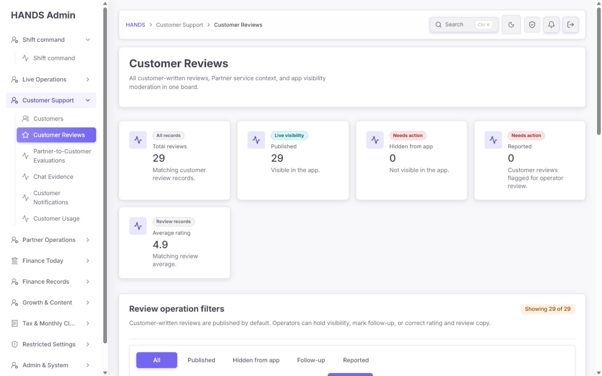

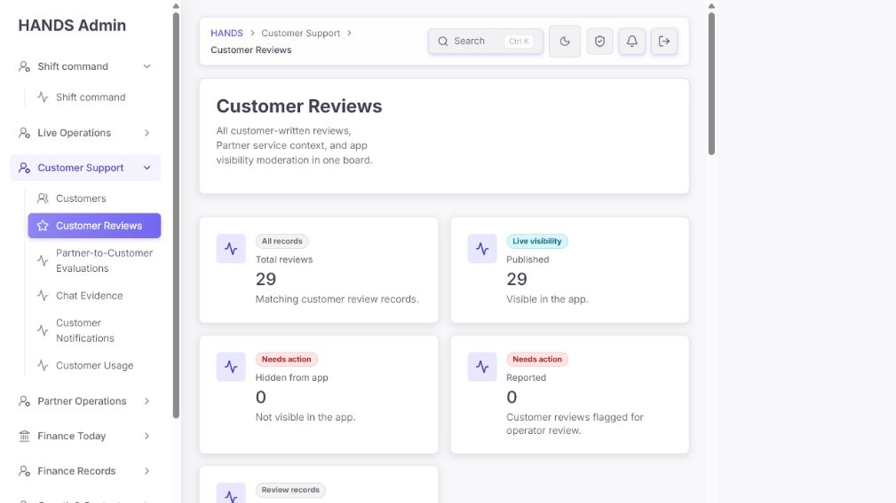

- 장점: 총 리뷰, 공개, 숨김, 신고, 평균 평점을 한눈에 볼 수 있다.
- 문제: 0건인 `Hidden`과 `Reported`도 큰 카드로 표시되고, 5번째 카드는 빈 줄을 만든다.
- 문제: 상태·검색 필터가 적용된 요약에도 `All records` 같은 표현이 남아 전체 모수처럼 보일 수 있다.
- 수정: 큰 카드 5개를 없애고 제목 아래 한 줄짜리 compact summary로 바꾼다. `Results 29 · Visible 29 · Needs review 0 · Hidden 0 · Avg 4.9` 정도면 충분하다.
- 추가: 운영 우선순위가 필요한 경우 `Needs review`만 강조 색을 사용하고 나머지는 중립색으로 둔다.

### 3) 필터와 기간 선택 — 위험

- 상태, 기간, 정렬, 검색, 페이지 크기, 내보내기를 제공한다는 점은 좋다.
- 그러나 각 segmented control에는 접근성 이름만 있고 화면에 보이는 그룹 제목이 없다. 운영자는 첫 줄이 상태인지, 두 번째가 기간인지 빠르게 추론해야 한다.
- Custom dates의 `Date from`, `Date to`는 코드상 레이블이 있으나 기본값이 hidden이라 화면에서는 빈 날짜 입력 두 개로 보인다.
- 시작일이 종료일보다 늦으면 오류를 보여주지 않고 코드가 두 날짜를 자동으로 뒤집는다. 입력 실수를 숨기는 방식이다.
- `Review request date`, `Newest request`라는 문구는 실제 서버 동작과 다르다. 서버는 리뷰 `createdAt`을 필터·정렬하지만 표의 Request Time은 booking `openedAt`을 우선 표시한다.

권장 수정:

1. 그룹 제목을 `Status`, `Submitted date`, `Sort`, `Search`로 항상 보이게 한다.
2. `Review request date` → `Submitted date`.
3. `Newest request` → `Most recently submitted`, `Oldest request` → `Oldest submitted`.
4. Custom 필드의 `From`, `To`를 시각적으로 표시한다.
5. 빈 Custom dates를 허용하지 않거나, 둘 다 비었으면 명시적으로 `All dates`로 정규화한다.
6. From > To이면 자동 교환하지 말고 `From date must be on or before To date` 오류를 보여준다.
7. `Clear filters`의 결과 범위를 제품 계약으로 정하고 테스트한다. 권장은 All dates/Newest/10 rows다.

### 4) 리뷰 목록과 표 — 위험

표는 `Request Time / Partner / Customer / Review / Visibility / Actions` 6열이며 CSS가 최소 1320px로 고정되어 있다. 실제 측정 결과 표의 스크롤 폭은 1320px, 가용 폭은 1440 화면에서도 1052px로 268px 넘쳤다. 1265 화면에서는 428px 넘쳤다.

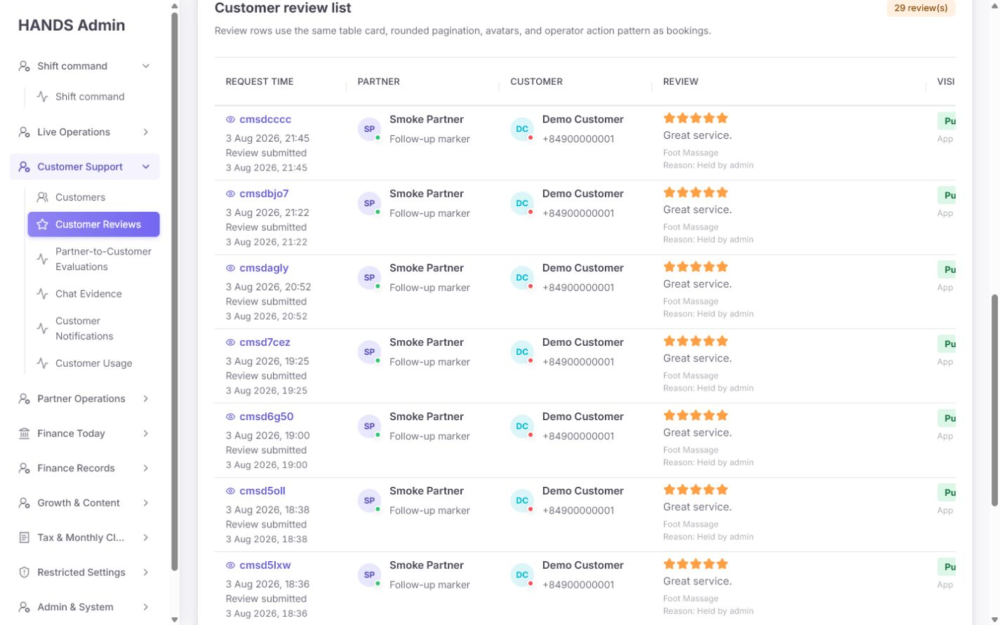

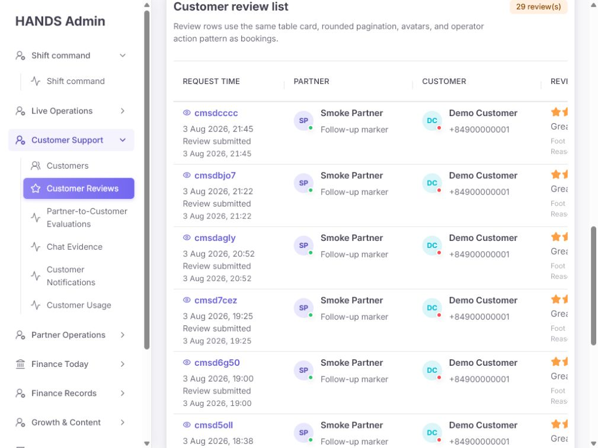

- 운영 영향: 행을 식별하려면 왼쪽을 보고, 상태 변경을 하려면 10개 행 아래의 가로 스크롤까지 내려가 오른쪽으로 이동해야 한다. 이동 후에는 booking/partner 문맥이 사라진다.
- 표의 설명 `Review rows use the same table card... as bookings.`는 운영 목적이 아니라 컴포넌트 구현을 설명한다.
- `Request Time` 셀에서 booking ID, booking 시간, `Review submitted` 시간이 반복된다. 어떤 시간이 현재 필터와 정렬의 기준인지 불명확하다.
- 첫 셀은 booking short ID를 표시하지만 작업 버튼 접근성 이름은 review short ID를 사용한다. 한 행에 서로 다른 두 ID가 설명 없이 등장한다.
- 모든 행에 고객 전화번호가 노출되고, 파트너·고객의 앱 온라인 점이 표시된다. 리뷰 모더레이션 결정에는 대체로 불필요하며 개인정보 노출과 시각적 잡음만 늘린다.

권장 표 구조:

| 열 | 1차 표시 | 2차 표시 |
|---|---|---|
| Submitted | 리뷰 제출 시각 | booking short ID와 booking 시각 |
| Review | 별점 + 2줄 문구 | 서비스 |
| Parties | 고객명 / 파트너명 | 전화번호는 권한 있는 상세에서만 |
| State | Visible / Needs review / Hidden | 현재 결정 사유와 처리 시각 |
| Actions | 항상 보이는 `Review` 또는 `⋯` | sticky right |

- 1024px 이하에서는 고정 폭 표를 유지하지 말고 행 카드 또는 master-detail 목록으로 전환한다.
- 데스크톱 표를 유지한다면 Review를 320px 내에서 clamp하고, 상태·작업 열을 오른쪽 sticky로 둔다.
- `Customer review list` 설명은 `Review customer feedback, visibility, and moderation history.`로 바꾼다.

### 5) 행 작업 메뉴 — 위험

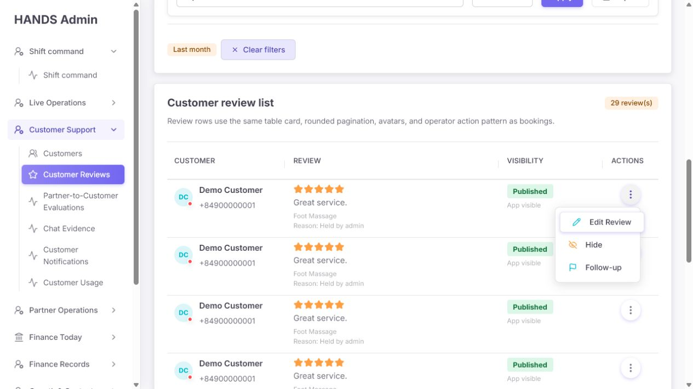

- 장점: 현재 상태에 따라 불가능한 작업을 메뉴에서 제거하고, Edit/Hide/Follow-up을 한 곳에 모았다.
- 문제: 메뉴 자체가 표 오른쪽 끝에 있어 가로 스크롤 전에는 접근하기 어렵다.
- 문제: `Follow-up`은 단순히 업무 메모를 추가하는 것처럼 들리지만 실제로 `REPORTED`로 바꾸며 앱 노출도 중단한다. 설명과 확인 화면에 이 영향이 드러나지 않는다.
- 문제: Hide는 고정 사유 `Hidden by admin`, Follow-up은 `Marked for follow-up`만 전송한다. 실제 이유를 기록할 수 없다.

권장:

- `Follow-up`을 독립 상태로 만들지 않을 거면 `Report / hold from app` 또는 `Send to review queue`로 명확히 바꾸고 “This removes the review from the app until resolved”를 표시한다.
- 작업 전에 `Reason category`를 필수로 하고 선택적으로 운영 메모를 받는다.
- 카테고리 예: `Abusive content`, `Personal information`, `Wrong booking`, `Fraud/spam`, `Customer dispute`, `Policy exception`, `Other`.
- 단순 후속 연락이 필요하다면 노출 상태와 분리된 case/assignment 필드로 다룬다.

### 6) Edit Review — 매우 위험

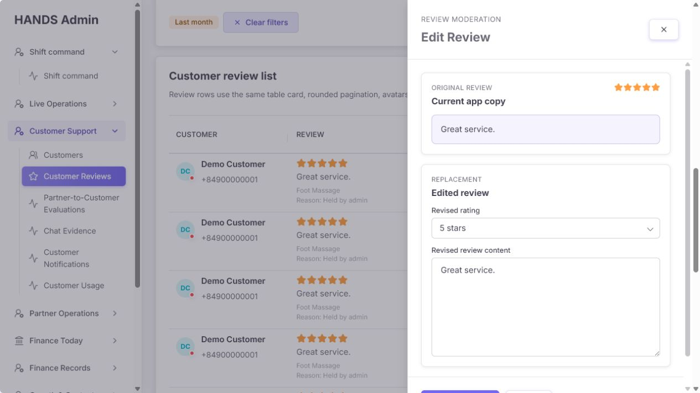

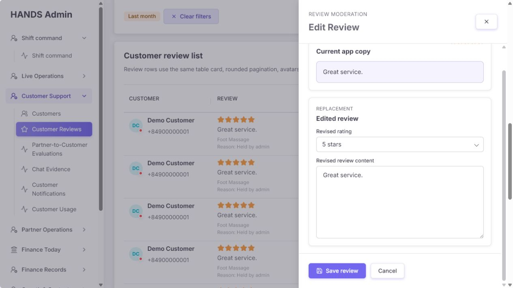

UI는 Original과 Replacement를 나란히 이해시키려는 의도가 좋고, dialog·focus 처리도 구현되어 있다. 그러나 데이터 안전성은 부족하다.

- `Original review`는 실제 불변 원본이 아니라 현재 DB의 comment/rating을 다시 보여줄 뿐이다.
- 저장 시 review의 canonical `rating`과 `comment`를 직접 덮어쓴다.
- 감사 로그에는 변경 후 status/rating/comment/reason만 들어가며 변경 전 값이 없다.
- rating 변경 후 Published 리뷰 집계로 파트너 `ratingAvg`와 `reviewCount`를 다시 계산한다.
- 수정 사유 입력이 없고 기존 `reportReason`을 hidden input으로 그대로 보낸다.
- 저장 후 성공 메시지나 변경 요약 없이 기존 목록으로 돌아간다.

최소 안전 기준:

1. 현재 구조가 유지되는 동안 일반 운영자에게 rating/comment 편집을 비활성화한다.
2. 꼭 필요하면 원본 `sourceRating/sourceComment`는 불변으로 두고 `displayRatingOverride/displayCommentOverride`를 별도 저장한다.
3. 모든 수정에는 reason code, 운영 메모, actor, before, after, timestamp를 남긴다.
4. rating override는 파트너 평점에 반영되는지 명시하고 고권한 또는 2차 승인을 요구한다.
5. 드로어에는 고객, 파트너, booking, 현재 노출 상태와 “앱/파트너 평점에 미치는 영향”을 표시한다.
6. 버튼 문구를 `Save review` 대신 `Save moderated copy`처럼 결과가 분명하게 바꾼다.

### 7) Hide/Follow-up 확인 — 실패

Last month 범위에서 Hide를 누르면 다음과 같이 필터가 빠진 URL로 이동했다.

`/reviews?confirm=moderate&reviewId=...&status=HIDDEN&reportReason=Hidden+by+admin`

페이지는 기본 Today로 돌아가고 Today 결과에 대상 리뷰가 없으므로 확인 데이터 생성이 실패한다. 화면에는 오류도 확인 카드도 나타나지 않는다.

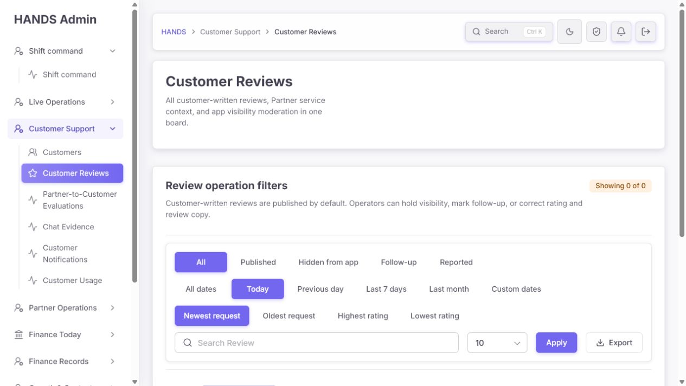

수동으로 `dateRange=30d`를 보존했을 때만 확인 카드가 나타났다.

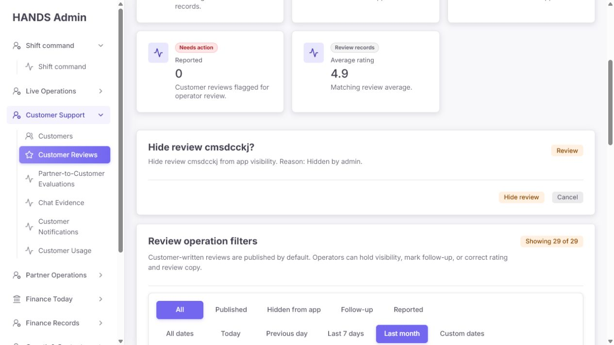

- 원인 1: 행 작업 href가 현재 `pathname + searchParams`를 받지 않고 reviewId/status만 사용한다.
- 원인 2: 확인 데이터는 현재 목록에 로드된 `reviews.find()`로만 찾는다. 필터나 페이지 밖의 리뷰는 확인할 수 없다.
- 원인 3: Cancel은 항상 `/reviews`라서 Today로 돌아간다.
- 원인 4: 확인 form에는 `returnTo`가 없다. 반면 Edit 드로어는 이미 안전한 `returnTo` 패턴을 사용한다.
- 추가 문제: 확인 카드에는 리뷰 문구, 별점, 고객, 파트너, booking, 현재 상태가 없고 short ID만 있다.

권장 구현:

1. 기존 Edit의 `returnTo` 패턴을 Hide/Publish/Follow-up에도 재사용한다.
2. 확인 대상은 현재 page rows에서 찾지 말고 ID 단건 API로 조회한다.
3. confirm/cancel/submit 모두 동일한 안전한 returnTo를 보존한다.
4. 확인 카드에 rating, review excerpt, customer, partner, booking, current → next visibility, 필수 reason을 보여준다.
5. 성공 후 `Review hidden from app` 같은 toast, 실패 시 inline error와 재시도 버튼을 제공한다.

### 8) Hidden / Reported / Follow-up 큐 — 실패

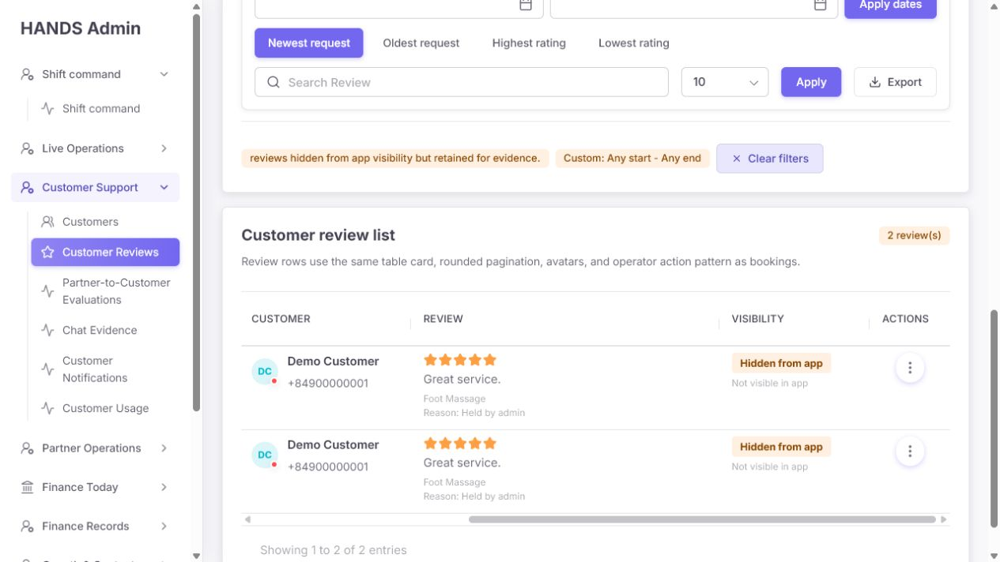

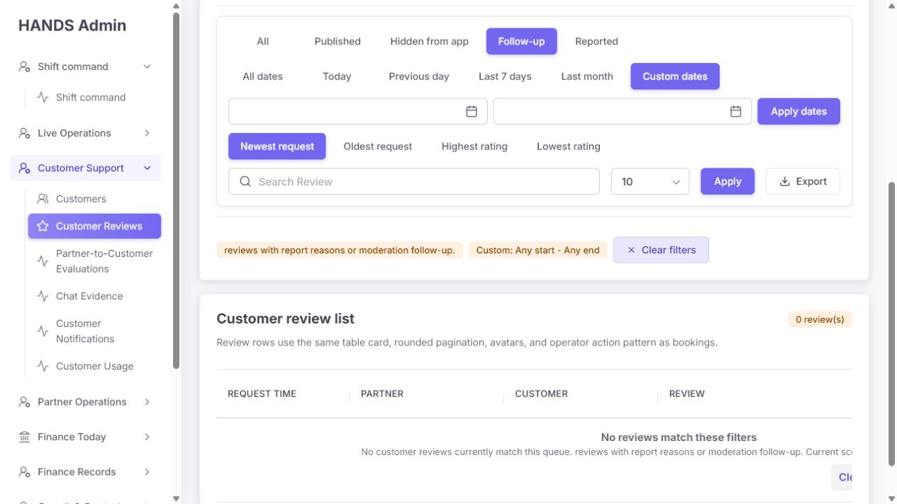

- Hidden 2건은 조회되며 상태는 올바르게 `Hidden from app / Not visible in app`으로 보인다.
- 그러나 Published 행에도 `Reason: Held by admin`이 남아 현재 상태와 사유가 충돌한다.
- `partnerReviewHint()`는 status가 REPORTED이거나 reportReason만 있어도 `Follow-up marker`를 표시한다. 그래서 Published 행에도 Follow-up marker가 반복된다.
- 프런트 로컬 필터는 `reportReason`이 있으면 Follow-up으로 간주하지만 API는 Follow-up과 Reported를 모두 `status = REPORTED`로 처리한다.
- 빈 상태도 1320px 표 안에 들어가므로 메시지와 `Clear filters`가 오른쪽에서 잘린다.
- `No customer reviews currently match this queue. reviews...`처럼 마침표 뒤 문장이 소문자로 시작한다.

권장 상태 모델은 세 가지 중 하나로 단순화한다.

- `Visible`: 앱 공개.
- `Needs review`: 현재 판단/분쟁/신고 큐. 기본적으로 앱 비공개 여부를 별도 명시.
- `Hidden`: 운영 판단이 끝나 앱 비공개.

그리고 `needsFollowUp`, 담당자, dueAt 같은 업무 상태가 필요하면 visibility와 분리한다. `Reported`와 `Follow-up`을 같은 서버 상태로 둘 거면 화면에서 둘 중 하나를 삭제한다.

### 9) 검색·정렬·페이지네이션·내보내기 — 위험

- 검색은 review ID, booking ID, 고객/파트너 이름·전화, 문구, 사유 등을 서버에서 찾을 수 있어 범위는 충분하다.
- 페이지네이션은 현재 필터를 보존한다.
- Edit 저장은 현재 URL을 `returnTo`로 보존하는 좋은 패턴이 이미 있다.
- 내보내기는 현재 필터를 반영하지만 한 번에 `pageSize: 100`만 요청한다. API도 최대 100건으로 제한한다.
- 실제 All-time 172건 기준으로 72건이 누락될 수 있고 파일명은 항상 `hands-customer-reviews.csv`라 범위도 알 수 없다.

권장:

1. export endpoint가 totalCount를 확인하고 서버 측 페이지를 순회해 전체 결과를 생성한다.
2. 다운로드 전 예상 행 수와 현재 범위를 표시한다.
3. 파일명에 범위를 넣는다. 예: `customer-reviews_2026-07-08_2026-08-06.csv` 또는 `customer-reviews_all_2026-08-06.csv`.
4. 실패 시 빈 CSV를 반환하지 말고 명확한 HTTP 오류와 운영자 메시지를 보여준다.
5. `172 rows exported` 같은 완료 피드백을 제공한다.

### 10) 반응형·접근성 — 보통 이하

좋은 점:

- 표 구조와 column headers가 semantic table로 노출된다.
- segmented controls, 검색, 날짜, 행 작업은 접근성 이름을 갖고 있다.
- Edit는 dialog, backdrop, focus 관리가 구현되어 있다.
- 서버 로드 실패 시 0건으로 위장하지 않고 별도의 `Review data unavailable` 오류 상태를 제공한다.

개선점:

- 키보드 사용자는 표 하단의 가로 스크롤과 오른쪽 작업 열까지 긴 이동이 필요하다.
- Custom 날짜 레이블은 screen-reader에는 있지만 시각적 운영자에게 숨겨져 있다.
- 상태 의미를 색만으로 전달하지는 않지만 작은 회색 helper 텍스트의 가독성이 약하다.
- 편집 드로어의 Save/Cancel이 720px 높이에서 처음부터 보이지 않아 내부 스크롤이 필요하다.
- 빈 상태는 고정 폭 테이블 안에 렌더링되어 1024·1265 폭에서 잘린다.

## 4. 우선순위별 수정 요건

### P0 — 배포 전 차단 수준

1. **All dates 계약 수정**: `/reviews`, All dates, Clear filters가 동일한 의도로 작동하도록 한다.
2. **행 작업 문맥 보존**: 필터·검색·정렬·페이지를 유지한 채 confirm/cancel/submit이 작동하도록 한다.
3. **리뷰 원본 불변성 확보**: canonical 고객 평점/문구 직접 편집을 중지하고 before/after 감사와 사유를 보장한다.
4. **완전한 CSV 내보내기**: 100건 하드캡으로 인한 조용한 누락을 제거한다.
5. **상태 모델 정합성**: Follow-up/Reported/reportReason/visibility의 계약을 프런트와 API에서 하나로 맞춘다.

### P1 — 운영 효율·오판 방지

1. 1440px에서도 작업 열이 보이는 표 또는 master-detail 목록으로 변경한다.
2. Published 행에서 과거 hold reason과 Follow-up marker를 현재 상태처럼 표시하지 않는다.
3. Follow-up이 앱 비공개를 유발하면 작업 메뉴와 확인 단계에서 명시한다.
4. 확인 카드에 리뷰·고객·파트너·booking·현재/다음 상태·사유를 제공한다.
5. Submitted date 기준으로 필터/정렬/표 문구와 API를 통일한다.
6. 시각적 날짜 레이블, 잘못된 범위 검증, 빈 Custom 처리 규칙을 제공한다.
7. 성공/실패 결과와 변경 요약을 표시한다.
8. 전화번호와 온라인 점을 기본 목록에서 제거하거나 최소 공개한다.

### P2 — 문구·밀도·일관성

1. 5개 큰 KPI 카드를 compact summary로 줄인다.
2. 컴포넌트 구현을 설명하는 문구를 운영 목적 문구로 교체한다.
3. `review(s)`를 자연스러운 복수형으로 처리한다.
4. 필터 설명 문장의 소문자 시작과 `Custom: Any start - Any end` 문구를 수정한다.
5. booking ID와 review ID를 명시적으로 구분한다.
6. 평균 평점은 결과가 없을 때 0.0 대신 `—`를 사용한다.

## 5. 제거·유지·추가할 요소

### 제거 또는 축소

- 0건까지 큰 카드로 반복하는 5개 KPI 영역
- `Review rows use the same table card...` 같은 개발자 문구
- 모든 행의 온라인/오프라인 점
- 모든 행의 전체 전화번호
- 상태와 무관하게 반복되는 `Follow-up marker`
- 서버에서 같은 의미인 별도 `Follow-up` 탭

### 유지

- 검색, 기간, 상태, 정렬, 페이지 크기, CSV의 기본 기능
- 명시적인 confirm 단계
- Published/Hidden/Needs review 상태 배지
- Edit 드로어의 원본/변경본 비교 구조
- semantic table, dialog, focus 관리
- API 실패를 빈 데이터와 구분하는 오류 상태
- Edit에 이미 구현된 안전한 `returnTo` 패턴

### 추가

- 필수 reason category + optional note
- 담당자/기한이 필요한 경우 visibility와 분리된 follow-up case
- immutable original + moderated display override
- before/after moderation history
- 단건 review confirmation 조회
- 작업 결과 toast와 실패 inline error
- 내보낼 건수/범위 및 실제 완료 건수
- 1024px 이하 master-detail 또는 행 카드

## 6. 권장 화면 구성

```text
Customer Reviews                                      Export current view
Moderate customer feedback and app visibility.

Results 172 | Visible 170 | Needs review 0 | Hidden 2 | Avg 5.0

[All] [Needs review] [Hidden]
Status      [ ... ]
Submitted   [All dates] [Today] [7 days] [30 days] [Custom]
Search      [customer, partner, booking, review...]   Sort [Newest submitted]

┌ Submitted ┬ Review                 ┬ Parties              ┬ State         ┬ Actions ┐
│ 3 Aug 21:45│ ★★★★★ Great service…  │ Demo / Smoke Partner │ Visible       │ Review  │
│ Booking …  │ Foot Massage           │                       │ Last changed… │   ⋯     │
└────────────┴────────────────────────┴──────────────────────┴───────────────┴─────────┘
```

`Actions`는 오른쪽에 고정하고, 행을 클릭하면 우측 상세 패널에서 전체 리뷰, booking, 고객/파트너, 원본, 현재 앱 문구, moderation history를 보여준다. Hide/Publish/Needs review는 이 패널에서 수행하도록 하면 가로 스크롤과 잘못된 대상 작업을 함께 줄일 수 있다.

## 7. 권장 문구 교체안

| 현재 | 권장 |
|---|---|
| All customer-written reviews, Partner service context, and app visibility moderation in one board. | Review customer feedback, app visibility, and moderation history. |
| Review operation filters | Review filters |
| Customer-written reviews are published by default... | Find reviews and manage whether they appear in the customer app. |
| Review request date | Submitted date |
| Newest request | Most recently submitted |
| Request Time | Submitted / Booking |
| Follow-up | Needs review |
| Hidden from app | Hidden |
| Review rows use the same table card... | Review feedback and complete moderation work. |
| Showing 29 of 29 | 29 results |
| 29 review(s) | 29 reviews |
| Custom: Any start - Any end | All dates 또는 From … to … |
| Reason: Held by admin (Published 행) | 표시하지 않음. History에서 Last moderation reason으로 표시 |
| Save review | Save moderated copy |

## 8. 코드 근거와 수정 지점

| 영역 | 파일/근거 | 수정 방향 |
|---|---|---|
| 기본 Today | `apps/admin_web/app/reviews/review-page-model.ts:842` | 기본값과 all URL 직렬화 계약 통일 |
| all 파라미터 생략 | `review-page-model.ts:406` | `dateRange=all`을 명시하거나 기본값을 all로 변경 |
| confirm URL 문맥 손실 | `review-action-confirmation.ts:50`, `review-page-actions.ts:21-43` | 현재 returnTo를 confirm href에 포함 |
| Cancel 문맥 손실 | `review-action-confirmation.ts:93` | 안전한 returnTo 사용 |
| confirm 대상 현재 page 의존 | `review-action-confirmation.ts:84` 부근 | 단건 API로 대상 로드 |
| Edit의 좋은 returnTo 패턴 | `review-row-actions.tsx:53,185` | 다른 moderation 작업에 재사용 |
| canonical 덮어쓰기 | `apps/api/src/admin/admin.service.ts:25491-25497` | immutable source + display override 또는 편집 차단 |
| before 없는 audit | `admin.service.ts:25504-25513` | before/after/actor/reason 기록 |
| 평점 집계 영향 | `admin.service.ts:25501` 부근 | UI에 영향 표시, 권한/승인 강화 |
| Follow-up 서버 중복 | `admin.service.ts:36972-36982` | Reported와 통합하거나 별도 업무 상태 구현 |
| Follow-up 프런트 불일치 | `review-page-model.ts:593-599` | API와 동일한 계약 공유 |
| 모든 reason 표시 | `review-page-model.ts:128` | 현재 상태 reason과 history 분리 |
| partner marker 오용 | `review-page-model.ts:652-660` | party helper에서 제거 |
| 표 1320px 고정 | `apps/admin_web/app/globals.css:20902` | responsive/sticky/master-detail |
| Review 열 360px | `globals.css:20945` | clamp와 상세 패널 사용 |
| CSV 100건 | `apps/admin_web/app/reviews/export/route.ts:26`, API max 100 | 페이지 순회 또는 export 전용 스트림 |
| 로드 오류 분리 | `apps/admin_web/app/reviews/page.tsx:111` | 현재 구현 유지 |

## 9. 완료 판정 기준

다음 조건을 모두 만족해야 리뷰 페이지 개선이 완료된 것으로 본다.

1. `/reviews`의 기본 범위와 All dates/Today 활성 상태가 일치한다.
2. All dates에서 실제 172건이 조회되고 빈 Custom 우회가 필요 없다.
3. `dateRange=30d&page=2&sort=...&q=...`에서 Hide를 눌러도 확인 대상이 보인다.
4. Cancel과 완료 후 동일한 필터·검색·정렬·페이지로 돌아온다.
5. 확인 화면에 review text, rating, customer, partner, booking, current state, next state, reason이 보인다.
6. Follow-up과 Reported가 같은 서버 상태라면 탭 하나만 남는다.
7. Published 행에는 현재 상태로 오해할 `Held by admin`과 `Follow-up marker`가 보이지 않는다.
8. 고객 원본 rating/comment가 수정 작업으로 덮어써지지 않는다.
9. 모든 moderation 이벤트에 actor, before, after, reason, timestamp가 남는다.
10. 172건 범위의 CSV가 172행을 포함하거나, 제한이 있다면 실행 전에 명확히 고지한다.
11. 1024px와 1440px에서 상태와 작업 버튼이 가로 스크롤 없이 보인다.
12. Custom From/To 레이블이 화면에 보이고 역전 범위는 오류로 안내한다.
13. 작업 성공/실패가 화면에서 확인 가능하다.
14. 키보드만으로 필터 → 행 → 확인 → 취소/완료를 수행하고 초점이 원래 위치로 돌아온다.

## 10. 검증 시나리오

### 기능

- 기본, All dates, Today, Last 30 days, Custom empty, Custom reversed
- Published, Hidden, Needs review 상태별 조회
- 1페이지와 2페이지에서 Publish/Hide/Needs review confirm/cancel
- 검색·정렬·페이지 크기 조합을 유지한 작업
- 0건, 1건, 100건, 101건, 172건 CSV
- API list 실패, summary 실패, patch 실패

### 데이터 신뢰성

- 고객 원본과 moderated display가 분리되는지
- before/after와 actor가 감사 로그에 남는지
- rating override가 파트너 평점에 미치는 영향이 정책대로인지
- Published 전환 시 과거 reason이 현재 reason으로 노출되지 않는지

### 화면·접근성

- 1024×768, 1280×720, 1440×900, 1920×1080
- 200% 확대, 키보드 전용, screen reader 이름
- 긴 고객명, 긴 파트너명, 2000자 리뷰, 서비스 여러 개
- drawer의 첫 초점, Esc 닫기, 완료/취소 후 초점 복귀

## 11. 감사 한계

- 실제 데이터 변경을 피하기 위해 Hide/Publish/Follow-up/Edit의 최종 제출은 수행하지 않았다.
- 라이트 모드를 중심으로 검사했다. 다크 모드의 색 대비는 별도 확인이 필요하다.
- 현재 감사의 수치는 2026-08-06 로그인 세션과 당시 데이터에 기반한다.

