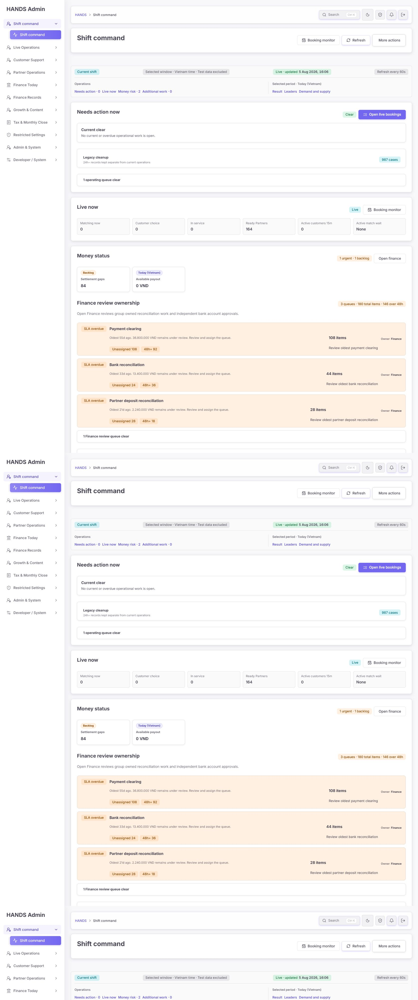
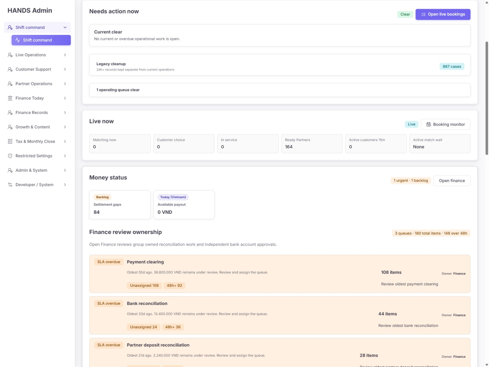
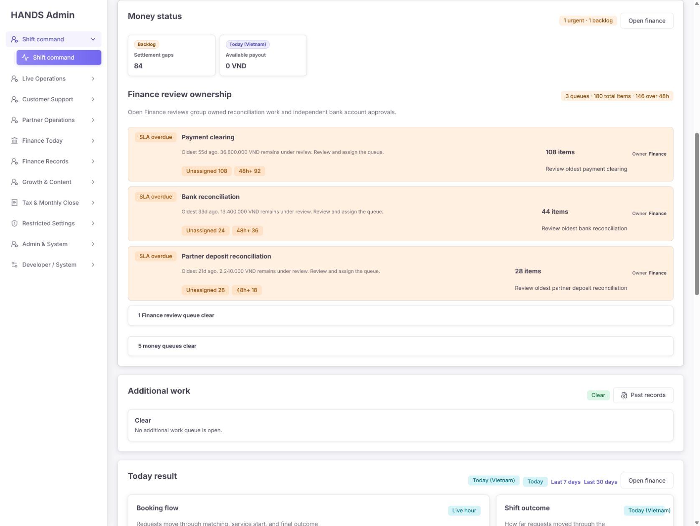
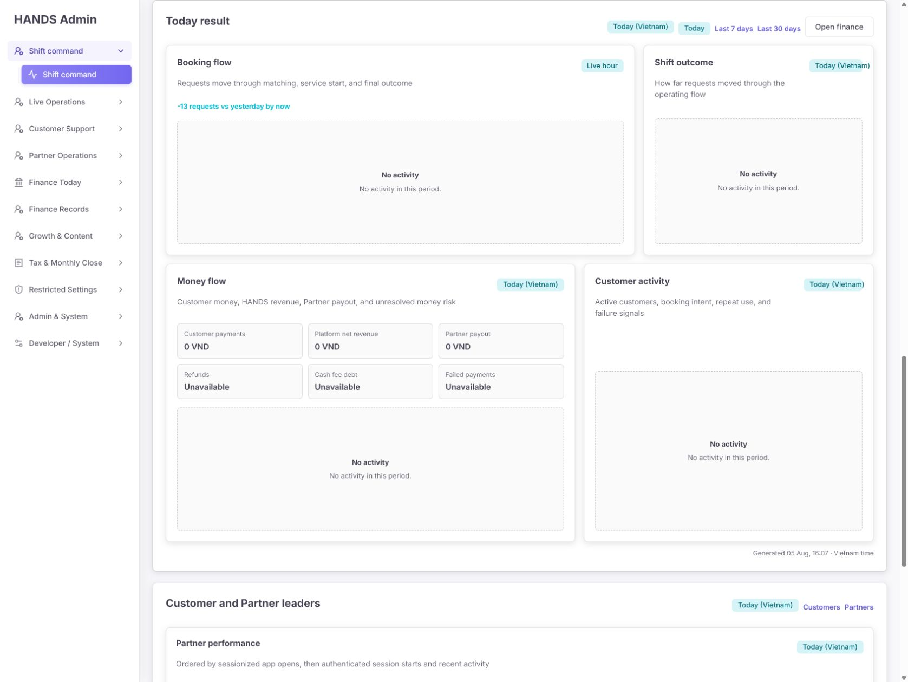
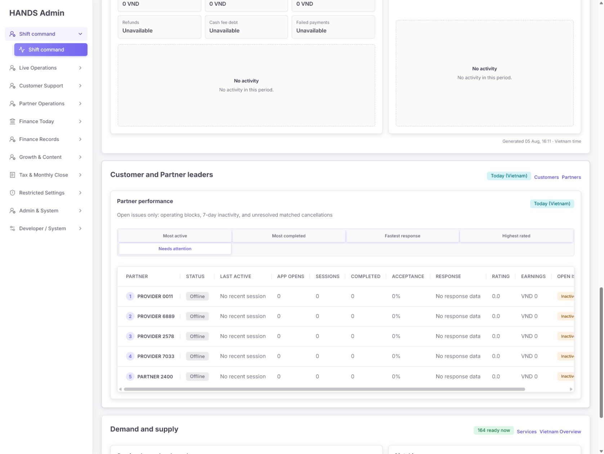
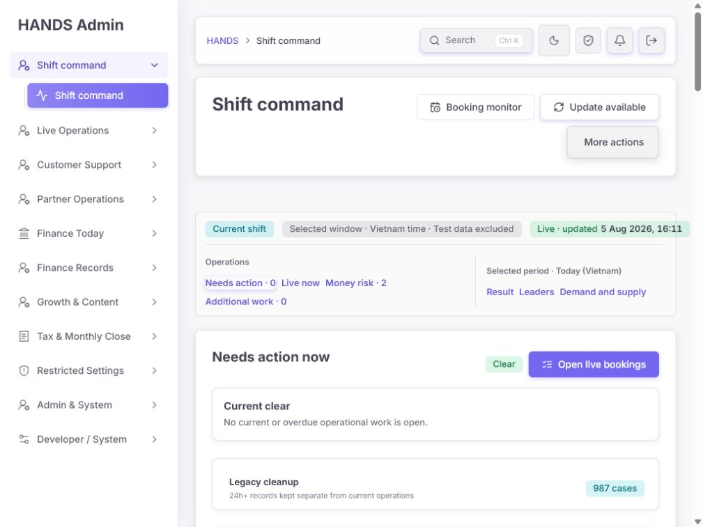
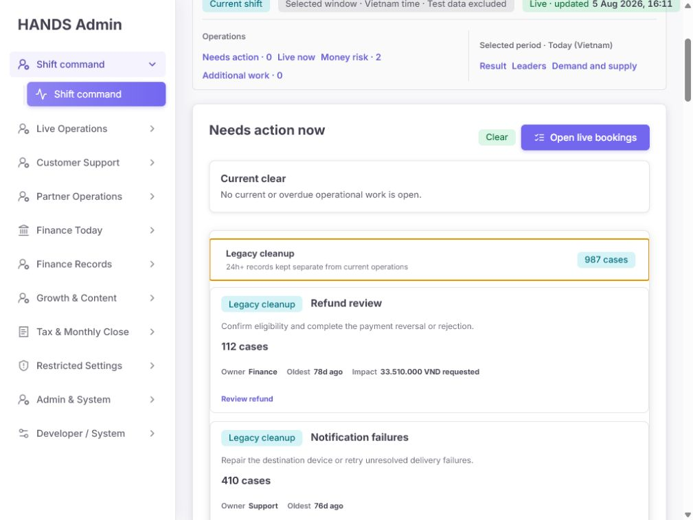

# HANDS Admin — Shift Command 운영자 관점 심층 감사

- 감사 일시: 2026-08-05 16:06–16:11 (Vietnam time)
- 대상: `apps/admin_web` 첫 화면 `/` — Shift Command
- 감사 방식: 로그인된 실제 화면 캡처, 1024px 작은 노트북 검증, 상호작용 확인, 화면 코드와 API 집계 코드 대조
- 변경 범위: 분석과 보고서만 수행. 애플리케이션 코드는 수정하지 않음

## 1. 결론

현재 화면은 데이터 출처, 현재/과거 구분, 직접 이동 링크를 갖춘 점은 좋다. 그러나 **운영자가 다음에 무엇을 해야 하는지 결정하는 첫 화면**으로는 우선순위가 뒤집혀 있다.

화면 상단은 `Needs action · 0`, `Current clear`, 초록색 `Clear`를 가장 강하게 보여준다. 하지만 같은 화면에는 다음 미처리 업무가 존재한다.

- Finance review: 180건, 이 중 146건이 48시간 초과
- Legacy cleanup: 987건
  - Refund review 112건, 33,510,000 VND, 최장 78일
  - Notification failures 410건, 최장 76일
  - Payment holds 371건, 138,500,000 VND, 최장 75일
  - Cash reconciliation 89건, 7,120,000 VND, 최장 40일
  - Cancellation review 4건, 최장 21일
  - Partner approvals 1건, 최장 12일

시간 구간을 분리한 의도는 맞지만, 24시간을 넘겼다는 이유만으로 금전·환불·알림 실패를 청록색 `Legacy cleanup`으로 낮추면 위험도가 사라진 것처럼 보인다. **현재 운영 0건과 전체 미해결 위험 0건은 같은 의미가 아니다.**

최우선 개선 방향은 예쁜 카드 추가가 아니라 아래 네 가지다.

1. 첫 화면 최상단에 전체 업무를 합친 `Next action`을 한 건만 명확히 제시한다.
2. `Current clear`를 `현재 실시간 운영 건 없음`으로 한정하고, 금융·과거 미처리는 별도 위험으로 동시에 노출한다.
3. 담당 조직이 아니라 실제 배정 상태(`Unassigned`, `Mine`, 담당자명)를 표시한다.
4. 운영에 필요하지 않은 빈 차트, Clear 대기열 박스, 중복 링크를 기본 화면에서 제거한다.

## 2. 화면 증거

### Step 1 — 전체 페이지: 위험

기본 화면은 1024px 높이 768 기준 약 4,889px로, 약 6.4개 화면을 스크롤해야 한다. 기본 DOM에는 링크 68개, 버튼 11개, disclosure 5개, 제목 28개가 있다. 운영자가 긴급 건을 찾기 전에 상당량의 상태·분석 정보를 훑어야 한다.

### Step 2 — 현재 조치와 Live now: 주의

`Current clear`와 `Open live bookings`가 가장 강하지만 실제 live booking은 모두 0이다. 반면 바로 아래 금융 위험이 존재한다. 조치가 없을 때 보라색 주 CTA를 계속 유지하면 운영자는 빈 Booking monitor로 이동하게 된다.

### Step 3 — 금융 상태: 위험

상단 배지는 `1 urgent · 1 backlog`라고 표시하지만 실제로는 Finance review 3개 대기열, 180건, 48시간 초과 146건이다. `1`이 건수인지 대기열 종류인지 설명이 없어 심각도가 축소된다. 각 카드도 실제 담당자가 아니라 `Owner Finance`만 보여준다.

### Step 4 — 오늘 결과: 개선 필요

활동이 없을 때 4개의 큰 카드가 각각 같은 `No activity` 빈 상태를 반복한다. `-13 requests vs yesterday by now`와 `No activity`도 함께 보여 의미 해석이 어렵다. 빈 기간이라면 한 줄 요약과 `Last 7 days` 이동만 남기는 편이 빠르다.

### Step 5 — Partner 성과: 위험

기본 선택인 `Most active`는 비어 있지만 `Needs attention` 탭에는 실제 행이 있다. 운영자는 다른 탭을 직접 눌러야 주의 대상을 발견한다. 5개 탭을 4열 CSS에 넣어 다섯 번째 탭이 혼자 다음 줄로 떨어지고, 테이블은 넓은 화면에서도 가로 스크롤이 필요하다. `Provider 0011` 같은 레거시/합성 가능성이 높은 이름도 `Test data excluded` 신뢰를 떨어뜨린다.

### Step 6 — 1024px 상단: 위험

`More actions` 메뉴는 열렸지만 빈 사각형만 보인다. `Refresh every 60s`도 상태 줄에서 잘린다. 작은 노트북은 실제 관리자 업무에서 흔한 해상도이므로 이 상태는 반응형 미세 조정이 아니라 기능 장애다.

### Step 7 — Legacy cleanup 확장: 위험

987건의 구성은 환불, 승인 결제 보류, 현금 정산, 알림 실패 등 실제 책임과 금액이 있는 업무다. 현재는 초록색 `Current clear` 바로 아래에서 정보성 청록색으로 처리되어 위험 수준이 약하게 보인다.

## 3. 잘된 부분

1. API는 `Promise.allSettled`로 요약 소스를 분리해 일부 소스 실패가 전체 화면을 막지 않도록 구성되어 있다. `apps/api/src/admin/admin.service.ts:4207-4273`
2. 화면은 데이터 없음, 오래된 데이터, 사용 불가 상태를 구분할 기반을 갖고 있다. `apps/admin_web/app/page.tsx:496-599`, `apps/admin_web/app/dashboard-trace-summary.tsx:30-71`
3. 자동 새로고침은 운영자가 컨트롤을 조작 중이면 즉시 화면을 바꾸지 않고 `Update available`로 보류한다. 운영 중 입력 맥락을 보존하는 좋은 동작이다. `apps/admin_web/components/start-shift-refresh-button.tsx:21-53`
4. 현재/초과/24시간 이상을 코드에서 분리하고, 오래된 건을 접힌 영역으로 보낸 방향 자체는 타당하다. `apps/admin_web/app/start-shift-action-priority.ts:65-87`
5. 각 카드가 실제 업무 목록으로 이동하는 deep link를 갖고 있어 수정 후 좋은 command surface가 될 기반이 있다.

## 4. 우선순위별 상세 문제와 수정 요건

### SC-001 [P1] 전역 우선순위가 실제 위험과 다르다

근거:

- 조치 항목이 없으면 주 CTA가 무조건 `/bookings`, `Open live bookings`로 대체된다. `apps/admin_web/app/page.tsx:782-786`
- Finance review는 `Needs action now` 계산에 합쳐지지 않고 아래 별도 섹션에만 렌더링된다. `apps/admin_web/app/page.tsx:840-911`, `1138-1315`
- 결과적으로 화면은 `Clear`를 강조하면서 146건의 48시간 초과 금융 업무를 아래에 둔다.

수정 방법:

- `current/overdue operational`, Finance review, data unavailable을 하나의 `globalPriorityItems`로 합친다.
- 정렬 기준은 `사용 불가 → SLA 초과 → 미배정 → 내 업무 → 현재 고객 대기 → 금액 영향` 순으로 단순화한다.
- 첫 번째 항목 하나를 `Next action` 카드로 표시하고, 해당 deep link를 주 CTA로 사용한다.
- 실제 조치가 전혀 없을 때만 주 CTA를 숨기거나 보조 버튼으로 내린다.

완료 기준:

- 현재 데이터라면 첫 CTA가 빈 Booking monitor가 아니라 가장 오래된 Finance review 또는 미배정 대기열을 가리킨다.
- `현재 실시간 업무 없음`과 `전체 위험 없음`이 서로 다른 문구와 상태로 표시된다.

### SC-002 [P1] More actions 메뉴가 CSS에 잘려 사용할 수 없다

근거:

- 메뉴는 DOM상 열려 있고 `display:grid`, `visibility:visible`이지만 부모 `DETAILS`의 `overflow:hidden`에 잘린다.
- 공통 `.admin-disclosure`가 `overflow: hidden`이다. `apps/admin_web/app/globals.css:3005-3012`
- 메뉴는 absolute 위치를 사용한다. `apps/admin_web/app/globals.css:18828-18840`
- 해당 dropdown은 `AdminDisclosure`를 재사용한다. `apps/admin_web/app/page.tsx:1046-1092`

권장 수정:

- 이 메뉴의 항목은 Operations History, Cash settlements, Payments, Notifications로 대부분 사이드바·본문과 중복된다.
- 가장 작은 수정은 **More actions를 제거**하고, 필요하면 유일한 가치가 있는 `Operations History`만 보조 링크로 남기는 것이다.
- 메뉴를 유지해야 한다면 `.admin-page-header-more-dropdown { overflow: visible; z-index: ... }`처럼 이 인스턴스만 예외 처리하고 1024px에서 메뉴가 보이는지 검증한다.

완료 기준:

- 메뉴를 열었을 때 모든 항목이 보이고 키보드로 접근 가능하거나, 중복 메뉴 자체가 제거된다.

### SC-003 [P1] 실제 배정 상태가 계산되지만 화면에서 사라진다

근거:

- Finance workload는 `assigneeLabel`을 계산한다. `apps/admin_web/app/start-shift-finance-review-workload.ts:8`, `115`
- `AdminQueueMeta`는 이미 `assignee` 표시를 지원한다. `apps/admin_web/components/admin-overview-card.tsx:59-65`, `173-198`
- 그러나 Shift Command의 카드 모델에는 assignee 필드가 없고 `Owner Finance`만 전달한다. `apps/admin_web/app/page.tsx:840-885`, `apps/admin_web/app/start-shift-operations-command-board.ts:8-26`

수정 방법:

- 기존 `OperationsCommandBoardItem`에 선택적 `assigneeLabel` 한 필드만 추가한다.
- Finance lane의 기존 계산값을 전달하고 `AdminQueueMeta assignee={...}`로 렌더링한다.
- 표시는 `Unassigned 108`, `Mine 12`, `Nguyen A`처럼 행동으로 연결되는 값이어야 한다.

완료 기준:

- 각 Finance 카드에서 조직 Owner와 실제 Assignee가 동시에 구분된다.
- 미배정 건은 `Unassigned` 경고와 해당 필터 deep link를 가진다.

### SC-004 [P1] 위험 배지의 숫자 단위가 불명확하고 실제 규모를 축소한다

근거:

- `urgentMoneyIssueCount`는 사건 수가 아니라 값이 0보다 큰 **범주 개수**를 센다. `apps/admin_web/app/page.tsx:904-912`
- `Money risk · 2`, `1 urgent · 1 backlog`는 단위 설명 없이 표시된다. `apps/admin_web/app/page.tsx:1032-1035`, `1120-1122`

수정 방법:

- 범주 수를 쓸 경우 `3 queues overdue`처럼 단위를 붙인다.
- 첫 화면에서는 운영자가 바로 판단할 수 있도록 `146 overdue · 108 unassigned · 84 settlement backlog`를 우선한다.
- 총 건수와 대기열 수를 한 숫자로 섞지 않는다.

### SC-005 [P1] 24시간 이상이면 위험도가 사라지는 분류

근거:

- 모든 24시간 초과 건은 `legacy`로 분리되고 tone이 `info`가 된다. `apps/admin_web/app/start-shift-action-priority.ts:181-219`
- 실제 내용은 환불·승인 보류·현금 정산 같은 금전 위험이다.

수정 방법:

- `Legacy cleanup`을 `Historical backlog (24h+)` 또는 `Critical historical backlog`로 변경한다.
- 금액이 있거나 고객 통지에 실패한 건은 24시간을 넘겨도 warning/danger를 유지한다.
- 접힌 상태에서도 `987 cases · 179.13m VND exposed · oldest 78d`처럼 규모와 최장 경과를 보여준다.
- 단순히 숨기거나 다른 페이지로 이동만 해서는 안 된다. 요약 위험은 첫 화면에 남겨야 한다.

### SC-006 [P2] Clear 대기열 박스가 세로 공간을 사용하지만 행동 가치는 낮다

근거:

- `1 operating queue clear`, `1 Finance review queue clear`, `5 money queues clear`가 각각 별도 disclosure로 표시된다. `apps/admin_web/app/page.tsx:1203-1207`, `1301-1314`
- 렌더러는 clear link가 하나라도 있으면 별도 박스를 만든다. `apps/admin_web/app/page.tsx:292-317`

수정 방법:

- 기본 화면에서는 clear queue 박스를 제거한다.
- 확인이 필요하면 상단 한 곳에 `7 checks clear` 한 줄만 두고 상세는 접힌 `All checks`에 모은다.
- 열린 대기열이 있는 섹션에서는 clear 항목보다 열린 항목만 보여준다.

### SC-007 [P2] 활동이 없을 때 네 개의 큰 분석 카드가 반복된다

근거:

- 차트 카드는 최소 높이 360px이고 empty state는 230px다. `apps/admin_web/app/globals.css:12937-12942`, `13204-13213`
- 동일한 `No activity` 문구가 Booking flow, Shift outcome, Money flow, Customer activity에서 반복된다. `apps/admin_web/components/start-shift-chart-widgets.tsx:120-131`

수정 방법:

- 기간 전체가 empty이면 카드 네 개를 렌더링하지 말고 한 개의 compact 상태로 교체한다.
- 권장 문구: `No bookings or customer activity today. View last 7 days.`
- 비교 문구는 `0 requests today; 13 fewer than the same time yesterday`처럼 empty 상태와 모순 없이 쓴다.
- 데이터가 있을 때만 차트 그리드를 렌더링한다.

### SC-008 [P2] 비어 있는 랭킹 탭이 기본이고 실제 주의 대상은 숨겨져 있다

근거:

- Partner 기본 모드는 항상 `mostActive`다. `apps/admin_web/components/start-shift-ranking-widgets.tsx:251-254`
- 실제 캡처에서는 `Most active`가 비어 있으나 `Needs attention`에는 5개 행이 있다.
- 컴포넌트는 전체 모드 중 하나라도 데이터가 있으면 빈 기본 탭도 그대로 보여준다. `256-295`

수정 방법:

- 운영 화면에서는 `needsAttention`에 값이 있으면 이를 기본 선택한다.
- 각 탭에 `Needs attention 5`처럼 건수를 표시하거나 빈 탭을 숨긴다.
- `Most active` 같은 성과 랭킹은 Shift Command 기본 화면이 아니라 Customer/Partner overview로 이동하는 편이 낫다.

### SC-009 [P2] 랭킹 탭과 테이블이 스캔하기 어렵다

근거:

- Partner 탭은 5개지만 CSS는 4열 고정이다. `apps/admin_web/app/globals.css:13274-13281`
- 테이블은 모든 모드에서 12개 열을 렌더링해 넓은 화면에서도 가로 스크롤이 발생한다. `apps/admin_web/components/start-shift-ranking-widgets.tsx:197-240`
- `sessionized app opens`는 운영자 문구가 아니라 구현 설명에 가깝다. `apps/admin_web/components/start-shift-ranking-widgets.tsx:34-47`

수정 방법:

- 데스크톱은 Partner 탭 5열, 640px 이하는 2열로 맞춘다.
- `Needs attention`에서는 Partner, 문제, 마지막 활동, 담당/열기만 보여주는 mode-specific 열을 사용한다.
- `Most active`에서는 App opens, Sessions, Last active 정도만 보여준다.
- 문구는 `Partner app activity today`처럼 업무 용어로 바꾼다.

### SC-010 [P2] 1024px에서 상태 표시가 잘리고 헤더 행동이 과밀하다

근거:

- 상태 줄은 한 행 flex이고 네 개의 긴 badge를 space-between으로 배치한다. `apps/admin_web/app/globals.css:12892-12902`
- 1024px 캡처에서 `Refresh every 60s`가 보이지 않는다.
- `Selected window · Vietnam time · Test data excluded`, `Live · updated ...`, `Update available`가 비슷한 freshness 정보를 반복한다.

수정 방법:

- 상태 줄을 `Current shift · Updated 16:11 ICT · All sources healthy` 한 문장으로 줄인다.
- `Test data excluded`와 자동 갱신 주기는 도움말/보조 텍스트로 내린다.
- 1024px 이하에서는 `flex-wrap: wrap` 또는 2열 grid를 사용한다.
- `Update available`은 `New data — refresh`로 행동을 더 분명히 한다.

### SC-011 [P2] 같은 이동 동작이 여러 번 반복된다

중복 예:

- Booking monitor: 페이지 헤더, Needs action CTA, Live now
- Open finance: Money status, Today result
- Operations History/Past records: More actions, Additional work
- Payments/Notifications/Cash settlements: More actions, 사이드바, 본문 카드

수정 방법:

- 페이지 헤더는 `Refresh`와 실제 `Next action`만 남긴다.
- 각 업무 이동은 가장 관련 있는 섹션 한 곳에만 둔다.
- `More actions`는 제거한다.

### SC-012 [P2] `Current shift`는 실제 shift가 아니라 오늘 범위다

근거:

- API는 현재 operator의 실제 근무 시작/종료가 아니라 date range의 시작과 현재 시각을 사용한다. `apps/api/src/admin/admin.service.ts:4207-4211`, `4267-4269`
- UI는 이를 무조건 `Current shift`라고 표시한다. `apps/admin_web/app/dashboard-trace-summary.tsx:23-27`

수정 방법:

- 실제 shift 엔티티와 시작/종료 기록이 없다면 `Live operations` 또는 `Today so far`로 이름을 바꾼다.
- 실제 교대 근무 추적이 필요할 때만 별도 shift 모델을 추가한다. 지금은 새 DB 모델을 만들 필요가 없다.

### SC-013 [P2] 운영자 개인 맥락과 handoff가 첫 화면에 없다

필요한 최소 정보:

- 현재 operator 이름
- `My queues`, `Unassigned`, `SLA overdue` 수
- 마지막 데이터 갱신 시각
- 지난 근무조 미해결 요약 또는 `Open handoff` 링크

새로운 복잡한 shift 관리 기능을 만들 필요는 없다. 이미 계산하는 현재 operator와 finance assignee, 기존 `/operations-handoff`를 조합한 compact bar면 충분하다.

### SC-014 [P2] 데이터 품질 신뢰 표시가 부족하다

근거:

- 화면은 `Test data excluded`라고 단정하지만 `Provider 0011`, `Provider 6889`처럼 합성/레거시 placeholder 가능성이 높은 0활동 행이 운영 랭킹에 나온다.
- production filter는 `smoke`, `demo`, `seed-` 패턴을 제외하지만 `Provider ####` 형태는 제외하지 않는다. `apps/api/src/admin/admin.service.ts:30473-30528`
- 이는 실제 운영 데이터일 수도 있으므로 자동 삭제하면 안 된다.

수정 방법:

- 먼저 해당 계정이 실제 운영 계정인지 데이터로 확인한다.
- placeholder 계정이면 명시적 fixture 표식이나 승인된 목록으로 제외한다.
- 운영 계정이면 이름을 임의 변경하지 말고 `No activity history` 사유와 onboarding 상태를 표시한다.

### SC-015 [P2] 접근성 위험

- Partner 탭은 `role=tab`과 `aria-selected`는 있지만 arrow-key 이동, `aria-controls`, 연결된 `tabpanel`이 없다. `apps/admin_web/components/start-shift-ranking-widgets.tsx:108-134`
- 데스크톱 탭 높이는 34px로 촘촘하고, 5번째 탭이 단독 행으로 떨어진다. `apps/admin_web/app/globals.css:13284-13295`
- More actions는 DOM에는 있으나 화면에는 보이지 않아 키보드/시각 사용자 결과가 다르다.
- 넓은 Partner 표는 가로 스크롤에 의존하며 오른쪽 `Open` 동작이 첫 화면에서 보이지 않는다.

완료 기준:

- Tab/Shift+Tab만으로 모든 주요 동작에 접근한다.
- tablist는 좌우 화살표로 전환되고 focus가 보인다.
- 200% 확대 및 1024px에서 메뉴·상태·주 CTA가 잘리지 않는다.
- 정확한 대비와 스크린리더 발화는 별도 수동 검증한다.

## 5. 권장 화면 구성

### 상단 1화면에 반드시 보여야 할 것

1. `Shift command` + 현재 operator + 마지막 갱신 + Refresh
2. `Next action` 한 건
   - 상태, 실제 assignee, 경과 시간, 영향 금액/고객 수, CTA
3. compact counters
   - Live customer waiting
   - In service
   - Unassigned queues
   - SLA overdue
4. `Open queues`
   - 현재 운영과 Finance queue를 동일한 우선순위 규칙으로 정렬

### 기본 화면에서 축소하거나 이동할 것

- Clear queue disclosure: 제거 또는 한 줄로 통합
- Customer/Partner leaders: Customer/Partner overview로 이동
- Today result: 데이터가 있을 때만 펼침, 없으면 한 줄
- Demand and supply: 실제 수요 또는 매칭 실패가 있을 때만 상세 노출
- Historical backlog: 접힌 상태 유지하되 warning과 금액/최장 경과를 표시
- More actions: 제거

## 6. 권장 문구

| 현재 문구 | 권장 문구 |
|---|---|
| Current clear | No live operational cases need action |
| Needs action now | Next action / Open queues |
| Legacy cleanup | Historical backlog (24h+) |
| Finance review ownership | Finance queues needing assignment |
| Owner Finance | Team: Finance · Assignee: Unassigned |
| 1 urgent · 1 backlog | 146 overdue · 108 unassigned · 84 backlog |
| Active match wait · None | No customers waiting for a match |
| Selected window | Today, 00:00–now (ICT) |
| Refresh every 60s | Auto-refresh on · next update in 60s |
| Update available | New data — refresh |
| Ordered by sessionized app opens... | Partner app activity today |
| 1 operating queue clear | 제거 또는 All live checks clear |

영문 UI를 유지하더라도 운영자가 이해해야 하는 단위와 행동을 문구에 포함해야 한다.

## 7. 구현 순서

### Phase A — 즉시 수정

1. More actions 제거 또는 clipping 수정
2. 실제 assignee 표시
3. `Money risk` 숫자 단위 수정
4. 전역 `Next action` 계산에 Finance workload 포함
5. API를 현재 source로 rebuild/restart한 뒤 같은 데이터로 다시 캡처

### Phase B — 정보 구조 정리

1. Clear queue 박스 제거
2. 중복 CTA 제거
3. legacy backlog 경고/금액/최장 경과 요약
4. 1024px 상태 줄 wrap
5. `Current shift`를 실제 의미에 맞게 변경

### Phase C — 분석 영역 정리

1. 전체 empty analytics를 compact state 하나로 통합
2. Partner `Needs attention` 자동 기본 선택 및 탭 count
3. mode-specific ranking columns
4. leaders를 전용 overview로 이동

## 8. 전체 완료 기준

- 1024×768 첫 화면에서 `Next action`, 실시간 핵심 수치, overdue/unassigned 규모가 스크롤 없이 보인다.
- `Clear`는 현재 실시간 업무에만 적용되며, 금융·과거 미해결 위험을 가리지 않는다.
- 모든 숫자는 `cases`, `queues`, `VND`, `overdue` 중 하나의 단위를 가진다.
- 실제 assignee가 보이며 Unassigned deep link가 동작한다.
- 빈 기간에는 같은 빈 차트가 반복되지 않는다.
- 5개 Partner 탭이 어색하게 줄바꿈되지 않고, 데이터가 있는 운영 우선 탭이 기본 선택된다.
- More actions가 제거되거나 메뉴 전체가 화면과 키보드에서 사용 가능하다.
- 1024px 및 200% 확대에서 잘림과 가로 페이지 스크롤이 없다.
- 새 UI 라이브러리, 새 차트 라이브러리, 새 DB shift 모델을 추가하지 않는다.

## 9. 검증 한계와 주의사항

- 이번 감사에서는 Shift Command와 화면 내부 상호작용만 확인했다. 각 deep link가 도착한 목록의 필터/건수 일치 여부는 다음 페이지 감사에서 검증해야 한다.
- 스크린샷과 DOM으로 확인 가능한 접근성만 평가했다. 실제 screen reader 발화와 색 대비 수치는 별도 검증이 필요하다.
- 로컬 상태 점검에서 API source가 실행 중인 `dist/main.js`보다 새 것으로 표시됐다. 구현 검증 전 API rebuild/restart가 필요하다.
- 캡처 시점의 데이터는 2026-08-05 16:06–16:11 Vietnam time 상태다.
