# HANDS Admin — Shift Command 개선 후 심층 재감사

- 감사 일시: 2026-08-07 09:50–10:01 (Vietnam time)
- 대상: 로그인된 관리자 첫 화면 `/` — Shift Command
- 확인 범위: 실제 화면, 반응형/확대/다크 모드, 문구, 정보 구조, 상호작용 코드, API 집계 의미, 관련 테스트
- 비교 기준: `output/shift-command-audit-2026-08-05/shift-command-operator-audit.md`
- 변경 범위: 분석과 보고서만 수행. 애플리케이션 코드는 수정하지 않음

## 1. 최종 판정

이전 감사의 핵심 방향은 제대로 반영됐다. 특히 다음 네 가지는 운영 화면으로서 큰 개선이다.

1. Finance를 포함한 전역 우선순위로 `Next action`이 실제 미처리 업무를 가리킨다.
2. 팀과 실제 배정 상태, `Mine`, `Unassigned`, `SLA overdue`, handoff가 한 화면에 보인다.
3. 비어 있는 Clear 카드와 네 개의 빈 차트가 축소됐다.
4. `Needs attention` 자동 선택, 모드별 열, 탭 키보드 로직이 들어갔다.

하지만 **현재 상태를 완료로 판정할 수는 없다.** 운영자가 가장 많이 쓸 가능성이 높은 1280px 노트북에서 `Next action`과 `Open queues`의 핵심 카드 문구가 한두 글자씩 세로로 깨진다. 200% 확대에서는 상태 배지와 제목이 실제로 겹친다. 또한 7일 화면의 `Request-to-completion 12%`는 서로 다른 사건 시점을 한 퍼널처럼 나눈 값이라 운영 KPI로 해석하면 잘못된 결론을 낼 수 있다.

따라서 판정은 다음과 같다.

- 정보 구조: **대부분 개선됨**
- 운영 우선순위: **현재 데이터에서는 올바름**
- 1440px 시각 완성도: **양호**
- 1280px 및 200% 확대: **배포 전 수정 필요**
- 지표 의미 정확성: **배포 전 수정 필요**
- 종합: **조건부 통과 — P1 3건 수정 후 재검증 필요**

## 2. 점수표

| 평가 영역 | 점수 | 판정 | 핵심 근거 |
|---|---:|---|---|
| 접근성 | 2/4 | 개선 필요 | tablist 구현은 좋아졌지만 200% 확대 겹침, 일부 44px 미만 조작 영역, 자동 갱신 알림 부재 |
| 성능/운영 안정성 | 4/4 | 양호 | 집계 응답 재사용, 부분 소스 상태, 상호작용 중 자동 새로고침 보류 |
| 반응형 | 1/4 | 위험 | 1280px 카드 붕괴, 1024px 상태 영역 압축, 640 CSS px에서 요소 겹침 |
| 테마 | 3/4 | 양호 | 다크 모드에서 계층과 위험색 유지. 수치 대비 측정은 이번 범위에서 미수행 |
| 구현 무결성 | 2/4 | 개선 필요 | 컴포넌트와 테스트는 정돈됐지만 CSS 규칙 순서 회귀와 비동일 코호트 KPI가 남음 |
| **합계** | **12/20** | **Acceptable / must-fix 있음** | P1 3건 해결 전 완료 처리 금지 |

## 3. 이전 감사 항목 이행 상태

| 이전 항목 | 상태 | 재감사 결과 |
|---|---|---|
| SC-001 전역 우선순위 | 부분 완료 | 현재 데이터에서 Payment clearing이 올바른 `Next action`이다. 다만 같은 SLA 등급 내부 정렬은 최장 경과가 아니라 건수 우선이라 잠재 오류가 남았다. |
| SC-002 잘린 More actions | 완료 | 중복 드롭다운이 제거돼 clipping 문제도 사라졌다. |
| SC-003 실제 assignee | 완료 | Team, Assignee, Unassigned가 카드에 표시된다. |
| SC-004 숫자 단위 | 완료 | `180 overdue · 160 unassigned · 84 backlog · 52.440.000 VND exposed`처럼 의미가 분명해졌다. |
| SC-005 과거 위험 톤 | 완료 | 코드에서 금액 영향이 있는 historical backlog의 위험 톤을 유지한다. 현재 캡처 데이터에는 해당 섹션이 없어 시각 상태는 재현하지 못했다. |
| SC-006 Clear 박스 낭비 | 완료 | 기본 화면에서 별도 Clear queue disclosure가 사라졌다. |
| SC-007 반복 빈 차트 | 완료 | Today가 비었을 때 한 개의 compact empty state와 7일 이동만 남는다. |
| SC-008 주의 탭 숨김 | 완료 | Partner `Needs attention 5`가 기본 선택된다. |
| SC-009 랭킹 밀도 | 부분 완료 | 모드별 열과 5개 탭 배치는 개선됐다. 다만 탭 높이와 `Open` 링크의 클릭 영역이 작다. |
| SC-010 1024 상태 표시 | 부분 완료 | 문구는 간결해졌지만 CSS 선언 순서 때문에 1024px에서 상태 열이 다시 지나치게 좁아진다. |
| SC-011 중복 동작 | 부분 완료 | More actions 등 주요 중복은 제거됐다. `Next action`에는 같은 URL/문구의 CTA가 두 번 남는다. |
| SC-012 Current shift 의미 | 완료 | `Today so far`로 수정됐다. |
| SC-013 operator/handoff | 완료 | operator, Mine, Unassigned, SLA overdue, Open handoff가 표시된다. |
| SC-014 데이터 신뢰 | 미완료 | `Test data excluded` 상태에서 `Provider ####` 형태의 모호한 실명이 계속 노출된다. 자동 제외가 아니라 계정 성격 확인이 필요하다. |
| SC-015 접근성 | 부분 완료 | tab/tabpanel와 화살표/Home/End 코드가 추가됐다. 확대 reflow, 조작 영역 크기, live update 공지가 남았다. |

요약하면 15개 중 **9개 완료, 5개 부분 완료, 1개 미완료**다.

## 4. 실제 운영 흐름별 화면 감사

### Step 1 — 출근 직후 상태와 담당 범위 확인: 🟠 주의

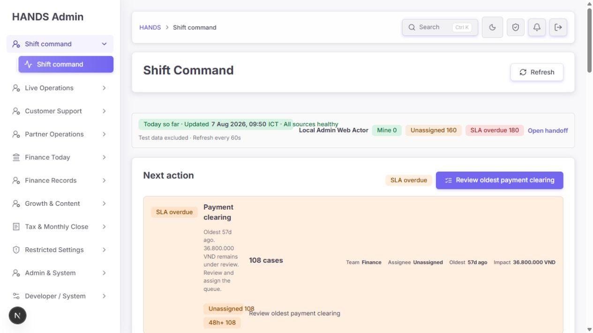

좋아진 점:

- `Today so far`, 갱신 시각, `All sources healthy`, `Test data excluded`, `Auto-refresh 60s`가 한 영역에 있다.
- `Local Admin Web Actor`, Mine 0, Unassigned 160, SLA overdue 180, Open handoff가 있어 운영자의 책임 범위를 빠르게 파악할 수 있다.
- 이전의 모호한 `Current shift`, `Current clear`보다 의미가 정확하다.

남은 문제:

- 1280px에서는 상태 자체보다 바로 아래 핵심 카드가 무너져 첫 업무 판단을 방해한다.
- 1024px에서는 `Shift context`의 왼쪽 상태 열이 78px 정도까지 압축돼 문구가 과도하게 세로로 늘어진다. 원인은 작은 화면 규칙보다 뒤에 기본 2열 규칙이 선언된 CSS 순서다.
- 60초 후 새 데이터가 생겼을 때 버튼 텍스트는 바뀌지만 screen reader에 이를 알려 주는 live region은 없다.

### Step 2 — 최우선 업무 결정: 🔴 위험

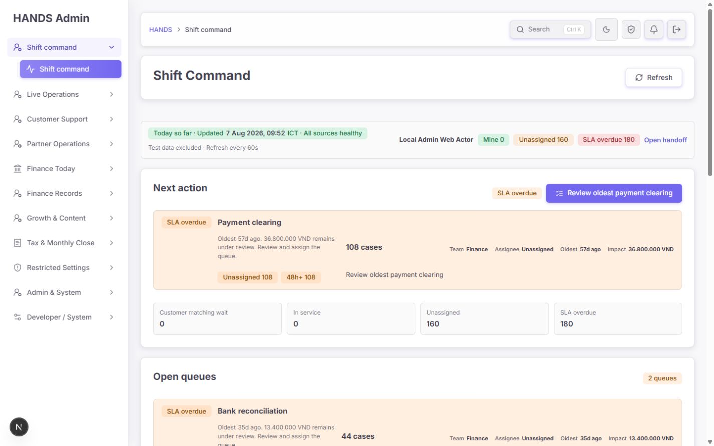

1440px에서는 `Payment clearing · 108 cases · oldest 57d · 36.800.000 VND · Finance · Unassigned`가 한 번에 읽힌다. 전역 우선순위의 핵심 목표는 달성됐다.

그러나 1280px에서는 같은 카드가 다음처럼 붕괴한다.

- `Payment clearing` 제목과 operator action이 한두 글자 폭으로 줄어 세로 문장처럼 보인다.
- `108 overdue / 108 total`, 배정 정보, ageing chip, CTA가 넓은 공간을 차지하고 실제 업무명이 희생된다.
- 페이지 전체 가로 overflow는 없지만, 이는 성공이 아니다. 텍스트 열에 `minmax(0, 1fr)`가 남은 공간을 모두 양보해 내용이 보이지 않는 방식으로 overflow만 피했다.

코드 원인:

- `apps/admin_web/app/globals.css:13788-13794`가 카드에 `auto minmax(0, 1fr) auto auto` 4열을 적용한다.
- 2열 안전 레이아웃은 `@media (max-width: 1100px)`에서만 켜진다. `apps/admin_web/app/globals.css:13831-13878`
- 실제 관리자 shell은 약 256px 사이드바를 사용하므로 viewport 1280px에서도 본문은 약 1000px뿐이다. breakpoint가 **카드 가용 폭이 아니라 전체 viewport**를 기준으로 잡혀 있다.

운영 영향:

- 운영자가 최우선 queue명과 지시문을 읽기 어려워 잘못된 대기열로 들어가거나 업무를 건너뛸 수 있다.
- 이 화면의 존재 이유인 “다음 한 가지 행동 결정”이 1280px에서 실패한다.

### Step 3 — 다음 대기열 순서 확인: 🔴 위험

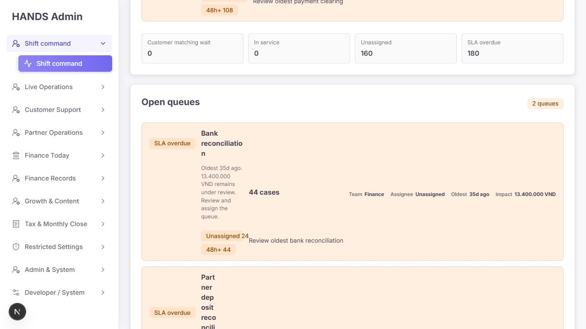

좋아진 점:

- Bank reconciliation 44건, Partner deposit reconciliation 28건처럼 queue가 전역 규칙으로 정렬됐다.
- oldest, 영향 금액, team, assignee, SLA ageing이 들어가 판단 재료는 충분하다.

문제:

- Step 2와 같은 4열 문제가 모든 open queue 카드에 반복된다.
- 좁은 1280 상태에서 각 카드의 높이가 크게 늘어 `Open queues`만 약 1,066px를 차지한다.
- 제목과 지시문은 읽기 어렵지만 오른쪽 값과 CTA는 반복적으로 노출돼 시각 우선순위가 반대다.

1440px에서는 같은 영역이 약 493px 높이로 정상이다.

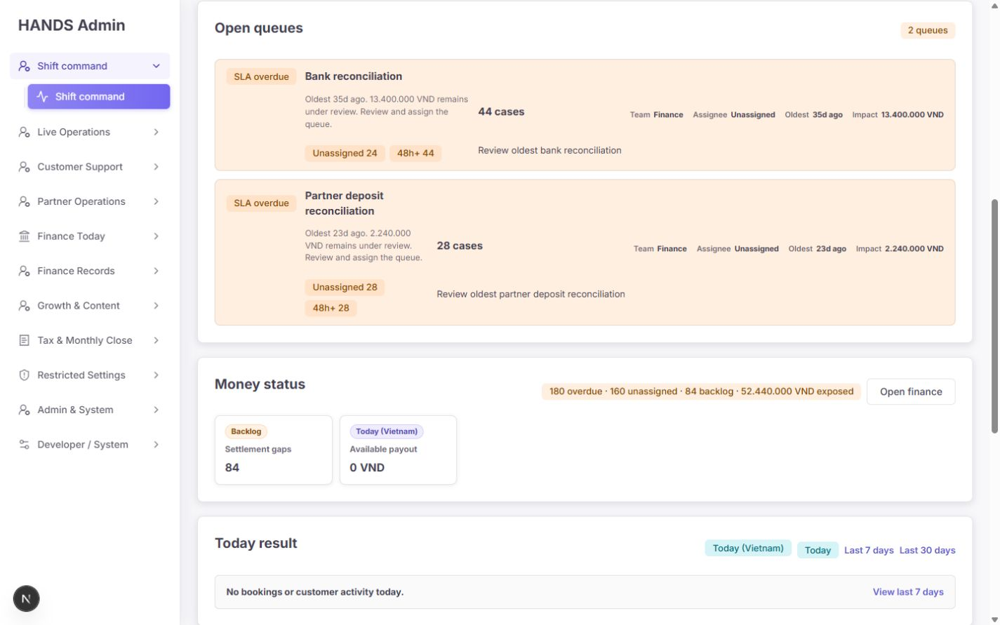

### Step 4 — 금전 위험과 오늘 결과 확인: 🟠 주의

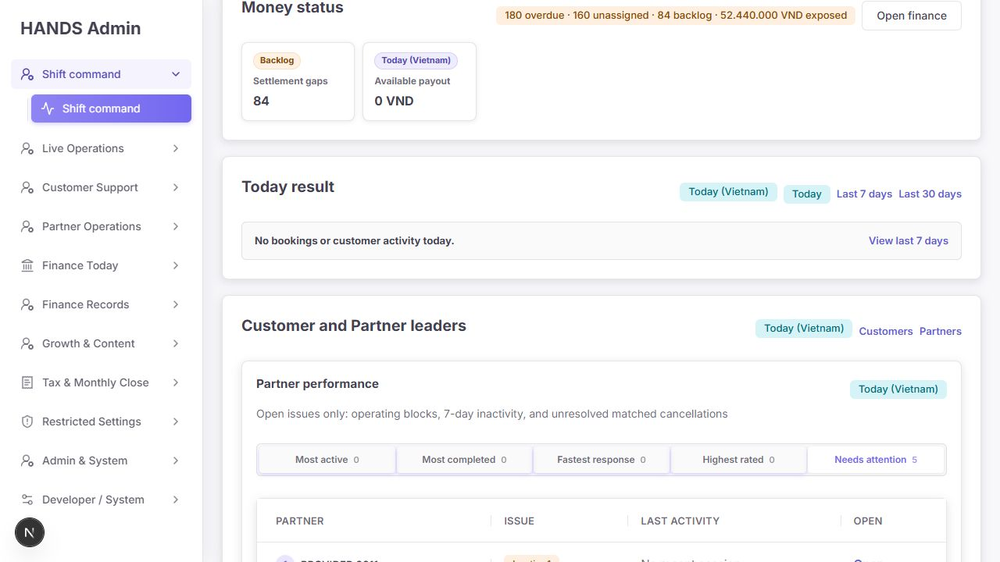

좋아진 점:

- `180 overdue · 160 unassigned · 84 backlog · 52.440.000 VND exposed`는 이전의 `1 urgent · 1 backlog`보다 훨씬 정확하다.
- Today가 비었을 때 네 개 차트를 반복하지 않고 `No bookings or customer activity today`로 압축했다.

남은 문제:

- Money status 상단은 Finance queue 3개와 historical amount를 합산하지만 본문은 현재 `Settlement gaps 84`와 `Available payout 0`만 보여준다. 운영자는 52.44M과 180건이 어떤 카드들의 합인지 이 섹션 안에서 재검산할 수 없다.
- `Available payout 0`은 조치가 아닌 기간 기록인데 warning 문맥 안에 남아 있다. Today에서는 숨기거나 summary로 내려야 한다.
- 이미 위에서 보여 준 Finance queue를 다시 큰 카드로 복제할 필요는 없다. 가장 작은 해법은 이 섹션에 `Finance queues are shown above` 링크와 미포함 항목만 남기는 것이다.

### Step 5 — 고객/파트너 주의 대상 확인: 🟠 주의

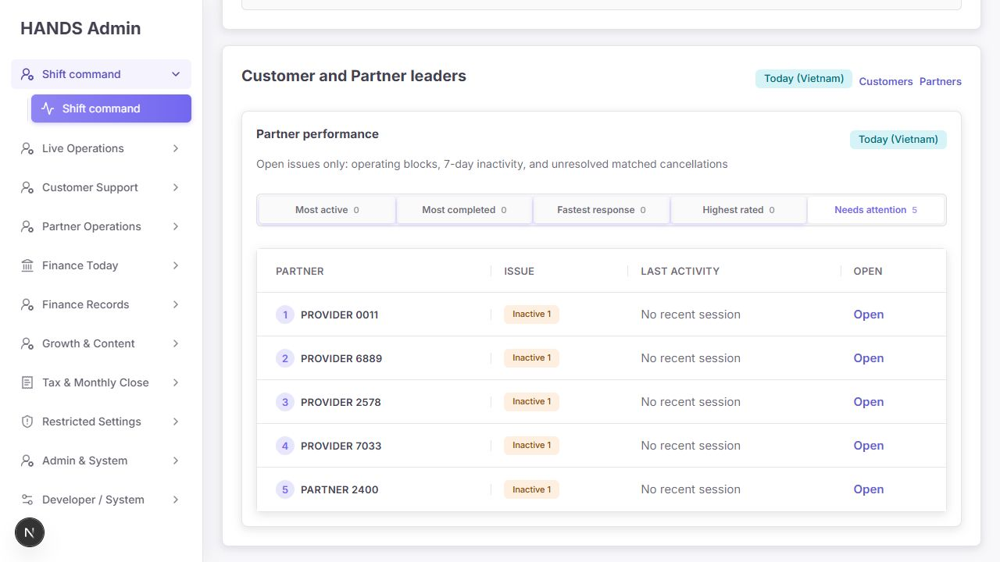

좋아진 점:

- `Needs attention 5`가 기본 선택돼 실제 문제가 빈 성과 탭 뒤에 숨지 않는다.
- Partner, Issue, Last activity, Open 네 열만 보여 이전의 넓은 표보다 훨씬 빠르게 읽힌다.
- 탭은 `role=tablist`, `aria-selected`, `aria-controls`, `tabpanel`, roving tabindex를 사용하며 ArrowLeft/Right, Home, End 처리가 구현돼 있다. `apps/admin_web/components/start-shift-ranking-widgets.tsx:104-155`

남은 문제:

- Today 화면에는 customer ranking이 없고 Partner attention만 있는데 상위 섹션 제목은 `Customer and Partner leaders`다. 현재 내용과 맞지 않는다.
- 기본 운영 화면에서 `Most active`, `Most completed`, `Fastest response`, `Highest rated`까지 모두 보이면 주의 대상을 보려는 흐름에 성과 분석이 섞인다.
- `Provider 1512`, `Provider 6519` 같은 이름이 `Test data excluded`와 함께 노출된다. API는 production filter를 적용하지만, 운영자가 실제 사람을 구별할 수 없는 이름 자체가 데이터 신뢰 문제다.

권장:

- Today에서는 제목을 `Partner needs attention`으로 동적으로 바꾸고 attention table만 기본 노출한다.
- 성과 탭은 7일 이상 기간이나 Partner Overview에서 보여준다.
- `Provider ####` 계정은 자동 삭제/제외하지 말고, 실제 운영 계정이면 onboarding/identity 상태를 함께 표시하고 fixture라면 명시적 데이터 표식으로 production filter가 판별하게 한다.

### Step 6 — 7일 운영 추세 확인: 🔴 지표 의미 위험

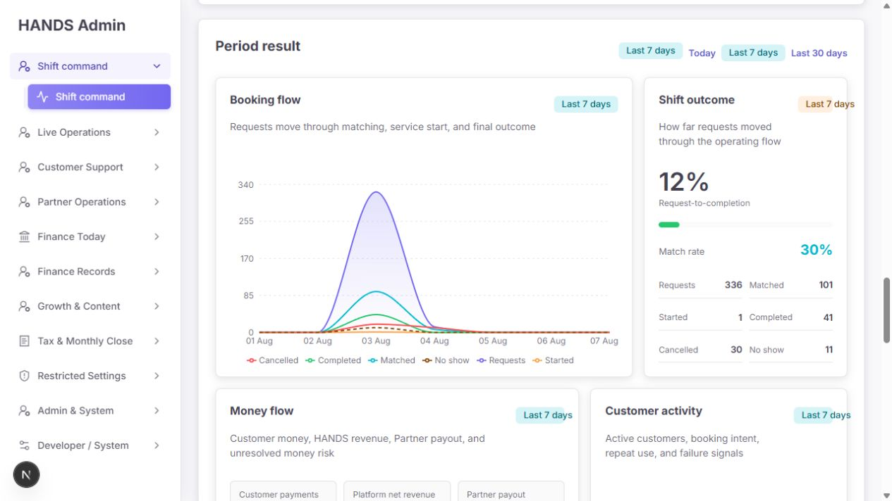

화면에는 다음 값이 보였다.

- Requests 336
- Matched 101
- Started 1
- Completed 41
- Cancelled 30
- No show 11
- Request-to-completion 12%
- Match rate 30%

문제는 이 수치들이 같은 booking cohort의 단계가 아니라는 점이다.

- Requests는 `Booking.createdAt` 기준이다. `apps/api/src/admin/admin.service.ts:4513-4526`
- Matched는 `Booking.matchedAt` 기준이다. `apps/api/src/admin/admin.service.ts:4528-4538`
- Started는 `service.started` notification의 생성 시각 기준이다. `apps/api/src/admin/admin.service.ts:4540-4552`
- Completed는 `ProviderEarning.createdAt` 기준이다. `apps/api/src/admin/admin.service.ts:4554-4564`
- Cancelled/No show는 `closedAt` 또는 `updatedAt` 기준이다. `apps/api/src/admin/admin.service.ts:4566-4580`

프론트는 이 독립 사건 수를 합한 뒤 `completed / bookingRequests`를 `Request-to-completion`으로 표시하고, `matched / requests`를 aggregate `Match rate`로 표시한다. `apps/admin_web/components/start-shift-chart-widgets.tsx:88-94`, `325-358`

운영 영향:

- 기간 시작 전에 접수됐지만 기간 안에 완료된 booking이 분자에 들어갈 수 있다.
- 기간 안에 접수됐지만 이후에 완료될 booking은 분모에만 들어갈 수 있다.
- 현재 화면처럼 `Started 1`, `Completed 41`도 가능하므로 퍼널로 읽으면 논리적으로 모순처럼 보인다.
- 운영자가 12%를 실제 conversion 저하로 오해해 잘못된 원인 분석을 할 수 있다.

가장 작은 안전한 수정:

- 현재 API를 유지한다면 `Booking flow`를 `Operational events`로 바꾸고 “selected period에 기록된 사건 수이며 동일 cohort 전환율이 아님”을 명시한다.
- `Shift outcome`의 progressbar, `Request-to-completion`, aggregate `Match rate`를 제거한다.
- 실제 전환율이 필요할 때만 `createdAt`이 기간 안인 booking ID cohort를 기준으로 matched/completed 상태를 집계하고 관찰 종료 시각을 명시한다.

### Step 7 — Partner 성과 해석: 🟠 주의

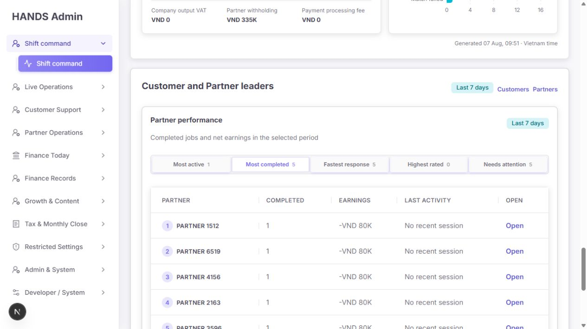

`Most completed`에서는 Partner 5명이 완료 1건, `-VND 80K`, `No recent session`으로 보였다.

문제:

- 열 이름이 `Earnings`인데 음수다. 데이터상 net amount가 음수일 수 있더라도 운영자에게는 수익 감소, 정산 조정, 현금 부채 중 무엇인지 불명확하다.
- `Earnings`를 `Net earnings`로 바꾸고 음수에는 `Adjustment/debt` 설명 또는 해당 earning record 링크를 제공해야 한다.
- dashboard 카드의 `36.800.000 VND`와 chart/table의 `VND 16M`, `-VND 80K`가 서로 다른 순서와 축약 규칙을 사용한다.

코드 원인:

- 차트와 랭킹이 각각 로컬 `Intl.NumberFormat`을 만든다. `apps/admin_web/components/start-shift-chart-widgets.tsx:48-59`, `apps/admin_web/components/start-shift-ranking-widgets.tsx:49-60`
- 페이지 본문은 공통 `formatMoneyOrZero`를 사용한다. `apps/admin_web/app/page.tsx:47`

권장:

- 조치 카드에는 정확한 금액을 유지한다.
- 분석 차트에는 compact 표기를 써도 되지만 기존 공통 admin formatter로 한 규칙만 사용한다.
- 음수는 부호를 유지하고, label에 `Net` 의미를 포함한다.

### Step 8 — 1024px 노트북과 200% 확대: 🔴 위험

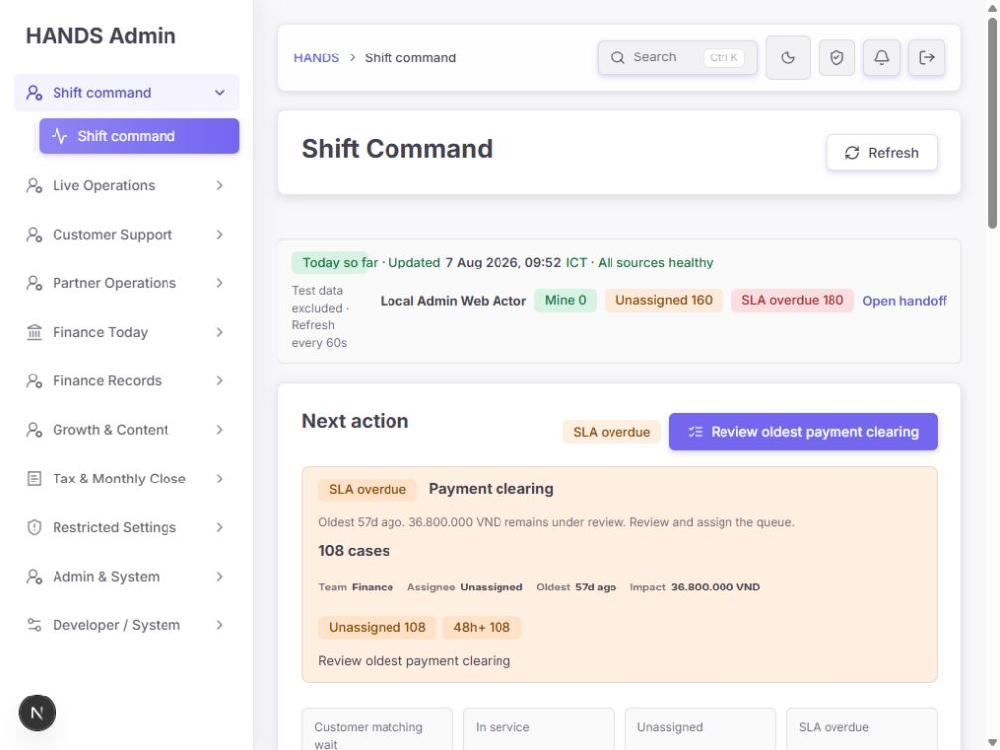

1024px에서 action card 자체는 2열 레이아웃으로 바뀌어 1280px보다 오히려 읽기 좋다. 그러나 상단 `Shift context`는 상태 열이 지나치게 좁다.

코드 원인:

- `@media (max-width: 1100px)`가 `.start-shift-scope-nav`를 1열로 바꾼다. `apps/admin_web/app/globals.css:13831-13834`
- 그 뒤의 기본 규칙이 다시 2열을 선언한다. `apps/admin_web/app/globals.css:13925-13935`
- 같은 specificity에서는 뒤 선언이 이기므로 1024px의 1열 규칙이 무효가 된다.
- 980px 이하에 다시 1열 선언이 있어 981–1100px 구간만 회귀한다. `apps/admin_web/app/globals.css:14553-14578`

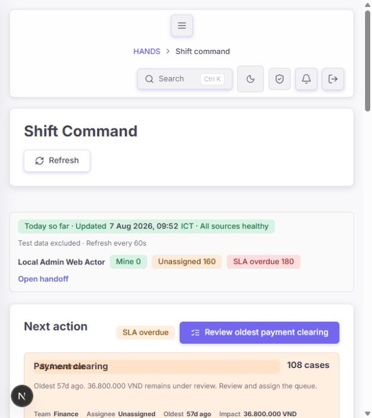

200% 확대에서는 `SLA overdue` pill과 `Payment clearing` 제목이 같은 grid cell에 겹친다.

코드 원인:

- 1100px 규칙에서 pill과 제목에 모두 row 1을 배치하되 서로 다른 column을 쓴다. `apps/admin_web/app/globals.css:13840-13853`
- 720px 규칙이 제목 column만 1로 바꾸고 row는 그대로 둔다. `apps/admin_web/app/globals.css:14621-14641`
- 결과적으로 pill과 제목 모두 column 1 / row 1이다.

최소 수정:

1. action card의 2열 안전 레이아웃을 1280/1366 노트북에도 적용하도록 이 규칙만 약 1399px까지 올린다.
2. 720px 이하에서는 action card를 명시적 1열로 만들고 pill row 1, title row 2, detail row 3, value row 4, meta row 5, ageing row 6, action row 7을 지정한다.
3. `.start-shift-scope-nav` 기본 규칙을 media query보다 앞으로 옮기거나, 1100px override를 기본 규칙 뒤에 둔다.
4. 1024×768, 1280×720, 1366×768, 1440×900, 200% 확대를 고정 회귀 세트로 만든다.

### Step 9 — 다크 모드: 🟢 양호

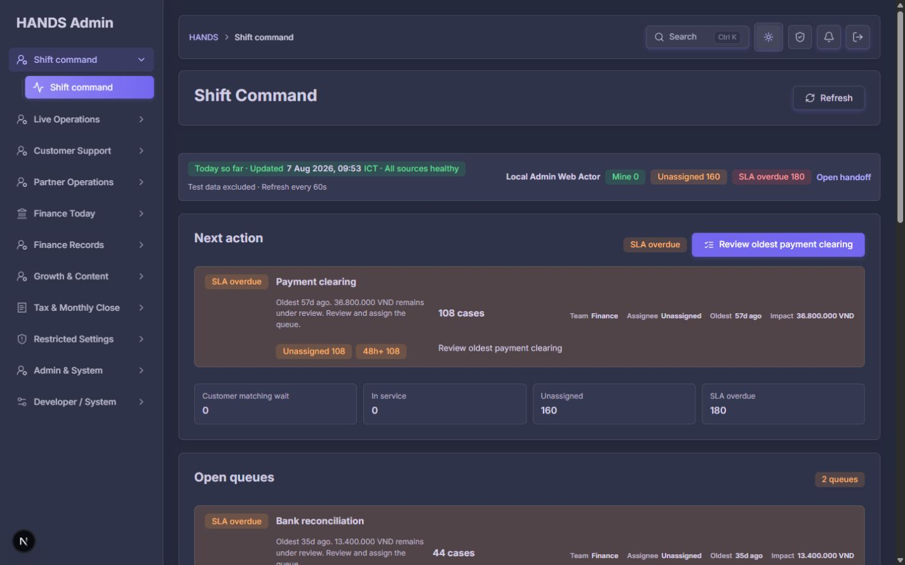

- surface, border, text, warning/danger 계층이 유지된다.
- light/dark 전환 후 다시 light로 복원되는 동작을 확인했다.
- 육안상 주요 텍스트와 위험 카드의 구분은 가능했다.

한계:

- 이번 감사에서는 색 대비를 수치로 계산하지 않았다. WCAG 대비 적합을 확정하지 않는다.

## 5. 우선순위별 수정 요건

### SSC-R01 [P1] 1280px 핵심 action card를 읽을 수 없다

수정 대상:

- `apps/admin_web/app/globals.css:13788-13878`

수정 원칙:

- 새 UI 라이브러리나 새 컴포넌트를 만들지 않는다.
- 기존 2열 layout을 재사용한다.
- viewport 1280/1366에서는 compact 2열, 충분한 본문 폭이 확보되는 1440 이상에서만 4열을 허용한다.

완료 기준:

- 1280×720에서 `Payment clearing`, 지시문, 108 cases, oldest, assignee, amount가 가로 단어 단위로 읽힌다.
- 한두 글자 폭의 세로 wrap이 없다.
- 페이지/카드 내부 가로 스크롤이 없다.
- Open queues 세 카드의 총 높이가 비정상적으로 늘어나지 않는다.

### SSC-R02 [P1] 200% 확대에서 상태와 제목이 겹친다

수정 대상:

- `apps/admin_web/app/globals.css:14621-14649`

수정 원칙:

- 720px 이하에서 모든 주요 child에 column과 row를 함께 명시한다.
- value를 제목 옆에 고정하지 말고 1열 흐름으로 내려도 된다. 운영 정보 손실보다 세로 길이가 낫다.

완료 기준:

- 브라우저 200% 확대에서 pill, title, detail, value, meta, ageing, CTA가 겹치지 않는다.
- 확대 상태에서 Next action CTA와 Refresh에 접근할 수 있다.
- 내용이 잘리거나 숨지 않는다.

### SSC-R03 [P1] 서로 다른 사건 시점을 conversion funnel로 표시한다

수정 대상:

- `apps/admin_web/components/start-shift-chart-widgets.tsx:88-94`, `230-367`
- 진짜 cohort metric을 만들 경우 `apps/api/src/admin/admin.service.ts:4513-4580`

최소 수정안:

- 현재 사건 집계는 그대로 둔다.
- 제목과 설명을 event volume으로 바꾼다.
- `Request-to-completion`, aggregate `Match rate`, progressbar를 제거한다.

확장 수정안은 business가 실제 conversion KPI를 요구할 때만 적용한다.

- 기간 안에 생성된 booking을 하나의 cohort로 고정한다.
- matched/completed 여부와 관찰 종료 시각을 정의한다.
- 미성숙 cohort를 포함하는지 문서화한다.
- numerator가 denominator의 동일 booking 집합인지 테스트한다.

완료 기준:

- Completed가 Started보다 큰 기간에도 화면 설명이 논리적으로 모순되지 않는다.
- conversion이라고 부르는 모든 비율은 동일 booking cohort에서 계산된다.

### SSC-R04 [P2] 1024px Shift context 압축

수정 대상:

- `apps/admin_web/app/globals.css:13831-13834`, `13925-13935`, `14567-14573`

수정:

- 기본 selector를 media query 전에 두거나, 1100px override를 뒤로 이동한다.
- 중복된 980px 보정은 결과 확인 후 제거해 cascade를 단순화한다.

완료 기준:

- 1024px에서 상태 문구와 operator chips가 각각 읽을 수 있는 한 줄 또는 자연스러운 두 줄로 배치된다.

### SSC-R05 [P2] 전역 우선순위의 “oldest” 약속과 실제 tie-break가 다르다

근거:

- 개별 action 정렬은 overdue끼리 oldest를 사용한다. `apps/admin_web/app/start-shift-action-priority.ts:324-344`
- 최종 command item 재정렬은 같은 등급에서 overdue count, unassigned count 순이다. `apps/admin_web/app/start-shift-action-priority.ts:82-95`
- CTA는 `Review oldest ...`라고 단정한다. `apps/admin_web/app/page.tsx:281-287`

현재 fixture에서는 Payment clearing이 가장 오래됐고 건수도 가장 많아 결과가 우연히 맞는다. 다른 데이터에서는 오래된 소량 queue보다 신규 대량 queue가 먼저 올 수 있다.

수정:

- command item에 이미 존재하는 source `oldestAt`을 전달하고 같은 SLA 등급의 첫 tie-break로 오름차순 정렬한다.
- 또는 정책이 대량 queue 우선이라면 CTA를 `Review highest-volume overdue ...`로 바꾼다.
- Shift Command의 운영 목적에는 oldest 우선이 더 일관된다.

완료 기준:

- “oldest”라는 문구를 쓰는 모든 CTA가 실제 최장 경과 queue를 가리킨다.
- oldest와 overdue count가 충돌하는 테스트 한 건을 추가한다.

### SSC-R06 [P2] Next action의 동일 CTA가 두 번 노출된다

근거:

- 섹션 헤더 primary CTA: `apps/admin_web/app/page.tsx:1067-1074`
- 같은 카드의 `AdminActionCard.actionLabel`: `apps/admin_web/app/page.tsx:208-231`

수정:

- Next action은 카드 전체/카드 내부 action 하나만 유지한다.
- 가장 작은 방법은 `StartShiftActionGrid`에 새 범용 추상화를 만들지 않고, 단일 Next action 렌더에서 header action 또는 card action 중 하나를 제거하는 것이다.

완료 기준:

- 같은 href와 같은 의미의 `Review oldest payment clearing`이 한 섹션에 한 번만 있다.

### SSC-R07 [P2] Money status 합계와 본문을 재검산하기 어렵다

수정:

- header 합계가 `Next action/Open queues`의 Finance 3개를 포함한다는 설명을 붙인다.
- 이 섹션에는 위 queue와 중복되지 않는 payment hold, refund, cash debt, payout만 남긴다.
- 값이 0인 `Available payout`은 Today warning section에서 숨긴다.

완료 기준:

- operator가 180 overdue와 52.44M의 출처를 한 번의 위/아래 스캔으로 이해한다.
- 0인 period metric이 action-needed 카드처럼 보이지 않는다.

### SSC-R08 [P2] Today의 leaders 제목과 기본 목적이 맞지 않는다

수정:

- customer/partner 데이터 존재 여부와 선택 기간에 따라 제목을 동적으로 만든다.
- Today + Partner attention only일 때 `Partner needs attention`을 사용한다.
- 성과 탭은 7d 이상에서만 노출하거나 별도 Overview 링크로 보낸다.

완료 기준:

- 제목만 읽어도 현재 body가 customer인지 partner인지, attention인지 performance인지 알 수 있다.

### SSC-R09 [P2] 모호한 Partner identity가 신뢰를 떨어뜨린다

수정 전 확인:

- `Provider ####` 계정의 fixture flag, phone/email domain, onboarding 상태, 실제 운영 이력을 확인한다.
- 실제 계정이면 이름을 임의로 바꾸거나 숨기지 않는다.

수정:

- fixture이면 명시적 표식을 추가하고 기존 production filter가 해당 표식을 사용하게 한다.
- 실제 계정이면 `Identity incomplete`, onboarding 단계 또는 고유 식별 정보를 함께 보여 operator가 사람을 구분하게 한다.

완료 기준:

- `Test data excluded`와 표의 계정 성격이 모순되지 않는다.
- 동일한 `Provider ####` 패턴만 보고 자동 삭제하는 로직은 만들지 않는다.

### SSC-R10 [P2] 음수 Earnings의 의미가 없다

수정:

- `Earnings`를 `Net earnings`로 바꾼다.
- 음수 값에 adjustment/debt 설명 또는 earning 상세 deep link를 제공한다.
- 음수를 0으로 clamp하지 않는다.

완료 기준:

- operator가 `-VND 80K`가 오류인지 정상적인 조정인지 상세에서 확인할 수 있다.

### SSC-R11 [P2] 금액 포맷이 화면 내부에서 다르다

수정:

- 새 formatter를 만들지 말고 기존 admin money formatter를 확장/재사용한다.
- action amount는 exact, chart axis/summary만 compact를 허용한다.
- `VND 16M`, `36.800.000 VND`, `-VND 80K`의 통화 위치 규칙을 하나로 정한다.

완료 기준:

- 같은 화면의 같은 용도 금액은 통화 위치, separator, compact 규칙이 같다.

### SSC-R12 [P2] 주요 조작 영역이 작다

실측:

- 상단 icon control 일부: 약 38×38px
- ranking tab: CSS 최소 높이 34px. `apps/admin_web/app/globals.css:14347-14358`
- 표의 `Open` 링크: 약 39×21px

수정:

- 자주 쓰는 icon button과 탭은 최소 44px에 가깝게 키운다.
- 표에서는 `Open` 글자만 키우기보다 Partner 이름 또는 행의 별도 action cell 전체를 클릭 가능한 영역으로 확장한다.

완료 기준:

- 1024px 및 200% 확대에서 주요 action을 정밀한 포인터 없이 선택할 수 있다.

### SSC-R13 [P2] 보류된 자동 갱신을 screen reader가 알기 어렵다

근거:

- 상호작용 중이면 `updateAvailable`을 켜고 버튼 문구를 `New data — refresh`로 바꾸는 로직은 좋다. `apps/admin_web/components/start-shift-refresh-button.tsx:28-52`
- 버튼에는 live region이 없다. `apps/admin_web/components/start-shift-refresh-button.tsx:54-69`

수정:

- 버튼 옆 visually-hidden `role=status` 또는 `aria-live=polite`에 `New dashboard data is available`을 알린다.
- 60초마다 불필요하게 읽지 말고, 상호작용 때문에 refresh가 보류된 순간에만 공지한다.

완료 기준:

- focus가 다른 control에 있을 때 새 데이터가 보류되면 screen reader가 한 번 공지한다.

### SSC-R14 [P3] 기간 문구가 반복된다

`Last 7 days`가 section status, 내부 card badge, 선택 range chip에 반복된다. 상위 section에서 기간을 이미 확정했다면 하위 카드마다 반복할 필요가 없다.

수정:

- 상위 section 또는 page filter 한 곳을 기간의 source of truth로 두고, 하위 badge는 `Live`, `Stale`, `Unavailable` 같은 상태에만 사용한다.

### SSC-R15 [P3] 코드에 CSS cascade 회귀 검증이 없다

현재 unit test 86개는 모두 통과하지만, 1280/1024/200%의 layout 회귀는 잡지 못했다. 거대한 새 시각 회귀 시스템을 도입할 필요는 없다.

수정:

- 기존 브라우저 smoke 흐름이 있다면 viewport 3개에서 `scrollWidth`, 핵심 element bounding box, 겹침 여부만 확인한다.
- 새 dependency는 추가하지 않는다.

## 6. 권장 수정 순서

### Phase 1 — 배포 전 필수

1. 1280/1366 action card를 기존 2열 layout으로 전환
2. 720px 이하 explicit row 배치로 200% 겹침 제거
3. 1024px scope-nav cascade 순서 수정
4. non-cohort conversion 문구와 progressbar 제거 또는 cohort API로 교체

### Phase 2 — 운영 판단 정확도

1. global priority tie-break를 oldest와 일치
2. Money status 합계 출처 명시, 0 payout 숨김
3. 음수 `Earnings`를 `Net earnings`로 명확화
4. generic Provider identity 조사 및 상태 표시

### Phase 3 — 밀도와 접근성 마감

1. Next action 중복 CTA 하나 제거
2. Today leaders 제목/노출 범위 동적화
3. 44px에 가까운 target 확보
4. deferred refresh live announcement
5. 기간 badge 반복 축소

## 7. 권장 문구

| 현재 문구 | 권장 문구 |
|---|---|
| Booking flow | Operational events |
| Requests move through matching, service start, and final outcome | Events recorded in this period; counts are not a same-cohort funnel |
| Shift outcome | Period event totals |
| Request-to-completion 12% | 제거 — 동일 cohort 전환율이 준비된 경우에만 표시 |
| Match rate 30% | 제거 또는 `Matched events / request events`로 한정. 권장은 cohort API 후 복원 |
| Customer and Partner leaders | Today: `Partner needs attention`; 7d: `Customer and Partner performance` |
| Earnings | Net earnings |
| Available payout 0 | Today action 화면에서는 숨김 |
| Money status | Money queues and exposure |
| Review oldest ... | 실제 oldest 정렬을 보장한 뒤 유지 |

## 8. 구현 완료 체크리스트

### 화면

- [ ] 1280×720에서 Next action 제목과 설명이 단어 단위로 읽힌다.
- [ ] 1366×768에서도 같은 결과다.
- [ ] 1024×768에서 Shift context가 자연스럽게 줄바꿈된다.
- [ ] 1440×900에서 현재 compact 4열 장점을 유지한다.
- [ ] 200% 확대에서 pill과 title이 겹치지 않는다.
- [ ] light/dark 모두에서 danger/warning/info 계층이 유지된다.

### 운영 의미

- [ ] 첫 CTA는 실제 정책상 최우선 queue를 가리킨다.
- [ ] `oldest` 문구와 정렬 기준이 일치한다.
- [ ] Money 합계의 구성 queue를 추적할 수 있다.
- [ ] conversion 비율은 동일 cohort만 사용한다.
- [ ] 음수 net earnings의 원인을 상세에서 추적할 수 있다.
- [ ] generic Provider 계정의 실제/fixture 성격이 확인된다.

### 접근성

- [ ] tablist 화살표/Home/End와 visible focus를 실제 키보드로 확인한다.
- [ ] 200% 확대에서 정보나 기능 손실이 없다.
- [ ] 보류된 새 데이터가 `aria-live`로 한 번 공지된다.
- [ ] 주요 action target이 충분히 크다.
- [ ] screen reader와 수치 대비는 별도 수동 검증한다.

### 회귀 방지

- [ ] 관련 unit test가 통과한다.
- [ ] 1280/1024/200% viewport smoke check를 추가한다.
- [ ] 새 UI/차트 라이브러리를 추가하지 않는다.
- [ ] 기존 formatter, card, status, tab 패턴을 재사용한다.

## 9. 코드 검증 결과

실행한 명령:

```text
npm.cmd run test --workspace @massage-vn/admin-web --
  app/page.spec.tsx
  app/dashboard-page-model.spec.ts
  app/dashboard-trace-summary.spec.tsx
  app/start-shift-action-priority.spec.ts
  app/start-shift-finance-review-workload.spec.ts
  app/start-shift-operations-command-board.spec.ts
  components/start-shift-chart-widgets.spec.tsx
  components/start-shift-ranking-widgets.spec.tsx
  components/start-shift-refresh-button.spec.tsx
```

결과:

- Test files: 9 passed
- Tests: 86 passed
- Duration: 4.03s

해석:

- 기존 동작과 모델 테스트는 안정적이다.
- 그러나 unit test 통과는 CSS breakpoint/cascade와 지표 의미의 타당성을 보장하지 않는다.

## 10. 감사 한계

- 이 보고서는 Shift Command 첫 화면과 그 내부 상태만 평가했다. 각 deep link가 도착한 목록에서 filter와 건수가 일치하는지는 해당 페이지 감사 범위다.
- 키보드 focus 이동은 브라우저 제어 환경에서 focus 전환이 안정적으로 관찰되지 않아, 코드 구조는 확인했지만 실제 physical keyboard 결과는 확정하지 않았다.
- screen reader 발화와 색 대비 수치는 별도 도구로 측정하지 않았다.
- historical backlog가 현재 데이터에 나타나지 않아 해당 tone과 summary는 코드로 확인했다.
- 30일/90일의 데이터 의미는 7일과 같은 집계 구현을 사용하므로 별도 반복 캡처하지 않았다.
- `02-default-full-1280.png`은 브라우저 full-page 캡처 과정에서 빈 영역이 반복된 capture artifact여서 판단 근거에서 제외했다.

## 11. 최종 한 문장

이번 개선은 **운영자가 무엇을 해야 하는지 보여 주는 구조로는 성공**했지만, **1280px/200%에서 그 핵심 정보가 깨지고 7일 전환율의 의미가 부정확**하므로 이 세 가지 P1을 고친 뒤에야 Shift Command 개선을 완료로 처리하는 것이 안전하다.
