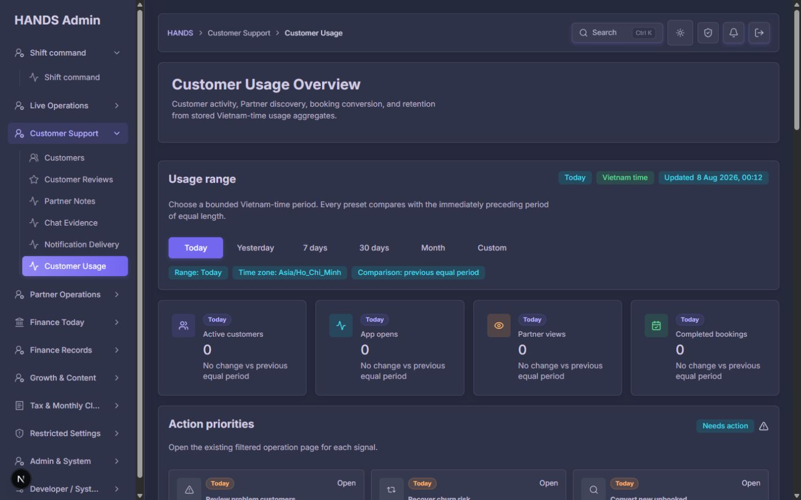
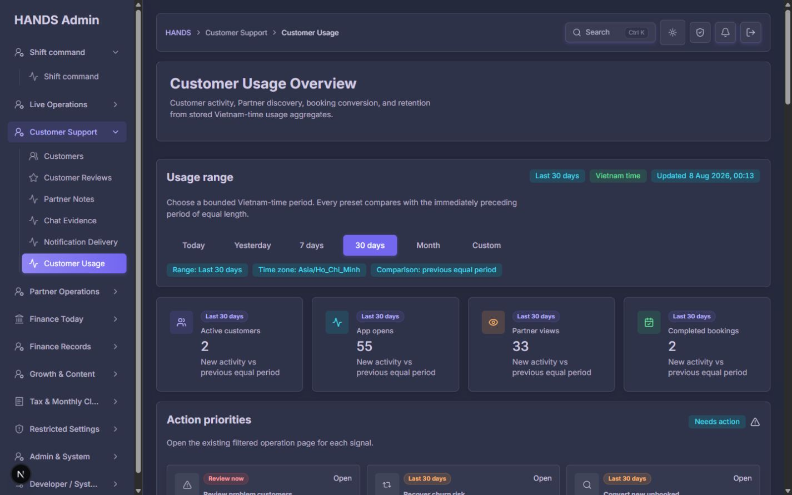
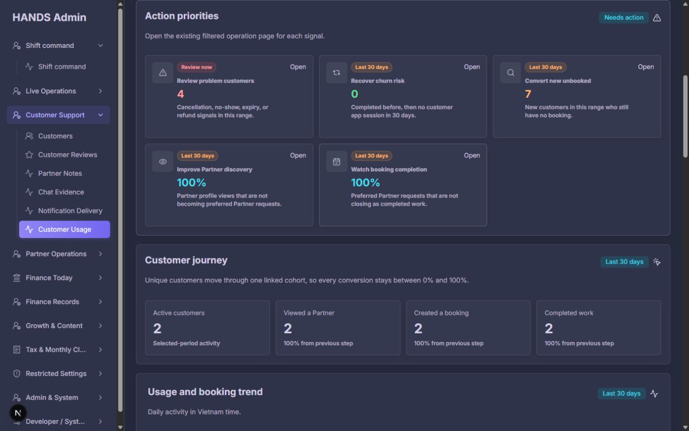
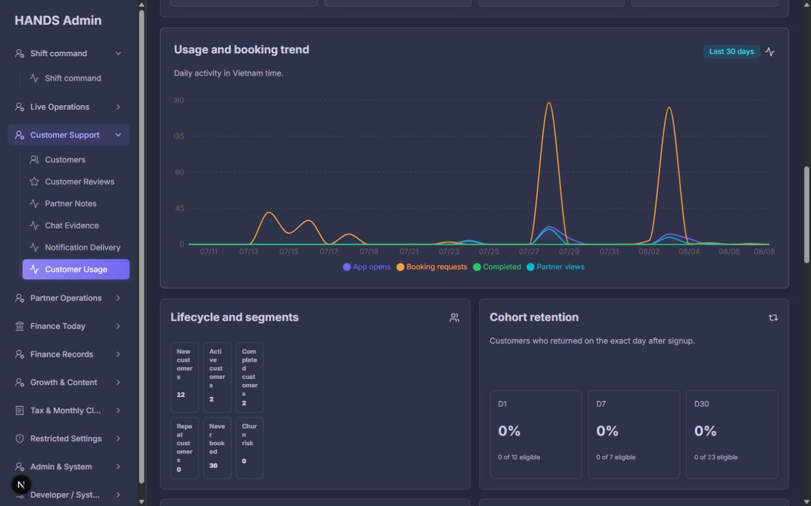
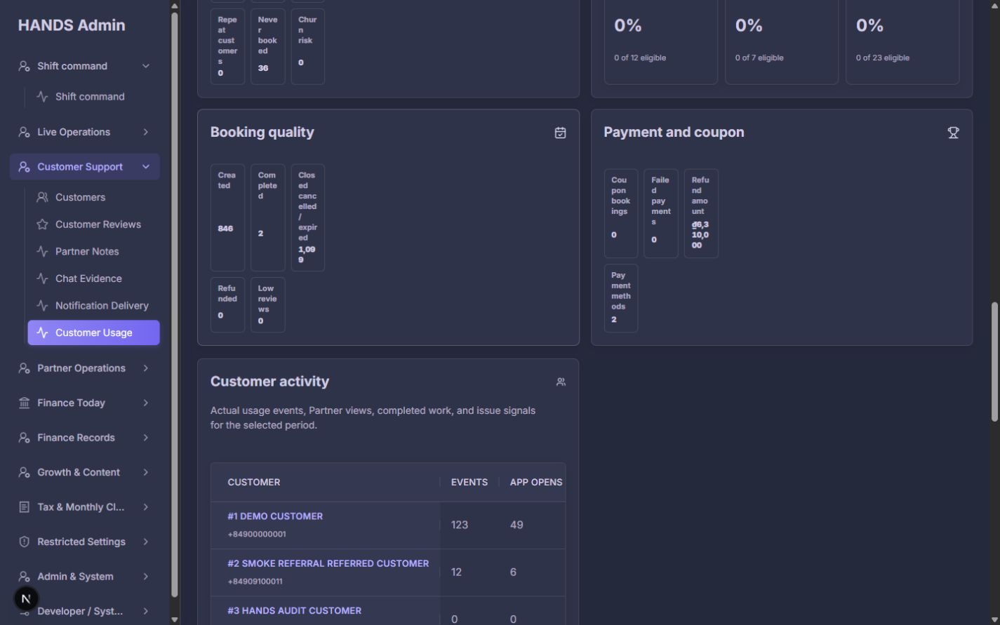
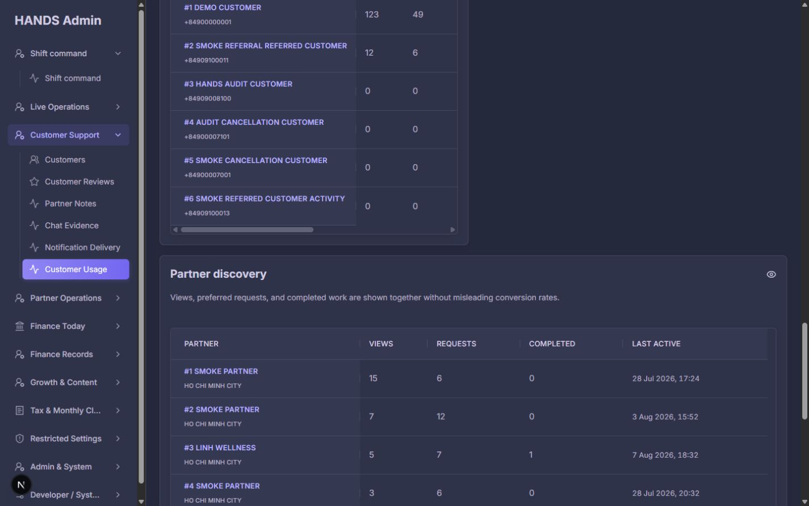
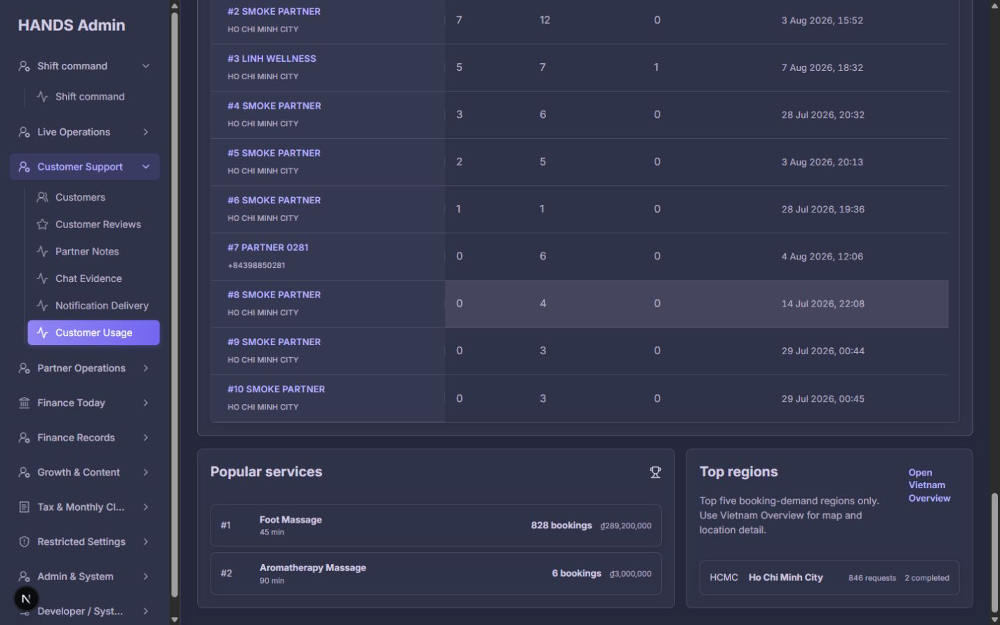
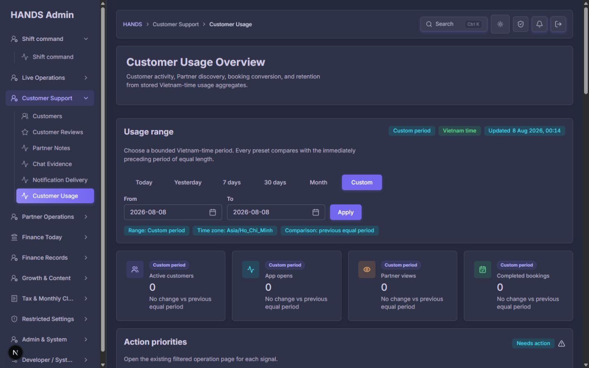
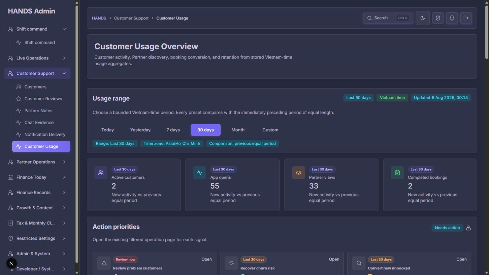
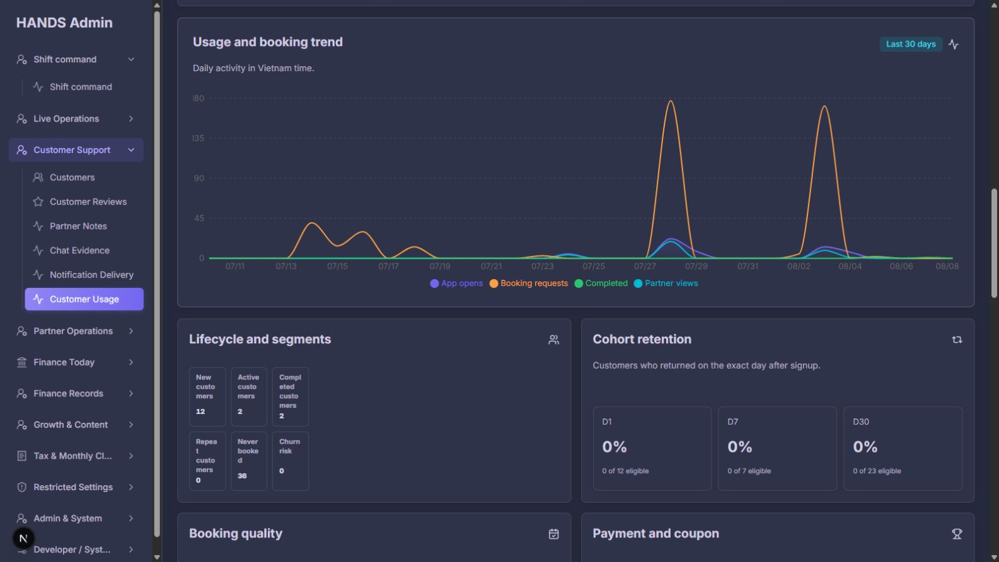

# Customer Usage Overview 개선 후 심층 재감사

- 대상: `http://localhost:3101/usage-overview`
- 감사일: 2026-08-08
- 운영 기준: 고객지원·운영 담당자가 30초 안에 기간 성과, 이탈 지점, 조치 대상, 데이터 신뢰도를 판단할 수 있는가
- 화면 검증: 1440×900, 1600×900 데스크톱
- 상태 검증: Today, Last 30 days, Custom 기본값, 역전된 Custom 날짜
- 코드 검증: Admin Web page/model/chart/CSS/date picker, API range/query, 대상 페이지 filter contract, focused tests
- 변경 범위: 앱 소스는 수정하지 않았다. 감사 문서와 증거 캡처만 생성했다.

## 1. 최종 판정

**판정: 시각적 상단 구조는 개선됐지만, 운영 신뢰성을 좌우하는 이전 P0 문제는 대부분 미해결이다. 현재 상태를 운영 의사결정용 보고서로 확정하기에는 위험하다.**

상단 KPI, Action priorities, Customer journey 순서는 전보다 분명하다. API 실패와 실제 0건도 구분한다. 그러나 운영자가 실제로 행동하려는 순간 다음 문제가 발생한다.

1. Action priorities의 5개 링크가 카드와 같은 대상을 열지 않는다.
2. `100% view-to-request`, `100% request-to-complete`는 문구와 다른 고객 단위 funnel rate다.
3. Last 30 days 화면에서 `Created 846`, `Completed 2`, `Closed cancelled / expired 1,099`가 보이는데도 상단 완료율은 `100%`다.
4. 기간 지표와 전체 현재 스냅샷이 같은 기간 문맥 안에 섞인다.
5. Custom 역전 날짜가 오류 없이 수용되고, 서버가 다른 하루 범위로 바꿔도 화면은 원래 입력을 유지한다.
6. `Updated`는 데이터가 반영된 시각이 아니라 API 응답 생성 시각이다.
7. 1440px와 1600px 모두에서 lifecycle/booking/payment 카드 문구가 글자 단위로 찢어진다.
8. Customer 표는 반쪽 폭, Partner 표는 전체 폭으로 나타나며 Customer 표에는 내부 가로 스크롤이 필요하다.
9. 고객·Partner 전체 전화번호가 화면과 API 응답에 남는다.
10. Demo/Smoke/Audit fixture가 통계와 순위를 지배한다.

따라서 다음 수정의 우선순위는 **P0 데이터·링크 계약 → P0 레이아웃 연결 → P1 정보 구조 → P2 문구**다. 새 UI/차트 라이브러리는 필요하지 않다.

## 2. 이전 보고서 반영 상태

| 이전 요건 | 상태 | 재감사 결과 |
|---|---|---|
| P0-1 Action link contract | 미반영 | `segment=issue`, `sort=profile-views`, 기간 없는 `/bookings?view=all`이 그대로다. |
| P0-2 고객 단위와 예약 단위 분리 | 부분 반영 | Customer journey 설명은 unique customer라고 밝혔지만 Action 카드는 여전히 customer funnel rate를 request rate로 사용한다. |
| P0-3 기간 지표와 현재 snapshot 분리 | 미반영 | Never booked 36과 Churn risk가 `Last 30 days` lifecycle에 남아 있다. |
| P0-4 Custom canonical range | 미반영 | 적용 날짜를 응답에서 보여주거나 URL/input을 canonical하게 고치지 않는다. |
| P0-5 synthetic provenance/exclusion | 미반영 | Demo/Smoke/Audit 고객·Partner와 수백 건의 fixture booking이 그대로 포함된다. |
| P0-6 source freshness | 미반영 | `generatedAt = new Date()`를 `Updated`로 표시하고 `refreshSeconds`는 사용하지 않는다. |
| P0-7 layout wiring | 미반영 | dead `.usage-overview-content-grid`, legacy `:last-child`, nested mini-metric grid가 그대로다. |
| P0-8 server-side phone masking | 미반영 | Customer `secondary`와 Partner fallback에 raw phone을 넣는다. |
| P1-1 trigger만 Action으로 표시 | 미반영 | 0건/분모 0 카드도 5개 모두 표시한다. |
| P1-2 Booking outcomes 상단 배치 | 미반영 | booking 결과는 trend 아래 작은 카드에 남아 있다. |
| P1-3 trend scale 분리 | 미반영 | 4개 series가 한 Y축을 공유해 booking spike가 customer activity를 눌러 버린다. |
| P1-4 0건/N/A 표현 | 미반영 | 0 row chart, 분모 0 conversion, eligible 0 retention을 모두 `0%`로 보인다. |
| P1-5 full-width 요약 표 | 미반영 | Customer 7열 표는 반쪽 폭, Partner만 전체 폭이다. |
| P1-6 retention 정의 설명 | 부분 반영 | exact-day 설명은 있으나 eligible 0을 N/A로 처리하지 않고 기준 기간도 충분히 설명하지 않는다. |
| P1-7 하단 역할 정리 | 부분 반영 | 서비스/지역 설명은 나아졌지만 payment/coupon은 핵심 흐름에 남고 지역 실패 결과는 없다. |

## 3. 잘된 부분

- API 실패 시 `Usage data unavailable`을 보여 실제 0과 구분한다.
- H1/H2, breadcrumb, table header, visible From/To label이 존재한다.
- 기간 선택은 링크 기반이고, Vietnam time 및 이전 동일 길이 비교를 알린다.
- Customer journey가 unique customer 단위라는 설명을 추가해 이전보다 의미가 선명해졌다.
- Customer와 Partner 행에서 상세 화면으로 이동할 수 있다.
- 원본 GPS 좌표가 아니라 지역 bucket만 화면에 노출한다.
- 상단 KPI/Action/Journey 순서는 운영자의 스캔 흐름에 더 가깝다.
- 브라우저 console에는 런타임 오류가 없었다.
- focused tests 17개는 모두 통과했다. 단, 아래에서 설명하듯 일부 테스트는 잘못된 계약을 정상으로 고정한다.

## 4. 캡처 단계별 재감사

### Step 1 — Today 상단 · 상태: 부분 개선

- H1, 기간, KPI가 시각적으로 분리돼 첫 진입 스캔은 좋아졌다.
- H1 카드가 높고 정보량은 적다. 1440px 첫 화면에서 실제 Action 내용이 접히므로 운영 가치가 낮은 공간이다.
- `Updated`는 source freshness처럼 읽히지만 실제로는 report 생성 시각이다.
- `Today` badge가 각 KPI마다 반복돼 정보 밀도를 낮춘다.
- Today가 모두 0일 때도 아래에 Action 5개, 0% conversion, 0축 chart가 이어진다. 정상 상태를 짧게 보여주지 못한다.

### Step 2 — Last 30 days 상단 · 상태: 주의

- Active customers 2, App opens 55, Partner views 33, Completed bookings 2가 한 줄에서 읽힌다.
- 운영상 더 중요한 `Created 846`과 `Closed cancelled / expired 1,099`가 첫 KPI에 없다.
- App opens는 행동량이고 Active customers는 unique customer다. 단위를 카드에 직접 표시하지 않아 숫자 비교가 직관적이지 않다.
- `New activity vs previous equal period`는 이전 값이 0이라는 사실과 현재 절대 증가량을 숨긴다.

### Step 3 — Action priorities와 Customer journey · 상태: 심각

- `Recover churn risk 0`처럼 조치가 없는 카드도 Needs action 영역을 차지한다.
- `Improve Partner discovery 100%`는 booking funnel의 `Created a booking / Viewed a Partner` 고객 비율이다. Partner profile view event → preferred request event 비율이 아니다.
- `Watch booking completion 100%`는 `Completed work / Created a booking` unique customer 비율이다. preferred Partner request → completed booking record 비율이 아니다.
- `Customer journey`는 같은 기간 안에서 집합을 좁힐 뿐, view가 booking보다 먼저 발생했다는 시간 순서를 검증하지 않는다. `move through`라는 표현은 실제 쿼리보다 강하다.
- 모든 action 카드의 `Open`은 도착 결과 건수를 예고하지 않는다. `View 4 affected customers →`처럼 목표와 예상 건수를 알려야 한다.

### Step 4 — Trend와 Lifecycle · 상태: 심각

- booking request spike가 약 180까지 올라가 App opens/Partner views/Completed 선을 바닥에 붙인다.
- 같은 차트에서 고객 행동 event와 booking record를 한 Y축으로 비교해 작은 변화가 사라진다.
- all-zero 기간도 API가 24개/일별 0 row를 반환하므로 `rows.length === 0` 조건에 걸리지 않는다.
- `New customers`, `Active customers`, `Completed customers`, `Repeat customers`, `Never booked`가 글자 단위로 줄바꿈된다.
- Never booked는 전체 현재 수치인데 Last 30 days 문맥 안에 있다.
- Repeat customers는 선택 기간에 완료가 2회 이상 닫힌 고객 수다. 일반 운영자가 기대하는 lifetime repeat customer와 다를 수 있다.

### Step 5 — Booking/Payment와 Customer 표 · 상태: 심각

- `Created 846`은 `booking.createdAt` 기간 조건이다.
- `Completed 2`, `Closed cancelled / expired 1,099`는 `booking.closedAt` 기간 조건이다.
- 서로 다른 cohort이므로 합계 관계가 없는데 같은 Booking quality bucket처럼 보인다.
- `Refund amount ₫6,310,000`도 좁은 3열 중첩 grid 안에서 찢어진다.
- Customer 7열 표를 50% 카드 폭에 두어 내부 가로 스크롤이 발생한다. 오른쪽은 빈 공간인데 데이터를 숨긴다.
- Payment methods `1`은 금액/건수가 아니라 method 종류 개수다. 운영 우선순위가 낮고 의미도 즉시 이해하기 어렵다.

### Step 6 — Customer/Partner 순위 · 상태: 심각

- Demo/Smoke/Audit 데이터가 상위 고객과 Partner를 지배한다.
- 고객 전체 전화번호가 이름 아래에 그대로 노출된다.
- Partner city가 없으면 전체 전화번호가 내려온다.
- Requests가 Views보다 큰 Partner가 있고, Views 0 / Requests 6인 행도 있다. 두 값이 같은 event chain이 아니므로 `view-to-request conversion`으로 계산할 수 없다.
- Customer와 Partner가 같은 wrapper에 있지만 Customer는 반쪽 폭, 마지막 Partner만 전체 폭이다.
- 기본 top 10은 페이지 길이를 늘린다. 운영 첫 화면은 top 5와 View all이 더 적합하다.

### Step 7 — Popular services와 Top regions · 상태: 위험

- Foot Massage 828 bookings 등 fixture 영향이 커 서비스 수요 분석으로 신뢰하기 어렵다.
- 여기서 `bookings`는 완료 건수가 아니라 기간 중 생성된 booking record다. 문구가 이를 밝히지 않는다.
- Top regions의 `requests`도 preferred request만이 아니라 해당 지역에서 생성된 모든 booking이다.
- 지역별 completed만 있고 cancelled/expired 또는 resolution rate가 없어 공급/품질 문제를 판단하기 어렵다.
- Vietnam Overview 링크는 좋지만 동일한 기간을 전달하지 않아 두 화면을 비교하기 어렵다.

### Step 8 — Custom 기본 상태 · 상태: 주의

- Custom을 누르면 From/To가 오늘로 기본 설정된다.
- 최대 90일, 미래 날짜 불가, From ≤ To 규칙이 화면에 없다.
- filter summary는 `Custom period`라고만 말하고 실제 적용 날짜를 보여주지 않는다.
- 하루짜리 Custom도 page copy가 `Daily activity`라고 결정하지만 API trend는 24시간 hourly row다.

### Step 9 — 1600px 상단·Lifecycle 재확인 · 상태: 결함 재현

- 1600px에서도 상단 구조는 안정적이다.
- 그러나 lifecycle/booking/payment 문구 찢김은 그대로다. 작은 viewport의 문제가 아니라 중첩 grid wiring 문제다.
- 넓어진 화면을 table 가독성이나 주요 booking outcomes에 쓰지 못하고 카드 내부의 빈 공간과 잘못된 column 분배로 소비한다.

### Step 10 — From > To Custom 입력 · 상태: 심각

- URL: `?range=custom&from=2026-08-09&to=2026-08-08`
- 화면은 역전된 입력값을 그대로 유지하고 오류를 표시하지 않는다.
- 서버는 실제로 To 기준의 하루 범위로 조용히 보정한다.
- filter summary와 모든 badge는 `Custom period`만 표시해 실제 적용 범위를 알 수 없다.
- 결과가 0이더라도 “잘못된 입력 때문에 다른 범위가 적용됨”과 “해당 기간에 실제 데이터가 없음”을 구분할 수 없다.

## 5. P0 — 반드시 먼저 수정할 항목

### P0-1. Action card count와 도착 화면 total을 동일한 계약으로 만든다

현재 링크와 실제 target contract:

| Action | 현재 URL | 실제 문제 |
|---|---|---|
| Review problem customers | `/customers?segment=issue` | `issue` 미지원. segment가 빈 값으로 정규화된다. |
| Recover churn risk | `/customers?segment=inactive-30d` | 유효하지만 `view=all`이 없어 기본 `needs-action`과 결합되며, churn 정의도 서로 다르다. |
| Convert new unbooked | `/customers?segment=never-booked` | 전체 never-booked + 기본 needs-action이 되어 “기간 중 신규 미예약”과 다르다. |
| Improve Partner discovery | `/partners?sort=profile-views` | Partner sort는 `newest`, `name`, `oldest`만 지원해 `profile-views`가 무시된다. |
| Watch booking completion | `/bookings?view=all` | 기간과 unresolved/failed 조건을 전달하지 않고 target 기본 기간으로 바뀐다. |

수정 방법:

1. 문자열 URL을 usage page model에서 직접 작성하지 않는다.
2. Customers/Partners/Bookings의 기존 query builder를 재사용한다.
3. source range를 target의 `dateRange/dateFrom/dateTo`로 변환한다.
4. target이 같은 cohort를 표현하지 못하면 target filter를 최소 확장한다.
5. 카드 count와 도착 페이지 total을 같은 service/query contract에서 계산한다.
6. count parity 통합 테스트를 추가한다.

중요: 단순히 `segment=issue`를 `segment=cancellation-risk`로 바꾸는 것만으로는 부족하다. source issue에는 refund가 포함되고 기간 조건이 있지만 target cancellation-risk는 전체 이력 기준이며 refund를 포함하지 않는다.

### P0-2. 두 conversion을 명시적으로 분리한다

현재 `buildUsageActionPriorities()`는 funnel의 `booking` 및 `completed` conversion을 가져와 각각 `view-to-request`, `request-to-complete`라고 표시한다. 이는 단위가 다르다.

권장 계약:

- `Unique-customer reach`
  - Active unique customers
  - Viewed a Partner unique customers
  - Created a booking unique customers
  - Customers with a completed booking
  - 단계 간 set ratio, event order를 보장하지 않으면 `reached`라고 표현한다.
- `Booking outcomes`
  - Created booking records in cohort
  - Completed
  - Cancelled / no-show / expired
  - Refunded
  - Still open / unresolved
  - 같은 created cohort의 현재 outcome을 사용하면 합계가 맞는다.

운영 action의 completion rate는 booking record 단위로 계산한다. 고객 journey rate는 Action card에 재사용하지 않는다.

### P0-3. 기간 흐름과 현재 customer base를 분리한다

`neverBookedCustomerCount`와 `churnRiskCustomerCount`는 선택 기간과 관계없는 현재 snapshot이다.

- `Period activity`: new, active-in-period, booked-in-period, completed-in-period
- `Current customer base · As of now`: never booked, inactive 30d, active today/7d/30d
- snapshot에는 Last 30 days/Custom badge와 previous-period delta를 사용하지 않는다.
- churn action도 선택 range와 무관하다면 `As of now`라고 명확히 표시한다.

### P0-4. Custom 범위를 입력·응답·URL에서 하나로 만든다

- From ≤ To, 미래 날짜 불가, 최대 90일을 입력 단계에서 검증한다.
- 서버 trust boundary 검증은 유지한다.
- 잘못된 입력은 field error로 반환하는 방식을 우선한다.
- 자동 보정을 유지한다면 API가 `fromDate`, `toDate`, `dayCount`, `granularity`를 반환하고 page가 실제 적용 값으로 canonical redirect한다.
- summary: `1 Jul–30 Jul 2026 · 30 days · Vietnam time`처럼 실제 날짜를 표시한다.
- 하루 범위는 Hourly, 그 이상은 실제 API granularity에 따라 Daily라고 표시한다.

### P0-5. fixture를 이름이 아닌 provenance로 제외한다

- 현재 Demo/Smoke/Audit 이름과 fixture booking이 통계와 순위를 왜곡한다.
- 이름/전화번호/ID prefix 기반 필터는 금지한다.
- User 또는 생성 주체에 `dataOrigin/synthetic` 같은 명시적 marker를 둔다.
- booking/payment/refund/review/usage aggregate가 동일한 provenance를 따르도록 한다.
- 운영 집계 query는 server-side에서 marker를 제외한다.
- 기존 로컬 fixture는 자동 삭제하지 말고 목록화 후 명시적으로 마킹한다.
- 실제 제외가 보장될 때만 `Synthetic data excluded` badge를 보여준다.

### P0-6. `Updated`를 `Report generated`와 `Data through`로 분리한다

현재 API의 `generatedAt`은 `new Date().toISOString()`이다.

- 필요하면 `Report generated`로 이름을 바꾼다.
- 별도 `dataThroughAt`을 aggregate `lastOccurredAt`과 booking/review/refund 최신 반영 시각의 명확한 정책으로 정의한다.
- 상단에는 `Data through 8 Aug 2026, 00:17 ICT`를 우선 표시한다.
- 최소 구현은 Refresh 링크/버튼 하나다. 자동 refresh가 불필요하면 사용하지 않는 `refreshSeconds`를 제거한다.

### P0-7. 중첩 grid와 content wrapper 연결을 바로잡는다

직접 원인:

- `AdminOverviewGrid variant="content"`는 `usage-overview-grid`를 출력한다.
- v2 CSS는 존재하지 않는 `usage-overview-content-grid`를 대상으로 한다.
- legacy `.usage-overview-ranking-card:last-child`가 Partner만 full width로 만든다.
- `usage-overview-mini-metric-list`가 AdminSection body와 AdminMiniMetricStrip에 동시에 붙어 outer 3 columns 안에 inner 3 columns가 생긴다.

최소 수정:

1. `MetricSection`과 `PaymentCard`에서 body와 inner strip 중 한 곳의 `usage-overview-mini-metric-list`를 제거한다. 권장: inner strip 한 곳만 유지한다.
2. content grid에 실제 class를 명시하고 Customer/Partner를 한 열 full-width로 쌓는다.
3. legacy `:last-child` 예외를 usage v2에서 제거한다.
4. 기존 공용 strip의 safe layout을 재사용하고 새 layout dependency는 추가하지 않는다.

### P0-8. 전화번호는 API에서 마스킹한다

- Customer `secondary: row.phone`
- Partner `secondary: row.city ?? row.phone`

화면에서만 가리면 network response에 원문이 남는다. API mapping 단계에서 `+84••••••0001`처럼 마스킹한다. 목록에서 전체 번호가 꼭 필요하지 않으며 상세 화면 링크가 이미 있다.

## 6. 새로 확인된 추가 문제

### P1-A. 숨겨진 `range=all`은 비용이 큰 경로다

- UI option에는 All이 없지만 Web/API normalize와 test는 `all`을 허용한다.
- unbounded trend는 1970-01-01부터 현재까지 일별 `generate_series`를 만들 수 있다.
- 운영 요구가 없다면 `all` 지원을 제거하는 것이 가장 단순하다.
- 필요하다면 최대 범위 또는 월 단위 aggregation을 명시적으로 설계한 뒤 노출한다. 측정 없이 캐시부터 추가하지 않는다.

### P1-B. test가 결함 링크를 정상으로 고정한다

`page.spec.tsx`는 다음 문자열을 기대한다.

- `/customers?segment=issue`
- `/customers?segment=inactive-30d`
- `/customers?segment=never-booked`

이 테스트는 링크 존재만 확인하고 target parser/count parity는 보지 않는다. href 문자열 snapshot이 아니라 target builder와 source/target total parity를 검증해야 한다.

### P1-C. request가 view보다 큰 데이터를 100%로 clamp한다

- API test도 Partner view 2 / request 3을 유효 데이터로 허용한다.
- API와 Web은 denominator에 `Math.max(view, request)`를 사용해 100%로 잘라낸다.
- 이는 invalid conversion을 안전해 보이는 100%로 위장한다.
- 두 event가 연결 가능한 동일 lineage가 아니라면 conversion 자체를 제거하고 `views`, `preferred requests`를 독립 신호로 표시한다.

### P1-D. payment failure의 기간 기준이 문구와 다르다

`paymentFailureCount`는 payment 실패 시각이 아니라 연결된 booking `createdAt`으로 기간을 필터링한다. `Failed payments in this period`로 보이게 하려면 payment attempt/failure timestamp를 사용해야 한다. 그 timestamp가 없다면 `Failed payments on bookings created in period`라고 정확히 쓴다.

### P1-E. chart 접근 가능한 설명이 부족하다

- chart wrapper에는 accessible name만 있고 series 값의 요약/table 대체가 없다.
- screen reader가 peak, total, 변화 지점을 얻을 수 없다.
- 최소 구현은 chart 아래에 series total과 peak day를 텍스트로 제공하는 것이다.
- 모든 row 합계가 0이면 chart를 그리지 않고 `No activity in this period`를 보여준다.

## 7. 권장 운영 화면 구성

### 1) Compact header

- Customer Usage
- `Data through … ICT`
- Refresh
- 실제 적용 기간 한 줄

### 2) Needs attention

- trigger가 1 이상인 action만 표시
- 영향 고객 수 + booking case 수
- 도착 결과와 같은 count
- 조치가 없으면 단일 `No usage alerts in this period`

### 3) Period health

권장 4개:

1. Active customers · unique customers
2. Partner views · events
3. Booking records created
4. Booking outcome · completed / cancelled / unresolved

App opens는 trend의 secondary metric으로 내려도 된다.

### 4) Unique-customer reach

- 집합 기준과 단위를 명시
- 순서를 보장하지 않으면 funnel arrow보다 단계별 reach를 사용

### 5) Booking outcomes

- 동일 cohort의 mutually exclusive outcome
- 분모와 as-of 시각 표시
- 운영 alert와 직접 연결

### 6) Trends

- 기존 Recharts로 Customer activity와 Booking activity 두 차트로 분리
- 또는 series toggle 하나만 추가
- 새 chart library는 추가하지 않는다.

### 7) Current customer base

- Never booked
- Inactive 30d / churn risk
- Active today/7d/30d
- `As of now` scope

### 8) Drill-down tables

- Customer full width top 5 + View all
- Partner full width top 5 + View all
- 전화번호 마스킹
- 1440px에서 핵심 열을 내부 가로 스크롤 없이 읽을 수 있게 한다.

### 9) Demand patterns

- Popular services: `booking records created`라고 단위 명시
- Top regions: created, completed, cancelled/expired 또는 resolution rate
- Vietnam Overview 링크에 동일 기간 전달

## 8. 권장 문구

| 현재 | 권장 |
|---|---|
| Customer Usage Overview | Customer Usage |
| Customer activity, Partner discovery… stored aggregates | See how customers use the app, where booking attempts fail, and who needs follow-up. |
| Usage range | Reporting period |
| Updated | Report generated |
| Vietnam time | All dates in Vietnam time |
| Action priorities | Needs attention |
| Improve Partner discovery | Review Partner discovery signals |
| Watch booking completion | Review unresolved booking records |
| Customer journey | Unique-customer reach |
| Lifecycle and segments | Period customers / Current customer base |
| Booking quality | Booking outcomes |
| Payment and coupon | Payment issues |
| Created | Created in period |
| Completed | Closed as completed in period |
| Closed cancelled / expired | Closed cancelled / no-show / expired in period |
| 0% with no denominator | N/A · no eligible records |

## 9. 코드별 수정 위치

### Admin Web

- `apps/admin_web/app/usage-overview/usage-overview-model.ts`
  - 257–315: action rate 단위와 href를 수정한다.
  - target page builder를 재사용하고 range를 전달한다.
- `apps/admin_web/app/usage-overview/page.tsx`
  - 70–71: 운영자 중심 제목/설명으로 줄인다.
  - 105–108: generatedAt과 source freshness를 분리한다.
  - 149–155: 실제 from/to, day count, comparison dates를 표시한다.
  - 242–244: range name이 아니라 API granularity를 사용한다.
  - 251–266: period/snapshot 및 full-width table 구조를 분리한다.
  - 330–345: eligible 0을 N/A로 처리한다.
  - 350–383: booking outcome timestamp/cohort를 명시하고 payment 역할을 축소한다.
  - 370/375, 399/404: 중복 mini-metric class를 제거한다.
  - 411–468: 두 표를 full width/top 5로 만들고 masked secondary만 사용한다.
- `apps/admin_web/app/usage-overview/usage-overview-trend-chart.tsx`
  - all-zero 합계를 empty state로 처리한다.
  - customer/booking scale을 분리하거나 toggle을 제공한다.
  - 텍스트 요약을 제공한다.
- `apps/admin_web/components/admin-overview-card.tsx`
  - content variant가 실제 v2 content class를 출력하도록 계약을 명확히 한다.
- `apps/admin_web/app/globals.css`
  - legacy last-child override와 dead content selector를 정리한다.
  - nested grid를 한 단계로 만든다.
- `apps/admin_web/components/admin-form-date-picker-field.tsx`
  - 기존 react-datepicker에 min/max 및 설명/invalid state 전달이 필요하다. 새 date picker는 필요 없다.

### API

- `apps/api/src/admin/admin-usage-overview.ts`
  - Custom을 silent clamp하지 말고 validation error 또는 canonical applied range를 반환한다.
  - hidden `all` 지원을 제거하거나 명시적으로 제한한다.
- `apps/api/src/admin/admin-usage-overview-query.ts`
  - 181–210: phone을 server-side masking한다.
  - 251–350: period metrics, snapshot, dataThroughAt, applied range를 분리한다.
  - 354–413: createdAt/closedAt/payment 기준을 output label과 맞춘다.
  - 416–445: funnel을 시간 순서라고 표현하지 않거나 실제 ordered event lineage를 구현한다.
  - 599–633: views/requests를 conversion으로 쓸 수 있는지 lineage를 검증한다.
  - synthetic provenance 조건을 모든 관련 집계에 일관되게 적용한다.

### Tests

- href 문자열 존재 테스트를 target builder/target parser 통합 테스트로 교체한다.
- source card count = target result total을 검증한다.
- unique-customer rate가 booking action에 들어가지 않는 회귀 테스트를 추가한다.
- view 0/request > 0에서 100% conversion을 표시하지 않는 테스트를 추가한다.
- Custom reversed/future/>90d의 error 또는 canonical URL을 검증한다.
- all-zero rows → empty state, eligible 0 → N/A를 검증한다.
- API response에 raw phone과 synthetic row가 없는지 검증한다.
- 1440/1600 screenshot regression에서 글자 단위 wrap과 half-width Customer table을 검증한다.

## 10. 구현 순서

### 1차 — 운영 신뢰성

1. Action rate 단위 분리
2. source-target filter/count parity
3. Custom validation/canonical range
4. period vs snapshot 분리
5. source freshness
6. phone masking
7. synthetic exclusion

### 2차 — 레이아웃

1. nested mini metric class 제거
2. 두 ranking table full width
3. compact header
4. booking outcomes 상단 이동
5. 1440/1600 시각 회귀 확인

### 3차 — 운영 효율

1. zero action 제거 및 정상 상태
2. N/A/empty state
3. trend scale 분리
4. top 5 + View all
5. 지역 실패 결과와 동일 기간 링크

## 11. 수용 기준

- Last 30 days의 booking action은 booking record 단위이며 분모/시간 기준이 보인다.
- Unique-customer 100%는 Unique-customer reach 안에서만 보인다.
- Action 카드 count와 도착 페이지 total이 정확히 같다.
- target active filter summary가 source 기간과 조건을 그대로 보여준다.
- unsupported `segment=issue`, `sort=profile-views`가 남지 않는다.
- From > To, 미래 날짜, 90일 초과가 field error 또는 명시적 canonical applied range로 처리된다.
- 실제 적용 날짜와 비교 날짜가 상단에 보인다.
- Never booked/Churn risk는 `As of now`에 있고 기간 badge가 없다.
- `Updated`가 source freshness로 오해되지 않으며 `Data through`가 보인다.
- synthetic marker가 있는 사용자/예약/event는 집계와 ranking에서 제외된다.
- API와 화면에 raw phone이 없다.
- all-zero trend는 좌표계 대신 empty state다.
- 분모 0 conversion과 eligible 0 retention은 N/A다.
- 1440×900 및 1600×900에서 lifecycle/payment label이 글자 단위로 찢어지지 않는다.
- Customer와 Partner table은 모두 full width이고 핵심 열을 가로 스크롤 없이 읽는다.
- 1440px 첫 화면에 기간, 핵심 KPI, 최소 1개 실제 alert가 들어온다.
- console error 없이 focused test 및 source-target 통합 테스트가 통과한다.

## 12. 의도적으로 하지 말아야 할 것

- 새 BI/analytics 플랫폼 도입
- 새 chart/UI/date-picker 라이브러리 추가
- action마다 새 상세 페이지 생성
- 이름·전화번호·ID prefix 기반 synthetic 필터
- fixture 자동 삭제
- customer와 booking rate를 다시 하나의 추상 conversion으로 합치기
- 성능 측정 없이 cache/materialized view부터 추가하기
- 데이터 계약은 그대로 두고 copy만 바꾸기

## 13. 검증 결과와 한계

- Admin Web focused tests: 2 files, 10 tests 통과
- API focused tests: 2 files, 7 tests 통과
- console: 런타임 error 없음
- 캡처는 로그인된 로컬 환경의 현재 데이터 기준이다.
- source-target count parity는 현재 구현에 공통 query 계약이 없어 코드 대조로 불일치를 확인했다.
- contrast ratio와 실제 screen reader 발화는 측정하지 않았다.
- date picker 전체 keyboard operation은 별도 접근성 시나리오가 필요하다.
- API query latency 및 DB execution plan은 측정하지 않았으므로 성능 개선안을 추측으로 확정하지 않았다.
