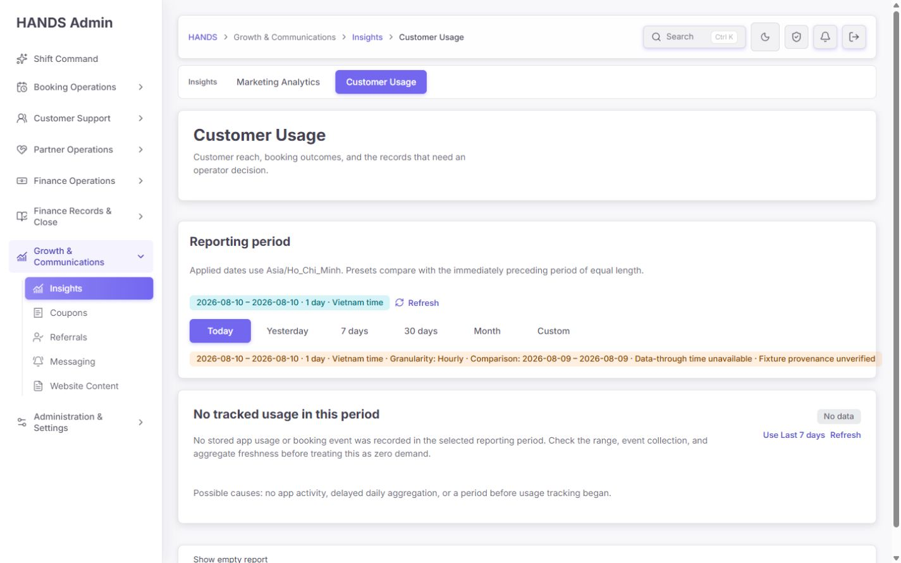
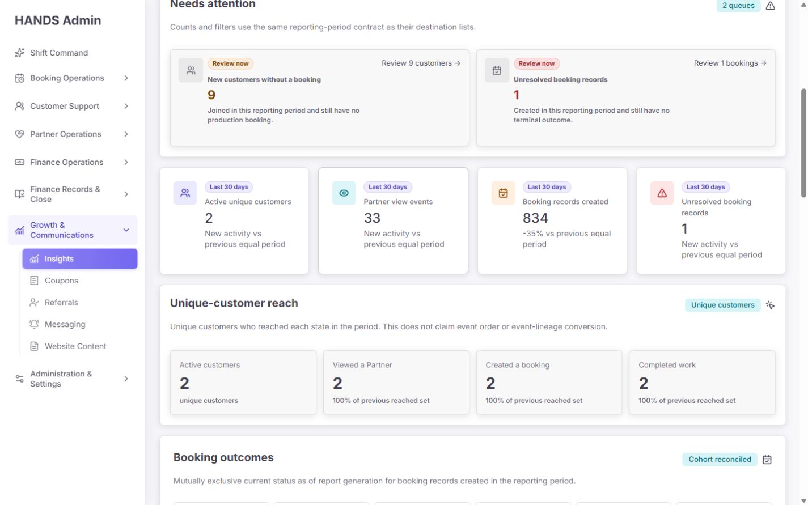
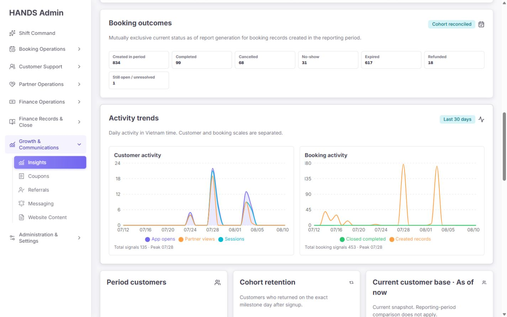
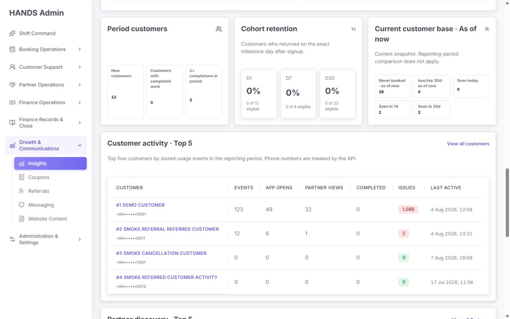
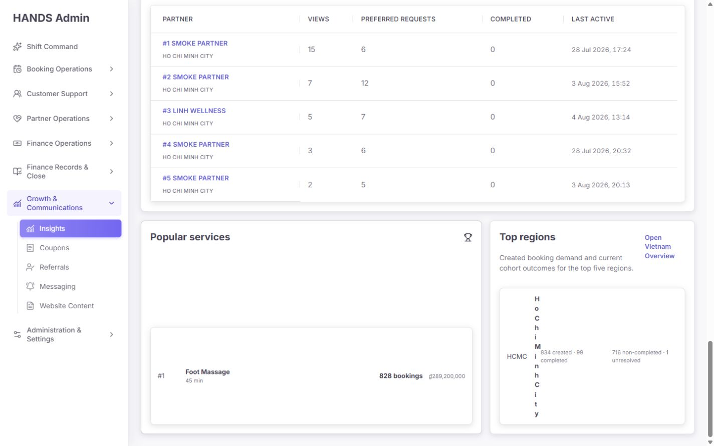
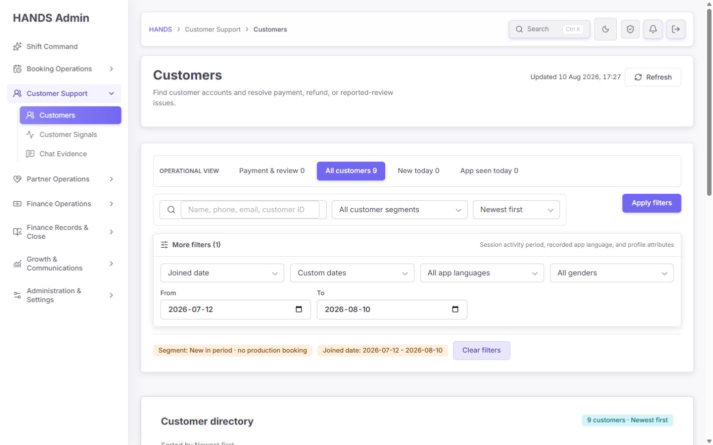
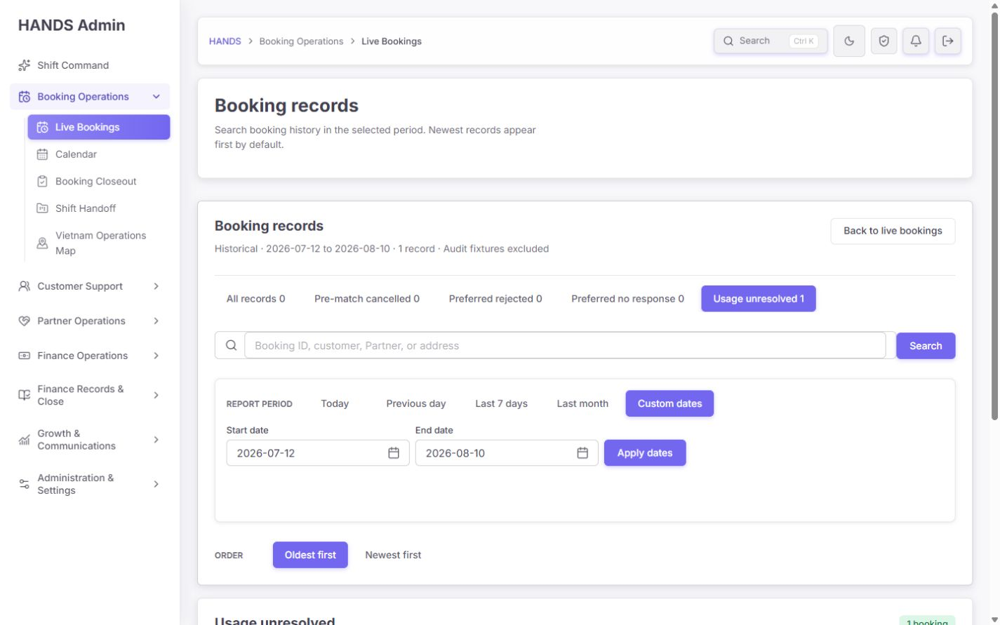
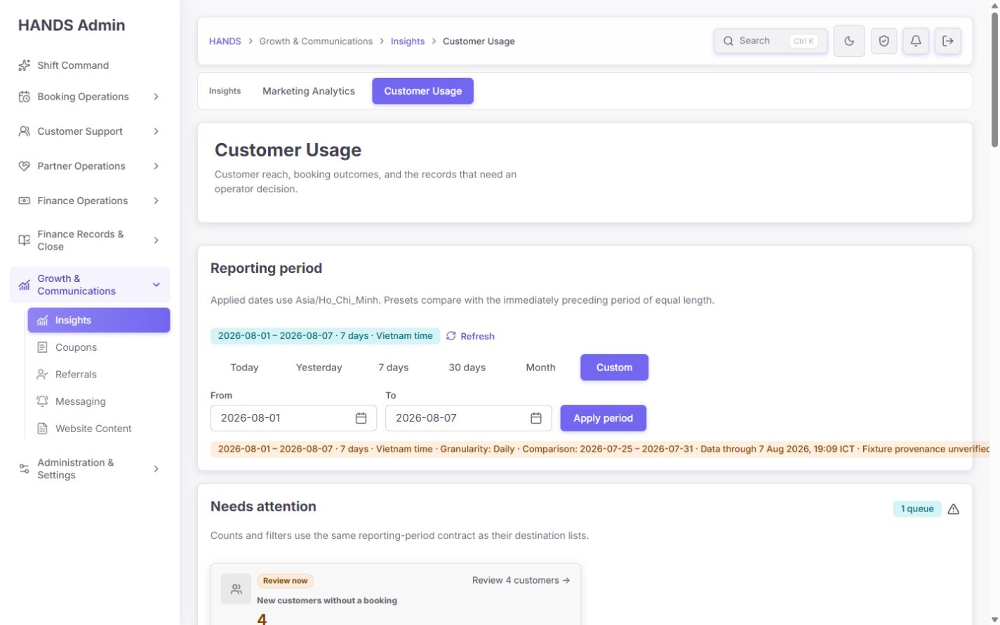
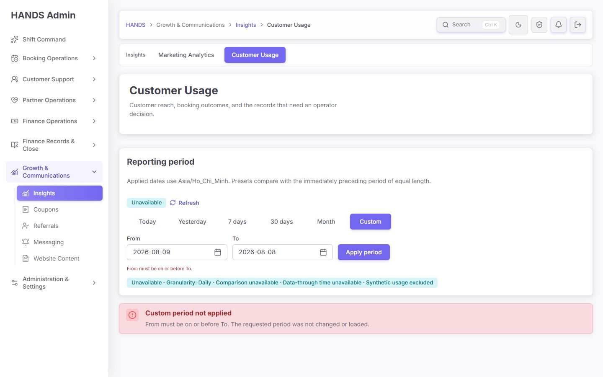
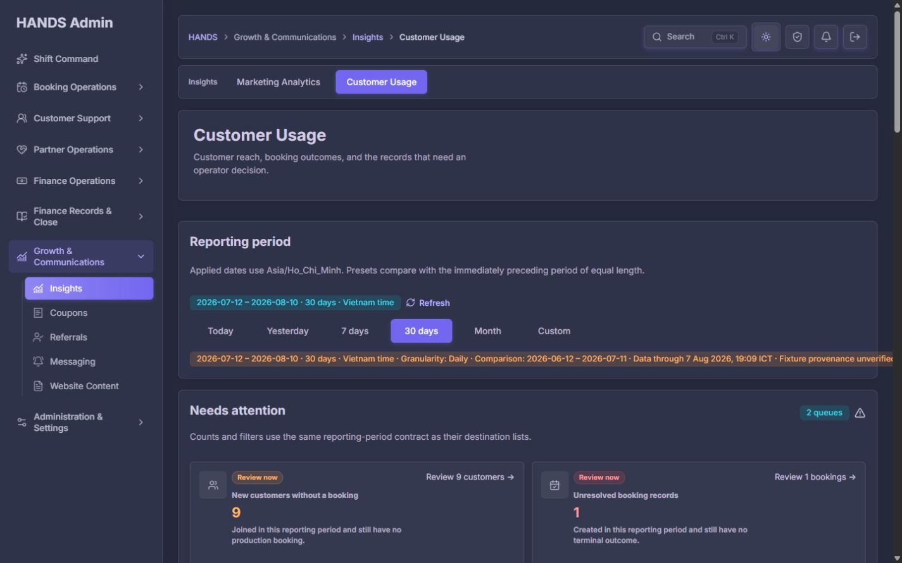

# Customer Usage 개선 후 심층 재감사 보고서

- 대상: `http://localhost:3101/usage-overview`
- 감사일: 2026-08-10
- 화면 기준: 로그인된 로컬 관리자, 1440×900 데스크톱
- 검증 상태: Today, 30 days, Custom 정상/오류, dark theme, Action 대상 목록 2종
- 코드 범위: Admin Web page/model/chart/CSS, Admin API range/query, Customers/Bookings 대상 filter contract, 관련 테스트
- 변경 범위: 애플리케이션 소스는 수정하지 않았으며 이 보고서와 감사 캡처만 생성했다.

## 1. 최종 판정

**판정: 조건부 통과. 이전 감사의 핵심 구조·계약 문제는 대부분 잘 수정됐지만, 운영 배포를 확정하기에는 데이터 신뢰성 1건과 1440px 레이아웃 2건이 남아 있다.**

운영자 관점의 정보 순서는 크게 좋아졌다. 실제 조치 건만 상단에 보이고, 고객 단위 reach와 booking record outcome을 분리했으며, booking outcome 834건은 `99 + 68 + 31 + 617 + 18 + 1 = 834`로 정확히 reconcile된다. Action 카드도 현재 데이터에서 고객 9명 및 booking 1건이 각각 도착 목록의 total과 일치했다. Custom 역전 날짜는 더 이상 조용히 보정되지 않고 명시적으로 거부된다. 전화번호도 API 매핑 단계에서 마스킹된다.

하지만 다음 세 가지는 완료로 볼 수 없다.

1. `Fixture provenance unverified` 상태가 그대로이며, 실제 상위 고객·Partner·서비스가 Demo/Smoke 데이터에 의해 지배된다. 이 상태에서는 수치가 정확히 계산돼도 운영 의사결정용 데이터라고 신뢰할 수 없다.
2. 적용 범위 요약이 1440px에서 카드 밖으로 약 59px 넘치며 오른쪽 문구가 잘린다. Custom과 dark theme에서도 재현된다.
3. 하단 `Top regions`는 0px짜리 지역명 column을 만들어 `Ho Chi Minh City`를 한 글자씩 세로로 찢고, 왼쪽 `Popular services`는 같은 높이로 늘어나 큰 빈 공간을 만든다.

### 종합 점수

| 영역 | 점수 | 판정 |
|---|---:|---|
| 운영 작업 흐름 | 91/100 | 좋음 |
| 정보 구조·문구 | 86/100 | 좋음 |
| 데이터 계약 정확성 | 82/100 | 개선됨 |
| 데이터 신뢰성 | 52/100 | 배포 차단 요인 |
| 1440px 시각 완성도 | 73/100 | 하단 결함 |
| 접근성 | 79/100 | 차트 보강 필요 |
| 로컬 성능 | 90/100 | 즉시 병목 없음 |
| **전체** | **79/100** | **조건부 통과** |

## 2. 이전 보고서 반영 상태

| 이전 핵심 요건 | 상태 | 현재 확인 결과 |
|---|---|---|
| Action count와 대상 목록 total 일치 | 완료 | 고객 `9 → 9`, unresolved booking `1 → 1`을 실제 이동 후 확인했다. |
| 지원되지 않는 action query 제거 | 완료 | `usage-new-unbooked`, `usage-unresolved` 전용 계약과 기존 href builder를 사용한다. |
| 고객 reach와 booking outcome 분리 | 완료 | Unique-customer reach와 mutually exclusive booking cohort로 분리됐다. |
| 기간 metric과 current snapshot 분리 | 완료 | `Period customers`, `Current customer base · As of now`로 분리됐다. |
| Custom 검증·canonical 범위 | 완료 | From > To, 미래, 90일 초과를 거부하고 API 요청을 하지 않는다. 적용 날짜·granularity·comparison을 표시한다. |
| 전화번호 API 마스킹 | 완료 | 화면과 query mapping에서 `+84••••••0001` 형태를 확인했다. |
| 0건 action 숨김 / 정상 상태 | 완료 | 값이 0인 action은 제거되고 Today는 compact empty state로 시작한다. |
| booking outcomes 상단 배치·합계 검증 | 완료 | 834건 cohort가 모든 outcome의 합과 일치한다. |
| customer/booking trend scale 분리 | 완료 | 24 peak와 180 peak가 별도 차트로 표시된다. |
| 0과 N/A 분리 | 완료 | all-zero chart, denominator 0, retention eligible 0 처리가 코드에 반영됐다. |
| Customer/Partner 표 full width | 완료 | 두 표 모두 독립 full-width이며 고객 표의 핵심 열이 가로 스크롤 없이 보인다. |
| `range=all` 제거 | 완료 | UI/Web/API range에서 제거됐다. |
| 현재 스냅샷 freshness 정확성 | 부분 | `Data through`는 보이지만 `As of now`와 충돌하고 source별 freshness는 없다. |
| `Report generated`와 `Data through` 분리 | 부분 | API에는 둘 다 있으나 화면은 `generatedAt`을 표시하지 않는다. |
| synthetic/fixture 제외 보장 | 미완료 | booking의 명시 marker는 제외하지만 usage aggregate provenance는 보장되지 않고 legacy fixture가 순위를 지배한다. |
| 1440px 레이아웃 안정화 | 부분 | 중간 카드와 표는 해결됐지만 scope summary 및 서비스/지역 영역에 새/잔존 결함이 있다. |

## 3. 화면 흐름별 감사

### Step 1 — Today 첫 진입 · 상태: 대체로 양호



잘된 점:

- 데이터가 없는 날에 0 KPI와 빈 차트를 길게 나열하지 않고 `No tracked usage in this period`를 우선 표시한다.
- “실제 수요 0”으로 단정하지 않고 집계 지연이나 tracking 시작 시점을 함께 안내한다.
- 빈 전체 보고서는 disclosure 안으로 내려 첫 화면의 인지 부하를 줄였다.
- Today range가 Hourly로 표시되고 비교 날짜가 전일로 명확하다.

남은 문제:

- 한 줄짜리 scope summary가 오른쪽 카드 경계를 넘어간다. `Fixture provenance unverified`의 끝부분이 잘려 가장 중요한 경고를 놓칠 수 있다.
- `Data-through time unavailable`과 fixture 경고가 한 개의 긴 warning strip에 섞여 원인을 구분하기 어렵다.
- `Refresh`는 같은 URL로 이동하는 링크이고 fetch는 60초 aggregate cache를 사용한다. 운영자가 눌렀을 때 실제로 새 보고서를 생성했는지 화면에서 확인할 `Report generated`가 없다.

### Step 2 — 30 days Needs attention과 KPI · 상태: 양호



잘된 점:

- 첫 실무 영역이 `Needs attention`이며 실제 trigger가 있는 2개 queue만 노출된다.
- `Review 9 customers`, `Review 1 bookings`처럼 대상과 건수를 함께 보여준다.
- KPI 단위를 `Active unique customers`, `Partner view events`, `Booking records created`, `Unresolved booking records`로 명시해 고객·이벤트·레코드를 혼동하지 않는다.
- unique-customer 영역은 event order/lineage conversion을 주장하지 않는다고 정확히 제한한다.

추가 개선:

- `Review 1 bookings`는 문법상 `Review 1 booking`이 자연스럽다. 단수/복수 helper를 적용한다.
- 4개 KPI에 동일한 `Last 30 days` badge가 반복된다. 카드 전체가 같은 period grid라는 상위 설명이 이미 있으므로 반복을 줄여도 된다.
- active customer 2명인데 booking created 834건인 데이터는 fixture 가능성이 매우 높다. UI 구조는 맞지만 경고를 지나치지 않도록 KPI 위에 별도 data-trust blocker가 필요하다.

### Step 3 — Booking outcomes와 trends · 상태: 양호



잘된 점:

- Created cohort 834건의 current status가 완료 99, 취소 68, no-show 31, expired 617, refunded 18, unresolved 1로 상호 배타적이다.
- 합계 검증 결과를 `Cohort reconciled`로 보여 데이터 계약을 운영자에게 노출한다.
- customer activity와 booking activity의 Y축을 분리해 booking spike가 customer signal을 눌러버리던 문제가 해결됐다.
- legend가 `Created records`와 `Closed completed`를 구분해 서로 다른 timestamp 의미를 비교적 정확히 전달한다.

추가 개선:

- `Cohort reconciled`는 수학적 합계가 맞다는 뜻이지 데이터가 production-only라는 뜻은 아니다. fixture warning과 시각적으로 분리해야 한다.
- 차트의 접근 가능한 이름은 `Customer activity trend`, `Booking activity trend`뿐이다. 화면 아래 total/peak 문구는 있지만 chart와 `aria-describedby`로 연결되지 않고, 각 날짜 값에 대한 비시각적 표도 없다.
- booking 차트의 `Created records`와 `Closed completed`는 서로 다른 cohort라는 설명을 tooltip 또는 section copy에서 한 단계 더 명확히 해야 한다.

### Step 4 — Period/Retention/Current base 및 고객 표 · 상태: 주의



잘된 점:

- Period customers, exact-day retention, current snapshot을 3개의 독립 card로 분리했다.
- retention은 eligible 분모와 returned 수를 함께 보여 `0%`의 의미를 확인할 수 있다.
- 고객 표는 full width이고 전화번호는 마스킹된다.

문제:

- scope summary의 `Data through 7 Aug 2026, 19:09 ICT`와 `Current customer base · As of now`가 충돌한다. 8월 10일 화면에서 usage source는 3일 전까지만 반영됐는데 `Seen today`와 `As of now`라고 쓰면 현재값처럼 읽힌다.
- customer #1 `DEMO CUSTOMER`의 `Issues 1,088`이 같은 화면의 created cohort 834보다 크다. 코드상 `Issues`는 “기간 중 closedAt이 들어온 cancelled/no-show/expired/refunded booking 수”이며, 상단 created cohort outcome과 다른 집합이다. 숫자가 틀렸다고 단정할 수는 없지만 column 명칭과 설명이 부족해 운영자가 동일 cohort로 오인한다.
- 표 설명은 “stored usage events 기준 Top 5”라고 하지만 이벤트가 0인 smoke 고객도 booking activity 때문에 포함될 수 있다. 실제 ranking eligibility와 sort 기준을 더 정확히 써야 한다.
- Demo/Smoke 사용자가 상위 목록을 지배한다. phone masking은 완료됐지만 통계 신뢰 문제는 남았다.

권장 문구:

- `Current customer base · As of data through 7 Aug, 19:09 ICT`
- `Closed issue outcomes` 또는 `Cancelled/no-show/expired/refunded closed in period`
- `Top 5 by stored usage events; booking-only records can also appear`

### Step 5 — Partner, services, regions · 상태: 심각



문제:

- `Top regions` card 폭은 약 413px인데 공통 row는 `44px minmax(0,1fr) auto auto` 4열을 강제한다. 두 개의 긴 metric이 auto width를 선점해 지역명 column 계산값이 0px가 된다.
- 결과적으로 `Ho Chi Minh City`가 한 글자씩 세로로 찢어지고 row 높이가 276px까지 늘어난다.
- 같은 grid row의 왼쪽 `Popular services` card가 오른쪽 card 높이에 맞춰 431px로 stretch되며 단일 서비스 row 위에 큰 빈 공간이 생긴다.
- 서비스 828건, 지역 booking 834건이 거의 전부 한 서비스·한 지역으로 집중되고 ranking의 Partner도 Smoke가 다수다. provenance 미완료 상태에서는 demand insight로 사용하면 안 된다.

권장 구조:

1. `Popular services`와 `Top regions`를 full-width로 세로 배치하는 것이 가장 안전하다.
2. 두 열을 유지하려면 최소 `minmax(0,1.2fr) minmax(0,0.8fr)`보다 각 card의 row 구조를 별도로 정의해야 한다.
3. Region row는 `shortName + regionName`을 첫 줄에 묶고, created/completed 및 non-completed/unresolved는 다음 줄 2열 metric으로 둔다.
4. grid container에 `align-items: start`를 적용해 내용이 적은 card가 불필요하게 늘어나지 않게 한다.
5. 공통 `.usage-overview-compact-row`를 서비스와 지역 양쪽에 재사용하지 말고 `usage-overview-service-row`, `usage-overview-region-row-v2`로 책임을 분리한다.

### Step 6 — Action destination parity · 상태: 완료





실제 확인 결과:

| Source action | Source count | Target URL/active filter | Target total | 결과 |
|---|---:|---|---:|---|
| New customers without a booking | 9 | `view=all`, `segment=usage-new-unbooked`, joined 2026-07-12–2026-08-10 | 9 customers | 일치 |
| Unresolved booking records | 1 | `view=usage-unresolved`, created 2026-07-12–2026-08-10, oldest first | 1 booking | 일치 |

이 부분은 이전 감사의 가장 큰 운영 결함이었고 현재 구현은 합리적이다. source 카드, URL, target active summary, target total이 같은 기간·조건을 가리킨다.

한계:

- 현재 로컬 데이터 2개 action에 대해서만 실화면 parity를 확인했다.
- unit test는 href 및 query shape를 검증하지만 source query와 target query를 같은 DB fixture로 실행하는 end-to-end parity test는 아직 없다.

### Step 7 — Custom 정상/오류 · 상태: 정상 처리, 문구 결함 1건





잘된 점:

- 정상 Custom은 2026-08-01–2026-08-07, 7 days, Daily, 비교 기간 2026-07-25–2026-07-31을 화면에 그대로 표시한다.
- 역전 날짜는 From/To 입력에 `aria-invalid`, 공통 error description, inline message를 연결한다.
- 오류 시 API를 호출하거나 다른 기간으로 조용히 바꾸지 않고 `Custom period not applied`를 표시한다.

문제:

- 오류 상태에서 overview가 `null`인데 조건문의 else branch 때문에 `Synthetic usage excluded`가 표시된다. 보고서를 로드하지 않았으므로 provenance를 주장할 근거가 없다.
- inline error와 큰 error state가 같은 문장을 두 번 반복한다. 입력 근처 안내는 유지하되 큰 state는 “수정 후 Apply period”처럼 다음 행동을 보강하거나 하나로 줄일 수 있다.
- 정상 Custom에서도 scope summary가 오른쪽으로 넘친다.

### Step 8 — Dark theme · 상태: 양호



- 카드, active control, warning, action 상태가 dark theme에서도 구분된다.
- 텍스트와 배경의 시각적 대비는 육안상 안정적이다.
- light theme와 동일하게 scope summary가 잘리므로 theme 문제가 아니라 layout contract 문제다.

## 4. 우선순위별 수정 요건

### P0 — 운영 데이터 신뢰성 보장

#### P0-1. Usage aggregate provenance를 보장하고 legacy fixture를 명시적으로 backfill한다

현재 코드 근거:

- `queryPeriodSummary`, `queryFunnel`, `queryTrend`, `queryCustomerRankings`, `queryCurrentCustomerBase`는 `AppUsageDailyAggregate`를 읽지만 aggregate row에 production-only provenance 조건을 적용하지 않는다.
- raw `AppUsageEvent`를 쓰는 일부 ranking/trend query만 metadata 기반 synthetic 제외를 수행한다.
- booking은 명시 marker가 있는 fixture를 제외하지만 현재 화면에는 여전히 Demo/Smoke booking과 Partner가 대량 포함된다.
- API가 스스로 `usageFixtures: 'not-guaranteed'`를 반환하고 UI가 이를 경고한다.

수정 방법:

1. `AppUsageEvent → AppUsageDailyAggregate` writer에서 production/synthetic origin을 집계 계약에 포함한다.
2. production dashboard가 참조하는 aggregate는 synthetic event가 섞이지 않도록 별도 column, 별도 aggregate row, 또는 production-only 재집계 정책 중 하나를 선택한다.
3. 기존 Demo/Smoke/Audit row를 이름으로 판별하지 말고 생성 metadata와 writer provenance를 근거로 목록화한다.
4. legacy fixture에 대한 비파괴 backfill 절차와 검증 query를 제공한다. 자동 삭제는 하지 않는다.
5. booking/payment/refund/review/event/aggregate가 같은 data-origin 계약을 사용하도록 통합한다.
6. production-only 보장이 검증될 때만 `Synthetic usage excluded`로 바꾼다.
7. 보장 전에는 KPI 상단에 `Not for production decisions` 수준의 blocker를 별도 표시한다. 현재처럼 긴 scope strip 끝에 넣지 않는다.

수용 기준:

- production-only fixture dataset에서 Demo/Smoke/Audit marker row가 KPI, outcomes, trend, customer/Partner/service/region ranking 어디에도 포함되지 않는다.
- legacy unmarked fixture 수와 처리 상태를 배포 체크리스트에서 확인할 수 있다.
- `active customers 2 / bookings 834` 같은 비정상 비율이 실제 production data인지 fixture 잔존인지 설명 가능하다.

### P1 — 1440px 레이아웃과 운영 해석 오류 수정

#### P1-1. Scope summary를 구조화한다

현재 `page.tsx`는 period, granularity, comparison, data through, provenance를 하나의 문자열로 join하고 `AdminFilterSummary`에 한 label로 전달한다. 실제 DOM에서 summary 폭은 1,138px, 부모 body 폭은 1,079px로 약 59px 넘쳤다.

권장:

- 1행: `12 Jul–10 Aug 2026 · 30 days · Vietnam time`
- 2행 또는 개별 chip: `Daily`, `Compared with 12 Jun–11 Jul`, `Data through 7 Aug 19:09 ICT`
- 별도 warning notice: `Fixture provenance unverified`
- `min-width: 0`, `max-width: 100%`, `flex-wrap: wrap`, `overflow-wrap: anywhere`를 실제 summary child에 적용한다.
- summary가 부모 폭을 넘어가지 않는 DOM regression test를 추가한다.

#### P1-2. 서비스/지역 card의 공통 row 구조를 분리한다

현재 `.usage-overview-compact-row`의 4열 template은 서비스에는 맞지만 지역에는 맞지 않는다. 위 Step 5의 별도 구조를 적용하고 1440×900에서 다음을 확인한다.

- `Ho Chi Minh City`가 한 줄 또는 정상적인 단어 단위 최대 2줄로 보임
- 어떤 text column도 0px가 아님
- 두 card가 content height 이상으로 stretch되지 않음
- 금액 및 outcome 문구가 카드 밖으로 넘치지 않음

#### P1-3. Freshness를 source별로 분리하고 stale 상태를 행동 가능하게 만든다

현재 `dataThroughAt`은 usage aggregate, booking update, review, refund timestamp의 `MAX`다. 하나의 source만 최신이어도 전체 보고서가 최신처럼 보일 수 있고, 어느 source가 지연됐는지 알 수 없다.

권장 API:

```ts
freshness: {
  reportGeneratedAt: string;
  usageAggregatedThroughAt: string | null;
  bookingsUpdatedThroughAt: string | null;
  reviewsThroughAt: string | null;
  refundsThroughAt: string | null;
  status: 'fresh' | 'delayed' | 'unknown';
}
```

운영 UI:

- `Report generated 10 Aug 17:xx ICT`
- `Usage aggregated through 7 Aug 19:09 ICT · Delayed 3 days`
- booking source가 별도로 최신이면 각 source를 따로 표시
- `As of now`는 `As of data through …`로 바꾸거나 정말 실시간 source일 때만 사용
- Refresh는 `router.refresh()`와 cache 정책을 의도적으로 연결하고, 완료 후 generated time이 바뀌어야 한다.

#### P1-4. Customer `Issues`의 시간·집합을 명시한다

현재 ranking query의 issueCount는 selected period에 `closedAt`이 들어온 terminal issue outcome 수다. 상단 created cohort와 다른 집합이다.

권장 중 하나를 선택한다.

1. 표 header를 `Closed issue outcomes`로 바꾸고 section description에 closedAt 기준을 명시한다.
2. 상단 booking cohort와 비교하려는 목적이면 customer ranking도 createdAt cohort의 current issue status로 맞춘다.

어느 쪽이든 `Issues`라는 일반 명칭은 사용하지 않는다. tooltip/description 없이 1,088과 834를 같은 화면에 놓지 않는다.

#### P1-5. Invalid Custom 상태에서 provenance를 주장하지 않는다

`overview === null` 또는 validation error이면 filter summary의 provenance label을 `Report not loaded`로 바꾼다. `Synthetic usage excluded`는 실제 응답의 provenance가 보장된 경우에만 표시한다.

### P2 — 완성도와 접근성

#### P2-1. 차트의 비시각적 데이터 접근을 보강한다

- 두 chart의 summary id를 만들고 `role=img`에 `aria-describedby`로 연결한다.
- 운영상 exact daily value가 필요하면 chart 아래 `View data table` disclosure를 제공한다.
- 색상 외에 legend text와 line style/marker를 함께 사용한다.

#### P2-2. 문구와 작은 상호작용을 다듬는다

- `Review 1 bookings` → `Review 1 booking`
- range tab `Month` → `This month`
- `Use Last 7 days` → `Use last 7 days`
- `Current customer base · As of now` → freshness에 맞는 문구
- Custom/Month에서도 Vietnam Overview가 같은 from/to를 받을 수 있도록 deep link를 일반화한다.

#### P2-3. 4,007px 페이지 길이를 운영 우선순위에 맞춰 다듬는다

30 days 화면은 1,150 DOM element, 82 SVG, 약 4,007px 높이다. 로컬 반응 속도는 빠르지만 운영자는 하단까지 긴 스캔을 해야 한다.

- Needs attention, KPI, reach, outcomes는 현재처럼 기본 노출한다.
- ranking 및 demand insight는 `Top 5`를 유지하되 fixture blocker가 해결되기 전에는 default collapse도 고려한다.
- 실제 operator action과 연결되지 않는 insight는 Marketing Analytics 또는 Vietnam Overview로 이동할 수 있다.

## 5. 코드 단위 권장 변경점

| 파일 | 위치/영역 | 권장 변경 |
|---|---|---|
| `apps/admin_web/app/usage-overview/page.tsx` | 184–202 | scope 요소를 개별 label/chip과 별도 warning으로 분리; overview null 시 provenance 미표시 |
| `apps/admin_web/app/usage-overview/page.tsx` | 473–486 | `As of now`를 freshness 기반 문구로 변경 |
| `apps/admin_web/app/usage-overview/page.tsx` | 540–578 | `Issues`를 실제 closedAt 계약에 맞게 명명/설명 |
| `apps/admin_web/app/usage-overview/page.tsx` | 618–678 | service/region 전용 row component 분리; custom/month deep link 전달 |
| `apps/admin_web/app/usage-overview/usage-overview-model.ts` | 272–309 | 현재 action contract 유지; 단수/복수 label helper 추가 |
| `apps/admin_web/app/usage-overview/usage-overview-trend-chart.tsx` | 92–134 | summary 연결 및 선택적 accessible data table 추가 |
| `apps/admin_web/app/globals.css` | 26322–26526 | filter summary overflow guard, behavior grid top alignment, service/region 별도 template |
| `apps/api/src/admin/admin-usage-overview-query.ts` | aggregate query 전체 | production-only aggregate provenance 보장 |
| `apps/api/src/admin/admin-usage-overview-query.ts` | 491–515 | 단일 MAX 대신 source별 freshness 반환 |
| `apps/api/src/admin/admin-usage-overview-query.ts` | customer ranking query | issueCount 기준을 명시하거나 created cohort로 통일 |
| usage overview Web/API specs | 관련 spec | layout/provenance/freshness/parity 회귀 테스트 추가 |

## 6. 성능 검수

### 관측 결과

- 30 days warm navigation: 약 184ms
- 새 Custom query 첫 navigation: 약 134ms
- 같은 Custom query 재진입: 약 116ms
- 관련 API는 12개의 SQL query를 `Promise.all`로 병렬 실행한다.
- Admin Web fetch는 aggregate freshness, 60초 revalidation을 사용한다.
- 30 days 렌더 결과: 약 1,150 DOM element, 82 SVG, 문서 높이 약 4,007px

### 판정

현재 로컬 환경에서는 즉시 체감되는 navigation/API 병목을 재현하지 못했다. 12개 query 병렬 실행과 60초 cache도 현 데이터 규모에서는 빠르다. 따라서 이 페이지의 다음 우선순위는 새로운 cache나 materialized view가 아니라 provenance와 레이아웃이다.

다만 production data volume에서는 `queryCurrentCustomerBase`의 반복적인 NOT EXISTS 및 aggregate scan, 12개 동시 query가 DB 부하를 만들 수 있다. 실제 운영 slow query log와 `EXPLAIN (ANALYZE, BUFFERS)` 없이 index/materialized view를 추가하지 말고, 다음만 계측한다.

- API p50/p95/p99 및 query별 duration
- 12개 query 중 가장 느린 3개
- cache hit ratio
- current-base query의 scanned rows/buffers
- data freshness lag와 응답 속도를 별도 지표로 기록

## 7. 접근성·개인정보·안전 검수

### 통과

- visible main landmark 1개, `Admin navigation`, breadcrumb, workspace nav가 이름을 가진다.
- H1/H2/H3 계층이 화면 흐름과 대체로 일치한다.
- date input에 visible label이 있고 invalid state는 `aria-invalid`, `aria-describedby`, `role=alert`로 연결된다.
- 두 data table에 접근 가능한 label과 header가 있다.
- chart container에 `role=img`와 이름이 있다.
- 전화번호는 API mapping에서 마스킹되며 화면에 원문이 보이지 않는다.
- light/dark theme에서 상태는 색상뿐 아니라 `Review now`, `No issue`, `Cohort reconciled` 문구로도 전달된다.

### 남은 제한

- 실제 screen reader 발화 순서와 date picker 전체 keyboard operation은 수행하지 않았다.
- 색상 대비 비율은 수치 측정하지 않았다.
- 차트 exact data는 비시각적 사용자가 직접 탐색하기 어렵다.
- hidden desktop blocker도 DOM에는 alert/main으로 존재하지만 `display:none` 상태라 visible landmark에는 포함되지 않았다.

## 8. 테스트와 검증 결과

### 통과

```text
Admin Web: 4 files, 26 tests passed
API:       3 files, 22 tests passed
API typecheck: passed
```

실행 범위:

- usage overview page/model
- customer target filters
- booking page params
- API usage range/query
- API booking list query

### 프로젝트 전체 제한

Admin Web typecheck는 실패했다. 확인된 오류는 `finance-tax/booking-settlement-audit`, `coupon-finance`, `tax-settlement-page-model`의 기존/동시 작업 타입 불일치이며 usage overview 파일에서는 새 오류가 보고되지 않았다. 따라서 usage focused tests는 green이지만 repository 전체 typecheck green이라고 말할 수는 없다.

### 테스트 추가 권장

1. production/synthetic mixed fixture로 모든 aggregate/ranking 제외 검증
2. source action count와 target list total을 같은 test DB에서 검증
3. invalid Custom일 때 API 미호출 및 provenance 미표시
4. source별 freshness status와 stale threshold
5. `Issues` time basis 회귀
6. 1440px summary/region row bounding-box visual test
7. Refresh 후 report-generated time 변경 검증

## 9. 최종 수용 기준

다음이 모두 충족되면 이 페이지를 운영 의사결정용으로 승인할 수 있다.

- usage aggregate와 모든 ranking에서 production-only provenance가 보장된다.
- legacy Demo/Smoke/Audit fixture의 marker/backfill 상태를 확인할 수 있다.
- 1440px에서 scope summary가 부모 card 밖으로 넘치지 않는다.
- Top regions 지역명이 정상 단어 단위로 표시되고 service card에 큰 빈 공간이 없다.
- freshness가 source별로 보이며 3일 지연 상태는 명시적 warning이다.
- `As of now`가 실제 data-through 시각과 모순되지 않는다.
- customer issue count가 어떤 timestamp/cohort인지 header와 설명에서 즉시 이해된다.
- invalid Custom 화면이 provenance를 잘못 주장하지 않는다.
- 두 action의 count parity가 DB integration test로 고정된다.
- Admin Web/API focused tests와 repository typecheck가 모두 green이다.

## 10. 감사 한계

- 로그인된 로컬 데이터의 현재 상태를 기준으로 검증했다.
- production DB 크기와 실제 query plan은 측정하지 않았다.
- Demo/Smoke라는 이름만으로 row를 삭제하거나 fixture라고 확정하지 않았으며, 화면 분포와 API의 `not-guaranteed` provenance를 근거로 신뢰 위험을 판정했다.
- 애플리케이션 소스나 운영 데이터는 변경하지 않았다.

