# Wallet Adjustments 운영자 관점 심층 감사 보고서

- 감사일: 2026-08-09
- 대상: `http://localhost:3101/wallet-adjustments`
- 화면 기준: 1440×900 이상 데스크톱만 검사
- 제외: 1024px 이하 및 모바일/태블릿 반응형
- 방법: 로그인 상태 실제 화면, 검색·대상 선택·필터·회계 미리보기, 관련 Admin Web/API 코드, 단위 테스트를 교차 검증
- 금전 안전 원칙: 실제 `Submit for approval`, 승인, 거절, 취소, 반전은 실행하지 않음

## 1. 결론

이 페이지는 이전보다 분명히 좋아졌다. 원시 owner ID 입력을 없앴고, 검색으로 대상을 고정하며, maker/checker 승인, 멱등키, 승인 시점 잔액 재검증, 불변 원장 연결을 갖췄다. 이 안전 장치는 반드시 유지해야 한다.

그러나 운영 화면으로서 현재 완성도는 **1.8/4, 약 45/100**이다. 이전의 4/4 평가는 첫 화면의 구성 요소 존재 여부를 중심으로 본 평가였고, 이번처럼 실제 검색→선택→미리보기→요청/원장 조회를 끝까지 진행하고 회계 코드를 대조하면 다음 세 가지 중대 문제가 드러난다.

1. **P0 — 잘못된 owner/type/direction 조합을 서버가 허용한다.** 고객 지갑에 `Partner bonus`를 선택하면 실제로 `PARTNER_BONUS_EXPENSE → CUSTOMER_WALLET_LIABILITY` 미리보기가 만들어지고 `Submit for approval`도 활성화된다.
2. **P0 — 사유와 증거 URL이 쿼리스트링에 남는다.** 미리보기와 서버 액션 후 redirect가 `reason`, `attachmentUrl`, owner ID, 금액을 브라우저 주소·히스토리·접근 로그에 노출한다.
3. **P1 — 미리보기 결과가 작업 입력에서 약 8,000~9,000px 아래에 나타난다.** 두 개의 10행 이력 표를 모두 지나야 최종 확인과 제출 버튼을 볼 수 있다. 필터 적용도 항상 페이지 맨 위로 돌아간다.

따라서 지금 상태는 “안전한 백엔드 골격은 확보했지만, 잘못된 회계 분류를 예방하고 운영자가 한 작업에 집중하도록 만드는 화면 계약은 아직 미완성”으로 판단한다.

## 2. 감사 범위와 운영자 목표

운영자의 핵심 목표는 다음 네 가지다.

1. 정확한 고객 또는 파트너 지갑을 찾는다.
2. 업무 사유에 맞는 합법적인 조정 유형만 선택한다.
3. 현재 잔액, 변화액, 결과 잔액, 증거, 회계 영향을 한곳에서 검토한다.
4. 별도 승인자에게 안전하게 요청을 넘기고, 이후 요청·원장·회계·감사 증거를 빠르게 추적한다.

접근성 목표는 키보드 및 스크린리더 사용자가 반복되는 필터를 구분하고, 오류 발생 위치와 다음 행동을 즉시 알며, 표를 과도한 문자 단위 줄바꿈 없이 탐색할 수 있게 하는 것이다. 본 보고서는 완전한 WCAG 적합성 인증이 아니라 실제 DOM·스타일·흐름에 기반한 제한적 결합 감사다.

## 3. 종합 점수

| 항목 | 점수 | 판단 |
|---|---:|---|
| 대상 검색·신원 고정 | 3.2/4 | 원시 ID 제거와 마스킹 신원 확인은 좋음 |
| 금전 변경 안전성 | 2.0/4 | maker/checker·멱등성은 강하지만 유형 조합 검증 부재가 치명적 |
| 작업 흐름·정보 구조 | 1.2/4 | 생성·요청 이력·원장 이력·미리보기가 한 긴 문서에 혼재 |
| 필터·조회 효율 | 1.3/4 | 필터가 너무 적고 서로 같은 쿼리 키를 사용 |
| 표 가독성 | 0.9/4 | 1440px에서도 단어·ID·enum이 문자 단위로 깨짐 |
| 오류·실패 복구 | 0.8/4 | API 실패와 검증 실패가 빈 결과 또는 무반응으로 보임 |
| 문구·운영 친화성 | 1.7/4 | 개발·회계 원문 enum과 `DB write` 등 기술 문구가 과다 |
| 접근성 | 2.0/4 | 기본 의미 구조는 있으나 시각 라벨·고유 영역명·오류 포커스가 부족 |
| 성능·렌더링 효율 | 1.5/4 | 활성 업무와 무관한 두 이력·요약을 매번 모두 불러옴 |

## 4. 확인된 강점 — 반드시 보존할 것

- 이름/전화 검색과 마스킹된 신원, 계정 상태, 현재 잔액을 보여 줘 raw owner ID 오입력을 줄였다.
- 요청 생성자와 승인자를 분리하고, 동일 maker의 자기 승인을 API에서 막는다.
- 승인 시 현재 잔액을 다시 계산해 요청 당시 잔액과 다르면 실행을 차단한다.
- idempotency key와 DB unique 제약으로 중복 요청·중복 원장 기록 위험을 줄였다.
- 요청 이력과 실제 실행 원장을 구분하고, 거절·취소 건이 원장 이동으로 보이지 않게 했다.
- 고객 지갑 debit이 양수 잔액을 초과하지 못하도록 회계 함수에서 막는다.
- 현금 예약 공제는 수동 지갑 조정이 아니라 booking settlement 로직을 사용하도록 API에서 차단한다.
- 10,000,000 VND 이상과 receivable write-off에 증거를 요구한다.
- 회계 미리보기는 before/change/after, 은행·현금 비영향, VAT 비영향, debit/credit 계정을 제공한다.
- 관련 Admin Web 37개 테스트와 회계 함수 10개 테스트가 모두 통과했다.

## 5. 실제 화면 흐름 감사

### Step 1 — 기본 진입 화면 — 건강도 2.4/4

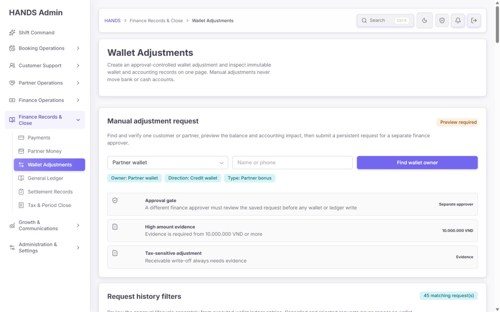

좋은 점은 첫 화면에 검색, 별도 승인, 고액 증거, 세금 민감 증거가 보인다는 것이다. 하지만 운영자는 “새 조정을 만드는 화면”에 들어왔는지 “기존 기록을 찾는 화면”에 들어왔는지 구분하기 어렵다. 내비게이션은 `Finance Records & Close`인데 첫 행동은 고위험 새 요청 생성이다.

수정 기준:

- 페이지 상단에 `새 조정 요청`, `요청 이력`, `원장 기록` 3개 탭을 둔다.
- 내비게이션 위치를 유지한다면 기본 탭은 `원장 기록`이어야 한다.
- `새 조정 요청`은 권한이 있는 maker에게만 보이는 명시적 CTA로 연다.
- 상단의 긴 설명은 “은행·현금 이동 없이 지갑 잔액을 조정합니다. 별도 재무 승인 후 반영됩니다.” 정도로 줄인다.
- 세 정책 카드는 항상 큰 면적으로 반복하지 말고, `안전 규칙 보기` 도움말 또는 우측 요약으로 축소한다.

### Step 2 — 요청 이력 필터와 표 — 건강도 1.5/4

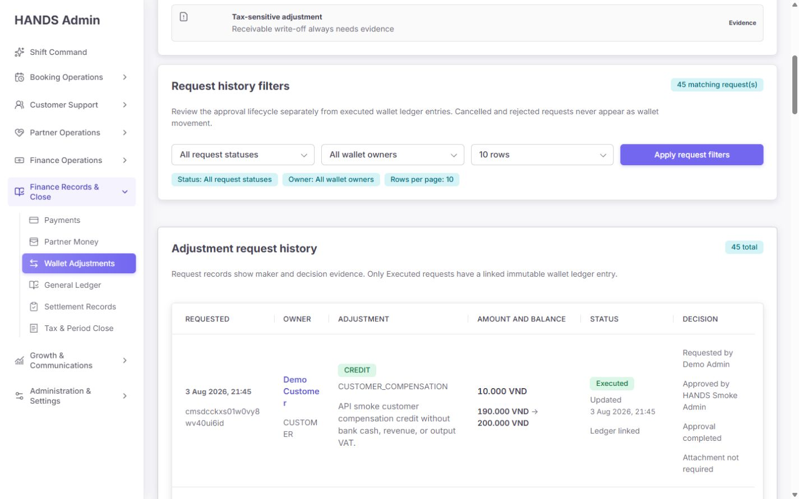

1440px에서도 `Demo Customer`, `CUSTOMER`, 요청 ID가 문자 단위로 쪼개진다. 이유·상태·행위자·증거를 한 행에 모두 넣고 각 열의 최소 너비를 지정하지 않았기 때문이다. 표를 읽는 것이 아니라 글자 조각을 복원해야 한다.

수정 기준:

- 요청 표는 `요청/나이`, `대상`, `변경`, `사유·증거`, `상태·담당`, `다음 행동` 6열로 재구성한다.
- 요청 ID는 전체 문자열 대신 `…ui6id` 같은 짧은 표시 + 복사 버튼 + 전체값 tooltip/details로 제공한다.
- raw enum은 `Credit`, `Customer compensation` 같은 운영 문구로 변환한다.
- 사유는 2줄까지만 보이고 `상세 보기`에서 전체 텍스트와 증거를 연다.
- 표에 페이지 전용 최소 너비를 주고, 단어 중간 `overflow-wrap:anywhere`를 제거한다.
- 요청 행 클릭 또는 `상세 보기`로 request→approval→ledger→journal→audit 연결을 한 패널에서 보여 준다.

### Step 3 — 실행 원장 표 — 건강도 0.8/4

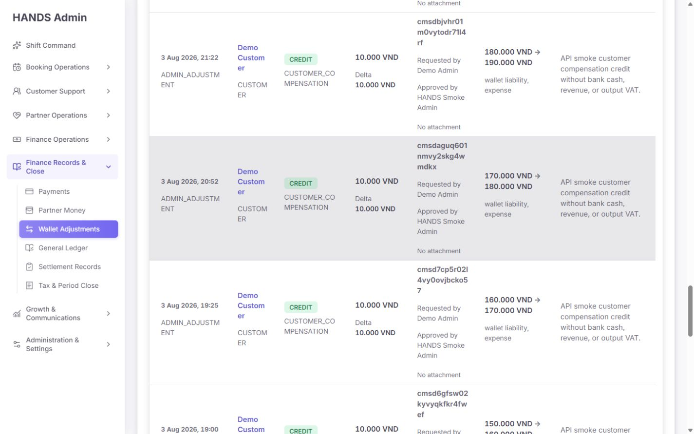

7열에 날짜, 원장 유형, owner, 조정 유형, 금액, approval ID, maker, approver, 증거, 잔액, 회계 영향, 사유를 모두 넣어 가장 읽기 어려운 구간이다. `ADMIN_ADJUSTMENT`, `CUSTOMER_COMPENSATION`, 긴 approval ID가 문자 단위로 깨진다.

수정 기준:

- 기본 행에는 `일시`, `대상`, `변화액`, `결과 잔액`, `유형`, `승인자`만 둔다.
- 회계 영향, 원장 ID, approval/request ID, 증거, 전체 사유는 펼침 상세로 이동한다.
- `Approval` 문자열을 plain text로 두지 말고 요청 상세로 연결한다.
- `Ledger linked`, `Attachment saved` 같은 존재 여부 문구 대신 실제 링크와 접근 불가 원인을 제공한다.
- `No attachment`는 정상 상태와 결손 상태를 분리한다. 필수 아님은 중립, 필수인데 없음은 위험으로 표시한다.

### Step 4 — owner 검색 결과 — 건강도 3.2/4

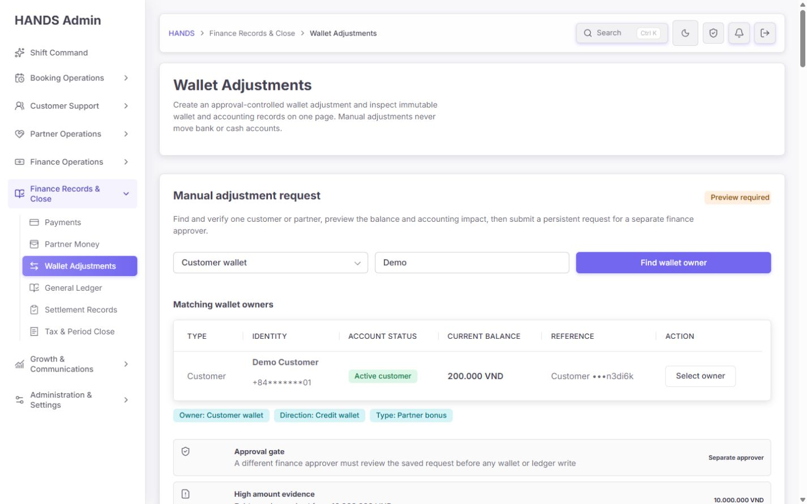

검색 결과는 신원, 전화 마스킹, 상태, 현재 잔액, 짧은 참조값을 제공해 이전 raw ID 입력보다 크게 개선됐다. 다만 Customer wallet을 선택한 순간 하단 이력 필터도 Customer로 바뀌고, 활성 칩에는 `Type: Partner bonus`가 남는다.

수정 기준:

- 생성 폼 상태와 요청/원장 필터 상태에 독립 쿼리 키를 사용한다.
- 예: `createOwnerType`, `requestOwnerType`, `recordOwnerType`.
- owner 유형이 바뀌면 허용되지 않는 adjustment type을 즉시 초기화한다.
- 검색 결과에서 이미 선택된 행은 `선택됨`으로 보이고 중복 `Select owner`를 비활성화한다.
- 이름이 같은 사람이 여러 명일 때 구분할 수 있도록 마스킹 전화, 계정 상태, 지역 또는 내부 reference를 유지한다.

### Step 5 — owner 선택 상태 — 건강도 2.8/4

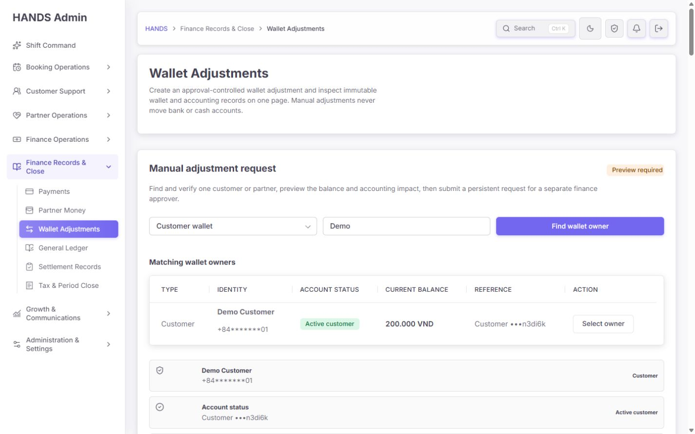

대상 고정 정보는 좋지만 검색 결과 표와 선택 요약을 동시에 계속 보여 중복 면적이 크다. 실제 입력 필드가 첫 viewport 아래로 밀린다.

수정 기준:

- owner 선택 후 검색 결과는 접고 `대상 변경` 버튼만 남긴다.
- 고정 요약은 이름·유형·마스킹 전화·계정 상태·현재 잔액을 한 줄 또는 2열 카드로 압축한다.
- `대상 상세 열기` 링크를 제공한다.
- 계정 block/hold/fraud/closed 상태가 있으면 조정 입력보다 먼저 위험 배너를 표시한다.

### Step 6 — 조정 입력 — 건강도 1.3/4

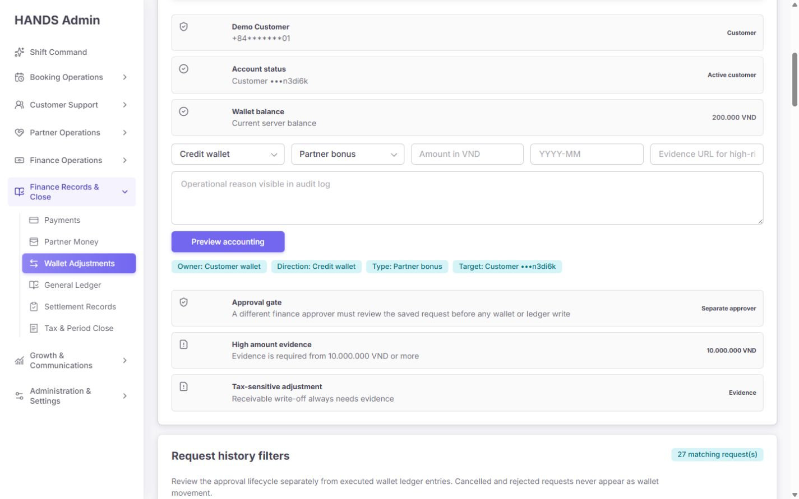

다섯 필드를 한 줄에 압축해 `Attachment URL` 안내가 잘리고, 시각 라벨은 숨겨진 채 값/placeholder만 보인다. Customer wallet인데 기본 유형은 Partner bonus다. `Credit/Debit`은 운영자에게 회계 방향인지 잔액 방향인지 해석 부담을 준다.

수정 기준:

- 1440px에서도 최대 3열로 제한한다. 1행: `잔액 변경`, `사유 유형`, `금액`; 2행: `귀속 월`, `증거`; 3행: `상세 사유`.
- 모든 필드에 보이는 라벨과 helper/error 영역을 둔다.
- `Credit wallet`/`Debit wallet`을 `잔액 추가 (+)`/`잔액 차감 (−)`으로 바꾸고 결과 잔액을 바로 옆에 보여 준다.
- 금액 필드에 VND suffix, 천 단위 표시, API와 동일한 최대 1,000,000,000 VND를 적용한다.
- `Monthly period`는 `type=month` 또는 월 선택기를 사용하고 현재 open/closed 상태를 표시한다.
- 사유는 최대 1,000자와 남은 글자 수를 표시한다.
- Attachment URL 입력을 운영자에게 직접 요구하지 말고 통제된 파일 업로드/증거 선택기를 사용한다.
- booking/refund/dispute/case 등 조정 근거 객체를 선택 또는 링크하도록 한다. 자유 텍스트만으로는 감사 근거가 약하다.

### Step 7 — 정상 회계 미리보기와 최종 제출 — 건강도 2.2/4

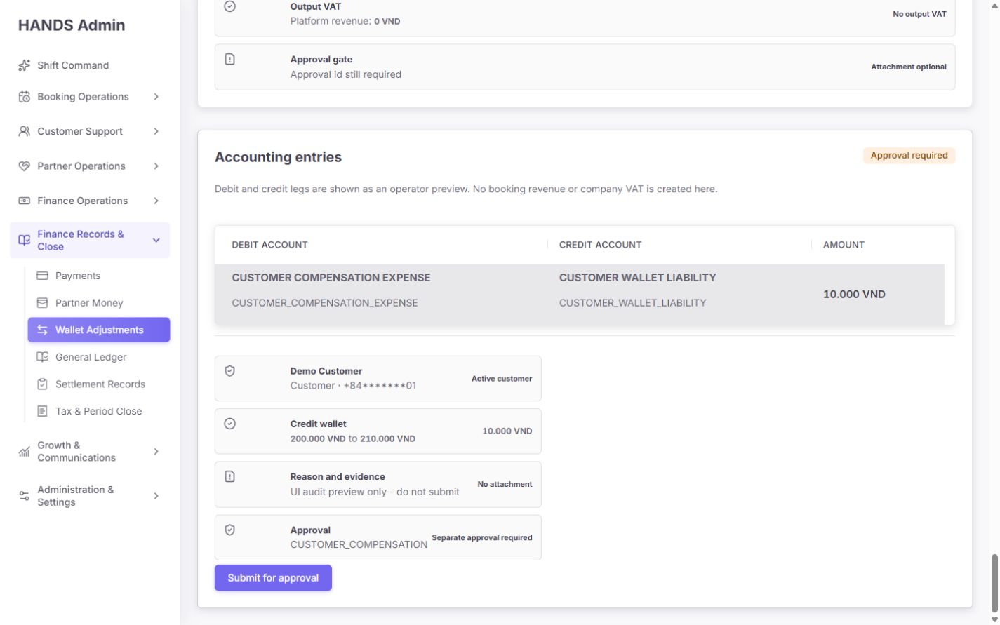

before→after, 회계 계정, 별도 승인 여부를 최종 확인하는 구성 자체는 좋다. 그러나 `Preview accounting`을 누르면 페이지가 맨 위로 돌아가고 결과는 약 9,000px 아래에 생긴다. 제출 버튼은 작고 좌측에 있으며, 미리보기와 요청 이력·원장 이력 사이의 관계가 뒤집혀 있다.

수정 기준:

- 미리보기는 입력 폼 바로 아래 또는 우측 고정 검토 패널에 표시한다.
- `Preview` 성공 후 `#adjustment-review`로 포커스와 스크롤을 이동하고 `aria-live`로 결과를 알린다.
- 최종 CTA는 `승인 요청 생성 — +10,000 VND`처럼 영향이 포함된 문구를 사용한다.
- CTA 바로 위에서 대상, 변화액, 결과 잔액, 사유, 증거, 월, maker를 다시 보여 준다.
- 고위험 유형/금액은 확인 checkbox 또는 명시적 confirmation dialog를 추가한다.
- 실제 요청 생성 후에는 폼 값을 URL에 남기지 말고 `요청 #… 생성됨`, `승인 큐에서 보기`를 제공한다.

### Step 8 — 잔액·세금 영향 미리보기 — 건강도 2.5/4

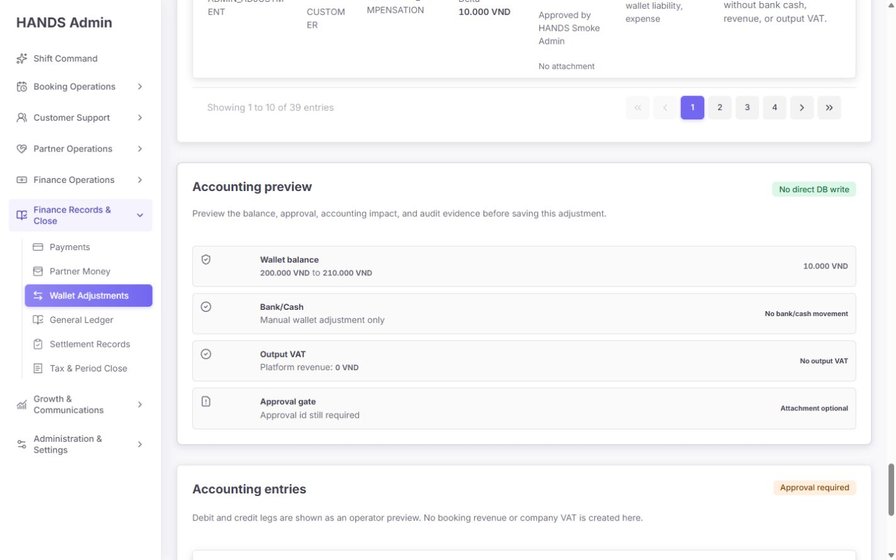

은행/현금, VAT, 잔액 영향이 분리된 점은 좋다. 다만 `No direct DB write`, `Approval id still required`는 구현 내부 문구이며 maker의 실제 다음 행동과 맞지 않는다. maker는 approval ID를 입력하지 않는다.

권장 문구:

| 현재 | 권장 |
|---|---|
| No direct DB write | 미리보기 — 아직 잔액이 변경되지 않았습니다 |
| Approval id still required | 별도 재무 승인 후 잔액에 반영됩니다 |
| Manual wallet adjustment only | 은행·현금 이동 없음 |
| Output VAT / Platform revenue | 회계 상세 안의 `세금·매출 영향 없음` |
| Approval required | 두 번째 승인자 필요 |

회계 원문 계정은 숙련 재무 운영자에게 유용하지만 기본 흐름에서는 `회계 상세` disclosure 안으로 낮추는 것이 적절하다.

### Step 9 — Pending approval 필터 — 건강도 1.7/4

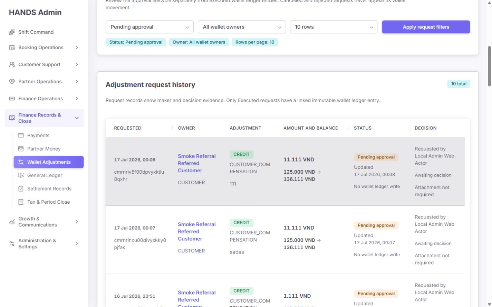

필터는 10개의 pending 요청을 정확히 찾지만 `view=requests`가 실제 화면 모드를 바꾸지 않는다. 적용 후 페이지 맨 위로 돌아가며, 운영자는 다시 아래로 내려와야 한다. 오래된 pending 요청에 나이, SLA, stale 상태, blocker, 담당자, 승인 큐 이동 링크가 없다.

수정 기준:

- `view=requests`를 실제 탭 상태로 구현하고 요청 데이터만 불러온다.
- 필터 적용 후 해당 탭·표 시작점에 포커스를 둔다.
- pending 기본 정렬은 `오래된 순` 또는 SLA 위험 순으로 제공한다.
- `나이`, `stale`, `현재 잔액 변경`, `증거 누락`, `내가 maker라 승인 불가`를 표시한다.
- 실행 가능한 pending은 `/finance-tax/approval-queue?view=wallet`로 연결한다.
- maker에게는 stale request 취소와 재생성 경로를 보여 준다.

### Step 10 — Manual reversal 무응답 실패 — 건강도 0.5/4

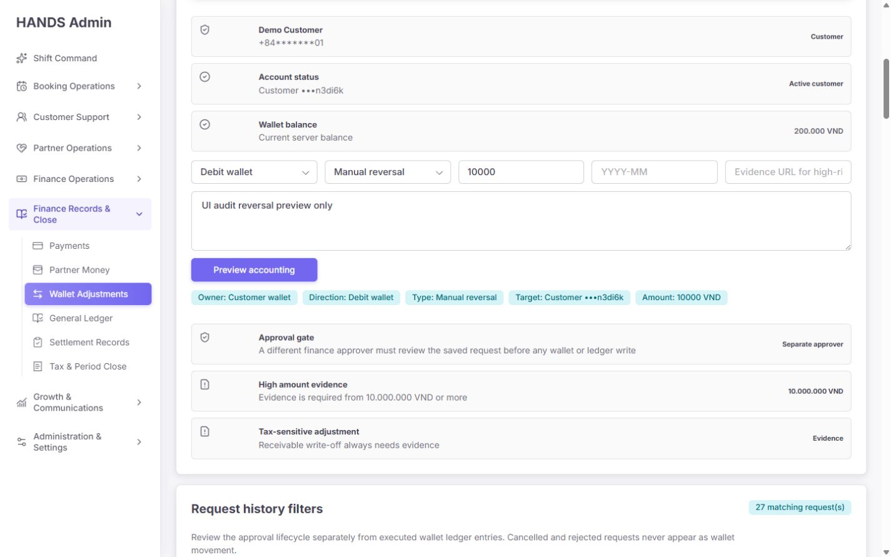

UI는 `Manual reversal`을 일반 유형으로 제공하지만 원본 실행 요청을 선택하는 필드가 없다. API는 `reversalOfRequestId`가 필수라서 미리보기가 실패하고, Admin Web의 `adminPost(..., null)` fallback 때문에 아무 오류도 표시되지 않는다. 사용자는 버튼이 고장 난 것으로 인식한다.

수정 기준:

- `Manual reversal`을 새 요청 유형 목록에서 제거한다.
- 반전은 실행 완료된 조정 상세의 `이 조정 반전 요청`에서만 시작한다.
- 원본 request/ledger/accounting evidence를 고정하고 반대 방향·동일 금액을 자동 생성한다.
- 이미 반전됨, 원본 증거 불일치, 닫힌 월, 다른 owner 같은 실패 이유를 인라인 오류로 표시한다.
- preview API의 실패를 `null`로 숨기지 말고 구조화된 오류 코드와 안전한 운영 문구로 반환한다.

### Step 11 — Customer wallet + Partner bonus 허용 — 건강도 0/4, P0

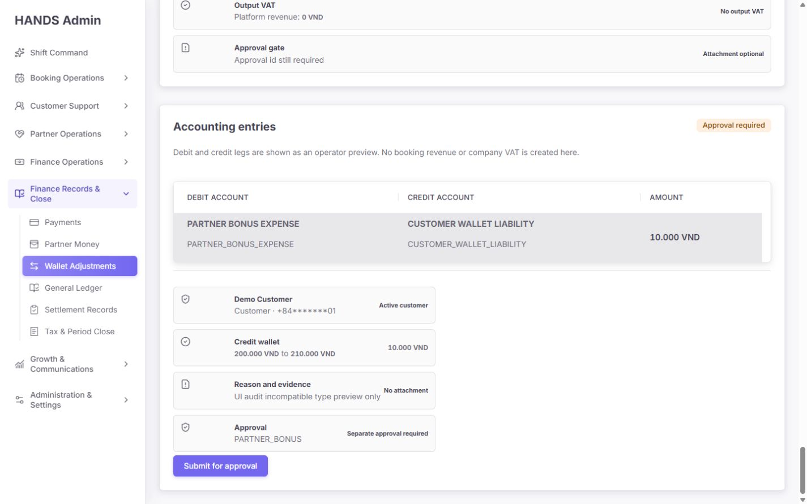

Customer wallet에 Partner bonus를 선택해 미리보기를 실행하자 다음 회계안이 생성됐다.

- Debit: `PARTNER_BONUS_EXPENSE`
- Credit: `CUSTOMER_WALLET_LIABILITY`
- CTA: `Submit for approval` 활성화

이는 단순 문구 문제가 아니라 잘못된 비용 분류 요청을 실제로 저장할 수 있는 회계 통제 결함이다. `apps/api/src/wallet-adjustments/wallet-adjustments.accounting.ts`의 검증은 admin ID, approval ID, reason, 금액, 잔액, closed period만 확인하고 owner/type/direction 조합은 확인하지 않는다.

필수 수정:

- 허용 조합을 UI와 API의 단일 정책으로 정의한다.
- 예시:
  - Customer + Credit: Promotion credit, Customer compensation, Referral correction, Error correction
  - Customer + Debit: Error correction, Penalty 등 정책상 허용된 것만
  - Partner + Credit: Partner bonus, Partner compensation, Referral correction, Error correction
  - Partner + Debit: Penalty, Receivable write-off, Error correction 등 정책상 허용된 것만
- 정확한 회계 정책은 재무 책임자가 확정해야 하며, API가 최종 권위가 되어야 한다.
- `PROMOTION_CREDIT` on Partner, `PARTNER_BONUS` on Customer, `RECEIVABLE_WRITE_OFF` on Customer 등을 명시적으로 거절하는 단위 테스트를 추가한다.
- 방향까지 포함한 모든 허용 조합의 debit/credit 계정 snapshot 테스트를 추가한다.
- 화면 옵션은 API가 제공하는 허용 목록 또는 공유 계약에서 파생한다. 프런트와 API에 별도 하드코딩하지 않는다.

## 6. P0/P1 코드 감사 결과

### P0-1. 회계 유형 조합 검증 부재

근거:

- `apps/admin_web/app/wallet-adjustments/page.tsx:59-68`은 모든 owner에게 모든 adjustment type을 노출한다.
- `apps/api/src/wallet-adjustments/wallet-adjustments.accounting.ts:290-319`은 owner와 무관한 계정 이름을 반환할 수 있다.
- 같은 파일 `330-340`의 검증에는 owner/type/direction matrix가 없다.
- `apps/api/src/admin/admin.service.ts:25638-25718`도 enum 정규화와 reversal 요건만 확인한다.

추가 위험:

- `PENALTY` debit은 UI의 `blockedAccountingImpact`로 버튼만 막지만 API·server action은 동일 제한을 강제하지 않는다.
- `PENALTY` credit은 일반 비용 조정으로 허용될 수 있어 업무 의미가 뒤집힌다.
- `MANUAL_REVERSAL`은 UI에 있지만 server action payload가 `reversalOfRequestId`를 보내지 않아 정상 경로가 존재하지 않는다.

### P0-2. 민감한 업무 사유와 증거 URL의 URL 노출

근거:

- 생성·미리보기 폼이 GET 방식이다: `page.tsx:141`, `168`.
- `readWalletAdjustmentFormState`가 reason·attachmentUrl을 search params에서 읽는다: `page.tsx:976-990`.
- server action redirect도 reason·attachmentUrl·ownerId·amount를 다시 쿼리로 붙인다: `actions.ts:115-153`.

영향:

- 브라우저 히스토리, 화면 공유, 접근 로그, 오류 수집, referrer에 내부 사유·signed evidence URL이 남을 수 있다.
- URL 길이 제한과 복사·공유 실수로 사유가 노출될 수 있다.

수정:

- 미리보기는 client state + 인증된 preview endpoint 또는 POST server action을 사용한다.
- 새로고침 복구가 필요하면 서버 측 임시 draft ID만 URL에 둔다.
- redirect에는 `adjustmentNotice`와 생성된 request ID만 포함한다.
- 증거는 통제된 storage object ID로 저장하고 짧은 만료 URL은 렌더 시 발급한다.

### P0-3. UI-only block과 서버 정책 불일치

`CreateAdjustmentForm`은 revenue/tax/bank 영향이 있으면 버튼을 disabled 처리하지만, 이는 브라우저 UI 제약일 뿐이다. 동일 payload를 server action/API로 보내는 경우 같은 정책을 강제하지 않는다. 금전·회계 차단 규칙은 반드시 API에서 시행하고 UI는 그 결과를 설명해야 한다.

### P1-1. 실패를 빈 데이터와 동일하게 처리

근거:

- owner 검색, preview, 요청 목록·summary, 원장 목록·summary가 각각 `[]`, `null`, `{total:0}` fallback을 사용한다: `page.tsx:798-868`.
- `adminGet`은 `adminGetResult`의 `ok/status`를 버린다: `apps/admin_web/lib/admin-api.ts:5924-5960`.

결과:

- API 장애가 `0 matching`, `No records`, `Preview required`로 보인다.
- 운영자는 실제 0건과 조회 실패를 구분할 수 없다.

수정:

- 각 데이터 소스에 `ok`, `status`, `retrievedAt`, `retry` 상태를 유지한다.
- 실패한 section만 `조회 실패 — 다시 시도`로 표시하고 나머지는 유지한다.
- 미리보기 검증 오류는 필드별 오류와 상단 요약으로 표시한다.

### P1-2. `view` 파라미터가 실제로 아무 일도 하지 않음

`view=requests`와 `view=records`는 링크와 hidden input에만 존재하고 렌더 분기에는 사용되지 않는다. 그래서 두 표와 두 summary가 항상 모두 로드되고, 어떤 view 링크를 눌러도 긴 통합 페이지가 그대로 나온다.

수정:

- `view=create | requests | records`를 실제 렌더·데이터 로드 분기로 사용한다.
- 기본은 records, pending 승인 업무는 Approval Queue로 연결한다.
- 탭 전환 시 해당 view에 필요한 API만 호출한다.

### P1-3. 세 업무가 같은 쿼리 키를 공유

생성 폼, request filter, record filter가 모두 `ownerType`을 사용한다. 한 폼의 선택이 다른 두 데이터셋의 필터가 된다. exact owner를 선택한 뒤 pagination 링크는 `ownerId`를 보존하지만 `ownerSearch`를 잃어, UI에는 선택된 대상이 보이지 않는데 API는 숨은 ownerId로 계속 필터링할 수 있다.

수정:

- 생성: `createOwnerType`, `createOwnerId`
- 요청: `requestOwnerType`, `requestOwnerId`, `requestStatus`
- 원장: `recordOwnerType`, `recordOwnerId`
- exact owner 필터가 적용되면 항상 이름/reference chip과 `해제`를 표시한다.
- pagination은 활성 view의 모든 필터만 정확히 보존한다.

### P1-4. 불필요한 요청·HTML·DOM

현재 기본 렌더는 owner 검색 외에도 request list, request summary, ledger list, ledger summary를 항상 실행한다. preview가 있으면 추가 POST도 실행한다. 모두 live/no-store다. 실제 측정에서 상태에 따라 DOM 약 1,382개, 본문 약 10,583자, 세로 길이 약 8,053~9,260px였다.

수정 목표:

- 활성 탭 데이터만 1~2개 API 호출로 로드한다.
- list 응답에 pagination total을 함께 주어 별도 summary count 호출을 없앤다.
- 초기 DOM 600개 이하, 기본 view 세로 길이 2,500px 이하를 목표로 한다.
- 상세 증거는 row disclosure/drawer를 열 때 로드한다.

## 7. 필터와 운영 도구 재설계

### 새 조정 요청

- owner 유형, 이름/전화 검색
- 선택된 owner 고정 요약 + 변경
- 잔액 추가/차감
- owner·방향에 따라 허용된 사유 유형만 표시
- 금액/VND, 귀속 월, 관련 case/booking/refund
- 증거 업로드/선택
- 상세 사유
- inline preview + 최종 승인 요청

### 요청 이력

필수 필터:

- 상태: Pending, Ready, Blocked, Stale, Executed, Rejected, Cancelled
- 기간: 오늘, 7일, 30일, 사용자 지정
- owner 이름/전화/reference
- request ID
- maker/approver
- adjustment type, direction
- 금액 범위
- 증거: 필수 누락, 첨부 있음, 선택 사항
- 정렬: 오래된 순, 최신 순, 큰 금액 순, SLA 위험 순
- `모두 초기화`

### 원장 기록

필수 필터:

- posting 기간/귀속 월
- owner
- request/approval/ledger/journal ID
- adjustment type/direction
- 금액 범위
- 반전 여부
- maker/approver
- 회계 영향 계정
- 감사 내보내기 CSV

## 8. 권장 페이지 구조

페이지를 물리적으로 세 URL로 늘릴 필요는 없다. 한 route에서 탭과 데이터 계약을 분리하는 것이 가장 효율적이다.

```text
Wallet Adjustments
├─ Records (기본)
│  ├─ 검색/기간/유형/금액 필터
│  └─ 압축 원장 표 + 증거 상세 drawer
├─ Requests
│  ├─ 전체 lifecycle 이력
│  └─ Pending은 Approval Queue로 이동
└─ New request (권한 있는 maker만)
   ├─ 대상 검색·고정
   ├─ 정책 기반 입력
   └─ 같은 화면의 review panel
```

업무 소유권:

- `/wallet-adjustments?view=records`: 감사·조회, Finance Records & Close
- `/wallet-adjustments?view=requests`: lifecycle 이력
- `/wallet-adjustments?view=create`: maker 요청 생성
- `/finance-tax/approval-queue?view=wallet`: pending 승인·거절·stale 취소의 유일한 실행 workspace

이렇게 하면 같은 데이터를 중복 관리하지 않으면서 “기록 조회”와 “지금 결정할 일”을 분리할 수 있다.

## 9. 접근성 감사

확인된 강점:

- h1/h2/h3 구조와 native form controls가 있다.
- 상태는 색상만이 아니라 텍스트로도 표시한다.
- table header에 `scope=col`이 있고, pagination에 aria-label이 있다.
- notice는 `role=status`를 사용한다.

개선 필요:

1. `AdminForm*`의 label 기본값이 hidden이어서 시각 사용자는 placeholder와 현재 선택값에 의존한다. 값이 입력되면 필드 의미가 사라진다.
2. placeholder 색은 약 2.30:1로 안내 텍스트 기준에도 매우 약하다. 실제 시각 라벨로 사용해서는 안 된다.
3. primary 버튼의 흰색/보라색 대비는 약 4.26:1로 14px 일반 텍스트 AA 4.5:1에 조금 못 미친다.
4. 세 table region이 모두 기본 `Scrollable data table` 이름을 사용한다. `Owner search results`, `Adjustment requests`, `Executed wallet ledger`처럼 고유한 이름이 필요하다.
5. request와 record filter 모두 `Wallet owner`, `Rows per page`라는 중복 accessible name을 가진다. fieldset/legend 또는 고유 라벨이 필요하다.
6. GET navigation 후 포커스가 페이지 위로 돌아가 결과·오류·preview를 알 수 없다.
7. API 오류가 렌더되지 않아 `aria-invalid`, `aria-describedby`, 오류 summary, 오류 field focus가 없다.
8. 긴 ID의 문자 단위 줄바꿈은 저시력·확대 사용자의 탐색 부담을 키운다.

## 10. 문구 개선안

| 현재 문구 | 권장 문구 |
|---|---|
| Wallet owner type | 지갑 대상 |
| Customer or partner | 이름 또는 전화번호 |
| Credit wallet | 잔액 추가 (+) |
| Debit wallet | 잔액 차감 (−) |
| Adjustment type | 조정 사유 유형 |
| Monthly period | 회계 귀속 월 |
| Attachment URL | 증거 첨부 |
| Preview accounting | 변경 내용 검토 |
| Preview required | 검토 필요 |
| Submit for approval | 승인 요청 생성 |
| Adjustment request history | 조정 요청 이력 |
| Manual adjustment history | 실행된 지갑 조정 |
| Ledger linked | 원장 기록 보기 |
| No wallet ledger write | 잔액 변경 없음 |
| Awaiting decision | 재무 승인 대기 |
| No direct DB write | 미리보기 — 아직 반영되지 않음 |

raw enum은 기본 화면에서 숨기고 상세 증거에만 둔다.

## 11. 구현 우선순위

### P0 — 배포 전 처리

1. owner/type/direction 허용 matrix를 API에서 강제하고 전체 회계 snapshot 테스트 추가.
2. Customer + Partner bonus, Partner + Promotion credit, Customer + Receivable write-off 등 잘못된 조합 차단.
3. Penalty/revenue block을 API 정책으로 이동하고 UI-only 제한 제거.
4. Manual reversal을 일반 옵션에서 제거하고 원본 실행 기록에서만 시작.
5. reason/attachmentUrl/ownerId/amount를 URL과 redirect에서 제거.

### P1 — 운영 생산성

6. `view=create|requests|records`를 실제 탭·lazy data load로 구현.
7. preview를 입력 바로 옆/아래로 이동하고 성공·오류 포커스 처리.
8. fallback empty-state를 실제 API 오류 상태와 분리.
9. 쿼리 키 분리와 exact owner filter 보존·해제.
10. 요청·원장 표를 압축하고 ID·enum·사유를 상세 drawer로 이동.
11. pending 요청에 age/SLA/blocker와 Approval Queue 링크 추가.
12. 필터에 기간, 검색, 유형, 금액, actor, evidence, reset, sort 추가.

### P2 — 완성도

13. 시각 라벨, type=month, VND formatting, max length/amount 적용.
14. 증거 URL 대신 통제된 upload/attachment picker와 실제 열기 링크 제공.
15. 문구 humanize, 기술·회계 원문은 disclosure로 낮춤.
16. button/placeholder 대비와 table region 이름 개선.
17. 성공 notice에 request 상세·Approval Queue·새 요청 시작 링크 제공.

## 12. 수용 기준

- [ ] Customer wallet에서 Partner-only 유형이 보이지 않고 API 직접 호출도 4xx로 차단된다.
- [ ] Partner wallet에서 Customer-only 유형이 보이지 않고 API 직접 호출도 4xx로 차단된다.
- [ ] 모든 owner/type/direction 허용·거절 matrix에 테스트가 있다.
- [ ] Manual reversal은 원본 executed request 없이는 시작할 수 없다.
- [ ] URL·브라우저 히스토리에 reason과 attachment URL이 남지 않는다.
- [ ] preview 성공 후 1 viewport 안에서 결과와 CTA를 볼 수 있다.
- [ ] preview 실패 시 원인과 수정 방법이 해당 필드에 표시된다.
- [ ] `view=requests`에서 records API를, `view=records`에서 requests API를 불필요하게 호출하지 않는다.
- [ ] 필터 적용 후 해당 결과 heading으로 포커스가 이동한다.
- [ ] 세 table region의 accessible name이 서로 다르다.
- [ ] 1440px에서 owner명·enum·ID가 문자 단위로 쪼개지지 않는다.
- [ ] pending 요청에서 age/SLA/blocker/다음 행동을 바로 확인한다.
- [ ] 요청→승인→ledger→journal→audit evidence를 링크로 추적할 수 있다.
- [ ] API 실패가 0건/빈 상태로 위장되지 않는다.
- [ ] 시각 라벨이 항상 남고 placeholder를 라벨로 사용하지 않는다.
- [ ] 일반 크기 primary 버튼 텍스트가 4.5:1 이상이다.

## 13. 코드 및 테스트 검증

실행 결과:

```text
npm.cmd run test --workspace @massage-vn/admin-web --
  app/wallet-adjustments/page.spec.tsx
  app/wallet-adjustments/actions.spec.ts

2 files, 37 tests passed
```

```text
npm.cmd run test --workspace @massage-vn/api --
  src/wallet-adjustments/wallet-adjustments.accounting.spec.ts

1 file, 10 tests passed
```

테스트가 통과해도 현재 문제를 막지 못한다. 특히 다음 테스트가 없다.

- owner/type/direction 거절 matrix
- Customer + Partner bonus 금지
- Manual reversal UI 정상 시작 경로
- preview API 오류 노출
- URL에 사유·증거를 남기지 않는 계약
- 실제 `view`별 lazy load
- filter state 독립성 및 pagination 보존
- 1440px 표 최소 너비/줄바꿈 회귀

Impeccable 기계 검사는 page-specific 치명 항목을 추가로 찾지 못했고, 전역 CSS의 side-tab 경고만 보고했다. 이번 핵심 결함은 정규식 기반 스타일 검사보다 실제 흐름·회계 계약·렌더 순서에서 발견됐다.

## 14. 증거 한계와 확인하지 않은 항목

- 실제 승인 요청 생성, 승인, 거절, stale 취소, 반전은 금전 상태를 바꾸므로 실행하지 않았다.
- API 서버를 의도적으로 중단하거나 권한을 바꿔 장애·무권한 상태를 재현하지 않았다. 다만 fallback 구현은 코드로 확인했다.
- 1024px 이하 화면은 사용자의 운영 환경 범위 밖이므로 검사·평가·권고에서 제외했다.
- 스크린리더 실기와 브라우저 확대 200% 전체 검증은 하지 않았다.
- 회계 허용 matrix의 최종 업무 정의는 재무 책임자의 승인 대상이다. 본 보고서는 현재 코드가 서로 모순된 조합을 허용한다는 사실을 확정한다.

## 15. 최종 판단

검색 기반 대상 고정, maker/checker, idempotency, 잔액 재검증, 불변 원장 연결은 좋은 기반이다. 하지만 현재 화면은 이 기반 위에 생성·요청·원장·미리보기를 모두 세로로 쌓으면서 운영 집중도를 잃었고, 더 중요하게는 owner와 회계 유형의 의미적 조합을 검증하지 않아 잘못된 회계 분류를 제출할 수 있다.

가장 먼저 **회계 허용 matrix + URL 민감정보 제거 + preview 오류 노출**을 해결해야 한다. 그다음 한 route 안에서 `Records / Requests / New request`를 실제 탭으로 분리하고, 미리보기를 입력 옆에 붙이면 운영 안전성과 속도, 가독성을 동시에 크게 개선할 수 있다.
