# Wallet Adjustments 수정 후 심층 재감사 보고서

- 감사일: 2026-08-09
- 대상: `http://localhost:3101/wallet-adjustments`
- 관점: 실제 재무 운영자, 승인자, 감사 대응자
- 화면 기준: **1440 × 900 데스크톱만 검사**
- 제외: **1024px 이하, 모바일, 태블릿, 반응형 화면은 검사·점수·개선 목록에서 완전히 제외**
- 방법: 현재 실행 화면 13개 상태 캡처, DOM/포커스/URL 확인, 프런트엔드·API·회계 정책·승인 경로·테스트 검토
- 안전 원칙: 검색과 미리보기만 실행했으며 요청 생성, 승인, 거절, 취소, 실제 잔액 변경은 수행하지 않았다.

## 1. 최종 결론

이전 감사의 핵심 문제였던 화면 과밀, 민감한 폼 값의 URL 노출, 잘못된 owner/type/direction 조합, 수동 반전의 임의 입력 문제는 **대부분 제대로 개선됐다**. 특히 Records / Requests / New request 분리, 활성 화면만 조회하는 데이터 로딩, 정책 기반 사유 선택, 서버 재검증, 미리보기 무효화, 원본에 묶인 reversal은 유지할 가치가 높은 개선이다.

그러나 현재 상태를 “재무 운영 도구로 완료”라고 승인하기는 어렵다. 이번 재감사에서 다음 두 가지 회계 통제 문제가 확인됐다.

1. **신규 일반 조정은 `DECLARED` 또는 `PAID` 회계 월에도 허용될 수 있다.** reversal은 `DECLARED`, `PAID`, `CLOSED`를 모두 차단하지만 일반 조정은 `CLOSED`만 차단한다. 신고·납부된 월의 원장에 신규 조정이 들어갈 수 있는 비대칭이다.
2. **고객 상세의 Master Admin 즉시 조정 경로는 동일 maker/checker 원칙을 우회한다.** `/wallet-adjustments`는 별도 승인을 강조하지만 같은 도메인의 `customer-direct` API는 동일 운영자가 요청 생성과 실행을 한 트랜잭션에서 끝낸다.

또한 주 테이블은 읽기 좋아졌지만, 행을 펼치면 상세 내용이 마지막 열 24% 폭 안에 들어가면서 행 전체가 거대한 회색 블록으로 무너진다. Requests 기본값도 실행 대기 업무가 아니라 전체 이력이어서, 운영자는 승인 대기 10건을 찾기 위해 필터를 추가로 조작해야 한다.

**최종 판정: 조건부 미승인 — 핵심 재설계는 성공했지만 P0 회계 통제 2건과 P1 운영성 결함을 수정한 뒤 재검증해야 한다.**

## 2. 이전 보고서 대비 완료도

| 이전 핵심 요구 | 현재 판정 | 확인 내용 |
|---|---:|---|
| Records / Requests / New request 작업 공간 분리 | 완료 | URL로 주소화되고 활성 탭만 주요 데이터를 불러온다. |
| 검색·미리보기 중 owner/금액/사유/evidence URL 비노출 | 완료 | 검색과 미리보기 후 URL은 `?view=create`만 유지됐다. |
| owner/type/direction 허용 매트릭스 | 완료 | UI는 정책 API에서 사유를 만들고 API가 생성·승인 시점에 다시 검사한다. |
| 고객 + Partner Bonus 차단 | 신규 요청에서는 완료 | Customer Credit/ Debit 선택에서 Partner Bonus가 노출되지 않는다. 단, 기존 invalid pending 데이터는 별도 격리가 안 됐다. |
| 활성 화면만 데이터 조회 | 완료 | records 2개 요청, requests 2개 요청, create는 policy/필요 시 원본만 조회한다. |
| 미리보기 후 입력 변경 시 제출 차단 | 완료 | 금액을 바꾸자 Current preview가 즉시 사라지고 생성 버튼이 다시 비활성화됐다. |
| source-bound reversal | 완료 | owner, 원본 request, ledger, 금액, 반대 방향이 고정된다. |
| 주 테이블 가독성 | 부분 완료 | 기본 행은 좋아졌지만 details를 펼치면 레이아웃이 심하게 무너진다. |
| pending age / blocker / Approval Queue 연결 | 부분 완료 | age와 큐 링크는 추가됐지만 blocker가 생성되지 않고 기본 정렬도 최신순이다. |
| stale 요청 운영 | 부분 완료 | API에는 stale cancel이 있으나 이 화면에는 분명한 stale severity/취소·재생성 안내가 없다. |
| 회계 월 선택기와 open/closed 상태 | 미완료 | month input은 생겼지만 optional이고 현재 상태가 안 보인다. `DECLARED`/`PAID` 일반 조정도 차단되지 않는다. |
| controlled evidence | 미완료 | 여전히 임의 HTTP/HTTPS 문자열 URL이다. 업로드된 불변 파일 ID, checksum, 보존 상태가 아니다. |
| 문서 제목·운영 문구 마감 | 미완료 | `document.title`이 빈 문자열이고 `record(s)`, `request(s)` 문구가 남아 있다. |

## 3. Audit Health Score

1024px 이하 반응형은 사용자 요구에 따라 제외하고, 해당 축을 **1440 Desktop Layout**으로 대체했다.

| # | 평가 축 | 점수 | 핵심 근거 |
|---:|---|---:|---|
| 1 | Accessibility | 3/4 | 탭·영역·폼 라벨·포커스 링·오류 포커스는 좋다. 동적 검색/미리보기 상태 알림과 Step 2 포커스 이동은 부족하다. |
| 2 | Performance | 3/4 | 활성 view만 조회하고 DOM은 약 900개 수준이다. 최대 25~50행에 owner/admin 보강 조회가 있으나 현재 범위에서는 양호하다. |
| 3 | 1440 Desktop Layout | 2/4 | 기본 표와 생성 workspace는 좋아졌다. 두 종류의 expanded details가 마지막 열 안에서 붕괴한다. |
| 4 | Theming | 4/4 | 다크 모드가 토큰 기반으로 안정적으로 적용되고 표·필터·상태 배지의 의미가 유지된다. |
| 5 | Implementation Integrity | 1/4 | 신고/납부 월 허용 비대칭과 customer-direct 단일 운영자 실행이 기존 maker/checker 원칙과 충돌한다. |
| **총점** |  | **13/20** | **Acceptable — 구조 개선은 크지만 재무 통제와 행 상세를 우선 수정해야 함** |

이전 체감 품질은 약 45/100 수준이었고, 현재 기본 화면·신규 요청 흐름은 확실히 좋아졌다. 다만 이번 점수는 “예뻐졌는가”보다 “운영자가 잘못된 재무 결과를 만들지 않는가”에 더 높은 가중치를 두었다.

## 4. 심각도 요약

- P0 Blocking: 2건
- P1 Major: 7건
- P2 Minor: 5건
- P3 Polish: 2건

### 최우선 5개

1. 일반 조정도 `DECLARED`, `PAID`, `CLOSED` 기간을 차단하고 승인 시 재검증한다.
2. `customer-direct` 즉시 실행을 제거하거나 정식 break-glass 정책으로 분리한다.
3. record/request 상세를 마지막 셀 안이 아닌 full-width detail row 또는 drawer로 바꾼다.
4. Requests 기본값을 `Awaiting finance approval + oldest/stale first`로 바꾸고 legacy invalid 요청을 quarantine한다.
5. evidence를 임의 URL이 아닌 내부 파일 ID 기반 불변 증거로 전환한다.

## 5. 화면 흐름별 재감사

### Step 1 — Records 진입

**상태: 양호**

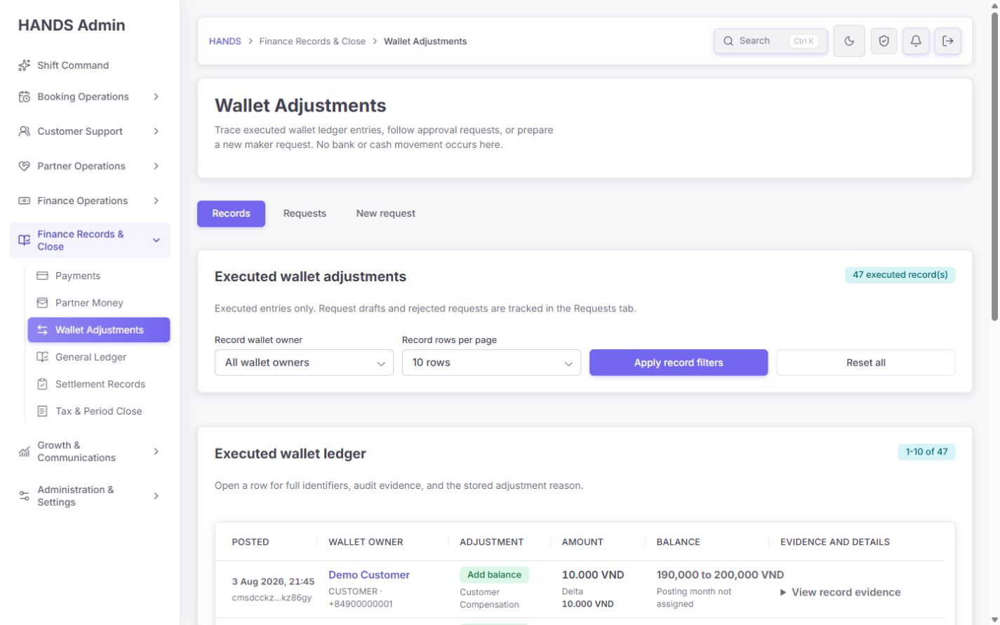

- Records가 기본 view이며 실행된 불변 원장만 표시한다.
- Requests, New request가 탭으로 명확히 분리됐다.
- 페이지 설명의 “No bank or cash movement occurs here”는 범위를 이해하는 데 도움이 된다.
- 현재 47건이라는 결과가 보이고 filters와 표가 분리돼 있다.
- 다만 `47 executed record(s)`는 개발 편의 문구처럼 보인다. 자연 복수형 `47 executed records`로 바꿔야 한다.

### Step 2 — 실행 원장 표

**상태: 대체로 양호**

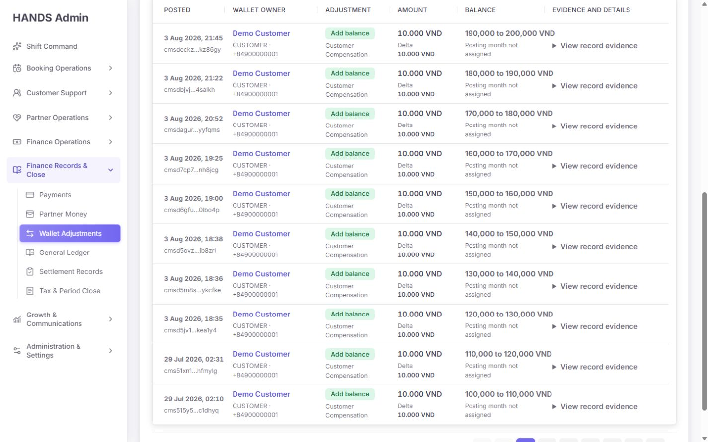

- 6개 열로 축약되어 날짜, owner, 유형, 금액, 잔액, 상세 행동을 빠르게 훑을 수 있다.
- 금액과 before/after가 줄 단위로 안정되어 이전의 문자 단위 줄바꿈이 사라졌다.
- 1440px에서 문서 자체 horizontal overflow는 없었다.
- 다만 필터가 owner type과 page size뿐이라 건수가 커지면 기간, owner 검색, adjustment type, direction, evidence 유무, actor, 금액, 정렬을 찾을 수 없다.
- `Posting month not assigned`가 거의 모든 legacy 행에 반복된다. 이것은 일반 안내가 아니라 data repair queue로 승격해야 할 데이터 품질 신호다.

### Step 3 — Record evidence 펼침

**상태: 불량**

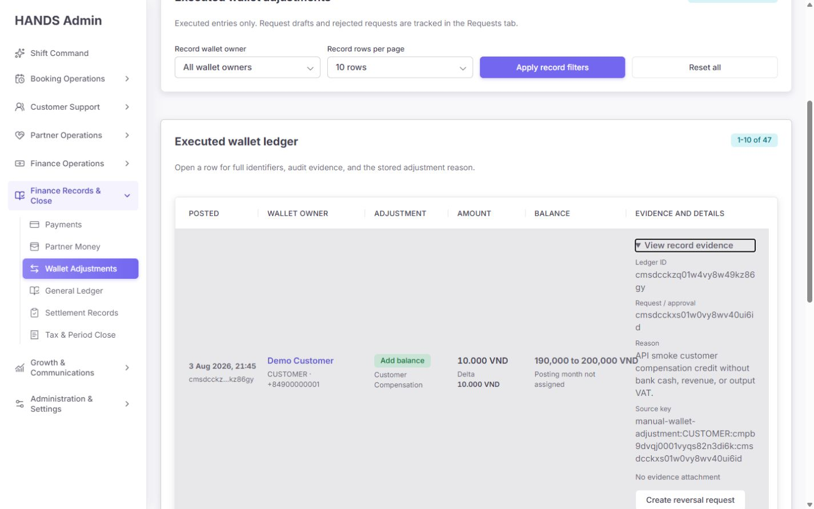

- `details`가 마지막 열 안에 렌더링돼 행 전체 높이가 크게 늘어나고 앞의 5개 셀은 행 하단으로 밀린다.
- ledger ID, approval ID, source key가 약 24% 열 폭에서 여러 줄로 깨진다.
- reason과 evidence, reversal CTA가 한 열에 세로로 쌓여 감사 정보의 관계를 읽기 어렵다.
- 수정 방법: summary row 다음에 `<tr><td colSpan={6}>…</td></tr>`로 full-width detail row를 만들거나 520~640px drawer를 사용한다.
- detail 내부는 `Request`, `Ledger`, `Actor`, `Period`, `Reason`, `Evidence`, `Accounting` 섹션으로 나누고 ID는 short ID + Copy 버튼으로 제공한다.

### Step 4 — Reversal workspace

**상태: 부분 양호**

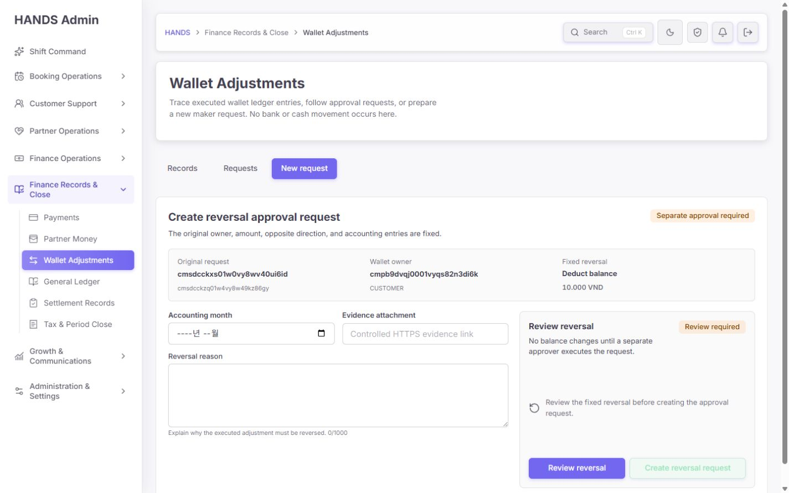

- 원본 request/ledger, 같은 owner, 같은 금액, 반대 direction이 고정된 점은 매우 좋다.
- 별도 승인을 요구하고 preview 전에는 create 버튼이 비활성화된다.
- 그러나 single-request API가 owner display name을 보강하지 않아 `Wallet owner`가 raw ID로 표시된다.
- 원본 실행 시각, before/after balance, maker, approver, evidence 유무, accounting period가 상단 확인 카드에 없다.
- reversal에서 증거 링크가 optional로 보인다. 정책상 reversal마다 증거가 필수인지 확정한 뒤, 필수라면 API와 UI를 동시에 강제해야 한다.
- accounting month는 현재 기간 상태를 보여 주지 않는다.

### Step 5 — Requests 기본 화면

**상태: 개선 필요**

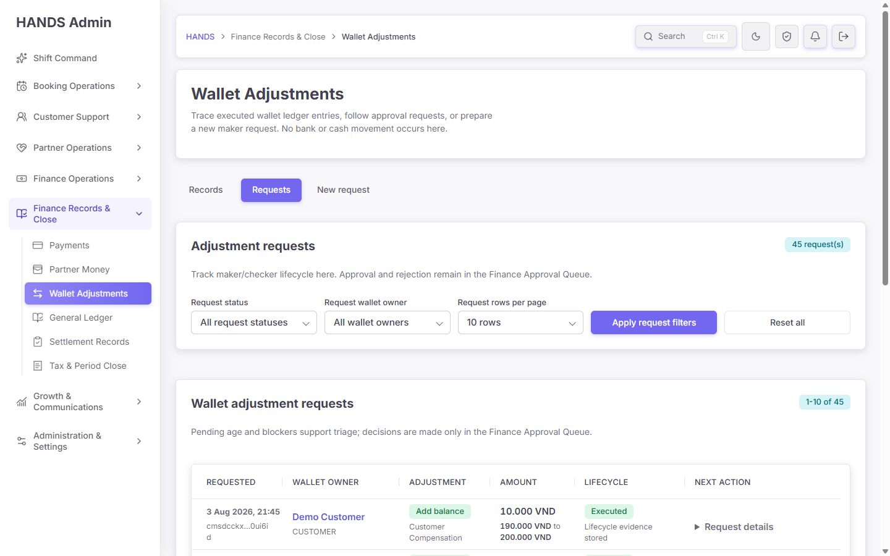

- request lifecycle을 별도 view로 분리한 방향은 맞다.
- 그러나 기본값이 `All request statuses`여서 45건 전체를 보여 준다.
- 운영자가 이 화면에 들어오는 1차 목적은 승인 대기·실패·stale 예외 처리다. 실행 이력 35건이 첫 화면을 차지하면 Requests가 또 하나의 history가 된다.
- 기본값을 `Awaiting finance approval`로 하고, All/Executed/Rejected/Cancelled는 History saved view로 내려야 한다.

### Step 6 — Requests 전체 표

**상태: 개선 필요**

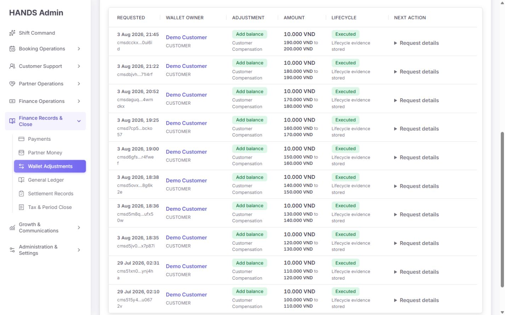

- 6열 구조는 정리됐지만 첫 페이지가 대부분 Executed이므로 다음 행동이 없는 행이 중심이다.
- short request ID 일부가 끝 한 글자만 다음 줄로 밀린다.
- status별 카운트, oldest pending, evidence missing, balance changed, invalid policy와 같은 운영 요약이 없다.
- Requests 상단에 `Awaiting`, `Stale`, `Blocked`, `History` 4개 saved view와 건수를 표시하는 것이 적절하다.

### Step 7 — Awaiting finance approval 필터

**상태: 부분 양호**

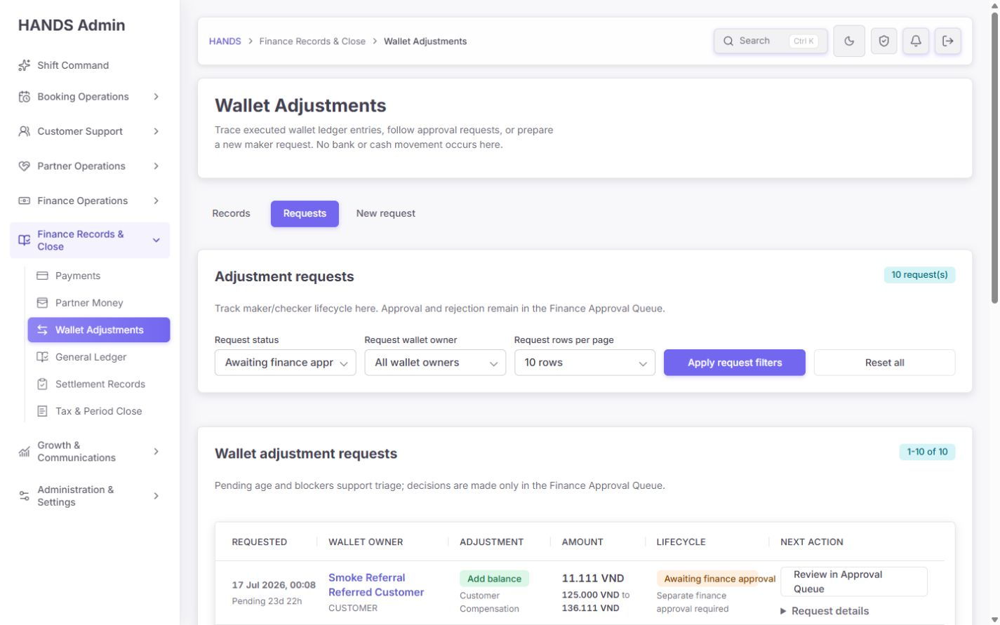

- 필터 적용 후 10건으로 정확히 좁혀지고 URL에는 필터 컨텍스트만 남는다.
- `Pending 23d 22h`와 Approval Queue 링크가 추가된 것은 좋은 개선이다.
- 그러나 기본 정렬이 최신순이라 25일 이상 된 요청이 아래에 있다. triage 기본은 oldest 또는 SLA severity 순이어야 한다.
- `Pending 23d`, `Pending 25d`가 모두 동일 색상이다. 정상/주의/stale를 정책 임계값에 따라 구분해야 한다.

### Step 8 — Pending 데이터 품질

**상태: 불량**

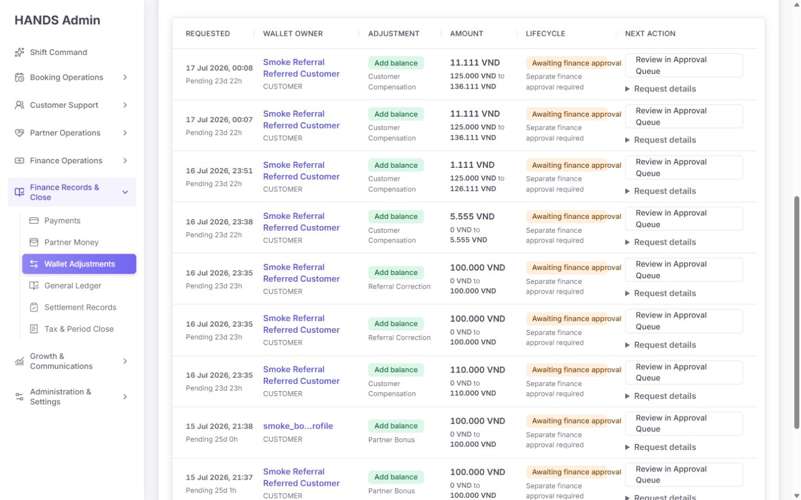

- 2026-07-15의 `CUSTOMER + Partner Bonus` legacy 요청이 여전히 `Awaiting finance approval`과 활성 Review CTA를 갖고 있다.
- 최신 API는 승인 시 허용 매트릭스를 다시 검사하므로 실행 자체는 차단된다. 따라서 직접 재무 손실 P0은 아니다.
- 하지만 화면은 실행 가능한 요청처럼 보여 주고 blocker도 없다. 승인자가 큐에서 실패한 뒤에야 원인을 알게 되는 false affordance다.
- 배포 시 migration 또는 backfill로 invalid pending을 `CANCELLED / POLICY_MIGRATION` 처리하거나, `Legacy invalid — cannot approve` blocker와 `Cancel and recreate` CTA를 제공해야 한다.

### Step 9 — Request details 펼침

**상태: 불량**

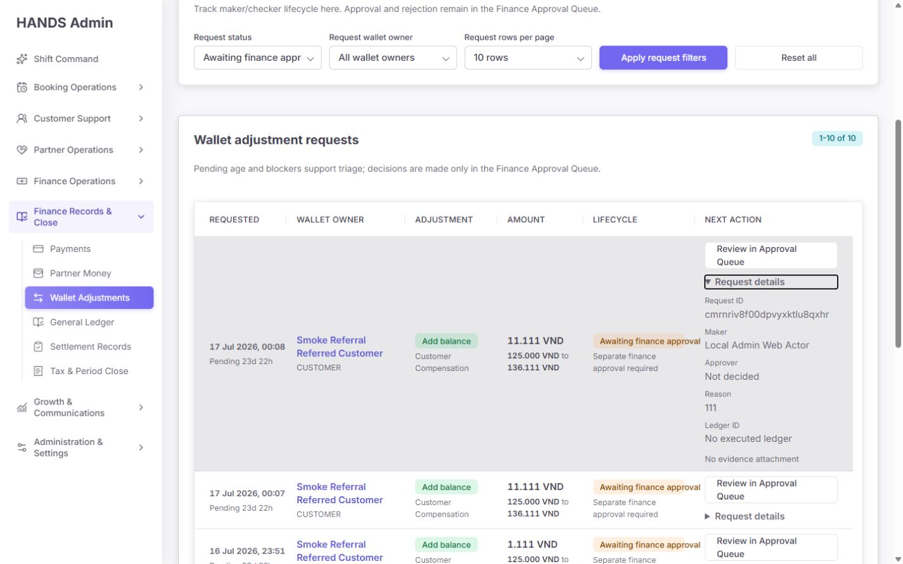

- record details와 같은 구조 결함이 반복된다. 마지막 열 안에 request ID, maker, approver, reason, ledger, evidence가 들어간다.
- 열린 행의 배경이 넓은 회색 덩어리가 되고 실제 상세는 오른쪽 좁은 열에만 몰린다.
- 표시된 reason이 `111`이다. 현재 API는 non-empty만 요구하므로 감사 사유 품질을 보장하지 못한다.
- 최소 글자 수만 늘리는 것보다 `Operational cause`, `Expected correction`, `Case/incident reference`를 구조화하고, 자유 사유에는 12자 이상의 설명을 요구하는 편이 낫다.

### Step 10 — New request 초기 화면

**상태: 양호**

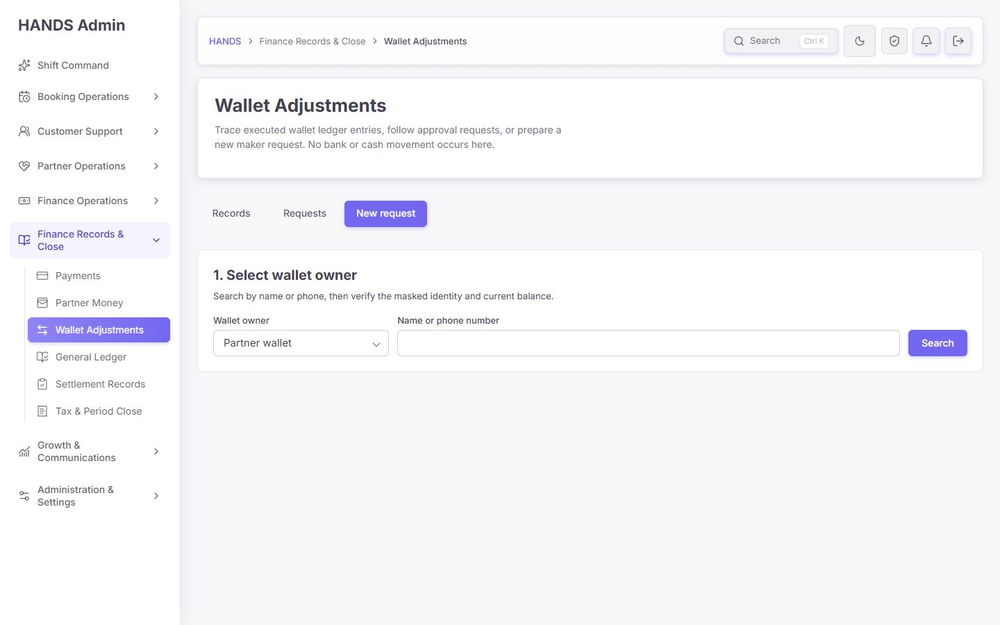

- 첫 화면에는 owner 선택 작업만 보여 인지 부하가 낮다.
- owner type, name/phone search, Search CTA의 읽기 순서가 자연스럽다.
- owner ID 직접 입력을 없앤 것은 안전성과 사용성을 동시에 높였다.
- 검색 결과가 동적으로 나타날 때 결과 건수 announcement가 없다. screen reader를 위해 `aria-live="polite"` 상태를 추가하면 좋다.

### Step 11 — Owner 검색 결과

**상태: 양호**

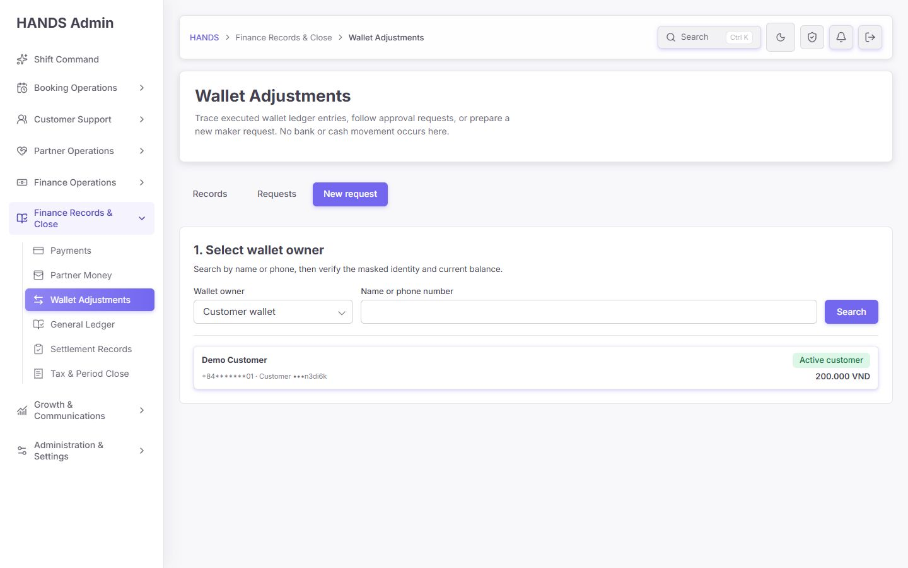

- 이름, masked phone, owner reference, account status, current balance가 한 행에 표시돼 동명이인 확인에 유리하다.
- 전체 행이 버튼이고 명확한 focus ring이 있다.
- 검색 결과를 선택한 뒤 Step 2가 아래에 나타나지만 포커스가 선택 버튼에 남는다. 키보드·screen reader 사용자를 위해 `2. Prepare approval request` heading으로 포커스를 이동하거나 결과 변화 안내를 제공한다.

### Step 12 — 요청 입력과 미리보기

**상태: 대체로 양호, 회계 월 통제는 미완료**

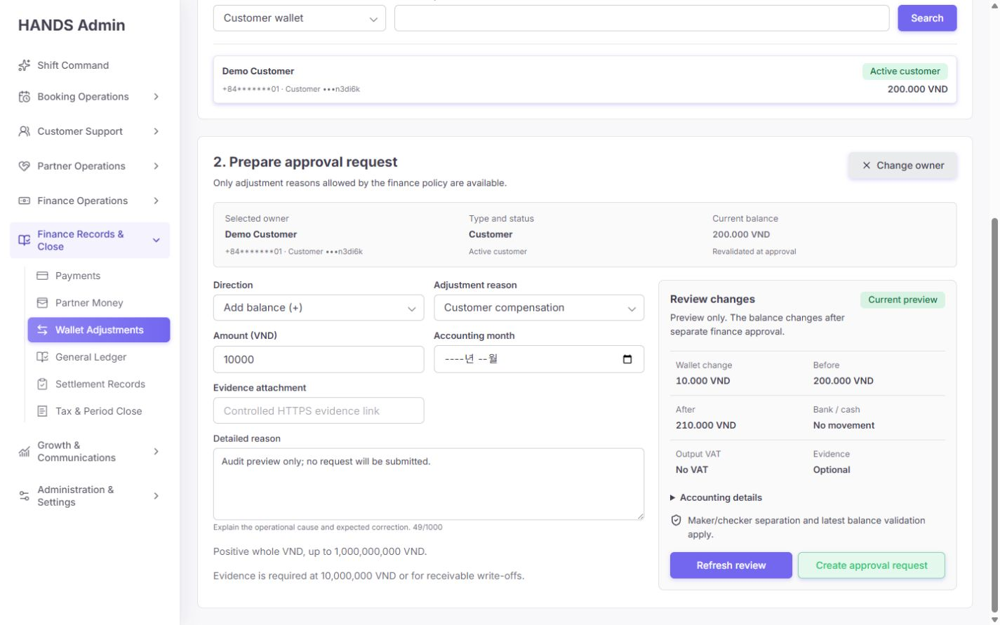

- 선택 owner, current balance, direction, 정책 기반 reason, amount, reason, evidence, preview를 한 작업 단위에서 확인할 수 있다.
- Customer Debit에서 허용 사유는 Referral Correction / Error Correction만 노출됐다.
- 미리보기는 200,000 → 210,000 VND, bank/cash 없음, VAT 없음, evidence optional을 명확히 보여 준다.
- 입력 금액을 10,000에서 11,000으로 바꾸자 preview가 즉시 무효화되고 Create 버튼이 비활성화됐다.
- 미리보기 후 URL은 `?view=create`만 유지돼 owner, amount, reason, evidence가 노출되지 않았다.
- accounting month는 optional이고 미리보기 핵심 요약에도 선택 월·현재 상태가 없다. 월을 비워도 preview가 생성된다.
- `Evidence attachment` placeholder는 Controlled HTTPS라고 쓰지만 클라이언트와 API는 HTTP도 허용한다. 문구와 통제가 일치하지 않는다.

### Step 13 — Dark mode

**상태: 양호**

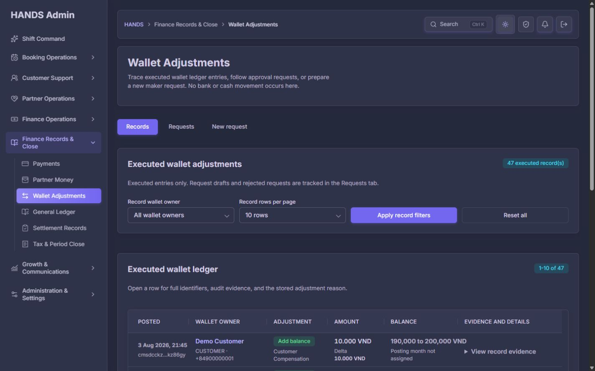

- surface, border, text, status badge, active nav가 dark token으로 일관되게 바뀐다.
- 1440px 표 정렬과 column hierarchy가 유지된다.
- 이번 범위에서 dark mode에만 나타나는 레이아웃 파손은 발견되지 않았다.

## 6. 상세 발견 사항

### [P0] 신고·납부된 회계 월에 일반 조정이 들어갈 수 있음

- 위치: `apps/api/src/admin/admin.service.ts:25796-25812`, `apps/api/src/wallet-adjustments/wallet-adjustments.accounting.ts:329-338`
- 근거: 일반 조정은 monthly period status를 accounting 함수에 넘기지만 `CLOSED`만 거부한다. 반면 reversal 경로는 `DECLARED`, `PAID`, `CLOSED`를 모두 거부한다(`admin.service.ts:25753-25761`).
- 영향: 신고·납부된 기간의 journal과 wallet liability가 사후 변경될 수 있어 tax/closeout 결과와 운영 원장이 어긋날 수 있다.
- 수정:
  1. 정책을 명시적으로 `DRAFT|REVIEWED`만 허용하는 allowlist로 바꾼다.
  2. preview, request create, approval execution 세 시점 모두 동일 정책을 적용한다.
  3. month를 필수로 만들거나, 현재 open month를 서버가 명시적으로 채우고 UI에 표시한다.
  4. UI에서 `Open`, `Under review`, `Declared`, `Paid`, `Closed` 상태를 보여 준다.
  5. `DECLARED/PAID/CLOSED` 일반 조정 거절 회귀 테스트를 추가한다.

### [P0] 고객 상세의 direct execution이 maker/checker를 우회함

- 위치: `apps/admin_web/app/wallet-adjustments/actions.ts:141-182`, `apps/api/src/admin/admin.service.ts:24852-24920`, `apps/admin_web/app/customers/[id]/customer-wallet-adjustment-form.tsx`
- 근거: `executionMode=customer-direct`는 `/admin/wallet-adjustment-requests/customer-direct`를 호출하고, Master Admin 한 명이 request 생성·status EXECUTED·ledger 생성까지 끝낸다. audit metadata에도 `singleOperatorOverride: true`가 기록된다.
- 영향: `/wallet-adjustments`가 강조하는 “separate finance approval”과 전사적 통제가 일치하지 않는다. 동일한 고객 조정을 어느 화면에서 시작했는지에 따라 승인 원칙이 달라진다.
- 수정 선택지:
  - 권장: customer detail도 maker request만 만들고 Approval Queue에서 다른 approver가 실행한다.
  - 정말 필요한 break-glass라면 별도 권한, 사유 최소 기준, incident ID, evidence 필수, 강한 경고, 두 번째 인증, 실시간 알림, 사후 review SLA를 갖춘 명시적 비상 경로로 분리한다.
  - 일반 `createManualWalletAdjustment` action에서 direct 분기를 제거하고 두 화면이 같은 request API를 사용하게 한다.

### [P1] 두 종류의 expanded details가 마지막 열 안에서 붕괴

- 위치: `apps/admin_web/app/wallet-adjustments/page.tsx:339-390`, `apps/admin_web/app/globals.css:26456-26569`
- 영향: ID·사유·증거를 보려는 순간 summary row 비교가 불가능해지고, 긴 값이 문자 단위로 끊긴다.
- 수정: full-width child row 또는 drawer. record/request에서 하나의 공용 `WalletAdjustmentEvidencePanel`을 사용한다.
- acceptance: 열었을 때 앞 6개 summary cell 높이는 그대로 유지되고, detail은 최소 900px 가용 폭을 사용한다.

### [P1] Requests 기본값이 actionable queue가 아니라 전체 이력

- 위치: `page.tsx:44-50`, `page.tsx:243-335`, `admin.service.ts:24995-25015`
- 영향: 승인 대기 10건보다 실행 이력 35건이 먼저 보인다. 매번 필터를 바꿔야 한다.
- 수정: 기본 `status=REQUESTED`, `sort=oldest` 또는 `sort=sla`; History를 명시적 saved view로 분리한다.

### [P1] Legacy invalid pending이 승인 가능해 보임

- 위치: `page.tsx:364-387`
- 영향: 현재 정책에서 불가능한 `CUSTOMER + Partner Bonus`도 blocker 없이 Approval Queue CTA를 갖는다.
- 수정: list API에서 현재 정책 preflight를 계산하고 `POLICY_MIGRATION_REQUIRED` blocker를 반환한다. invalid pending은 승인 CTA를 비활성화하고 취소·재생성으로 유도한다.

### [P1] Evidence가 통제된 증거 객체가 아닌 임의 URL 문자열

- 위치: `actions.ts:296-319`, `admin.service.ts:34935-34949`, create/reversal workspace의 attachment field
- 영향: HTTP가 허용되고 외부 문서가 변경·삭제되거나 signed URL이 만료될 수 있다. audit 시점의 증거와 현재 URL 콘텐츠의 동일성을 보장하지 못한다.
- 수정: 내부 upload/presign 흐름으로 `fileId`, checksum, mime type, uploadedAt, uploadedBy, retention 상태를 저장한다. 표시 시 권한 확인 후 read URL을 발급한다.
- 즉시 수정: HTTPS만 허용한다면 코드도 실제로 `https:`만 허용하고 copy와 error를 일치시킨다.

### [P1] Reversal 상단에 운영자 확인 정보가 부족

- 위치: `page.tsx:104-153`, `wallet-adjustment-reversal-workspace.tsx:61-75`, `admin.service.ts:25088-25095`
- 영향: raw owner ID만 보고 잘못된 대상인지 판단해야 하며, original evidence와 balance를 상단에서 확인할 수 없다.
- 수정: single-request API도 ownerName/maskedPhone/maker/approver를 hydrate하고 original time, before/after, period, evidence, ledger 상태를 고정 summary에 넣는다.

### [P1] 검색·분석 필터가 실제 운영 규모에 부족

- 위치: `page.tsx:181-208`, `page.tsx:270-304`
- 영향: 47건에서는 버틸 수 있지만 수백·수천 건에서 특정 incident, actor, amount, period, evidence 누락을 찾을 수 없다.
- 수정:
  - Records: period range, owner search, type, direction, amount range, maker/approver, evidence, sort.
  - Requests: saved view, request/owner search, SLA, blocker, type, amount, maker, sort.
  - 적용된 filter chip과 `Clear all`을 유지한다.

### [P1] 감사 사유 품질을 보장하지 못함

- 위치: `apps/api/src/admin/admin.dto.ts:1577-1581`, `admin-text-helpers.ts:18-21`
- 근거: non-empty만 강제해 `111` 같은 사유가 승인 대기 이력에 남았다.
- 영향: 승인자 판단과 사후 감사에서 왜 조정했는지 증명하지 못한다.
- 수정: 최소 12자와 함께 cause/correction/case reference 구조를 사용한다. 단순 길이 검사만으로 끝내지 않는다.

### [P2] 회계 월이 optional인지 required인지 화면에서 불명확

- 위치: create/reversal workspace의 `Accounting month`
- 수정: 필수라면 required 표시와 open period selector를 제공한다. 선택 사항이라면 `Accounting month (optional)`과 blank 처리 규칙을 설명한다.

### [P2] 문서 title이 빈 문자열

- 근거: records/create에서 `document.title === ''`.
- 영향: 여러 관리자 탭을 열었을 때 구분하기 어렵고 screen reader/browser history 문맥이 약해진다.
- 수정: `Wallet Adjustments | HANDS Admin` metadata를 설정한다.

### [P2] 동적 검색·미리보기 상태 announcement 부족

- 위치: create workspace search result/preview panel
- 수정: 결과 건수와 preview success를 `aria-live="polite"`로 알리고, owner 선택 후 Step 2 heading을 programmatic focus 대상으로 만든다.

### [P2] ID 표시·복사 방식이 일관되지 않음

- 근거: Requests short ID 끝 글자 wrap, reversal raw IDs, details 긴 IDs.
- 수정: 공통 `EntityReference` 컴포넌트로 short ID, 전체 title, Copy 버튼, 관련 record 링크를 제공한다.

### [P2] `Posting month not assigned`를 반복 문구로 소비

- 수정: `Legacy · period missing` compact badge + data repair saved view + 건수 요약으로 바꾼다.

### [P3] 자연 복수형 미적용

- `47 executed record(s)`, `45 request(s)`, `10 request(s)`를 실제 단복수로 바꾼다.

### [P3] adjustment label casing 불일치

- `Promotion Credit`, `Customer compensation`, `Referral Correction`이 혼재한다.
- sentence case를 기준으로 `Promotion credit`, `Customer compensation`, `Referral correction`, `Error correction`으로 통일한다.

## 7. 구현 우선순위

### Phase 0 — 재무 통제, 배포 전 필수

1. 월 상태 정책을 allowlist로 통일하고 declared/paid/closed를 차단한다.
2. customer-direct를 maker/checker 요청 흐름으로 통합하거나 정식 break-glass로 분리한다.
3. 현재 pending 10건을 policy revalidation하여 invalid legacy 요청을 quarantine/backfill한다.
4. 위 세 항목에 API 테스트와 migration verification을 추가한다.

### Phase 1 — 운영자가 매일 쓰는 구조

1. Requests 기본값을 `Awaiting + oldest/stale first`로 변경한다.
2. status/SLA/blocker count와 saved view를 추가한다.
3. record/request details를 full-width row 또는 drawer로 교체한다.
4. reversal identity와 original evidence summary를 강화한다.
5. evidence를 내부 file ID 흐름으로 변경한다.

### Phase 2 — 검색·감사·접근성

1. 기간/owner/type/amount/actor/evidence/sort 필터를 추가한다.
2. structured reason과 case reference를 도입한다.
3. dynamic state announcement, focus 이동, document title을 마감한다.
4. ID copy atom, plural, casing, legacy badge를 통일한다.

### Phase 3 — 마지막 polish

1. dark/light에서 full-width detail을 재검증한다.
2. 1440 × 900에서 10/25/50 rows, 긴 이름, 긴 reason, evidence 있음/없음 상태를 확인한다.
3. 기존 records/requests/create URL privacy와 preview invalidation 회귀 테스트를 유지한다.

## 8. Codex 수정 수용 기준

### 회계·승인

- [ ] 일반 조정은 `DECLARED`, `PAID`, `CLOSED` 월을 preview/create/approve 전부에서 거절한다.
- [ ] 월 상태 판단은 UI와 API가 같은 정책 결과를 사용한다.
- [ ] 같은 사람이 일반 조정을 요청하고 실행할 수 없다.
- [ ] customer detail과 Wallet Adjustments가 동일 approval policy를 사용한다.
- [ ] break-glass가 남는다면 일반 흐름과 별도 endpoint/permission/audit/alert를 가진다.
- [ ] approval 시 owner/type/direction, latest balance, attachment, period, original reversal evidence를 모두 재검증한다.

### 운영 화면

- [ ] Requests 최초 진입에서 pending이 oldest/SLA 순으로 보인다.
- [ ] legacy invalid pending에는 승인 CTA가 없고 blocker와 해결 행동이 보인다.
- [ ] 펼친 상세는 full-width이며 summary row의 세로 정렬을 깨지 않는다.
- [ ] reversal 상단에서 사람이 읽을 수 있는 owner, original time, before/after, maker/approver, period, evidence를 확인한다.
- [ ] records/requests에서 period, owner, type, amount, actor, evidence, sort를 검색할 수 있다.
- [ ] month missing 데이터는 별도 repair queue로 찾을 수 있다.

### 증거·문구·접근성

- [ ] evidence는 내부 file ID와 checksum으로 저장되고 권한 있는 read URL로 열린다.
- [ ] HTTP를 허용하지 않으며 UI placeholder/error/API 검증이 일치한다.
- [ ] reason은 운영 원인, 기대 수정, case reference를 남긴다.
- [ ] owner 선택과 preview 완료가 보조기술에 안내된다.
- [ ] `document.title`이 `Wallet Adjustments | HANDS Admin`이다.
- [ ] `record(s)`, `request(s)`, enum casing, raw ID 노출이 정리된다.

### 회귀 테스트

- [ ] Customer/Partner × Credit/Debit × 모든 adjustment type 허용/거절 matrix.
- [ ] DRAFT/REVIEWED/DECLARED/PAID/CLOSED period matrix.
- [ ] maker self-approval 거절 및 customer-detail 경로 동일 정책.
- [ ] legacy invalid pending preflight/quarantine.
- [ ] reversal exact owner/amount/opposite direction/source/duplicate guard.
- [ ] evidence scheme/file ID/retention validation.
- [ ] URL에 ownerId, amount, reason, attachment가 남지 않음.
- [ ] preview 후 입력 변경 시 create disabled.
- [ ] 1440px full-width detail visual regression.

## 9. 검증 실행 결과

| 검증 | 결과 |
|---|---|
| Admin wallet-adjustments focused tests | 2 files, **20 passed** |
| API policy/accounting/admin focused tests | 3 files, **654 passed** |
| Admin typecheck | 통과 |
| API typecheck | 통과 |
| Production admin build/start | Next.js build 완료, `:3101` ready 확인 |
| 1440×900 URL privacy | 통과 — create preview 후 `?view=create`만 유지 |
| Preview stale invalidation | 통과 — amount 변경 후 create disabled |
| Light/dark | 두 theme 모두 확인 |
| Impeccable detector | wallet TSX 특이 finding 없음. 전역 CSS의 unrelated side-tab 6건만 검출되어 이번 page finding에서는 제외 |

테스트가 통과한다는 것은 현재 구현과 테스트가 일치한다는 뜻이다. 신고/납부 월과 direct execution은 현재 테스트가 허용하거나 다루지 않는 정책 결함이므로, 통과 결과가 해당 통제의 안전성을 증명하지는 않는다.

## 10. 접근성 및 증거 한계

- 스크린샷, DOM role/label, visible focus, 코드의 error-focus 동작을 확인했지만 전체 WCAG AA 준수를 선언하지 않는다.
- screen reader 실제 발화, 200% zoom, Windows High Contrast, 장시간 keyboard-only 시나리오는 이번 범위에서 실행하지 않았다.
- 사용자 요구에 따라 1024px 이하와 responsive reflow는 전혀 평가하지 않았다.
- 실제 요청 생성·승인·반전은 금융 상태를 변경하므로 수행하지 않았다. 검색과 preview만 실행했다.
- customer-direct 문제는 관련 소스/API를 확인한 결과이며 고객 상세 화면의 별도 시각 감사는 이번 캡처 범위가 아니다.
- 첫 고객 검색 시점에 별도 production rebuild가 겹쳐 일시적으로 서버가 내려갔으나, rebuild 완료 후 동일 검색은 정상 성공했다. 이를 페이지 결함으로 집계하지 않았다.

## 11. 보존해야 할 좋은 구현

- Records / Requests / New request URL-addressable workspace.
- 활성 view만 조회하는 서버 컴포넌트 구조.
- 검색·미리보기를 POST local state로 처리해 민감한 값이 URL에 남지 않는 구조.
- 정책 API에서 허용 reason을 만들고 승인 시 다시 검사하는 fail-closed 흐름.
- idempotency key와 immutable ledger/journal/audit 연결.
- approval 시 latest balance 재검증.
- reversal의 원본 source, exact amount, opposite direction, duplicate guard.
- bank/cash와 VAT 영향이 없음을 명시하는 preview.
- preview 이후 입력이 바뀌면 submit을 다시 잠그는 form key.
- 1440px 기본 표 가독성과 완성도 높은 dark mode.

## 12. 최종 한 줄 평가

**재설계 방향은 맞고 기본 사용성도 크게 좋아졌지만, 신고·납부 월 통제와 customer-direct 승인 우회가 남아 있어 재무 운영 관점에서는 아직 출시 승인 단계가 아니다. P0를 먼저 닫고, 다음으로 pending-first Requests와 full-width evidence detail을 완성해야 한다.**
