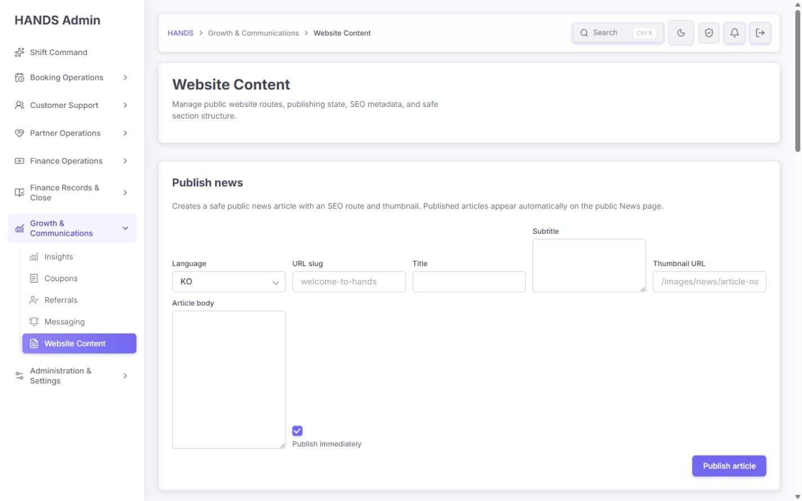
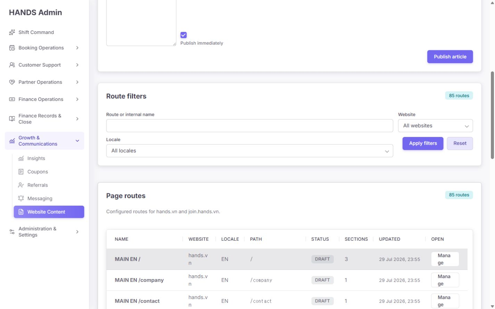
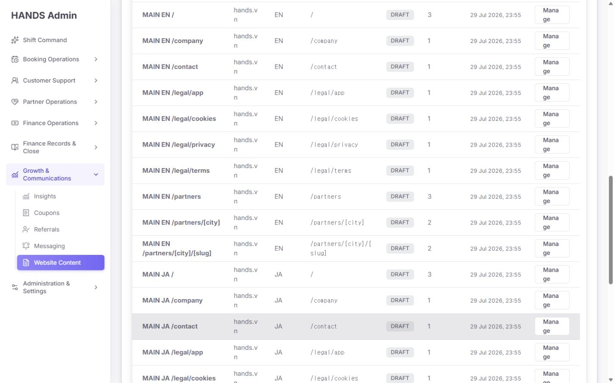
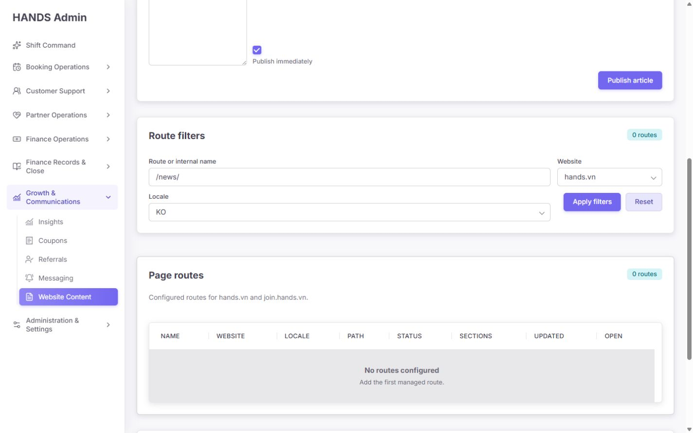
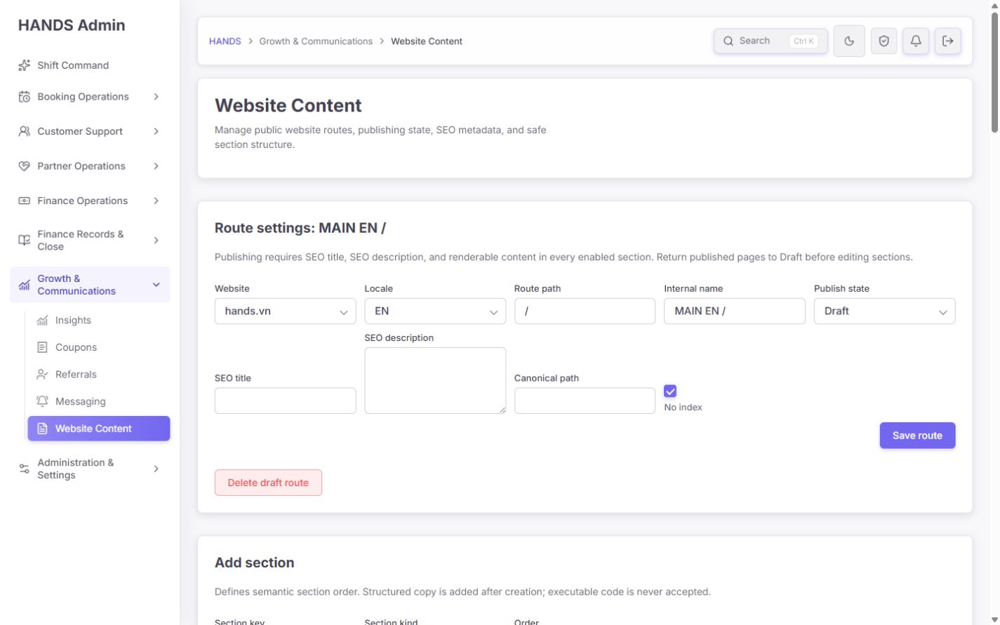
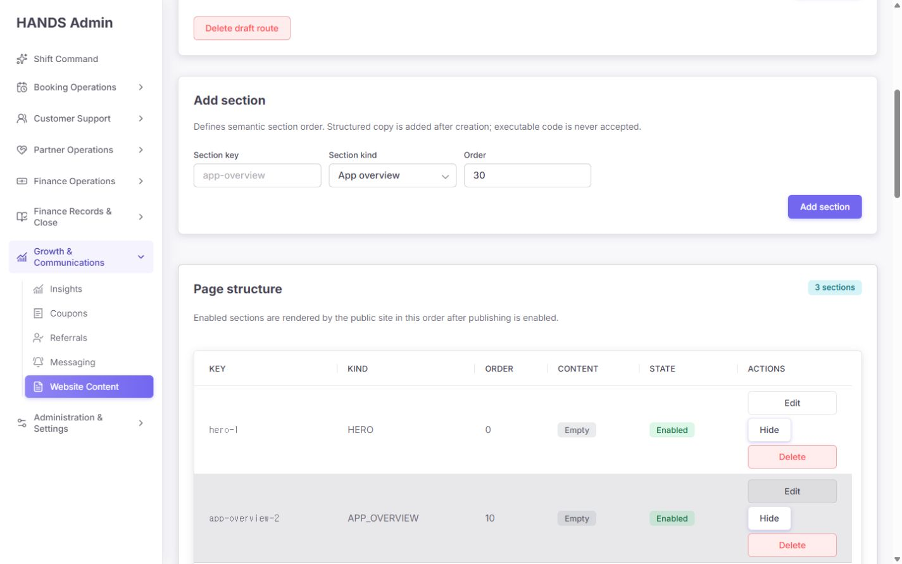
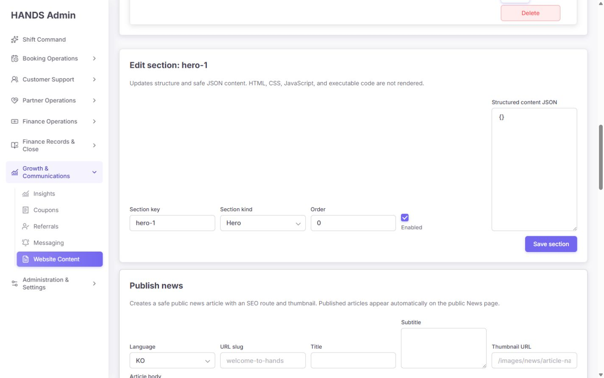
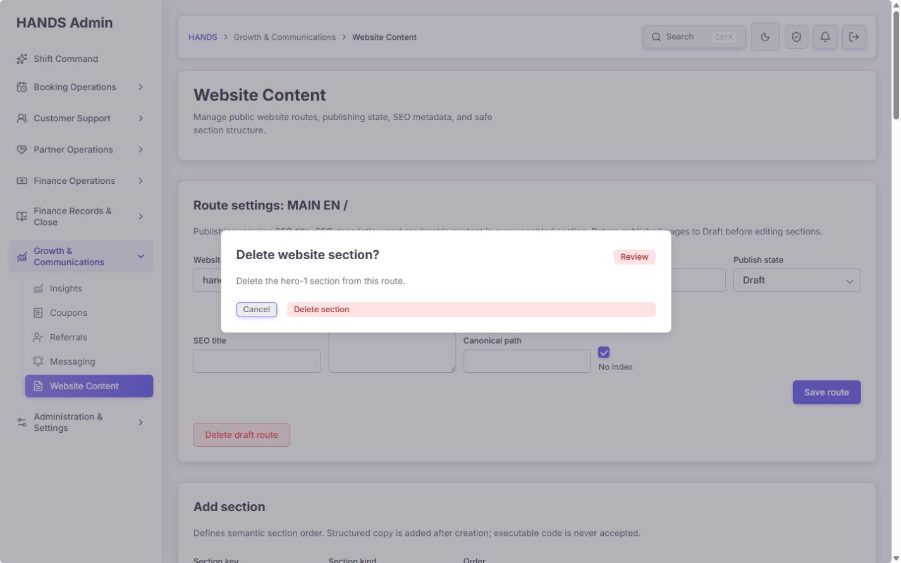
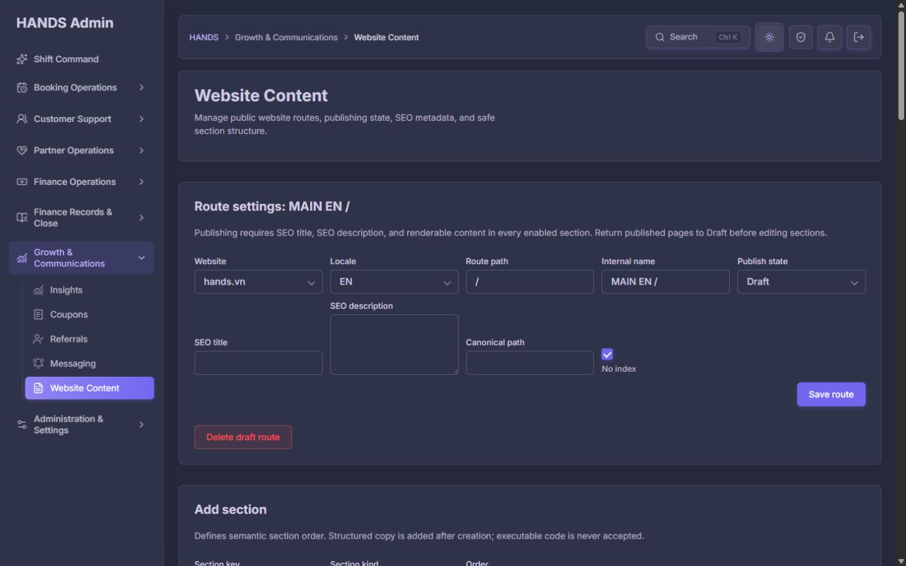

# Website Content 사후 개선 재감사 보고서

- 대상: `http://localhost:3101/website-content`
- 감사일: 2026-08-10
- 검사 범위: 운영자용 데스크톱, 1440×900 및 1440px 이상
- 제외 범위: 1024px 이하 모바일·태블릿·좁은 데스크톱 반응형
- 방법: 로그인된 실제 화면의 주요 상태 확인, 11개 화면 증거 캡처, 관련 Admin/API/Public Web 코드 추적, 집중 테스트와 타입 검사
- 안전 원칙: 저장·게시·추가·숨김·삭제는 실행하지 않았다. 삭제 확인창은 열기·취소·Escape 동작만 검증했다.

## 1. 최종 판정

**재수정 필요 — 운영 품질 58/100, 조건부 실패**

이번 버전은 일반적인 관리 폼 수준에서는 분명 개선되었다. 신규 경로가 Draft 및 No index로 시작하고, 서버가 SEO·활성 섹션·렌더 가능한 내용을 게시 전 확인하며, 게시된 경로의 섹션 변경과 삭제를 막는다. 변경 이력도 API에서 기록하고, 삭제 확인창은 대상 식별자 검증·Cancel 초기 포커스·Escape 취소를 제공한다. URL 필터 상태 보존, 페이지네이션, 다크 테마도 정상이다.

그러나 운영자가 안심하고 실제 웹사이트를 수정하는 CMS의 핵심 구조는 아직 부족하다.

1. 게시본과 편집 초안이 분리되지 않아 게시 중인 페이지의 섹션을 수정하려면 먼저 Draft로 내려야 한다.
2. Draft로 내리는 즉시 공개 화면이 하드코딩된 대체 페이지로 돌아가거나 404가 될 수 있다.
3. 일반 페이지는 초안 미리보기, 게시 전 차이 비교, 게시 준비 체크리스트가 없다.
4. 뉴스 작성·수정은 여러 API 호출로 분리돼 부분 실패 시 거짓 성공 또는 중간 상태를 남길 수 있다.
5. 화면 하나가 뉴스 작성, 경로 검색, 경로 추가, 경로 설정, 섹션 편집을 모두 담당해 운영 작업의 경계가 불분명하다.

따라서 현재 화면은 **기술 관리자용 CRUD 도구**로는 쓸 수 있지만, 콘텐츠 운영자가 반복적으로 안전하게 게시하는 **운영용 CMS**로는 아직 출시 기준을 충족하지 못한다.

참고로 저장된 산출물에서 이 페이지 자체의 이전 상세 감사 보고서는 찾지 못했다. 확인 가능한 이전 문서는 Website Content를 `Growth & Communications`에 배치하라는 전체 IA 보고서였고, 현재 내비게이션 위치는 그 방향을 잘 반영한다. 아래 판정은 현재 화면·코드·테스트를 직접 재감사한 결과다.

## 2. 기존 개선 사항 검증

| 항목 | 현재 상태 | 판정 |
|---|---|---|
| 내비게이션 위치 | Website Content가 Growth & Communications 업무 영역에 배치됨 | 통과 |
| 신규 일반 경로 기본값 | `DRAFT`, `No index` 기본 선택 | 통과 |
| 게시 준비 서버 검증 | SEO title/description, 활성 섹션, 렌더 가능한 내용 검사 | 부분 통과 |
| 게시 중 섹션 변경 차단 | API와 화면 모두 잠금 | 기술적으로 통과, 운영 모델은 실패 |
| 게시 경로 삭제 차단 | Draft 전환 후에만 삭제 가능 | 통과 |
| 변경 감사 로그 | 페이지/섹션 변경 시 감사 로그 생성 | 통과 |
| 삭제 확인 | 정확한 대상 ID, Cancel 초기 포커스, Escape 취소 | 통과 |
| 안전한 공개 링크 | 상대 경로와 HTTPS만 허용 | 통과 |
| 필터 URL 보존·페이지네이션 | 검색·사이트·언어·페이지 상태 보존 | 통과 |
| 다크 테마 | 주요 폼, 표, 상태 배지 정상 표시 | 통과 |
| 초안 미리보기·게시본 비교 | 일반 페이지에 없음 | 실패 |
| 게시본과 편집 초안 분리 | 없음 | 실패 |
| 원자적 게시 | 뉴스 생성·수정에서 보장되지 않음 | 실패 |

## 3. 화면 흐름별 감사

### 3.1 기본 진입 — 불량



첫 화면의 가장 큰 면적과 첫 번째 행동이 `Publish news` 작성 폼이다. 운영자는 기존 페이지 상태 확인, 게시 문제 확인, 번역 누락 확인보다 새 기사를 바로 게시하도록 유도된다. 특히 `Publish immediately`가 기본 체크되어 있어 실수 비용이 크다. 본문 필드는 왼쪽 아래에 길게 놓이고 다른 필드는 위쪽과 오른쪽에 산재해 시선 흐름도 끊긴다.

권장 변경:

- 기본 화면을 콘텐츠 현황과 작업 큐로 시작한다.
- `Pages`와 `News`를 1차 탭으로 분리한다.
- `New page`, `New article`은 상단 우측의 명시적인 생성 버튼으로 이동한다.
- 새 뉴스는 항상 Draft로 저장하고, 게시를 별도 권한·별도 확인 단계로 분리한다.
- 기사 작성 화면은 `기본 정보 → 본문 → SEO/썸네일 → 미리보기 및 게시` 순서의 전용 작업 공간으로 만든다.

### 3.2 경로 목록과 페이지네이션 — 부분 불량





1440px 화면에서도 Website 값 `hands.vn`과 `Manage` 버튼이 문자 단위로 줄바꿈된다. 이는 모바일 문제가 아니라 실제 운영 해상도에서 발생하는 가독성 결함이다. 85개 항목을 사이트·언어별 단일 행으로 펼쳐 동일 경로가 반복되며 번역 완성도를 한눈에 비교할 수 없다. 이름, Website, Locale, Path가 서로 반복 정보를 보여 표 밀도도 낮다.

권장 변경:

- `Website + Path`를 한 경로 그룹으로 만들고 KO/EN/VI/JA/ZH를 상태 셀로 표시한다.
- 기본 열을 `경로`, `언어 상태`, `게시 상태`, `준비 문제`, `마지막 변경`, `담당/작업`으로 재구성한다.
- 버튼과 도메인에는 `white-space: nowrap`을 적용하고 작업 열 최소 폭을 보장한다.
- `Manage`를 `Edit route`로 바꾸고 행 전체 또는 경로명을 기본 진입 링크로 사용한다.
- `Add page route` 폼을 85개 경로 아래에 두지 말고 `New page` 버튼이 여는 전용 화면이나 다이얼로그로 이동한다.

### 3.3 필터와 빈 결과 — 불량



검색어 `/news/`, Website `hands.vn`, Locale `ko` 조합은 정상적으로 URL에 반영됐지만 0건일 때 `No routes configured / Add the first managed route`라고 표시한다. 시스템에 85개 경로가 존재하는 상태이므로 잘못된 운영 문구다. API 장애도 기본값 `[]`로 바뀌기 때문에 같은 문구로 보일 수 있다.

권장 변경:

- 필터가 있을 때: `조건과 일치하는 경로가 없습니다` + `필터 초기화`.
- 실제 데이터가 0건일 때: `아직 관리되는 경로가 없습니다` + `새 페이지 만들기`.
- API 실패일 때: `경로를 불러오지 못했습니다` + 오류 코드/재시도/마지막 정상 동기화 시각.
- 필터에 `Status`, `Needs attention`, `Missing SEO`, `No index`, `Missing translation`을 추가한다.
- 자주 쓰는 저장 필터: `게시 준비 미완료`, `최근 변경`, `번역 누락`, `No index인데 게시됨`.

### 3.4 일반 페이지 상세 — 불량



경로를 선택하면 설정 편집기가 상단에 나오지만 그 아래에 뉴스 작성, 경로 필터, 85개 경로 목록, 새 경로 폼이 다시 모두 이어진다. 상세 작업 중에도 전역 작업들이 노출되어 맥락과 스크롤 비용이 크다. Publish state가 일반 저장 폼의 드롭다운으로 포함되어 있어 콘텐츠·SEO 저장과 발행이라는 서로 다른 위험도의 행동도 섞여 있다.

권장 상세 구조:

- 상단: Breadcrumb, 경로명, 사이트/언어, 현재 Live 상태, 마지막 게시자/게시 시각.
- 탭: `Overview`, `Content`, `SEO & publishing`, `Activity`.
- 우측 고정 패널: `Draft preview`, `Open live page`, 게시 준비 체크, Draft/Live 차이, Publish.
- 일반 저장은 초안만 저장한다. `Publish`와 `Unpublish`는 상태 드롭다운이 아닌 별도 확인 작업으로 분리한다.
- 게시 확인창에는 변경 요약, 영향 URL, No index/Canonical, 번역 상태, 게시 후 캐시 반영 예상 시간을 보여준다.

### 3.5 섹션 구조와 편집 — 불량





표의 `Edit / Hide / Delete`가 세로로 쌓여 행이 불필요하게 높다. 순서는 숫자 입력뿐이며 드래그 또는 위·아래 이동이 없다. `Configured`는 JSON 객체에 키가 하나라도 있으면 표시되어 실제 게시 준비 여부와 다르다. 편집기는 운영자가 구조를 알아야 하는 원시 JSON textarea이고, Section kind별 필드 설명·예제·즉시 검증·미리보기가 없다.

또한 Public Web 렌더러는 제공되는 여러 Section kind를 사실상 동일한 범용 템플릿으로 처리한다. Hero만 H1을 사용하고 나머지는 H2라는 차이 외에는 종류별 고유 구조가 없다. `FAQ`, `Legal document`, `Partner directory` 같은 명칭이 실제 출력 의미를 보장하지 않는다.

권장 변경:

- Kind마다 스키마 기반 필드 편집기를 제공한다. 예: Hero는 eyebrow/title/body/primary action/image, FAQ는 question/answer 반복 필드.
- `Advanced JSON`은 접힌 고급 모드로만 남기고 스키마 검증 오류를 필드 위치에 표시한다.
- `Configured`를 `Ready`, `Needs content`, `Invalid`, `Hidden`으로 교체하고 원인을 함께 표시한다.
- 섹션 재정렬은 드래그와 키보드 접근 가능한 위·아래 이동을 함께 제공한다.
- 행 작업은 `Edit`, `…` 메뉴로 수평 축약한다. Hide는 Draft에 즉시 적용하되 Undo 토스트를 제공한다.
- 우측 미리보기에서 선택한 섹션과 전체 페이지를 즉시 확인한다.
- 실제 지원할 Section kind만 노출하고, 각 kind의 API schema·Admin editor·Public renderer를 하나의 계약 테스트로 묶는다.

### 3.6 삭제 안전장치 — 통과, 시각 개선 필요



확인창 자체의 접근성과 대상 검증은 양호하다. Cancel이 초기 포커스이고 Escape로 닫히며 실제 삭제는 실행하지 않았다. 다만 위험 버튼이 전체 폭의 큰 분홍 막대로 표시되고 Cancel은 매우 작아 행동 위계가 과도하다.

권장 변경:

- 우측 하단에 `Cancel`과 `Delete section`을 같은 높이의 버튼으로 배치한다.
- 위험 버튼은 내용에 맞는 최소 폭을 사용한다.
- 설명에 `Draft에만 적용되며 되돌릴 수 없음`과 정확한 페이지/섹션 이름을 표시한다.

### 3.7 다크 테마 — 통과



주요 텍스트, 경계, 입력, 배지는 식별 가능하다. 다만 정보 구조와 공백 문제는 테마와 무관하게 동일하다. 다크 테마는 현재 수준을 유지하되 새 미리보기·상태·오류 컴포넌트에도 동일 토큰을 적용하면 된다.

### 3.8 현재 속도 — 조건부 통과

로그인된 로컬 환경의 warm route-to-stable 관찰값은 기본 317ms, 상세 262ms, 빈 필터 256ms였다. 현재 85개 경로에서는 체감 속도가 양호하다. 다만 API가 필터·검색·페이지네이션 없이 전체 페이지와 모든 섹션을 가져오고 Admin Web이 클라이언트에서 필터와 페이지네이션을 처리한다. 경로·버전·활동 이력이 늘면 초기 payload와 렌더 비용이 선형 증가한다.

권장 변경:

- 서버 페이지네이션과 검색을 추가한다: `page`, `take`, `q`, `site`, `locale`, `status`, `readiness`.
- 목록 응답에서는 section 전체 JSON을 제외하고 `sectionCount`, `readiness`, `updatedAt`, `publishedAt`만 반환한다.
- 상세 진입 시에만 섹션과 revision을 가져온다.
- 성능 기준: 1,000개 route에서 1440px 첫 목록 P95 API 500ms 이하, HTML/JSON payload 250KB 이하, 필터 적용 500ms 이하.

## 4. 코드 기반 핵심 결함

### P0 — 출시 전 반드시 해결

#### P0-1. Live와 Draft revision이 분리되지 않는다

- Admin 안내와 API는 게시 페이지의 섹션을 바꾸기 전에 Draft로 돌리도록 요구한다: `apps/admin_web/app/website-content/page.tsx:468`, `apps/api/src/site-content/site-content.service.ts:371`.
- Public Web은 `PUBLISHED` 행만 조회한다: `apps/api/src/site-content/site-content.service.ts:229`.
- CMS 행이 없으면 알려진 경로는 하드코딩 화면으로 대체되고, 임의 경로는 404가 된다: `apps/public_web/app/[locale]/[[...slug]]/page.tsx:145`.

운영 영향: 운영자가 콘텐츠를 고치기 위해 Draft로 내리는 순간 기존 Live 콘텐츠가 사라질 수 있다. 수정 완료 전 공개 상태 보존, 초안 미리보기, 안전한 롤백이 불가능하다.

필수 해결:

- 페이지 identity와 revision을 분리한다.
- Live revision은 계속 서비스하고 Draft revision을 별도로 편집한다.
- Publish는 readiness 검사 후 Draft revision을 active revision으로 원자적으로 교체한다.
- 최소 1개 이전 revision으로 즉시 rollback할 수 있어야 한다.

#### P0-2. 뉴스 발행이 원자적이지 않고 거짓 성공이 가능하다

- 뉴스 생성은 Page 생성 → Section 생성 → Publish PATCH의 세 호출이다: `apps/admin_web/app/website-content/actions.ts:103`.
- Publish PATCH의 반환값을 확인하지 않고 항상 `news-created`로 종료한다: `actions.ts:143-146`.
- 뉴스 수정은 게시 중이면 먼저 Draft PATCH → Section PATCH → Page/Publish PATCH를 순차 실행한다: `actions.ts:149-190`.

운영 영향: 게시 요청이 실패해도 성공 메시지가 보일 수 있고, 수정 중간 실패로 기존 게시물이 Draft에 남거나 페이지·섹션이 부분 생성될 수 있다.

필수 해결:

- API에 `createNewsDraft`, `saveNewsDraft`, `publishRevision` 같은 트랜잭션 단위 endpoint를 만든다.
- 상태 전환·본문·SEO·section 저장·감사 로그를 하나의 DB transaction으로 처리한다.
- 모든 실패는 구조화된 오류 코드와 수정 가능한 필드 정보를 반환한다.
- idempotency key 또는 revision version을 사용해 중복 제출과 동시 수정 충돌을 막는다.

### P1 — 다음 개선 배치에서 해결

#### P1-1. 게시 시각이 일반 저장 때마다 갱신된다

Admin의 `pagePayload`는 Save route마다 status를 항상 전송한다: `actions.ts:193-204`. API는 status가 포함되면 PUBLISHED일 때 `publishedAt = new Date()`로 다시 설정한다: `site-content.service.ts:95-100`. 게시된 뉴스의 메타데이터만 저장해도 게시일과 정렬 순서가 바뀔 수 있다.

해결: `publishedAt`은 Draft→Published 전이에서만 설정한다. 콘텐츠 수정 시각은 `updatedAt`, 재게시 시각은 필요한 경우 `republishedAt`으로 분리한다.

#### P1-2. 게시 준비 검사와 실제 렌더러의 계약이 다르다

API는 item의 `label` 하나만 있어도 렌더 가능한 내용으로 인정한다: `site-content.service.ts:377-391`. Public renderer는 안전한 href가 없으면 label을 출력하지 않는다: `apps/public_web/components/public-site-section.tsx:30-35`. 즉 준비 검사를 통과한 활성 섹션이 실제 화면에서는 비어 있을 수 있다.

해결: 공통 schema/validator를 Admin, API, Public renderer가 공유하고, 실제 렌더 결과를 기준으로 publish readiness contract test를 작성한다.

#### P1-3. Section kind 명칭과 실제 출력 의미가 맞지 않는다

렌더러는 모든 kind를 같은 범용 제목·본문·목록·action으로 출력하며 Hero만 heading level이 다르다: `public-site-section.tsx:19-35`. 운영자는 kind를 선택해도 예상 결과를 알 수 없다.

해결: 종류별 명시적 component와 schema를 만들거나, 실제 범용 section 하나만 노출하고 presentation variant를 별도 선택하게 한다.

#### P1-4. 읽기 실패와 빈 데이터가 구분되지 않는다

Admin Web의 페이지 요청은 실패 기본값을 빈 배열로 둔다: `apps/admin_web/app/website-content/page.tsx:69`. 화면은 항상 `No routes configured`를 표시한다: `page.tsx:230`.

해결: `success/data/error/requestId/lastSuccessfulAt` 상태를 유지하고 오류 상태에서는 생성 CTA를 숨기거나 경고한다.

#### P1-5. 한 화면에 독립 작업이 과도하게 결합됐다

선택된 상세 편집기가 렌더된 뒤에도 뉴스 작성, 전체 필터·목록, 새 경로 폼이 계속 렌더된다: `page.tsx:92-117`, `119-315`.

해결: 목록과 상세를 별도 route 또는 명확한 workspace state로 분리하고, 생성은 별도 진입으로 이동한다.

#### P1-6. 게시 권한이 별도 역할로 분리되지 않는다

Website Content의 읽기·생성·수정·게시·삭제는 모두 `SYSTEM_POLICY` 범주로 묶여 있다. 작성자와 게시 승인자, 삭제 권한을 구분하는 근거가 없다.

해결: 최소 `CONTENT_VIEW`, `CONTENT_EDIT`, `CONTENT_PUBLISH`, `CONTENT_DELETE`로 나누고, 필요하면 작성자와 게시자를 분리하는 maker-checker를 적용한다. 화면에는 현재 사용자의 가능 작업과 제한 이유를 명시한다.

### P2 — 사용성·완성도 개선

- 뉴스 slug는 코드에서 ASCII 소문자·숫자·하이픈만 남기지만 UI가 규칙과 최종 URL을 설명하지 않는다: `actions.ts:248`. 한글만 입력하면 빈 slug가 되어 실패한다.
- 뉴스 body는 빈 줄 단위의 단순 paragraph만 지원한다: `apps/public_web/components/public-news-pages.tsx:92`. 제목·목록·링크·인용·미디어를 쓸 수 없다는 점을 입력 화면에 설명하거나 구조화 편집기를 제공해야 한다.
- 썸네일 URL은 실시간 형식·HTTPS/상대 경로 검증과 이미지 미리보기가 없다.
- SEO title/description에 현재 글자 수와 검색 결과 preview가 없다.
- Canonical path와 No index는 운영자에게 영향 설명이 부족하다.
- 섹션 Hide는 즉시 POST한다. Draft revision 모델 이후 Undo와 변경 배지로 피드백을 보강한다.
- 표와 폼의 공백, 필드 폭, 버튼 열 너비를 1440px 기준으로 다시 조정한다.

## 5. 권장 정보 구조

```text
Website Content
├─ Pages
│  ├─ Summary: Live / Draft changes / Needs attention / Missing translation
│  ├─ Filters and saved views
│  ├─ Route groups: Website + Path
│  │  └─ Locale status matrix: KO / EN / VI / JA / ZH
│  └─ Page workspace
│     ├─ Overview
│     ├─ Content
│     ├─ SEO & publishing
│     └─ Activity
└─ News
   ├─ Articles list: Draft / Scheduled / Published / Failed
   ├─ New article
   └─ Article workspace: Content / Preview / SEO / Activity
```

페이지를 두 개의 사이드바 카테고리로 분리할 필요는 없다. `Website Content` 한 메뉴 아래에서 `Pages`와 `News`를 탭 또는 2차 내비게이션으로 구분하는 편이 효율적이다. 단, 한 화면에 두 작업을 동시에 모두 렌더해서는 안 된다.

권장 상단 요약:

- Live: 현재 공개 revision 수
- Draft changes: Live와 다른 초안 수
- Needs attention: 게시 준비 실패 수
- Missing translations: route group 기준 누락 언어 수
- Recently published: 최근 7일 게시 건수

## 6. 문구 수정안

| 현재 문구 | 권장 문구 | 이유 |
|---|---|---|
| Publish news | News articles / New article | 목록 업무와 생성 업무 분리 |
| Publish immediately | Save as draft가 기본, 별도 Publish | 실수 방지 |
| Publish article | Save draft | 작성 단계의 실제 행동과 일치 |
| Publish state | Live status | 저장 필드가 아니라 상태 정보 |
| Save route | Save draft changes | Live가 즉시 바뀌지 않음을 명확화 |
| Structured content JSON | Section fields / Advanced JSON | 운영자 중심 표현 |
| Configured | Ready / Needs content / Invalid | 실제 게시 준비 상태 제공 |
| Manage | Edit route | 행동을 구체화 |
| No routes configured | No routes match these filters | 필터 0건 상태에서 정확한 설명 |
| Add the first managed route | Clear filters | 현재 상태에 맞는 다음 행동 |
| Locale | Language | 비개발자 친화적 표현, 코드는 보조 표시 |
| Internal name | Operator label | 용도 명확화 |
| No index | Hide this page from search engines | 결과 중심 표현 |

세부 도움말 예시:

- URL slug: `영문 소문자, 숫자, 하이픈만 사용할 수 있습니다. 최종 주소: /ko/news/{slug}`
- Canonical: `검색 엔진에 대표 주소로 알릴 경로입니다. 비워 두면 현재 경로를 사용합니다.`
- No index: `켜면 공개 상태여도 Google 등 검색 결과에 표시되지 않도록 요청합니다.`
- Plain article body를 유지할 경우: `빈 줄로 문단을 구분합니다. 제목, 링크, 목록 형식은 현재 지원하지 않습니다.`

## 7. Codex 구현 수용 기준

### 데이터와 API

- [ ] 공개 중인 live revision과 편집 draft revision이 동시에 존재한다.
- [ ] draft 저장 중 live 페이지의 내용·상태·URL이 변하지 않는다.
- [ ] preview token 또는 권한 있는 preview URL로 draft를 확인할 수 있다.
- [ ] publish는 readiness 검사, revision 활성화, 감사 로그를 한 transaction으로 처리한다.
- [ ] publish 실패 시 기존 live revision이 그대로 유지된다.
- [ ] rollback이 이전 revision을 원자적으로 복원한다.
- [ ] published→published 일반 저장은 최초 `publishedAt`을 바꾸지 않는다.
- [ ] 목록 API는 서버 pagination/filter/search와 summary count를 제공하고 section JSON을 싣지 않는다.
- [ ] API 장애와 0건 응답은 Admin Web에서 서로 다른 상태로 렌더된다.
- [ ] action별 권한이 view/edit/publish/delete로 분리된다.

### 화면과 문구

- [ ] 기본 화면은 현황과 목록이며 뉴스 생성 폼이 자동 노출되지 않는다.
- [ ] Pages/News가 하나의 Website Content 영역 안에서 명확히 분리된다.
- [ ] 새 뉴스는 항상 Draft로 시작한다.
- [ ] 일반 페이지와 뉴스 모두 draft preview와 live page 링크가 있다.
- [ ] Publish 전에 readiness 항목, 변경 요약, 대상 URL, No index, canonical을 확인한다.
- [ ] route group 단위로 다섯 언어 상태를 한 행에서 비교한다.
- [ ] 필터 0건, 전체 0건, API 오류가 서로 다른 문구와 CTA를 사용한다.
- [ ] 1440px에서 Website, 상태, 작업 버튼이 문자 단위로 줄바꿈되지 않는다.
- [ ] 섹션 작업은 한 줄 또는 overflow menu로 정리되고 순서 변경이 직관적이다.
- [ ] 원시 JSON 없이 정상 편집이 가능하며 JSON은 고급 모드로만 제공된다.
- [ ] section kind별 schema·필드·preview·renderer가 일치한다.

### 테스트

- [ ] 뉴스 생성의 Page/Section/Publish 각 단계 실패 테스트가 있다.
- [ ] 실패 시 거짓 성공 notice가 나타나지 않는다.
- [ ] 게시된 뉴스 수정 중 실패해도 live revision이 유지된다.
- [ ] publishedAt 보존 회귀 테스트가 있다.
- [ ] readiness validator와 실제 renderer 계약 테스트가 있다.
- [ ] API 오류와 필터 0건 empty state 테스트가 있다.
- [ ] 1,000개 route의 서버 pagination/성능 테스트가 있다.
- [ ] 1440×900 light/dark visual regression이 있다.
- [ ] 키보드로 필터, 표, 섹션 재정렬, 확인, 게시 흐름을 완료할 수 있다.

## 8. 권장 구현 순서

1. P0: revision 모델, draft preview, 원자적 publish/rollback API.
2. P0: 뉴스 create/update의 다중 호출을 트랜잭션 API로 교체하고 오류 계약 정리.
3. P1: Pages/News 분리, 목록 중심 기본 화면, 전용 상세 workspace.
4. P1: 서버 목록 pagination/filter/summary와 API 오류 상태 분리.
5. P1: section schema/editor/renderer 계약 통합.
6. P1: edit/publish/delete 권한 분리와 publish 확인.
7. P2: 1440px 표 밀도, 버튼 위계, 필드 도움말, 이미지/SEO preview.
8. 회귀 테스트와 1440px light/dark 시각 검수.

P0를 건너뛰고 레이아웃만 손보면 화면은 더 예뻐지지만 게시 사고 위험은 그대로 남는다. 이번 다음 배치는 시각 보정이 아니라 **게시 안전 모델**을 먼저 완성해야 한다.

## 9. 검증 결과

### 화면 확인

- 1440×900 light: 기본, 목록, 페이지네이션, 경로 추가, 경로 상세, 섹션 목록, 섹션 편집, 삭제 확인, 필터 0건 확인
- 1440×900 dark: 경로 상세 확인
- 실제 필터 URL 상태 보존 확인
- 삭제 확인창 Cancel 초기 포커스 및 Escape 닫기 확인
- 브라우저 콘솔 오류/경고: 관찰 구간 0건
- 데이터 변경 작업: 실행하지 않음

### 자동 검증

| 명령 | 결과 |
|---|---|
| `npm.cmd run test -w @massage-vn/admin-web -- app/website-content/actions.spec.ts app/website-content/website-content-pagination.spec.ts` | 통과 — 2 files, 5 tests |
| `npm.cmd run test -w @massage-vn/api -- src/site-content/site-content.service.spec.ts` | 통과 — 1 file, 6 tests |
| `npm.cmd run test -w @massage-vn/public-web -- lib/site-content.spec.ts` | 통과 — 1 file, 3 tests |
| `npm.cmd run typecheck -w @massage-vn/admin-web` | 통과 |
| `npm.cmd run typecheck -w @massage-vn/api` | 통과 |
| `npm.cmd run typecheck -w @massage-vn/public-web` | 통과 |

현재 테스트는 행복 경로와 기본 제약을 검증하지만, 거짓 성공·부분 실패·publishedAt 보존·revision 안전성·validator/renderer 불일치·API 오류 empty state·1440px 표 레이아웃을 잡지 못한다.

## 10. 디자인 품질 점수

Impeccable 5개 축 기준:

| 축 | 점수 | 근거 |
|---|---:|---|
| Accessibility | 3/4 | 폼 label, 상태 의미, 확인창 키보드 동작은 양호. JSON 중심 편집과 작업 밀도는 부담 |
| Performance | 3/4 | 현재 85건 warm 속도 양호. 전체 route+section fetch 구조는 확장성 위험 |
| Desktop adaptability | 2/4 | 요청 범위인 1440px에서도 도메인·Manage가 문자 단위 줄바꿈 |
| Theming | 3/4 | light/dark 모두 읽을 수 있고 주요 토큰 일관성 양호 |
| Implementation integrity | 1/4 | draft/live 미분리, 비원자적 게시, readiness/renderer 불일치 |
| **합계** | **12/20 — Acceptable** | 표면 품질은 개선됐지만 운영 무결성이 미달 |

1024px 이하 반응형은 사용자 지시에 따라 검사·점수·결론에서 완전히 제외했다.

## 11. 증거 범위와 한계

- 로그인된 로컬 개발 데이터와 현재 세션을 기준으로 했다.
- warm 시간은 로컬 관찰값이며 실제 사용자 P75/P95 RUM이나 production 네트워크 수치가 아니다.
- 저장·게시·삭제 등 실제 mutation은 안전을 위해 실행하지 않았다. mutation 안정성 판정은 코드·테스트·확인 UI 근거다.
- 모든 85개 항목의 콘텐츠 정확성을 하나씩 검증한 것은 아니다. 첫 페이지와 마지막 페이지 샘플에서는 모두 Draft가 관찰됐지만 전체 85개가 모두 Draft라고 단정하지 않는다.
- 페이지 자체의 이전 상세 감사 산출물이 없어 broad IA 결과와 현재 구현을 기준으로 재감사했다.

## 12. 캡처 목록

1. `01-default-top-light-1440x900.png` — 기본 진입/뉴스 작성
2. `02-route-list-light-1440x900.png` — 필터와 경로 목록
3. `03-route-pagination-add-light-1440x900.png` — 목록 줄바꿈과 페이지네이션
4. `04-add-route-light-1440x900.png` — 새 경로 폼
5. `05-route-settings-light-1440x900.png` — 일반 경로 설정
6. `06-section-structure-light-1440x900.png` — 섹션 구조와 작업
7. `07-section-editor-light-1440x900.png` — 섹션 편집 진입
8. `08-section-editor-form-light-1440x900.png` — 원시 JSON 편집
9. `09-delete-section-confirmation-light-1440x900.png` — 삭제 확인
10. `10-route-settings-dark-1440x900.png` — 다크 테마
11. `11-filtered-empty-light-1440x900.png` — 필터 0건 문구
